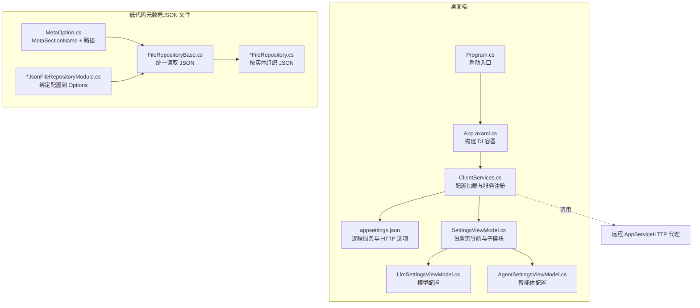
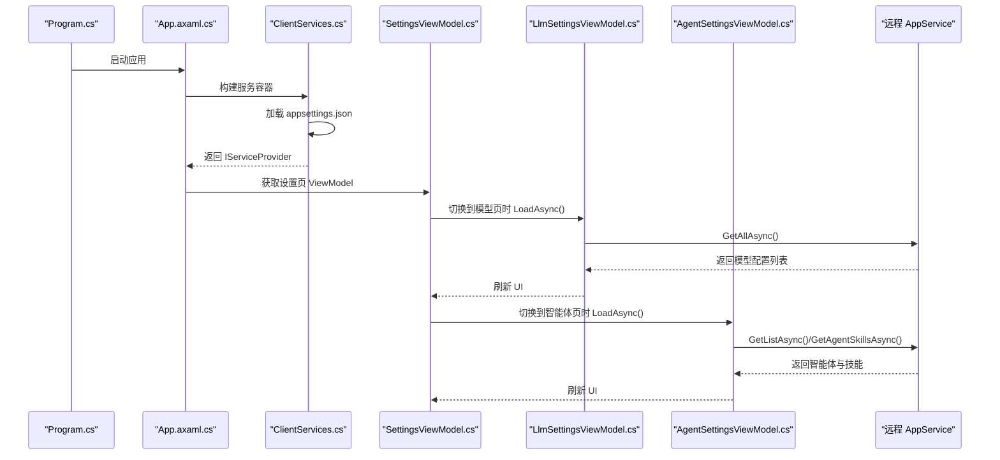
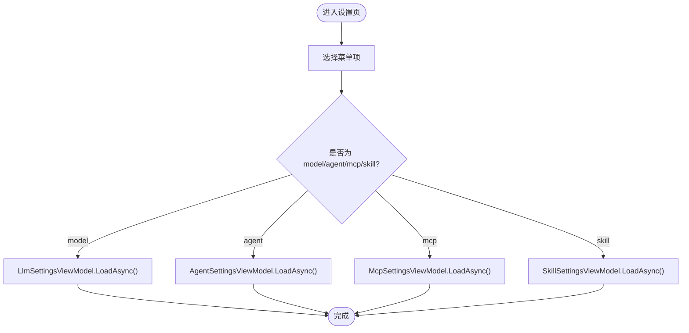
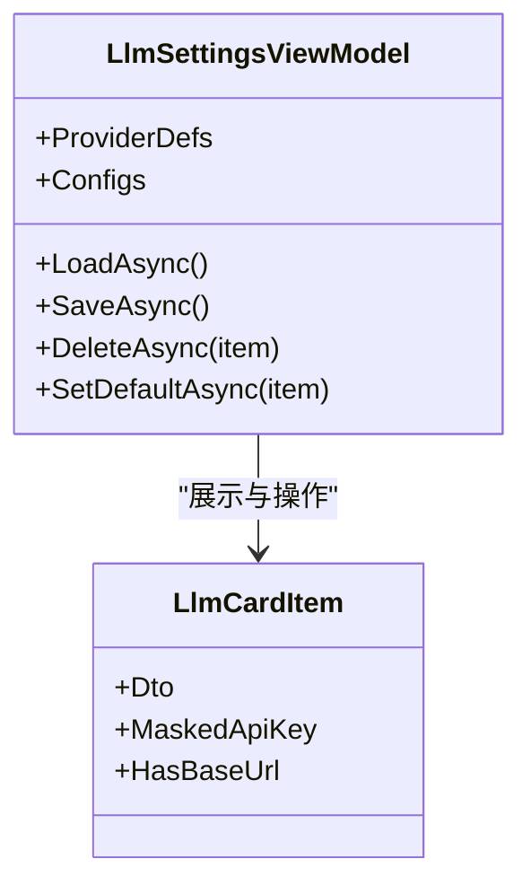
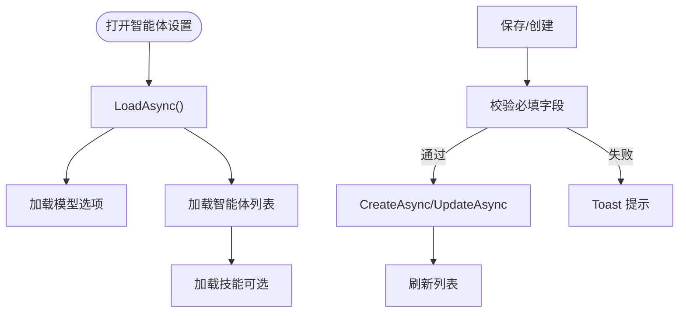
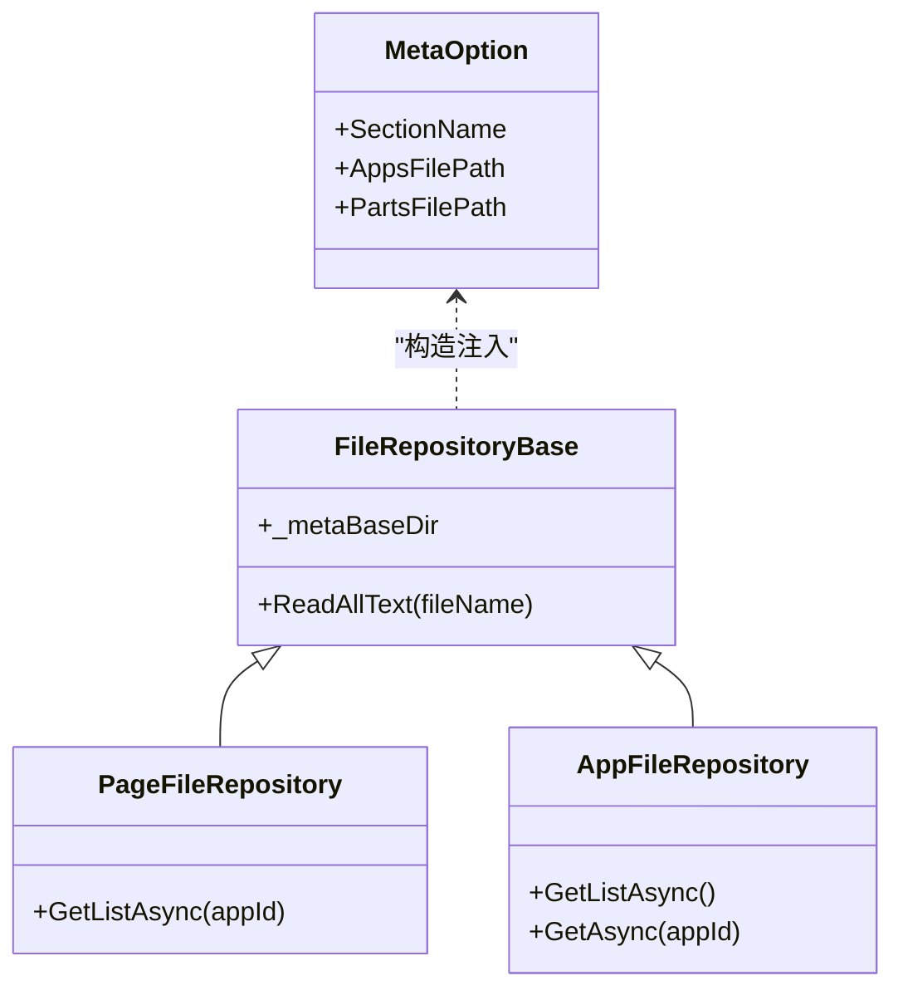
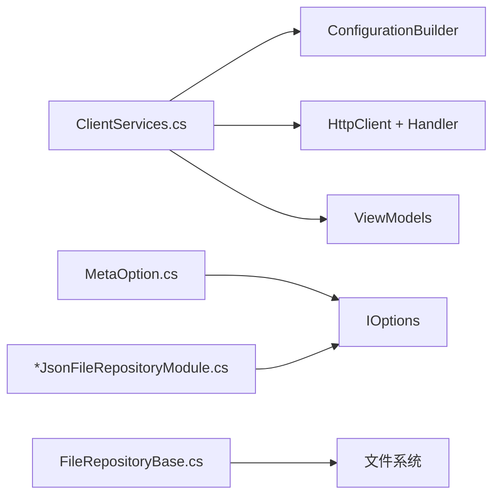

# 配置管理

<cite>
**本文引用的文件**   
- [SettingsViewModel.cs](file://src/Agent/Assistant/H.Assistant.Desktop/ViewModels/SettingsViewModel.cs)
- [LlmSettingsViewModel.cs](file://src/Agent/Assistant/H.Assistant.Desktop/ViewModels/LlmSettingsViewModel.cs)
- [AgentSettingsViewModel.cs](file://src/Agent/Assistant/H.Assistant.Desktop/ViewModels/AgentSettingsViewModel.cs)
- [ClientServices.cs](file://src/Agent/Assistant/H.Assistant.Desktop/ClientServices.cs)
- [App.axaml.cs](file://src/Agent/Assistant/H.Assistant.Desktop/App.axaml.cs)
- [Program.cs](file://src/Agent/Assistant/H.Assistant.Desktop/Program.cs)
- [appsettings.json（桌面端）](file://src/Agent/Assistant/H.Assistant.Desktop/appsettings.json)
- [MetaOption.cs](file://src/LowCode/Common/H.LowCode.Configuration/Options/MetaOption.cs)
- [FileRepositoryBase.cs（设计引擎）](file://src/LowCode/DesignEngine/H.LowCode.DesignEngine.Repository.JsonFile/Base/FileRepositoryBase.cs)
- [FileRepositoryBase.cs（渲染引擎）](file://src/LowCode/RenderEngine/H.LowCode.RenderEngine.Repository.JsonFile/Base/FileRepositoryBase.cs)
- [DesignEngineJsonFileRepositoryModule.cs](file://src/LowCode/DesignEngine/H.LowCode.DesignEngine.Repository.JsonFile/DesignEngineJsonFileRepositoryModule.cs)
- [RenderEngineJsonFileRepositoryModule.cs](file://src/LowCode/RenderEngine/H.LowCode.RenderEngine.Repository.JsonFile/RenderEngineJsonFileRepositoryModule.cs)
- [PageFileRepository.cs](file://src/LowCode/DesignEngine/H.LowCode.DesignEngine.Repository.JsonFile/Repositories/PageFileRepository.cs)
- [AppFileRepository.cs（设计引擎）](file://src/LowCode/DesignEngine/H.LowCode.DesignEngine.Repository.JsonFile/Repositories/AppFileRepository.cs)
- [AppFileRepository.cs（渲染引擎）](file://src/LowCode/RenderEngine/H.LowCode.RenderEngine.Repository.JsonFile/Repositories/AppFileRepository.cs)
- [H.LowCode.DbMigrator.csproj](file://src/Tools/H.LowCode.DbMigrator/H.LowCode.DbMigrator.csproj)
- [appsettings.json（DbMigrator）](file://src/Tools/H.LowCode.DbMigrator/appsettings.json)
</cite>

## 目录
1. [简介](#简介)
2. [项目结构](#项目结构)
3. [核心组件](#核心组件)
4. [架构总览](#架构总览)
5. [详细组件分析](#详细组件分析)
6. [依赖关系分析](#依赖关系分析)
7. [性能考虑](#性能考虑)
8. [故障排查指南](#故障排查指南)
9. [结论](#结论)
10. [附录：安全与加密建议](#附录安全与加密建议)

## 简介
本文件面向桌面端应用的配置管理系统，聚焦于基于 JSON 的配置结构与用途、SettingsViewModel 的加载/验证/持久化机制、环境特定配置与默认值处理、配置热重载与界面同步更新、配置迁移与版本兼容性，以及敏感信息保护方案。文档以代码仓库中的实际实现为依据，结合可视化图示帮助读者快速理解整体设计与关键流程。

## 项目结构
桌面端应用使用 Avalonia 框架，通过独立的 appsettings.json 提供运行时配置；客户端服务注册在 ClientServices 中完成，包括远程服务代理、HTTP 客户端与 ViewModel 生命周期管理。低代码模块采用“JSON 文件即元数据”的模式，通过 MetaOption 与 FileRepositoryBase 系列实现对 JSON 配置的读取与解析。

图表来源
- [Program.cs:1-20](file://src/Agent/Assistant/H.Assistant.Desktop/Program.cs#L1-L20)
- [App.axaml.cs:1-37](file://src/Agent/Assistant/H.Assistant.Desktop/App.axaml.cs#L1-L37)
- [ClientServices.cs:1-61](file://src/Agent/Assistant/H.Assistant.Desktop/ClientServices.cs#L1-L61)
- [appsettings.json（桌面端）:1-11](file://src/Agent/Assistant/H.Assistant.Desktop/appsettings.json#L1-L11)
- [SettingsViewModel.cs:1-121](file://src/Agent/Assistant/H.Assistant.Desktop/ViewModels/SettingsViewModel.cs#L1-L121)
- [LlmSettingsViewModel.cs:1-310](file://src/Agent/Assistant/H.Assistant.Desktop/ViewModels/LlmSettingsViewModel.cs#L1-L310)
- [AgentSettingsViewModel.cs:1-420](file://src/Agent/Assistant/H.Assistant.Desktop/ViewModels/AgentSettingsViewModel.cs#L1-L420)
- [MetaOption.cs:1-16](file://src/LowCode/Common/H.LowCode.Configuration/Options/MetaOption.cs#L1-L16)
- [FileRepositoryBase.cs（设计引擎）:1-30](file://src/LowCode/DesignEngine/H.LowCode.DesignEngine.Repository.JsonFile/Base/FileRepositoryBase.cs#L1-L30)
- [FileRepositoryBase.cs（渲染引擎）:1-31](file://src/LowCode/RenderEngine/H.LowCode.RenderEngine.Repository.JsonFile/Base/FileRepositoryBase.cs#L1-L31)
- [DesignEngineJsonFileRepositoryModule.cs:1-25](file://src/LowCode/DesignEngine/H.LowCode.DesignEngine.Repository.JsonFile/DesignEngineJsonFileRepositoryModule.cs#L1-L25)
- [RenderEngineJsonFileRepositoryModule.cs:1-22](file://src/LowCode/RenderEngine/H.LowCode.RenderEngine.Repository.JsonFile/RenderEngineJsonFileRepositoryModule.cs#L1-L22)

章节来源
- [Program.cs:1-20](file://src/Agent/Assistant/H.Assistant.Desktop/Program.cs#L1-L20)
- [App.axaml.cs:1-37](file://src/Agent/Assistant/H.Assistant.Desktop/App.axaml.cs#L1-L37)
- [ClientServices.cs:1-61](file://src/Agent/Assistant/H.Assistant.Desktop/ClientServices.cs#L1-L61)
- [appsettings.json（桌面端）:1-11](file://src/Agent/Assistant/H.Assistant.Desktop/appsettings.json#L1-L11)

## 核心组件
- SettingsViewModel：负责设置页菜单切换与子模块（模型、智能体、技能、MCP）的懒加载，通用主题与语言为本地状态，不持久化。
- LlmSettingsViewModel：模型配置 CRUD、默认模型设置、API Key 掩码展示、错误提示与加载状态管理。
- AgentSettingsViewModel：智能体配置 CRUD、默认模型选择、技能分组筛选与关联、启用/禁用开关。
- ClientServices：集中构建配置、注册远程服务代理、HTTP 客户端（含证书策略）、ViewModel 单例。
- MetaOption 与 FileRepositoryBase：低代码元数据的 JSON 文件路径与统一读取封装。
- *JsonFileRepositoryModule：将配置节绑定到 Options，并注入具体 Repository 实现。

章节来源
- [SettingsViewModel.cs:1-121](file://src/Agent/Assistant/H.Assistant.Desktop/ViewModels/SettingsViewModel.cs#L1-L121)
- [LlmSettingsViewModel.cs:1-310](file://src/Agent/Assistant/H.Assistant.Desktop/ViewModels/LlmSettingsViewModel.cs#L1-L310)
- [AgentSettingsViewModel.cs:1-420](file://src/Agent/Assistant/H.Assistant.Desktop/ViewModels/AgentSettingsViewModel.cs#L1-L420)
- [ClientServices.cs:1-61](file://src/Agent/Assistant/H.Assistant.Desktop/ClientServices.cs#L1-L61)
- [MetaOption.cs:1-16](file://src/LowCode/Common/H.LowCode.Configuration/Options/MetaOption.cs#L1-L16)
- [FileRepositoryBase.cs（设计引擎）:1-30](file://src/LowCode/DesignEngine/H.LowCode.DesignEngine.Repository.JsonFile/Base/FileRepositoryBase.cs#L1-L30)
- [FileRepositoryBase.cs（渲染引擎）:1-31](file://src/LowCode/RenderEngine/H.LowCode.RenderEngine.Repository.JsonFile/Base/FileRepositoryBase.cs#L1-L31)
- [DesignEngineJsonFileRepositoryModule.cs:1-25](file://src/LowCode/DesignEngine/H.LowCode.DesignEngine.Repository.JsonFile/DesignEngineJsonFileRepositoryModule.cs#L1-L25)
- [RenderEngineJsonFileRepositoryModule.cs:1-22](file://src/LowCode/RenderEngine/H.LowCode.RenderEngine.Repository.JsonFile/RenderEngineJsonFileRepositoryModule.cs#L1-L22)

## 架构总览
桌面端通过 ClientServices 构建配置与 DI 容器，SettingsViewModel 作为设置中心协调各子模块。低代码模块通过 MetaOption 与 FileRepositoryBase 抽象出统一的 JSON 文件访问层，由具体 Repository 实现按实体组织 JSON 文件。

图表来源
- [Program.cs:1-20](file://src/Agent/Assistant/H.Assistant.Desktop/Program.cs#L1-L20)
- [App.axaml.cs:1-37](file://src/Agent/Assistant/H.Assistant.Desktop/App.axaml.cs#L1-L37)
- [ClientServices.cs:1-61](file://src/Agent/Assistant/H.Assistant.Desktop/ClientServices.cs#L1-L61)
- [SettingsViewModel.cs:1-121](file://src/Agent/Assistant/H.Assistant.Desktop/ViewModels/SettingsViewModel.cs#L1-L121)
- [LlmSettingsViewModel.cs:1-310](file://src/Agent/Assistant/H.Assistant.Desktop/ViewModels/LlmSettingsViewModel.cs#L1-L310)
- [AgentSettingsViewModel.cs:1-420](file://src/Agent/Assistant/H.Assistant.Desktop/ViewModels/AgentSettingsViewModel.cs#L1-L420)

## 详细组件分析

### SettingsViewModel：设置页导航与子模块协调
- 功能要点
  - 维护 ActiveMenu 与多个 IsXxx 计算属性，驱动界面显示。
  - 通用主题与语言为内存状态，未做持久化。
  - 按需加载子模块：模型、智能体、技能、MCP。
- 交互流程
  - SelectMenu(key) 触发 LoadActiveMenuAsync，根据 key 调用对应子模块 LoadAsync。
- 注意事项
  - 当前通用设置未持久化，如需跨会话保存需扩展存储层。

图表来源
- [SettingsViewModel.cs:1-121](file://src/Agent/Assistant/H.Assistant.Desktop/ViewModels/SettingsViewModel.cs#L1-L121)

章节来源
- [SettingsViewModel.cs:1-121](file://src/Agent/Assistant/H.Assistant.Desktop/ViewModels/SettingsViewModel.cs#L1-L121)

### LlmSettingsViewModel：模型配置管理
- 功能要点
  - Provider 预设与模型建议，编辑/新增/删除/设为默认。
  - 加载失败与保存失败均通过 ToastService 提示。
  - API Key 在前端进行掩码展示，避免泄露。
- 数据流
  - LoadAsync -> GetAllAsync -> 填充 Configs。
  - SaveAsync -> CreateAsync/UpdateAsync -> 刷新列表。
- 默认值
  - 温度、最大令牌数等参数有合理默认值。

图表来源
- [LlmSettingsViewModel.cs:1-310](file://src/Agent/Assistant/H.Assistant.Desktop/ViewModels/LlmSettingsViewModel.cs#L1-L310)

章节来源
- [LlmSettingsViewModel.cs:1-310](file://src/Agent/Assistant/H.Assistant.Desktop/ViewModels/LlmSettingsViewModel.cs#L1-L310)

### AgentSettingsViewModel：智能体配置管理
- 功能要点
  - 智能体 CRUD、默认模型选择、技能分组筛选与关联。
  - 支持启用/禁用切换，失败时提示。
- 数据流
  - LoadAsync -> 加载模型选项与智能体列表 -> 按需加载技能。
  - SaveAsync -> CreateAsync/UpdateAsync -> 刷新列表。

图表来源
- [AgentSettingsViewModel.cs:1-420](file://src/Agent/Assistant/H.Assistant.Desktop/ViewModels/AgentSettingsViewModel.cs#L1-L420)

章节来源
- [AgentSettingsViewModel.cs:1-420](file://src/Agent/Assistant/H.Assistant.Desktop/ViewModels/AgentSettingsViewModel.cs#L1-L420)

### 低代码元数据：JSON 文件即配置
- MetaOption：定义配置节名称与路径（如 appsFilePath、partsFilePath）。
- FileRepositoryBase：统一读取 JSON 文本，抛出或返回空结果，屏蔽细节。
- 具体 Repository：按实体组织 JSON 文件（如 page/{id}.json），实现 GetList/Get/Save 等。
- Module 绑定：在 *JsonFileRepositoryModule 中将配置节绑定到 Options，并注册 Repository。

图表来源
- [MetaOption.cs:1-16](file://src/LowCode/Common/H.LowCode.Configuration/Options/MetaOption.cs#L1-L16)
- [FileRepositoryBase.cs（设计引擎）:1-30](file://src/LowCode/DesignEngine/H.LowCode.DesignEngine.Repository.JsonFile/Base/FileRepositoryBase.cs#L1-L30)
- [FileRepositoryBase.cs（渲染引擎）:1-31](file://src/LowCode/RenderEngine/H.LowCode.RenderEngine.Repository.JsonFile/Base/FileRepositoryBase.cs#L1-L31)
- [PageFileRepository.cs:1-41](file://src/LowCode/DesignEngine/H.LowCode.DesignEngine.Repository.JsonFile/Repositories/PageFileRepository.cs#L1-L41)
- [AppFileRepository.cs（设计引擎）:1-43](file://src/LowCode/DesignEngine/H.LowCode.DesignEngine.Repository.JsonFile/Repositories/AppFileRepository.cs#L1-L43)
- [AppFileRepository.cs（渲染引擎）:1-51](file://src/LowCode/RenderEngine/H.LowCode.RenderEngine.Repository.JsonFile/Repositories/AppFileRepository.cs#L1-L51)

章节来源
- [MetaOption.cs:1-16](file://src/LowCode/Common/H.LowCode.Configuration/Options/MetaOption.cs#L1-L16)
- [FileRepositoryBase.cs（设计引擎）:1-30](file://src/LowCode/DesignEngine/H.LowCode.DesignEngine.Repository.JsonFile/Base/FileRepositoryBase.cs#L1-L30)
- [FileRepositoryBase.cs（渲染引擎）:1-31](file://src/LowCode/RenderEngine/H.LowCode.RenderEngine.Repository.JsonFile/Base/FileRepositoryBase.cs#L1-L31)
- [PageFileRepository.cs:1-41](file://src/LowCode/DesignEngine/H.LowCode.DesignEngine.Repository.JsonFile/Repositories/PageFileRepository.cs#L1-L41)
- [AppFileRepository.cs（设计引擎）:1-43](file://src/LowCode/DesignEngine/H.LowCode.DesignEngine.Repository.JsonFile/Repositories/AppFileRepository.cs#L1-L43)
- [AppFileRepository.cs（渲染引擎）:1-51](file://src/LowCode/RenderEngine/H.LowCode.RenderEngine.Repository.JsonFile/Repositories/AppFileRepository.cs#L1-L51)

## 依赖关系分析
- 桌面端依赖
  - Microsoft.Extensions.Configuration：加载 appsettings.json。
  - HttpClient 与自定义证书策略：允许开发环境自签名证书。
  - CommunityToolkit.Mvvm：ObservableObject、RelayCommand 等 MVVM 基础能力。
- 低代码模块依赖
  - Microsoft.Extensions.Options：将配置节绑定到 Options。
  - Volo.Abp.Modularity：模块装配与依赖声明。

图表来源
- [ClientServices.cs:1-61](file://src/Agent/Assistant/H.Assistant.Desktop/ClientServices.cs#L1-L61)
- [MetaOption.cs:1-16](file://src/LowCode/Common/H.LowCode.Configuration/Options/MetaOption.cs#L1-L16)
- [FileRepositoryBase.cs（设计引擎）:1-30](file://src/LowCode/DesignEngine/H.LowCode.DesignEngine.Repository.JsonFile/Base/FileRepositoryBase.cs#L1-L30)
- [DesignEngineJsonFileRepositoryModule.cs:1-25](file://src/LowCode/DesignEngine/H.LowCode.DesignEngine.Repository.JsonFile/DesignEngineJsonFileRepositoryModule.cs#L1-L25)

章节来源
- [ClientServices.cs:1-61](file://src/Agent/Assistant/H.Assistant.Desktop/ClientServices.cs#L1-L61)
- [MetaOption.cs:1-16](file://src/LowCode/Common/H.LowCode.Configuration/Options/MetaOption.cs#L1-L16)
- [FileRepositoryBase.cs（设计引擎）:1-30](file://src/LowCode/DesignEngine/H.LowCode.DesignEngine.Repository.JsonFile/Base/FileRepositoryBase.cs#L1-L30)
- [DesignEngineJsonFileRepositoryModule.cs:1-25](file://src/LowCode/DesignEngine/H.LowCode.DesignEngine.Repository.JsonFile/DesignEngineJsonFileRepositoryModule.cs#L1-L25)

## 性能考虑
- 懒加载：SettingsViewModel 仅在切换菜单时加载对应子模块，减少初始开销。
- 列表缓存：LlmSettingsViewModel.Configs 与 AgentSettingsViewModel.Agents 使用集合缓存，避免重复请求。
- 文件 IO：FileRepositoryBase 统一读取 JSON，注意大文件时的异步与缓冲策略。
- 网络请求：远程 AppService 调用应配合重试与超时控制（可在 HttpClient 层面扩展）。

[本节为通用指导，无需引用具体文件]

## 故障排查指南
- 无法加载模型配置
  - 检查远程服务 BaseUrl 是否正确（appsettings.json 的 RemoteServices:Assistant:BaseUrl）。
  - 确认网络连通性与证书策略（Http:AllowInvalidCertificates）。
- 保存失败
  - 查看 Toast 提示的错误信息，定位服务端异常或参数校验失败。
- 低代码 JSON 文件找不到
  - 检查 MetaOption.AppsFilePath/PartsFilePath 指向的路径是否存在。
  - 确认 FileRepositoryBase 的 ReadAllText 是否抛出 FileNotFoundException。

章节来源
- [appsettings.json（桌面端）:1-11](file://src/Agent/Assistant/H.Assistant.Desktop/appsettings.json#L1-L11)
- [ClientServices.cs:1-61](file://src/Agent/Assistant/H.Assistant.Desktop/ClientServices.cs#L1-L61)
- [FileRepositoryBase.cs（设计引擎）:1-30](file://src/LowCode/DesignEngine/H.LowCode.DesignEngine.Repository.JsonFile/Base/FileRepositoryBase.cs#L1-L30)
- [FileRepositoryBase.cs（渲染引擎）:1-31](file://src/LowCode/RenderEngine/H.LowCode.RenderEngine.Repository.JsonFile/Base/FileRepositoryBase.cs#L1-L31)

## 结论
桌面端配置管理以 appsettings.json 为核心，结合 ClientServices 完成服务注册与远程调用；SettingsViewModel 作为设置中心协调各子模块，实现按需加载与界面同步。低代码模块通过 MetaOption 与 FileRepositoryBase 抽象出统一的 JSON 文件访问层，便于扩展与维护。建议在后续迭代中补充通用设置的持久化、配置热重载与敏感信息加密，以提升用户体验与安全性。

[本节为总结性内容，无需引用具体文件]

## 附录：安全与加密建议
- 敏感信息
  - API Key/Secret 不应明文存储在 appsettings.json；建议使用操作系统密钥库或环境变量注入。
  - 前端仅展示掩码，后端对敏感字段进行脱敏与最小权限访问。
- 传输安全
  - 生产环境禁用 AllowInvalidCertificates，强制 HTTPS。
- 配置版本兼容
  - 引入配置迁移脚本，确保旧版 JSON 结构平滑升级。
- 审计与日志
  - 记录配置变更事件，便于问题回溯与合规审计。

[本节为通用建议，无需引用具体文件]