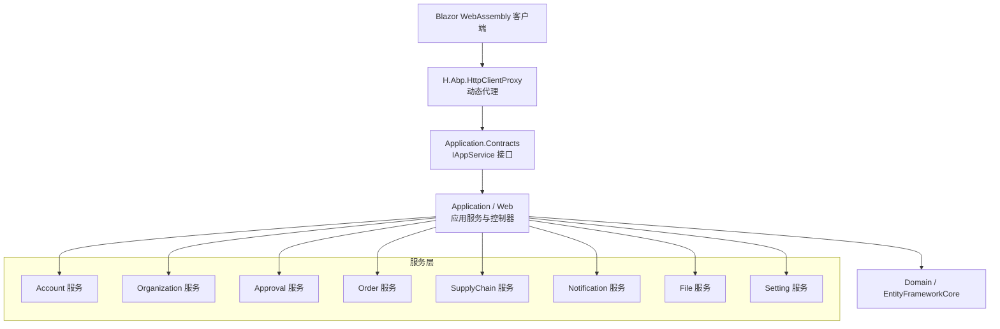
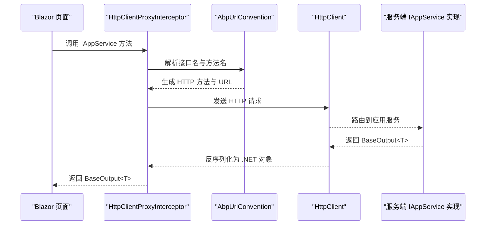
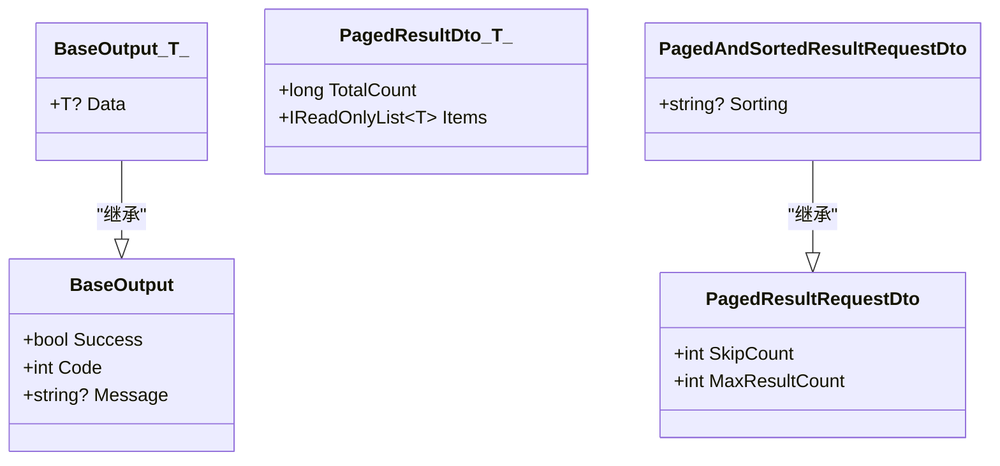
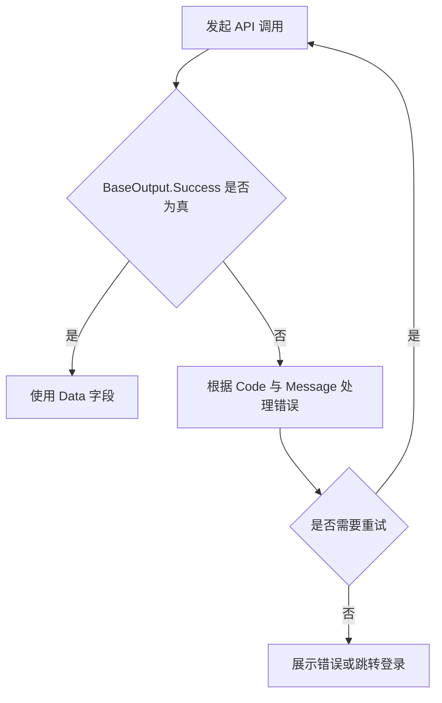

# API 参考文档

<cite>
**本文引用的文件**   
- [README.md](file://README.md)
- [IAppService.cs](file://src/Utils/H.Abp.Application.Contracts/IAppService.cs)
- [ICrudAppService.cs](file://src/Utils/H.Abp.Application.Contracts/ICrudAppService.cs)
- [PagedResultDto.cs](file://src/Utils/H.Abp.Application.Contracts/PagedResultDto.cs)
- [PagedResultRequestDto.cs](file://src/Utils/H.Abp.Application.Contracts/PagedResultRequestDto.cs)
- [PagedAndSortedResultRequestDto.cs](file://src/Utils/H.Abp.Application.Contracts/PagedAndSortedResultRequestDto.cs)
- [BaseOutput.cs](file://src/Utils/H.Util.Base/BaseOutput.cs)
- [AbpUrlConvention.cs](file://src/Utils/H.Abp.HttpClientProxy/AbpUrlConvention.cs)
- [HttpClientProxyInterceptor.cs](file://src/Utils/H.Abp.HttpClientProxy/HttpClientProxyInterceptor.cs)
- [ServiceCollectionExtensions.cs](file://src/Utils/H.Abp.HttpClientProxy/ServiceCollectionExtensions.cs)
- [RemoteServiceOptions.cs](file://src/Utils/H.Abp.HttpClientProxy/RemoteServiceOptions.cs)
- [ExternalLoginController.cs](file://src/Services/Account/H.Account.Application/ExternalLogin/ExternalLoginController.cs)
- [FileDownloadController.cs](file://src/Services/File/H.File.Application/Controllers/FileDownloadController.cs)
</cite>

## 目录
1. [引言](#引言)
2. [项目结构与 API 边界](#项目结构与-api-边界)
3. [API 设计规范总则](#api-设计规范总则)
4. [动态 HTTP 代理调用机制](#动态-http-代理调用机制)
5. [统一请求与响应模型](#统一请求与响应模型)
6. [认证与授权](#认证与授权)
7. [业务领域 API 分类](#业务领域-api-分类)
8. [错误处理与诊断](#错误处理与诊断)
9. [性能、限流与版本管理](#性能限流与版本管理)
10. [常见问题排查](#常见问题排查)
11. [结论](#结论)

## 引言
本参考文档面向 AppLab 平台开发者，说明基于 ABP Framework 风格的 RESTful API 设计约定，以及通过 `IAppService` 接口自动生成客户端调用的动态 HTTP 代理机制。平台采用模块化架构，支持单体部署和按服务独立部署；前端在 Blazor WebAssembly 中仅依赖契约层接口，无需手写 HTTP 请求。

平台 README 明确说明：
- Host 是宿主程序，负责服务注册；业务逻辑位于 Services 各限界上下文。
- 前端基于 `IAppService` 动态调用 HTTP，通过 `DispatchProxy` 拦截接口方法，按 ABP 路由约定转换为 HTTP 请求。
- 同一套接口在服务端为进程内实现，在 WebAssembly 客户端为 HTTP 代理实现。

**章节来源**
- [README.md:1-73](file://README.md#L1-L73)

## 项目结构与 API 边界
AppLab 的 API 主要分布在以下位置：
- `src/Services`：企业级业务服务，如 Account、Organization、Approval、Order、SupplyChain、Notification、File、Setting、BackgroundTask、Testing、Portal。
- `src/System`：系统级应用 Enterprise、SystemPortal。
- `src/Host`：Web 宿主、桌面宿主及客户端模块。
- `src/Utils`：公共契约、HTTP 动态代理、基础输出包装等。

**图表来源**
- [README.md:1-73](file://README.md#L1-L73)

**章节来源**
- [README.md:1-73](file://README.md#L1-L73)

## API 设计规范总则
### URL 模式
- 服务级根路径通常由宿主或远端服务配置决定，并通过 `RemoteServiceOptions` 统一管理。
- 具体资源路径由 ABP 风格的路由约定生成：接口名与方法名组合映射到 HTTP 路径。例如查询类方法映射为 GET，创建类方法映射为 POST。
- 控制器式直接暴露的端点（如外部登录、文件下载）使用传统 ASP.NET Core 控制器路由。

### HTTP 方法约定
- 读取类操作：GET。
- 创建类操作：POST。
- 更新类操作：PUT。
- 删除类操作：DELETE。
- 复杂对象作为请求体时，优先使用 JSON 正文；简单参数可通过查询字符串传递。

### 请求与响应格式
- 所有应用服务返回统一包装类型 `BaseOutput<T>`。
- 分页查询返回 `BaseOutput<PagedResultDto<T>>`。
- 分页请求使用 `PagedResultRequestDto` 或 `PagedAndSortedResultRequestDto`。

### 错误码定义
- `BaseOutput.Success`：表示业务调用是否成功。
- `BaseOutput.Code`：业务状态码，默认成功为 `0`，失败可自定义非零值。
- `BaseOutput.Message`：人类可读的错误或提示信息。
- 未捕获异常由 ABP 框架或宿主中间件转换为 HTTP 错误响应；业务错误建议通过 `BaseOutput` 返回。

**章节来源**
- [IAppService.cs:1-8](file://src/Utils/H.Abp.Application.Contracts/IAppService.cs#L1-L8)
- [ICrudAppService.cs:1-15](file://src/Utils/H.Abp.Application.Contracts/ICrudAppService.cs#L1-L15)
- [PagedResultDto.cs:1-19](file://src/Utils/H.Abp.Application.Contracts/PagedResultDto.cs#L1-L19)
- [PagedResultRequestDto.cs:1-11](file://src/Utils/H.Abp.Application.Contracts/PagedResultRequestDto.cs#L1-L11)
- [PagedAndSortedResultRequestDto.cs:1-9](file://src/Utils/H.Abp.Application.Contracts/PagedAndSortedResultRequestDto.cs#L1-L9)
- [BaseOutput.cs:1-52](file://src/Utils/H.Util.Base/BaseOutput.cs#L1-L52)

## 动态 HTTP 代理调用机制
AppLab 不要求前端手写 `HttpClient` 请求，而是通过以下组件完成：

1. **契约接口**：业务接口继承 `IAppService`，CRUD 场景可直接继承 `ICrudAppService<TEntityDto, TKey, TGetListInput, TCreateInput, TUpdateInput>`。
2. **URL 约定**：`AbpUrlConvention` 将接口名与方法名转换为 ABP 风格 URL。
3. **拦截器**：`HttpClientProxyInterceptor` 拦截接口方法调用，按约定构造 HTTP 请求并反序列化响应。
4. **服务注册**：`ServiceCollectionExtensions.AddHttpClientProxies` 扫描程序集中所有 `IAppService` 接口并批量注册代理。
5. **远程地址**：`RemoteServiceOptions` 提供远端服务基地址，便于多环境切换。

**图表来源**
- [AbpUrlConvention.cs](file://src/Utils/H.Abp.HttpClientProxy/AbpUrlConvention.cs)
- [HttpClientProxyInterceptor.cs](file://src/Utils/H.Abp.HttpClientProxy/HttpClientProxyInterceptor.cs)
- [ServiceCollectionExtensions.cs](file://src/Utils/H.Abp.HttpClientProxy/ServiceCollectionExtensions.cs)
- [RemoteServiceOptions.cs](file://src/Utils/H.Abp.HttpClientProxy/RemoteServiceOptions.cs)
- [IAppService.cs:1-8](file://src/Utils/H.Abp.Application.Contracts/IAppService.cs#L1-L8)
- [ICrudAppService.cs:1-15](file://src/Utils/H.Abp.Application.Contracts/ICrudAppService.cs#L1-L15)

**章节来源**
- [README.md:1-73](file://README.md#L1-L73)
- [AbpUrlConvention.cs](file://src/Utils/H.Abp.HttpClientProxy/AbpUrlConvention.cs)
- [HttpClientProxyInterceptor.cs](file://src/Utils/H.Abp.HttpClientProxy/HttpClientProxyInterceptor.cs)
- [ServiceCollectionExtensions.cs](file://src/Utils/H.Abp.HttpClientProxy/ServiceCollectionExtensions.cs)
- [RemoteServiceOptions.cs](file://src/Utils/H.Abp.HttpClientProxy/RemoteServiceOptions.cs)

## 统一请求与响应模型
### BaseOutput
- `Success`：布尔值，表示业务结果是否成功。
- `Code`：整型业务码，默认成功为 `0`。
- `Message`：可选消息字段。
- `BaseOutput<T>.Data`：泛型数据字段。

### PagedResultDto<T>
- `TotalCount`：总记录数。
- `Items`：当前页数据集合。

### PagedResultRequestDto
- `SkipCount`：跳过记录数。
- `MaxResultCount`：每页最大记录数，默认 `10`。

### PagedAndSortedResultRequestDto
- 继承分页请求，新增 `Sorting` 排序字段。

**图表来源**
- [BaseOutput.cs:1-52](file://src/Utils/H.Util.Base/BaseOutput.cs#L1-L52)
- [PagedResultDto.cs:1-19](file://src/Utils/H.Abp.Application.Contracts/PagedResultDto.cs#L1-L19)
- [PagedResultRequestDto.cs:1-11](file://src/Utils/H.Abp.Application.Contracts/PagedResultRequestDto.cs#L1-L11)
- [PagedAndSortedResultRequestDto.cs:1-9](file://src/Utils/H.Abp.Application.Contracts/PagedAndSortedResultRequestDto.cs#L1-L9)

**章节来源**
- [BaseOutput.cs:1-52](file://src/Utils/H.Util.Base/BaseOutput.cs#L1-L52)
- [PagedResultDto.cs:1-19](file://src/Utils/H.Abp.Application.Contracts/PagedResultDto.cs#L1-L19)
- [PagedResultRequestDto.cs:1-11](file://src/Utils/H.Abp.Application.Contracts/PagedResultRequestDto.cs#L1-L11)
- [PagedAndSortedResultRequestDto.cs:1-9](file://src/Utils/H.Abp.Application.Contracts/PagedAndSortedResultRequestDto.cs#L1-L9)

## 认证与授权
### 认证方式
- 平台基于 ABP 的认证体系，常见方式为 Cookie 或 JWT。
- 部分外部登录流程可能通过专用控制器暴露，例如钉钉等第三方登录回调。

### 授权方式
- 基于角色或策略的访问控制。
- 敏感接口应标注权限标识，确保只有具备相应权限的用户可调用。

### 外部登录示例
`ExternalLoginController` 属于 Account 服务的直接控制器，用于处理外部登录相关流程。该控制器不是典型的 `IAppService` 接口，而是传统 Web 控制器端点。

**章节来源**
- [ExternalLoginController.cs](file://src/Services/Account/H.Account.Application/ExternalLogin/ExternalLoginController.cs)

## 业务领域 API 分类
以下按领域划分 API 职责。由于本仓库以 C# 服务实现为主，本文档不直接枚举每个方法的完整 HTTP 路径，而是说明契约接口、典型 CRUD 行为、分页与排序约定，以及如何通过动态代理调用。

### Account（用户认证、权限管理）
- 典型能力：用户登录、获取当前用户信息、外部登录回调、权限相关查询。
- 调用方式：
  - 若对应接口继承 `IAppService`，前端通过注入的代理接口直接调用。
  - 若为控制器端点（如外部登录），则由 `ExternalLoginController` 暴露。
- 返回值：通常为 `BaseOutput<T>`，其中 T 为用户信息或操作结果。

**章节来源**
- [ExternalLoginController.cs](file://src/Services/Account/H.Account.Application/ExternalLogin/ExternalLoginController.cs)
- [IAppService.cs:1-8](file://src/Utils/H.Abp.Application.Contracts/IAppService.cs#L1-L8)

### Organization（组织架构、部门管理）
- 典型能力：组织树查询、部门增删改查、成员管理、邀请管理等。
- 典型接口命名：`IOrganizationAppService`、`IMemberAppService`、`IRoleAppService`、`IOrgInviteAppService`。
- 典型行为：
  - 获取组织树：GET 或 POST 列表查询。
  - 新增组织/成员：POST。
  - 更新组织/成员：PUT。
  - 删除组织/成员：DELETE。
  - 分页列表：`PagedAndSortedResultRequestDto`。

**章节来源**
- [ICrudAppService.cs:1-15](file://src/Utils/H.Abp.Application.Contracts/ICrudAppService.cs#L1-L15)
- [PagedAndSortedResultRequestDto.cs:1-9](file://src/Utils/H.Abp.Application.Contracts/PagedAndSortedResultRequestDto.cs#L1-L9)

### Approval（审批流程、待办事项）
- 典型能力：审批定义、审批实例、审批任务、审批分类管理。
- 典型接口命名：`IApprovalDefinitionAppService`、`IApprovalInstanceAppService`、`IApprovalTaskAppService`、`IApprovalCategoryAppService`。
- 典型行为：
  - 查询待办：列表分页查询。
  - 审批操作：提交、通过、拒绝等方法，通常映射为 PUT 或 POST。
  - 返回 `BaseOutput` 或 `BaseOutput<T>`。

**章节来源**
- [ICrudAppService.cs:1-15](file://src/Utils/H.Abp.Application.Contracts/ICrudAppService.cs#L1-L15)
- [BaseOutput.cs:1-52](file://src/Utils/H.Util.Base/BaseOutput.cs#L1-L52)

### Order（订单 CRUD、状态流转）
- 典型能力：订单增删改查、供应商管理、调度引擎、路由引擎等。
- 典型接口命名：`IOrderAppService`、`IServices`。
- 典型行为：
  - 订单创建：POST。
  - 订单查询：GET 或分页列表。
  - 订单状态变更：PUT 或专用状态方法。
  - 分页与排序：`PagedResultRequestDto`、`PagedAndSortedResultRequestDto`。

**章节来源**
- [ICrudAppService.cs:1-15](file://src/Utils/H.Abp.Application.Contracts/ICrudAppService.cs#L1-L15)
- [PagedResultRequestDto.cs:1-11](file://src/Utils/H.Abp.Application.Contracts/PagedResultRequestDto.cs#L1-L11)
- [PagedAndSortedResultRequestDto.cs:1-9](file://src/Utils/H.Abp.Application.Contracts/PagedAndSortedResultRequestDto.cs#L1-L9)

### SupplyChain（供应链业务）
- 典型能力：供应链接口管理、供应商接口映射、通用供应链接口调用封装。
- 典型接口命名：`ISupplyChainApiAppService`、`MappingAppServices`、`SupplierInterfaceMappingAppService`。
- 典型行为：
  - 查询供应链接口定义：分页列表。
  - 配置供应商映射：CRUD。
  - 调用外部供应商 API：内部封装后对外暴露为本地 API。

**章节来源**
- [ICrudAppService.cs:1-15](file://src/Utils/H.Abp.Application.Contracts/ICrudAppService.cs#L1-L15)

### Notification（通知发送、订阅管理）
- 典型能力：通知类别、渠道、联系人、联系组、发送记录、业务通知。
- 典型接口命名：`INotificationAppService`、`NotificationChannelAppService`、`NotificationSendAppService` 等。
- 典型行为：
  - 发送通知：POST。
  - 查询通知记录：分页列表。
  - 配置通知渠道：CRUD。

**章节来源**
- [ICrudAppService.cs:1-15](file://src/Utils/H.Abp.Application.Contracts/ICrudAppService.cs#L1-L15)

### File（文件上传下载）
- 典型能力：文件对象管理、项目文件管理、文件下载。
- 典型接口命名：`IFileProjectAppService`、`IFileObjectAppService`。
- 典型行为：
  - 文件上传：POST multipart/form-data。
  - 文件下载：由 `FileDownloadController` 提供下载端点。
  - 文件元数据 CRUD：GET、POST、PUT、DELETE。

**章节来源**
- [FileDownloadController.cs](file://src/Services/File/H.File.Application/Controllers/FileDownloadController.cs)
- [ICrudAppService.cs:1-15](file://src/Utils/H.Abp.Application.Contracts/ICrudAppService.cs#L1-L15)

### Setting（系统设置）
- 典型能力：设置项定义、设置值读写。
- 典型接口命名：`ISettingDefinitionAppService`、`ISettingValueAppService`。
- 典型行为：
  - 查询设置定义：GET 或分页。
  - 写入设置值：POST 或 PUT。
  - 返回 `BaseOutput`。

**章节来源**
- [ICrudAppService.cs:1-15](file://src/Utils/H.Abp.Application.Contracts/ICrudAppService.cs#L1-L15)
- [BaseOutput.cs:1-52](file://src/Utils/H.Util.Base/BaseOutput.cs#L1-L52)

## 错误处理与诊断
### 业务错误
- 返回 `BaseOutput`，其中 `Success=false`，`Code` 为非零业务码，`Message` 描述错误原因。
- 客户端应检查 `Success`，并根据 `Code` 和 `Message` 提示用户或执行重试逻辑。

### 网络与 HTTP 错误
- 由 ABP 或宿主中间件转换，如 401、403、404、500。
- 客户端应区分网络异常、HTTP 状态码和业务错误。

### 调试建议
- 确认远端服务地址是否正确配置于 `RemoteServiceOptions`。
- 确认代理是否已注册：`AddHttpClientProxies` 是否扫描到目标程序集。
- 确认认证头或 Cookie 是否正确携带。

**图表来源**
- [BaseOutput.cs:1-52](file://src/Utils/H.Util.Base/BaseOutput.cs#L1-L52)

**章节来源**
- [BaseOutput.cs:1-52](file://src/Utils/H.Util.Base/BaseOutput.cs#L1-L52)

## 性能、限流与版本管理
### 性能特性
- 分页查询使用 `PagedResultRequestDto` 控制 `SkipCount` 与 `MaxResultCount`，避免一次性拉取大量数据。
- 排序使用 `PagedAndSortedResultRequestDto.Sorting`，减少后端复杂排序逻辑。
- 前端按需加载程序集，降低初始包体积。

### 限流策略
- 当前代码库未直接暴露统一的限流实现细节；限流通常由网关、反向代理或 ABP 中间件配置。
- 建议在入口层对高频接口做限流保护。

### 版本管理
- 远端服务基地址由 `RemoteServiceOptions` 统一管理，可在不同环境配置不同版本前缀。
- 如需强版本控制，可在 URL 约定或服务根路径中加入版本号段。

**章节来源**
- [PagedResultRequestDto.cs:1-11](file://src/Utils/H.Abp.Application.Contracts/PagedResultRequestDto.cs#L1-L11)
- [PagedAndSortedResultRequestDto.cs:1-9](file://src/Utils/H.Abp.Application.Contracts/PagedAndSortedResultRequestDto.cs#L1-L9)
- [RemoteServiceOptions.cs](file://src/Utils/H.Abp.HttpClientProxy/RemoteServiceOptions.cs)
- [README.md:1-73](file://README.md#L1-L73)

## 常见问题排查
- **代理无法调用接口**：检查接口是否继承 `IAppService`，程序集是否被 `AddHttpClientProxies` 扫描。
- **URL 不正确**：检查 `AbpUrlConvention` 与 `RemoteServiceOptions` 的配置。
- **认证失败**：确认外部登录流程是否已完成，Cookie 或 Token 是否有效。
- **文件下载失败**：确认 `FileDownloadController` 可用，且文件存在且权限允许。
- **分页数据为空**：检查 `SkipCount` 与 `MaxResultCount`，确认后端确实有数据。

**章节来源**
- [AbpUrlConvention.cs](file://src/Utils/H.Abp.HttpClientProxy/AbpUrlConvention.cs)
- [HttpClientProxyInterceptor.cs](file://src/Utils/H.Abp.HttpClientProxy/HttpClientProxyInterceptor.cs)
- [ServiceCollectionExtensions.cs](file://src/Utils/H.Abp.HttpClientProxy/ServiceCollectionExtensions.cs)
- [RemoteServiceOptions.cs](file://src/Utils/H.Abp.HttpClientProxy/RemoteServiceOptions.cs)
- [FileDownloadController.cs](file://src/Services/File/H.File.Application/Controllers/FileDownloadController.cs)

## 结论
AppLab 平台的 API 设计以 ABP Framework 风格为基础，通过 `IAppService` 与 `ICrudAppService` 定义契约，再由 `H.Abp.HttpClientProxy` 自动生成 HTTP 客户端调用。统一响应模型 `BaseOutput<T>` 与分页模型 `PagedResultDto<T>` 提供了清晰的错误处理和分页语义。各业务领域围绕这些契约扩展出 Account、Organization、Approval、Order、SupplyChain、Notification、File、Setting 等能力。实际开发中，前端应优先通过注入的代理接口调用 API，而非手写 HTTP 请求，以保持契约一致性和跨环境一致性。