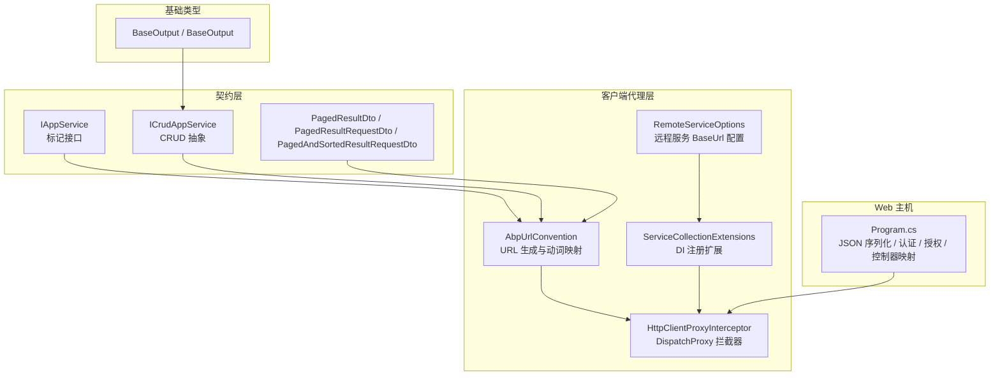
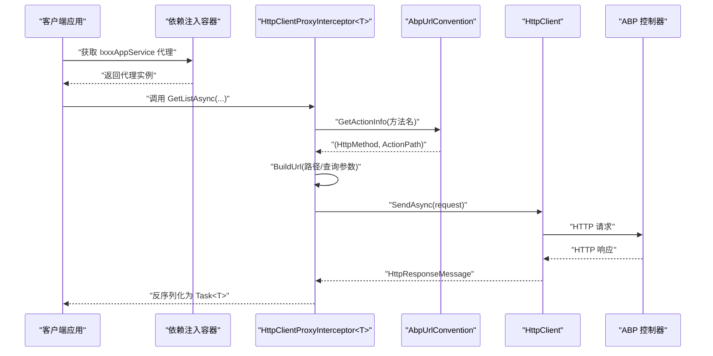
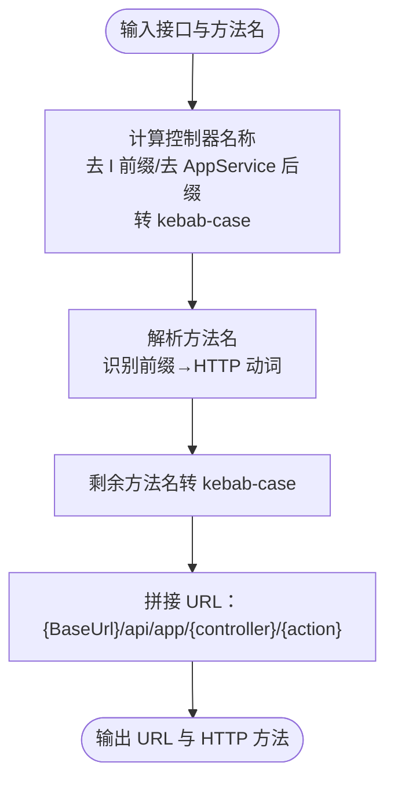
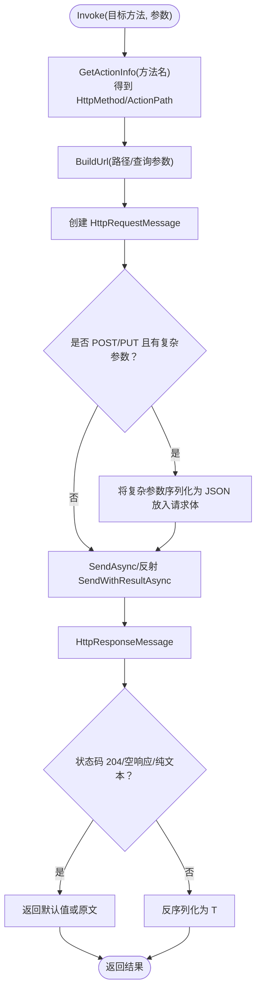
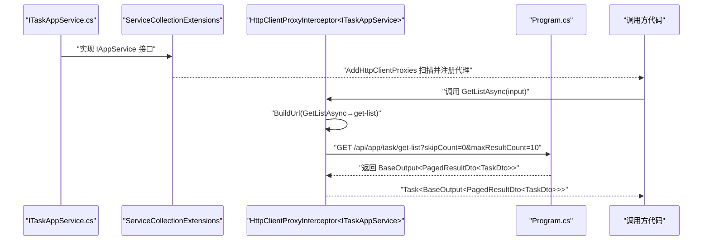
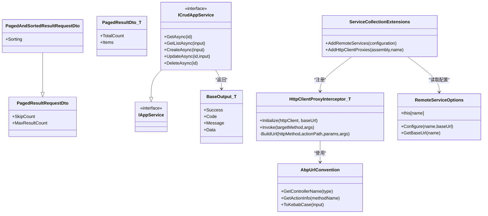

# API 概览与规范

<cite>
**本文引用的文件 **
- [IAppService.cs](file://src/Utils/H.Abp.Application.Contracts/IAppService.cs)
- [ICrudAppService.cs](file://src/Utils/H.Abp.Application.Contracts/ICrudAppService.cs)
- [PagedResultDto.cs](file://src/Utils/H.Abp.Application.Contracts/PagedResultDto.cs)
- [PagedAndSortedResultRequestDto.cs](file://src/Utils/H.Abp.Application.Contracts/PagedAndSortedResultRequestDto.cs)
- [PagedResultRequestDto.cs](file://src/Utils/H.Abp.Application.Contracts/PagedResultRequestDto.cs)
- [AbpUrlConvention.cs](file://src/Utils/H.Abp.HttpClientProxy/AbpUrlConvention.cs)
- [HttpClientProxyInterceptor.cs](file://src/Utils/H.Abp.HttpClientProxy/HttpClientProxyInterceptor.cs)
- [RemoteServiceOptions.cs](file://src/Utils/H.Abp.HttpClientProxy/RemoteServiceOptions.cs)
- [ServiceCollectionExtensions.cs](file://src/Utils/H.Abp.HttpClientProxy/ServiceCollectionExtensions.cs)
- [BaseOutput.cs](file://src/Utils/H.Util.Base/BaseOutput.cs)
- [Program.cs](file://src/Host/H.AppLab.Web.Host/H.AppLab.Web.Host/Program.cs)
</cite>

## 目录
1. [引言](#引言)
2. [项目结构](#项目结构)
3. [核心组件](#核心组件)
4. [架构总览](#架构总览)
5. [详细组件分析](#详细组件分析)
6. [依赖关系分析](#依赖关系分析)
7. [性能与扩展性](#性能与扩展性)
8. [故障排查指南](#故障排查指南)
9. [结论](#结论)

## 引言
本文件面向 AppLab 平台，基于 ABP Framework 的 RESTful API 设计规范，系统性说明以下主题：
- URL 模式约定、HTTP 方法映射规则
- 统一响应结构与错误码约定
- 动态 HTTP 代理机制：IAppService 接口自动生成客户端、HttpClientProxyInterceptor 拦截原理、AbpUrlConvention 路由解析规则
- 认证授权（JWT）、权限验证、全局异常处理接入点
- 分页查询参数规范与排序语法
- 从接口定义到客户端调用的完整示例
- 最佳实践与常见问题解决方案

## 项目结构
本项目围绕“应用服务契约 + 客户端 HTTP 代理”组织 API：
- 契约层位于 `H.Abp.Application.Contracts`，定义 IAppService、ICrudAppService 及分页 DTO。
- 客户端代理层位于 `H.Abp.HttpClientProxy`，提供 AbpUrlConvention、HttpClientProxyInterceptor、远程服务配置和 DI 扩展。
- 基础输出模型位于 `H.Util.Base.BaseOutput`，作为业务返回的统一包装。
- Web 主机在 `H.AppLab.Web.Host` 中注册 JSON 序列化、认证、授权等中间件管线。

图表来源
- [IAppService.cs:1-8](file://src/Utils/H.Abp.Application.Contracts/IAppService.cs#L1-L8)
- [ICrudAppService.cs:1-15](file://src/Utils/H.Abp.Application.Contracts/ICrudAppService.cs#L1-L15)
- [PagedResultDto.cs:1-19](file://src/Utils/H.Abp.Application.Contracts/PagedResultDto.cs#L1-L19)
- [PagedResultRequestDto.cs:1-11](file://src/Utils/H.Abp.Application.Contracts/PagedResultRequestDto.cs#L1-L11)
- [PagedAndSortedResultRequestDto.cs:1-9](file://src/Utils/H.Abp.Application.Contracts/PagedAndSortedResultRequestDto.cs#L1-L9)
- [AbpUrlConvention.cs:1-86](file://src/Utils/H.Abp.HttpClientProxy/AbpUrlConvention.cs#L1-L86)
- [HttpClientProxyInterceptor.cs:1-234](file://src/Utils/H.Abp.HttpClientProxy/HttpClientProxyInterceptor.cs#L1-L234)
- [RemoteServiceOptions.cs:1-33](file://src/Utils/H.Abp.HttpClientProxy/RemoteServiceOptions.cs#L1-L33)
- [ServiceCollectionExtensions.cs:1-63](file://src/Utils/H.Abp.HttpClientProxy/ServiceCollectionExtensions.cs#L1-L63)
- [BaseOutput.cs:1-52](file://src/Utils/H.Util.Base/BaseOutput.cs#L1-L52)
- [Program.cs:1-113](file://src/Host/H.AppLab.Web.Host/H.AppLab.Web.Host/Program.cs#L1-L113)

章节来源
- [Program.cs:1-113](file://src/Host/H.AppLab.Web.Host/H.AppLab.Web.Host/Program.cs#L1-L113)

## 核心组件
本节聚焦 API 设计的关键构件：
- IAppService：用于标识可通过 HTTP 代理远程调用的服务接口。
- ICrudAppService：定义标准 CRUD 方法签名，返回统一包装 BaseOutput。
- 分页相关 DTO：PagedResultDto、PagedResultRequestDto、PagedAndSortedResultRequestDto。
- AbpUrlConvention：将接口名与方法名转换为 ABP 风格 URL 与 HTTP 动词。
- HttpClientProxyInterceptor：基于 DispatchProxy 的客户端代理，负责构建请求、序列化、反序列化。
- RemoteServiceOptions 与 ServiceCollectionExtensions：远程服务 BaseUrl 配置与自动代理注册。
- BaseOutput：统一成功/失败、Code、Message、Data 的输出模型。

章节来源
- [IAppService.cs:1-8](file://src/Utils/H.Abp.Application.Contracts/IAppService.cs#L1-L8)
- [ICrudAppService.cs:1-15](file://src/Utils/H.Abp.Application.Contracts/ICrudAppService.cs#L1-L15)
- [PagedResultDto.cs:1-19](file://src/Utils/H.Abp.Application.Contracts/PagedResultDto.cs#L1-L19)
- [PagedResultRequestDto.cs:1-11](file://src/Utils/H.Abp.Application.Contracts/PagedResultRequestDto.cs#L1-L11)
- [PagedAndSortedResultRequestDto.cs:1-9](file://src/Utils/H.Abp.Application.Contracts/PagedAndSortedResultRequestDto.cs#L1-L9)
- [AbpUrlConvention.cs:1-86](file://src/Utils/H.Abp.HttpClientProxy/AbpUrlConvention.cs#L1-L86)
- [HttpClientProxyInterceptor.cs:1-234](file://src/Utils/H.Abp.HttpClientProxy/HttpClientProxyInterceptor.cs#L1-L234)
- [RemoteServiceOptions.cs:1-33](file://src/Utils/H.Abp.HttpClientProxy/RemoteServiceOptions.cs#L1-L33)
- [ServiceCollectionExtensions.cs:1-63](file://src/Utils/H.Abp.HttpClientProxy/ServiceCollectionExtensions.cs#L1-L63)
- [BaseOutput.cs:1-52](file://src/Utils/H.Util.Base/BaseOutput.cs#L1-L52)

## 架构总览
下图展示从客户端调用到服务端接口的端到端流程：客户端通过 DI 获取代理实例，代理根据 ABP 约定生成 URL，使用 HttpClient 发起请求；服务端由 ABP 控制器接收请求并返回统一数据格式。

图表来源
- [HttpClientProxyInterceptor.cs:1-234](file://src/Utils/H.Abp.HttpClientProxy/HttpClientProxyInterceptor.cs#L1-L234)
- [AbpUrlConvention.cs:1-86](file://src/Utils/H.Abp.HttpClientProxy/AbpUrlConvention.cs#L1-L86)

## 详细组件分析

### ABP RESTful API 设计规范

#### URL 模式约定
- 控制器名称：由接口名去掉首字母“I”，再去除后缀“ApplicationService”或“AppService”，最后转为 kebab-case。例如：IPageAppService → page。
- 动作路径：由方法名按前缀映射为 HTTP 动词，剩余部分转为 kebab-case。未匹配前缀时默认 POST。
- 完整 URL 模板：`{BaseUrl}/api/app/{controller}/{action?}`。

动词与前缀映射如下：
- GET：GetList、GetAll、Get
- PUT：Put、Update
- DELETE：Delete、Remove
- POST：Create、Add、Insert、Post
- PATCH：Patch

示例推导：
- IPageAppService.GetListAsync(...) → GET /api/app/page/get-list
- IPageAppService.GetAsync(id) → GET /api/app/page/{id}
- IPageAppService.CreateAsync(data) → POST /api/app/page/create

章节来源
- [AbpUrlConvention.cs:1-86](file://src/Utils/H.Abp.HttpClientProxy/AbpUrlConvention.cs#L1-L86)

#### HTTP 方法使用规范
- 查询列表：GET，方法名以 GetList/GetAll/Get 开头。
- 单条读取：GET，方法名以 Get 开头，或无明确前缀时作为 action 路径。
- 更新：PUT，方法名以 Put/Update 开头。
- 删除：DELETE，方法名以 Delete/Remove 开头。
- 新增：POST，方法名以 Create/Add/Insert/Post 开头。
- 局部更新：PATCH，方法名以 Patch 开头。

章节来源
- [AbpUrlConvention.cs:1-86](file://src/Utils/H.Abp.HttpClientProxy/AbpUrlConvention.cs#L1-L86)

#### 请求与响应格式标准
- 请求体：POST/PUT 且包含复杂类型参数时，参数会被序列化为 JSON 放入请求体。
- 查询参数：简单类型参数自动追加到 URL 查询串；GET/DELETE 上的复杂类型会将其属性展开为查询键值对。
- JSON 命名策略：PropertyNamingPolicy 使用 camelCase，且反序列化时不区分大小写。
- 时间类型：DateTime/DateTimeOffset 在查询串中按 ISO 8601 字符串格式化。

章节来源
- [HttpClientProxyInterceptor.cs:1-234](file://src/Utils/H.Abp.HttpClientProxy/HttpClientProxyInterceptor.cs#L1-L234)

#### 统一响应结构与错误码
- 业务响应使用 BaseOutput 或 BaseOutput<T>，包含字段：Success、Code、Message、Data。
- Code=0 表示成功；非 0 表示失败，Success 由 code==0 决定。
- 客户端代理在收到 HTTP 成功状态码后，会尝试将响应体反序列化为 T；若响应为空或纯文本，则按类型返回空字符串或默认值。

建议：
- 所有应用服务返回 BaseOutput<T>，便于前端统一处理 Success/Code/Message/Data。
- 服务端错误应设置合适的 HTTP 状态码，并在 Body 中填充 BaseOutput。

章节来源
- [BaseOutput.cs:1-52](file://src/Utils/H.Util.Base/BaseOutput.cs#L1-L52)
- [HttpClientProxyInterceptor.cs:194-234](file://src/Utils/H.Abp.HttpClientProxy/HttpClientProxyInterceptor.cs#L194-L234)

#### 分页查询参数规范
- 分页请求基类 PagedResultRequestDto：SkipCount、MaxResultCount（默认 10）。
- 支持排序的请求 PagedAndSortedResultRequestDto：继承分页基类，新增 Sorting 字段。
- 分页结果 PagedResultDto：TotalCount、Items。

常用约定：
- SkipCount：跳过的记录数。
- MaxResultCount：每页数量。
- Sorting：排序表达式，如“Name asc,CreateTime desc”。

章节来源
- [PagedResultRequestDto.cs:1-11](file://src/Utils/H.Abp.Application.Contracts/PagedResultRequestDto.cs#L1-L11)
- [PagedAndSortedResultRequestDto.cs:1-9](file://src/Utils/H.Abp.Application.Contracts/PagedAndSortedResultRequestDto.cs#L1-L9)
- [PagedResultDto.cs:1-19](file://src/Utils/H.Abp.Application.Contracts/PagedResultDto.cs#L1-L19)

### 动态 HTTP 代理机制

#### IAppService 与 ICrudAppService
- IAppService 是标记接口，被扫描后自动注册为 HTTP 客户端代理。
- ICrudAppService 定义了统一的 CRUD 方法，返回 BaseOutput<T>，便于跨语言与多端调用。

章节来源
- [IAppService.cs:1-8](file://src/Utils/H.Abp.Application.Contracts/IAppService.cs#L1-L8)
- [ICrudAppService.cs:1-15](file://src/Utils/H.Abp.Application.Contracts/ICrudAppService.cs#L1-L15)

#### AbpUrlConvention 路由解析规则
- GetControllerName：移除 I 前缀与应用服务后缀，转 kebab-case。
- GetActionInfo：识别前缀并映射 HTTP 动词，剩余部分转 kebab-case。
- ToKebabCase：先 camelCase 再插入连字符，保持与服务端一致。

图表来源
- [AbpUrlConvention.cs:1-86](file://src/Utils/H.Abp.HttpClientProxy/AbpUrlConvention.cs#L1-L86)

章节来源
- [AbpUrlConvention.cs:1-86](file://src/Utils/H.Abp.HttpClientProxy/AbpUrlConvention.cs#L1-L86)

#### HttpClientProxyInterceptor 工作原理
- 初始化：保存 HttpClient、BaseUrl，并计算控制器名称。
- Invoke：根据方法名得到 HTTP 方法与 action 路径；构造 HttpRequestMessage。
- BuildUrl：
  - id 参数作为路径段放在 action 之前。
  - 单个以 “Id” 结尾的简单类型参数作为 action 后的路径段。
  - 其他简单类型参数进入查询串。
  - GET/DELETE 上复杂类型参数展开属性为查询键值对。
- 请求执行：
  - Task 方法直接发送请求并检查成功状态。
  - Task<T> 方法发送请求、确保成功状态码、反序列化响应体。
  - 特殊处理 NoContent、空响应体、纯文本响应。

图表来源
- [HttpClientProxyInterceptor.cs:1-234](file://src/Utils/H.Abp.HttpClientProxy/HttpClientProxyInterceptor.cs#L1-L234)

章节来源
- [HttpClientProxyInterceptor.cs:1-234](file://src/Utils/H.Abp.HttpClientProxy/HttpClientProxyInterceptor.cs#L1-L234)

#### ServiceCollectionExtensions 与 RemoteServiceOptions
- AddRemoteServices：从 IConfiguration 的 RemoteServices 节点加载服务名与 BaseUrl。
- AddHttpClientProxies：扫描指定程序集中实现 IAppService 的接口，为每个接口注册代理实现。
- RegisterProxy：通过 DI 获取 IHttpClientFactory 创建的 HttpClient 与 RemoteServiceOptions 中的 BaseUrl，反射调用代理工厂创建实例。

章节来源
- [ServiceCollectionExtensions.cs:1-63](file://src/Utils/H.Abp.HttpClientProxy/ServiceCollectionExtensions.cs#L1-L63)
- [RemoteServiceOptions.cs:1-33](file://src/Utils/H.Abp.HttpClientProxy/RemoteServiceOptions.cs#L1-L33)

### 认证授权与全局异常处理

#### 认证与授权
- Program 中启用 UseAuthentication 与 UseAuthorization，表明系统使用 ASP.NET Core 认证授权管线。
- JWT Token 的使用方式取决于后端集成方案；客户端应在每次请求携带 Authorization: Bearer <token>。

#### 全局异常处理
- Program 在非开发环境启用 UseExceptionHandler("/Error")。
- 客户端代理仅检查 HTTP 成功状态码，若服务端返回非 2xx，将抛出异常；因此建议在服务端通过异常过滤器或中间件将业务异常转换为 BaseOutput 与合适状态码。

章节来源
- [Program.cs:1-113](file://src/Host/H.AppLab.Web.Host/H.AppLab.Web.Host/Program.cs#L1-L113)
- [HttpClientProxyInterceptor.cs:194-234](file://src/Utils/H.Abp.HttpClientProxy/HttpClientProxyInterceptor.cs#L194-L234)

### 从接口定义到客户端调用的完整示例

下面以 ITaskAppService 为例，展示从接口定义到客户端调用的全流程：

要点：
- 接口需实现 IAppService，以便被扫描注册。
- 方法名遵循 ABP 前缀约定，自动生成 URL 与 HTTP 方法。
- 分页输入使用 PagedResultRequestDto 或 PagedAndSortedResultRequestDto。
- 返回 BaseOutput<T>，前端可统一判断 Success/Code/Message/Data。

章节来源
- [ICrudAppService.cs:1-15](file://src/Utils/H.Abp.Application.Contracts/ICrudAppService.cs#L1-L15)
- [ServiceCollectionExtensions.cs:1-63](file://src/Utils/H.Abp.HttpClientProxy/ServiceCollectionExtensions.cs#L1-L63)
- [HttpClientProxyInterceptor.cs:1-234](file://src/Utils/H.Abp.HttpClientProxy/HttpClientProxyInterceptor.cs#L1-L234)
- [Program.cs:1-113](file://src/Host/H.AppLab.Web.Host/H.AppLab.Web.Host/Program.cs#L1-L113)

## 依赖关系分析

图表来源
- [IAppService.cs:1-8](file://src/Utils/H.Abp.Application.Contracts/IAppService.cs#L1-L8)
- [ICrudAppService.cs:1-15](file://src/Utils/H.Abp.Application.Contracts/ICrudAppService.cs#L1-L15)
- [PagedResultDto.cs:1-19](file://src/Utils/H.Abp.Application.Contracts/PagedResultDto.cs#L1-L19)
- [PagedResultRequestDto.cs:1-11](file://src/Utils/H.Abp.Application.Contracts/PagedResultRequestDto.cs#L1-L11)
- [PagedAndSortedResultRequestDto.cs:1-9](file://src/Utils/H.Abp.Application.Contracts/PagedAndSortedResultRequestDto.cs#L1-L9)
- [AbpUrlConvention.cs:1-86](file://src/Utils/H.Abp.HttpClientProxy/AbpUrlConvention.cs#L1-L86)
- [HttpClientProxyInterceptor.cs:1-234](file://src/Utils/H.Abp.HttpClientProxy/HttpClientProxyInterceptor.cs#L1-L234)
- [ServiceCollectionExtensions.cs:1-63](file://src/Utils/H.Abp.HttpClientProxy/ServiceCollectionExtensions.cs#L1-L63)
- [RemoteServiceOptions.cs:1-33](file://src/Utils/H.Abp.HttpClientProxy/RemoteServiceOptions.cs#L1-L33)
- [BaseOutput.cs:1-52](file://src/Utils/H.Util.Base/BaseOutput.cs#L1-L52)

## 性能与扩展性
- JSON 序列化：统一使用 camelCase，减少前后端字段映射成本。
- 响应压缩：Program 中启用 Brotli/Gzip 压缩，降低 WASM 资源传输体积。
- 代理缓存：HttpClient 由 IHttpClientFactory 管理，建议复用连接池。
- 扩展点：
  - 自定义 URL 转换：可扩展 AbpUrlConvention 的方法。
  - 自定义异常处理：在服务端增加异常过滤器，将业务异常转为 BaseOutput 与 HTTP 状态码。
  - 自定义远程服务配置：RemoteServiceOptions 支持从配置加载多个服务 BaseUrl。

[本节为通用指导，不直接分析具体文件]

## 故障排查指南

常见问题与建议：
- 401/403：确认已正确配置 UseAuthentication 与 UseAuthorization，并确保请求头携带有效的 Authorization: Bearer <token>。
- 404：检查接口方法名是否符合 ABP 前缀约定；确认控制器名称与方法 action 是否正确生成。
- 400：检查分页参数 SkipCount、MaxResultCount、Sorting 是否符合规范；复杂类型参数在 GET/DELETE 上会被展开为查询键值对，注意命名与值格式。
- 500：查看服务端异常日志；确保异常过滤器将业务异常转换为 BaseOutput 与合理状态码。
- 空响应或乱码：当服务端返回空响应或纯文本而客户端期望 JSON 时，代理会返回默认值或原始字符串；请确认服务端返回内容与客户端期望类型一致。

章节来源
- [Program.cs:1-113](file://src/Host/H.AppLab.Web.Host/H.AppLab.Web.Host/Program.cs#L1-L113)
- [HttpClientProxyInterceptor.cs:194-234](file://src/Utils/H.Abp.HttpClientProxy/HttpClientProxyInterceptor.cs#L194-L234)

## 结论
AppLab 平台的 API 体系基于 ABP Framework 的约定优于配置理念：通过 IAppService 与 ICrudAppService 定义清晰的契约，借助 AbpUrlConvention 与 HttpClientProxyInterceptor 自动生成客户端 HTTP 调用，从而显著降低前后端联调成本。配合 BaseOutput 统一响应结构、分页与排序参数规范，以及 Program 中的认证授权与异常处理接入点，可在保证一致性的同时具备良好的扩展性与可维护性。