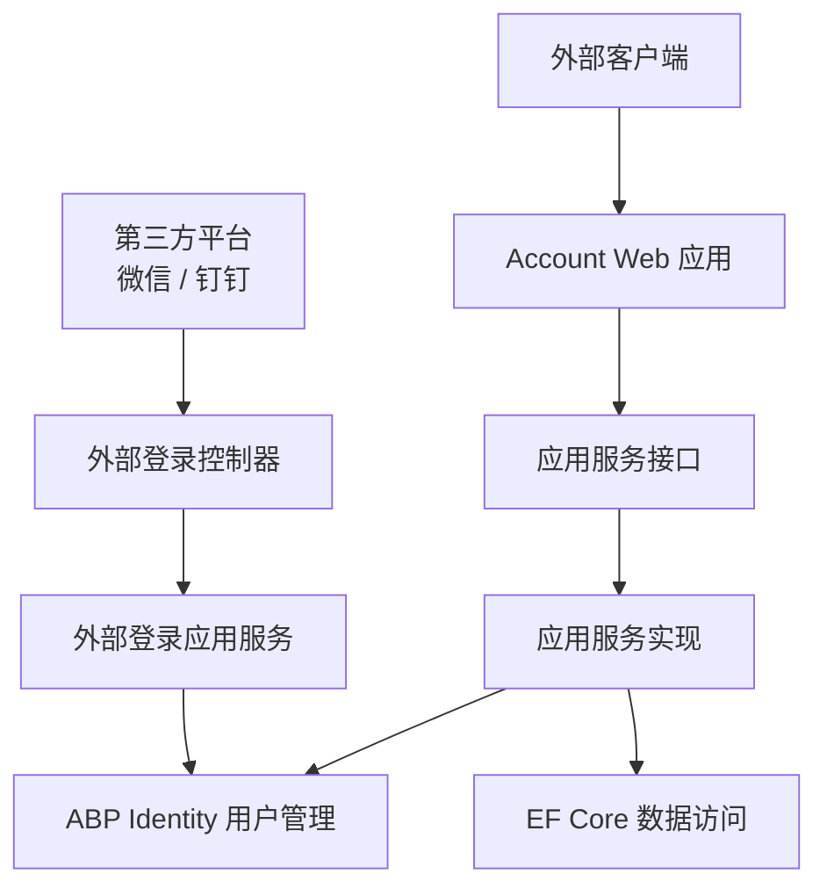
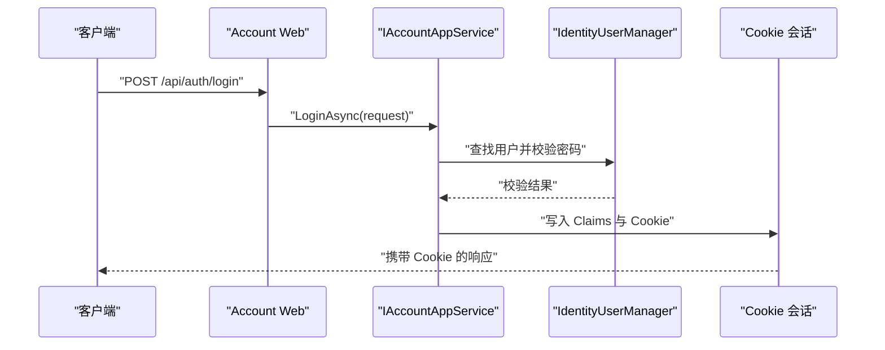
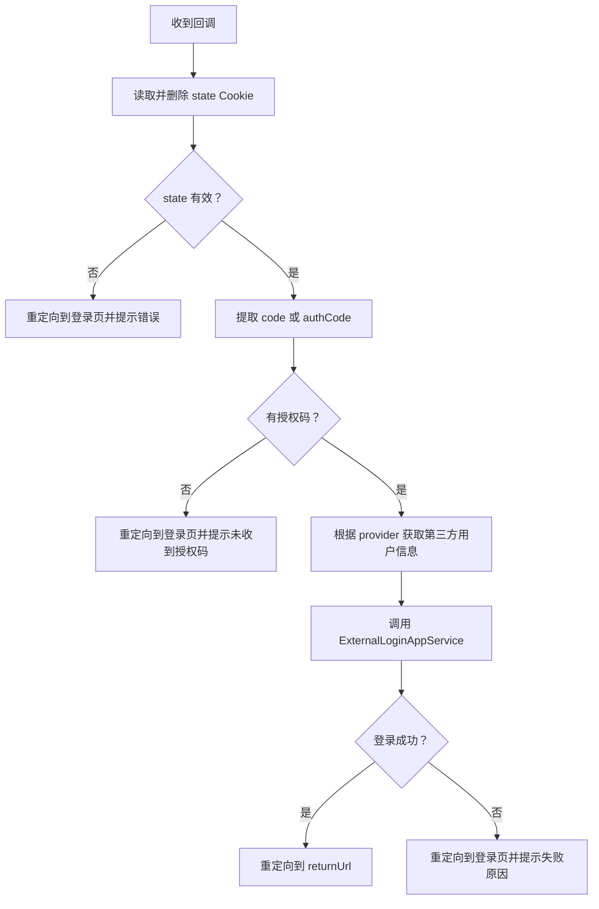
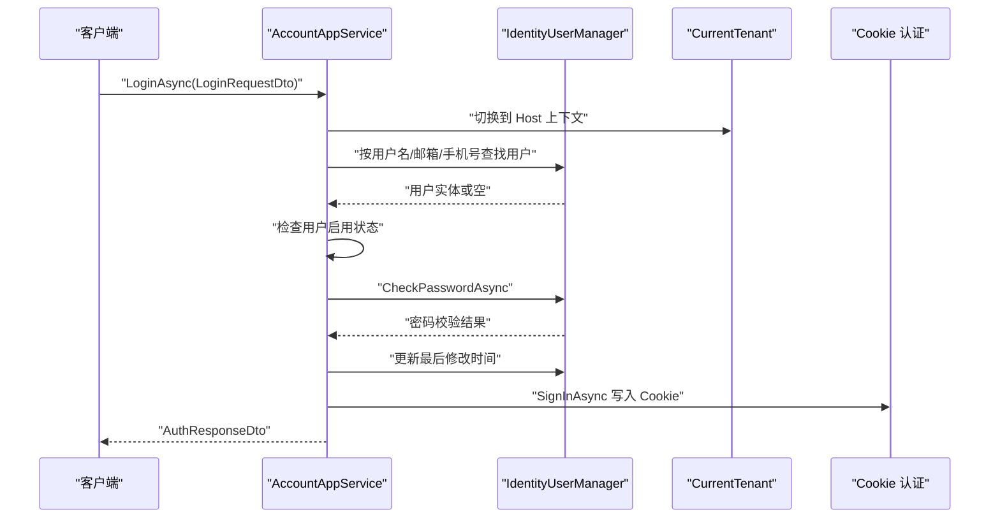
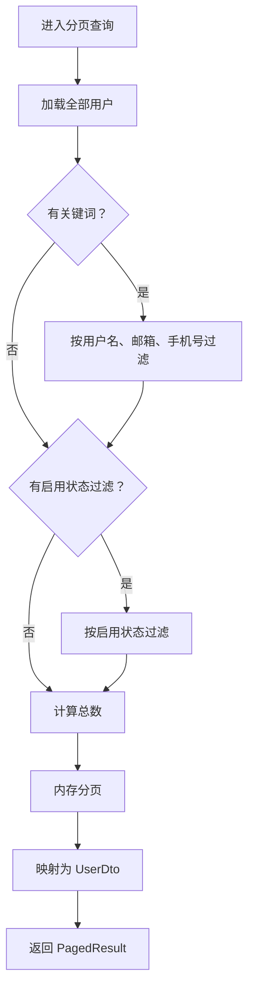
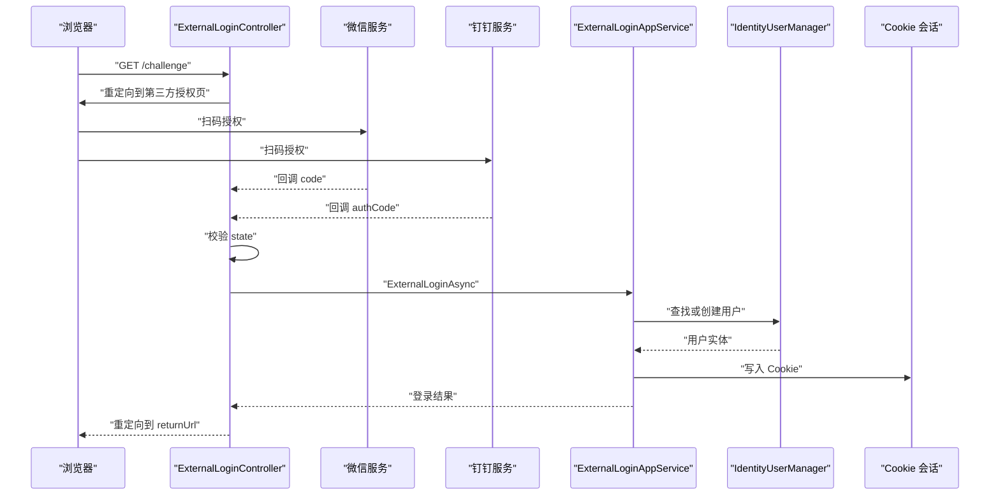
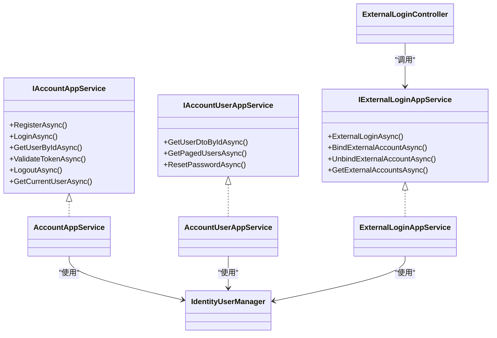

# Account 账户管理 API

<cite>
**本文引用的文件**   
- [README.md](file://src/Services/Account/README.md)
- [IAccountAppService.cs](file://src/Services/Account/H.Account.Application.Contracts/Services/IAccountAppService.cs)
- [IAccountUserAppService.cs](file://src/Services/Account/H.Account.Application.Contracts/Services/IAccountUserAppService.cs)
- [IExternalLoginAppService.cs](file://src/Services/Account/H.Account.Application.Contracts/Services/IExternalLoginAppService.cs)
- [AccountDtos.cs](file://src/Services/Account/H.Account.Application.Contracts/Dtos/AccountDtos.cs)
- [ExternalLoginDtos.cs](file://src/Services/Account/H.Account.Application.Contracts/Dtos/ExternalLoginDtos.cs)
- [AccountAppService.cs](file://src/Services/Account/H.Account.Application/Services/AccountAppService.cs)
- [AccountUserAppService.cs](file://src/Services/Account/H.Account.Application/Services/AccountUserAppService.cs)
- [ExternalLoginAppService.cs](file://src/Services/Account/H.Account.Application/ExternalLogin/ExternalLoginAppService.cs)
- [ExternalLoginController.cs](file://src/Services/Account/H.Account.Application/ExternalLogin/ExternalLoginController.cs)
- [WeChatAuthService.cs](file://src/Services/Account/H.Account.Application/ExternalLogin/WeChatAuthService.cs)
- [DingTalkAuthService.cs](file://src/Services/Account/H.Account.Application/ExternalLogin/DingTalkAuthService.cs)
</cite>

## 目录

1. [简介](#简介)
2. [项目结构](#项目结构)
3. [核心组件](#核心组件)
4. [架构总览](#架构总览)
5. [接口规范](#接口规范)
6. [详细组件分析](#详细组件分析)
7. [依赖关系分析](#依赖关系分析)
8. [性能与扩展性](#性能与扩展性)
9. [安全与最佳实践](#安全与最佳实践)
10. [故障排查指南](#故障排查指南)
11. [结论](#结论)

## 简介

Account 服务是一个基于 ASP.NET Core、Blazor 和 ABP Identity 的用户认证与用户管理服务。它提供：

- 用户注册、登录、登出、令牌验证等认证能力；
- 企业级用户信息查询、分页查询、管理员重置密码等用户管理能力；
- 微信、钉钉等第三方账号的外部登录、绑定与解绑；
- Cookie 认证会话，用于当前用户信息获取与会话状态检查；
- 面向外部系统的 SDK 客户端模块。

从设计上看，服务采用分层结构：应用层暴露 AppService 接口，DTO 定义在 Application.Contracts 中，Web 端通过 Controller 或 Blazor 页面调用，数据访问由 ABP Identity 与 EF Core 承担。

本 API 文档重点说明：

- 所有对外暴露的 HTTP 方法与 URL；
- 请求参数、响应数据结构；
- 成功与错误响应示例；
- 身份认证流程、权限控制策略；
- 密码加密与安全检查建议；
- 常见集成问题与解决方案。

**章节来源**
- [README.md:1-99](file://src/Services/Account/README.md#L1-L99)

## 项目结构

Account 服务位于 `src/Services/Account` 下，主要子项目如下：

| 路径 | 职责 |
|---|---|
| `H.Account.Application.Contracts` | 定义 DTO、枚举与应用服务接口 |
| `H.Account.Application` | 实现认证、用户管理、外部登录等业务逻辑 |
| `H.Account.Web` | 提供 Blazor 页面、布局、注销页等前端入口 |
| `H.Account.EntityFrameworkCore` | 数据库上下文与 EF Core 配置 |
| `H.Account.Client` | 提供给外部系统使用的 SDK 模块 |
| `H.Account.DbMigrator` | 数据库迁移工具（位于 Tools 目录） |



**图表来源**
- [IAccountAppService.cs:1-18](file://src/Services/Account/H.Account.Application.Contracts/Services/IAccountAppService.cs#L1-L18)
- [IAccountUserAppService.cs:1-26](file://src/Services/Account/H.Account.Application.Contracts/Services/IAccountUserAppService.cs#L1-L26)
- [IExternalLoginAppService.cs:1-30](file://src/Services/Account/H.Account.Application.Contracts/Services/IExternalLoginAppService.cs#L1-L30)
- [ExternalLoginController.cs:1-202](file://src/Services/Account/H.Account.Application/ExternalLogin/ExternalLoginController.cs#L1-L202)

**章节来源**
- [README.md:12-33](file://src/Services/Account/README.md#L12-L33)
- [AccountWebModule.cs:1-8](file://src/Services/Account/H.Account.Web/AccountWebModule.cs#L1-L8)

## 核心组件

### 应用服务接口

| 接口 | 主要职责 |
|---|---|
| `IAccountAppService` | 注册、登录、获取用户、令牌验证、登出、获取当前用户 |
| `IAccountUserAppService` | 用户详情查询、分页用户列表、管理员重置密码 |
| `IExternalLoginAppService` | 外部登录、绑定第三方账号、解绑、查询已绑定账号 |

这些接口统一返回 `BaseOutput<T>` 包装结果，表示业务层面的成功或失败。

**章节来源**
- [IAccountAppService.cs:1-18](file://src/Services/Account/H.Account.Application.Contracts/Services/IAccountAppService.cs#L1-L18)
- [IAccountUserAppService.cs:1-26](file://src/Services/Account/H.Account.Application.Contracts/Services/IAccountUserAppService.cs#L1-L26)
- [IExternalLoginAppService.cs:1-30](file://src/Services/Account/H.Account.Application.Contracts/Services/IExternalLoginAppService.cs#L1-L30)

### 数据传输对象

| DTO | 用途 |
|---|---|
| `UserDto` | 企业用户基本信息、状态、审计字段、外部账号列表 |
| `ExternalAccountDto` | 第三方账号绑定信息 |
| `LoginRequestDto` | 用户名、邮箱或手机号 + 密码登录请求 |
| `RegisterRequestDto` | 注册请求，支持按用户名、邮箱、手机号注册 |
| `AuthResponseDto` | 认证操作通用响应 |
| `ResetPasswordDto` | 管理员重置密码请求 |
| `UserQueryParams` | 用户列表查询条件与分页参数 |
| `PagedResult<T>` | 分页结果 |
| `ExternalLoginRequestDto` | 第三方登录请求 |
| `ExternalLoginResultDto` | 第三方登录结果 |

**章节来源**
- [AccountDtos.cs:1-123](file://src/Services/Account/H.Account.Application.Contracts/Dtos/AccountDtos.cs#L1-L123)
- [ExternalLoginDtos.cs:1-48](file://src/Services/Account/H.Account.Application.Contracts/Dtos/ExternalLoginDtos.cs#L1-L48)

## 架构总览

Account 服务围绕三类主体组织：

1. **内部认证与会话**：通过 ABP Identity 和用户管理器完成注册、登录、密码校验、Cookie 登录态写入。
2. **用户管理**：提供用户查询、分页、管理员重置密码能力。
3. **外部登录**：通过微信、钉钉 OAuth2 回调，将第三方用户映射为本地用户，并建立 Cookie 会话。



**图表来源**
- [IAccountAppService.cs:1-18](file://src/Services/Account/H.Account.Application.Contracts/Services/IAccountAppService.cs#L1-L18)
- [AccountAppService.cs:1-200](file://src/Services/Account/H.Account.Application/Services/AccountAppService.cs#L1-L200)

## 接口规范

### 认证接口

#### 用户注册

| 项目 | 内容 |
|---|---|
| HTTP 方法 | `POST` |
| URL 路径 | `/api/auth/register` |
| 鉴权要求 | 无需登录 |
| 请求体 | `RegisterRequestDto` |
| 响应体 | `BaseOutput<AuthResponseDto>` |

**请求参数**

| 字段 | 类型 | 必填 | 说明 |
|---|---|---:|---|
| `UserName` | 字符串 | 条件必填 | 当 `RegisterType` 为用户名注册时必填 |
| `Email` | 字符串 | 条件必填 | 当 `RegisterType` 为邮箱注册时必填 |
| `PhoneNumber` | 字符串 | 条件必填 | 当 `RegisterType` 为手机号注册时必填 |
| `Password` | 字符串 | 是 | 密码 |
| `ConfirmPassword` | 字符串 | 是 | 确认密码 |
| `EmailCode` | 字符串 | 否 | 邮箱验证码（当前接口未强制校验） |
| `PhoneCode` | 字符串 | 否 | 手机验证码（当前接口未强制校验） |
| `RegisterType` | 枚举 | 是 | `UserName`、`Email`、`PhoneNumber` |

**成功响应示例**

```json
{
  "success": true,
  "message": "注册成功",
  "data": {
    "success": true,
    "message": "注册成功",
    "user": {
      "id": "a1b2c3d4-e5f6-7890-abcd-ef1234567890",
      "userName": "demo-user",
      "email": "demo@example.com",
      "phoneNumber": "",
      "isActive": true,
      "emailConfirmed": false,
      "phoneNumberConfirmed": false,
      "createdAt": "2026-09-29T10:00:00Z",
      "updatedAt": null,
      "lastLoginAt": null,
      "remark": null,
      "externalAccounts": []
    }
  }
}
```

**错误响应示例**

- 用户名已存在：

```json
{
  "success": true,
  "message": "",
  "data": {
    "success": false,
    "message": "用户名已存在",
    "user": null
  }
}
```

- 邮箱已被注册：

```json
{
  "success": true,
  "message": "",
  "data": {
    "success": false,
    "message": "邮箱已被注册",
    "user": null
  }
}
```

- 手机号已被注册：

```json
{
  "success": true,
  "message": "",
  "data": {
    "success": false,
    "message": "手机号已被注册",
    "user": null
  }
}
```

- 密码不一致：

```json
{
  "success": true,
  "message": "",
  "data": {
    "success": false,
    "message": "密码和确认密码不匹配",
    "user": null
  }
}
```

**章节来源**
- [AccountDtos.cs:47-91](file://src/Services/Account/H.Account.Application.Contracts/Dtos/AccountDtos.cs#L47-L91)
- [AccountAppService.cs:25-118](file://src/Services/Account/H.Account.Application/Services/AccountAppService.cs#L25-L118)

#### 用户登录

| 项目 | 内容 |
|---|---|
| HTTP 方法 | `POST` |
| URL 路径 | `/api/auth/login` |
| 鉴权要求 | 无需登录 |
| 请求体 | `LoginRequestDto` |
| 响应体 | `BaseOutput<AuthResponseDto>` |

**请求参数**

| 字段 | 类型 | 必填 | 说明 |
|---|---|---:|---|
| `Account` | 字符串 | 是 | 用户名、邮箱或手机号，服务会自动识别 |
| `Password` | 字符串 | 是 | 密码 |
| `RememberMe` | 布尔值 | 否 | 是否记住登录，默认 `false` |

**成功响应示例**

```json
{
  "success": true,
  "message": "",
  "data": {
    "success": true,
    "message": "登录成功",
    "user": {
      "id": "a1b2c3d4-e5f6-7890-abcd-ef1234567890",
      "userName": "demo-user",
      "email": "demo@example.com",
      "phoneNumber": "+8613800000000",
      "isActive": true,
      "emailConfirmed": true,
      "phoneNumberConfirmed": false,
      "createdAt": "2026-09-29T10:00:00Z",
      "updatedAt": "2026-09-29T10:05:00Z",
      "lastLoginAt": "2026-09-29T10:05:00Z",
      "remark": null,
      "externalAccounts": []
    }
  }
}
```

登录后服务端会写入 Cookie 会话。后续请求需携带该 Cookie。

**错误响应示例**

- 用户名或密码错误：

```json
{
  "success": true,
  "message": "",
  "data": {
    "success": false,
    "message": "用户名或密码错误",
    "user": null
  }
}
```

- 账户被禁用：

```json
{
  "success": true,
  "message": "",
  "data": {
    "success": false,
    "message": "账户已被禁用",
    "user": null
  }
}
```

**章节来源**
- [AccountDtos.cs:33-46](file://src/Services/Account/H.Account.Application.Contracts/Dtos/AccountDtos.cs#L33-L46)
- [AccountAppService.cs:120-200](file://src/Services/Account/H.Account.Application/Services/AccountAppService.cs#L120-L200)

#### 令牌验证

| 项目 | 内容 |
|---|---|
| HTTP 方法 | `GET` |
| URL 路径 | `/api/auth/validate` |
| 鉴权要求 | 需要有效会话或令牌 |
| 请求参数 | `token` |
| 响应体 | `BaseOutput<bool>` |

**请求示例**

```
GET /api/auth/validate?token=eyJhbGciOi...
```

**成功响应示例**

```json
{
  "success": true,
  "message": "",
  "data": true
}
```

**错误响应示例**

```json
{
  "success": true,
  "message": "",
  "data": false
}
```

**章节来源**
- [IAccountAppService.cs:9-18](file://src/Services/Account/H.Account.Application.Contracts/Services/IAccountAppService.cs#L9-L18)
- [README.md:44-50](file://src/Services/Account/README.md#L44-L50)

#### 登出

| 项目 | 内容 |
|---|---|
| HTTP 方法 | `POST` |
| URL 路径 | `/api/auth/logout` |
| 鉴权要求 | 通常已登录用户执行 |
| 请求体 | 无 |
| 响应体 | `BaseOutput` |

**成功响应示例**

```json
{
  "success": true,
  "message": ""
}
```

**章节来源**
- [IAccountAppService.cs:13-17](file://src/Services/Account/H.Account.Application.Contracts/Services/IAccountAppService.cs#L13-L17)

#### 当前用户信息

| 项目 | 内容 |
|---|---|
| HTTP 方法 | `GET` |
| URL 路径 | `/api/auth/current-user` |
| 鉴权要求 | 已登录会话 |
| 响应体 | `BaseOutput<UserDto?>` |

**成功响应示例**

```json
{
  "success": true,
  "message": "",
  "data": {
    "id": "a1b2c3d4-e5f6-7890-abcd-ef1234567890",
    "userName": "demo-user",
    "email": "demo@example.com",
    "phoneNumber": "+8613800000000",
    "isActive": true,
    "emailConfirmed": true,
    "phoneNumberConfirmed": false,
    "createdAt": "2026-09-29T10:00:00Z",
    "updatedAt": "2026-09-29T10:05:00Z",
    "lastLoginAt": "2026-09-29T10:05:00Z",
    "remark": null,
    "externalAccounts": []
  }
}
```

**未登录或无效会话响应示例**

```json
{
  "success": true,
  "message": "",
  "data": null
}
```

**章节来源**
- [IAccountAppService.cs:14-17](file://src/Services/Account/H.Account.Application.Contracts/Services/IAccountAppService.cs#L14-L17)

### 用户管理接口

用户管理接口由 `IAccountUserAppService` 暴露。README 中标注了更完整的 REST 风格路径，但当前代码实现中直接暴露的是应用服务方法，而不是全部 REST 控制器。因此，实际可依赖的契约以接口为准。

| 接口 | HTTP 语义 | 行为 |
|---|---|---|
| `GetUserDtoByIdAsync` | 查询单个用户 | 根据用户 ID 返回 `UserDto` |
| `GetPagedUsersAsync` | 分页查询用户 | 支持关键词、状态筛选 |
| `ResetPasswordAsync` | 管理员重置密码 | 设置新密码 |

README 中还列出了一些 REST 风格路径，包括：

- `GET /api/users`
- `GET /api/users/{id}`
- `POST /api/users`
- `PUT /api/users/{id}`
- `PATCH /api/users/{id}/status`
- `POST /api/users/{id}/reset-password`
- `DELETE /api/users/{id}`
- `GET /api/users/check-username`
- `GET /api/users/check-email`

其中部分路径在当前源码中未见对应控制器实现，应视为规划或尚未实现的 REST 契约。集成方应以实际部署服务的接口为准。

#### 分页查询用户列表

| 项目 | 内容 |
|---|---|
| HTTP 语义 | 查询用户列表 |
| 适用场景 | 管理员后台或用户管理界面 |
| 鉴权要求 | README 标注为需要 Admin 权限；具体权限策略取决于部署配置 |
| 请求参数 | `UserQueryParams` |
| 响应体 | `BaseOutput<PagedResult<UserDto>>` |

**请求参数**

| 字段 | 类型 | 默认值 | 说明 |
|---|---|---:|---|
| `Keyword` | 字符串 | 空 | 用户名、邮箱、手机号模糊搜索 |
| `IsActive` | 布尔值 | 空 | 过滤启用状态 |
| `PageIndex` | 整数 | `1` | 页码 |
| `PageSize` | 整数 | `10` | 每页数量 |

**成功响应示例**

```json
{
  "success": true,
  "message": "",
  "data": {
    "items": [
      {
        "id": "a1b2c3d4-e5f6-7890-abcd-ef1234567890",
        "userName": "demo-user",
        "email": "demo@example.com",
        "phoneNumber": "+8613800000000",
        "isActive": true,
        "emailConfirmed": true,
        "phoneNumberConfirmed": false,
        "createdAt": "2026-09-29T10:00:00Z",
        "updatedAt": "2026-09-29T10:05:00Z",
        "lastLoginAt": "2026-09-29T10:05:00Z",
        "remark": null,
        "externalAccounts": []
      }
    ],
    "total": 1,
    "pageIndex": 1,
    "pageSize": 10
  }
}
```

**注意**

当前分页实现先加载全部用户再内存分页，时间复杂度接近 O(n)，不适合用户量非常大的场景。

**章节来源**
- [IAccountUserAppService.cs:13-26](file://src/Services/Account/H.Account.Application.Contracts/Services/IAccountUserAppService.cs#L13-L26)
- [AccountUserAppService.cs:24-66](file://src/Services/Account/H.Account.Application/Services/AccountUserAppService.cs#L24-L66)
- [AccountDtos.cs:93-123](file://src/Services/Account/H.Account.Application.Contracts/Dtos/AccountDtos.cs#L93-L123)
- [README.md:52-68](file://src/Services/Account/README.md#L52-L68)

#### 获取用户详情

| 项目 | 内容 |
|---|---|
| HTTP 语义 | 查询单个用户 |
| 适用场景 | 用户详情页、用户编辑页 |
| 鉴权要求 | README 标注为需要 Admin 权限 |
| 请求参数 | 用户 ID |
| 响应体 | `BaseOutput<UserDto?>` |

**成功响应示例**

```json
{
  "success": true,
  "message": "",
  "data": {
    "id": "a1b2c3d4-e5f6-7890-abcd-ef1234567890",
    "userName": "demo-user",
    "email": "demo@example.com",
    "phoneNumber": "+8613800000000",
    "isActive": true,
    "emailConfirmed": true,
    "phoneNumberConfirmed": false,
    "createdAt": "2026-09-29T10:00:00Z",
    "updatedAt": "2026-09-29T10:05:00Z",
    "lastLoginAt": "2026-09-29T10:05:00Z",
    "remark": null,
    "externalAccounts": []
  }
}
```

**未找到用户响应示例**

```json
{
  "success": true,
  "message": "",
  "data": null
}
```

**章节来源**
- [IAccountUserAppService.cs:9-12](file://src/Services/Account/H.Account.Application.Contracts/Services/IAccountUserAppService.cs#L9-L12)
- [AccountUserAppService.cs:18-23](file://src/Services/Account/H.Account.Application/Services/AccountUserAppService.cs#L18-L23)

#### 重置密码

| 项目 | 内容 |
|---|---|
| HTTP 语义 | 管理员重置用户密码 |
| 适用场景 | 用户忘记密码后由管理员重置 |
| 鉴权要求 | README 标注为需要 Admin 权限 |
| 请求参数 | 用户 ID + `ResetPasswordDto` |
| 响应体 | `BaseOutput` |

**请求参数**

| 字段 | 类型 | 必填 | 说明 |
|---|---|---:|---|
| `NewPassword` | 字符串 | 是 | 新密码 |
| `ConfirmPassword` | 字符串 | 是 | 确认密码 |

**成功响应示例**

```json
{
  "success": true,
  "message": ""
}
```

**错误响应示例**

- 两次密码不一致：

```json
{
  "success": false,
  "message": "两次密码输入不一致"
}
```

- 用户不存在：

```json
{
  "success": false,
  "message": "用户不存在"
}
```

- 密码不符合策略：

```json
{
  "success": false,
  "message": "密码太短..."
}
```

**章节来源**
- [IAccountUserAppService.cs:17-26](file://src/Services/Account/H.Account.Application.Contracts/Services/IAccountUserAppService.cs#L17-L26)
- [AccountDtos.cs:83-91](file://src/Services/Account/H.Account.Application.Contracts/Dtos/AccountDtos.cs#L83-L91)
- [AccountUserAppService.cs:68-115](file://src/Services/Account/H.Account.Application/Services/AccountUserAppService.cs#L68-L115)

### 外部登录接口

外部登录接口主要用于微信、钉钉扫码登录。其公开控制器位于 `/api/external-login`。

#### 发起外部登录跳转

| 项目 | 内容 |
|---|---|
| HTTP 方法 | `GET` |
| URL 路径 | `/api/external-login/challenge` |
| 鉴权要求 | 允许匿名访问 |
| 查询参数 | `provider`、`returnUrl` |
| 响应 | 重定向到第三方授权页 |

**请求示例**

```
GET /api/external-login/challenge?provider=WeChat&returnUrl=/account/external-callback
```

**支持提供者**

| provider | 说明 |
|---|---|
| `WeChat` | 微信开放平台扫码登录 |
| `DingTalk` | 钉钉新版 OAuth2 扫码登录 |

如果提供者未启用或未支持，控制器会重定向回登录页并附带错误信息。

**章节来源**
- [ExternalLoginController.cs:23-74](file://src/Services/Account/H.Account.Application/ExternalLogin/ExternalLoginController.cs#L23-L74)
- [WeChatAuthService.cs:25-44](file://src/Services/Account/H.Account.Application/ExternalLogin/WeChatAuthService.cs#L25-L44)
- [DingTalkAuthService.cs:27-43](file://src/Services/Account/H.Account.Application/ExternalLogin/DingTalkAuthService.cs#L27-L43)

#### 外部登录回调

| 项目 | 内容 |
|---|---|
| HTTP 方法 | `GET` |
| URL 路径 | `/api/external-login/callback` |
| 鉴权要求 | 允许匿名访问 |
| 查询参数 | 微信使用 `code`，钉钉使用 `authCode`，同时需要 `state` |
| 响应 | 重定向到 `returnUrl`，附加 `success` 和 `isNewUser` |

**回调处理流程**



**图表来源**
- [ExternalLoginController.cs:76-202](file://src/Services/Account/H.Account.Application/ExternalLogin/ExternalLoginController.cs#L76-L202)

**成功重定向示例**

```
/account/external-callback?success=true&isNewUser=false
```

**失败重定向示例**

```
/account/login?error=安全验证失败，请重试
```

**章节来源**
- [ExternalLoginController.cs:76-202](file://src/Services/Account/H.Account.Application/ExternalLogin/ExternalLoginController.cs#L76-L202)

#### 绑定第三方账号

| 项目 | 内容 |
|---|---|
| HTTP 语义 | 绑定第三方账号 |
| 适用场景 | 已登录用户绑定微信或钉钉 |
| 鉴权要求 | 需要已登录用户 |
| 请求参数 | 用户 ID + `ExternalLoginRequestDto` |
| 响应体 | `BaseOutput<ExternalLoginResultDto>` |

**成功响应示例**

```json
{
  "success": true,
  "message": "",
  "data": {
    "success": true,
    "message": "绑定成功",
    "isNewUser": false,
    "user": null
  }
}
```

**错误响应示例**

- 第三方账号已被其他用户绑定：

```json
{
  "success": true,
  "message": "",
  "data": {
    "success": false,
    "message": "该外部账号已被其他用户绑定",
    "isNewUser": false,
    "user": null
  }
}
```

- 已绑定同一提供者：

```json
{
  "success": true,
  "message": "",
  "data": {
    "success": false,
    "message": "已绑定WeChat账号",
    "isNewUser": false,
    "user": null
  }
}
```

**章节来源**
- [IExternalLoginAppService.cs:14-20](file://src/Services/Account/H.Account.Application.Contracts/Services/IExternalLoginAppService.cs#L14-L20)
- [ExternalLoginAppService.cs:140-182](file://src/Services/Account/H.Account.Application/ExternalLogin/ExternalLoginAppService.cs#L140-L182)

#### 解绑第三方账号

| 项目 | 内容 |
|---|---|
| HTTP 语义 | 解绑第三方账号 |
| 适用场景 | 用户移除已绑定的微信或钉钉账号 |
| 鉴权要求 | 需要已登录用户 |
| 请求参数 | 用户 ID、`provider` |
| 响应体 | `BaseOutput<bool>` |

**成功响应示例**

```json
{
  "success": true,
  "message": "",
  "data": true
}
```

**失败响应示例**

```json
{
  "success": true,
  "message": "",
  "data": false
}
```

**章节来源**
- [IExternalLoginAppService.cs:22-26](file://src/Services/Account/H.Account.Application.Contracts/Services/IExternalLoginAppService.cs#L22-L26)
- [ExternalLoginAppService.cs:184-202](file://src/Services/Account/H.Account.Application/ExternalLogin/ExternalLoginAppService.cs#L184-L202)

#### 查询已绑定的第三方账号

| 项目 | 内容 |
|---|---|
| HTTP 语义 | 查询第三方账号列表 |
| 适用场景 | 用户绑定管理页 |
| 鉴权要求 | 需要已登录用户 |
| 请求参数 | 用户 ID |
| 响应体 | `BaseOutput<List<ExternalAccountDto>>` |

**成功响应示例**

```json
{
  "success": true,
  "message": "",
  "data": [
    {
      "provider": "WeChat",
      "providerKey": "wx-open-id-xxxxx",
      "displayName": "微信昵称",
      "boundAt": "2026-09-29T10:00:00Z"
    },
    {
      "provider": "DingTalk",
      "providerKey": "dt-open-id-xxxxx",
      "displayName": "钉钉昵称",
      "boundAt": "2026-09-29T10:00:00Z"
    }
  ]
}
```

**章节来源**
- [IExternalLoginAppService.cs:28-30](file://src/Services/Account/H.Account.Application.Contracts/Services/IExternalLoginAppService.cs#L28-L30)
- [ExternalLoginAppService.cs:204-235](file://src/Services/Account/H.Account.Application/ExternalLogin/ExternalLoginAppService.cs#L204-L235)

## 详细组件分析

### 认证流程

认证流程的核心是 `AccountAppService.LoginAsync`：

1. 根据 `Account` 自动判断登录类型为用户名、邮箱或手机号；
2. 切换至 Host 上下文跨租户查找用户；
3. 校验用户是否启用；
4. 使用 ABP Identity 校验密码；
5. 更新最后登录时间；
6. 写入 Cookie 认证会话；
7. 返回 `AuthResponseDto`。



**图表来源**
- [AccountAppService.cs:120-200](file://src/Services/Account/H.Account.Application/Services/AccountAppService.cs#L120-L200)

**章节来源**
- [AccountAppService.cs:120-200](file://src/Services/Account/H.Account.Application/Services/AccountAppService.cs#L120-L200)

### 用户分页查询流程

`AccountUserAppService.GetPagedUsersAsync` 的实现包含以下逻辑：

1. 切换到 Host 上下文；
2. 查询全部用户；
3. 按关键词过滤用户名、邮箱、手机号；
4. 按启用状态过滤；
5. 计算总数；
6. 内存分页并映射为 `UserDto`。



**图表来源**
- [AccountUserAppService.cs:24-66](file://src/Services/Account/H.Account.Application/Services/AccountUserAppService.cs#L24-L66)

**章节来源**
- [AccountUserAppService.cs:24-66](file://src/Services/Account/H.Account.Application/Services/AccountUserAppService.cs#L24-L66)

### 外部登录流程

外部登录流程由 `ExternalLoginController` 与 `ExternalLoginAppService` 协作完成：

1. 客户端调用 `/api/external-login/challenge`；
2. 控制器生成 `state` 并写入临时 Cookie；
3. 重定向到微信或钉钉授权页；
4. 第三方回调 `/api/external-login/callback`；
5. 控制器校验 `state` 并换取第三方用户信息；
6. 调用 `ExternalLoginAppService.ExternalLoginAsync`；
7. 服务查找已绑定用户，未绑定时自动创建用户；
8. 写入 Cookie 会话并重定向。



**图表来源**
- [ExternalLoginController.cs:23-202](file://src/Services/Account/H.Account.Application/ExternalLogin/ExternalLoginController.cs#L23-L202)
- [ExternalLoginAppService.cs:24-139](file://src/Services/Account/H.Account.Application/ExternalLogin/ExternalLoginAppService.cs#L24-L139)

**章节来源**
- [ExternalLoginController.cs:23-202](file://src/Services/Account/H.Account.Application/ExternalLogin/ExternalLoginController.cs#L23-L202)
- [ExternalLoginAppService.cs:24-139](file://src/Services/Account/H.Account.Application/ExternalLogin/ExternalLoginAppService.cs#L24-L139)

## 依赖关系分析



**图表来源**
- [IAccountAppService.cs:1-18](file://src/Services/Account/H.Account.Application.Contracts/Services/IAccountAppService.cs#L1-L18)
- [IAccountUserAppService.cs:1-26](file://src/Services/Account/H.Account.Application.Contracts/Services/IAccountUserAppService.cs#L1-L26)
- [IExternalLoginAppService.cs:1-30](file://src/Services/Account/H.Account.Application.Contracts/Services/IExternalLoginAppService.cs#L1-L30)
- [AccountAppService.cs:1-200](file://src/Services/Account/H.Account.Application/Services/AccountAppService.cs#L1-L200)
- [AccountUserAppService.cs:1-115](file://src/Services/Account/H.Account.Application/Services/AccountUserAppService.cs#L1-L115)
- [ExternalLoginAppService.cs:1-235](file://src/Services/Account/H.Account.Application/ExternalLogin/ExternalLoginAppService.cs#L1-L235)
- [ExternalLoginController.cs:1-202](file://src/Services/Account/H.Account.Application/ExternalLogin/ExternalLoginController.cs#L1-L202)

**章节来源**
- [AccountAppService.cs:1-200](file://src/Services/Account/H.Account.Application/Services/AccountAppService.cs#L1-L200)
- [AccountUserAppService.cs:1-115](file://src/Services/Account/H.Account.Application/Services/AccountUserAppService.cs#L1-L115)
- [ExternalLoginAppService.cs:1-235](file://src/Services/Account/H.Account.Application/ExternalLogin/ExternalLoginAppService.cs#L1-L235)
- [ExternalLoginController.cs:1-202](file://src/Services/Account/H.Account.Application/ExternalLogin/ExternalLoginController.cs#L1-L202)

## 性能与扩展性

### 用户分页查询性能

当前分页实现会先加载全部用户，再进行内存过滤和分页。这带来两个问题：

- 时间复杂度接近 O(n)；
- 用户量增长时，数据库查询和内存占用都会增加。

优化建议：

1. 在服务端使用数据库分页，避免全表扫描；
2. 对用户名、邮箱、手机号建立索引；
3. 对高频查询条件增加组合索引；
4. 对大型数据集引入缓存或只读副本。

**章节来源**
- [AccountUserAppService.cs:24-66](file://src/Services/Account/H.Account.Application/Services/AccountUserAppService.cs#L24-L66)

### 第三方登录扩展

第三方登录通过独立的 AuthService 封装，新增平台时可遵循现有模式：

1. 新增 `XxxAuthService`；
2. 在 `ExternalLoginOptions` 中添加配置；
3. 在 `ExternalLoginController.Challenge` 和 `Callback` 中增加分支；
4. 在 `ExternalLoginAppService` 中复用现有登录绑定逻辑。

这种方式保持了解耦，便于扩展。

**章节来源**
- [WeChatAuthService.cs:1-118](file://src/Services/Account/H.Account.Application/ExternalLogin/WeChatAuthService.cs#L1-L118)
- [DingTalkAuthService.cs:1-139](file://src/Services/Account/H.Account.Application/ExternalLogin/DingTalkAuthService.cs#L1-L139)
- [ExternalLoginController.cs:23-202](file://src/Services/Account/H.Account.Application/ExternalLogin/ExternalLoginController.cs#L23-L202)

## 安全与最佳实践

### 身份认证机制

当前 Account 服务使用 Cookie 认证会话：

- 登录成功后写入 `ClaimsPrincipal`；
- 使用 Cookie 保存登录态；
- `RememberMe` 为 `true` 时延长有效期；
- 外部登录也通过 Cookie 写入会话。

这意味着客户端调用受保护接口时必须携带 Cookie，或在网关层转发 Cookie。

**章节来源**
- [AccountAppService.cs:160-200](file://src/Services/Account/H.Account.Application/Services/AccountAppService.cs#L160-L200)
- [ExternalLoginAppService.cs:96-139](file://src/Services/Account/H.Account.Application/ExternalLogin/ExternalLoginAppService.cs#L96-L139)

### 权限控制机制

README 定义了两种权限策略：

| 策略 | 要求 |
|---|---|
| Admin | 用户类型为 Admin 或 SuperAdmin |
| SuperAdmin | 用户类型为 SuperAdmin |

用户管理接口在 README 中标注为需要 Admin 权限。若部署时未正确配置 ABP 权限中间件或策略，可能出现越权访问风险。

建议：

1. 显式使用 `[Authorize]` 或权限策略注解；
2. 在网关或反向代理层限制仅内网可访问管理接口；
3. 对敏感操作增加二次确认或审计日志。

**章节来源**
- [README.md:70-80](file://src/Services/Account/README.md#L70-L80)

### 密码加密策略

代码没有自行实现密码哈希算法，而是委托给 ABP Identity 的 `IdentityUserManager`：

- 注册时调用 `CreateAsync(user, password)`；
- 登录时调用 `CheckPasswordAsync`；
- 管理员重置密码时调用 `GeneratePasswordResetTokenAsync` 和 `ResetPasswordAsync`。

这意味着密码安全性依赖 ABP Identity 的配置。生产环境应确保：

1. 启用强密码策略；
2. 配置合理的最小长度、大小写、数字、特殊字符要求；
3. 记录密码重置审计日志；
4. 不记录明文密码。

**章节来源**
- [AccountAppService.cs:78-118](file://src/Services/Account/H.Account.Application/Services/AccountAppService.cs#L78-L118)
- [AccountUserAppService.cs:76-115](file://src/Services/Account/H.Account.Application/Services/AccountUserAppService.cs#L76-L115)

### 安全最佳实践清单

| 类别 | 建议 |
|---|---|
| 传输安全 | 全站启用 HTTPS，Cookie 设置 `Secure`、`HttpOnly`、`SameSite` |
| 登录安全 | 启用登录失败计数、账户锁定策略 |
| 第三方登录 | 校验 `state`，防止 CSRF；限制回调域名 |
| 密码安全 | 使用强密码策略，禁止弱密码 |
| 接口安全 | 管理接口限制 IP、角色、租户权限 |
| 日志审计 | 记录登录、注册、重置密码、第三方绑定关键事件 |
| 数据脱敏 | 日志和响应中不要输出完整手机号、邮箱、令牌 |

**章节来源**
- [ExternalLoginController.cs:54-74](file://src/Services/Account/H.Account.Application/ExternalLogin/ExternalLoginController.cs#L54-L74)
- [AccountAppService.cs:140-200](file://src/Services/Account/H.Account.Application/Services/AccountAppService.cs#L140-L200)

## 故障排查指南

### 登录失败

**现象**：登录返回“用户名或密码错误”。

**可能原因**

- 用户名、邮箱、手机号填写错误；
- 密码错误；
- 账户被禁用；
- 多租户环境下租户上下文导致用户查不到。

**排查步骤**

1. 检查 `Account` 字段是否与系统中用户名、邮箱、手机号一致；
2. 检查用户 `IsActive` 是否为 `true`；
3. 检查是否启用了多租户，并确保登录时使用 Host 上下文；
4. 查看 ABP Identity 的访问失败计数是否达到锁定阈值。

**章节来源**
- [AccountAppService.cs:120-159](file://src/Services/Account/H.Account.Application/Services/AccountAppService.cs#L120-L159)

### 第三方登录回调失败

**现象**：扫码后跳转回应用并提示“安全验证失败”或“未收到授权码”。

**可能原因**

- `state` Cookie 过期或被清理；
- 第三方回调参数缺失；
- 第三方授权失败；
- 回调地址未配置正确。

**排查步骤**

1. 检查浏览器是否保留 `ext_login_state` Cookie；
2. 检查回调 URL 是否指向 `/api/external-login/callback`；
3. 检查微信或钉钉开发者后台的回调地址；
4. 查看控制器重定向的错误参数。

**章节来源**
- [ExternalLoginController.cs:76-159](file://src/Services/Account/H.Account.Application/ExternalLogin/ExternalLoginController.cs#L76-L159)

### 外部账号绑定失败

**现象**：绑定第三方账号返回失败。

**可能原因**

- 第三方账号已被其他用户绑定；
- 当前用户已绑定同类型第三方账号；
- 第三方平台返回异常；
- 用户不存在。

**排查步骤**

1. 检查第三方平台是否已将账号绑定到其他本地用户；
2. 检查当前用户是否已有同 provider 的绑定；
3. 检查第三方平台返回的 `openId`、`unionId` 是否稳定；
4. 检查用户是否存在且已登录。

**章节来源**
- [ExternalLoginAppService.cs:140-182](file://src/Services/Account/H.Account.Application/ExternalLogin/ExternalLoginAppService.cs#L140-L182)

### 管理员重置密码失败

**现象**：重置密码抛出异常。

**可能原因**

- 新密码与确认密码不一致；
- 用户不存在；
- 新密码不符合密码策略；
- ABP Identity 配置不允许重置。

**排查步骤**

1. 检查 `ResetPasswordDto` 字段一致性；
2. 检查用户 ID 是否有效；
3. 检查密码策略配置；
4. 查看 ABP Identity 返回的错误描述。

**章节来源**
- [AccountUserAppService.cs:68-115](file://src/Services/Account/H.Account.Application/Services/AccountUserAppService.cs#L68-L115)

## 结论

Account 服务提供了完整的用户认证、用户管理和第三方登录能力。其核心优势在于：

- 基于 ABP Identity，复用成熟的身份模型；
- 支持微信、钉钉等主流第三方登录；
- 提供清晰的 AppService 接口和 DTO 契约；
- 通过 Cookie 会话简化前后端认证交互。

集成时应重点关注：

- 明确区分已实现接口与 README 中的规划接口；
- 在生产环境启用 HTTPS、强密码策略和权限控制；
- 对用户分页等性能敏感接口进行数据库层优化；
- 对第三方登录做好 `state`、回调域、授权失败的容错处理。