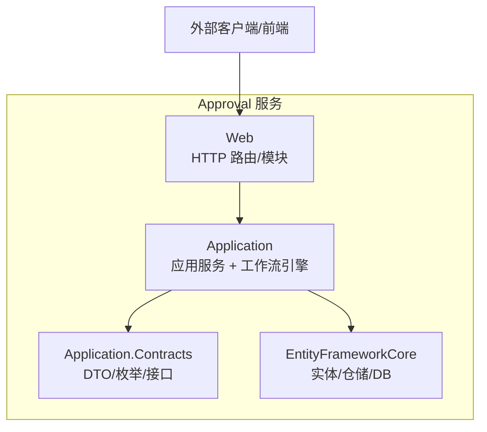
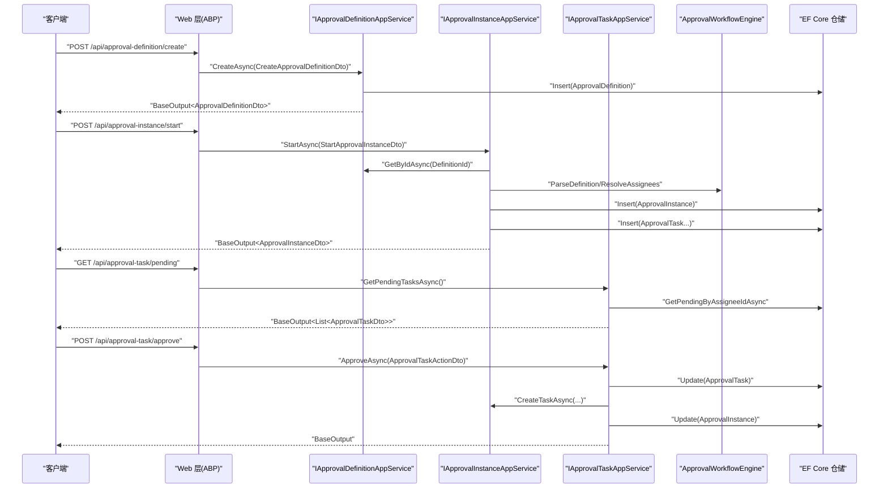
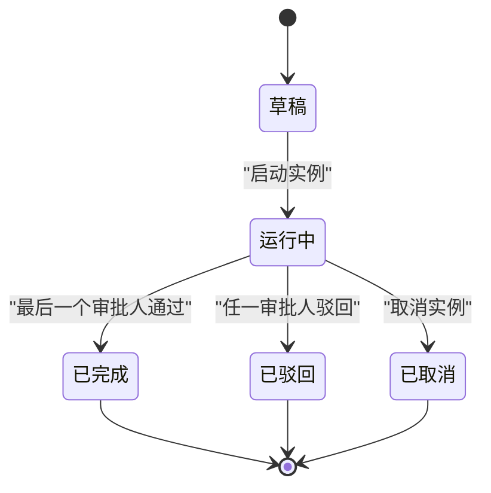
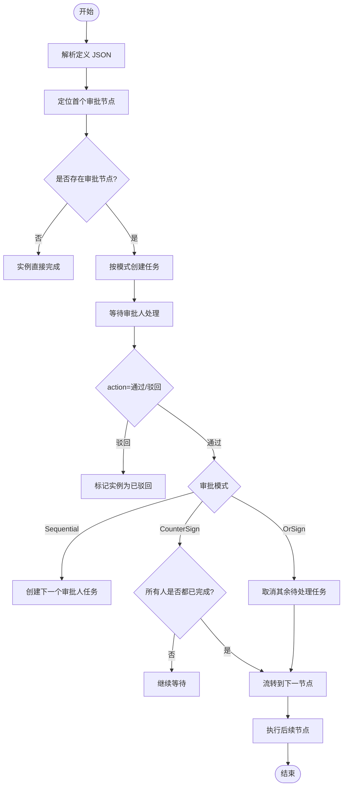
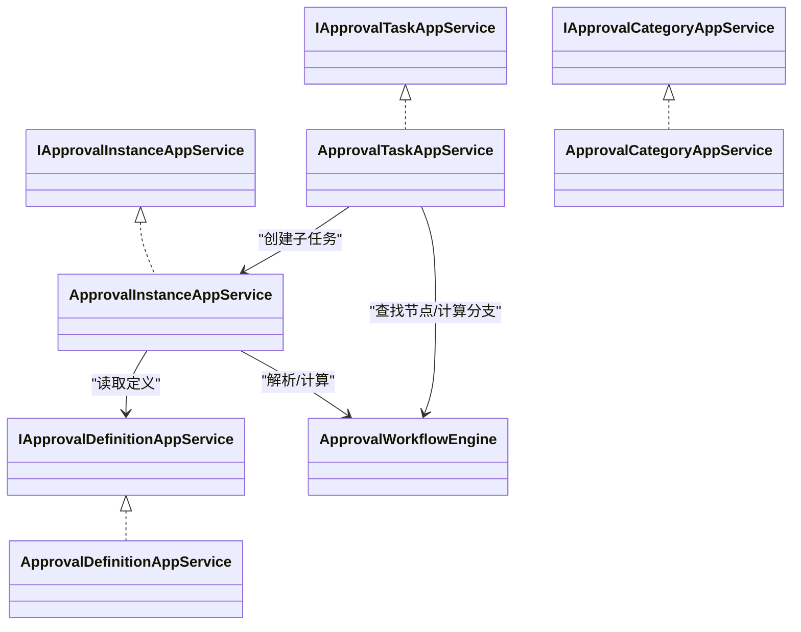

# Approval 审批流程 API

<cite>
**本文引用的文件**
- [ApprovalStatusEnum.cs](file://src/Services/Approval/H.Approval.Application.Contracts/Enums/ApprovalStatusEnum.cs)
- [IApprovalDefinitionAppService.cs](file://src/Services/Approval/H.Approval.Application.Contracts/Services/IApprovalDefinitionAppService.cs)
- [IApprovalInstanceAppService.cs](file://src/Services/Approval/H.Approval.Application.Contracts/Services/IApprovalInstanceAppService.cs)
- [IApprovalTaskAppService.cs](file://src/Services/Approval/H.Approval.Application.Contracts/Services/IApprovalTaskAppService.cs)
- [IApprovalCategoryAppService.cs](file://src/Services/Approval/H.Approval.Application.Contracts/Services/IApprovalCategoryAppService.cs)
- [ApprovalDefinitionDto.cs](file://src/Services/Approval/H.Approval.Application.Contracts/Dtos/ApprovalDefinitionDto.cs)
- [ApprovalInstanceDto.cs](file://src/Services/Approval/H.Approval.Application.Contracts/Dtos/ApprovalInstanceDto.cs)
- [ApprovalTaskDto.cs](file://src/Services/Approval/H.Approval.Application.Contracts/Dtos/ApprovalTaskDto.cs)
- [ApprovalCategoryDto.cs](file://src/Services/Approval/H.Approval.Application.Contracts/Dtos/ApprovalCategoryDto.cs)
- [ApprovalTemplateDto.cs](file://src/Services/Approval/H.Approval.Application.Contracts/Dtos/ApprovalTemplateDto.cs)
- [NodeModelBase.cs](file://src/Services/Approval/H.Approval.Application.Contracts/Workflow/NodeModelBase.cs)
- [NodeModels.cs](file://src/Services/Approval/H.Approval.Application.Contracts/Workflow/NodeModels.cs)
- [FormSchema.cs](file://src/Services/Approval/H.Approval.Application.Contracts/Workflow/FormSchema.cs)
- [ApprovalDefinitionAppService.cs](file://src/Services/Approval/H.Approval.Application/Services/ApprovalDefinitionAppService.cs)
- [ApprovalInstanceAppService.cs](file://src/Services/Approval/H.Approval.Application/Services/ApprovalInstanceAppService.cs)
- [ApprovalTaskAppService.cs](file://src/Services/Approval/H.Approval.Application/Services/ApprovalTaskAppService.cs)
- [ApprovalCategoryAppService.cs](file://src/Services/Approval/H.Approval.Application/Services/ApprovalCategoryAppService.cs)
- [ApprovalWorkflowEngine.cs](file://src/Services/Approval/H.Approval.Application/Services/ApprovalWorkflowEngine.cs)
- [README.md](file://README.md)
</cite>

## 目录
1. [简介](#简介)
2. [项目结构](#项目结构)
3. [核心组件](#核心组件)
4. [架构总览](#架构总览)
5. [接口规范](#接口规范)
6. [工作流与状态机](#工作流与状态机)
7. [依赖关系分析](#依赖关系分析)
8. [性能考虑](#性能考虑)
9. [故障排查指南](#故障排查指南)
10. [结论](#结论)

## 简介
本文件为 Approval 审批服务的 API 文档，面向调用方、前端与集成方。服务基于 ABP 模块化架构，采用 Application.Contracts / Application / EntityFrameworkCore / Web 的分层组织；对外通过 IAppService 暴露 HTTP API，统一返回 BaseOutput 包装结果。API 覆盖以下能力：
- 审批流程管理：分类管理、模板查询、定义创建/更新/删除、启用/禁用。
- 流程实例管理：按定义启动实例、查看发起的实例、取消实例。
- 任务管理与审批操作：待办列表、已办列表、实例任务历史、审批通过/驳回并推进流程。

该实现当前未提供“转交”“加签”专用接口，但支持多角色/多人审批模式、条件分支与表单变量驱动的流程分支。

**章节来源**
- [README.md:1-73](file://README.md#L1-L73)

## 项目结构
Approval 服务位于 Services 子模块下，核心代码分布如下：
- Application.Contracts：对外契约（DTO、枚举、工作流节点模型、应用服务接口）。
- Application：应用服务实现（业务编排、工作流引擎调用、审计日志）。
- EntityFrameworkCore：实体、仓储、DbContext、迁移配置。
- Web：Web 模块注册与路由绑定（ABP 约定）。

**图示来源**
- [IApprovalDefinitionAppService.cs:1-45](file://src/Services/Approval/H.Approval.Application.Contracts/Services/IApprovalDefinitionAppService.cs#L1-L45)
- [ApprovalDefinitionAppService.cs:1-162](file://src/Services/Approval/H.Approval.Application/Services/ApprovalDefinitionAppService.cs#L1-L162)
- [ApprovalInstanceAppService.cs:1-200](file://src/Services/Approval/H.Approval.Application/Services/ApprovalInstanceAppService.cs#L1-L200)
- [ApprovalTaskAppService.cs:1-200](file://src/Services/Approval/H.Approval.Application/Services/ApprovalTaskAppService.cs#L1-L200)
- [ApprovalWorkflowEngine.cs](file://src/Services/Approval/H.Approval.Application/Services/ApprovalWorkflowEngine.cs)

**章节来源**
- [README.md:1-73](file://README.md#L1-L73)

## 核心组件
- 应用服务接口
  - IApprovalDefinitionAppService：审批定义的 CRUD、启用/禁用、模板查询。
  - IApprovalInstanceAppService：启动实例、查询发起实例、获取详情、取消实例。
  - IApprovalTaskAppService：待办/已办列表、实例任务历史、审批通过/驳回。
  - IApprovalCategoryAppService：分类 CRUD、重命名、删除。
- DTO 与枚举
  - 定义、实例、任务、分类、模板等 DTO。
  - 工作流状态 ApprovalStatusEnum：草稿、运行中、已完成、已取消、已驳回。
- 工作流模型
  - NodeModelBase 及其派生类型：StartNodeModel、ApproveModel、CarbonCopyModel、ConditionModel、BranchModel、EndNodeModel。
  - ApproverModeEnum：依次审批、会签、或签。
  - ApproverTypeEnum/CarbonCopyTypeEnum/StartTypeEnum：审批人/抄送人/发起人策略。
  - FormSchema/FormFieldModel：表单字段 Schema。

**章节来源**
- [IApprovalDefinitionAppService.cs:1-45](file://src/Services/Approval/H.Approval.Application.Contracts/Services/IApprovalDefinitionAppService.cs#L1-L45)
- [IApprovalInstanceAppService.cs:1-30](file://src/Services/Approval/H.Approval.Application.Contracts/Services/IApprovalInstanceAppService.cs#L1-L30)
- [IApprovalTaskAppService.cs:1-30](file://src/Services/Approval/H.Approval.Application.Contracts/Services/IApprovalTaskAppService.cs#L1-L30)
- [IApprovalCategoryAppService.cs:1-30](file://src/Services/Approval/H.Approval.Application.Contracts/Services/IApprovalCategoryAppService.cs#L1-L30)
- [ApprovalStatusEnum.cs:1-32](file://src/Services/Approval/H.Approval.Application.Contracts/Enums/ApprovalStatusEnum.cs#L1-L32)
- [NodeModelBase.cs:1-98](file://src/Services/Approval/H.Approval.Application.Contracts/Workflow/NodeModelBase.cs#L1-L98)
- [NodeModels.cs:1-205](file://src/Services/Approval/H.Approval.Application.Contracts/Workflow/NodeModels.cs#L1-L205)
- [FormSchema.cs:1-77](file://src/Services/Approval/H.Approval.Application.Contracts/Workflow/FormSchema.cs#L1-L77)

## 架构总览
下图展示从客户端到数据库的核心调用链，包括定义、实例、任务与工作流引擎的协作关系。

**图示来源**
- [ApprovalDefinitionAppService.cs:1-162](file://src/Services/Approval/H.Approval.Application/Services/ApprovalDefinitionAppService.cs#L1-L162)
- [ApprovalInstanceAppService.cs:1-200](file://src/Services/Approval/H.Approval.Application/Services/ApprovalInstanceAppService.cs#L1-L200)
- [ApprovalTaskAppService.cs:1-200](file://src/Services/Approval/H.Approval.Application/Services/ApprovalTaskAppService.cs#L1-L200)
- [ApprovalWorkflowEngine.cs](file://src/Services/Approval/H.Approval.Application/Services/ApprovalWorkflowEngine.cs)

## 接口规范

### 通用约定
- 协议：HTTP RESTful
- 内容类型：application/json
- 统一返回：BaseOutput<T>，包含数据与标准错误码/消息（由框架封装）
- 认证：基于 ABP 用户上下文（当前登录用户通过 IHttpContextAccessor 解析）

### 1. 审批分类管理（IApprovalCategoryAppService）

#### 1.1 获取所有分类
- 方法：GET
- URL：/api/approval-category/get-all
- 请求参数：无
- 响应：BaseOutput<List<ApprovalCategoryDto>>
- 说明：返回排序后的分类列表。

#### 1.2 创建分类
- 方法：POST
- URL：/api/approval-category/create
- 请求体：CreateApprovalCategoryDto
  - name: string（必填）
- 响应：BaseOutput<ApprovalCategoryDto>

#### 1.3 重命名分类
- 方法：POST
- URL：/api/approval-category/rename
- 请求体：RenameApprovalCategoryDto
  - id: string（必填）
  - name: string（必填）
- 响应：BaseOutput<ApprovalCategoryDto>
- 行为：同步更新引用该分类名的审批定义 CategoryName。

#### 1.4 删除分类
- 方法：DELETE
- URL：/api/approval-category/delete
- 路径参数：id
- 响应：BaseOutput
- 行为：将引用该分类的审批定义归入未分类。

**章节来源**
- [IApprovalCategoryAppService.cs:1-30](file://src/Services/Approval/H.Approval.Application.Contracts/Services/IApprovalCategoryAppService.cs#L1-L30)
- [ApprovalCategoryDto.cs:1-54](file://src/Services/Approval/H.Approval.Application.Contracts/Dtos/ApprovalCategoryDto.cs#L1-L54)
- [ApprovalCategoryAppService.cs:1-143](file://src/Services/Approval/H.Approval.Application/Services/ApprovalCategoryAppService.cs#L1-L143)

### 2. 审批定义管理（IApprovalDefinitionAppService）

#### 2.1 获取所有定义
- 方法：GET
- URL：/api/approval-definition/get-all
- 响应：BaseOutput<List<ApprovalDefinitionDto>>

#### 2.2 根据 ID 获取定义
- 方法：GET
- URL：/api/approval-definition/get-by-id
- 路径参数：id
- 响应：BaseOutput<ApprovalDefinitionDto>

#### 2.3 创建定义
- 方法：POST
- URL：/api/approval-definition/create
- 请求体：CreateApprovalDefinitionDto
  - name: string（必填）
  - description: string?
  - definitionJson: string（必填，JSON 字符串，见“工作流 JSON 格式”）
  - formJson: string?（表单 Schema JSON）
  - icon: string?
  - categoryId: string?
  - categoryName: string?
  - whoCanStart: string（All/Specified/Role）
  - specifiedStarters: string?（JSON 数组字符串）
  - adminType: string（All/Specified）
  - specifiedAdmins: string?（JSON 数组字符串）
- 响应：BaseOutput<ApprovalDefinitionDto>

#### 2.4 更新定义
- 方法：POST
- URL：/api/approval-definition/update
- 请求体：UpdateApprovalDefinitionDto（字段同 Create，额外含 id）
- 响应：BaseOutput<ApprovalDefinitionDto>

#### 2.5 删除定义
- 方法：DELETE
- URL：/api/approval-definition/delete
- 路径参数：id
- 响应：BaseOutput

#### 2.6 启用/禁用定义
- 方法：POST
- URL：/api/approval-definition/toggle-enabled
- 请求体：{ id: string, enabled: boolean }
- 响应：BaseOutput

#### 2.7 获取预置模板
- 方法：GET
- URL：/api/approval-definition/templates
- 响应：BaseOutput<List<ApprovalTemplateDto>>

**章节来源**
- [IApprovalDefinitionAppService.cs:1-45](file://src/Services/Approval/H.Approval.Application.Contracts/Services/IApprovalDefinitionAppService.cs#L1-L45)
- [ApprovalDefinitionDto.cs:1-214](file://src/Services/Approval/H.Approval.Application.Contracts/Dtos/ApprovalDefinitionDto.cs#L1-L214)
- [ApprovalTemplateDto.cs:1-53](file://src/Services/Approval/H.Approval.Application.Contracts/Dtos/ApprovalTemplateDto.cs#L1-L53)
- [ApprovalDefinitionAppService.cs:1-162](file://src/Services/Approval/H.Approval.Application/Services/ApprovalDefinitionAppService.cs#L1-L162)

### 3. 流程实例管理（IApprovalInstanceAppService）

#### 3.1 启动实例
- 方法：POST
- URL：/api/approval-instance/start
- 请求体：StartApprovalInstanceDto
  - definitionId: string（必填）
  - title: string（必填）
  - variablesJson: string?（可选，JSON 字符串，用于条件分支求值）
- 响应：BaseOutput<ApprovalInstanceDto>
- 行为：
  - 校验定义存在且可解析。
  - 创建实例并定位首个审批节点。
  - 若无审批节点，直接完成实例。
  - 根据 ApproverMode 批量或顺序创建任务。

#### 3.2 我发起的审批实例
- 方法：GET
- URL：/api/approval-instance/my-approvals
- 响应：BaseOutput<List<ApprovalInstanceDto>>

#### 3.3 获取实例详情
- 方法：GET
- URL：/api/approval-instance/get-by-id
- 路径参数：id
- 响应：BaseOutput<ApprovalInstanceDto>
- 说明：返回实例基本信息及关联的任务历史 Tasks。

#### 3.4 取消实例
- 方法：POST
- URL：/api/approval-instance/cancel
- 请求体：{ id: string }
- 响应：BaseOutput
- 行为：实例状态设为 Cancelled，并将该实例下的所有待处理任务标记为已取消。

**章节来源**
- [IApprovalInstanceAppService.cs:1-30](file://src/Services/Approval/H.Approval.Application.Contracts/Services/IApprovalInstanceAppService.cs#L1-L30)
- [ApprovalInstanceDto.cs:1-93](file://src/Services/Approval/H.Approval.Application.Contracts/Dtos/ApprovalInstanceDto.cs#L1-L93)
- [ApprovalInstanceAppService.cs:1-200](file://src/Services/Approval/H.Approval.Application/Services/ApprovalInstanceAppService.cs#L1-L200)

### 4. 任务与审批操作（IApprovalTaskAppService）

#### 4.1 待我审批的任务
- 方法：GET
- URL：/api/approval-task/pending
- 响应：BaseOutput<List<ApprovalTaskDto>>

#### 4.2 我已审批的任务
- 方法：GET
- URL：/api/approval-task/completed
- 响应：BaseOutput<List<ApprovalTaskDto>>

#### 4.3 实例任务历史
- 方法：GET
- URL：/api/approval-task/by-instance
- 路径参数：instanceId
- 响应：BaseOutput<List<ApprovalTaskDto>>

#### 4.4 审批任务（通过/驳回）
- 方法：POST
- URL：/api/approval-task/approve
- 请求体：ApprovalTaskActionDto
  - taskId: string（必填）
  - action: int（1=通过，2=驳回）
  - comment: string?
- 响应：BaseOutput
- 行为：
  - 拒绝重复处理。
  - 驳回：取消同节点其他待处理任务，实例结束并标记 Rejected。
  - 通过：根据 ApproverMode 判断是否流转下一节点。
    - Sequential：创建下一个审批人的任务，不流转节点。
    - CounterSign：等待所有人处理完后再流转。
    - OrSign：一人通过即取消其余待处理任务，立即流转。

注意：当前实现未提供“转交”“加签”接口。若需扩展，可在 TaskAppService 新增相应动作并在 WorkflowEngine 中扩展分配逻辑。

**章节来源**
- [IApprovalTaskAppService.cs:1-30](file://src/Services/Approval/H.Approval.Application.Contracts/Services/IApprovalTaskAppService.cs#L1-L30)
- [ApprovalTaskDto.cs:1-88](file://src/Services/Approval/H.Approval.Application.Contracts/Dtos/ApprovalTaskDto.cs#L1-L88)
- [ApprovalTaskAppService.cs:1-200](file://src/Services/Approval/H.Approval.Application/Services/ApprovalTaskAppService.cs#L1-L200)

## 工作流与状态机

### 状态机
- 实例状态 ApprovalStatusEnum：
  - Draft（草稿）= 0
  - Running（运行中）= 1
  - Completed（已完成）= 2
  - Cancelled（已取消）= 3
  - Rejected（已驳回）= 4
- 任务状态 Status（整数）：
  - 0=待审批
  - 1=已通过
  - 2=已驳回
  - 3=已取消（取消实例时设置）

**图示来源**
- [ApprovalStatusEnum.cs:1-32](file://src/Services/Approval/H.Approval.Application.Contracts/Enums/ApprovalStatusEnum.cs#L1-L32)
- [ApprovalInstanceAppService.cs:1-200](file://src/Services/Approval/H.Approval.Application/Services/ApprovalInstanceAppService.cs#L1-L200)
- [ApprovalTaskAppService.cs:1-200](file://src/Services/Approval/H.Approval.Application/Services/ApprovalTaskAppService.cs#L1-L200)

### 流转规则与条件分支
- 节点类型：
  - StartNodeModel：发起人控制（全员/指定成员/指定角色）。
  - ApproveModel：审批节点，支持多人审批模式（Sequential/CounterSign/OrSign）。
  - CarbonCopyModel：抄送节点。
  - BranchModel + ConditionModel：条件分支，Rules 为 AND 组合，支持默认分支。
  - EndNodeModel：结束节点。
- 变量与表单：
  - VariablesJson：启动时传入，供条件分支求值使用。
  - FormSchema：表单字段定义，支持 input/textarea/number/amount/date/daterange/radio/checkbox/description 等类型。

**图示来源**
- [NodeModelBase.cs:1-98](file://src/Services/Approval/H.Approval.Application.Contracts/Workflow/NodeModelBase.cs#L1-L98)
- [NodeModels.cs:1-205](file://src/Services/Approval/H.Approval.Application.Contracts/Workflow/NodeModels.cs#L1-L205)
- [ApprovalInstanceAppService.cs:1-200](file://src/Services/Approval/H.Approval.Application/Services/ApprovalInstanceAppService.cs#L1-L200)
- [ApprovalTaskAppService.cs:1-200](file://src/Services/Approval/H.Approval.Application/Services/ApprovalTaskAppService.cs#L1-L200)

### 复杂审批工作流 JSON 格式
- DefinitionJson 是根节点 JSON 字符串，使用 NodeModelBaseConverter 进行多态反序列化。
- 根节点必须包含 nodeType（或 NodeType）字段，支持 Start/Approve/CarbonCopy/Condition/Branch。
- 条件分支以 BranchModel 作为容器，内部包含多个 ConditionModel；每个 ConditionModel 有 Rules 列表（AND 关系），每条规则包含 Field/Operator/Value。
- 表单设计通过 FormSchema.Fields 描述字段类型、标签、占位符、是否必填、选项等。

参考字段与类型：
- 节点基类：Id、NodeName、NodeType、IsInput、ChildNodes、ConditionNodes。
- 审批人类型 ApproverTypeEnum：Specified/StarterSelect/StarterSelf/Role/DepartmentManager。
- 多人审批 ApproverModeEnum：Sequential/CounterSign/OrSign。
- 发起人类型 StartTypeEnum：All/Specified/Role。
- 抄送类型 CarbonCopyTypeEnum：Specified/StarterSelect/Role。

**章节来源**
- [NodeModelBase.cs:1-98](file://src/Services/Approval/H.Approval.Application.Contracts/Workflow/NodeModelBase.cs#L1-L98)
- [NodeModels.cs:1-205](file://src/Services/Approval/H.Approval.Application.Contracts/Workflow/NodeModels.cs#L1-L205)
- [FormSchema.cs:1-77](file://src/Services/Approval/H.Approval.Application.Contracts/Workflow/FormSchema.cs#L1-L77)

## 依赖关系分析

**图示来源**
- [IApprovalDefinitionAppService.cs:1-45](file://src/Services/Approval/H.Approval.Application.Contracts/Services/IApprovalDefinitionAppService.cs#L1-L45)
- [IApprovalInstanceAppService.cs:1-30](file://src/Services/Approval/H.Approval.Application.Contracts/Services/IApprovalInstanceAppService.cs#L1-L30)
- [IApprovalTaskAppService.cs:1-30](file://src/Services/Approval/H.Approval.Application.Contracts/Services/IApprovalTaskAppService.cs#L1-L30)
- [IApprovalCategoryAppService.cs:1-30](file://src/Services/Approval/H.Approval.Application.Contracts/Services/IApprovalCategoryAppService.cs#L1-L30)
- [ApprovalDefinitionAppService.cs:1-162](file://src/Services/Approval/H.Approval.Application/Services/ApprovalDefinitionAppService.cs#L1-L162)
- [ApprovalInstanceAppService.cs:1-200](file://src/Services/Approval/H.Approval.Application/Services/ApprovalInstanceAppService.cs#L1-L200)
- [ApprovalTaskAppService.cs:1-200](file://src/Services/Approval/H.Approval.Application/Services/ApprovalTaskAppService.cs#L1-L200)
- [ApprovalWorkflowEngine.cs](file://src/Services/Approval/H.Approval.Application/Services/ApprovalWorkflowEngine.cs)

**章节来源**
- [ApprovalDefinitionAppService.cs:1-162](file://src/Services/Approval/H.Approval.Application/Services/ApprovalDefinitionAppService.cs#L1-L162)
- [ApprovalInstanceAppService.cs:1-200](file://src/Services/Approval/H.Approval.Application/Services/ApprovalInstanceAppService.cs#L1-L200)
- [ApprovalTaskAppService.cs:1-200](file://src/Services/Approval/H.Approval.Application/Services/ApprovalTaskAppService.cs#L1-L200)
- [ApprovalCategoryAppService.cs:1-143](file://src/Services/Approval/H.Approval.Application/Services/ApprovalCategoryAppService.cs#L1-L143)

## 性能考虑
- 定义与模板：定义与模板多为只读或低频变更，建议对 GetTemplatesAsync 与 GetAllAsync 增加缓存以减少数据库压力。
- 任务列表：待办/已办按用户维度查询，建议在仓储层按 AssigneeId 建立索引以提升分页与过滤效率。
- 工作流引擎：解析定义与变量在启动与审批时被频繁调用，可考虑缓存已解析的节点树与变量映射，避免重复序列化开销。
- 批量操作：会签/或签场景可能产生大量任务更新，建议使用事务或批处理写入以降低锁竞争。

[本节为通用优化建议，不涉及具体文件分析]

## 故障排查指南
- 常见异常
  - KeyNotFoundException：定义/实例/任务不存在，检查 ID 是否正确或对象是否已被删除。
  - InvalidOperationException：
    - 定义为空无法启动。
    - 任务已处理再次操作。
  - UserFriendlyException：分类名称为空或重复。
- 日志与审计
  - 各应用服务通过 ILogger 记录关键步骤（创建、更新、删除、启用/禁用、启动实例、审批通过/驳回、取消实例等）。
  - 建议在网关或中间件层补充统一的审计日志，记录请求 IP、用户、耗时、错误堆栈。
- 超时与重试
  - 当前未实现显式超时处理；建议在 HTTP 层配置超时与重试策略，并对长时间运行的工作流推进增加幂等保护。
- 异常流程恢复
  - 取消实例会将实例置为 Cancelled，并标记相关待办任务为已取消。
  - 若出现“悬挂任务”（实例已结束但仍有待处理任务），可通过实例 ID 清理对应任务状态。

**章节来源**
- [ApprovalDefinitionAppService.cs:1-162](file://src/Services/Approval/H.Approval.Application/Services/ApprovalDefinitionAppService.cs#L1-L162)
- [ApprovalInstanceAppService.cs:1-200](file://src/Services/Approval/H.Approval.Application/Services/ApprovalInstanceAppService.cs#L1-L200)
- [ApprovalTaskAppService.cs:1-200](file://src/Services/Approval/H.Approval.Application/Services/ApprovalTaskAppService.cs#L1-L200)
- [ApprovalCategoryAppService.cs:1-143](file://src/Services/Approval/H.Approval.Application/Services/ApprovalCategoryAppService.cs#L1-L143)

## 结论
Approval 服务提供了完整的审批流程管理能力，涵盖分类、模板、定义、实例与任务全生命周期，并通过工作流引擎支持条件分支与多种多人审批模式。当前实现聚焦于通过/驳回与基础流转，未内置“转交”“加签”功能；如需增强，可在任务服务与工作流引擎中扩展相应逻辑。结合日志与异常处理，可满足企业级审批场景的稳定运行需求。

[本节为总结性内容，不涉及具体文件分析]