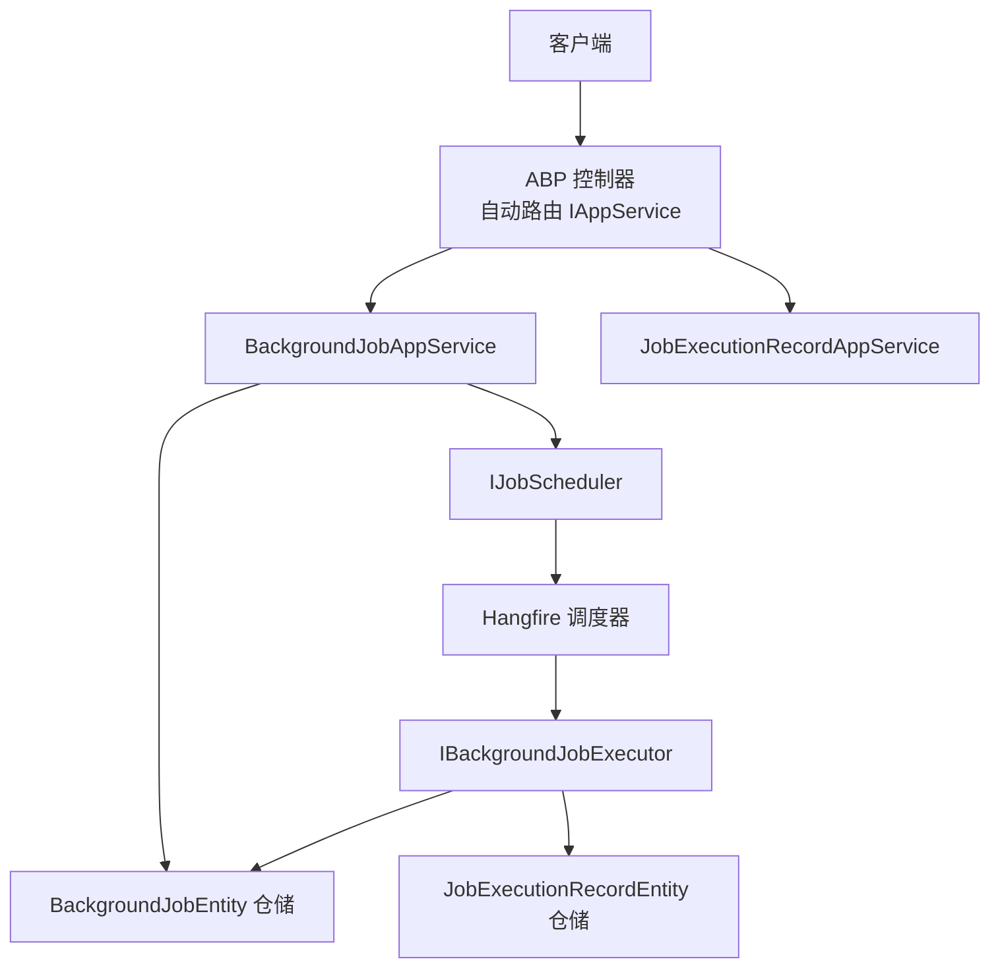
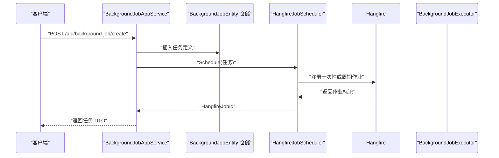
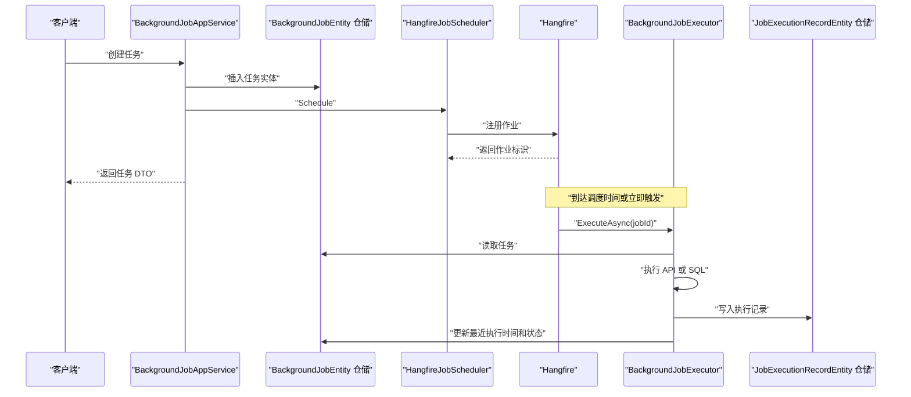
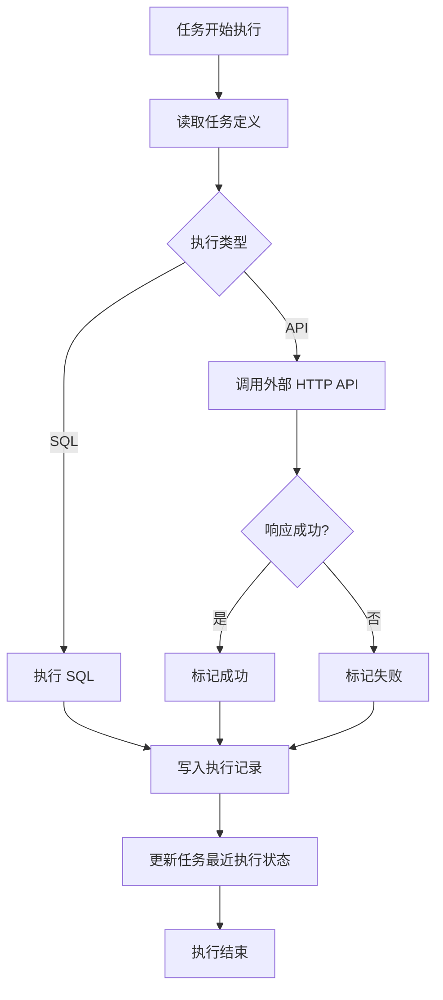
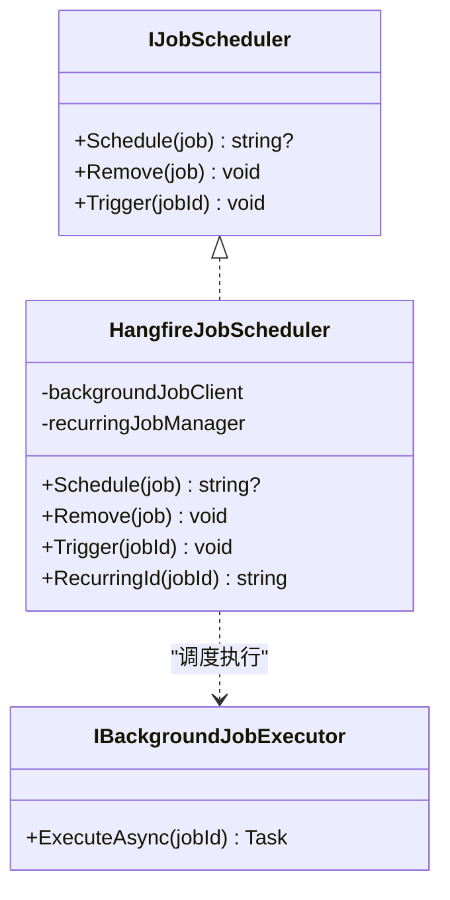
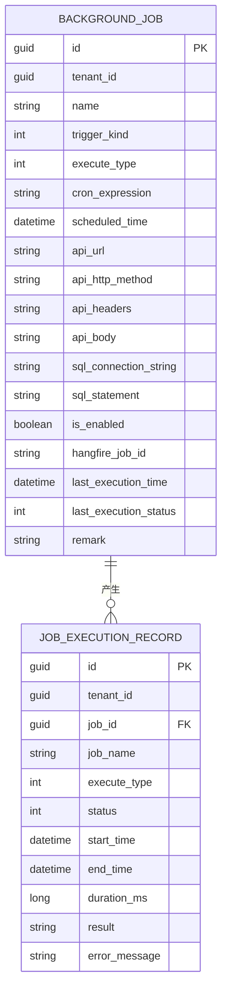
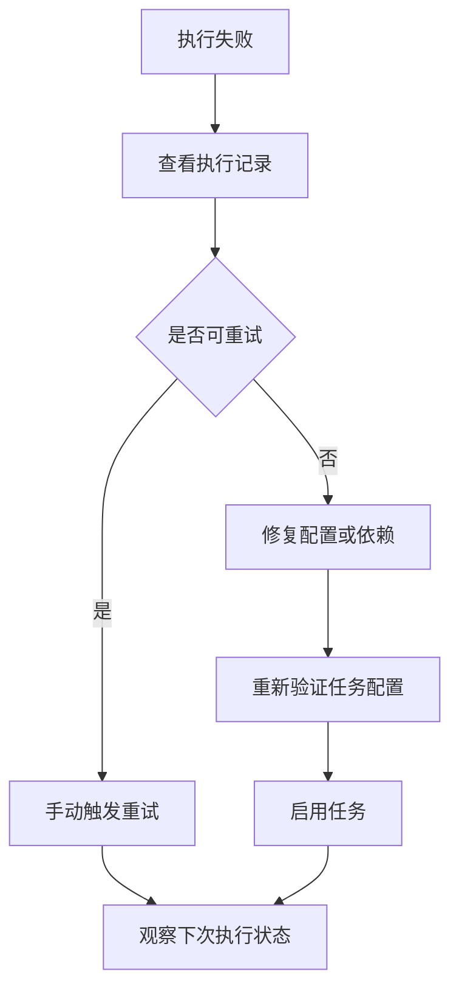

# BackgroundTask 后台任务 API

<cite>
**本文引用的文件**
- [BackgroundTaskEnums.cs](file://src/Services/BackgroundTask/H.BackgroundTask.Application.Contracts/Enums/BackgroundTaskEnums.cs)
- [BackgroundJobDtos.cs](file://src/Services/BackgroundTask/H.BackgroundTask.Application.Contracts/Dtos/BackgroundJobDtos.cs)
- [JobExecutionRecordDtos.cs](file://src/Services/BackgroundTask/H.BackgroundTask.Application.Contracts/Dtos/JobExecutionRecordDtos.cs)
- [IBackgroundJobAppService.cs](file://src/Services/BackgroundTask/H.BackgroundTask.Application.Contracts/Services/IBackgroundJobAppService.cs)
- [IJobExecutionRecordAppService.cs](file://src/Services/BackgroundTask/H.BackgroundTask.Application.Contracts/Services/IJobExecutionRecordAppService.cs)
- [BackgroundJobAppService.cs](file://src/Services/BackgroundTask/H.BackgroundTask.Application/Services/BackgroundJobAppService.cs)
- [JobExecutionRecordAppService.cs](file://src/Services/BackgroundTask/H.BackgroundTask.Application/Services/JobExecutionRecordAppService.cs)
- [IJobScheduler.cs](file://src/Services/BackgroundTask/H.BackgroundTask.Application/Services/IJobScheduler.cs)
- [HangfireJobScheduler.cs](file://src/Services/BackgroundTask/H.BackgroundTask.Application/Services/HangfireJobScheduler.cs)
- [IBackgroundJobExecutor.cs](file://src/Services/BackgroundTask/H.BackgroundTask.Application/Services/IBackgroundJobExecutor.cs)
- [BackgroundJobExecutor.cs](file://src/Services/BackgroundTask/H.BackgroundTask.Application/Services/BackgroundJobExecutor.cs)
- [BackgroundJobEntity.cs](file://src/Services/BackgroundTask/H.BackgroundTask.EntityFrameworkCore/Entities/BackgroundJobEntity.cs)
- [JobExecutionRecordEntity.cs](file://src/Services/BackgroundTask/H.BackgroundTask.EntityFrameworkCore/Entities/JobExecutionRecordEntity.cs)
</cite>

## 目录
1. [简介](#简介)
2. [项目结构与定位](#项目结构与定位)
3. [核心组件](#核心组件)
4. [架构总览](#架构总览)
5. [API 文档：后台任务管理](#api-文档：后台任务管理)
6. [API 文档：执行记录查询](#api-文档：执行记录查询)
7. [调度与执行流程](#调度与执行流程)
8. [Hangfire 集成机制](#hangfire-集成机制)
9. [任务持久化与数据结构](#任务持久化与数据结构)
10. [分布式执行与故障恢复](#分布式执行与故障恢复)
11. [性能监控与队列管理最佳实践](#性能监控与队列管理最佳实践)
12. [常见问题排查](#常见问题排查)
13. [结论](#结论)

## 简介
BackgroundTask 服务提供统一的后台任务管理能力，基于 ABP 应用服务暴露 RESTful HTTP 接口，并使用 Hangfire 作为任务调度与执行引擎。它支持两类任务：
- 调用外部 HTTP API 的任务
- 直接执行 SQL 的任务

任务可以一次性执行或按 Cron 表达式周期执行；支持启用、禁用、手动触发；每次执行都会写入持久化的执行记录，便于查询失败原因、耗时统计和重试分析。

## 项目结构与定位
BackgroundTask 采用 ABP 典型分层结构：
- Application.Contracts：对外暴露的应用服务接口、DTO、枚举
- Application：应用服务实现、Hangfire 调度封装、任务执行器
- EntityFrameworkCore：领域实体、EF Core 模块
- Web：Web 模块标记类



**图表来源**
- [BackgroundJobAppService.cs:1-143](file://src/Services/BackgroundTask/H.BackgroundTask.Application/Services/BackgroundJobAppService.cs#L1-L143)
- [JobExecutionRecordAppService.cs:1-46](file://src/Services/BackgroundTask/H.BackgroundTask.Application/Services/JobExecutionRecordAppService.cs#L1-L46)
- [IJobScheduler.cs:1-21](file://src/Services/BackgroundTask/H.BackgroundTask.Application/Services/IJobScheduler.cs#L1-L21)
- [HangfireJobScheduler.cs:1-89](file://src/Services/BackgroundTask/H.BackgroundTask.Application/Services/HangfireJobScheduler.cs#L1-L89)
- [BackgroundJobExecutor.cs:1-173](file://src/Services/BackgroundTask/H.BackgroundTask.Application/Services/BackgroundJobExecutor.cs#L1-L173)

**章节来源**
- [README.md:1-73](file://README.md#L1-L73)

## 核心组件
- `IBackgroundJobAppService`：后台任务管理接口，包含分页查询、获取、创建、更新、删除、启用、禁用、立即触发。
- `IJobExecutionRecordAppService`：执行记录查询接口，包含分页查询和单条记录查询。
- `BackgroundJobAppService`：应用服务实现，负责输入校验、实体保存、与 Hangfire 调度同步。
- `JobExecutionRecordAppService`：执行记录查询实现。
- `IJobScheduler`：调度抽象，屏蔽 Hangfire 细节。
- `HangfireJobScheduler`：基于 Hangfire 的调度实现，负责注册、移除、立即触发。
- `IBackgroundJobExecutor`：执行器接口，由 Hangfire 在后台线程调用。
- `BackgroundJobExecutor`：执行器实现，调用外部 API 或执行 SQL，并记录结果。
- `BackgroundJobEntity`：后台任务定义实体。
- `JobExecutionRecordEntity`：任务执行记录实体。
- 枚举：`JobTriggerKind`（一次性、周期）、`JobExecuteType`（API、SQL）、`JobExecutionStatus`（成功、失败）。

**章节来源**
- [IBackgroundJobAppService.cs:1-35](file://src/Services/BackgroundTask/H.BackgroundTask.Application.Contracts/Services/IBackgroundJobAppService.cs#L1-L35)
- [IJobExecutionRecordAppService.cs:1-16](file://src/Services/BackgroundTask/H.BackgroundTask.Application.Contracts/Services/IJobExecutionRecordAppService.cs#L1-L16)
- [BackgroundJobAppService.cs:1-143](file://src/Services/BackgroundTask/H.BackgroundTask.Application/Services/BackgroundJobAppService.cs#L1-L143)
- [JobExecutionRecordAppService.cs:1-46](file://src/Services/BackgroundTask/H.BackgroundTask.Application/Services/JobExecutionRecordAppService.cs#L1-L46)
- [IJobScheduler.cs:1-21](file://src/Services/BackgroundTask/H.BackgroundTask.Application/Services/IJobScheduler.cs#L1-L21)
- [HangfireJobScheduler.cs:1-89](file://src/Services/BackgroundTask/H.BackgroundTask.Application/Services/HangfireJobScheduler.cs#L1-L89)
- [IBackgroundJobExecutor.cs:1-13](file://src/Services/BackgroundTask/H.BackgroundTask.Application/Services/IBackgroundJobExecutor.cs#L1-L13)
- [BackgroundJobExecutor.cs:1-173](file://src/Services/BackgroundTask/H.BackgroundTask.Application/Services/BackgroundJobExecutor.cs#L1-L173)
- [BackgroundTaskEnums.cs:1-37](file://src/Services/BackgroundTask/H.BackgroundTask.Application.Contracts/Enums/BackgroundTaskEnums.cs#L1-L37)

## 架构总览
BackgroundTask 的服务边界如下：
- 客户端通过 ABP 约定的 HTTP 接口调用应用服务。
- 应用服务负责业务校验、持久化任务定义，并与 Hangfire 同步调度信息。
- Hangfire 负责持久化调度元数据、队列管理和作业执行。
- 执行器在工作单元中读取任务、执行 API 或 SQL，并写回执行记录和任务最近一次状态。



**图表来源**
- [BackgroundJobAppService.cs:55-80](file://src/Services/BackgroundTask/H.BackgroundTask.Application/Services/BackgroundJobAppService.cs#L55-L80)
- [HangfireJobScheduler.cs:26-61](file://src/Services/BackgroundTask/H.BackgroundTask.Application/Services/HangfireJobScheduler.cs#L26-L61)

## API 文档：后台任务管理

### 公共说明
- 基础路径：`/api/background-job`
- 认证方式：由 ABP 统一认证体系决定，接口本身不额外定义鉴权参数。
- 返回值包装：所有响应使用 `BaseOutput<T>` 包装。
- 分页请求参数：继承 `PagedResultRequestDto`，通常包含 `SkipCount`、`MaxResultCount`。
- 枚举值：
  - `triggerKind`：`0` 表示一次性任务，`1` 表示周期任务。
  - `executeType`：`0` 表示调用 API，`1` 表示执行 SQL。
  - `lastExecutionStatus`：`null` 表示未执行，`0` 表示成功，`1` 表示失败。

### 分页查询任务
- **HTTP 方法**：GET
- **URL**：`/api/background-job`
- **查询参数**
  - `filter`：任务名称关键词
  - `triggerKind`：调度方式
  - `executeType`：执行类型
  - `isEnabled`：是否启用
  - `skipCount`：跳过数量
  - `maxResultCount`：每页数量
- **响应体**：`BaseOutput<PagedResultDto<BackgroundJobDto>>`
- **字段说明**
  - `totalCount`：总数
  - `items`：任务列表
- **成功示例**
```json
{
  "success": true,
  "result": {
    "totalCount": 3,
    "items": [
      {
        "id": "a1b2c3d4-e5f6-7890-abcd-ef1234567890",
        "name": "定时清理日志",
        "triggerKind": 1,
        "executeType": 1,
        "cronExpression": "0 2 * * *",
        "scheduledTime": null,
        "apiUrl": null,
        "apiHttpMethod": null,
        "apiHeaders": null,
        "apiBody": null,
        "sqlConnectionString": null,
        "sqlStatement": null,
        "isEnabled": true,
        "hangfireJobId": "bgtask:a1b2c3d4-e5f6-7890-abcd-ef1234567890",
        "lastExecutionTime": "2026-09-29T02:00:00Z",
        "lastExecutionStatus": 0,
        "remark": "每天凌晨两点清理日志"
      }
    ]
  },
  "errors": []
}
```

### 按 ID 获取任务
- **HTTP 方法**：GET
- **URL**：`/api/background-job/{id}`
- **路径参数**：`id`，任务 GUID
- **响应体**：`BaseOutput<BackgroundJobDto>`

### 创建任务
- **HTTP 方法**：POST
- **URL**：`/api/background-job`
- **请求体**：`CreateBackgroundJobDto`
- **必填规则**
  - 周期任务必须提供 `cronExpression`
  - API 任务必须提供 `apiUrl`
  - SQL 任务必须同时提供 `sqlConnectionString` 和 `sqlStatement`
- **响应体**：`BaseOutput<BackgroundJobDto>`，包含新增后的 `hangfireJobId`
- **成功示例**
```json
{
  "success": true,
  "result": {
    "id": "a1b2c3d4-e5f6-7890-abcd-ef1234567890",
    "name": "调用对账接口",
    "triggerKind": 0,
    "executeType": 0,
    "cronExpression": null,
    "scheduledTime": "2026-09-30T10:00:00Z",
    "apiUrl": "https://example.com/api/reconcile",
    "apiHttpMethod": "POST",
    "apiHeaders": "{\"Authorization\":\"Bearer token\"}",
    "apiBody": "{\"date\":\"2026-09-29\"}",
    "sqlConnectionString": null,
    "sqlStatement": null,
    "isEnabled": true,
    "hangfireJobId": "8d3f2a1b-4c5e-6f7a-8b9c-0d1e2f3a4b5c",
    "lastExecutionTime": null,
    "lastExecutionStatus": null,
    "remark": "每日对账"
  },
  "errors": []
}
```

### 更新任务
- **HTTP 方法**：PUT
- **URL**：`/api/background-job/{id}`
- **路径参数**：`id`
- **请求体**：`UpdateBackgroundJobDto`
- **行为说明**
  - 先移除旧调度
  - 再按新配置重新注册 Hangfire 作业
  - 更新后返回最新 `hangfireJobId`
- **响应体**：`BaseOutput<BackgroundJobDto>`

### 删除任务
- **HTTP 方法**：DELETE
- **URL**：`/api/background-job/{id}`
- **路径参数**：`id`
- **行为说明**：从数据库删除任务，并从 Hangfire 移除对应作业
- **响应体**：`BaseOutput`

### 启用任务
- **HTTP 方法**：PUT
- **URL**：`/api/background-job/{id}/enable`
- **路径参数**：`id`
- **行为说明**：设置 `isEnabled=true`，并按当前任务定义重新注册 Hangfire 调度
- **响应体**：`BaseOutput`

### 禁用任务
- **HTTP 方法**：PUT
- **URL**：`/api/background-job/{id}/disable`
- **路径参数**：`id`
- **行为说明**：设置 `isEnabled=false`，移除 Hangfire 调度，清空 `hangfireJobId`
- **响应体**：`BaseOutput`

### 手动立即触发
- **HTTP 方法**：POST
- **URL**：`/api/background-job/{id}/trigger`
- **路径参数**：`id`
- **行为说明**：向 Hangfire 入队一次执行，不改变任务的调度配置
- **响应体**：`BaseOutput`

**章节来源**
- [BackgroundJobAppService.cs:25-143](file://src/Services/BackgroundTask/H.BackgroundTask.Application/Services/BackgroundJobAppService.cs#L25-L143)
- [BackgroundJobDtos.cs:1-115](file://src/Services/BackgroundTask/H.BackgroundTask.Application.Contracts/Dtos/BackgroundJobDtos.cs#L1-L115)
- [BackgroundTaskEnums.cs:1-37](file://src/Services/BackgroundTask/H.BackgroundTask.Application.Contracts/Enums/BackgroundTaskEnums.cs#L1-L37)

## API 文档：执行记录查询

### 分页查询执行记录
- **HTTP 方法**：GET
- **URL**：`/api/job-execution-record`
- **查询参数**
  - `jobId`：任务 ID
  - `status`：执行状态，`0` 成功，`1` 失败
  - `skipCount`：跳过数量
  - `maxResultCount`：每页数量
- **响应体**：`BaseOutput<PagedResultDto<JobCaseExecutionRecordDto>>`
- **成功示例**
```json
{
  "success": true,
  "result": {
    "totalCount": 2,
    "items": [
      {
        "id": "r1a2b3c4-d5e6-f7a8-b9c0-d1e2f3a4b5c6",
        "jobId": "a1b2c3d4-e5f6-7890-abcd-ef1234567890",
        "jobName": "定时清理日志",
        "executeType": 1,
        "status": 0,
        "startTime": "2026-09-29T02:00:00Z",
        "endTime": "2026-09-29T02:00:05Z",
        "durationMs": 5000,
        "result": "执行成功，影响行数：100",
        "errorMessage": null
      }
    ]
  },
  "errors": []
}
```

### 获取单条执行记录
- **HTTP 方法**：GET
- **URL**：`/api/job-execution-record/{id}`
- **路径参数**：`id`，执行记录 GUID
- **响应体**：`BaseOutput<JobCaseExecutionRecordDto>`

**章节来源**
- [IJobExecutionRecordAppService.cs:1-16](file://src/Services/BackgroundTask/H.BackgroundTask.Application.Contracts/Services/IJobExecutionRecordAppService.cs#L1-L16)
- [JobExecutionRecordAppService.cs:1-46](file://src/Services/BackgroundTask/H.BackgroundTask.Application/Services/JobExecutionRecordAppService.cs#L1-L46)
- [JobExecutionRecordDtos.cs:1-48](file://src/Services/BackgroundTask/H.BackgroundTask.Application.Contracts/Dtos/JobExecutionRecordDtos.cs#L1-L48)

## 调度与执行流程

### 创建任务到首次执行的完整时序


**图表来源**
- [BackgroundJobAppService.cs:55-110](file://src/Services/BackgroundTask/H.BackgroundTask.Application/Services/BackgroundJobAppService.cs#L55-L110)
- [HangfireJobScheduler.cs:26-89](file://src/Services/BackgroundTask/H.BackgroundTask.Application/Services/HangfireJobScheduler.cs#L26-L89)
- [BackgroundJobExecutor.cs:33-118](file://src/Services/BackgroundTask/H.BackgroundTask.Application/Services/BackgroundJobExecutor.cs#L33-L118)

### 任务执行状态变化模型
任务在执行前后会更新以下字段：
- `lastExecutionTime`：最近一次开始执行时间
- `lastExecutionStatus`：最近一次执行结果
- 执行记录表新增一条记录，包含开始时间、结束时间、耗时、结果或错误信息



**图表来源**
- [BackgroundJobExecutor.cs:33-118](file://src/Services/BackgroundTask/H.BackgroundTask.Application/Services/BackgroundJobExecutor.cs#L33-L118)
- [BackgroundTaskEnums.cs:1-37](file://src/Services/BackgroundTask/H.BackgroundTask.Application.Contracts/Enums/BackgroundTaskEnums.cs#L1-L37)

**章节来源**
- [BackgroundJobExecutor.cs:1-173](file://src/Services/BackgroundTask/H.BackgroundTask.Application/Services/BackgroundJobExecutor.cs#L1-L173)

## Hangfire 集成机制

### 调度抽象
`IJobScheduler` 将 Hangfire 的作业注册、移除、触发封装为三个操作：
- `Schedule`：根据任务定义注册一次性或周期作业，返回 Hangfire 作业标识
- `Remove`：移除 Hangfire 中的作业
- `Trigger`：立即入队一次执行

### Hangfire 具体实现
`HangfireJobScheduler` 的关键行为：
- 周期任务使用固定约定 id：`bgtask:{jobId}`
- 周期任务通过 `IRecurringJobManager.AddOrUpdate` 注册 Cron 调度
- 一次性任务：
  - 如果指定未来时间，则计划执行
  - 否则立即入队
- `Remove` 对周期任务和一次性任务分别调用不同 Hangfire API
- `Trigger` 总是立即入队执行



**图表来源**
- [IJobScheduler.cs:1-21](file://src/Services/BackgroundTask/H.BackgroundTask.Application/Services/IJobScheduler.cs#L1-L21)
- [HangfireJobScheduler.cs:1-89](file://src/Services/BackgroundTask/H.BackgroundTask.Application/Services/HangfireJobScheduler.cs#L1-L89)
- [IBackgroundJobExecutor.cs:1-13](file://src/Services/BackgroundTask/H.BackgroundTask.Application/Services/IBackgroundJobExecutor.cs#L1-L13)

**章节来源**
- [IJobScheduler.cs:1-21](file://src/Services/BackgroundTask/H.BackgroundTask.Application/Services/IJobScheduler.cs#L1-L21)
- [HangfireJobScheduler.cs:1-89](file://src/Services/BackgroundTask/H.BackgroundTask.Application/Services/HangfireJobScheduler.cs#L1-L89)

## 任务持久化与数据结构

### 任务定义实体
`BackgroundJobEntity` 存储任务的基本配置和最近执行状态，主要字段包括：
- 任务名称
- 调度方式
- 执行类型
- Cron 表达式
- 计划执行时间
- API 地址、HTTP 方法、请求头、请求体
- SQL 连接字符串、SQL 语句
- 是否启用
- Hangfire 作业标识
- 最近执行时间
- 最近执行状态
- 备注

### 执行记录实体
`JobExecutionRecordEntity` 记录每次任务执行的详细情况，主要字段包括：
- 任务 ID
- 任务名称
- 执行类型
- 执行状态
- 开始时间
- 结束时间
- 耗时毫秒
- 执行结果
- 错误信息



**图表来源**
- [BackgroundJobEntity.cs:1-61](file://src/Services/BackgroundTask/H.BackgroundTask.EntityFrameworkCore/Entities/BackgroundJobEntity.cs#L1-L61)
- [JobExecutionRecordEntity.cs:1-40](file://src/Services/BackgroundTask/H.BackgroundTask.EntityFrameworkCore/Entities/JobExecutionRecordEntity.cs#L1-L40)

**章节来源**
- [BackgroundJobEntity.cs:1-61](file://src/Services/BackgroundTask/H.BackgroundTask.EntityFrameworkCore/Entities/BackgroundJobEntity.cs#L1-L61)
- [JobExecutionRecordEntity.cs:1-40](file://src/Services/BackgroundTask/H.BackgroundTask.EntityFrameworkCore/Entities/JobExecutionRecordEntity.cs#L1-L40)

## 分布式执行与故障恢复

### 分布式执行
- 任务定义持久化在业务数据库，Hangfire 负责调度元数据和作业队列持久化。
- 多个 Hangfire 工作进程可以同时消费队列，实现分布式执行。
- 周期任务使用约定 id，保证同一任务在同一集群中只存在一个调度条目。

### 故障恢复策略
- 任务不存在时，执行器会记录警告日志并结束执行，不会抛出异常导致 Hangfire 重复失败。
- 执行过程中发生异常会被捕获，状态记为失败，错误信息写入执行记录。
- 执行结果和错误信息最多保留 8000 字符，避免记录过大。
- 执行完成后会更新任务的最近执行时间和状态，便于监控和重试判断。

### 失败重试建议
当前代码没有内置自动重试逻辑。推荐做法：
- 前端或运维侧通过 `/api/job-execution-record` 筛选失败记录
- 对关键任务建立告警规则
- 对短期可恢复失败任务，人工或自动化调用 `/api/background-job/{id}/trigger` 重试
- 对长期失败任务，检查外部 API 可用性、SQL 连接字符串、权限和网络连通性



**图表来源**
- [BackgroundJobExecutor.cs:33-118](file://src/Services/BackgroundTask/H.BackgroundTask.Application/Services/BackgroundJobExecutor.cs#L33-L118)
- [BackgroundJobAppService.cs:112-143](file://src/Services/BackgroundTask/H.BackgroundTask.Application/Services/BackgroundJobAppService.cs#L112-L143)

**章节来源**
- [BackgroundJobExecutor.cs:1-173](file://src/Services/BackgroundTask/H.BackgroundTask.Application/Services/BackgroundJobExecutor.cs#L1-L173)
- [BackgroundJobAppService.cs:96-143](file://src/Services/BackgroundTask/H.BackgroundTask.Application/Services/BackgroundJobAppService.cs#L96-L143)

## 性能监控与队列管理最佳实践

### 任务设计
- 将幂等性强的操作放入后台任务，避免重复执行造成副作用。
- API 任务尽量短小、快速返回，长耗时任务建议使用分批处理。
- SQL 任务避免大事务，必要时分批次提交。

### 执行性能监控
- 使用 `durationMs` 评估任务耗时，识别慢任务。
- 使用 `result` 和 `errorMessage` 区分成功输出和失败原因。
- 对高频任务建立聚合报表，统计成功率、平均耗时、失败峰值。

### 队列与并发
- 控制 Hangfire 工作进程数量，避免资源争用。
- 对高优先级任务可通过独立队列或优先级策略进行隔离（需结合 Hangfire 扩展配置）。
- 对周期性任务合理设置 Cron 间隔，避免任务堆积。

### 资源占用分析
- API 任务会创建 HttpClient，注意连接复用和超时配置。
- SQL 任务会打开数据库连接，应避免长时间持有连接。
- 执行记录文本字段有长度截断，避免写入超大响应体。

### 生命周期管理
- 禁用任务时优先移除 Hangfire 调度，防止残留作业继续执行。
- 更新任务时先移除旧调度再注册新调度，避免重复作业。
- 删除任务前确认没有正在执行的历史记录需要追溯。

[本节为通用最佳实践说明，不直接分析特定源码文件]

## 常见问题排查

### 创建任务时报“周期任务必须配置 Cron 表达式”
- 原因：`triggerKind=1` 但未填写 `cronExpression`
- 处理：补充有效的 Cron 表达式

### 创建任务时报“API 任务必须配置 API 地址”
- 原因：`executeType=0` 但未填写 `apiUrl`
- 处理：填写正确的 API 地址

### 创建任务时报“SQL 任务必须配置数据源与 SQL 语句”
- 原因：`executeType=1` 但缺少 `sqlConnectionString` 或 `sqlStatement`
- 处理：同时填写连接字符串和 SQL 语句

### 任务已启用但不执行
- 检查 `hangfireJobId` 是否为空
- 检查 Hangfire 服务器是否正常运行
- 检查 Cron 表达式是否正确
- 检查任务是否被禁用或删除

### 任务执行失败
- 查看执行记录的 `errorMessage`
- 如果是 API 任务，检查目标服务状态码和响应内容
- 如果是 SQL 任务，检查连接字符串、权限、SQL 语法和执行超时

**章节来源**
- [BackgroundJobAppService.cs:112-143](file://src/Services/BackgroundTask/H.BackgroundTask.Application/Services/BackgroundJobAppService.cs#L112-L143)
- [BackgroundJobExecutor.cs:62-173](file://src/Services/BackgroundTask/H.BackgroundTask.Application/Services/BackgroundJobExecutor.cs#L62-L173)

## 结论
BackgroundTask 服务以 ABP 应用服务暴露清晰的 RESTful API，使用 Hangfire 完成任务调度和执行，并通过 EF Core 持久化任务定义和执行记录。它适合用于定时调用外部系统、批量数据处理、异步任务编排等场景。实际使用时应结合 Hangfire 的监控界面、日志系统和业务告警机制，形成完整的任务可观测性与可恢复能力。