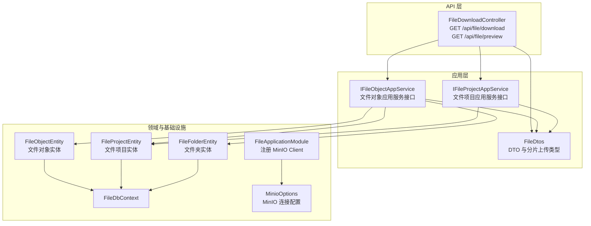
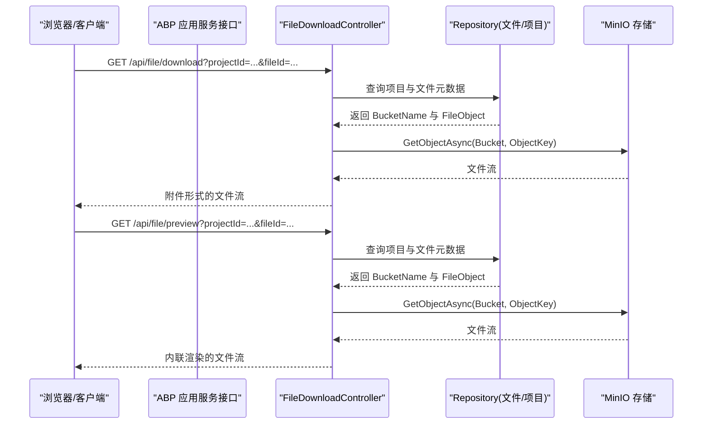
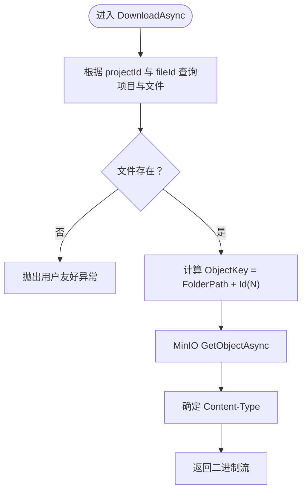
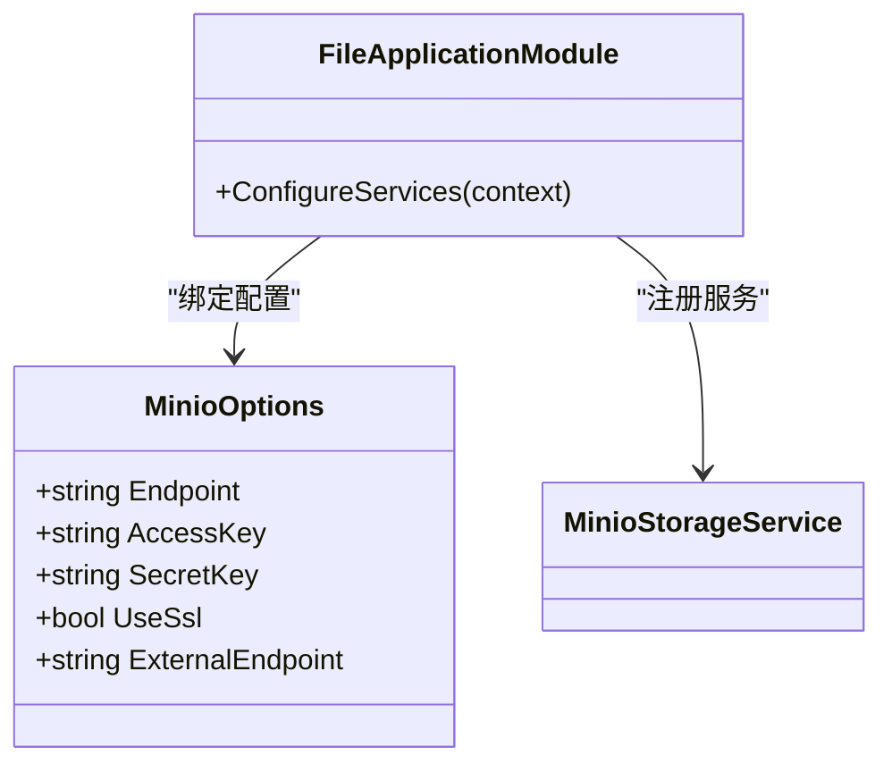
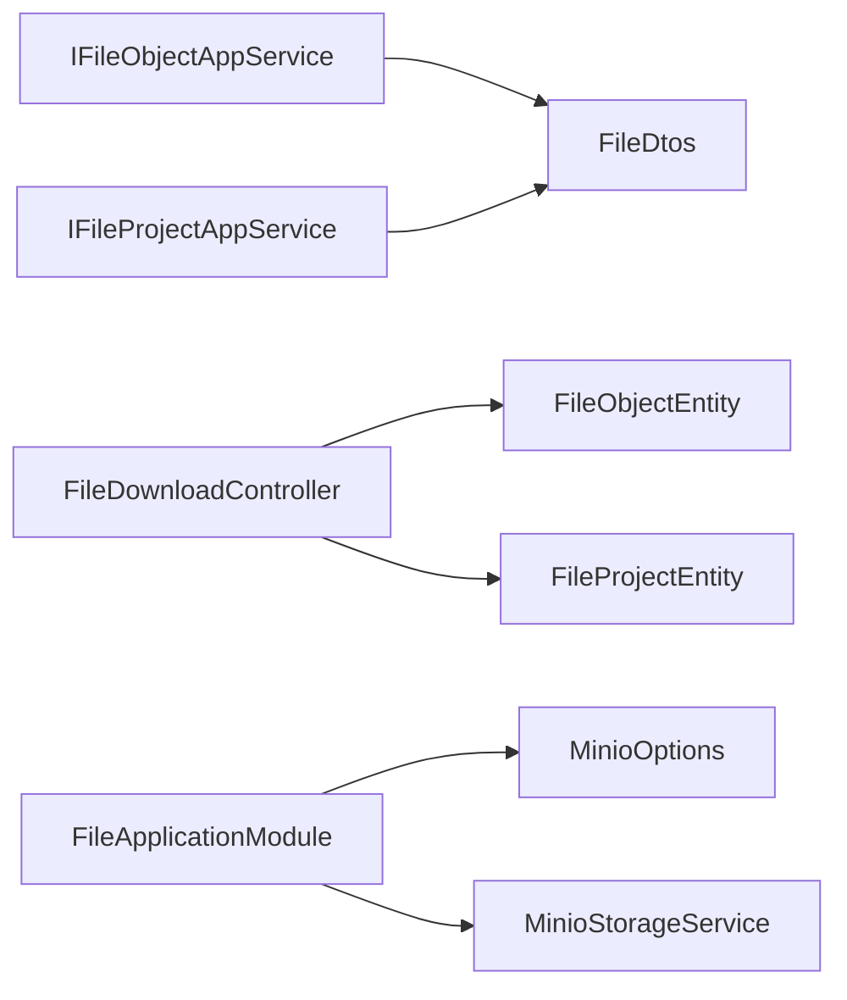

# File 文件服务 API

<cite>
**本文引用的文件**
- [FileDownloadController.cs](file://src/Services/File/H.File.Application/Controllers/FileDownloadController.cs)
- [IFileObjectAppService.cs](file://src/Services/File/H.File.Application.Contracts/Services/IFileObjectAppService.cs)
- [IFileProjectAppService.cs](file://src/Services/File/H.File.Application.Contracts/Services/IFileProjectAppService.cs)
- [FileDtos.cs](file://src/Services/File/H.File.Application.Contracts/Dtos/FileDtos.cs)
- [MinioOptions.cs](file://src/Services/File/H.File.Application/MinioOptions.cs)
- [FileApplicationModule.cs](file://src/Services/File/H.File.Application/FileApplicationModule.cs)
- [FileObjectEntity.cs](file://src/Services/File/H.File.EntityFrameworkCore/Entities/FileObjectEntity.cs)
- [FileProjectEntity.cs](file://src/Services/File/H.File.EntityFrameworkCore/Entities/FileProjectEntity.cs)
- [FileFolderEntity.cs](file://src/Services/File/H.File.EntityFrameworkCore/Entities/FileFolderEntity.cs)
- [FileDbContext.cs](file://src/Services/File/H.File.EntityFrameworkCore/FileDbContext.cs)
</cite>

## 目录
1. [简介](#简介)
2. [项目结构](#项目结构)
3. [核心组件](#核心组件)
4. [架构总览](#架构总览)
5. [接口规范](#接口规范)
6. [详细组件分析](#详细组件分析)
7. [依赖关系分析](#依赖关系分析)
8. [性能与优化建议](#性能与优化建议)
9. [故障排查指南](#故障排查指南)
10. [结论](#结论)

## 简介
本文件服务基于 ABP 框架提供面向 Web 的文件管理能力，后端使用 MinIO 作为对象存储。服务暴露两类对外能力：
- 应用服务接口：通过 ABP 的 IAppService 暴露文件上传、下载、预览、文件夹管理、分片上传等能力。
- HTTP 控制器：提供直接下载与内联预览的 REST 接口，便于浏览器直接访问。

当前代码库中未包含病毒扫描、防盗链、配额限制等业务实现；这些内容在本文档中以“最佳实践”形式给出，供集成方扩展。

## 项目结构
文件服务由以下模块组成：
- H.File.Application.Contracts：DTO、枚举、应用服务接口定义。
- H.File.Application：应用服务实现（部分在其它文件）、HTTP 控制器、MinIO 客户端配置。
- H.File.EntityFrameworkCore：实体模型、DbContext、EF Core 模块。
- H.File.Web：Web 层模块标记类。

图表来源
- [FileDownloadController.cs:1-67](file://src/Services/File/H.File.Application/Controllers/FileDownloadController.cs#L1-L67)
- [IFileObjectAppService.cs:1-52](file://src/Services/File/H.File.Application.Contracts/Services/IFileObjectAppService.cs#L1-L52)
- [IFileProjectAppService.cs:1-25](file://src/Services/File/H.File.Application.Contracts/Services/IFileProjectAppService.cs#L1-L25)
- [FileDtos.cs:1-191](file://src/Services/File/H.File.Application.Contracts/Dtos/FileDtos.cs#L1-L191)
- [MinioOptions.cs:1-14](file://src/Services/File/H.File.Application/MinioOptions.cs#L1-L14)
- [FileApplicationModule.cs:1-38](file://src/Services/File/H.File.Application/FileApplicationModule.cs#L1-L38)
- [FileObjectEntity.cs](file://src/Services/File/H.File.EntityFrameworkCore/Entities/FileObjectEntity.cs)
- [FileProjectEntity.cs](file://src/Services/File/H.File.EntityFrameworkCore/Entities/FileProjectEntity.cs)
- [FileFolderEntity.cs](file://src/Services/File/H.File.EntityFrameworkCore/Entities/FileFolderEntity.cs)
- [FileDbContext.cs](file://src/Services/File/H.File.EntityFrameworkCore/FileDbContext.cs)

章节来源
- [FileDownloadController.cs:1-67](file://src/Services/File/H.File.Application/Controllers/FileDownloadController.cs#L1-L67)
- [IFileObjectAppService.cs:1-52](file://src/Services/File/H.File.Application.Contracts/Services/IFileObjectAppService.cs#L1-L52)
- [IFileProjectAppService.cs:1-25](file://src/Services/File/H.File.Application.Contracts/Services/IFileProjectAppService.cs#L1-L25)
- [FileDtos.cs:1-191](file://src/Services/File/H.File.Application.Contracts/Dtos/FileDtos.cs#L1-L191)
- [MinioOptions.cs:1-14](file://src/Services/File/H.File.Application/MinioOptions.cs#L1-L14)
- [FileApplicationModule.cs:1-38](file://src/Services/File/H.File.Application/FileApplicationModule.cs#L1-L38)

## 核心组件
- FileDownloadController：处理 GET /api/file/download 与 GET /api/file/preview，按 projectId 与 fileId 从数据库定位文件元数据与 Bucket，再通过 MinIO 读取并返回二进制流。
- IFileObjectAppService：定义文件对象相关的应用服务接口，包括文件列表、文件夹树、上传、下载 URL、预览、删除、分类管理与分片上传流程。
- IFileProjectAppService：定义文件项目（对应 MinIO Bucket）的 CRUD 接口。
- FileDtos：定义所有 DTO、分片上传常量与请求/响应结构。
- MinioOptions：MinIO 连接参数，含 Endpoint、AccessKey、SecretKey、UseSsl、ExternalEndpoint。
- FileApplicationModule：在 ABP 模块启动时绑定 MinioOptions 并构造 IMinioClient。

章节来源
- [FileDownloadController.cs:1-67](file://src/Services/File/H.File.Application/Controllers/FileDownloadController.cs#L1-L67)
- [IFileObjectAppService.cs:1-52](file://src/Services/File/H.File.Application.Contracts/Services/IFileObjectAppService.cs#L1-L52)
- [IFileProjectAppService.cs:1-25](file://src/Services/File/H.File.Application.Contracts/Services/IFileProjectAppService.cs#L1-L25)
- [FileDtos.cs:1-191](file://src/Services/File/H.File.Application.Contracts/Dtos/FileDtos.cs#L1-L191)
- [MinioOptions.cs:1-14](file://src/Services/File/H.File.Application/MinioOptions.cs#L1-L14)
- [FileApplicationModule.cs:1-38](file://src/Services/File/H.File.Application/FileApplicationModule.cs#L1-L38)

## 架构总览
文件服务的典型调用路径如下：
- 浏览器或客户端调用 ABP 应用服务接口（由 IFileObjectAppService 与 IFileProjectAppService 定义），在服务端完成权限校验、业务逻辑与 MinIO 操作。
- 浏览器直接访问 GET /api/file/{download|preview}，服务端根据 projectId 与 fileId 查询元数据并转发 MinIO 对象流。

图表来源
- [FileDownloadController.cs:1-67](file://src/Services/File/H.File.Application/Controllers/FileDownloadController.cs#L1-L67)

## 接口规范

### 一、文件下载与预览（HTTP 控制器）

#### 1. 直接下载
- 方法：GET
- 路径：/api/file/download
- 查询参数：
  - projectId：Guid，所属项目标识
  - fileId：Guid，文件标识
- 行为：
  - 根据 projectId 与 fileId 查找文件对象与 Bucket。
  - 从 MinIO 获取对象流。
  - 以附件形式返回，确保图片/PDF 等也可触发下载保存。
- 成功响应：二进制文件流。
- 失败响应：当文件不存在时返回用户友好异常。

请求示例
- GET /api/file/download?projectId=xxxxxxxx-xxxx-xxxx-xxxx-xxxxxxxxxxxx&fileId=yyyyyyyy-yyyyy-yyyy-yyyy-yyyyyyyyyyyy

响应示例
- 成功：二进制文件流（Content-Type 取自 fileObject.ContentType）。
- 失败：用户友好异常提示“文件不存在”。

#### 2. 内联预览
- 方法：GET
- 路径：/api/file/preview
- 查询参数：
  - projectId：Guid
  - fileId：Guid
- 行为：
  - 与下载类似，但启用 Range 支持，以便 img/iframe 等直接内联渲染。
- 成功响应：二进制文件流（Content-Type 取自 fileObject.ContentType）。
- 失败响应：当文件不存在时返回用户友好异常。

请求示例
- GET /api/file/preview?projectId=xxxxxxxx-xxxx-xxxx-xxxx-xxxxxxxxxxxx&fileId=yyyyyyyy-yyyyy-yyyy-yyyy-yyyyyyyyyyyy

响应示例
- 成功：可直接被浏览器预览的二进制流。
- 失败：用户友好异常提示“文件不存在”。

章节来源
- [FileDownloadController.cs:1-67](file://src/Services/File/H.File.Application/Controllers/FileDownloadController.cs#L1-L67)

### 二、文件管理（ABP 应用服务）

以下接口通过 ABP 的 IFileObjectAppService 暴露。统一返回 BaseOutput<T> 包装结果。

#### 1. 获取文件列表
- 接口：GetFilesAsync(projectId, folderPath?)
- 功能：获取指定项目下某路径的文件列表。
- 输入：
  - projectId：Guid
  - folderPath：可选字符串，路径前缀
- 输出：BaseOutput<List<FileObjectDto>>

#### 2. 获取文件夹树
- 接口：GetFolderTreeAsync(projectId)
- 功能：获取项目下的分类树。
- 输入：projectId：Guid
- 输出：BaseOutput<List<FileFolderDto>>

#### 3. 上传文件
- 接口：UploadAsync(projectId, folderPath?, fileName, content, contentType)
- 功能：将字节内容上传到 MinIO 并记录元数据。
- 输入：
  - projectId：Guid
  - folderPath：可选路径前缀
  - fileName：文件名
  - content：文件字节数组
  - contentType：MIME 类型
- 输出：BaseOutput<FileUploadResultDto>

#### 4. 获取下载链接
- 接口：GetDownloadUrlAsync(projectId, fileId)
- 功能：返回下载 URL。
- 输入：projectId、fileId
- 输出：BaseOutput<FileDownloadResultDto>，其中 Url 为下载地址。

#### 5. 获取预览信息
- 接口：GetPreviewAsync(projectId, fileId)
- 功能：返回预览类型、预览 URL、文本内容或 Base64 内容。
- 输入：projectId、fileId
- 输出：BaseOutput<FilePreviewDto>

#### 6. 删除文件
- 接口：DeleteAsync(projectId, fileId)
- 功能：删除指定文件及其对象。
- 输入：projectId、fileId
- 输出：BaseOutput

#### 7. 创建分类
- 接口：CreateFolderAsync(projectId, input)
- 功能：创建分类（编号作为 MinIO 目录名，留空自动生成）。
- 输入：
  - projectId：Guid
  - input：CreateFolderInput(ParentPath, Name, Code)
- 输出：BaseOutput

#### 8. 重命名分类
- 接口：RenameFolderAsync(projectId, folderPath, newName)
- 功能：仅修改显示名称，分类编号不变。
- 输入：projectId、folderPath、newName
- 输出：BaseOutput

#### 9. 删除分类
- 接口：DeleteFolderAsync(projectId, folderPath)
- 功能：删除文件夹及其中所有文件。
- 输入：projectId、folderPath
- 输出：BaseOutput

章节来源
- [IFileObjectAppService.cs:1-52](file://src/Services/File/H.File.Application.Contracts/Services/IFileObjectAppService.cs#L1-L52)
- [FileDtos.cs:1-191](file://src/Services/File/H.File.Application.Contracts/Dtos/FileDtos.cs#L1-L191)

### 三、文件项目（ABP 应用服务）

以下接口通过 IFileProjectAppService 暴露。统一返回 BaseOutput<T>。

#### 1. 获取项目列表
- 接口：GetListAsync()
- 输出：BaseOutput<List<FileProjectDto>>

#### 2. 获取单个项目
- 接口：GetAsync(id)
- 输出：BaseOutput<FileProjectDto>

#### 3. 创建项目
- 接口：CreateAsync(input)
- 功能：创建项目并同时创建 MinIO Bucket。
- 输入：CreateFileProjectDto(Name, Code?, Description?, Icon?)
- 输出：BaseOutput<FileProjectDto>

#### 4. 更新项目
- 接口：UpdateAsync(id, input)
- 输入：id、UpdateFileProjectDto
- 输出：BaseOutput<FileProjectDto>

#### 5. 删除项目
- 接口：DeleteAsync(id)
- 功能：删除项目同时删除 MinIO Bucket 及其所有文件。
- 输入：id
- 输出：BaseOutput

章节来源
- [IFileProjectAppService.cs:1-25](file://src/Services/File/H.File.Application.Contracts/Services/IFileProjectAppService.cs#L1-L25)
- [FileDtos.cs:1-191](file://src/Services/File/H.File.Application.Contracts/Dtos/FileDtos.cs#L1-L191)

### 四、分片上传与断点续传

分片上传流程通过 IFileObjectAppService 的多个方法组合实现，DTO 与常量定义在 FileDtos 中。

#### 1. 初始化分片上传
- 接口：InitMultipartUploadAsync(projectId, folderPath?, fileName, fileSize, contentType)
- 功能：返回 UploadId、ObjectId、ObjectKey、TotalParts、PartSize。
- 输入：
  - projectId：Guid
  - folderPath：可选路径前缀
  - fileName：文件名
  - fileSize：文件大小
  - contentType：MIME 类型
- 输出：BaseOutput<MultipartUploadDto>

#### 2. 上传单个分片
- 接口：UploadPartAsync(input)
- 功能：上传一个分片并返回 ETag。
- 输入：UploadPartInput(UploadId, ObjectKey, BucketName, PartIndex, Data)
- 输出：BaseOutput<UploadPartResult>(PartIndex, ETag, Success, Message?)

#### 3. 查询已上传分片
- 接口：ListUploadedPartsAsync(uploadId, objectKey)
- 功能：用于断点续传时查询已上传的分片。
- 输入：uploadId、objectKey
- 输出：BaseOutput<List<UploadedPartDto>>(PartNumber, ETag, Size)

#### 4. 完成分片上传
- 接口：CompleteMultipartUploadAsync(input)
- 功能：合并所有分片并生成最终文件。
- 输入：CompleteMultipartUploadInput(ProjectId, UploadId, ObjectId, ObjectKey, FileName, FileSize, ContentType, FolderPath, Parts[])
- 输出：BaseOutput<FileUploadResultDto>

#### 5. 取消分片上传
- 接口：AbortMultipartUploadAsync(uploadId, objectKey)
- 功能：清理临时分片数据。
- 输入：uploadId、objectKey
- 输出：BaseOutput

分片大小常量
- DefaultPartSize = 5MB（MultipartUploadConstants.DefaultPartSize）

章节来源
- [IFileObjectAppService.cs:1-52](file://src/Services/File/H.File.Application.Contracts/Services/IFileObjectAppService.cs#L1-L52)
- [FileDtos.cs:1-191](file://src/Services/File/H.File.Application.Contracts/Dtos/FileDtos.cs#L1-L191)

### 五、权限控制与安全

当前代码未实现细粒度访问权限、分享链接与防盗链策略；建议在应用服务层或网关层增加：
- 基于角色或资源的访问控制（RBAC/ABAC）。
- 分享链接使用一次性或短期签名 URL（结合 MinIO 预签名）。
- 防盗链通过 Referer 白名单、Token 校验与时间戳签名。
- 文件类型校验（MIME、扩展名、魔数）与大小限制。
- 病毒扫描（如 ClamAV）在上传完成后异步扫描并标记风险文件。
- 存储空间配额（按项目或租户）在创建/上传时检查剩余空间。

## 详细组件分析

### FileDownloadController
- 路由：/api/file
- 主要方法：
  - DownloadAsync(projectId, fileId)：下载文件并以附件形式返回。
  - PreviewAsync(projectId, fileId)：内联预览，启用 Range。
- 关键逻辑：
  - 通过 Repository 获取 Project 与 FileObject，计算 ObjectKey = FolderPath + Id(N)。
  - 调用 MinioStorageService.GetObjectAsync 读取流。
  - Content-Type 来自 fileObject.ContentType，若为空则回退 application/octet-stream。

图表来源
- [FileDownloadController.cs:1-67](file://src/Services/File/H.File.Application/Controllers/FileDownloadController.cs#L1-L67)

章节来源
- [FileDownloadController.cs:1-67](file://src/Services/File/H.File.Application/Controllers/FileDownloadController.cs#L1-L67)

### 数据模型与 DTO
- FileProjectDto：项目信息（Id、Name、Code、Description、Icon、BucketName、TotalSize、FileCount、CreationTime）。
- CreateFileProjectDto/UpdateFileProjectDto：项目创建/更新输入。
- FileObjectDto：文件对象信息（Id、FileName、Size、ContentType、LastModified、IsFolder）。
- FileFolderDto：文件夹节点（Path、Code、Name、Children）。
- CreateFolderInput：分类创建（ParentPath、Name、Code）。
- FileUploadResultDto：上传结果（Id、FileName、Size、Success、Message）。
- FileDownloadResultDto：下载结果（Url）。
- FilePreviewDto：预览信息（FileName、ContentType、Size、PreviewType、PreviewUrl、TextContent、Base64Content）。
- MultipartUploadConstants：DefaultPartSize = 5MB。
- MultipartUploadDto：分片初始化结果（UploadId、ObjectId、ObjectKey、TotalParts、PartSize）。
- UploadPartInput/UploadPartResult：分片上传输入/结果。
- CompleteMultipartUploadInput：完成分片上传输入（含 Parts 列表）。
- UploadedPartDto：已上传分片信息（PartNumber、ETag、Size）。

章节来源
- [FileDtos.cs:1-191](file://src/Services/File/H.File.Application.Contracts/Dtos/FileDtos.cs#L1-L191)

### MinIO 集成与配置
- MinioOptions：Endpoint、AccessKey、SecretKey、UseSsl、ExternalEndpoint。
- FileApplicationModule：
  - 绑定 MinioOptions。
  - 构造 IMinioClient（WithEndpoint、WithCredentials、WithSSL）。
  - 注册 MinioStorageService。

图表来源
- [MinioOptions.cs:1-14](file://src/Services/File/H.File.Application/MinioOptions.cs#L1-L14)
- [FileApplicationModule.cs:1-38](file://src/Services/File/H.File.Application/FileApplicationModule.cs#L1-L38)

章节来源
- [MinioOptions.cs:1-14](file://src/Services/File/H.File.Application/MinioOptions.cs#L1-L14)
- [FileApplicationModule.cs:1-38](file://src/Services/File/H.File.Application/FileApplicationModule.cs#L1-L38)

### 实体与数据库
- FileObjectEntity：文件对象实体。
- FileProjectEntity：文件项目实体（含 BucketName）。
- FileFolderEntity：文件夹实体。
- FileDbContext：EF Core 上下文，映射上述实体。

章节来源
- [FileObjectEntity.cs](file://src/Services/File/H.File.EntityFrameworkCore/Entities/FileObjectEntity.cs)
- [FileProjectEntity.cs](file://src/Services/File/H.File.EntityFrameworkCore/Entities/FileProjectEntity.cs)
- [FileFolderEntity.cs](file://src/Services/File/H.File.EntityFrameworkCore/Entities/FileFolderEntity.cs)
- [FileDbContext.cs](file://src/Services/File/H.File.EntityFrameworkCore/FileDbContext.cs)

## 依赖关系分析

图表来源
- [IFileObjectAppService.cs:1-52](file://src/Services/File/H.File.Application.Contracts/Services/IFileObjectAppService.cs#L1-L52)
- [IFileProjectAppService.cs:1-25](file://src/Services/File/H.File.Application.Contracts/Services/IFileProjectAppService.cs#L1-L25)
- [FileDownloadController.cs:1-67](file://src/Services/File/H.File.Application/Controllers/FileDownloadController.cs#L1-L67)
- [FileApplicationModule.cs:1-38](file://src/Services/File/H.File.Application/FileApplicationModule.cs#L1-L38)
- [MinioOptions.cs:1-14](file://src/Services/File/H.File.Application/MinioOptions.cs#L1-L14)

章节来源
- [IFileObjectAppService.cs:1-52](file://src/Services/File/H.File.Application.Contracts/Services/IFileObjectAppService.cs#L1-L52)
- [IFileProjectAppService.cs:1-25](file://src/Services/File/H.File.Application.Contracts/Services/IFileProjectAppService.cs#L1-L25)
- [FileDownloadController.cs:1-67](file://src/Services/File/H.File.Application/Controllers/FileDownloadController.cs#L1-L67)
- [FileApplicationModule.cs:1-38](file://src/Services/File/H.File.Application/FileApplicationModule.cs#L1-L38)
- [MinioOptions.cs:1-14](file://src/Services/File/H.File.Application/MinioOptions.cs#L1-L14)

## 性能与优化建议
- 大文件上传
  - 使用分片上传（DefaultPartSize = 5MB）以降低内存占用与重试成本。
  - 客户端并行上传多个分片，服务端顺序合并。
  - 对 UploadPart 与 CompleteMultipartUpload 做幂等与去重处理。
- 下载与预览
  - 对静态资源走 CDN，控制器仅做鉴权与签名校验。
  - 启用 Range 支持以提升断点续传与视频/大文件体验。
- MinIO 集成
  - 合理设置 Endpoint 与 ExternalEndpoint，避免跨域问题。
  - 开启 Keep-Alive 与连接池优化。
- 安全与合规
  - 上传后异步病毒扫描并设置风险隔离桶。
  - 文件类型校验（扩展名+MIME+魔数）与最大尺寸限制。
  - 分享链接使用短期预签名 URL，禁止裸外链。
- 配额与治理
  - 在项目级与租户级进行容量配额检查，超限拒绝写入。
  - 定期统计 TotalSize、FileCount 并归档冷数据。

[本节为通用建议，不直接分析具体文件]

## 故障排查指南
- 常见错误
  - “文件不存在”：检查 projectId 与 fileId 是否匹配，确认 FileObject 与 Project 关联正确。
  - 下载乱码或无法预览：确认 fileObject.ContentType 是否正确；必要时强制设置 MIME。
  - 分片上传失败：核对 UploadId、ObjectKey、BucketName、PartIndex、ETag 一致性。
- 诊断步骤
  - 验证 MinIO 连通性（Endpoint、AccessKey、SecretKey、UseSsl）。
  - 检查 Bucket 是否存在且权限允许读写。
  - 查看 EF Core 查询日志，确认仓储层返回数据符合预期。
  - 对分片上传进行逐片校验（ETag 与 Size）。

章节来源
- [FileDownloadController.cs:1-67](file://src/Services/File/H.File.Application/Controllers/FileDownloadController.cs#L1-L67)
- [FileDtos.cs:1-191](file://src/Services/File/H.File.Application.Contracts/Dtos/FileDtos.cs#L1-L191)

## 结论
该文件服务提供了以 MinIO 为核心的对象存储能力，并通过 ABP 应用服务与 HTTP 控制器分别暴露结构化 API 与便捷下载/预览接口。当前版本重点覆盖文件与项目的 CRUD、基础上传与分片上传协议骨架。未来可在应用服务层增强权限控制、病毒扫描、配额管理与 CDN 集成，以满足企业级场景的安全与性能需求。