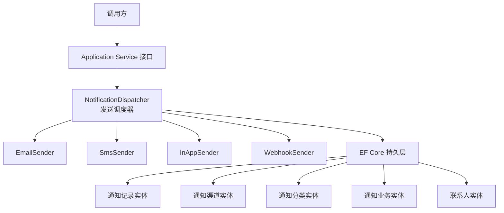
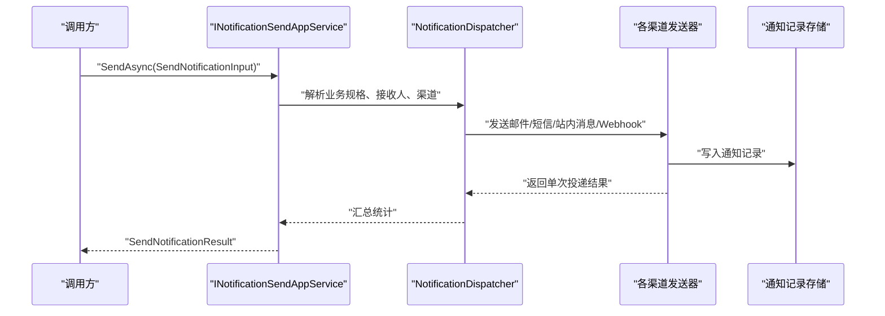
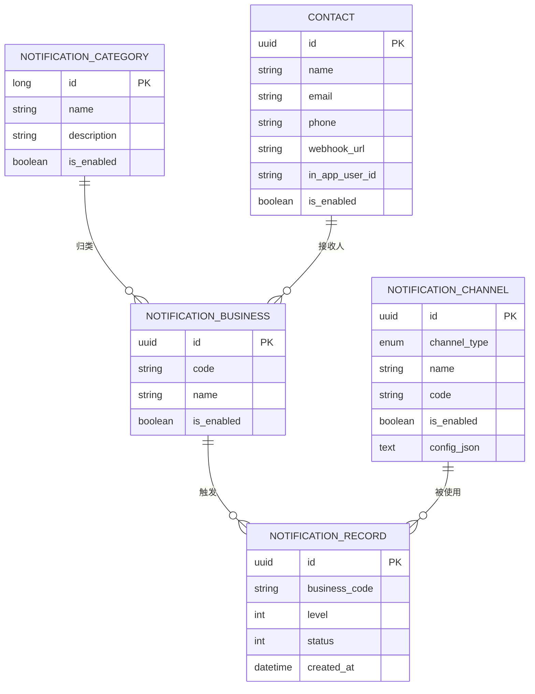
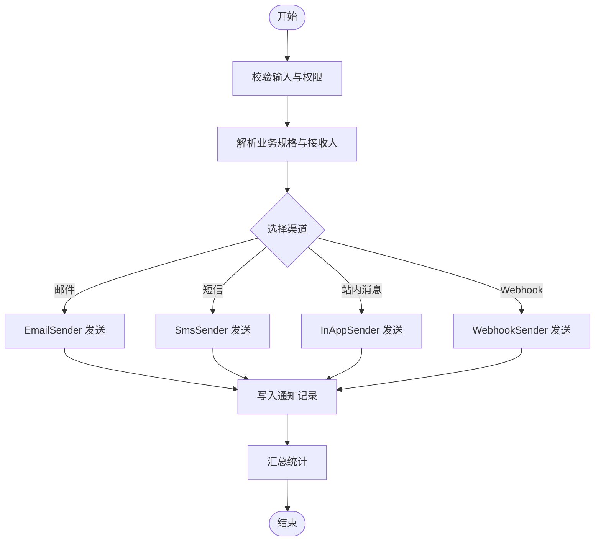

# Notification 通知中心 API

<cite>
**本文引用的文件**   
- [INotificationAppService.cs](file://src/Services/Notification/H.Notification.Application.Contracts/Services/INotificationAppService.cs)
- [SendDtos.cs](file://src/Services/Notification/H.Notification.Application.Contracts/Dtos/SendDtos.cs)
- [SpecDtos.cs](file://src/Services/Notification/H.Notification.Application.Contracts/Dtos/SpecDtos.cs)
- [ContactDtos.cs](file://src/Services/Notification/H.Notification.Application.Contracts/Dtos/ContactDtos.cs)
- [ChannelDtos.cs](file://src/Services/Notification/H.Notification.Application.Contracts/Dtos/ChannelDtos.cs)
- [RecordDtos.cs](file://src/Services/Notification/H.Notification.Application.Contracts/Dtos/RecordDtos.cs)
- [BusinessDtos.cs](file://src/Services/Notification/H.Notification.Application.Contracts/Dtos/BusinessDtos.cs)
- [CategoryDtos.cs](file://src/Services/Notification/H.Notification.Application.Contracts/Dtos/CategoryDtos.cs)
- [DeliveryStatus.cs](file://src/Services/Notification/H.Notification.Application.Contracts/Enums/DeliveryStatus.cs)
- [NotificationChannelType.cs](file://src/Services/Notification/H.Notification.Application.Contracts/Enums/NotificationChannelType.cs)
- [NotificationLevel.cs](file://src/Services/Notification/H.Notification.Application.Contracts/Enums/NotificationLevel.cs)
- [ThresholdEnums.cs](file://src/Services/Notification/H.Notification.Application.Contracts/Enums/ThresholdEnums.cs)
- [NotificationRecordEntity.cs](file://src/Services/Notification/H.Notification.EntityFrameworkCore/Entities/NotificationRecordEntity.cs)
- [NotificationChannelEntity.cs](file://src/Services/Notification/H.Notification.EntityFrameworkCore/Entities/NotificationChannelEntity.cs)
- [NotificationCategory.cs](file://src/Services/Notification/H.Notification.EntityFrameworkCore/Entities/NotificationCategory.cs)
- [NotificationBusinessEntity.cs](file://src/Services/Notification/H.Notification.EntityFrameworkCore/Entities/NotificationBusinessEntity.cs)
- [ContactEntity.cs](file://src/Services/Notification/H.Notification.EntityFrameworkCore/Entities/ContactEntity.cs)
- [NotificationDispatcher.cs](file://src/Services/Notification/H.Notification.Application/Sending/NotificationDispatcher.cs)
- [EmailSender.cs](file://src/Services/Notification/H.Notification.Application/Sending/EmailSender.cs)
- [SmsSender.cs](file://src/Services/Notification/H.Notification.Application/Sending/SmsSender.cs)
- [InAppSender.cs](file://src/Services/Notification/H.Notification.Application/Sending/InAppSender.cs)
- [WebhookSender.cs](file://src/Services/Notification/H.Notification.Application/Sending/WebhookSender.cs)
- [IChannelSender.cs](file://src/Services/Notification/H.Notification.Application/Sending/IChannelSender.cs)
- [TemplateRenderer.cs](file://src/Services/Notification/H.Notification.Application/Templates/TemplateRenderer.cs)
- [NotificationRecord.razor](file://src/Services/Notification/H.Notification.Web/Pages/NotificationRecord.razor)
</cite>

## 目录
1. [简介](#简介)
2. [项目结构](#项目结构)
3. [核心组件](#核心组件)
4. [架构总览](#架构总览)
5. [详细接口文档](#详细接口文档)
6. [依赖与数据模型](#依赖与数据模型)
7. [异步处理、重试与失败策略](#异步处理重试与失败策略)
8. [性能优化建议](#性能优化建议)
9. [常见问题排查](#常见问题排查)
10. [结论](#结论)

## 简介
本文件为 Notification 通知中心的 API 文档，覆盖以下能力：
- 通知发送：邮件、短信、站内消息、Webhook。
- 订阅管理：联系人分组、联系人、通知渠道、业务规则与规格配置。
- 通知查询：通知主记录与按渠道明细记录查询。
- 模板渲染：基于占位符的模板变量替换。
- 异步投递：通过发送调度器驱动多渠道分发，支持批量与结果统计。

API 以 ABP 风格的 Application Service 接口对外暴露，统一使用 `BaseOutput<T>` 作为响应包装，分页使用 `PagedResultDto`，基础实体 DTO 继承 `AuditedEntityDto`。

## 项目结构
Notification 服务采用分层结构：
- Application.Contracts：定义 DTO、枚举、应用服务接口。
- Application：实现应用服务、模板渲染、多渠道发送器与调度逻辑。
- EntityFrameworkCore：持久化实体、DbContext 与迁移工具。
- Web：Blazor 页面与模块注册。



图示来源
- [INotificationAppService.cs:1-108](file://src/Services/Notification/H.Notification.Application.Contracts/Services/INotificationAppService.cs#L1-L108)
- [NotificationDispatcher.cs](file://src/Services/Notification/H.Notification.Application/Sending/NotificationDispatcher.cs)
- [EmailSender.cs](file://src/Services/Notification/H.Notification.Application/Sending/EmailSender.cs)
- [SmsSender.cs](file://src/Services/Notification/H.Notification.Application/Sending/SmsSender.cs)
- [InAppSender.cs](file://src/Services/Notification/H.Notification.Application/Sending/InAppSender.cs)
- [WebhookSender.cs](file://src/Services/Notification/H.Notification.Application/Sending/WebhookSender.cs)
- [NotificationRecordEntity.cs](file://src/Services/Notification/H.Notification.EntityFrameworkCore/Entities/NotificationRecordEntity.cs)
- [NotificationChannelEntity.cs](file://src/Services/Notification/H.Notification.EntityFrameworkCore/Entities/NotificationChannelEntity.cs)
- [NotificationCategory.cs](file://src/Services/Notification/H.Notification.EntityFrameworkCore/Entities/NotificationCategory.cs)
- [NotificationBusinessEntity.cs](file://src/Services/Notification/H.Notification.EntityFrameworkCore/Entities/NotificationBusinessEntity.cs)
- [ContactEntity.cs](file://src/Services/Notification/H.Notification.EntityFrameworkCore/Entities/ContactEntity.cs)

章节来源
- [INotificationAppService.cs:1-108](file://src/Services/Notification/H.Notification.Application.Contracts/Services/INotificationAppService.cs#L1-L108)

## 核心组件
- 应用服务接口
  - INotificationCategoryAppService：通知分类 CRUD。
  - IContactAppService / IContactGroupAppService：联系人及分组管理。
  - INotificationChannelAppService：通知渠道配置管理。
  - INotificationBusinessAppService：业务通知规则与规格管理。
  - INotificationSendAppService：发送与测试发送。
  - INotificationRecordAppService：通知记录查询（主记录与各渠道明细）。
- 发送子系统
  - NotificationDispatcher：根据业务规格与接收人解析，将任务分发给具体渠道发送器。
  - EmailSender、SmsSender、InAppSender、WebhookSender：各渠道发送实现。
  - TemplateRenderer：模板变量替换引擎。
- 数据实体
  - NotificationRecordEntity、NotificationChannelEntity、NotificationCategory、NotificationBusinessEntity、ContactEntity。

章节来源
- [INotificationAppService.cs:1-108](file://src/Services/Notification/H.Notification.Application.Contracts/Services/INotificationAppService.cs#L1-L108)
- [IChannelSender.cs](file://src/Services/Notification/H.Notification.Application/Sending/IChannelSender.cs)
- [TemplateRenderer.cs](file://src/Services/Notification/H.Notification.Application/Templates/TemplateRenderer.cs)

## 架构总览
通知发送流程：
1. 调用方通过 Application Service 提交发送请求。
2. 应用服务校验输入并构建发送上下文。
3. NotificationDispatcher 根据业务编码、级别、阈值规则与接收人群计算目标渠道。
4. 各 ChannelSender 负责具体通道投递，写入通知记录。
5. 返回汇总结果：消息 ID、总数、成功数、失败数等。



图示来源
- [INotificationAppService.cs:77-90](file://src/Services/Notification/H.Notification.Application.Contracts/Services/INotificationAppService.cs#L77-L90)
- [SendDtos.cs:1-73](file://src/Services/Notification/H.Notification.Application.Contracts/Dtos/SendDtos.cs#L1-L73)
- [NotificationDispatcher.cs](file://src/Services/Notification/H.Notification.Application/Sending/NotificationDispatcher.cs)

## 详细接口文档

### 通用约定
- 所有应用服务接口均继承自 `IAppService`，由 ABP 框架自动映射为 HTTP API。
- 返回值统一使用 `BaseOutput<T>` 包装；分页返回 `PagedResultDto<T>`。
- URL 路径遵循 ABP 默认约定：`/api/notification/{service-name}/{method}`。
- 认证与授权：由宿主系统控制；示例中未提供具体鉴权头定义。

### 通知发送接口

#### 发送通知
- 接口：`INotificationSendAppService.SendAsync`
- 方法：POST
- URL：`/api/notification/notificationsend/send`
- 请求体：`SendNotificationInput`
  - businessCode：字符串，必填。
  - level：可选，覆盖业务默认级别。
  - data：键值对，用于模板变量替换。
  - recipientIds：可选，指定接收人列表；为空时使用业务绑定联系人组。
- 响应体：`BaseOutput<SendNotificationResult>`
  - messageId：生成的通知消息 ID。
  - totalCount：投递总数。
  - successCount：成功数。
  - failedCount：失败数。
  - message：提示信息。

请求示例
```json
{
  "businessCode": "ORDER_ALERT",
  "level": 2,
  "data": {
    "orderNo": "ORD-20260929-0001",
    "amount": "1200.00",
    "user": "张三"
  },
  "recipientIds": ["a1b2c3d4-e5f6-7890-abcd-ef1234567890"]
}
```

响应示例
```json
{
  "success": true,
  "result": {
    "messageId": "e1f2a3b4-c5d6-7890-abcd-ef1234567890",
    "totalCount": 3,
    "successCount": 2,
    "failedCount": 1,
    "message": "部分渠道投递失败，请查看通知记录"
  }
}
```

章节来源
- [INotificationAppService.cs:77-90](file://src/Services/Notification/H.Notification.Application.Contracts/Services/INotificationAppService.cs#L77-L90)
- [SendDtos.cs:1-73](file://src/Services/Notification/H.Notification.Application.Contracts/Dtos/SendDtos.cs#L1-L73)

#### 测试发送
- 接口：`INotificationSendAppService.TestSendAsync`
- 方法：POST
- URL：`/api/notification/notificationsend/testsend`
- 请求体：`TestSendInput`
  - businessCode：字符串，必填。
  - level：可选。
  - data：键值对。
  - recipientIds：可选。
- 响应体：`BaseOutput<SendNotificationResult>`，结构与发送一致。

请求示例
```json
{
  "businessCode": "ORDER_ALERT",
  "level": 2,
  "data": {
    "orderNo": "TEST-001",
    "amount": "0.01",
    "user": "测试用户"
  },
  "recipientIds": []
}
```

响应示例
```json
{
  "success": true,
  "result": {
    "messageId": null,
    "totalCount": 1,
    "successCount": 1,
    "failedCount": 0,
    "message": "测试发送成功"
  }
}
```

章节来源
- [INotificationAppService.cs:77-90](file://src/Services/Notification/H.Notification.Application.Contracts/Services/INotificationAppService.cs#L77-L90)
- [SendDtos.cs:1-73](file://src/Services/Notification/H.Notification.Application.Contracts/Dtos/SendDtos.cs#L1-L73)

### 订阅管理接口

#### 通知分类管理
- 接口：`INotificationCategoryAppService`
- 方法：
  - GET `/api/notification/notificationcategory/getall`
  - GET `/api/notification/notificationcategory/get?id={id}`
  - POST `/api/notification/notificationcategory/create`
  - PUT `/api/notification/notificationcategory/update?id={id}`
  - DELETE `/api/notification/notificationcategory/delete?id={id}`
- 请求/响应：参考 CategoryDtos 中的 DTO 定义。

章节来源
- [INotificationAppService.cs:8-21](file://src/Services/Notification/H.Notification.Application.Contracts/Services/INotificationAppService.cs#L8-L21)
- [CategoryDtos.cs](file://src/Services/Notification/H.Notification.Application.Contracts/Dtos/CategoryDtos.cs)

#### 联系人管理
- 接口：`IContactAppService`
- 方法：
  - GET `/api/notification/contact/list`
  - GET `/api/notification/contact/allenabled`
  - GET `/api/notification/contact/get?id={id}`
  - POST `/api/notification/contact/create`
  - PUT `/api/notification/contact/update?id={id}`
  - DELETE `/api/notification/contact/delete?id={id}`
- 查询参数：`ContactQueryDto`，包含 filter、groupId。
- 主体字段：name、description、isEnabled、inAppUserId、email、phone、webhookUrl、groupIds。

请求示例（创建联系人）
```json
{
  "name": "运维组",
  "description": "订单异常告警接收人",
  "isEnabled": true,
  "inAppUserId": "u12345",
  "email": "ops@example.com",
  "phone": "+8613800000000",
  "webhookUrl": "https://hooks.example.com/alerts",
  "groupIds": []
}
```

响应示例
```json
{
  "success": true,
  "result": {
    "id": "a1b2c3d4-e5f6-7890-abcd-ef1234567890",
    "name": "运维组",
    "email": "ops@example.com",
    "phone": "+8613800000000",
    "isEnabled": true,
    "inAppUserId": "u12345",
    "groupIds": [],
    "createdOn": "2026-09-29T10:00:00Z"
  }
}
```

章节来源
- [INotificationAppService.cs:23-37](file://src/Services/Notification/H.Notification.Application.Contracts/Services/INotificationAppService.cs#L23-L37)
- [ContactDtos.cs:1-122](file://src/Services/Notification/H.Notification.Application.Contracts/Dtos/ContactDtos.cs#L1-L122)

#### 联系人分组管理
- 接口：`IContactGroupAppService`
- 方法：
  - GET `/api/notification/contactgroup/list`
  - GET `/api/notification/contactgroup/allenabled`
  - GET `/api/notification/contactgroup/get?id={id}`
  - POST `/api/notification/contactgroup/create`
  - PUT `/api/notification/contactgroup/update?id={id}`
  - DELETE `/api/notification/contactgroup/delete?id={id}`
- 主体字段：name、description、isEnabled、contactIds。

请求示例（创建分组）
```json
{
  "name": "支付异常组",
  "description": "支付失败与退款通知",
  "isEnabled": true,
  "contactIds": ["a1b2c3d4-e5f6-7890-abcd-ef1234567890"]
}
```

响应示例
```json
{
  "success": true,
  "result": {
    "id": 1001,
    "name": "支付异常组",
    "contactCount": 1,
    "contactIds": ["a1b2c3d4-e5f6-7890-abcd-ef1234567890"],
    "createdOn": "2026-09-29T10:00:00Z"
  }
}
```

章节来源
- [INotificationAppService.cs:39-54](file://src/Services/Notification/H.Notification.Application.Contracts/Services/INotificationAppService.cs#L39-L54)
- [ContactDtos.cs:1-122](file://src/Services/Notification/H.Notification.Application.Contracts/Dtos/ContactDtos.cs#L1-L122)

#### 通知渠道管理
- 接口：`INotificationChannelAppService`
- 方法：
  - GET `/api/notification/notificationchannel/list`
  - GET `/api/notification/notificationchannel/allenabled`
  - GET `/api/notification/notificationchannel/get?id={id}`
  - POST `/api/notification/notificationchannel/create`
  - PUT `/api/notification/notificationchannel/update?id={id}`
  - DELETE `/api/notification/notificationchannel/delete?id={id}`
- 渠道类型：见 `NotificationChannelType` 枚举（如邮件、短信、站内消息、Webhook）。
- 配置字段：configJson 为 JSON 字符串，不同 provider 的参数不同。

请求示例（创建邮件渠道）
```json
{
  "channelType": 1,
  "name": "生产环境 SMTP",
  "code": "SMTP_PROD",
  "description": "生产邮箱服务器",
  "isEnabled": true,
  "configJson": "{\"host\":\"smtp.example.com\",\"port\":587,\"username\":\"alert@example.com\",\"password\":\"***\"}"
}
```

响应示例
```json
{
  "success": true,
  "result": {
    "id": "b2c3d4e5-f6a7-8901-bcde-f12345678901",
    "channelType": 1,
    "name": "生产环境 SMTP",
    "code": "SMTP_PROD",
    "isEnabled": true,
    "createdOn": "2026-09-29T10:00:00Z"
  }
}
```

章节来源
- [INotificationAppService.cs:56-74](file://src/Services/Notification/H.Notification.Application.Contracts/Services/INotificationAppService.cs#L56-L74)
- [ChannelDtos.cs:1-52](file://src/Services/Notification/H.Notification.Application.Contracts/Dtos/ChannelDtos.cs#L1-L52)
- [NotificationChannelType.cs](file://src/Services/Notification/H.Notification.Application.Contracts/Enums/NotificationChannelType.cs)

#### 业务通知规则与规格
- 接口：`INotificationBusinessAppService`
- 方法：
  - GET `/api/notification/notificationbusiness/list`
  - GET `/api/notification/notificationbusiness/get?id={id}`
  - POST `/api/notification/notificationbusiness/create`
  - PUT `/api/notification/notificationbusiness/update?id={id}`
  - DELETE `/api/notification/notificationbusiness/delete?id={id}`
  - GET `/api/notification/notificationbusiness/specs?businessId={id}`
  - PUT `/api/notification/notificationbusiness/setspecs`
  - GET `/api/notification/notificationbusiness/groupids?businessId={id}`
  - PUT `/api/notification/notificationbusiness/setgroups`
- 规格字段：level、isEnabled、channels、consecutivePeriods、periodMinutes、aggregation、comparison、threshold。

请求示例（设置业务规格）
```json
[
  {
    "id": "c3d4e5f6-a7b8-9012-cdef-123456789012",
    "level": 2,
    "isEnabled": true,
    "channels": [1, 2],
    "consecutivePeriods": 3,
    "periodMinutes": 5,
    "aggregation": 0,
    "comparison": 1,
    "threshold": 0.95
  }
]
```

响应示例
```json
{
  "success": true,
  "result": null,
  "message": "业务规格设置成功"
}
```

章节来源
- [INotificationAppService.cs:76-108](file://src/Services/Notification/H.Notification.Application.Contracts/Services/INotificationAppService.cs#L76-L108)
- [SpecDtos.cs:1-49](file://src/Services/Notification/H.Notification.Application.Contracts/Dtos/SpecDtos.cs#L1-L49)
- [BusinessDtos.cs](file://src/Services/Notification/H.Notification.Application.Contracts/Dtos/BusinessDtos.cs)
- [ThresholdEnums.cs](file://src/Services/Notification/H.Notification.Application.Contracts/Enums/ThresholdEnums.cs)

### 通知查询接口

#### 通知主记录查询
- 接口：`INotificationRecordAppService.GetMasterListAsync`
- 方法：GET
- URL：`/api/notification/notificationrecord/masterlist`
- 查询参数：`NotificationRecordQueryDto`
- 响应体：`BaseOutput<PagedResultDto<NotificationRecordDto>>`

请求示例
```json
{
  "filter": "ORDER_ALERT",
  "page": 1,
  "pageSize": 20
}
```

响应示例
```json
{
  "success": true,
  "result": {
    "items": [
      {
        "id": "d4e5f6a7-b8c9-0123-defa-234567890123",
        "businessCode": "ORDER_ALERT",
        "level": 2,
        "status": 1,
        "createdAt": "2026-09-29T10:05:00Z"
      }
    ],
    "totalCount": 1,
    "page": 1,
    "pageSize": 20
  }
}
```

章节来源
- [INotificationAppService.cs:92-108](file://src/Services/Notification/H.Notification.Application.Contracts/Services/INotificationAppService.cs#L92-L108)
- [RecordDtos.cs](file://src/Services/Notification/H.Notification.Application.Contracts/Dtos/RecordDtos.cs)
- [NotificationRecordEntity.cs](file://src/Services/Notification/H.Notification.EntityFrameworkCore/Entities/NotificationRecordEntity.cs)

#### 站内消息记录查询
- 接口：`INotificationRecordAppService.GetInAppListAsync`
- 方法：GET
- URL：`/api/notification/notificationrecord/inapplist`
- 查询参数：`ChannelRecordQueryDto`
- 响应体：`BaseOutput<PagedResultDto<InAppRecordDto>>`

章节来源
- [INotificationAppService.cs:92-108](file://src/Services/Notification/H.Notification.Application.Contracts/Services/INotificationAppService.cs#L92-L108)
- [RecordDtos.cs](file://src/Services/Notification/H.Notification.Application.Contracts/Dtos/RecordDtos.cs)

#### 邮件记录查询
- 接口：`INotificationRecordAppService.GetEmailListAsync`
- 方法：GET
- URL：`/api/notification/notificationrecord/emaillist`
- 查询参数：`ChannelRecordQueryDto`
- 响应体：`BaseOutput<PagedResultDto<EmailRecordDto>>`

章节来源
- [INotificationAppService.cs:92-108](file://src/Services/Notification/H.Notification.Application.Contracts/Services/INotificationAppService.cs#L92-L108)
- [RecordDtos.cs](file://src/Services/Notification/H.Notification.Application.Contracts/Dtos/RecordDtos.cs)

#### 短信记录查询
- 接口：`INotificationRecordAppService.GetSmsListAsync`
- 方法：GET
- URL：`/api/notification/notificationrecord/smslist`
- 查询参数：`ChannelRecordQueryDto`
- 响应体：`BaseOutput<PagedResultDto<SmsRecordDto>>`

章节来源
- [INotificationAppService.cs:92-108](file://src/Services/Notification/H.Notification.Application.Contracts/Services/INotificationAppService.cs#L92-L108)
- [RecordDtos.cs](file://src/Services/Notification/H.Notification.Application.Contracts/Dtos/RecordDtos.cs)

#### Webhook 记录查询
- 接口：`INotificationRecordAppService.GetWebhookListAsync`
- 方法：GET
- URL：`/api/notification/notificationrecord/webhooklist`
- 查询参数：`ChannelRecordQueryDto`
- 响应体：`BaseOutput<PagedResultDto<WebhookRecordDto>>`

章节来源
- [INotificationAppService.cs:92-108](file://src/Services/Notification/H.Notification.Application.Contracts/Services/INotificationAppService.cs#L92-L108)
- [RecordDtos.cs](file://src/Services/Notification/H.Notification.Application.Contracts/Dtos/RecordDtos.cs)

## 依赖与数据模型

### 枚举与类型
- NotificationLevel：通知级别，影响渠道选择与阈值判断。
- NotificationChannelType：渠道类型，包括邮件、短信、站内消息、Webhook。
- DeliveryStatus：投递状态，用于记录发送结果。
- ThresholdEnums：阈值比较运算符与聚合方式。

章节来源
- [NotificationLevel.cs](file://src/Services/Notification/H.Notification.Application.Contracts/Enums/NotificationLevel.cs)
- [NotificationChannelType.cs](file://src/Services/Notification/H.Notification.Application.Contracts/Enums/NotificationChannelType.cs)
- [DeliveryStatus.cs](file://src/Services/Notification/H.Notification.Application.Contracts/Enums/DeliveryStatus.cs)
- [ThresholdEnums.cs](file://src/Services/Notification/H.Notification.Application.Contracts/Enums/ThresholdEnums.cs)

### 数据模型关系


图示来源
- [NotificationRecordEntity.cs](file://src/Services/Notification/H.Notification.EntityFrameworkCore/Entities/NotificationRecordEntity.cs)
- [NotificationChannelEntity.cs](file://src/Services/Notification/H.Notification.EntityFrameworkCore/Entities/NotificationChannelEntity.cs)
- [NotificationCategory.cs](file://src/Services/Notification/H.Notification.EntityFrameworkCore/Entities/NotificationCategory.cs)
- [NotificationBusinessEntity.cs](file://src/Services/Notification/H.Notification.EntityFrameworkCore/Entities/NotificationBusinessEntity.cs)
- [ContactEntity.cs](file://src/Services/Notification/H.Notification.EntityFrameworkCore/Entities/ContactEntity.cs)

## 异步处理、重试与失败策略
- 异步处理
  - 发送入口 `INotificationSendAppService` 接受请求后，由 `NotificationDispatcher` 进行渠道解析与派发。
  - 各 ChannelSender 独立执行发送逻辑，避免阻塞主线程。
- 重试策略
  - 当前仓库未提供内置重试实现；建议在 ChannelSender 或外部队列中增加指数退避与最大重试次数。
- 失败处理
  - 发送结果写入通知记录，便于追踪失败原因。
  - 可通过 Webhook 回调失败事件到监控系统。
  - 建议在应用服务层捕获异常，并返回明确的错误码与提示。



图示来源
- [NotificationDispatcher.cs](file://src/Services/Notification/H.Notification.Application/Sending/NotificationDispatcher.cs)
- [EmailSender.cs](file://src/Services/Notification/H.Notification.Application/Sending/EmailSender.cs)
- [SmsSender.cs](file://src/Services/Notification/H.Notification.Application/Sending/SmsSender.cs)
- [InAppSender.cs](file://src/Services/Notification/H.Notification.Application/Sending/InAppSender.cs)
- [WebhookSender.cs](file://src/Services/Notification/H.Notification.Application/Sending/WebhookSender.cs)

章节来源
- [NotificationDispatcher.cs](file://src/Services/Notification/H.Notification.Application/Sending/NotificationDispatcher.cs)
- [INotificationAppService.cs:77-108](file://src/Services/Notification/H.Notification.Application.Contracts/Services/INotificationAppService.cs#L77-L108)

## 性能优化建议
- 批量发送
  - 对于大批量接收人，优先使用联系人分组，减少重复解析。
  - 在 ChannelSender 内部对同一渠道的消息进行批量化合并发送。
- 渠道配置
  - 将渠道配置缓存到内存，减少每次发送时的数据库访问。
  - 对敏感配置（如密码）进行加密存储，并在运行时解密。
- 模板渲染
  - 预编译常用模板，避免频繁解析。
  - 复用模板变量上下文对象，减少 GC 压力。
- 异步与并发
  - 使用并发安全的队列或线程池限制并发度，防止下游通道过载。
  - 对第三方通道（如短信网关）设置速率限制与熔断。
- 监控与可观测性
  - 输出关键指标：发送成功率、失败率、平均耗时、渠道延迟。
  - 结合日志与链路追踪定位慢点与失败原因。

[本节为通用建议，不直接分析具体文件]

## 常见问题排查
- 发送失败但无明确错误信息
  - 检查渠道配置是否正确，尤其是网络连通性与凭据。
  - 查看通知记录中的失败原因与状态。
- 模板变量未替换
  - 确认 data 字段包含模板所需的键。
  - 检查 TemplateRenderer 是否按预期运行。
- 接收人未收到通知
  - 确认业务规则与级别匹配。
  - 检查联系人分组与 isEnabled 状态。
- Webhook 回调失败
  - 检查目标地址可达性与签名验证。
  - 关注超时与重试策略。

章节来源
- [NotificationRecord.razor](file://src/Services/Notification/H.Notification.Web/Pages/NotificationRecord.razor)
- [TemplateRenderer.cs](file://src/Services/Notification/H.Notification.Application/Templates/TemplateRenderer.cs)
- [INotificationAppService.cs:92-108](file://src/Services/Notification/H.Notification.Application.Contracts/Services/INotificationAppService.cs#L92-L108)

## 结论
Notification 通知中心通过清晰的分层与可扩展的渠道抽象，提供了完整的发送、订阅与查询能力。应用服务接口标准化了请求与响应格式，便于前端与多语言客户端集成。通过业务规格与阈值配置，可实现精细化的告警策略。建议在现有基础上引入重试机制、限流熔断与更完善的监控体系，以提升稳定性与可观测性。