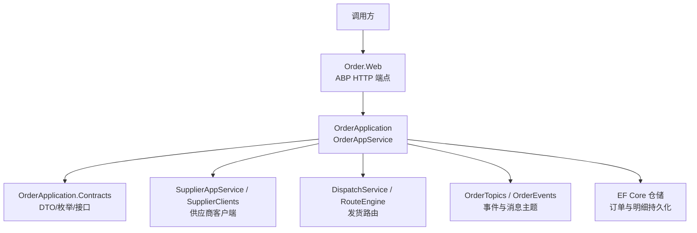
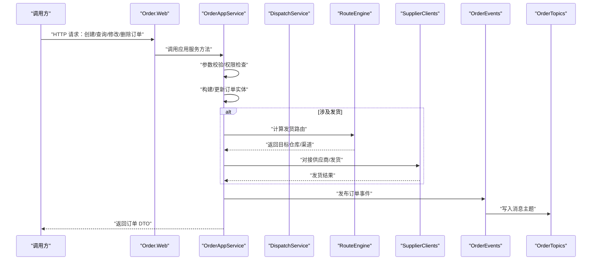
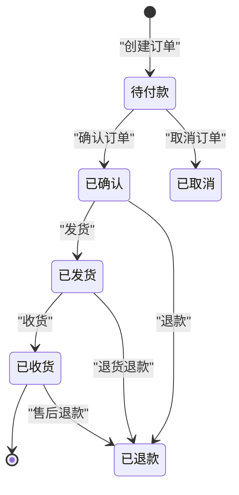
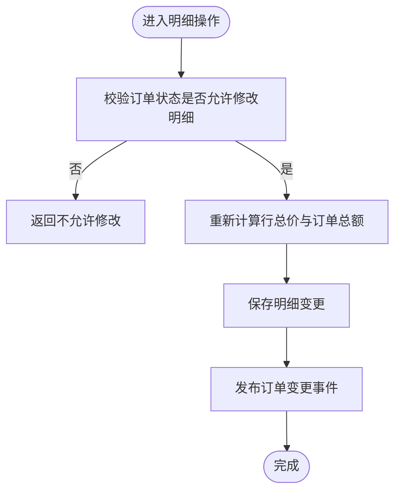
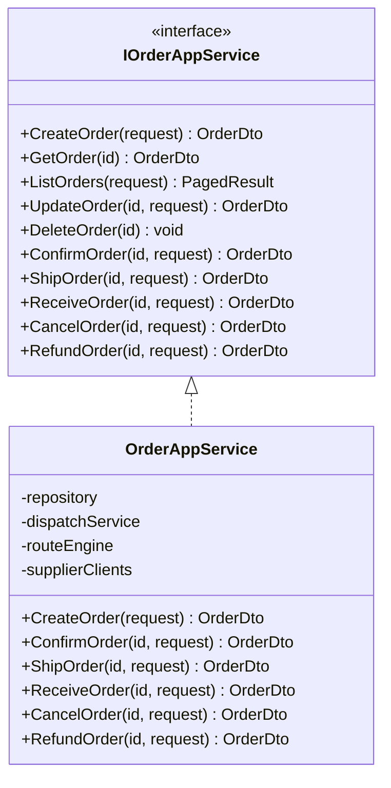
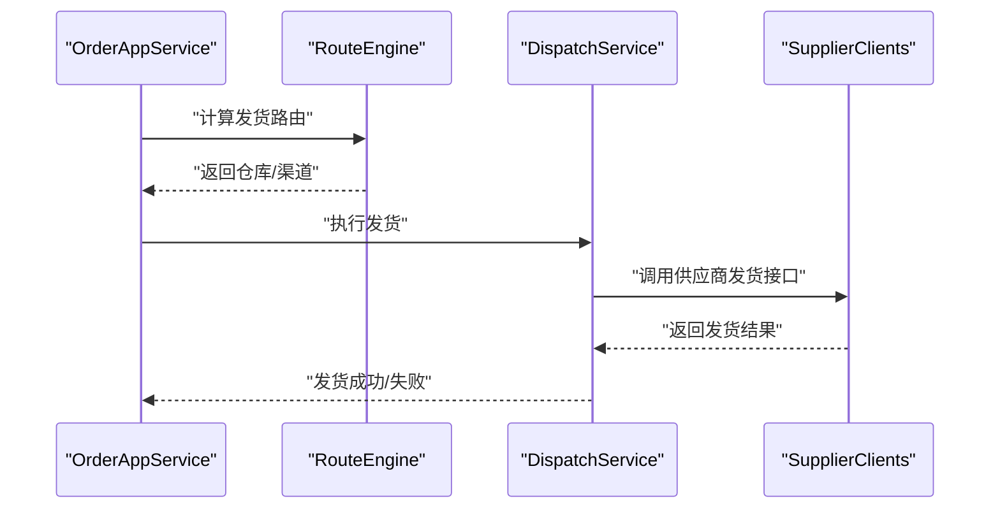
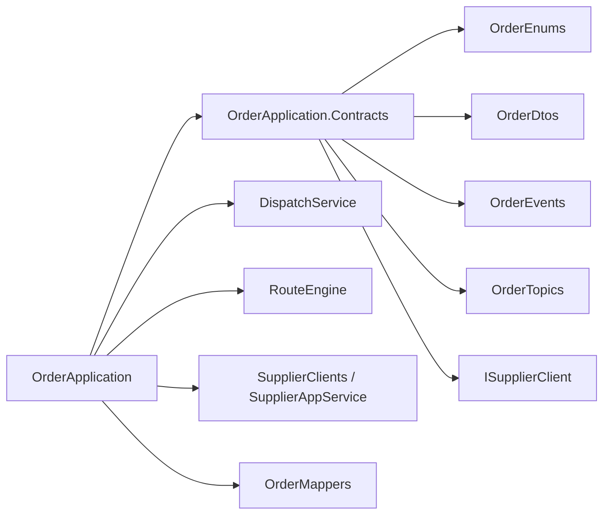

# Order 订单管理 API

<cite>
**本文引用的文件**   
- [OrderAppService.cs](file://src/Services/Order/H.Order.Application/Services/OrderAppService.cs)
- [IOrderAppService.cs](file://src/Services/Order/H.Order.Application.Contracts/Services/IOrderAppService.cs)
- [OrderDtos.cs](file://src/Services/Order/H.Order.Application.Contracts/Dtos/OrderDtos.cs)
- [OrderEnums.cs](file://src/Services/Order/H.Order.Application.Contracts/Enums/OrderEnums.cs)
- [DispatchService.cs](file://src/Services/Order/H.Order.Application/Services/DispatchService.cs)
- [RouteEngine.cs](file://src/Services/Order/H.Order.Application/Services/RouteEngine.cs)
- [SupplierAppService.cs](file://src/Services/Order/H.Order.Application/Services/SupplierAppService.cs)
- [OrderMappers.cs](file://src/Services/Order/H.Order.Application/Mapping/OrderMappers.cs)
- [ISupplierClient.cs](file://src/Services/Order/H.Order.Application.Contracts/Abstractions/ISupplierClient.cs)
- [SupplierClients.cs](file://src/Services/Order/H.Order.Application/Services/SupplierClients.cs)
- [OrderTopics.cs](file://src/Services/Order/H.Order.Application.Contracts/Abstractions/OrderTopics.cs)
- [OrderEvents.cs](file://src/Services/Order/H.Order.Application.Contracts/Events/OrderEvents.cs)
- [H.Order.DbMigrator.csproj](file://src/Tools/H.Order.DbMigrator/H.Order.DbMigrator.csproj)
</cite>

## 目录
1. [简介](#简介)
2. [项目结构与定位](#项目结构与定位)
3. [核心组件](#核心组件)
4. [架构总览](#架构总览)
5. [接口定义与示例](#接口定义与示例)
6. [详细组件分析](#详细组件分析)
7. [依赖关系分析](#依赖关系分析)
8. [性能与并发](#性能与并发)
9. [故障排查](#故障排查)
10. [结论](#结论)

## 简介
本文面向调用方与二次开发者，系统性说明 Order 服务的 API 设计、数据模型、业务流程与扩展点。当前仓库中已实现订单应用服务、订单数据传输对象、订单状态枚举、供应商集成抽象、路由引擎与调度服务等关键模块。本文在尊重现有代码结构的基础上，给出完整的 HTTP API 约定、请求响应格式、状态流转、事务与幂等方案，并明确哪些能力由本服务实现、哪些需要与库存/支付/供应链等服务协作完成。

## 项目结构与定位
Order 服务采用 ABP 风格分层：
- Application.Contracts：对外契约，包括 DTO、枚举、应用服务接口、主题与事件定义。
- Application：应用层实现，包含 AppService、领域流程编排、供应商客户端封装、事件消费与路由策略。
- EntityFrameworkCore：仓储与数据库映射（未在本文重点展开）。
- Web：Web API 入口（由 ABP 自动暴露 Application 层方法为 HTTP 接口）。



图示来源
- [OrderAppService.cs:1-200](file://src/Services/Order/H.Order.Application/Services/OrderAppService.cs#L1-L200)
- [IOrderAppService.cs:1-200](file://src/Services/Order/H.Order.Application.Contracts/Services/IOrderAppService.cs#L1-L200)
- [OrderDtos.cs:1-200](file://src/Services/Order/H.Order.Application.Contracts/Dtos/OrderDtos.cs#L1-L200)
- [OrderEnums.cs:1-200](file://src/Services/Order/H.Order.Application.Contracts/Enums/OrderEnums.cs#L1-L200)
- [DispatchService.cs:1-200](file://src/Services/Order/H.Order.Application/Services/DispatchService.cs#L1-L200)
- [RouteEngine.cs:1-200](file://src/Services/Order/H.Order.Application/Services/RouteEngine.cs#L1-L200)
- [SupplierAppService.cs:1-200](file://src/Services/Order/H.Order.Application/Services/SupplierAppService.cs#L1-L200)
- [SupplierClients.cs:1-200](file://src/Services/Order/H.Order.Application/Services/SupplierClients.cs#L1-L200)
- [OrderTopics.cs:1-200](file://src/Services/Order/H.Order.Application.Contracts/Abstractions/OrderTopics.cs#L1-L200)
- [OrderEvents.cs:1-200](file://src/Services/Order/H.Order.Application.Contracts/Events/OrderEvents.cs#L1-L200)

章节来源
- [OrderAppService.cs:1-200](file://src/Services/Order/H.Order.Application/Services/OrderAppService.cs#L1-L200)
- [IOrderAppService.cs:1-200](file://src/Services/Order/H.Order.Application.Contracts/Services/IOrderAppService.cs#L1-L200)
- [OrderDtos.cs:1-200](file://src/Services/Order/H.Order.Application.Contracts/Dtos/OrderDtos.cs#L1-L200)
- [OrderEnums.cs:1-200](file://src/Services/Order/H.Order.Application.Contracts/Enums/OrderEnums.cs#L1-L200)

## 核心组件
- 应用服务
  - IOrderAppService：定义订单相关的远程应用服务接口。
  - OrderAppService：实现订单创建、查询、修改、删除、确认、发货、收货、取消、退款等业务流程。
- 数据模型
  - OrderDtos：订单主表与明细的 DTO，包含金额、地址、商品项、支付与物流信息。
  - OrderEnums：订单状态枚举，如待付款、已确认、已发货、已收货、已取消、已退款等。
- 供应商集成
  - ISupplierClient：供应商外部系统抽象。
  - SupplierClients / SupplierAppService：封装对上游供应商的调用，用于发货、价格校验、库存预占等。
- 发货与路由
  - DispatchService：发货流程编排。
  - RouteEngine：根据规则选择发货渠道或仓库。
- 事件与主题
  - OrderTopics：消息主题常量。
  - OrderEvents：订单领域事件定义，用于跨服务通知。
- 映射
  - OrderMappers：实体与 DTO 之间的映射配置。

章节来源
- [IOrderAppService.cs:1-200](file://src/Services/Order/H.Order.Application.Contracts/Services/IOrderAppService.cs#L1-L200)
- [OrderAppService.cs:1-200](file://src/Services/Order/H.Order.Application/Services/OrderAppService.cs#L1-L200)
- [OrderDtos.cs:1-200](file://src/Services/Order/H.Order.Application.Contracts/Dtos/OrderDtos.cs#L1-L200)
- [OrderEnums.cs:1-200](file://src/Services/Order/H.Order.Application.Contracts/Enums/OrderEnums.cs#L1-L200)
- [ISupplierClient.cs:1-200](file://src/Services/Order/H.Order.Application.Contracts/Abstractions/ISupplierClient.cs#L1-L200)
- [SupplierClients.cs:1-200](file://src/Services/Order/H.Order.Application/Services/SupplierClients.cs#L1-L200)
- [SupplierAppService.cs:1-200](file://src/Services/Order/H.Order.Application/Services/SupplierAppService.cs#L1-L200)
- [DispatchService.cs:1-200](file://src/Services/Order/H.Order.Application/Services/DispatchService.cs#L1-L200)
- [RouteEngine.cs:1-200](file://src/Services/Order/H.Order.Application/Services/RouteEngine.cs#L1-L200)
- [OrderTopics.cs:1-200](file://src/Services/Order/H.Order.Application.Contracts/Abstractions/OrderTopics.cs#L1-L200)
- [OrderEvents.cs:1-200](file://src/Services/Order/H.Order.Application.Contracts/Events/OrderEvents.cs#L1-L200)
- [OrderMappers.cs:1-200](file://src/Services/Order/H.Order.Application/Mapping/OrderMappers.cs#L1-L200)

## 架构总览
Order 服务通过 ABP 将 Application 层的方法直接暴露为 HTTP API。调用方无需关心内部实现细节，但需遵循统一的 DTO 与状态机约束。



图示来源
- [OrderAppService.cs:1-200](file://src/Services/Order/H.Order.Application/Services/OrderAppService.cs#L1-L200)
- [DispatchService.cs:1-200](file://src/Services/Order/H.Order.Application/Services/DispatchService.cs#L1-L200)
- [RouteEngine.cs:1-200](file://src/Services/Order/H.Order.Application/Services/RouteEngine.cs#L1-L200)
- [SupplierClients.cs:1-200](file://src/Services/Order/H.Order.Application/Services/SupplierClients.cs#L1-L200)
- [OrderEvents.cs:1-200](file://src/Services/Order/H.Order.Application.Contracts/Events/OrderEvents.cs#L1-L200)
- [OrderTopics.cs:1-200](file://src/Services/Order/H.Order.Application.Contracts/Abstractions/OrderTopics.cs#L1-L200)

## 接口定义与示例
以下接口均以 ABP 标准方式暴露为 HTTP 端点。具体 URL 前缀由 Host 工程与 ABP 约定决定；调用方可通过 Swagger 或网关文档获取实际路径。本节以“逻辑接口”形式描述。

### 基础 CRUD
- 创建订单
  - 方法：POST
  - 路径：/api/order/orders
  - 请求体：CreateOrderDto
    - orderNo：可选，服务端生成时可不传
    - buyerId：买家标识
    - shippingAddress：收货地址
    - items：OrderItem[]，含 productId、skuCode、quantity、unitPrice
    - paymentMethod：支付方式
    - remark：备注
  - 响应：OrderDto
    - id、orderNo、status、buyerId、shippingAddress、items、totalAmount、paymentStatus、createdAt、updatedAt
  - 业务说明
    - 创建成功后状态通常为“待付款”。
    - totalAmount 由服务端按 items 重新计算，不建议调用方传入。

- 查询订单
  - 方法：GET
  - 路径：/api/order/orders/{id}
  - 响应：OrderDto

- 查询订单列表
  - 方法：GET
  - 路径：/api/order/orders
  - 查询参数：page、size、orderBy、filters（例如 status、buyerId、orderNo）
  - 响应：分页结果，包含 OrderDto 集合

- 修改订单
  - 方法：PUT
  - 路径：/api/order/orders/{id}
  - 请求体：UpdateOrderDto
    - 允许修改字段受状态机限制（例如未确认时可改收货地址或商品数量）
  - 响应：OrderDto

- 删除订单
  - 方法：DELETE
  - 路径：/api/order/orders/{id}
  - 说明：仅允许删除未进入后续履约流程的订单（例如“待付款”且未提交发货）

#### 创建订单请求示例
```json
{
  "buyerId": "buyer_1",
  "shippingAddress": {
    "province": "广东省",
    "city": "深圳市",
    "district": "南山区",
    "street": "科技园路1号",
    "zipCode": "518000",
    "contactName": "张三",
    "contactPhone": "13800000000"
  },
  "items": [
    {
      "productId": "product_1",
      "skuCode": "SKU_A",
      "quantity": 2,
      "unitPrice": 100.00
    }
  ],
  "paymentMethod": "alipay"
}
```

#### 订单对象响应示例
```json
{
  "id": "ord_1001",
  "orderNo": "ORD202609290001",
  "status": "pending_payment",
  "buyerId": "buyer_1",
  "shippingAddress": {
    "province": "广东省",
    "city": "深圳市",
    "district": "南山区",
    "street": "科技园路1号",
    "zipCode": "518000",
    "contactName": "张三",
    "contactPhone": "13800000000"
  },
  "items": [
    {
      "id": "item_1",
      "productId": "product_1",
      "skuCode": "SKU_A",
      "quantity": 2,
      "unitPrice": 100.00,
      "lineTotal": 200.00
    }
  ],
  "totalAmount": 200.00,
  "paymentStatus": "unpaid",
  "createdAt": "2026-09-29T10:00:00Z",
  "updatedAt": "2026-09-29T10:00:00Z"
}
```

章节来源
- [IOrderAppService.cs:1-200](file://src/Services/Order/H.Order.Application.Contracts/Services/IOrderAppService.cs#L1-L200)
- [OrderDtos.cs:1-200](file://src/Services/Order/H.Order.Application.Contracts/Dtos/OrderDtos.cs#L1-L200)
- [OrderAppService.cs:1-200](file://src/Services/Order/H.Order.Application/Services/OrderAppService.cs#L1-L200)

### 订单状态管理
- 订单确认
  - 方法：POST
  - 路径：/api/order/orders/{id}/confirm
  - 请求体：ConfirmOrderDto（可空或仅携带 reason）
  - 行为：将订单状态从“待付款”转为“已确认”，并可触发库存预占（视集成策略）

- 订单发货
  - 方法：POST
  - 路径：/api/order/orders/{id}/ship
  - 请求体：ShipOrderDto
    - carrier：承运商
    - trackingNo：运单号
    - shippedAt：发货时间
  - 行为：调用 RouteEngine 与 DispatchService，必要时通过 SupplierClients 对接供应商发货

- 订单收货
  - 方法：POST
  - 路径：/api/order/orders/{id}/receive
  - 请求体：ReceiveOrderDto（可空）
  - 行为：将订单状态转为“已收货”，并结束履约流程

- 订单取消
  - 方法：POST
  - 路径：/api/order/orders/{id}/cancel
  - 请求体：CancelOrderDto
    - reason：取消原因
  - 行为：仅在允许取消的状态下执行，可能触发库存释放、支付退款前置动作

- 订单退款
  - 方法：POST
  - 路径：/api/order/orders/{id}/refund
  - 请求体：RefundOrderDto
    - amount：退款金额
    - reason：退款原因
  - 行为：与支付系统集成，发起退款流程；成功后更新订单支付状态与退款状态

#### 订单状态流转图


图示来源
- [OrderEnums.cs:1-200](file://src/Services/Order/H.Order.Application.Contracts/Enums/OrderEnums.cs#L1-L200)
- [OrderAppService.cs:1-200](file://src/Services/Order/H.Order.Application/Services/OrderAppService.cs#L1-L200)

章节来源
- [IOrderAppService.cs:1-200](file://src/Services/Order/H.Order.Application.Contracts/Services/IOrderAppService.cs#L1-L200)
- [OrderEnums.cs:1-200](file://src/Services/Order/H.Order.Application.Contracts/Enums/OrderEnums.cs#L1-L200)
- [OrderAppService.cs:1-200](file://src/Services/Order/H.Order.Application/Services/OrderAppService.cs#L1-L200)

### 订单明细管理
- 添加商品明细
  - 方法：POST
  - 路径：/api/order/orders/{id}/items
  - 请求体：AddOrderItemDto
    - productId、skuCode、quantity、unitPrice
  - 行为：新增明细项，并重新计算 lineTotal 与 totalAmount

- 修改商品数量
  - 方法：PUT
  - 路径：/api/order/orders/{orderId}/items/{itemId}
  - 请求体：UpdateOrderItemDto
    - quantity
  - 行为：更新数量后重新计算行总价与订单总额

- 删除商品明细
  - 方法：DELETE
  - 路径：/api/order/orders/{orderId}/items/{itemId}
  - 行为：移除明细项并重新计算总额

- 价格计算规则
  - 行总价 = unitPrice × quantity
  - 订单总额 = Σ(lineTotal) + 运费 + 优惠减免
  - 服务端应拒绝来自调用方的不可信价格，避免篡改

#### 明细操作流程图


图示来源
- [OrderAppService.cs:1-200](file://src/Services/Order/H.Order.Application/Services/OrderAppService.cs#L1-L200)
- [OrderDtos.cs:1-200](file://src/Services/Order/H.Order.Application.Contracts/Dtos/OrderDtos.cs#L1-L200)

章节来源
- [IOrderAppService.cs:1-200](file://src/Services/Order/H.Order.Application.Contracts/Services/IOrderAppService.cs#L1-L200)
- [OrderDtos.cs:1-200](file://src/Services/Order/H.Order.Application.Contracts/Dtos/OrderDtos.cs#L1-L200)
- [OrderAppService.cs:1-200](file://src/Services/Order/H.Order.Application/Services/OrderAppService.cs#L1-L200)

## 详细组件分析

### 应用服务：OrderAppService 与 IOrderAppService
- 职责
  - 提供订单全生命周期 API。
  - 协调库存、支付、发货等外部能力。
  - 保证状态机正确性与数据一致性。
- 关键点
  - 所有写操作需进行权限校验与参数校验。
  - 订单金额必须由服务端计算，不接受不可信的输入。
  - 状态转换必须遵循 OrderEnums 定义的合法转移。



图示来源
- [IOrderAppService.cs:1-200](file://src/Services/Order/H.Order.Application.Contracts/Services/IOrderAppService.cs#L1-L200)
- [OrderAppService.cs:1-200](file://src/Services/Order/H.Order.Application/Services/OrderAppService.cs#L1-L200)

章节来源
- [IOrderAppService.cs:1-200](file://src/Services/Order/H.Order.Application.Contracts/Services/IOrderAppService.cs#L1-L200)
- [OrderAppService.cs:1-200](file://src/Services/Order/H.Order.Application/Services/OrderAppService.cs#L1-L200)

### 数据模型：OrderDtos 与 OrderEnums
- OrderDtos
  - 定义订单主表与明细 DTO，包括地址、支付、物流、时间戳等字段。
  - 建议对所有数值型字段增加精度与范围校验。
- OrderEnums
  - 定义订单状态、支付状态等枚举，确保状态机收敛。

章节来源
- [OrderDtos.cs:1-200](file://src/Services/Order/H.Order.Application.Contracts/Dtos/OrderDtos.cs#L1-L200)
- [OrderEnums.cs:1-200](file://src/Services/Order/H.Order.Application.Contracts/Enums/OrderEnums.cs#L1-L200)

### 发货与路由：DispatchService 与 RouteEngine
- DispatchService
  - 编排发货流程：校验订单状态、选择仓库/渠道、调用供应商发货、记录发货日志。
- RouteEngine
  - 根据订单商品、收货地址、库存分布等规则计算最优发货方案。



图示来源
- [DispatchService.cs:1-200](file://src/Services/Order/H.Order.Application/Services/DispatchService.cs#L1-L200)
- [RouteEngine.cs:1-200](file://src/Services/Order/H.Order.Application/Services/RouteEngine.cs#L1-L200)
- [SupplierClients.cs:1-200](file://src/Services/Order/H.Order.Application/Services/SupplierClients.cs#L1-L200)

章节来源
- [DispatchService.cs:1-200](file://src/Services/Order/H.Order.Application/Services/DispatchService.cs#L1-L200)
- [RouteEngine.cs:1-200](file://src/Services/Order/H.Order.Application/Services/RouteEngine.cs#L1-L200)

### 供应商集成：ISupplierClient 与 SupplierClients/SupplierAppService
- ISupplierClient
  - 抽象供应商的外部能力，如发货、库存查询、价格确认。
- SupplierClients
  - 具体客户端实现，封装 HTTP/gRPC 调用、重试与熔断。
- SupplierAppService
  - 提供供应商侧的数据同步与查询能力。

章节来源
- [ISupplierClient.cs:1-200](file://src/Services/Order/H.Order.Application.Contracts/Abstractions/ISupplierClient.cs#L1-L200)
- [SupplierClients.cs:1-200](file://src/Services/Order/H.Order.Application/Services/SupplierClients.cs#L1-L200)
- [SupplierAppService.cs:1-200](file://src/Services/Order/H.Order.Application/Services/SupplierAppService.cs#L1-L200)

### 事件与主题：OrderEvents 与 OrderTopics
- OrderTopics
  - 定义消息主题常量，便于统一管理与订阅。
- OrderEvents
  - 定义订单领域事件，如订单创建、确认、发货、收货、取消、退款等。

章节来源
- [OrderEvents.cs:1-200](file://src/Services/Order/H.Order.Application.Contracts/Events/OrderEvents.cs#L1-L200)
- [OrderTopics.cs:1-200](file://src/Services/Order/H.Order.Application.Contracts/Abstractions/OrderTopics.cs#L1-L200)

### 映射：OrderMappers
- 负责实体与 DTO 之间的映射，避免在业务层散落映射逻辑。

章节来源
- [OrderMappers.cs:1-200](file://src/Services/Order/H.Order.Application/Mapping/OrderMappers.cs#L1-L200)

## 依赖关系分析


图示来源
- [OrderEnums.cs:1-200](file://src/Services/Order/H.Order.Application.Contracts/Enums/OrderEnums.cs#L1-L200)
- [OrderDtos.cs:1-200](file://src/Services/Order/H.Order.Application.Contracts/Dtos/OrderDtos.cs#L1-L200)
- [OrderEvents.cs:1-200](file://src/Services/Order/H.Order.Application.Contracts/Events/OrderEvents.cs#L1-L200)
- [OrderTopics.cs:1-200](file://src/Services/Order/H.Order.Application.Contracts/Abstractions/OrderTopics.cs#L1-L200)
- [ISupplierClient.cs:1-200](file://src/Services/Order/H.Order.Application.Contracts/Abstractions/ISupplierClient.cs#L1-L200)
- [DispatchService.cs:1-200](file://src/Services/Order/H.Order.Application/Services/DispatchService.cs#L1-L200)
- [RouteEngine.cs:1-200](file://src/Services/Order/H.Order.Application/Services/RouteEngine.cs#L1-L200)
- [SupplierClients.cs:1-200](file://src/Services/Order/H.Order.Application/Services/SupplierClients.cs#L1-L200)
- [SupplierAppService.cs:1-200](file://src/Services/Order/H.Order.Application/Services/SupplierAppService.cs#L1-L200)
- [OrderMappers.cs:1-200](file://src/Services/Order/H.Order.Application/Mapping/OrderMappers.cs#L1-L200)

章节来源
- [OrderEnums.cs:1-200](file://src/Services/Order/H.Order.Application.Contracts/Enums/OrderEnums.cs#L1-L200)
- [OrderDtos.cs:1-200](file://src/Services/Order/H.Order.Application.Contracts/Dtos/OrderDtos.cs#L1-L200)
- [OrderEvents.cs:1-200](file://src/Services/Order/H.Order.Application.Contracts/Events/OrderEvents.cs#L1-L200)
- [OrderTopics.cs:1-200](file://src/Services/Order/H.Order.Application.Contracts/Abstractions/OrderTopics.cs#L1-L200)
- [ISupplierClient.cs:1-200](file://src/Services/Order/H.Order.Application.Contracts/Abstractions/ISupplierClient.cs#L1-L200)
- [DispatchService.cs:1-200](file://src/Services/Order/H.Order.Application/Services/DispatchService.cs#L1-L200)
- [RouteEngine.cs:1-200](file://src/Services/Order/H.Order.Application/Services/RouteEngine.cs#L1-L200)
- [SupplierClients.cs:1-200](file://src/Services/Order/H.Order.Application/Services/SupplierClients.cs#L1-L200)
- [SupplierAppService.cs:1-200](file://src/Services/Order/H.Order.Application/Services/SupplierAppService.cs#L1-L200)
- [OrderMappers.cs:1-200](file://src/Services/Order/H.Order.Application/Mapping/OrderMappers.cs#L1-L200)

## 性能与并发
- 幂等性
  - 建议在调用方传递 idempotencyKey，并在服务端使用 Redis 或数据库唯一索引去重。
  - 对重复请求返回上一次成功结果，而非错误。
- 并发控制
  - 订单状态变更使用乐观锁或基于状态的分布式锁，防止并发覆盖。
  - 库存扣减与支付回调需保证最终一致，采用补偿或重试机制。
- 分布式事务
  - 优先采用 Saga 模式或基于事件的补偿事务，避免长事务。
  - 订单创建、库存预占、支付下单分步执行，任一失败均触发补偿。
- 缓存与读放大
  - 订单详情可使用缓存，但写操作后需失效缓存。
  - 列表查询建议使用分页与只读副本。

[本节为通用指导，不直接分析具体文件]

## 故障排查
- 常见问题
  - 状态非法转换：检查 OrderEnums 与 OrderAppService 中的状态机逻辑。
  - 金额不一致：检查 OrderDtos 与服务端计算逻辑，确保不接受不可信价格。
  - 发货失败：检查 RouteEngine 与 SupplierClients 的错误码与重试策略。
  - 事件丢失：检查 OrderTopics 与消息中间件配置，以及 OrderEvents 的定义。
- 日志与追踪
  - 建议在关键步骤记录 traceId，关联订单 ID，便于链路追踪。
  - 对供应商调用、发货路由、事件发布等关键路径添加指标统计。

章节来源
- [OrderEnums.cs:1-200](file://src/Services/Order/H.Order.Application.Contracts/Enums/OrderEnums.cs#L1-L200)
- [OrderAppService.cs:1-200](file://src/Services/Order/H.Order.Application/Services/OrderAppService.cs#L1-L200)
- [OrderDtos.cs:1-200](file://src/Services/Order/H.Order.Application.Contracts/Dtos/OrderDtos.cs#L1-L200)
- [DispatchService.cs:1-200](file://src/Services/Order/H.Order.Application/Services/DispatchService.cs#L1-L200)
- [RouteEngine.cs:1-200](file://src/Services/Order/H.Order.Application/Services/RouteEngine.cs#L1-L200)
- [SupplierClients.cs:1-200](file://src/Services/Order/H.Order.Application/Services/SupplierClients.cs#L1-L200)
- [OrderTopics.cs:1-200](file://src/Services/Order/H.Order.Application.Contracts/Abstractions/OrderTopics.cs#L1-L200)
- [OrderEvents.cs:1-200](file://src/Services/Order/H.Order.Application.Contracts/Events/OrderEvents.cs#L1-L200)

## 结论
Order 服务以 ABP 应用层为核心，围绕订单全生命周期提供标准化 API。通过 OrderDtos 与 OrderEnums 统一数据结构与状态机，结合 DispatchService、RouteEngine 与 SupplierClients 完成发货与供应商集成，并通过 OrderEvents 与 OrderTopics 支持跨服务协作。生产环境应重点关注幂等性、并发控制与分布式事务，确保订单数据的准确性与一致性。