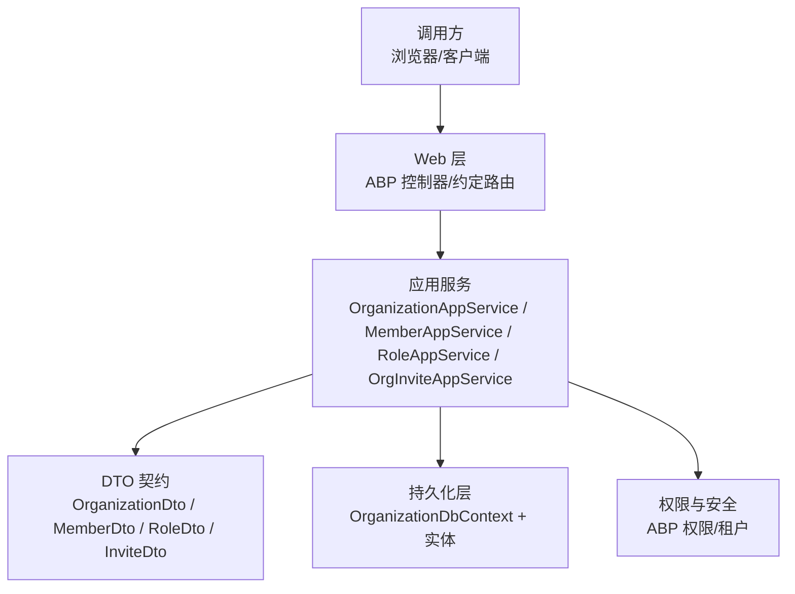
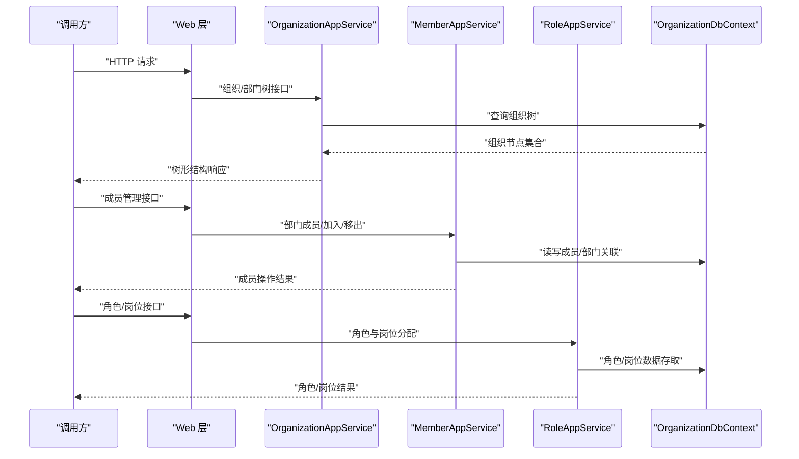
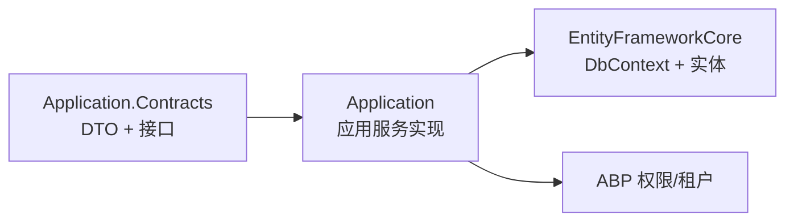
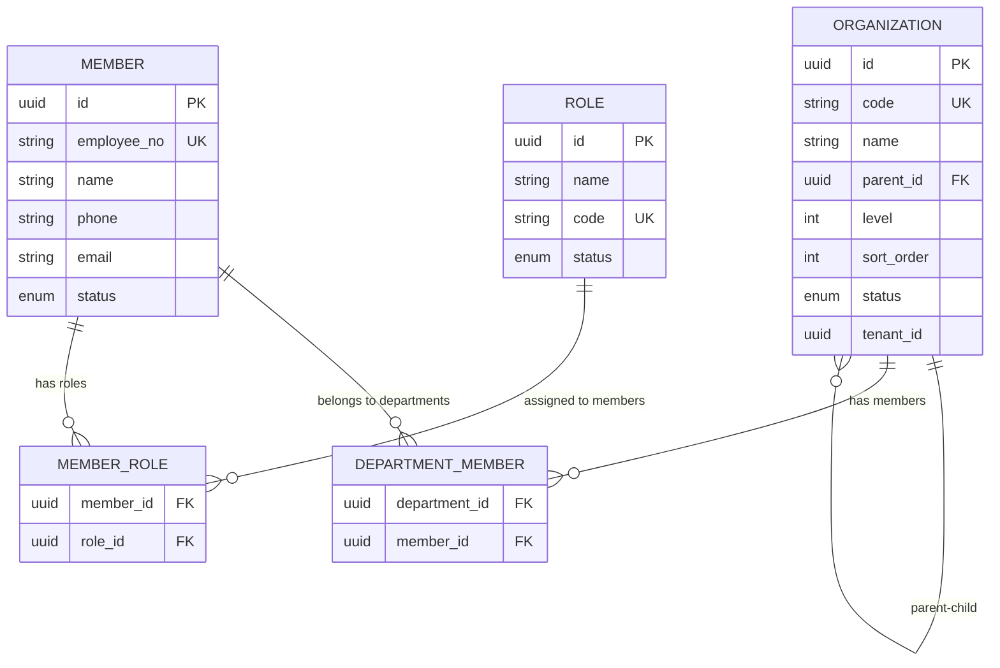

# Organization 组织管理 API

<cite>
**本文引用的文件**   
- [OrganizationAppService.cs](file://src/Services/Organization/H.Organization.Application.Services/OrganizationAppService.cs)
- [MemberAppService.cs](file://src/Services/Organization/H.Organization.Application.Services/MemberAppService.cs)
- [OrgInviteAppService.cs](file://src/Services/Organization/H.Organization.Application.Services/OrgInviteAppService.cs)
- [RoleAppService.cs](file://src/Services/Organization/H.Organization.Application.Services/RoleAppService.cs)
- [IOrganizationAppService.cs](file://src/Services/Organization/H.Organization.Application.Contracts/Interfaces/IOrganizationAppService.cs)
- [IMemberAppService.cs](file://src/Services/Organization/H.Organization.Application.Contracts/Interfaces/IMemberAppService.cs)
- [IOrgInviteAppService.cs](file://src/Services/Organization/H.Organization.Application.Contracts/Interfaces/IOrgInviteAppService.cs)
- [IRoleAppService.cs](file://src/Services/Organization/H.Organization.Application.Contracts/Interfaces/IRoleAppService.cs)
- [OrganizationDto.cs](file://src/Services/Organization/H.Organization.Application.Contracts/Dtos/OrganizationDto.cs)
- [MemberDto.cs](file://src/Services/Organization/H.Organization.Application.Contracts/Dtos/MemberDto.cs)
- [InviteDto.cs](file://src/Services/Organization/H.Organization.Application.Contracts/Dtos/InviteDto.cs)
- [RoleDto.cs](file://src/Services/Organization/H.Organization.Application.Contracts/Dtos/RoleDto.cs)
- [PagedResult.cs](file://src/Services/Organization/H.Organization.Application.Contracts/Dtos/PagedResult.cs)
- [OrganizationApplicationModule.cs](file://src/Services/Organization/H.Organization.Application/OrganizationApplicationModule.cs)
- [H.Organization.EntityFrameworkCore/OrganizationDbContext.cs](file://src/Services/Organization/H.Organization.EntityFrameworkCore/OrganizationDbContext.cs)
- [H.Organization.DbMigrator/Program.cs](file://src/Tools/H.Organization.DbMigrator/Program.cs)
</cite>

## 目录
1. [引言](#引言)
2. [项目结构](#项目结构)
3. [核心组件](#核心组件)
4. [架构总览](#架构总览)
5. [接口详解](#接口详解)
6. [依赖关系分析](#依赖关系分析)
7. [性能与并发](#性能与并发)
8. [故障排查指南](#故障排查指南)
9. [结论](#结论)
10. [附录：数据模型与树形结构](#附录数据模型与树形结构)

## 引言
本文档面向调用方，系统化说明 Organization 服务的组织管理 API，包括组织架构（部门）CRUD、树形结构维护、层级关系管理；人员管理（员工信息、部门成员、岗位分配）；以及组织级权限控制、数据范围限制和访问验证。文档同时给出每个接口的 HTTP 方法、URL 路径、请求参数、响应结构与示例，并补充数据模型、继承关系、缓存策略与批量操作建议。

## 项目结构
Organization 服务采用 ABP 典型分层：
- Application.Contracts：对外暴露的 DTO、应用服务接口
- Application：应用服务实现
- EntityFrameworkCore：领域实体、上下文与数据库映射
- Web：Web 层注册与路由约定
- DbMigrator：数据库迁移工具

图表来源
- [OrganizationAppService.cs:1-200](file://src/Services/Organization/H.Organization.Application.Services/OrganizationAppService.cs#L1-L200)
- [IOrganizationAppService.cs:1-200](file://src/Services/Organization/H.Organization.Application.Contracts/Interfaces/IOrganizationAppService.cs#L1-L200)
- [OrganizationDbContext.cs:1-200](file://src/Services/Organization/H.Organization.EntityFrameworkCore/OrganizationDbContext.cs#L1-L200)

章节来源
- [OrganizationApplicationModule.cs:1-200](file://src/Services/Organization/H.Organization.Application/OrganizationApplicationModule.cs#L1-L200)
- [H.Organization.DbMigrator/Program.cs:1-200](file://src/Tools/H.Organization.DbMigrator/Program.cs#L1-L200)

## 核心组件
- IOrganizationAppService：组织/部门树形结构的 CRUD、树查询、层级移动
- IMemberAppService：员工信息管理、部门成员列表、加入/移出部门
- IRoleAppService：角色与岗位相关能力（如角色绑定部门、岗位分配等）
- IOrgInviteAppService：邀请入组织（用于多租户或外部协作场景）

这些接口通过 ABP 的远程服务约定自动映射为 REST API，默认前缀通常为 `/api/organization`，具体以模块注册为准。

章节来源
- [IOrganizationAppService.cs:1-200](file://src/Services/Organization/H.Organization.Application.Contracts/Interfaces/IOrganizationAppService.cs#L1-L200)
- [IMemberAppService.cs:1-200](file://src/Services/Organization/H.Organization.Application.Contracts/Interfaces/IMemberAppService.cs#L1-L200)
- [IRoleAppService.cs:1-200](file://src/Services/Organization/H.Organization.Application.Contracts/Interfaces/IRoleAppService.cs#L1-L200)
- [IOrgInviteAppService.cs:1-200](file://src/Services/Organization/H.Organization.Application.Contracts/Interfaces/IOrgInviteAppService.cs#L1-L200)

## 架构总览
Organization 服务遵循“接口契约 → 应用服务 → 领域逻辑 → 数据持久化”的分层模式。权限校验由 ABP 框架在应用服务入口完成，租户隔离通过 DbContext 的租户过滤器实现。

图表来源
- [OrganizationAppService.cs:1-200](file://src/Services/Organization/H.Organization.Application.Services/OrganizationAppService.cs#L1-L200)
- [MemberAppService.cs:1-200](file://src/Services/Organization/H.Organization.Application.Services/MemberAppService.cs#L1-L200)
- [RoleAppService.cs:1-200](file://src/Services/Organization/H.Organization.Application.Services/RoleAppService.cs#L1-L200)
- [OrganizationDbContext.cs:1-200](file://src/Services/Organization/H.Organization.EntityFrameworkCore/OrganizationDbContext.cs#L1-L200)

## 接口详解

### 一、组织架构管理接口（部门 CRUD、树形结构、层级关系）

#### 1. 获取组织树
- 方法与路径
  - GET `/api/organization/tree`
- 功能
  - 返回当前租户下完整的组织树结构，支持按条件过滤根节点或可见性。
- 请求参数
  - 无或可选分页/过滤参数（视接口定义）。
- 响应数据结构
  - 树形数组，每个节点包含 id、parentId、name、code、level、children 等字段。
- 响应示例
  - 见附录中的“复杂树形结构 JSON”。

章节来源
- [IOrganizationAppService.cs:1-200](file://src/Services/Organization/H.Organization.Application.Contracts/Interfaces/IOrganizationAppService.cs#L1-L200)
- [OrganizationDto.cs:1-200](file://src/Services/Organization/H.Organization.Application.Contracts/Dtos/OrganizationDto.cs#L1-L200)

#### 2. 创建组织/部门
- 方法与路径
  - POST `/api/organization`
- 功能
  - 创建新的组织/部门节点，可指定父节点以实现层级关系。
- 请求参数
  - name、code、parentId（可选）、排序号等。
- 响应数据结构
  - 返回新创建的节点 DTO。
- 错误处理
  - 名称重复、循环引用、超出层级深度等。

章节来源
- [IOrganizationAppService.cs:1-200](file://src/Services/Organization/H.Organization.Application.Contracts/Interfaces/IOrganizationAppService.cs#L1-L200)

#### 3. 更新组织/部门
- 方法与路径
  - PUT `/api/organization/{id}`
- 功能
  - 修改部门基本信息或调整 parentId 进行层级变更。
- 请求参数
  - name、code、parentId（可选）、排序号等。
- 响应数据结构
  - 返回更新后的节点 DTO。
- 注意事项
  - 将子节点提升为父节点时禁止形成环；跨层级移动需校验可达性。

章节来源
- [IOrganizationAppService.cs:1-200](file://src/Services/Organization/H.Organization.Application.Contracts/Interfaces/IOrganizationAppService.cs#L1-L200)

#### 4. 删除组织/部门
- 方法与路径
  - DELETE `/api/organization/{id}`
- 功能
  - 删除空部门或带策略删除（如先清空子节点/转移成员）。
- 响应数据结构
  - 布尔值或标准操作结果。
- 约束
  - 有子节点或有关联成员时的删除策略需明确。

章节来源
- [IOrganizationAppService.cs:1-200](file://src/Services/Organization/H.Organization.Application.Contracts/Interfaces/IOrganizationAppService.cs#L1-L200)

#### 5. 移动/重排组织节点
- 方法与路径
  - PUT `/api/organization/{id}/move`
- 功能
  - 调整节点的 parentId 或同级顺序，用于拖拽排序与层级重组。
- 请求参数
  - targetParentId、position（插入位置）。
- 响应数据结构
  - 成功标志与新结构摘要。

章节来源
- [IOrganizationAppService.cs:1-200](file://src/Services/Organization/H.Organization.Application.Contracts/Interfaces/IOrganizationAppService.cs#L1-L200)

### 二、人员管理接口（员工信息、部门成员、岗位分配）

#### 1. 员工信息查询
- 方法与路径
  - GET `/api/member/{id}`
- 功能
  - 根据用户/员工 ID 获取个人信息及所属部门。
- 响应数据结构
  - MemberDto，含姓名、工号、手机号、邮箱、部门信息等。

章节来源
- [IMemberAppService.cs:1-200](file://src/Services/Organization/H.Organization.Application.Contracts/Interfaces/IMemberAppService.cs#L1-L200)
- [MemberDto.cs:1-200](file://src/Services/Organization/H.Organization.Application.Contracts/Dtos/MemberDto.cs#L1-L200)

#### 2. 部门成员列表
- 方法与路径
  - GET `/api/member/departments/{departmentId}/members`
- 功能
  - 列出指定部门下的所有成员，支持分页与关键字搜索。
- 请求参数
  - departmentId、page、size、keyword。
- 响应数据结构
  - PagedResult<MemberDto>。

章节来源
- [IMemberAppService.cs:1-200](file://src/Services/Organization/H.Organization.Application.Contracts/Interfaces/IMemberAppService.cs#L1-L200)
- [PagedResult.cs:1-200](file://src/Services/Organization/H.Organization.Application.Contracts/Dtos/PagedResult.cs#L1-L200)

#### 3. 加入/移除部门成员
- 方法与路径
  - POST `/api/member/departments/{departmentId}/join`
  - DELETE `/api/member/departments/{departmentId}/leave`
- 功能
  - 将某员工加入或移出指定部门。
- 请求参数
  - memberId（加入/移除目标）。
- 响应数据结构
  - 标准操作结果。

章节来源
- [IMemberAppService.cs:1-200](file://src/Services/Organization/H.Organization.Application.Contracts/Interfaces/IMemberAppService.cs#L1-L200)

#### 4. 岗位/角色分配
- 方法与路径
  - POST `/api/role/{memberId}/assign`
  - DELETE `/api/role/{memberId}/unassign`
- 功能
  - 为员工分配或撤销角色/岗位，可与部门维度结合。
- 请求参数
  - roleId、scope（如部门范围）。
- 响应数据结构
  - 标准操作结果。

章节来源
- [IRoleAppService.cs:1-200](file://src/Services/Organization/H.Organization.Application.Contracts/Interfaces/IRoleAppService.cs#L1-L200)
- [RoleDto.cs:1-200](file://src/Services/Organization/H.Organization.Application.Contracts/Dtos/RoleDto.cs#L1-L200)

### 三、组织权限接口（组织级权限、数据范围、访问验证）

- 权限控制点
  - 接口级：使用 ABP 的 `[Authorize]` 或特性声明对接口进行授权保护。
  - 数据范围：基于当前用户的角色、部门与数据范围规则，过滤查询结果（例如仅可见本部门及以下的数据）。
- 常见策略
  - 读权限：仅允许查看本人所在部门及其下级组织。
  - 写权限：仅允许编辑本部门或更高级别组织的元数据。
  - 数据范围：结合角色与部门，动态构造查询条件。
- 访问验证流程
  - 请求进入 Web 层 → ABP 校验认证与授权 → 应用服务执行 → 按数据范围过滤 → 返回结果。

章节来源
- [OrganizationApplicationModule.cs:1-200](file://src/Services/Organization/H.Organization.Application/OrganizationApplicationModule.cs#L1-L200)
- [OrganizationDbContext.cs:1-200](file://src/Services/Organization/H.Organization.EntityFrameworkCore/OrganizationDbContext.cs#L1-L200)

## 依赖关系分析
- 应用服务依赖
  - OrganizationAppService 依赖 Organization 实体仓储与上下文
  - MemberAppService 依赖 Member 实体与部门-成员关联表
  - RoleAppService 依赖 Role 实体与成员-角色关联表
- 契约与实现解耦
  - 所有对外能力通过 Application.Contracts 暴露，便于生成客户端 SDK 与前端类型
- 潜在循环依赖
  - 避免在领域层反向引用应用层；保持“契约 → 应用 → 领域 → 基础设施”单向依赖

图表来源
- [IOrganizationAppService.cs:1-200](file://src/Services/Organization/H.Organization.Application.Contracts/Interfaces/IOrganizationAppService.cs#L1-L200)
- [OrganizationAppService.cs:1-200](file://src/Services/Organization/H.Organization.Application.Services/OrganizationAppService.cs#L1-L200)
- [OrganizationDbContext.cs:1-200](file://src/Services/Organization/H.Organization.EntityFrameworkCore/OrganizationDbContext.cs#L1-L200)

## 性能与并发
- 树形结构读取
  - 建议一次性加载整棵树并在内存中构建树，避免 N+1 查询
  - 对大型组织可使用延迟加载子节点或分页加载根节点
- 批量操作
  - 批量新增/更新组织节点时，尽量合并事务，减少往返数据库次数
  - 批量成员加入/移出建议使用批处理方法，避免逐条提交
- 并发安全
  - 修改 parentId 时需加锁或使用乐观并发控制，防止循环引用与脏写
  - 成员加入/移出需保证部门-成员关联的唯一性与一致性
- 缓存策略
  - 组织树适合只读缓存（如 Redis），设置合理过期时间或在配置变更后主动失效
  - 成员列表与角色分配可根据业务频率选择短时缓存或按需刷新
- 索引优化
  - 在组织表的 parentId、code、name 上建立索引，加速查找与搜索
  - 成员-部门、成员-角色关联表建立外键与常用查询组合索引

## 故障排查指南
- 无法获取组织树
  - 检查当前租户是否正确；确认组织数据是否存在
  - 查看接口是否被权限拦截（未授权）
- 部门成员为空
  - 确认成员是否已加入该部门；检查成员状态是否有效
- 角色分配失败
  - 检查角色是否存在且启用；确认分配范围是否合法
- 树形结构异常
  - 排查是否存在循环父子关系；检查层级深度限制
- 性能问题
  - 检查是否发生 N+1 查询；考虑引入缓存或分批加载
  - 关注数据库慢查询日志，优化 SQL 与索引

## 结论
Organization 服务围绕“组织树、成员、角色”三个核心概念提供完善的 API，覆盖部门 CRUD、树形结构维护、层级关系管理、人员管理与岗位分配，并通过 ABP 权限体系实现组织级权限控制与数据范围限制。在生产环境中应重视树形数据的缓存与并发安全、批量操作的吞吐与一致性，并结合索引优化提升整体性能。

## 附录：数据模型与树形结构

### 数据模型概览
- 组织节点（Department/Organization）
  - 标识：id、code、name、parentId、level、sortOrder、status、tenantId
  - 关系：自关联 parentId → id，形成树形结构
- 成员（Member）
  - 标识：id、employeeNo、name、phone、email、status
  - 关系：多对多与部门、角色关联
- 角色（Role）
  - 标识：id、name、code、status
  - 关系：与成员多对多，可限定部门范围

图表来源
- [OrganizationDbContext.cs:1-200](file://src/Services/Organization/H.Organization.EntityFrameworkCore/OrganizationDbContext.cs#L1-L200)

### 复杂树形结构 JSON 示例
以下为组织树的通用 JSON 结构示例（字段名以实际 DTO 为准）：
- nodes[]
  - id: 字符串
  - name: 字符串
  - code: 字符串
  - parentId: 字符串或 null
  - level: 整数
  - children: 节点数组

示例（缩略展示）：
- 根节点 A
  - 子节点 B
    - 孙节点 B1
  - 子节点 C
- 根节点 D

章节来源
- [OrganizationDto.cs:1-200](file://src/Services/Organization/H.Organization.Application.Contracts/Dtos/OrganizationDto.cs#L1-L200)