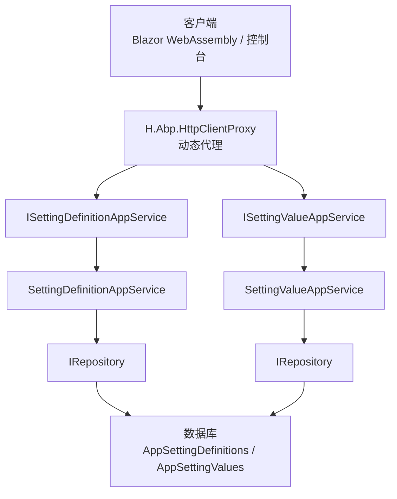
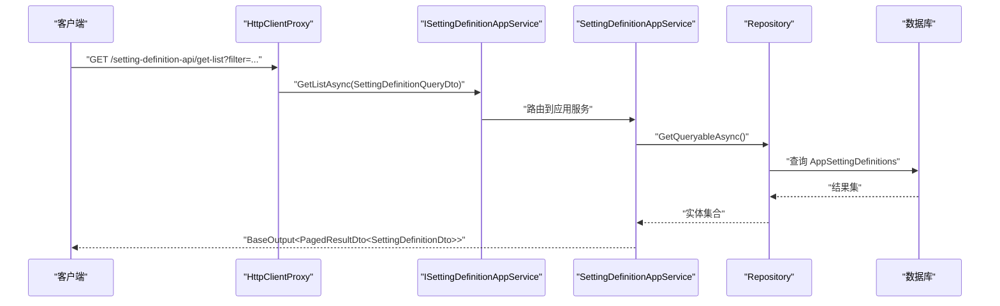
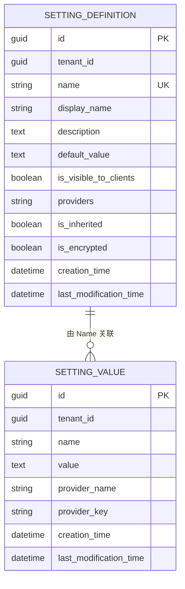
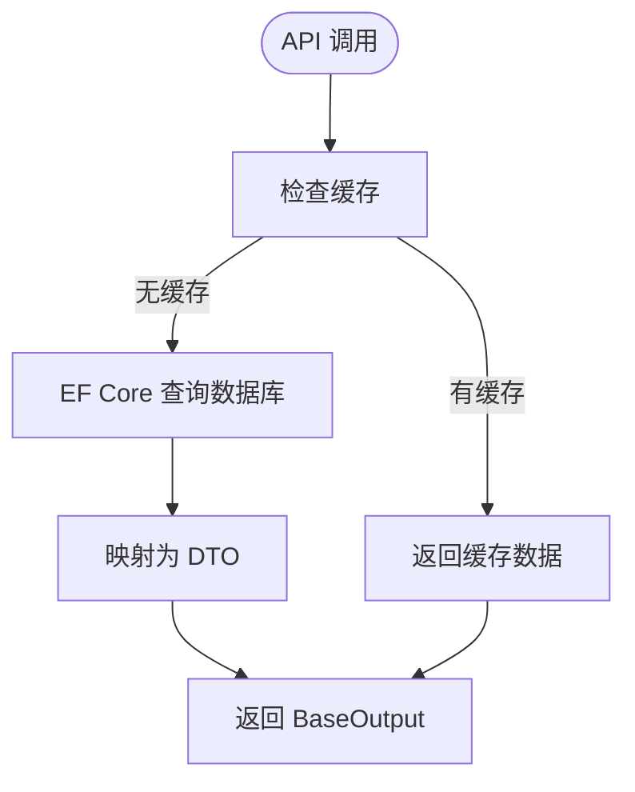
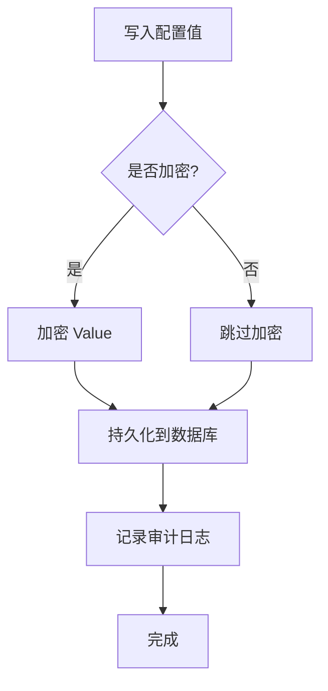

# Setting 系统设置 API

<cite>
**本文引用的文件**
- [ISettingDefinitionAppService.cs](file://src/Services/Setting/H.Setting.Application.Contracts/Services/ISettingDefinitionAppService.cs)
- [ISettingValueAppService.cs](file://src/Services/Setting/H.Setting.Application.Contracts/Services/ISettingValueAppService.cs)
- [SettingDefinitionDtos.cs](file://src/Services/Setting/H.Setting.Application.Contracts/Dtos/SettingDefinitionDtos.cs)
- [SettingValueDtos.cs](file://src/Services/Setting/H.Setting.Application.Contracts/Dtos/SettingValueDtos.cs)
- [SettingDefinitionAppService.cs](file://src/Services/Setting/H.Setting.Application/Services/SettingDefinitionAppService.cs)
- [SettingValueAppService.cs](file://src/Services/Setting/H.Setting.Application/Services/SettingValueAppService.cs)
- [SettingDefinition.cs](file://src/Services/Setting/H.Setting.EntityFrameworkCore/Entities/SettingDefinition.cs)
- [SettingValue.cs](file://src/Services/Setting/H.Setting.EntityFrameworkCore/Entities/SettingValue.cs)
- [20260724162708_InitSetting.cs](file://src/Tools/H.Setting.DbMigrator/Migrations/20260724162708_InitSetting.cs)
- [20260801151929_Drop_IsDelete.cs](file://src/Tools/H.Setting.DbMigrator/Migrations/20260801151929_Drop_IsDelete.cs)
- [README.md](file://README.md)
</cite>

## 目录
1. [引言](#引言)
2. [项目结构](#项目结构)
3. [核心组件](#核心组件)
4. [架构总览](#架构总览)
5. [详细接口文档](#详细接口文档)
6. [依赖与数据模型分析](#依赖与数据模型分析)
7. [缓存、热更新与版本管理](#缓存热更新与版本管理)
8. [安全性与审计策略](#安全性与审计策略)
9. [性能考量](#性能考量)
10. [故障排查指南](#故障排查指南)
11. [结论](#结论)

## 引言
Setting 服务提供系统级配置管理能力，包括配置定义（元数据）与配置值（实例化配置项）的 CRUD，并支持按全局、租户、用户三种提供者维度进行覆盖。该服务遵循 ABP 模块化架构，通过 Application.Contracts 暴露 IAppService 接口，由前端基于 H.Abp.HttpClientProxy 动态生成 HTTP 调用。

本 API 文档聚焦以下能力：
- 系统配置：配置定义的创建、查询、修改、删除；默认值管理与可见性控制。
- 应用配置：通过 Providers 与 IsInherited 实现模块开关、功能特性配置及分层继承。
- 用户设置：ProviderName 为 U 且 ProviderKey 为用户标识的用户级偏好配置。

## 项目结构
Setting 服务采用典型 ABP 分层：
- H.Setting.Application.Contracts：对外暴露的 IAppService 接口与 DTO。
- H.Setting.Application：应用服务实现，包含业务校验、分页查询、映射等逻辑。
- H.Setting.EntityFrameworkCore：实体模型与数据库迁移。
- H.Setting.Web：Web 模块标记类（当前为空标记）。
- Tools/H.Setting.DbMigrator：数据库迁移工具。

**图表来源**
- [ISettingDefinitionAppService.cs:1-16](file://src/Services/Setting/H.Setting.Application.Contracts/Services/ISettingDefinitionAppService.cs#L1-L16)
- [ISettingValueAppService.cs:1-19](file://src/Services/Setting/H.Setting.Application.Contracts/Services/ISettingValueAppService.cs#L1-L19)
- [SettingDefinitionAppService.cs:1-136](file://src/Services/Setting/H.Setting.Application/Services/SettingDefinitionAppService.cs#L1-L136)
- [SettingValueAppService.cs:1-167](file://src/Services/Setting/H.Setting.Application/Services/SettingValueAppService.cs#L1-L167)

**章节来源**
- [README.md:1-73](file://README.md#L1-L73)

## 核心组件
- 配置定义接口 ISettingDefinitionAppService：提供配置定义的分页查询、单条查询、新增、更新、删除。
- 配置值接口 ISettingValueAppService：提供配置值分页查询、单条查询、新增、更新、删除，以及配置定义下拉列表查询。
- DTO 层：
  - SettingDefinitionDto、CreateUpdateSettingDefinitionDto、SettingDefinitionQueryDto
  - SettingValueDto、CreateUpdateSettingValueDto、SettingValueQueryDto、SettingDefinitionLookupDto、SettingValueProviders
- 实体层：
  - SettingDefinition：多租户、名称唯一、是否对客户端可见、允许提供者、是否可继承、是否加密。
  - SettingValue：多租户、Name + ProviderName + ProviderKey 唯一索引。

**章节来源**
- [ISettingDefinitionAppService.cs:1-16](file://src/Services/Setting/H.Setting.Application.Contracts/Services/ISettingDefinitionAppService.cs#L1-L16)
- [ISettingValueAppService.cs:1-19](file://src/Services/Setting/H.Setting.Application.Contracts/Services/ISettingValueAppService.cs#L1-L19)
- [SettingDefinitionDtos.cs:1-57](file://src/Services/Setting/H.Setting.Application.Contracts/Dtos/SettingDefinitionDtos.cs#L1-L57)
- [SettingValueDtos.cs:1-72](file://src/Services/Setting/H.Setting.Application.Contracts/Dtos/SettingValueDtos.cs#L1-L72)
- [SettingDefinition.cs:1-37](file://src/Services/Setting/H.Setting.EntityFrameworkCore/Entities/SettingDefinition.cs#L1-L37)
- [SettingValue.cs:1-25](file://src/Services/Setting/H.Setting.EntityFrameworkCore/Entities/SettingValue.cs#L1-L25)

## 架构总览
Setting 服务的请求路径由 ABP 约定生成：接口名作为资源路径，方法名决定 HTTP 动词。例如 GetListAsync → GET，CreateAsync → POST，UpdateAsync → PUT，DeleteAsync → DELETE。所有响应统一包装在 BaseOutput<T> 中。

**图表来源**
- [ISettingDefinitionAppService.cs:1-16](file://src/Services/Setting/H.Setting.Application.Contracts/Services/ISettingDefinitionAppService.cs#L1-L16)
- [SettingDefinitionAppService.cs:23-58](file://src/Services/Setting/H.Setting.Application/Services/SettingDefinitionAppService.cs#L23-L58)

## 详细接口文档

### 配置定义管理接口 ISettingDefinitionAppService

#### 分页查询配置定义
- HTTP 方法：GET
- URL 路径：/api/setting-definition/get-list
- 查询参数：
  - filter: string?，按 Name 或 DisplayName 模糊过滤
  - skipCount: int，ABP 分页起始偏移
  - maxResultCount: int，ABP 分页每页数量，默认 10
- 成功响应体：BaseOutput<PagedResultDto<SettingDefinitionDto>>
- 字段说明：
  - Id: Guid
  - Name: string，配置名称（唯一标识）
  - DisplayName: string，显示名称
  - Description: string?，描述
  - DefaultValue: string?，默认值
  - IsVisibleToClients: bool，是否对客户端可见
  - Providers: string?，允许的提供者（逗号分隔，如 G,T,U）
  - IsInherited: bool，是否可被下层提供者继承
  - IsEncrypted: bool，是否加密存储
  - CreationTime: DateTime
  - LastModificationTime: DateTime?

示例响应（已脱敏）：
{
  "result": {
    "totalCount": 5,
    "items": [
      {
        "id": "guid-1",
        "name": "Module.Email.Enabled",
        "displayName": "邮件模块开关",
        "description": "启用或禁用邮件发送功能",
        "defaultValue": "true",
        "isVisibleToClients": true,
        "providers": "G,T",
        "isInherited": true,
        "isEncrypted": false,
        "creationTime": "2026-01-01T00:00:00Z",
        "lastModificationTime": null
      }
    ]
  },
  "success": true,
  "errors": []
}

#### 获取单个配置定义
- HTTP 方法：GET
- URL 路径：/api/setting-definition/get/{id}
- 路径参数：
  - id: Guid
- 成功响应体：BaseOutput<SettingDefinitionDto>

#### 新增配置定义
- HTTP 方法：POST
- URL 路径：/api/setting-definition/create
- 请求体：CreateUpdateSettingDefinitionDto
  - Name: string，必填，去重校验
  - DisplayName: string，必填
  - Description: string?
  - DefaultValue: string?
  - IsVisibleToClients: bool
  - Providers: string?
  - IsInherited: bool，默认 true
  - IsEncrypted: bool
- 成功响应体：BaseOutput<SettingDefinitionDto>

示例请求体：
{
  "name": "Feature.Chat.Enabled",
  "displayName": "聊天功能",
  "description": "控制聊天功能的开启与关闭",
  "defaultValue": "false",
  "isVisibleToClients": true,
  "providers": "G,T,U",
  "isInherited": true,
  "isEncrypted": false
}

#### 更新配置定义
- HTTP 方法：PUT
- URL 路径：/api/setting-definition/update/{id}
- 路径参数：
  - id: Guid
- 请求体：CreateUpdateSettingDefinitionDto（同上）
- 成功响应体：BaseOutput<SettingDefinitionDto>

#### 删除配置定义
- HTTP 方法：DELETE
- URL 路径：/api/setting-definition/delete/{id}
- 路径参数：
  - id: Guid
- 成功响应体：BaseOutput（空对象）
- 约束：若该配置定义下存在配置值，则拒绝删除并返回友好异常。

**章节来源**
- [ISettingDefinitionAppService.cs:1-16](file://src/Services/Setting/H.Setting.Application.Contracts/Services/ISettingDefinitionAppService.cs#L1-L16)
- [SettingDefinitionAppService.cs:23-136](file://src/Services/Setting/H.Setting.Application/Services/SettingDefinitionAppService.cs#L23-L136)
- [SettingDefinitionDtos.cs:1-57](file://src/Services/Setting/H.Setting.Application.Contracts/Dtos/SettingDefinitionDtos.cs#L1-L57)

### 配置值管理接口 ISettingValueAppService

#### 分页查询配置值
- HTTP 方法：GET
- URL 路径：/api/setting-value/get-list
- 查询参数：
  - filter: string?，按 Name 模糊过滤
  - providerName: string?，按提供者名称过滤（G/T/U）
  - skipCount: int
  - maxResultCount: int，默认 10
- 成功响应体：BaseOutput<PagedResultDto<SettingValueDto>>
- 字段说明：
  - Id: Guid
  - Name: string，关联配置定义的 Name
  - Value: string?，配置值
  - ProviderName: string，提供者名称（G=全局，T=租户，U=用户）
  - ProviderKey: string?，提供者键（租户Id/用户Id，全局为空）
  - DisplayName: string?，冗余字段，来自对应配置的 DisplayName
  - CreationTime: DateTime
  - LastModificationTime: DateTime?

示例响应（已脱敏）：
{
  "result": {
    "totalCount": 2,
    "items": [
      {
        "id": "guid-10",
        "name": "Module.Email.Enabled",
        "value": "true",
        "providerName": "T",
        "providerKey": "tenant-guid-1",
        "displayName": "邮件模块开关",
        "creationTime": "2026-01-01T00:00:00Z",
        "lastModificationTime": null
      }
    ]
  },
  "success": true,
  "errors": []
}

#### 获取单个配置值
- HTTP 方法：GET
- URL 路径：/api/setting-value/get/{id}
- 路径参数：
  - id: Guid
- 成功响应体：BaseOutput<SettingValueDto>

#### 新增配置值
- HTTP 方法：POST
- URL 路径：/api/setting-value/create
- 请求体：CreateUpdateSettingValueDto
  - Name: string，必填，去重校验（Name + ProviderName + ProviderKey）
  - Value: string?
  - ProviderName: string，默认 Global（即 "G"）
  - ProviderKey: string?
- 成功响应体：BaseOutput<SettingValueDto>

示例请求体（用户级主题配置）：
{
  "name": "User.Theme.Mode",
  "value": "dark",
  "providerName": "U",
  "providerKey": "user-guid-123"
}

#### 更新配置值
- HTTP 方法：PUT
- URL 路径：/api/setting-value/update/{id}
- 路径参数：
  - id: Guid
- 请求体：CreateUpdateSettingValueDto（同上）
- 成功响应体：BaseOutput<SettingValueDto>

#### 删除配置值
- HTTP 方法：DELETE
- URL 路径：/api/setting-value/delete/{id}
- 路径参数：
  - id: Guid
- 成功响应体：BaseOutput（空对象）

#### 获取配置定义下拉项
- HTTP 方法：GET
- URL 路径：/api/setting-value/get-definition-lookup
- 成功响应体：BaseOutput<List<SettingDefinitionLookupDto>>
- 字段说明：
  - Name: string
  - DisplayName: string
  - DefaultValue: string?

用途：供配置值编辑页面选择对应的配置定义。

**章节来源**
- [ISettingValueAppService.cs:1-19](file://src/Services/Setting/H.Setting.Application.Contracts/Services/ISettingValueAppService.cs#L1-L19)
- [SettingValueAppService.cs:23-167](file://src/Services/Setting/H.Setting.Application/Services/SettingValueAppService.cs#L23-L167)
- [SettingValueDtos.cs:1-72](file://src/Services/Setting/H.Setting.Application.Contracts/Dtos/SettingValueDtos.cs#L1-L72)

## 依赖与数据模型分析

### 实体关系图

**图表来源**
- [SettingDefinition.cs:1-37](file://src/Services/Setting/H.Setting.EntityFrameworkCore/Entities/SettingDefinition.cs#L1-L37)
- [SettingValue.cs:1-25](file://src/Services/Setting/H.Setting.EntityFrameworkCore/Entities/SettingValue.cs#L1-L25)
- [20260724162708_InitSetting.cs:12-87](file://src/Tools/H.Setting.DbMigrator/Migrations/20260724162708_InitSetting.cs#L12-L87)

### 数据表结构
- 表名：AppSettingDefinitions
  - 主键：Id (Guid)
  - 列：TenantId、Name（唯一）、DisplayName、Description、DefaultValue、IsVisibleToClients、Providers、IsInherited、IsEncrypted、CreationTime、LastModificationTime
  - 初始包含软删除字段，后续迁移移除
- 表名：AppSettingValues
  - 主键：Id (Guid)
  - 唯一索引：Name + ProviderName + ProviderKey（当 ProviderKey 非空时）
  - 列：TenantId、Name、Value、ProviderName、ProviderKey、CreationTime、LastModificationTime
  - 初始包含软删除字段，后续迁移移除

**章节来源**
- [20260724162708_InitSetting.cs:12-87](file://src/Tools/H.Setting.DbMigrator/Migrations/20260724162708_InitSetting.cs#L12-L87)
- [20260801151929_Drop_IsDelete.cs:12-80](file://src/Tools/H.Setting.DbMigrator/Migrations/20260801151929_Drop_IsDelete.cs#L12-L80)

## 缓存、热更新与版本管理

### 配置缓存机制
- 代码层面未发现显式内存缓存（如 MemoryCache）或分布式缓存（如 Redis）的使用。
- 查询均通过 EF Core 直接访问数据库，未引入二级缓存。
- 因此，“热更新”在当前实现中表现为：写入后下一次读取即可生效，无延迟。

### 热更新支持
- 配置值更新后立即持久化，下次查询即反映最新值。
- 由于不存在进程内缓存，无需手动失效缓存。

### 配置版本管理
- 实体使用 AuditedEntity<Guid>，包含 CreationTime 与 LastModificationTime，可用于基础变更追踪。
- 未实现显式的版本号字段（如 Version/RowVersion），也未提供配置快照或历史版本 API。
- 如需版本管理，可在 SettingDefinition/SettingValue 上扩展 RowVersion 或独立版本表。

[此图为概念流程，不映射具体源码]

**章节来源**
- [SettingDefinitionAppService.cs:23-136](file://src/Services/Setting/H.Setting.Application/Services/SettingDefinitionAppService.cs#L23-L136)
- [SettingValueAppService.cs:23-167](file://src/Services/Setting/H.Setting.Application/Services/SettingValueAppService.cs#L23-L167)

## 安全性与审计策略

### 敏感信息加密
- SettingDefinition.IsEncrypted 标记某配置定义的值是否应加密存储。
- 当前 Service 层在读写 SettingValue.Value 时未自动加解密，需上层封装或自定义序列化器实现。
- 建议：在 SettingValueAppService 的 Create/Update 前后，依据关联定义的 IsEncrypted 标志执行加解密；或在仓储层拦截写入。

### 配置可见性与继承
- IsVisibleToClients：用于控制是否将配置定义暴露给客户端。
- Providers：限制允许的提供者类型（如 G,T,U）。
- IsInherited：指示是否允许下层提供者继承上层值。
- 这些字段当前主要用于元数据展示与约束提示，实际解析与合并逻辑应在更高层的配置聚合器中实现。

### 审计日志记录
- 实体继承 AuditedEntity<Guid>，自动生成 CreationTime、CreatorId、LastModificationTime、LastModifierId。
- 当前 Service 未显式记录审计日志事件（如“创建配置定义”、“更新配置值”）。
- 建议：结合 ABP 的 ICurrentUser 与 AbpAuditManager，在关键写操作后记录审计事件，避免在日志中输出敏感值。

[此图为概念流程，不映射具体源码]

**章节来源**
- [SettingDefinition.cs:1-37](file://src/Services/Setting/H.Setting.EntityFrameworkCore/Entities/SettingDefinition.cs#L1-L37)
- [SettingValue.cs:1-25](file://src/Services/Setting/H.Setting.EntityFrameworkCore/Entities/SettingValue.cs#L1-L25)
- [SettingDefinitionDtos.cs:1-57](file://src/Services/Setting/H.Setting.Application.Contracts/Dtos/SettingDefinitionDtos.cs#L1-L57)
- [SettingValueDtos.cs:1-72](file://src/Services/Setting/H.Setting.Application.Contracts/Dtos/SettingValueDtos.cs#L1-L72)

## 性能考量
- 分页查询：使用 Skip/Take，默认 MaxResultCount 为 10，避免全表扫描。
- 过滤条件：
  - 配置定义：Name 或 DisplayName 模糊匹配 Contains。
  - 配置值：Name 模糊匹配，可选 ProviderName 精确匹配。
- 关联展示：在配置值列表中将 Name 去重后批量查询 DisplayName，减少 N+1 问题。
- 索引：数据库为 Name 建立唯一索引；配置值以 Name + ProviderName + ProviderKey 建立唯一索引（ProviderKey 非空时）。

优化建议：
- 对高频过滤字段增加复合索引，如 ProviderName、CreationTime。
- 引入只读缓存（如 Redis）缓存热点配置定义与常用配置值，降低数据库压力。
- 对大文本 DefaultValue 与 Value 使用合理分片或外部存储（如对象存储）以降低数据库负载。

**章节来源**
- [SettingDefinitionAppService.cs:23-58](file://src/Services/Setting/H.Setting.Application/Services/SettingDefinitionAppService.cs#L23-L58)
- [SettingValueAppService.cs:23-95](file://src/Services/Setting/H.Setting.Application/Services/SettingValueAppService.cs#L23-L95)
- [20260724162708_InitSetting.cs:60-87](file://src/Tools/H.Setting.DbMigrator/Migrations/20260724162708_InitSetting.cs#L60-L87)

## 故障排查指南
常见错误与处理：
- 配置名称重复：
  - 新增或更新配置定义时，Name 已存在会抛出友好异常。
  - 处理：更换 Name 或确认是否误用已有 Key。
- 配置项重复：
  - 新增或更新配置值时，Name + ProviderName + ProviderKey 组合已存在会抛出友好异常。
  - 处理：修正 ProviderKey 或更新现有记录。
- 删除配置定义失败：
  - 若该定义下仍存在配置值，删除会被拒绝。
  - 处理：先删除相关配置值，再删除定义。
- 查询结果为空：
  - 检查 Filter、ProviderName 是否正确；确认数据库连接与迁移是否执行。

定位步骤：
- 检查 BaseOutput.errors 字段中的友好异常消息。
- 核对数据库表是否存在 AppSettingDefinitions、AppSettingValues。
- 确认迁移脚本是否已执行：InitSetting 与 Drop_IsDelete。

**章节来源**
- [SettingDefinitionAppService.cs:98-136](file://src/Services/Setting/H.Setting.Application/Services/SettingDefinitionAppService.cs#L98-L136)
- [SettingValueAppService.cs:120-167](file://src/Services/Setting/H.Setting.Application/Services/SettingValueAppService.cs#L120-L167)
- [20260724162708_InitSetting.cs:12-87](file://src/Tools/H.Setting.DbMigrator/Migrations/20260724162708_InitSetting.cs#L12-L87)
- [20260801151929_Drop_IsDelete.cs:12-80](file://src/Tools/H.Setting.DbMigrator/Migrations/20260801151929_Drop_IsDelete.cs#L12-L80)

## 结论
Setting 服务提供了完善的系统配置管理能力，涵盖配置定义的元数据管理与配置值的实例化维护。其接口简洁、数据模型清晰，并通过 Providers 与 IsInherited 支持多层级配置覆盖。当前实现未内置缓存与加密逻辑，建议在应用层扩展以实现高性能、安全可靠的配置中心。同时，可通过扩展审计日志与版本管理机制，提升运维可观测性与回滚能力。