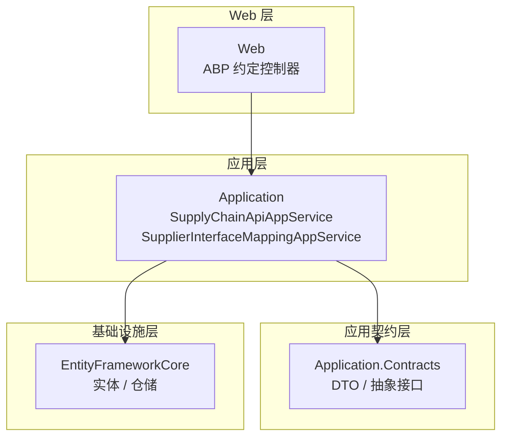
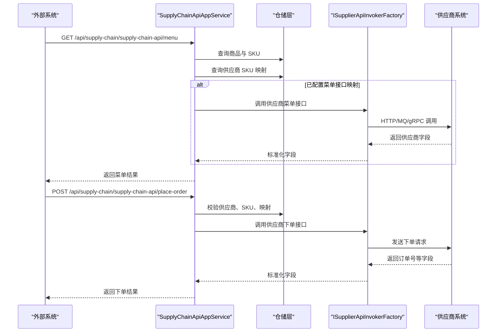
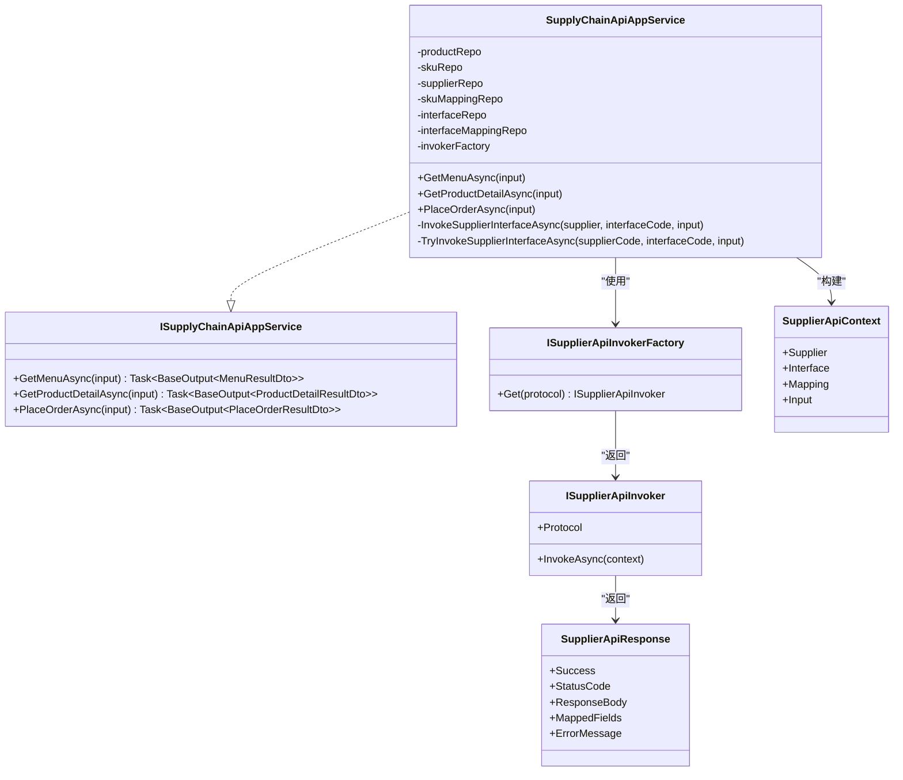

# SupplyChain 供应链管理 API

<cite>
**本文引用的文件**   
- [ISupplyChainApiAppService.cs](file://src/Services/SupplyChain/H.SupplyChain.Application.Contracts/Services/ISupplyChainApiAppService.cs)
- [SupplyChainApiAppService.cs](file://src/Services/SupplyChain/H.SupplyChain.Application/Services/SupplyChainApiAppService.cs)
- [SupplierInterfaceMappingAppService.cs](file://src/Services/SupplyChain/H.SupplyChain.Application/Services/SupplierInterfaceMappingAppService.cs)
- [SupplyChainApiDtos.cs](file://src/Services/SupplyChain/H.SupplyChain.Application.Contracts/Dtos/SupplyChainApiDtos.cs)
- [ProductDtos.cs](file://src/Services/SupplyChain/H.SupplyChain.Application.Contracts/Dtos/ProductDtos.cs)
- [ProductSkuDtos.cs](file://src/Services/SupplyChain/H.SupplyChain.Application.Contracts/Dtos/ProductSkuDtos.cs)
- [SupplierDtos.cs](file://src/Services/SupplyChain/H.SupplyChain.Application.Contracts/Dtos/SupplierDtos.cs)
- [ApiInterfaceDtos.cs](file://src/Services/SupplyChain/H.SupplyChain.Application.Contracts/Dtos/ApiInterfaceDtos.cs)
- [SupplierInterfaceMappingDtos.cs](file://src/Services/SupplyChain/H.SupplyChain.Application.Contracts/Dtos/SupplierInterfaceMappingDtos.cs)
- [SupplierSkuMappingDtos.cs](file://src/Services/SupplyChain/H.SupplyChain.Application.Contracts/Dtos/SupplierSkuMappingDtos.cs)
- [FieldMapping.cs](file://src/Services/SupplyChain/H.SupplyChain.Application.Contracts/Abstractions/FieldMapping.cs)
- [ISupplierApiInvoker.cs](file://src/Services/SupplyChain/H.SupplyChain.Application.Contracts/Abstractions/ISupplierApiInvoker.cs)
- [SupplierApiContext.cs](file://src/Services/SupplyChain/H.SupplyChain.Application.Contracts/Abstractions/SupplierApiContext.cs)
</cite>

## 目录
1. [简介](#简介)
2. [项目结构](#项目结构)
3. [核心组件](#核心组件)
4. [架构总览](#架构总览)
5. [详细接口文档](#详细接口文档)
6. [依赖关系分析](#依赖关系分析)
7. [性能与一致性](#性能与一致性)
8. [故障排查指南](#故障排查指南)
9. [结论](#结论)
10. [附录：扩展点与可视化数据分析建议](#附录扩展点与可视化数据分析建议)

## 简介
SupplyChain 服务提供供应链对外统一 API，核心能力包括：
- 供应商基础数据管理（通过应用服务暴露的 CRUD）。
- 产品目录与 SKU 管理（DTO 层已定义完整模型，用于支撑菜单、详情与下单）。
- 采购流程入口（下单接口作为“按供应商 SKU 映射向供应商下单”的统一入口）。
- 库存字段展示（SKU 包含库存字段；具体出入库与预警逻辑由其他领域服务负责，本仓库以 DTO 形式暴露字段）。
- 物流跟踪（当前仓库未直接实现运输单、位置跟踪、签收确认接口；可在现有接口映射机制上扩展）。

对外 RESTful 端点由 ABP 约定控制器自动生成，主要路径前缀为 `/api/supply-chain/supply-chain-api`。内部管理能力通过 Application Service 暴露，典型路径如 `/api/supply-chain/supplier-interface-mappings` 等。

## 项目结构
SupplyChain 采用 ABP 分层架构：
- Application.Contracts：对外契约，包括 DTO、枚举、抽象接口。
- Application：应用服务实现，封装业务流程。
- EntityFrameworkCore：实体、仓储与数据库访问。
- Web：Web 宿主与控制器注册（ABP 自动路由）。



**图表来源**
- [ISupplyChainApiAppService.cs:1-30](file://src/Services/SupplyChain/H.SupplyChain.Application.Contracts/Services/ISupplyChainApiAppService.cs#L1-L30)
- [SupplyChainApiAppService.cs:1-60](file://src/Services/SupplyChain/H.SupplyChain.Application/Services/SupplyChainApiAppService.cs#L1-L60)

**章节来源**
- [ISupplyChainApiAppService.cs:1-30](file://src/Services/SupplyChain/H.SupplyChain.Application.Contracts/Services/ISupplyChainApiAppService.cs#L1-L30)
- [SupplyChainApiAppService.cs:1-60](file://src/Services/SupplyChain/H.SupplyChain.Application/Services/SupplyChainApiAppService.cs#L1-L60)

## 核心组件
- 供应链对外 API 应用服务：提供菜单查询、商品详情查询、下单三个对外接口。
- 供应商接口映射应用服务：提供接口映射的增删改查能力，支持分页、过滤与去重校验。
- 字段映射抽象：描述标准字段定义与请求/响应字段映射结构，便于多协议供应商对接。
- 供应商调用抽象：定义 `ISupplierApiInvoker` 与工厂，支持 HTTP/Mock/MQ/gRPC 等多种协议扩展。

**章节来源**
- [ISupplyChainApiAppService.cs:1-30](file://src/Services/SupplyChain/H.SupplyChain.Application.Contracts/Services/ISupplyChainApiAppService.cs#L1-L30)
- [SupplierInterfaceMappingAppService.cs:1-111](file://src/Services/SupplyChain/H.SupplyChain.Application/Services/SupplierInterfaceMappingAppService.cs#L1-L111)
- [FieldMapping.cs:1-85](file://src/Services/SupplyChain/H.SupplyChain.Application.Contracts/Abstractions/FieldMapping.cs#L1-L85)
- [ISupplierApiInvoker.cs:1-60](file://src/Services/SupplyChain/H.SupplyChain.Application.Contracts/Abstractions/ISupplierApiInvoker.cs#L1-L60)

## 架构总览
SupplyChain 对外 API 的核心流程：
- 菜单接口：读取上架商品及启用 SKU，并按供应商编码附加供应商侧 SKU 编码；若配置了菜单接口映射，可尝试调用供应商接口叠加供应商侧字段。
- 商品详情接口：根据商品编码或 SKU 编码返回商品主信息与 SKU 列表；若指定供应商，则调用其商品详情接口并合并供应商字段。
- 下单接口：校验输入 → 查找供应商 → 查找内部 SKU → 查找供应商 SKU 映射 → 构造标准输入 → 调用供应商下单接口 → 解析响应 → 输出订单号与标准字段。



**图表来源**
- [SupplyChainApiAppService.cs:60-200](file://src/Services/SupplyChain/H.SupplyChain.Application/Services/SupplyChainApiAppService.cs#L60-L200)
- [SupplyChainApiAppService.cs:201-367](file://src/Services/SupplyChain/H.SupplyChain.Application/Services/SupplyChainApiAppService.cs#L201-L367)
- [ISupplierApiInvoker.cs:1-60](file://src/Services/SupplyChain/H.SupplyChain.Application.Contracts/Abstractions/ISupplierApiInvoker.cs#L1-L60)

## 详细接口文档

### 一、供应链基础数据接口

#### 1. 供应商管理
说明：供应商是供应链参与方，包含编码、名称、API 地址、认证方式、协议类型、是否启用等字段。供应商管理通过应用服务暴露 CRUD 能力，供后台系统维护。

- 方法：POST / PUT / DELETE / GET
- URL：`/api/supply-chain/suppliers`（ABP 约定）
- 请求体：
  - 创建：`CreateSupplierDto`
  - 更新：`UpdateSupplierDto`
  - 查询：`SupplierQueryDto`（分页参数 + 关键词 + 是否启用）
- 响应体：
  - 单项：`SupplierDto`
  - 分页：`BaseOutput<PagedResultDto<SupplierDto>>`

关键字段说明：
- Code：供应商唯一编码
- Name：供应商名称
- DisplayName：显示名称
- ApiUrl：供应商 API 地址
- AuthType：认证方式
- AuthConfig：认证配置 JSON
- Protocol：对接协议
- ProtocolConfig：协议配置 JSON
- IsEnabled：是否启用
- Remark：备注

示例请求（创建供应商）：
```json
{
  "code": "SUPPLIER_001",
  "name": "示例供应商A",
  "displayName": "供应商A",
  "apiUrl": "https://supplier-a.example.com/api",
  "authType": "ApiKey",
  "authConfig": "{\"apiKey\":\"xxx\"}",
  "protocol": "Http",
  "protocolConfig": "{}",
  "isEnabled": true,
  "remark": "测试供应商"
}
```

示例响应（单个供应商）：
```json
{
  "success": true,
  "result": {
    "id": "SUPPLIER_001",
    "code": "SUPPLIER_001",
    "name": "示例供应商A",
    "displayName": "供应商A",
    "apiUrl": "https://supplier-a.example.com/api",
    "authType": "ApiKey",
    "authConfig": "{\"apiKey\":\"xxx\"}",
    "protocol": "Http",
    "protocolConfig": "{}",
    "isEnabled": true,
    "remark": "测试供应商",
    "creationTime": "2026-09-29T12:00:00Z"
  }
}
```

**章节来源**
- [SupplierDtos.cs:1-120](file://src/Services/SupplyChain/H.SupplyChain.Application.Contracts/Dtos/SupplierDtos.cs#L1-L120)

#### 2. 产品目录
说明：产品目录包含商品主表与 SKU。商品主表有编码、名称、类别、描述、状态、备注；SKU 表示最小售卖单元，包含编码、名称、规格、价格、库存、是否启用等。

- 方法：POST / PUT / DELETE / GET
- URL：`/api/supply-chain/products`、`/api/supply-chain/product-skus`（ABP 约定）
- 请求体：
  - 商品创建：`CreateProductDto`
  - 商品更新：`UpdateProductDto`
  - 商品查询：`ProductQueryDto`（分页 + 关键词 + 类别 + 状态）
  - SKU 创建：`CreateProductSkuDto`
  - SKU 更新：`UpdateProductSkuDto`
  - SKU 查询：`ProductSkuQueryDto`（分页 + 商品ID + 关键词 + 是否启用）
- 响应体：
  - 商品：`ProductDto` / `ProductDetailDto`
  - SKU：`ProductSkuDto`
  - 分页：`BaseOutput<PagedResultDto<T>>`

关键字段说明：
- ProductCode：商品唯一编码
- Name：商品名称
- Category：类别
- Description：描述
- Status：商品状态（上架/下架）
- Skus：SKU 列表
- SkuCode：SKU 唯一编码
- SkuName：SKU 名称
- SpecsJson：规格属性 JSON
- Price：售价
- Stock：库存
- IsEnabled：是否启用

示例请求（创建 SKU）：
```json
{
  "productId": 1,
  "skuCode": "SKU_RED_XL",
  "skuName": "红色 XL",
  "specsJson": "{\"color\":\"red\",\"size\":\"XL\"}",
  "price": 199.00,
  "stock": 100,
  "isEnabled": true,
  "remark": "热销款"
}
```

示例响应（SKU 列表项）：
```json
{
  "success": true,
  "result": {
    "totalCount": 1,
    "items": [
      {
        "id": 1,
        "productId": 1,
        "skuCode": "SKU_RED_XL",
        "skuName": "红色 XL",
        "specsJson": "{\"color\":\"red\",\"size\":\"XL\"}",
        "price": 199.00,
        "stock": 100,
        "isEnabled": true,
        "remark": "热销款",
        "creationTime": "2026-09-29T12:00:00Z"
      }
    ]
  }
}
```

**章节来源**
- [ProductDtos.cs:1-96](file://src/Services/SupplyChain/H.SupplyChain.Application.Contracts/Dtos/ProductDtos.cs#L1-L96)
- [ProductSkuDtos.cs:1-102](file://src/Services/SupplyChain/H.SupplyChain.Application.Contracts/Dtos/ProductSkuDtos.cs#L1-L102)

#### 3. 采购合同
说明：当前仓库未直接提供“采购合同”实体与接口。该能力通常位于独立合同领域服务中；如需在本体系中使用，建议在现有接口映射机制基础上扩展一个“采购合同”标准接口，并通过 `ApiInterfaceDto` 与 `SupplierInterfaceMappingDto` 完成多供应商适配。

**章节来源**
- [ApiInterfaceDtos.cs:1-123](file://src/Services/SupplyChain/H.SupplyChain.Application.Contracts/Dtos/ApiInterfaceDtos.cs#L1-L123)
- [SupplierInterfaceMappingDtos.cs:1-100](file://src/Services/SupplyChain/H.SupplyChain.Application.Contracts/Dtos/SupplierInterfaceMappingDtos.cs#L1-L100)

### 二、采购流程接口

#### 1. 采购申请
说明：当前仓库未直接提供“采购申请”接口。建议在外部系统中生成采购申请后，调用本服务的“下单接口”触发实际采购行为；或在现有接口映射机制上新增“采购申请”标准接口。

**章节来源**
- [ISupplyChainApiAppService.cs:1-30](file://src/Services/SupplyChain/H.SupplyChain.Application.Contracts/Services/ISupplyChainApiAppService.cs#L1-L30)

#### 2. 采购订单（下单接口）
说明：对外下单接口统一接收内部 SKU 与业务信息，按供应商 SKU 映射与下单接口映射向供应商下单，返回供应商订单号与标准字段。

- 方法：POST
- URL：`/api/supply-chain/supply-chain-api/place-order`
- 请求体：`PlaceOrderDto`
- 响应体：`BaseOutput<PlaceOrderResultDto>`

请求字段：
- SupplierCode：目标供应商编码（必填）
- SkuCode：内部 SKU 编码（必填）
- Quantity：下单数量（默认 1）
- ExternalOrderNo：外部订单号
- Receiver：收货人
- Address：收货地址
- Phone：联系电话
- Remark：备注

响应字段：
- Success：是否成功
- Status：下单状态（成功/失败）
- SupplierCode：供应商编码
- SupplierOrderNo：供应商订单号
- Message：提示信息
- RawResponse：供应商原始应答
- MappedFields：解析后的标准字段

复杂请求示例：
```json
{
  "supplierCode": "SUPPLIER_001",
  "skuCode": "SKU_RED_XL",
  "quantity": 50,
  "externalOrderNo": "EXT_ORDER_20260929001",
  "receiver": "张三",
  "address": "上海市浦东新区某路某号",
  "phone": "13800000000",
  "remark": "紧急补货"
}
```

复杂响应示例（成功）：
```json
{
  "success": true,
  "result": {
    "success": true,
    "status": "Success",
    "supplierCode": "SUPPLIER_001",
    "supplierOrderNo": "SUPPLIER_ORDER_001",
    "message": "下单成功",
    "rawResponse": "{\"orderNo\":\"SUPPLIER_ORDER_001\"}",
    "mappedFields": {
      "supplierOrderNo": "SUPPLIER_ORDER_001"
    }
  }
}
```

复杂响应示例（失败）：
```json
{
  "success": true,
  "result": {
    "success": false,
    "status": "Failed",
    "supplierCode": "SUPPLIER_001",
    "supplierOrderNo": null,
    "message": "供应商 SUPPLIER_001 未配置下单接口映射",
    "rawResponse": null,
    "mappedFields": {}
  }
}
```

**章节来源**
- [ISupplyChainApiAppService.cs:1-30](file://src/Services/SupplyChain/H.SupplyChain.Application.Contracts/Services/ISupplyChainApiAppService.cs#L1-L30)
- [SupplyChainApiDtos.cs:1-163](file://src/Services/SupplyChain/H.SupplyChain.Application.Contracts/Dtos/SupplyChainApiDtos.cs#L1-L163)
- [SupplyChainApiAppService.cs:201-367](file://src/Services/SupplyChain/H.SupplyChain.Application/Services/SupplyChainApiAppService.cs#L201-L367)

#### 3. 到货验收
说明：当前仓库未直接提供“到货验收”接口。可在现有接口映射机制上新增“到货验收”标准接口，并通过 `SupplierInterfaceMappingDto` 配置各供应商验收字段映射。

**章节来源**
- [ApiInterfaceDtos.cs:1-123](file://src/Services/SupplyChain/H.SupplyChain.Application.Contracts/Dtos/ApiInterfaceDtos.cs#L1-L123)
- [SupplierInterfaceMappingDtos.cs:1-100](file://src/Services/SupplyChain/H.SupplyChain.Application.Contracts/Dtos/SupplierInterfaceMappingDtos.cs#L1-L100)

### 三、库存管理接口

#### 1. 库存查询
说明：库存字段在 SKU 层暴露。可通过商品详情接口或 SKU 查询接口获取库存。

- 方法：GET
- URL：`/api/supply-chain/product-detail`（结合商品编码或 SKU 编码）
- 查询参数：
  - ProductCode：商品编码
  - SkuCode：SKU 编码
  - SupplierCode：可选，指定供应商时返回供应商侧字段
- 响应体：`BaseOutput<ProductDetailResultDto>`

响应关键字段：
- Items/Skus：SKU 列表，包含 Stock 字段
- SupplierFields：供应商侧字段映射（若指定供应商）

示例响应片段：
```json
{
  "success": true,
  "result": {
    "id": 1,
    "productCode": "PRODUCT_001",
    "name": "示例商品",
    "category": "电子产品",
    "description": "示例描述",
    "status": "OnShelf",
    "remark": "备注",
    "skus": [
      {
        "id": 1,
        "productId": 1,
        "skuCode": "SKU_RED_XL",
        "skuName": "红色 XL",
        "specsJson": "{\"color\":\"red\",\"size\":\"XL\"}",
        "price": 199.00,
        "stock": 100,
        "isEnabled": true
      }
    ],
    "supplierCode": "SUPPLIER_001",
    "supplierFields": {
      "supplierStock": "100",
      "supplierPrice": "199.00"
    }
  }
}
```

**章节来源**
- [SupplyChainApiDtos.cs:1-163](file://src/Services/SupplyChain/H.SupplyChain.Application.Contracts/Dtos/SupplyChainApiDtos.cs#L1-L163)
- [ProductDtos.cs:1-96](file://src/Services/SupplyChain/H.SupplyChain.Application.Contracts/Dtos/ProductDtos.cs#L1-L96)
- [ProductSkuDtos.cs:1-102](file://src/Services/SupplyChain/H.SupplyChain.Application.Contracts/Dtos/ProductSkuDtos.cs#L1-L102)

#### 2. 出入库操作
说明：当前仓库未直接提供出入库操作接口。建议在库存领域服务中提供独立接口；如需跨供应商同步，可使用现有接口映射机制扩展。

**章节来源**
- [ApiInterfaceDtos.cs:1-123](file://src/Services/SupplyChain/H.SupplyChain.Application.Contracts/Dtos/ApiInterfaceDtos.cs#L1-L123)

#### 3. 库存预警
说明：当前仓库未直接提供库存预警接口。可在库存查询接口基础上增加阈值判断逻辑，或通过外部任务扫描 SKU 库存并触发预警通知。

**章节来源**
- [ProductSkuDtos.cs:1-102](file://src/Services/SupplyChain/H.SupplyChain.Application.Contracts/Dtos/ProductSkuDtos.cs#L1-L102)

### 四、物流跟踪接口

#### 1. 运输单管理
说明：当前仓库未直接提供运输单管理接口。可基于现有接口映射机制新增“运输单”标准接口，并在 `ApiInterfaceDto` 与 `SupplierInterfaceMappingDto` 中配置字段映射。

**章节来源**
- [ApiInterfaceDtos.cs:1-123](file://src/Services/SupplyChain/H.SupplyChain.Application.Contracts/Dtos/ApiInterfaceDtos.cs#L1-L123)
- [SupplierInterfaceMappingDtos.cs:1-100](file://src/Services/SupplyChain/H.SupplyChain.Application.Contracts/Dtos/SupplierInterfaceMappingDtos.cs#L1-L100)

#### 2. 位置跟踪
说明：当前仓库未直接提供位置跟踪接口。可复用接口映射机制，将供应商的位置推送接口接入为标准字段。

**章节来源**
- [FieldMapping.cs:1-85](file://src/Services/SupplyChain/H.SupplyChain.Application.Contracts/Abstractions/FieldMapping.cs#L1-L85)

#### 3. 签收确认
说明：当前仓库未直接提供签收确认接口。可在下单成功后，通过外部系统回调或轮询供应商接口完成签收状态同步。

**章节来源**
- [ISupplierApiInvoker.cs:1-60](file://src/Services/SupplyChain/H.SupplyChain.Application.Contracts/Abstractions/ISupplierApiInvoker.cs#L1-L60)

## 依赖关系分析



**图表来源**
- [ISupplyChainApiAppService.cs:1-30](file://src/Services/SupplyChain/H.SupplyChain.Application.Contracts/Services/ISupplyChainApiAppService.cs#L1-L30)
- [SupplyChainApiAppService.cs:1-367](file://src/Services/SupplyChain/H.SupplyChain.Application/Services/SupplyChainApiAppService.cs#L1-L367)
- [ISupplierApiInvoker.cs:1-60](file://src/Services/SupplyChain/H.SupplyChain.Application.Contracts/Abstractions/ISupplierApiInvoker.cs#L1-L60)
- [SupplierApiContext.cs:1-48](file://src/Services/SupplyChain/H.SupplyChain.Application.Contracts/Abstractions/SupplierApiContext.cs#L1-L48)

**章节来源**
- [ISupplyChainApiAppService.cs:1-30](file://src/Services/SupplyChain/H.SupplyChain.Application.Contracts/Services/ISupplyChainApiAppService.cs#L1-L30)
- [SupplyChainApiAppService.cs:1-367](file://src/Services/SupplyChain/H.SupplyChain.Application/Services/SupplyChainApiAppService.cs#L1-L367)
- [ISupplierApiInvoker.cs:1-60](file://src/Services/SupplyChain/H.SupplyChain.Application.Contracts/Abstractions/ISupplierApiInvoker.cs#L1-L60)
- [SupplierApiContext.cs:1-48](file://src/Services/SupplyChain/H.SupplyChain.Application.Contracts/Abstractions/SupplierApiContext.cs#L1-L48)

## 性能与一致性

- 菜单查询性能：
  - 对商品与 SKU 进行条件过滤后取 Top N，避免全表扫描。
  - 指定供应商时加载映射字典，减少多次查询。
- 下单流程一致性：
  - 先校验供应商与 SKU，再查找映射，最后调用供应商接口。
  - 若供应商未配置接口映射，返回明确错误消息。
  - 供应商返回失败时，设置状态为失败并保留原始响应。
- 数据同步机制：
  - 通过 `ApiInterfaceDto` 定义标准接口，`SupplierInterfaceMappingDto` 配置请求/响应字段映射。
  - 通过 `ISupplierApiInvoker` 抽象不同协议，新增协议只需实现接口并注册到工厂。
- 状态一致性保证：
  - 下单结果中包含 `Status`、`Message`、`RawResponse`、`MappedFields`，便于下游系统做幂等与重试。
  - 对未启用供应商、未启用 SKU、未启用映射等场景进行前置校验，减少无效调用。

**章节来源**
- [SupplyChainApiAppService.cs:60-200](file://src/Services/SupplyChain/H.SupplyChain.Application/Services/SupplyChainApiAppService.cs#L60-L200)
- [SupplyChainApiAppService.cs:201-367](file://src/Services/SupplyChain/H.SupplyChain.Application/Services/SupplyChainApiAppService.cs#L201-L367)
- [ISupplierApiInvoker.cs:1-60](file://src/Services/SupplyChain/H.SupplyChain.Application.Contracts/Abstractions/ISupplierApiInvoker.cs#L1-L60)

## 故障排查指南

常见错误与处理建议：
- 供应商不存在或未启用：
  - 检查 `SupplierCode` 是否正确，确认供应商记录存在且 `IsEnabled = true`。
- 内部 SKU 不存在：
  - 检查 `SkuCode` 是否存在于 SKU 表，且处于启用状态。
- 未找到 SKU 到供应商的映射：
  - 检查 `SupplierSkuMapping` 是否配置，且对应记录启用。
- 供应商未配置下单接口映射：
  - 检查 `ApiInterfaceDto` 是否定义 `place-order` 接口，以及 `SupplierInterfaceMappingDto` 是否配置对应映射。
- 供应商接口调用失败：
  - 查看 `RawResponse` 与 `ErrorMessage`，确认网络、鉴权、参数映射是否正确。
  - 通过 `ISupplierApiInvoker` 实现日志记录，定位具体协议层问题。

**章节来源**
- [SupplyChainApiAppService.cs:201-367](file://src/Services/SupplyChain/H.SupplyChain.Application/Services/SupplyChainApiAppService.cs#L201-L367)

## 结论
SupplyChain 服务以 ABP 分层架构为基础，提供了面向外部系统的供应链统一 API。当前实现重点覆盖：
- 供应商与接口映射的基础管理。
- 商品目录与 SKU 的数据模型。
- 菜单、商品详情、下单三类对外接口。
- 可扩展的供应商调用抽象，便于接入多种协议。

对于库存出入库、物流跟踪、采购合同等尚未实现的领域，建议沿用现有接口映射机制扩展标准接口，并通过 `ISupplierApiInvoker` 接入各供应商系统，保持整体架构一致性与可维护性。

## 附录：扩展点与可视化数据分析建议

- 可视化建议：
  - 菜单接口可用于前端商品目录展示，结合供应商侧 SKU 编码进行多供应商选择。
  - 商品详情接口可用于详情页渲染，并叠加供应商侧字段（如供应商价格、供应商库存）。
  - 下单接口可作为采购流程的统一入口，后续与审批、合同、物流等子系统联动。
- 数据分析建议：
  - 统计各供应商下单成功率、失败原因分布。
  - 统计 SKU 销量与库存变化趋势。
  - 统计供应商接口调用耗时与异常率。

[本节为概念性内容，不直接分析具体文件]