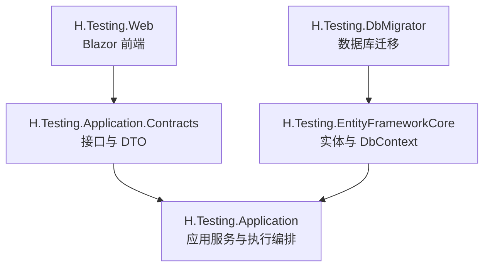
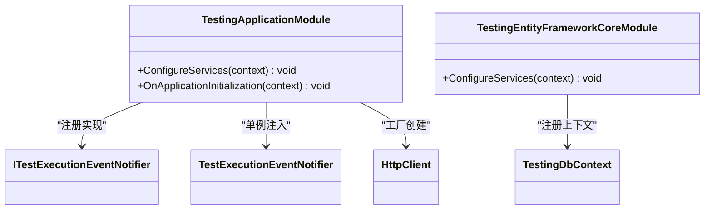
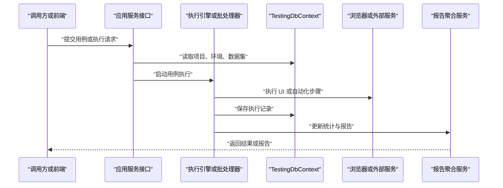
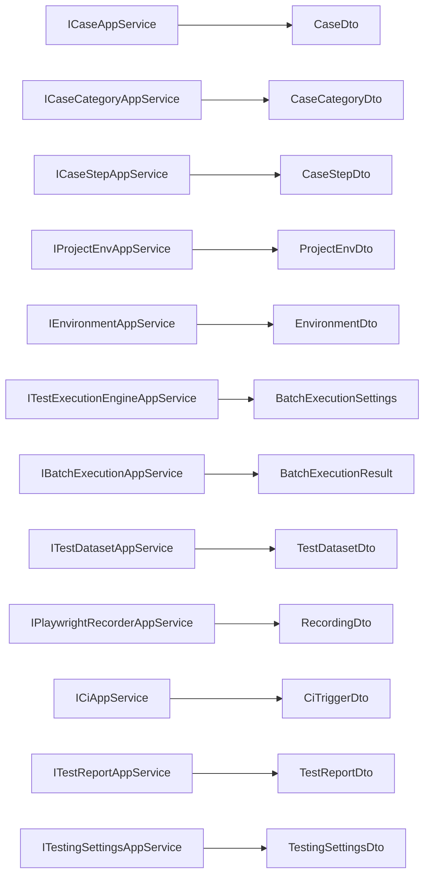
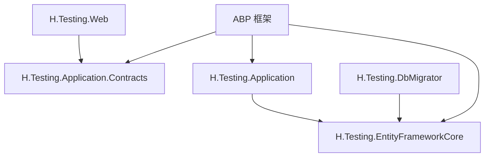
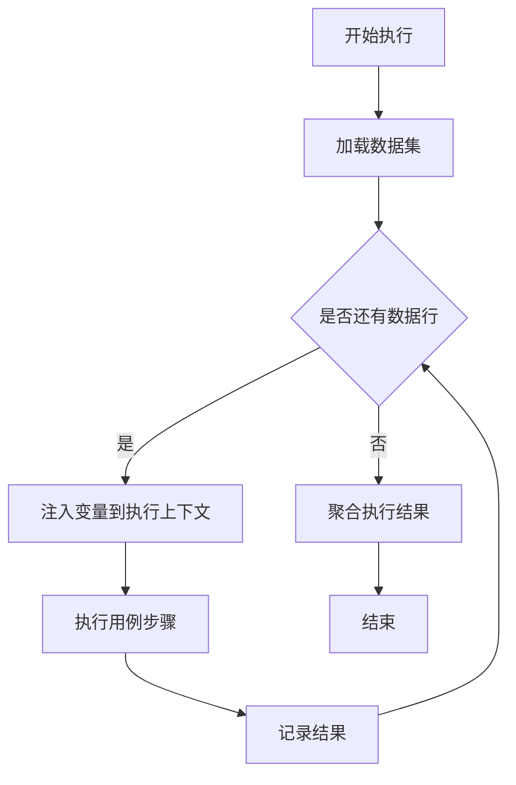
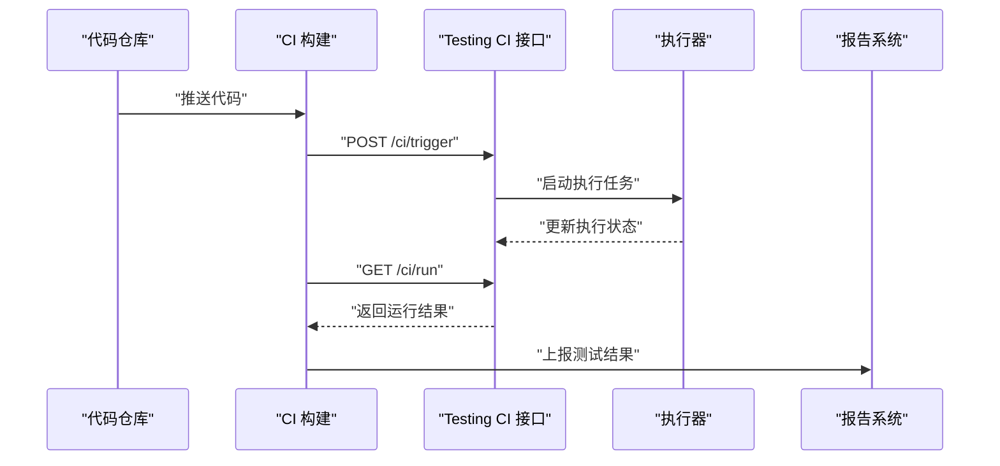
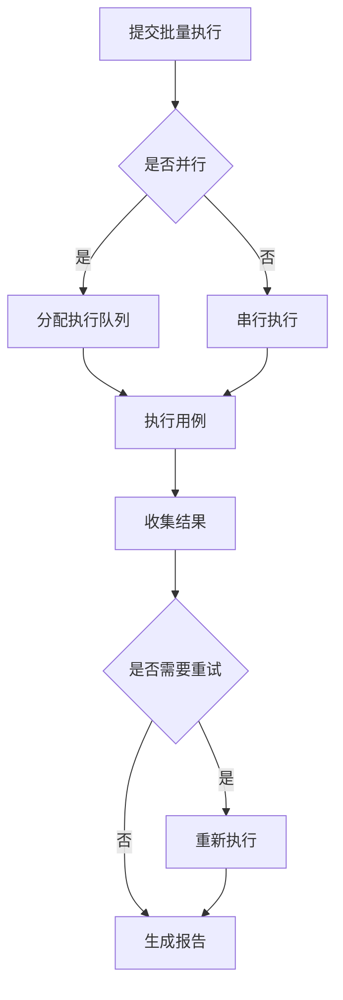

# Testing 测试框架 API

<cite>
**本文引用的文件**   
- [TestingApplicationModule.cs](file://src/Services/Testing/H.Testing.Application/TestingApplicationModule.cs)
- [TestingEntityFrameworkCoreModule.cs](file://src/Services/Testing/H.Testing.EntityFrameworkCore/TestingEntityFrameworkCoreModule.cs)
- [appsettings.json](file://src/Tools/H.Testing.DbMigrator/appsettings.json)
- [H.Testing.Web.csproj](file://src/Services/Testing/H.Testing.Web/H.Testing.Web.csproj)
- [CaseDto.cs](file://src/Services/Testing/H.Testing.Application.Contracts/Dtos/Cases/CaseDto.cs)
- [CaseStepDto.cs](file://src/Services/Testing/H.Testing.Application.Contracts/Dtos/Cases/CaseStepDto.cs)
- [CaseCategoryDto.cs](file://src/Services/Testing/H.Testing.Application.Contracts/Dtos/Cases/CaseCategoryDto.cs)
- [ProjectServiceDto.cs](file://src/Services/Testing/H.Testing.Application.Contracts/Dtos/ProjectServiceDto.cs)
- [ProjectEnvDto.cs](file://src/Services/Testing/H.Testing.Application.Contracts/Dtos/ProjectEnvDto.cs)
- [EnvironmentDto.cs](file://src/Services/Testing/H.Testing.Application.Contracts/Dtos/Execution/EnvironmentDto.cs)
- [TestReportDtos.cs](file://src/Services/Testing/H.Testing.Application.Contracts/Dtos/Execution/TestReportDtos.cs)
- [ExecutionAndBatchDtos.cs](file://src/Services/Testing/H.Testing.Application.Contracts/Dtos/Execution/ExecutionAndBatchDtos.cs)
- [CiDtos.cs](file://src/Services/Testing/H.Testing.Application.Contracts/Dtos/Execution/CiDtos.cs)
- [PerformanceTestSettingsDto.cs](file://src/Services/Testing/H.Testing.Application.Contracts/Dtos/Execution/PerformanceTestSettingsDto.cs)
- [RecordingDto.cs](file://src/Services/Testing/H.Testing.Application.Contracts/Dtos/Execution/RecordingDto.cs)
- [TestDatasetDto.cs](file://src/Services/Testing/H.Testing.Application.Contracts/Dtos/Execution/TestDatasetDto.cs)
- [TestingSettingsDto.cs](file://src/Services/Testing/H.Testing.Application.Contracts/Dtos/TestingSettingsDto.cs)
- [ICaseAppService.cs](file://src/Services/Testing/H.Testing.Application.Contracts/services/Cases/ICaseAppService.cs)
- [ICaseCategoryAppService.cs](file://src/Services/Testing/H.Testing.Application.Contracts/services/Cases/ICaseCategoryAppService.cs)
- [ICaseStepAppService.cs](file://src/Services/Testing/H.Testing.Application.Contracts/services/Cases/ICaseStepAppService.cs)
- [IProjectAppService.cs](file://src/Services/Testing/H.Testing.Application.Contracts/services/IProjectAppService.cs)
- [IProjectEnvAppService.cs](file://src/Services/Testing/H.Testing.Application.Contracts/services/IProjectEnvAppService.cs)
- [IEnvironmentAppService.cs](file://src/Services/Testing/H.Testing.Application.Contracts/services/IEnvironmentAppService.cs)
- [ITestExecutionEngineAppService.cs](file://src/Services/Testing/H.Testing.Application.Contracts/services/Execution/ITestExecutionEngineAppService.cs)
- [IBatchExecutionAppService.cs](file://src/Services/Testing/H.Testing.Application.Contracts/services/Execution/IBatchExecutionAppService.cs)
- [ITestDatasetAppService.cs](file://src/Services/Testing/H.Testing.Application.Contracts/services/Execution/ITestDatasetAppService.cs)
- [IPlaywrightRecorderAppService.cs](file://src/Services/Testing/H.Testing.Application.Contracts/services/Execution/IPlaywrightRecorderAppService.cs)
- [ICiAppService.cs](file://src/Services/Testing/H.Testing.Application.Contracts/services/Execution/ICiAppService.cs)
- [ITestReportAppService.cs](file://src/Services/Testing/H.Testing.Application.Contracts/services/Record/ITestReportAppService.cs)
- [IExecutionRecordAppService.cs](file://src/Services/Testing/H.Testing.Application.Contracts/services/Record/IExecutionRecordAppService.cs)
- [ITestingSettingsAppService.cs](file://src/Services/Testing/H.Testing.Application.Contracts/services/ITestingSettingsAppService.cs)
</cite>

## 目录

1. [简介](#简介)
2. [项目结构](#项目结构)
3. [核心组件](#核心组件)
4. [架构总览](#架构总览)
5. [接口总览与规范](#接口总览与规范)
6. [详细接口文档](#详细接口文档)
7. [依赖关系分析](#依赖关系分析)
8. [扩展机制与自定义测试类型](#扩展机制与自定义测试类型)
9. [CI/CD 集成方案](#cicd-集成方案)
10. [性能优化与并行执行最佳实践](#性能优化与并行执行最佳实践)
11. [故障排查指南](#故障排查指南)
12. [结论](#结论)

## 简介

Testing 服务是平台内统一的测试能力中心，覆盖用例管理、环境配置、数据驱动执行、浏览器录制回放、批量与 CI 触发、执行记录与报告统计等场景。它基于 ABP 模块化架构，按 Application.Contracts、Application、EntityFrameworkCore、Web 分层组织，并通过 Blazor Web 前端提供可视化操作界面。

本 API 文档面向后端使用者、前端集成方和 CI/CD 流水线调用方，重点说明：

- 测试用例、分类、步骤、数据集、项目与服务定义的管理接口。
- 单元测试、UI/自动化测试、批量执行与性能测试的执行接口。
- 测试结果查看、测试报告聚合、CI 轮询接口。
- 测试环境、环境变量、服务端点、浏览器设置等运行期配置接口。
- 如何扩展自定义测试类型、如何接入外部 CI 系统。

## 项目结构

Testing 服务位于 `src/Services/Testing`，主要包含以下工程：

| 工程 | 职责 |
|---|---|
| `H.Testing.Application.Contracts` | 对外暴露的应用服务接口、DTO、枚举与模块标记类 |
| `H.Testing.Application` | 应用层业务编排、执行引擎协调、CI 任务调度、结果聚合 |
| `H.Testing.EntityFrameworkCore` | 领域实体、DbContext、EF Core 配置与迁移 |
| `H.Testing.Web` | Blazor 前端页面与组件 |
| `H.Testing.DbMigrator` | 独立数据库迁移工具 |

**图示来源**   
- [TestingApplicationModule.cs:1-31](file://src/Services/Testing/H.Testing.Application/TestingApplicationModule.cs#L1-L31)
- [TestingEntityFrameworkCoreModule.cs:1-31](file://src/Services/Testing/H.Testing.EntityFrameworkCore/TestingEntityFrameworkCoreModule.cs#L1-L31)
- [H.Testing.Web.csproj:1-15](file://src/Services/Testing/H.Testing.Web/H.Testing.Web.csproj#L1-L15)
- [appsettings.json:1-5](file://src/Tools/H.Testing.DbMigrator/appsettings.json#L1-L5)

### 分层约定

- **契约层**：所有 HTTP 请求响应模型、应用服务接口、枚举均定义在 `H.Testing.Application.Contracts`。
- **应用层**：实现具体业务逻辑，协调数据库、HTTP 客户端、浏览器执行、CI 任务。
- **持久化层**：通过 EF Core 将项目、用例、步骤、执行记录、环境、设置等写入 SQL Server。
- **Web 层**：使用 Blazor 页面展示用例编辑、执行历史、测试计划、缺陷、数据集、测试报告等界面。

**章节来源**   
- [TestingApplicationModule.cs:1-31](file://src/Services/Testing/H.Testing.Application/TestingApplicationModule.cs#L1-L31)
- [TestingEntityFrameworkCoreModule.cs:1-31](file://src/Services/Testing/H.Testing.EntityFrameworkCore/TestingEntityFrameworkCoreModule.cs#L1-L31)
- [H.Testing.Web.csproj:1-15](file://src/Services/Testing/H.Testing.Web/H.Testing.Web.csproj#L1-L15)

## 核心组件

### 应用模块与依赖注入

`TestingApplicationModule` 注册测试执行事件通知器，并启用 `HttpClient`；`TestingEntityFrameworkCoreModule` 注册 `TestingDbContext`、SQL Server 连接与连接字符串 `TestingDb`。

**图示来源**   
- [TestingApplicationModule.cs:1-31](file://src/Services/Testing/H.Testing.Application/TestingApplicationModule.cs#L1-L31)
- [TestingEntityFrameworkCoreModule.cs:1-31](file://src/Services/Testing/H.Testing.EntityFrameworkCore/TestingEntityFrameworkCoreModule.cs#L1-L31)

### 核心领域模型

| 模型 | 用途 | 关键字段 |
|---|---|---|
| `CaseDto` | 测试用例主对象 | Id、Name、ProjectId、CategoryId、Level、Status、LastExecutionResult、DatasetIds |
| `CaseStepDto` | 用例步骤 | Type、Parameters、ApiConfig、UiConfig、ScriptConfig |
| `CaseCategoryDto` | 用例分类树 | Name、ProjectId、ParentId、Childrens |
| `ProjectServiceDto` | 项目级服务定义 | Name、Description、ProjectId |
| `ProjectEnvDto` | 项目环境 | Name、Type、Variables、Headers、EnvironmentServiceConfigs |
| `EnvironmentDto` | 通用测试环境 | Config、ServiceEndpoints、Order |
| `TestDatasetDto` | 数据驱动数据集 | Rows、Columns、RowCount |
| `TestReportDto` | 测试报告聚合 | Overview、DailyTrend、TopFailedCases、EnvironmentStats |
| `BatchExecutionResult` | 批量执行结果 | BatchId、Status、ExecutionRecords、Errors |
| `CiTriggerDto` / `CiRunDto` | CI 触发与轮询 | Token、ProjectId、EnvId、CaseIds、Status、CaseResults |

**章节来源**   
- [CaseDto.cs:1-84](file://src/Services/Testing/H.Testing.Application.Contracts/Dtos/Cases/CaseDto.cs#L1-L84)
- [CaseStepDto.cs:1-222](file://src/Services/Testing/H.Testing.Application.Contracts/Dtos/Cases/CaseStepDto.cs#L1-L222)
- [CaseCategoryDto.cs:1-22](file://src/Services/Testing/H.Testing.Application.Contracts/Dtos/Cases/CaseCategoryDto.cs#L1-L22)
- [ProjectServiceDto.cs:1-27](file://src/Services/Testing/H.Testing.Application.Contracts/Dtos/ProjectServiceDto.cs#L1-L27)
- [ProjectEnvDto.cs:1-70](file://src/Services/Testing/H.Testing.Application.Contracts/Dtos/ProjectEnvDto.cs#L1-L70)
- [EnvironmentDto.cs:1-36](file://src/Services/Testing/H.Testing.Application.Contracts/Dtos/Execution/EnvironmentDto.cs#L1-L36)
- [TestDatasetDto.cs:1-29](file://src/Services/Testing/H.Testing.Application.Contracts/Dtos/Execution/TestDatasetDto.cs#L1-L29)
- [TestReportDtos.cs:1-88](file://src/Services/Testing/H.Testing.Application.Contracts/Dtos/Execution/TestReportDtos.cs#L1-L88)
- [ExecutionAndBatchDtos.cs:1-93](file://src/Services/Testing/H.Testing.Application.Contracts/Dtos/Execution/ExecutionAndBatchDtos.cs#L1-L93)
- [CiDtos.cs:1-78](file://src/Services/Testing/H.Testing.Application.Contracts/Dtos/Execution/CiDtos.cs#L1-L78)

## 架构总览

Testing 服务的典型调用链如下：

该流程体现：

- 应用服务负责参数校验、权限判断、事务边界。
- 执行引擎负责实际运行测试步骤。
- 数据库负责持久化用例、环境、执行记录、报告维度数据。
- 浏览器或外部接口作为被测目标参与执行。

**图示来源**   
- [TestingApplicationModule.cs:1-31](file://src/Services/Testing/H.Testing.Application/TestingApplicationModule.cs#L1-L31)
- [TestingEntityFrameworkCoreModule.cs:1-31](file://src/Services/Testing/H.Testing.EntityFrameworkCore/TestingEntityFrameworkCoreModule.cs#L1-L31)

## 接口总览与规范

### 统一路由约定

项目采用 ABP 风格的应用服务接口。根据前端代理与 ABP 约定，常见映射为：

| 方法命名模式 | HTTP 方法 | URL 路径示例 |
|---|---:|---|
| `GetXxx` | GET | `/api/testing/{serviceName}/getXxx` |
| `CreateXxx` | POST | `/api/testing/{serviceName}/createXxx` |
| `UpdateXxx` | PUT | `/api/testing/{serviceName}/updateXxx` |
| `DeleteXxx` | DELETE | `/api/testing/{serviceName}/deleteXxx` |
| `ListXxx` / `GetAllXxx` | GET | `/api/testing/{serviceName}/listXxx` |
| `ExecuteXxx` | POST | `/api/testing/{serviceName}/executeXxx` |

其中 `{serviceName}` 对应应用服务接口名，例如 `case`、`caseCategory`、`caseStep`、`project`、`projectEnv`、`environment`、`testExecutionEngine`、`batchExecution`、`testDataset`、`playwrightRecorder`、`ci`、`testReport`、`executionRecord`、`testingSettings`。

### 通用请求与响应

- **成功响应**：通常为 `BaseOutput<T>` 包装结构（由公共 Utils 提供），包含状态码、数据和错误信息。
- **失败响应**：返回验证错误、业务异常、执行异常或网络异常信息。
- **分页接口**：通常接受页码、每页数量、排序字段等参数，返回分页结果。
- **认证**：取决于宿主系统的鉴权策略；CI 触发使用 Token 校验。

由于具体控制器路由由 ABP 自动生成，API 文档以“应用服务接口 + DTO”作为权威契约来源。

**章节来源**   
- [README.md:1-73](file://README.md#L1-L73)

## 详细接口文档

### 一、测试用例管理接口

#### 1. 用例分类接口

| 接口 | HTTP 方法 | 路径 | 说明 |
|---|---:|---|---|
| 获取分类列表 | GET | `/api/testing/caseCategory/list` | 返回项目下的分类树 |
| 新增分类 | POST | `/api/testing/caseCategory/create` | 创建分类节点 |
| 修改分类 | PUT | `/api/testing/caseCategory/update` | 更新分类名称、顺序、父级 |
| 删除分类 | DELETE | `/api/testing/caseCategory/delete` | 删除分类节点 |

**请求体**：`CaseCategoryDto`

| 字段 | 类型 | 必填 | 说明 |
|---|---|---:|---|
| Id | long | 否 | 编辑时传入 |
| Name | string | 是 | 分类名称 |
| ProjectId | long | 是 | 所属项目 |
| ParentId | long? | 否 | 父分类 ID |
| Order | int | 否 | 排序值 |
| Childrens | CaseCategoryDto[] | 否 | 子分类 |

**响应体**：`BaseOutput<CaseCategoryDto>` 或 `BaseOutput<List<CaseCategoryDto>>`

**章节来源**   
- [CaseCategoryDto.cs:1-22](file://src/Services/Testing/H.Testing.Application.Contracts/Dtos/Cases/CaseCategoryDto.cs#L1-L22)
- [ICaseCategoryAppService.cs](file://src/Services/Testing/H.Testing.Application.Contracts/services/Cases/ICaseCategoryAppService.cs)

#### 2. 用例基础信息接口

| 接口 | HTTP 方法 | 路径 | 说明 |
|---|---:|---|---|
| 获取用例列表 | GET | `/api/testing/case/list` | 支持按项目、分类、状态筛选 |
| 获取用例详情 | GET | `/api/testing/case/get` | 查询单个用例 |
| 创建用例 | POST | `/api/testing/case/create` | 新建用例 |
| 更新用例 | PUT | `/api/testing/case/update` | 修改用例基本信息 |
| 删除用例 | DELETE | `/api/testing/case/delete` | 删除用例 |
| 导入用例 | POST | `/api/testing/case/import` | 从文件或 JSON 导入 |
| 导出用例 | GET | `/api/testing/case/export` | 导出当前筛选结果 |

**请求体**：`CaseDto`

| 字段 | 类型 | 必填 | 说明 |
|---|---|---:|---|
| Id | long | 否 | 编辑时传入 |
| Name | string | 是 | 用例名称，最大 50 |
| Description | string | 否 | 描述，最大 200 |
| ProjectId | long | 是 | 所属项目 |
| CategoryId | long? | 否 | 所属分类 |
| IsTemplate | bool | 否 | 是否模板 |
| TemplateId | long? | 否 | 模板来源 |
| Level | CaseLevel | 否 | P0~P3 |
| Order | int | 否 | 排序 |
| Status | CaseStatus | 否 | Active、Inactive、Archived、Draft |
| LastExecutionResult | ExecutionStatus? | 否 | 最近一次执行结果 |
| LastExecutionTime | DateTime? | 否 | 最近执行时间 |
| DatasetIds | List<long> | 否 | 数据驱动关联的数据集 |

**响应体**：`BaseOutput<CaseDto>` 或 `BaseOutput<List<CaseDto>>`

**章节来源**   
- [CaseDto.cs:1-84](file://src/Services/Testing/H.Testing.Application.Contracts/Dtos/Cases/CaseDto.cs#L1-L84)
- [ICaseAppService.cs](file://src/Services/Testing/H.Testing.Application.Contracts/services/Cases/ICaseAppService.cs)

#### 3. 用例步骤接口

| 接口 | HTTP 方法 | 路径 | 说明 |
|---|---:|---|---|
| 获取步骤列表 | GET | `/api/testing/caseStep/list` | 按用例查询步骤 |
| 新增步骤 | POST | `/api/testing/caseStep/create` | 添加步骤 |
| 更新步骤 | PUT | `/api/testing/caseStep/update` | 修改步骤配置 |
| 删除步骤 | DELETE | `/api/testing/caseStep/delete` | 删除步骤 |
| 调整顺序 | PUT | `/api/testing/caseStep/sort` | 批量调整步骤顺序 |

**请求体**：`CaseStepDto`

| 字段 | 类型 | 必填 | 说明 |
|---|---|---:|---|
| Id | string | 否 | 步骤唯一标识 |
| Name | string | 是 | 步骤名称 |
| Type | StepTypeEnum | 是 | Api、Ui、App、Desktop、Script |
| Parameters | Dictionary<string, object> | 否 | 通用参数 |
| ExpectedResult | string | 否 | 预期结果 |
| Order | int | 否 | 顺序 |
| IsEnabled | bool | 否 | 是否启用 |
| ApiConfig | ApiStepConfig? | 条件必填 | API 步骤配置 |
| UiConfig | UiStepConfig? | 条件必填 | UI 步骤配置 |
| ScriptConfig | ScriptStepConfig? | 条件必填 | 脚本步骤配置 |

**步骤类型枚举**：

| 值 | 含义 |
|---|---|
| Unknown | 未知 |
| Api | API 调用 |
| Ui | 页面交互 |
| App | 应用交互 |
| Desktop | 桌面自动化 |
| Script | 脚本执行 |

**章节来源**   
- [CaseStepDto.cs:1-222](file://src/Services/Testing/H.Testing.Application.Contracts/Dtos/Cases/CaseStepDto.cs#L1-L222)
- [ICaseStepAppService.cs](file://src/Services/Testing/H.Testing.Application.Contracts/services/Cases/ICaseStepAppService.cs)

### 二、测试执行接口

#### 1. 单用例执行接口

| 接口 | HTTP 方法 | 路径 | 说明 |
|---|---:|---|---|
| 执行用例 | POST | `/api/testing/testExecutionEngine/execute` | 执行单个用例 |
| 暂停执行 | POST | `/api/testing/testExecutionEngine/cancel` | 取消正在执行的用例 |
| 查询执行状态 | GET | `/api/testing/testExecutionEngine/status` | 轮询执行进度 |

**请求体**：可复用 `BatchExecutionSettings`，但只包含一个用例 ID。

**响应体**：`BaseOutput<CaseExecutionRecordDto>`

**章节来源**   
- [ITestExecutionEngineAppService.cs](file://src/Services/Testing/H.Testing.Application.Contracts/services/Execution/ITestExecutionEngineAppService.cs)
- [ExecutionAndBatchDtos.cs:1-93](file://src/Services/Testing/H.Testing.Application.Contracts/Dtos/Execution/ExecutionAndBatchDtos.cs#L1-L93)

#### 2. 批量执行接口

| 接口 | HTTP 方法 | 路径 | 说明 |
|---|---:|---|---|
| 提交批量执行 | POST | `/api/testing/batchExecution/run` | 提交多个用例执行 |
| 查询批次结果 | GET | `/api/testing/batchExecution/result` | 根据 BatchId 查询 |
| 取消批次 | POST | `/api/testing/batchExecution/cancel` | 停止未完成的批次 |

**请求体**：`BatchExecutionSettings`

| 字段 | 类型 | 必填 | 说明 |
|---|---|---:|---|
| SelectedTestCaseIds | List<long> | 是 | 选中的用例 ID |
| EnvironmentId | long | 是 | 执行环境 |
| IsParallelExecution | bool | 否 | 是否并行 |
| ContinueOnFailure | bool | 否 | 失败是否继续 |
| RetryCount | int | 否 | 重试次数 |
| DatasetId | long? | 否 | 数据驱动数据集 |
| Browsers | List<string> | 否 | 浏览器列表 |
| Headless | bool | 否 | 无头模式 |
| PerformanceSettings | PerformanceTestSettingsDto | 否 | 性能测试参数 |

**响应体**：`BaseOutput<BatchExecutionResult>`

**章节来源**   
- [IBatchExecutionAppService.cs](file://src/Services/Testing/H.Testing.Application.Contracts/services/Execution/IBatchExecutionAppService.cs)
- [ExecutionAndBatchDtos.cs:1-93](file://src/Services/Testing/H.Testing.Application.Contracts/Dtos/Execution/ExecutionAndBatchDtos.cs#L1-L93)
- [PerformanceTestSettingsDto.cs:1-96](file://src/Services/Testing/H.Testing.Application.Contracts/Dtos/Execution/PerformanceTestSettingsDto.cs#L1-L96)

#### 3. Playwright 录制接口

| 接口 | HTTP 方法 | 路径 | 说明 |
|---|---:|---|---|
| 开始录制 | POST | `/api/testing/playwrightRecorder/start` | 打开浏览器会话 |
| 停止录制 | POST | `/api/testing/playwrightRecorder/stop` | 生成录制代码 |
| 解析录制代码 | POST | `/api/testing/playwrightRecorder/parse` | 转换为用例步骤 |
| 查询录制状态 | GET | `/api/testing/playwrightRecorder/status` | 是否正在录制 |

**请求体**：

- 开始录制：`StartRecordingRequest`
- 停止录制：`StopRecordingRequest`
- 解析录制：`ParseRecordingRequest`

**响应体**：

- 开始录制：`StartRecordingResponse`
- 停止录制：`StopRecordingResponse`
- 解析录制：`ParseRecordingResponse`
- 录制状态：`RecordingStatusResponse`

**章节来源**   
- [IPlaywrightRecorderAppService.cs](file://src/Services/Testing/H.Testing.Application.Contracts/services/Execution/IPlaywrightRecorderAppService.cs)
- [RecordingDto.cs:1-46](file://src/Services/Testing/H.Testing.Application.Contracts/Dtos/Execution/RecordingDto.cs#L1-L46)

### 三、测试结果与报告接口

#### 1. 执行记录接口

| 接口 | HTTP 方法 | 路径 | 说明 |
|---|---:|---|---|
| 查询执行记录 | GET | `/api/testing/executionRecord/list` | 按项目、用例、环境、时间筛选 |
| 查询记录详情 | GET | `/api/testing/executionRecord/detail` | 查看单次执行日志 |
| 删除记录 | DELETE | `/api/testing/executionRecord/delete` | 清理历史执行记录 |

**响应体**：`BaseOutput<CaseExecutionRecordDto>` 或分页列表。

**章节来源**   
- [IExecutionRecordAppService.cs](file://src/Services/Testing/H.Testing.Application.Contracts/services/Record/IExecutionRecordAppService.cs)

#### 2. 测试报告接口

| 接口 | HTTP 方法 | 路径 | 说明 |
|---|---:|---|---|
| 获取测试报告 | GET | `/api/testing/testReport/get` | 返回项目维度报告 |
| 刷新报告 | POST | `/api/testing/testReport/refresh` | 重新聚合统计数据 |

**请求体**：`TestReportDto`

| 字段 | 类型 | 必填 | 说明 |
|---|---|---:|---|
| ProjectId | long | 是 | 项目 ID |
| Days | int | 否 | 统计天数范围 |

**响应体**：`BaseOutput<TestReportDto>`

**报告数据结构**：

| 字段 | 类型 | 说明 |
|---|---|---|
| Overview | ExecutionStatistics | 总体执行统计 |
| DailyTrend | List<DailyExecutionStat> | 每日趋势 |
| TopFailedCases | List<CaseFailureStat> | 失败最多的用例 |
| EnvironmentStats | List<EnvExecutionStat> | 按环境统计 |

**章节来源**   
- [ITestReportAppService.cs](file://src/Services/Testing/H.Testing.Application.Contracts/services/Record/ITestReportAppService.cs)
- [TestReportDtos.cs:1-88](file://src/Services/Testing/H.Testing.Application.Contracts/Dtos/Execution/TestReportDtos.cs#L1-L88)
- [ExecutionAndBatchDtos.cs:1-93](file://src/Services/Testing/H.Testing.Application.Contracts/Dtos/Execution/ExecutionAndBatchDtos.cs#L1-L93)

### 四、测试环境接口

#### 1. 项目环境接口

| 接口 | HTTP 方法 | 路径 | 说明 |
|---|---:|---|---|
| 获取环境列表 | GET | `/api/testing/projectEnv/list` | 按项目查询环境 |
| 新增环境 | POST | `/api/testing/projectEnv/create` | 创建开发、测试、预发、生产环境 |
| 更新环境 | PUT | `/api/testing/projectEnv/update` | 修改环境名称、变量、服务端点 |
| 删除环境 | DELETE | `/api/testing/projectEnv/delete` | 删除环境 |

**请求体**：`ProjectEnvDto`

| 字段 | 类型 | 必填 | 说明 |
|---|---|---:|---|
| Id | long | 否 | 编辑时传入 |
| Name | string | 是 | 环境名称 |
| Description | string | 否 | 描述 |
| ProjectId | long | 是 | 所属项目 |
| Type | EnvironmentType | 是 | Development、Testing、Staging、Production |
| Variables | Dictionary<string, string> | 否 | 环境变量 |
| Headers | Dictionary<string, string> | 否 | 默认请求头 |
| EnvironmentServiceConfigs | List<ProjectEnvConfigDto> | 否 | 环境服务配置 |

**章节来源**   
- [ProjectEnvDto.cs:1-70](file://src/Services/Testing/H.Testing.Application.Contracts/Dtos/ProjectEnvDto.cs#L1-L70)
- [IProjectEnvAppService.cs](file://src/Services/Testing/H.Testing.Application.Contracts/services/IProjectEnvAppService.cs)

#### 2. 通用测试环境接口

| 接口 | HTTP 方法 | 路径 | 说明 |
|---|---:|---|---|
| 获取环境列表 | GET | `/api/testing/environment/list` | 查询测试环境 |
| 新增环境 | POST | `/api/testing/environment/create` | 创建环境 |
| 更新环境 | PUT | `/api/testing/environment/update` | 更新配置 |
| 删除环境 | DELETE | `/api/testing/environment/delete` | 删除环境 |

**请求体**：`EnvironmentDto`

| 字段 | 类型 | 必填 | 说明 |
|---|---|---:|---|
| Id | long | 否 | 编辑时传入 |
| Name | string | 是 | 环境名称 |
| Description | string | 否 | 描述 |
| ProjectId | long | 是 | 所属项目 |
| Config | Dictionary<string, object> | 否 | 通用配置 |
| ServiceEndpoints | Dictionary<long, string> | 否 | 按服务 ID 的端点映射 |
| Order | int | 否 | 排序 |

**章节来源**   
- [EnvironmentDto.cs:1-36](file://src/Services/Testing/H.Testing.Application.Contracts/Dtos/Execution/EnvironmentDto.cs#L1-L36)
- [IEnvironmentAppService.cs](file://src/Services/Testing/H.Testing.Application.Contracts/services/IEnvironmentAppService.cs)

#### 3. 项目服务定义接口

| 接口 | HTTP 方法 | 路径 | 说明 |
|---|---:|---|---|
| 获取服务列表 | GET | `/api/testing/projectService/list` | 列出项目服务 |
| 新增服务 | POST | `/api/testing/projectService/create` | 登记被测服务 |
| 更新服务 | PUT | `/api/testing/projectService/update` | 修改服务信息 |
| 删除服务 | DELETE | `/api/testing/projectService/delete` | 删除服务定义 |

**请求体**：`ProjectServiceDto`

| 字段 | 类型 | 必填 | 说明 |
|---|---|---:|---|
| Id | long | 否 | 编辑时传入 |
| Name | string | 是 | 服务名称，最大 20 |
| Description | string | 否 | 描述，最大 100 |
| ProjectId | long | 是 | 所属项目 |
| CreationTime | DateTime | 否 | 创建时间 |

**章节来源**   
- [ProjectServiceDto.cs:1-27](file://src/Services/Testing/H.Testing.Application.Contracts/Dtos/ProjectServiceDto.cs#L1-L27)
- [IProjectAppService.cs](file://src/Services/Testing/H.Testing.Application.Contracts/services/IProjectAppService.cs)

### 五、数据集接口

| 接口 | HTTP 方法 | 路径 | 说明 |
|---|---:|---|---|
| 获取数据集列表 | GET | `/api/testing/testDataset/list` | 按项目查询 |
| 新增数据集 | POST | `/api/testing/testDataset/create` | 创建 CSV 或 JSON 数据行 |
| 更新数据集 | PUT | `/api/testing/testDataset/update` | 修改数据集 |
| 删除数据集 | DELETE | `/api/testing/testDataset/delete` | 删除数据集 |
| 导入 CSV | POST | `/api/testing/testDataset/importCsv` | 上传 CSV 解析为 Rows |
| 导出数据集 | GET | `/api/testing/testDataset/export` | 导出 Rows |

**请求体**：`TestDatasetDto`

| 字段 | 类型 | 必填 | 说明 |
|---|---|---:|---|
| Id | long | 否 | 编辑时传入 |
| ProjectId | long | 是 | 所属项目 |
| Name | string | 是 | 数据集名称 |
| Rows | List<Dictionary<string, string>> | 否 | 数据行 |
| Columns | List<string> | 否 | 列名 |
| RowCount | int | 否 | 行数 |
| CreationTime | DateTime | 否 | 创建时间 |

**章节来源**   
- [ITestDatasetAppService.cs](file://src/Services/Testing/H.Testing.Application.Contracts/services/Execution/ITestDatasetAppService.cs)
- [TestDatasetDto.cs:1-29](file://src/Services/Testing/H.Testing.Application.Contracts/Dtos/Execution/TestDatasetDto.cs#L1-L29)

### 六、全局测试设置接口

| 接口 | HTTP 方法 | 路径 | 说明 |
|---|---:|---|---|
| 获取测试设置 | GET | `/api/testing/testingSettings/get` | 读取全局设置 |
| 更新测试设置 | PUT | `/api/testing/testingSettings/update` | 修改浏览器路径等 |
| 检测可用浏览器 | GET | `/api/testing/testingSettings/detectBrowsers` | 自动发现本地浏览器 |
| 写入用户设置 | POST | `/api/testing/testingSettings/setUserValue` | 存储用户偏好 |

**请求体**：`TestingSettingsDto` 或 `SettingUserValueInput`

| 字段 | 类型 | 必填 | 说明 |
|---|---|---:|---|
| BrowserPath | string? | 否 | 浏览器可执行文件路径 |
| Name | string | 是 | 设置键名 |
| Value | string? | 否 | 设置值 |

**章节来源**   
- [ITestingSettingsAppService.cs](file://src/Services/Testing/H.Testing.Application.Contracts/services/ITestingSettingsAppService.cs)
- [TestingSettingsDto.cs:1-51](file://src/Services/Testing/H.Testing.Application.Contracts/Dtos/TestingSettingsDto.cs#L1-L51)

## 依赖关系分析

### 接口到 DTO 依赖

**图示来源**   
- [CaseDto.cs:1-84](file://src/Services/Testing/H.Testing.Application.Contracts/Dtos/Cases/CaseDto.cs#L1-L84)
- [CaseStepDto.cs:1-222](file://src/Services/Testing/H.Testing.Application.Contracts/Dtos/Cases/CaseStepDto.cs#L1-L222)
- [ProjectEnvDto.cs:1-70](file://src/Services/Testing/H.Testing.Application.Contracts/Dtos/ProjectEnvDto.cs#L1-L70)
- [EnvironmentDto.cs:1-36](file://src/Services/Testing/H.Testing.Application.Contracts/Dtos/Execution/EnvironmentDto.cs#L1-L36)
- [ExecutionAndBatchDtos.cs:1-93](file://src/Services/Testing/H.Testing.Application.Contracts/Dtos/Execution/ExecutionAndBatchDtos.cs#L1-L93)
- [TestDatasetDto.cs:1-29](file://src/Services/Testing/H.Testing.Application.Contracts/Dtos/Execution/TestDatasetDto.cs#L1-L29)
- [RecordingDto.cs:1-46](file://src/Services/Testing/H.Testing.Application.Contracts/Dtos/Execution/RecordingDto.cs#L1-L46)
- [CiDtos.cs:1-78](file://src/Services/Testing/H.Testing.Application.Contracts/Dtos/Execution/CiDtos.cs#L1-L78)
- [TestReportDtos.cs:1-88](file://src/Services/Testing/H.Testing.Application.Contracts/Dtos/Execution/TestReportDtos.cs#L1-L88)
- [TestingSettingsDto.cs:1-51](file://src/Services/Testing/H.Testing.Application.Contracts/Dtos/TestingSettingsDto.cs#L1-L51)

### 模块依赖

**图示来源**   
- [TestingApplicationModule.cs:1-31](file://src/Services/Testing/H.Testing.Application/TestingApplicationModule.cs#L1-L31)
- [TestingEntityFrameworkCoreModule.cs:1-31](file://src/Services/Testing/H.Testing.EntityFrameworkCore/TestingEntityFrameworkCoreModule.cs#L1-L31)
- [H.Testing.Web.csproj:1-15](file://src/Services/Testing/H.Testing.Web/H.Testing.Web.csproj#L1-L15)

**章节来源**   
- [TestingApplicationModule.cs:1-31](file://src/Services/Testing/H.Testing.Application/TestingApplicationModule.cs#L1-L31)
- [TestingEntityFrameworkCoreModule.cs:1-31](file://src/Services/Testing/H.Testing.EntityFrameworkCore/TestingEntityFrameworkCoreModule.cs#L1-L31)
- [H.Testing.Web.csproj:1-15](file://src/Services/Testing/H.Testing.Web/H.Testing.Web.csproj#L1-L15)

## 扩展机制与自定义测试类型

### 步骤类型扩展点

`StepTypeEnum` 定义了 Api、Ui、App、Desktop、Script 五种内置步骤类型。若需扩展：

1. 在契约层新增步骤类型枚举值。
2. 在 `CaseStepDto` 中新增对应配置类，例如 `CustomStepConfig`。
3. 在应用层执行引擎中增加对该类型的解析与执行逻辑。
4. 在前端新增对应的步骤编辑器与渲染组件。

### 测试框架扩展建议

| 扩展点 | 推荐方式 |
|---|---|
| 新增测试协议 | 新增 `StepTypeEnum` 与对应 `*StepConfig` |
| 新增断言规则 | 在 API 步骤断言结构中扩展 Type、Operator、Target |
| 新增认证方式 | 在 `AuthConfig` 中扩展 Type，如 OAuth2、JWT、签名 |
| 新增执行引擎 | 实现异步执行管道，支持串行、并行、重试、超时 |
| 新增报告维度 | 扩展 `TestReportDto` 及聚合服务 |

### 数据驱动扩展

`TestDatasetDto` 支持每行一个 `Dictionary<string, string>`，执行时可注入为变量，适合参数化测试。

**图示来源**   
- [TestDatasetDto.cs:1-29](file://src/Services/Testing/H.Testing.Application.Contracts/Dtos/Execution/TestDatasetDto.cs#L1-L29)
- [CaseStepDto.cs:1-222](file://src/Services/Testing/H.Testing.Application.Contracts/Dtos/Cases/CaseStepDto.cs#L1-L222)

**章节来源**   
- [CaseStepDto.cs:1-222](file://src/Services/Testing/H.Testing.Application.Contracts/Dtos/Cases/CaseStepDto.cs#L1-L222)
- [TestDatasetDto.cs:1-29](file://src/Services/Testing/H.Testing.Application.Contracts/Dtos/Execution/TestDatasetDto.cs#L1-L29)

## CI/CD 集成方案

### CI 触发接口

| 接口 | HTTP 方法 | 路径 | 说明 |
|---|---:|---|---|
| 触发 CI 执行 | POST | `/api/testing/ci/trigger` | 使用 Token 触发指定项目与环境执行 |
| 轮询 CI 结果 | GET | `/api/testing/ci/run` | 查询 CI 运行状态 |

**触发请求体**：`CiTriggerDto`

| 字段 | 类型 | 必填 | 说明 |
|---|---|---:|---|
| Token | string | 是 | 在设置页生成的接入令牌 |
| ProjectId | long | 是 | 项目 ID |
| EnvId | long | 是 | 环境 ID |
| CaseIds | List<long>? | 否 | 指定用例，为空则执行全部 |
| Browsers | List<string>? | 否 | 浏览器列表 |
| Headless | bool | 否 | CI 建议开启无头模式 |
| WebhookUrl | string? | 否 | 执行完成后回调地址 |

**轮询响应体**：`CiRunDto`

| 字段 | 类型 | 说明 |
|---|---|---|
| Id | long | CI 运行记录 ID |
| ProjectId | long | 项目 ID |
| EnvId | long | 环境 ID |
| Status | ExecutionStatus | Pending、Running、Success、Failed |
| TotalCases | int | 用例总数 |
| SuccessCases | int | 成功用例数 |
| FailedCases | int | 失败用例数 |
| StartTime | DateTime? | 开始时间 |
| EndTime | DateTime? | 结束时间 |
| ErrorMessage | string? | 错误信息 |
| CaseResults | List<CiRunCaseResult> | 各用例结果摘要 |

**章节来源**   
- [ICiAppService.cs](file://src/Services/Testing/H.Testing.Application.Contracts/services/Execution/ICiAppService.cs)
- [CiDtos.cs:1-78](file://src/Services/Testing/H.Testing.Application.Contracts/Dtos/Execution/CiDtos.cs#L1-L78)

### CI 工作流建议

- 在构建阶段运行单元测试。
- 在部署后阶段调用 CI 触发接口运行 UI/集成测试。
- 轮询 `CiRunDto.Status`，直到 Running 变为 Success 或 Failed。
- 将最终结果写入 CI 日志，并通过 Webhook 推送给外部系统。
- 对失败用例保留截图、日志、执行上下文。

**图示来源**   
- [CiDtos.cs:1-78](file://src/Services/Testing/H.Testing.Application.Contracts/Dtos/Execution/CiDtos.cs#L1-L78)

## 性能优化与并行执行最佳实践

### 并行执行

`BatchExecutionSettings.IsParallelExecution` 控制是否并行执行用例。建议：

- 小用例集合使用串行执行，避免资源竞争。
- 大集合使用并行执行，但限制并发度。
- 对共享资源敏感的用例强制串行。

### 性能测试参数

`PerformanceTestSettingsDto` 提供并发用户数、持续时间、爬坡时间、思考时间和最大错误率。

| 字段 | 类型 | 默认值 | 说明 |
|---|---|---:|---|
| ConcurrentUsers | int | 1 | 并发线程数 |
| DurationSeconds | int | 60 | 运行秒数 |
| RampUpSeconds | int | 10 | 爬坡时间 |
| ThinkTimeMs | int | 1000 | 每次请求等待毫秒 |
| MaxErrorRate | double | 10.0 | 最大错误率百分比 |

### 浏览器执行优化

- CI 环境优先使用无头模式。
- 多浏览器执行时使用队列，避免同时打开过多窗口。
- 合理设置步骤超时时间，避免阻塞。
- 使用数据集减少重复登录与初始化成本。

**图示来源**   
- [PerformanceTestSettingsDto.cs:1-96](file://src/Services/Testing/H.Testing.Application.Contracts/Dtos/Execution/PerformanceTestSettingsDto.cs#L1-L96)
- [ExecutionAndBatchDtos.cs:1-93](file://src/Services/Testing/H.Testing.Application.Contracts/Dtos/Execution/ExecutionAndBatchDtos.cs#L1-L93)

**章节来源**   
- [PerformanceTestSettingsDto.cs:1-96](file://src/Services/Testing/H.Testing.Application.Contracts/Dtos/Execution/PerformanceTestSettingsDto.cs#L1-L96)
- [ExecutionAndBatchDtos.cs:1-93](file://src/Services/Testing/H.Testing.Application.Contracts/Dtos/Execution/ExecutionAndBatchDtos.cs#L1-L93)

## 故障排查指南

### 数据库连接问题

常见问题包括连接字符串错误、SQL Server 不可达、迁移未执行。

排查步骤：

1. 检查 `appsettings.json` 中 `ConnectionStrings.TestingDb`。
2. 确认 SQL Server 已启动并可访问。
3. 运行 `H.Testing.DbMigrator` 完成表结构初始化。
4. 查看迁移文件是否覆盖最新模型变更。

**章节来源**   
- [appsettings.json:1-5](file://src/Tools/H.Testing.DbMigrator/appsettings.json#L1-L5)
- [TestingEntityFrameworkCoreModule.cs:1-31](file://src/Services/Testing/H.Testing.EntityFrameworkCore/TestingEntityFrameworkCoreModule.cs#L1-L31)

### 浏览器无法启动

常见问题包括浏览器路径缺失、权限不足、无头模式不支持。

排查步骤：

1. 使用 `detectBrowsers` 接口检测本地浏览器。
2. 通过 `TestingSettingsDto.BrowserPath` 指定浏览器路径。
3. 在 CI 环境中启用无头模式。
4. 检查 Playwright 相关依赖是否安装。

**章节来源**   
- [TestingSettingsDto.cs:1-51](file://src/Services/Testing/H.Testing.Application.Contracts/Dtos/TestingSettingsDto.cs#L1-L51)
- [RecordingDto.cs:1-46](file://src/Services/Testing/H.Testing.Application.Contracts/Dtos/Execution/RecordingDto.cs#L1-L46)

### 执行超时或失败

常见问题包括接口超时、浏览器操作失败、断言不通过。

排查步骤：

1. 查看 `CaseStepDto` 中每个步骤的超时配置。
2. 检查 API 步骤的请求头、Body、认证配置。
3. 检查 UI 步骤的选择器是否正确。
4. 查看执行记录中的错误消息。
5. 降低并发或关闭并行执行定位问题。

**章节来源**   
- [CaseStepDto.cs:1-222](file://src/Services/Testing/H.Testing.Application.Contracts/Dtos/Cases/CaseStepDto.cs#L1-L222)
- [ExecutionAndBatchDtos.cs:1-93](file://src/Services/Testing/H.Testing.Application.Contracts/Dtos/Execution/ExecutionAndBatchDtos.cs#L1-L93)

### CI 触发失败

常见问题包括 Token 无效、项目或环境不存在、用例为空。

排查步骤：

1. 确认 `CiTriggerDto.Token` 正确。
2. 确认 `ProjectId` 和 `EnvId` 存在。
3. 首次可不传 `CaseIds`，让系统执行全部用例。
4. 轮询 `CiRunDto.Status`，关注 `ErrorMessage`。

**章节来源**   
- [CiDtos.cs:1-78](file://src/Services/Testing/H.Testing.Application.Contracts/Dtos/Execution/CiDtos.cs#L1-L78)

## 结论

Testing 测试框架提供了从用例建模、环境配置、数据驱动执行到批量执行、CI 触发、结果报告和性能测试的完整闭环。其核心价值在于：

- 通过 ABP 模块化架构清晰划分契约、应用、持久化与前端。
- 以 `CaseStepDto` 为核心扩展多种测试类型。
- 通过 `BatchExecutionSettings` 和 `PerformanceTestSettingsDto` 支持并行、重试和数据驱动。
- 通过 `CiTriggerDto` 和 `CiRunDto` 对接外部 CI/CD。
- 通过 `TestReportDto` 提供项目级质量趋势视图。

在实际使用中，建议优先完善项目、服务、环境和数据集配置，再逐步引入 UI 自动化、性能测试和 CI 集成。对于大规模执行，应结合并行策略、超时控制和失败重试，确保执行稳定且可观测。