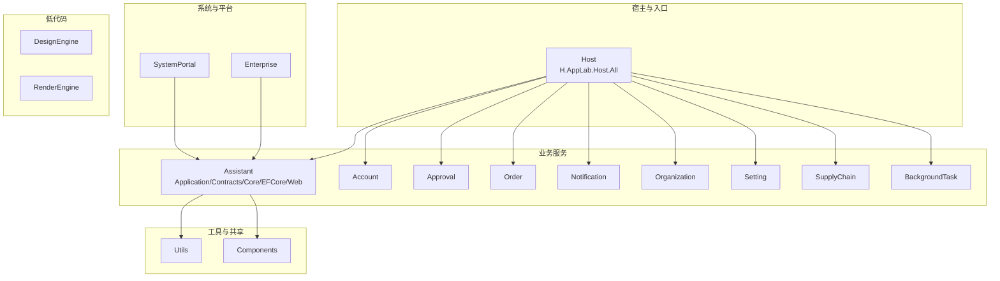
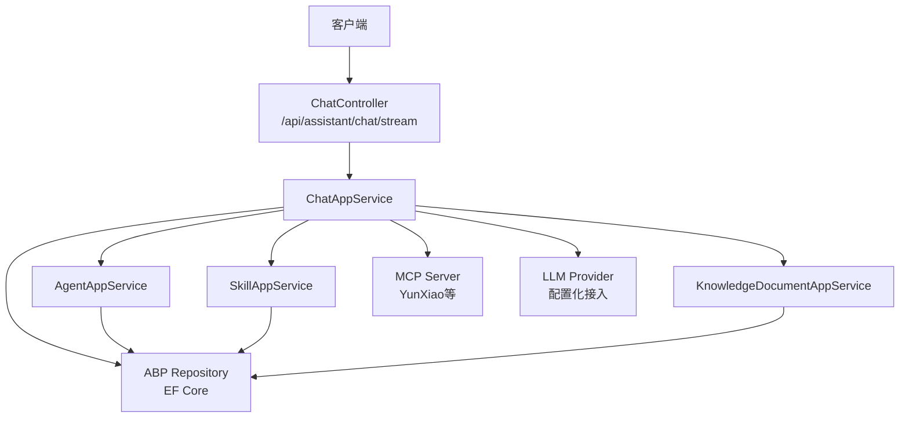
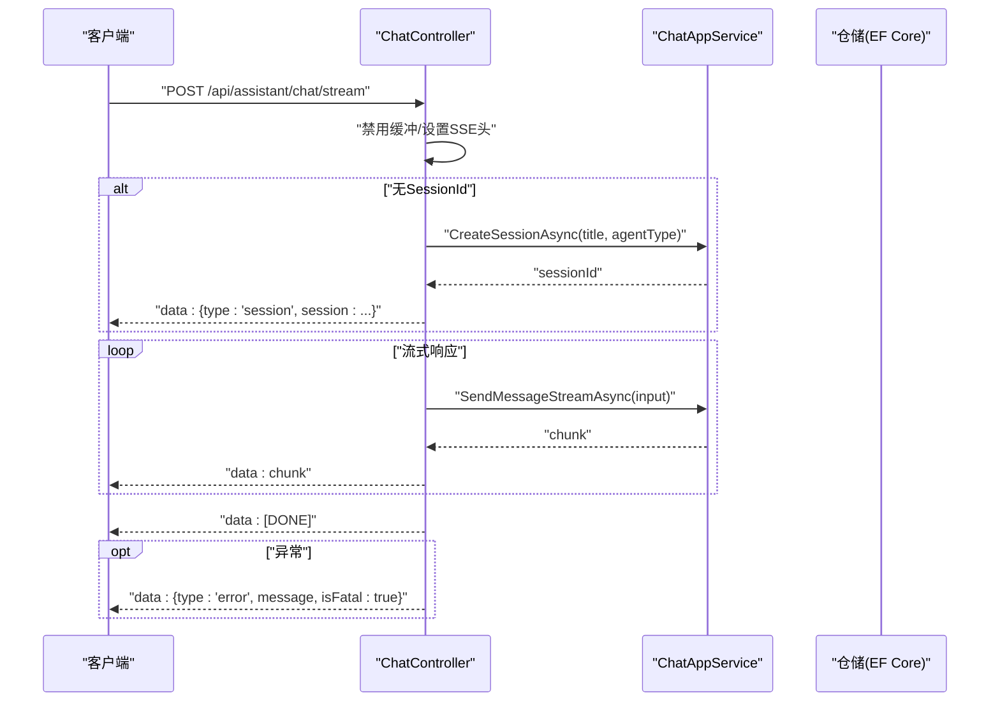
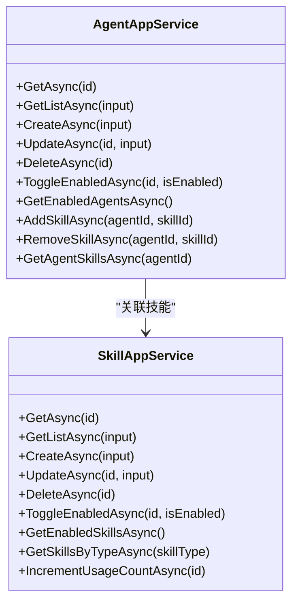
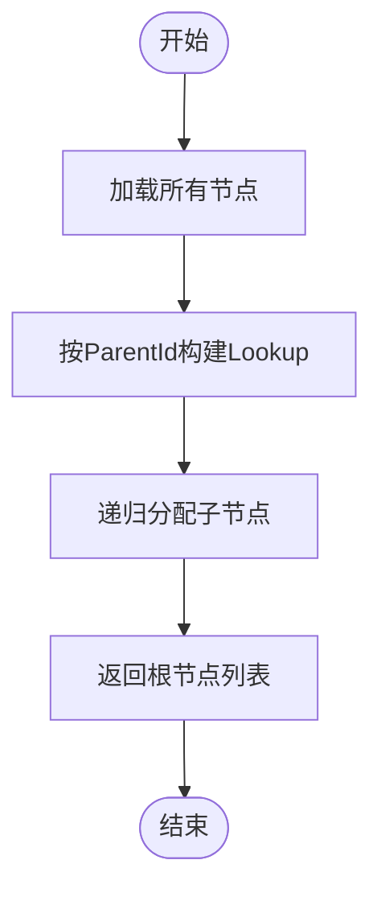
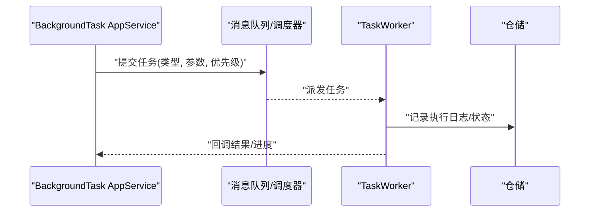
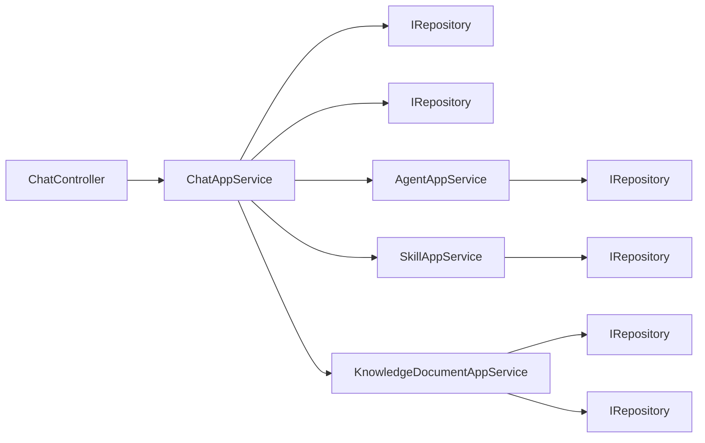

# AI助手API

<cite>
**本文引用的文件**   
- [README.md](file://README.md)
- [ChatController.cs](file://src/Agent/Assistant/H.Assistant.Application/Controllers/ChatController.cs)
- [ChatAppService.cs](file://src/Agent/Assistant/H.Assistant.Application/Services/ChatAppService.cs)
- [AgentAppService.cs](file://src/Agent/Assistant/H.Assistant.Application/Services/AgentAppService.cs)
- [SkillAppService.cs](file://src/Agent/Assistant/H.Assistant.Application/Services/SkillAppService.cs)
- [KnowledgeDocumentAppService.cs](file://src/Agent/Assistant/H.Assistant.Application/Services/KnowledgeDocumentAppService.cs)
</cite>

## 目录
1. [简介](#简介)
2. [项目结构](#项目结构)
3. [核心组件](#核心组件)
4. [架构总览](#架构总览)
5. [详细组件分析](#详细组件分析)
6. [依赖关系分析](#依赖关系分析)
7. [性能考虑](#性能考虑)
8. [故障排查指南](#故障排查指南)
9. [结论](#结论)
10. [附录：接口规范与示例](#附录接口规范与示例)

## 简介
本文件为AI助手服务的API文档，覆盖对话管理、知识库管理、技能管理、任务调度等核心能力，并说明MCP协议集成、LLM提供商接入、工具函数调用等功能的API规范。重点包含流式响应（SSE）、事件处理、会话管理等实时通信接口，以及多模态输入处理与智能体编排的实现方式。

## 项目结构
- 宿主与应用分层
  - Host：宿主程序，负责服务注册与启动，支持单体与按服务独立部署。
  - Services：按限界上下文划分的业务模块，遵循 Application.Contracts / Application / EntityFrameworkCore / Web 分层。
  - Components：共享UI组件（如应用抽屉）。
  - LowCode：低代码设计/渲染引擎及元数据。
  - System：系统级应用（Enterprise、SystemPortal）。
  - Tools：数据库迁移工具。
  - Utils：通用工具库（ABP契约、HTTP动态代理、Blazor工具、ID生成等）。

- 与AI助手相关的模块
  - Agent/Assistant：包含应用层控制器与服务、实体框架持久化、桌面/Web客户端、MCP服务器扩展等。

图表来源 
- [README.md:1-74](file://README.md#L1-L74)

章节来源
- [README.md:1-74](file://README.md#L1-L74)

## 核心组件
- 聊天与会话
  - ChatController：提供SSE流式响应的聊天接口，自动创建会话、推送事件与结束标记。
  - ChatAppService：会话CRUD、消息追加、历史查询等。
- 智能体与技能
  - AgentAppService：智能体定义、启用状态、参数配置、技能绑定等。
  - SkillAppService：技能定义CRUD、类型过滤、启用状态、使用统计等。
- 知识库
  - KnowledgeDocumentAppService：节点树构建、文档内容读写、类型切换与级联删除。
- 任务调度
  - 通过BackgroundTask服务与Worker进行异步任务编排（详见“任务调度”章节）。

章节来源
- [ChatController.cs:1-79](file://src/Agent/Assistant/H.Assistant.Application/Controllers/ChatController.cs#L1-L79)
- [ChatAppService.cs:1-129](file://src/Agent/Assistant/H.Assistant.Application/Services/ChatAppService.cs#L1-L129)
- [AgentAppService.cs:1-237](file://src/Agent/Assistant/H.Assistant.Application/Services/AgentAppService.cs#L1-L237)
- [SkillAppService.cs:1-161](file://src/Agent/Assistant/H.Assistant.Application/Services/SkillAppService.cs#L1-L161)
- [KnowledgeDocumentAppService.cs:1-227](file://src/Agent/Assistant/H.Assistant.Application/Services/KnowledgeDocumentAppService.cs#L1-L227)

## 架构总览
- 请求入口：ChatController暴露REST端点，采用SSE实现流式输出。
- 应用服务：ChatAppService、AgentAppService、SkillAppService、KnowledgeDocumentAppService封装领域逻辑与持久化。
- 数据访问：通过ABP的IRepository与AsyncExecuter访问EntityFrameworkCore仓储。
- MCP集成：在Agent/McpServers下提供MCP服务器扩展，用于将外部能力以MCP工具形式暴露给智能体。
- LLM接入：由Core层的LLM抽象与配置驱动，结合Agent配置选择模型与参数。
- 任务调度：BackgroundTask服务与Worker执行长耗时或定时任务。

图表来源 
- [ChatController.cs:1-79](file://src/Agent/Assistant/H.Assistant.Application/Controllers/ChatController.cs#L1-L79)
- [ChatAppService.cs:1-129](file://src/Agent/Assistant/H.Assistant.Application/Services/ChatAppService.cs#L1-L129)
- [AgentAppService.cs:1-237](file://src/Agent/Assistant/H.Assistant.Application/Services/AgentAppService.cs#L1-L237)
- [SkillAppService.cs:1-161](file://src/Agent/Assistant/H.Assistant.Application/Services/SkillAppService.cs#L1-L161)
- [KnowledgeDocumentAppService.cs:1-227](file://src/Agent/Assistant/H.Assistant.Application/Services/KnowledgeDocumentAppService.cs#L1-L227)

## 详细组件分析

### 聊天与会话（SSE流式）
- 端点
  - POST /api/assistant/chat/stream
  - 功能：发送消息并获取流式响应；若未传入SessionId则自动创建会话并返回session事件。
- 事件格式
  - session事件：首次创建会话时返回sessionId。
  - 数据块：逐段文本增量推送。
  - 结束标记：[DONE]表示完成。
  - 错误事件：type=error，包含message与isFatal字段。
- 关键行为
  - 禁用响应缓冲，设置text/event-stream与no-cache头。
  - 通过foreach异步枚举流式片段，逐条写入并Flush。
  - 异常捕获后以JSON事件回推错误信息。

图表来源 
- [ChatController.cs:1-79](file://src/Agent/Assistant/H.Assistant.Application/Controllers/ChatController.cs#L1-L79)
- [ChatAppService.cs:1-129](file://src/Agent/Assistant/H.Assistant.Application/Services/ChatAppService.cs#L1-L129)

章节来源
- [ChatController.cs:1-79](file://src/Agent/Assistant/H.Assistant.Application/Controllers/ChatController.cs#L1-L79)
- [ChatAppService.cs:1-129](file://src/Agent/Assistant/H.Assistant.Application/Services/ChatAppService.cs#L1-L129)

### 智能体管理（Agent）
- 能力
  - 智能体CRUD、分页查询、启用/禁用、默认模型配置、温度与最大Token等参数。
  - 技能绑定：AddSkill/RemoveSkill/GetAgentSkills。
  - 获取已启用的智能体列表。
- 数据结构要点
  - 技能ID集合以JSON字符串存储，读取时反序列化为Guid列表。
  - 支持元数据Metadata字段扩展。

图表来源 
- [AgentAppService.cs:1-237](file://src/Agent/Assistant/H.Assistant.Application/Services/AgentAppService.cs#L1-L237)
- [SkillAppService.cs:1-161](file://src/Agent/Assistant/H.Assistant.Application/Services/SkillAppService.cs#L1-L161)

章节来源
- [AgentAppService.cs:1-237](file://src/Agent/Assistant/H.Assistant.Application/Services/AgentAppService.cs#L1-L237)
- [SkillAppService.cs:1-161](file://src/Agent/Assistant/H.Assistant.Application/Services/SkillAppService.cs#L1-L161)

### 知识库管理（节点树与文档）
- 节点树
  - GetTreeAsync：加载所有节点并按ParentId构建树形结构。
  - CreateNodeAsync/UpdateNodeAsync/DeleteNodeAsync：支持目录/文档类型切换与级联删除。
- 文档内容
  - GetDocumentAsync/SaveDocumentAsync：按NodeId读写文档内容，不存在时自动创建空内容。
- 复杂度
  - 树构建时间复杂度O(n)，空间复杂度O(n)。

图表来源 
- [KnowledgeDocumentAppService.cs:1-227](file://src/Agent/Assistant/H.Assistant.Application/Services/KnowledgeDocumentAppService.cs#L1-L227)

章节来源
- [KnowledgeDocumentAppService.cs:1-227](file://src/Agent/Assistant/H.Assistant.Application/Services/KnowledgeDocumentAppService.cs#L1-L227)

### 任务调度（BackgroundTask与Worker）
- 背景任务服务：提供任务定义、执行、日志记录等能力。
- Worker：后台工作进程，订阅队列或定时器触发执行。
- 典型流程
  - 提交任务 -> 入队/调度 -> Worker消费 -> 更新状态与日志。

章节来源
- [README.md:1-74](file://README.md#L1-L74)

### MCP协议集成与工具函数调用
- MCP服务器扩展：在Agent/McpServers下提供具体MCP服务器实现（如YunXiao），将外部能力以MCP工具暴露。
- 工具调用流程
  - 智能体解析意图 -> 选择技能/工具 -> 通过MCP调用外部服务 -> 结果回写至对话上下文。
- 建议
  - 工具需声明参数Schema，便于前端校验与LLM理解。
  - 对敏感操作增加审批与审计。

章节来源
- [README.md:1-74](file://README.md#L1-L74)

### LLM提供商接入
- 配置化接入：通过Agent配置的DefaultModelConfigId、Temperature、MaxTokens等参数控制模型行为。
- 流式支持：SupportsStreaming标识是否支持流式输出，配合SSE接口使用。
- 多模态输入：可在输入中携带图片/音频等多模态数据，由LLM提供商处理（需在工具链与传输层支持）。

章节来源
- [AgentAppService.cs:1-237](file://src/Agent/Assistant/H.Assistant.Application/Services/AgentAppService.cs#L1-L237)
- [ChatController.cs:1-79](file://src/Agent/Assistant/H.Assistant.Application/Controllers/ChatController.cs#L1-L79)

## 依赖关系分析
- 控制器依赖应用服务，应用服务依赖仓储与映射器。
- ABP的IRepository与AsyncExecuter贯穿数据访问层。
- MCP与LLM作为外部依赖被应用服务调用。

图表来源 
- [ChatController.cs:1-79](file://src/Agent/Assistant/H.Assistant.Application/Controllers/ChatController.cs#L1-L79)
- [ChatAppService.cs:1-129](file://src/Agent/Assistant/H.Assistant.Application/Services/ChatAppService.cs#L1-L129)
- [AgentAppService.cs:1-237](file://src/Agent/Assistant/H.Assistant.Application/Services/AgentAppService.cs#L1-L237)
- [SkillAppService.cs:1-161](file://src/Agent/Assistant/H.Assistant.Application/Services/SkillAppService.cs#L1-L161)
- [KnowledgeDocumentAppService.cs:1-227](file://src/Agent/Assistant/H.Assistant.Application/Services/KnowledgeDocumentAppService.cs#L1-L227)

章节来源
- [ChatController.cs:1-79](file://src/Agent/Assistant/H.Assistant.Application/Controllers/ChatController.cs#L1-L79)
- [ChatAppService.cs:1-129](file://src/Agent/Assistant/H.Assistant.Application/Services/ChatAppService.cs#L1-L129)
- [AgentAppService.cs:1-237](file://src/Agent/Assistant/H.Assistant.Application/Services/AgentAppService.cs#L1-L237)
- [SkillAppService.cs:1-161](file://src/Agent/Assistant/H.Assistant.Application/Services/SkillAppService.cs#L1-L161)
- [KnowledgeDocumentAppService.cs:1-227](file://src/Agent/Assistant/H.Assistant.Application/Services/KnowledgeDocumentAppService.cs#L1-L227)

## 性能考虑
- SSE流式
  - 禁用响应缓冲，避免中间件压缩导致延迟。
  - 逐段写入并Flush，降低首字节延迟。
- 查询优化
  - 使用AsyncExecuter进行分页与计数，减少内存占用。
  - 知识库树构建在内存中进行，适合中小规模数据。
- 连接与并发
  - keep-alive保持长连接，注意服务端资源上限与超时配置。
- 缓存策略
  - 对热点数据（如启用技能/智能体）可引入缓存层提升吞吐。

## 故障排查指南
- SSE连接中断
  - 检查网络中间件是否压缩或拦截SSE。
  - 确认服务端未提前关闭连接。
- 会话创建失败
  - 检查Title与AgentType是否为空或非法。
  - 查看仓储插入异常与事务状态。
- 流式数据不完整
  - 检查客户端是否正确处理data事件与[DONE]标记。
  - 确认服务端异常路径是否返回error事件。
- 知识库节点删除异常
  - 确保先删除子节点再删除父节点，避免外键约束冲突。
- 任务执行失败
  - 查看BackgroundTask日志与Worker运行状态，重试策略与死信队列配置。

章节来源
- [ChatController.cs:1-79](file://src/Agent/Assistant/H.Assistant.Application/Controllers/ChatController.cs#L1-L79)
- [KnowledgeDocumentAppService.cs:1-227](file://src/Agent/Assistant/H.Assistant.Application/Services/KnowledgeDocumentAppService.cs#L1-L227)

## 结论
本API文档围绕AI助手的核心能力展开，涵盖对话、智能体、技能、知识库与任务调度等模块，并提供SSE流式响应与事件处理机制。通过MCP协议与LLM提供商的解耦接入，系统具备良好的扩展性与可维护性。建议在后续迭代中完善多模态输入、缓存与监控指标，以提升用户体验与系统稳定性。

## 附录：接口规范与示例

### 聊天与会话
- 端点
  - POST /api/assistant/chat/stream
- 请求体
  - SessionId: 可选，未传则自动创建会话
  - Message: 用户消息文本
  - AgentType: 智能体类型，默认general
- 响应
  - 事件流（text/event-stream）
  - session事件：{type:"session", session:"sessionId"}
  - 数据块：逐段文本
  - 结束标记：[DONE]
  - 错误事件：{type:"error", message:"...", isFatal:true}
- 示例
  - 请求：{"Message":"你好","AgentType":"general"}
  - 响应事件：
    - data: {"type":"session","session":"..."}
    - data: "你好！有什么可以帮你的？"
    - data: [DONE]

章节来源
- [ChatController.cs:1-79](file://src/Agent/Assistant/H.Assistant.Application/Controllers/ChatController.cs#L1-L79)

### 会话管理
- 方法
  - CreateSessionAsync(title, agentType)
  - GetSessionAsync(sessionId)
  - GetSessionsAsync(filter)
  - AddMessageAsync(sessionId, message)
  - GetMessagesAsync(sessionId)
  - DeleteSessionAsync(sessionId)
- 示例
  - 创建会话：title="问题咨询", agentType="general"
  - 添加消息：role="user", content="请帮我查一下订单"
  - 查询历史：按CreationTime排序返回消息列表

章节来源
- [ChatAppService.cs:1-129](file://src/Agent/Assistant/H.Assistant.Application/Services/ChatAppService.cs#L1-L129)

### 智能体管理
- 方法
  - GetAsync/GetListAsync/CreateAsync/UpdateAsync/DeleteAsync
  - ToggleEnabledAsync(id, isEnabled)
  - GetEnabledAgentsAsync()
  - AddSkillAsync/RemoveSkillAsync/GetAgentSkillsAsync
- 示例
  - 创建智能体：AgentType="customer-service", DisplayName="客服助手", SupportsStreaming=true, Temperature=0.7, MaxTokens=2048
  - 绑定技能：AddSkillAsync(agentId, skillId)

章节来源
- [AgentAppService.cs:1-237](file://src/Agent/Assistant/H.Assistant.Application/Services/AgentAppService.cs#L1-L237)

### 技能管理
- 方法
  - GetAsync/GetListAsync/CreateAsync/UpdateAsync/DeleteAsync
  - ToggleEnabledAsync(id, isEnabled)
  - GetEnabledSkillsAsync()
  - GetSkillsByTypeAsync(skillType)
  - IncrementUsageCountAsync(id)
- 示例
  - 创建技能：SkillName="query_order", SkillType="business", RequiresApproval=false
  - 启用技能：ToggleEnabledAsync(id, true)

章节来源
- [SkillAppService.cs:1-161](file://src/Agent/Assistant/H.Assistant.Application/Services/SkillAppService.cs#L1-L161)

### 知识库管理
- 节点树
  - GetTreeAsync：返回树形节点列表
  - CreateNodeAsync/UpdateNodeAsync/DeleteNodeAsync：支持目录/文档类型切换与级联删除
- 文档内容
  - GetDocumentAsync(nodeId)
  - SaveDocumentAsync(nodeId, content)
- 示例
  - 创建文档节点：NodeType="Document", Title="产品手册"
  - 保存内容：SaveDocumentAsync(nodeId, "内容...")

章节来源
- [KnowledgeDocumentAppService.cs:1-227](file://src/Agent/Assistant/H.Assistant.Application/Services/KnowledgeDocumentAppService.cs#L1-L227)

### 任务调度
- 能力
  - 提交任务、查询状态、获取日志
- 示例
  - 提交任务：类型="import_data", 参数={"fileUrl":"..."}, 优先级="normal"
  - 查询状态：根据taskId获取执行状态与进度

章节来源
- [README.md:1-74](file://README.md#L1-L74)

### MCP协议集成
- 能力
  - 注册MCP服务器（如YunXiao）
  - 暴露工具供智能体调用
- 示例
  - 工具定义：name="search_knowledge", parameters={schema:...}
  - 调用流程：智能体解析意图 -> 调用MCP工具 -> 返回结果

章节来源
- [README.md:1-74](file://README.md#L1-L74)

### LLM提供商接入
- 能力
  - 配置模型参数（Temperature、MaxTokens）
  - 启用流式输出（SupportsStreaming）
- 示例
  - 智能体配置：DefaultModelConfigId="openai-gpt4", SupportsStreaming=true

章节来源
- [AgentAppService.cs:1-237](file://src/Agent/Assistant/H.Assistant.Application/Services/AgentAppService.cs#L1-L237)
- [ChatController.cs:1-79](file://src/Agent/Assistant/H.Assistant.Application/Controllers/ChatController.cs#L1-L79)