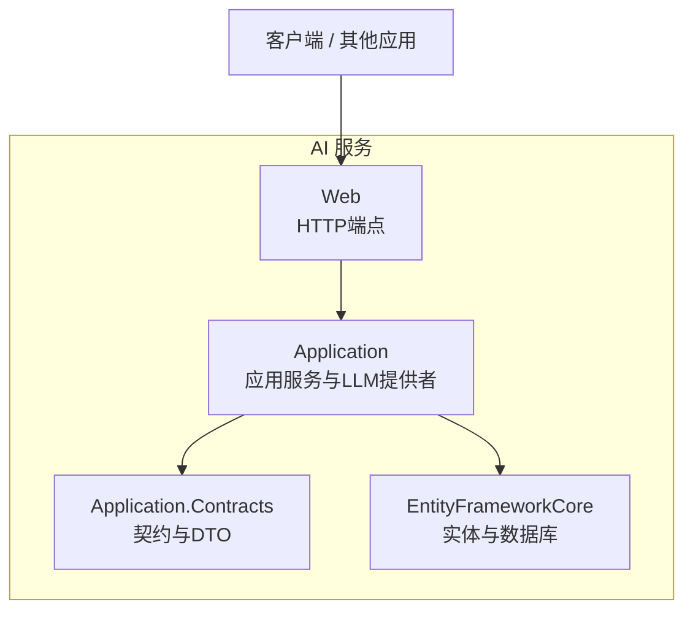
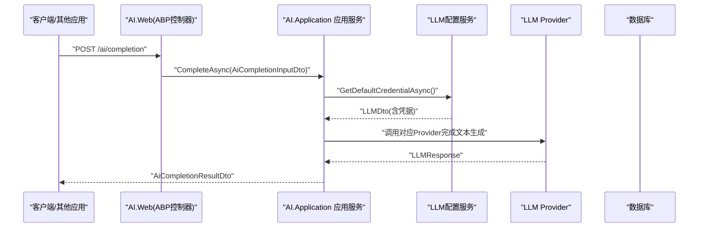

# AI服务API

<cite>
**本文引用的文件**   
- [ILLMAppService.cs](file://src/Services/AI/H.AI.Application.Contracts/Services/Llms/ILLMAppService.cs)
- [CreateLLMDto.cs](file://src/Services/AI/H.AI.Application.Contracts/Dtos/Llms/CreateLLMDto.cs)
- [UpdateLLMDto.cs](file://src/Services/AI/H.AI.Application.Contracts/Dtos/Llms/UpdateLLMDto.cs)
- [LLMDto.cs](file://src/Services/AI/H.AI.Application.Contracts/Dtos/Llms/LLMDto.cs)
- [IAiCompletionAppService.cs](file://src/Services/AI/H.AI.Application.Contracts/Services/Ai/IAiCompletionAppService.cs)
- [AiCompletionDtos.cs](file://src/Services/AI/H.AI.Application.Contracts/Dtos/Ai/AiCompletionDtos.cs)
- [IKnowledgeBaseAppService.cs](file://src/Services/AI/H.AI.Application.Contracts/Services/Knowledge/IKnowledgeBaseAppService.cs)
- [IKnowledgeDocumentAppService.cs](file://src/Services/AI/H.AI.Application.Contracts/Services/Knowledge/IKnowledgeDocumentAppService.cs)
- [CreateKnowledgeBaseDto.cs](file://src/Services/AI/H.AI.Application.Contracts/Dtos/Knowledge/CreateKnowledgeBaseDto.cs)
- [UpdateKnowledgeBaseDto.cs](file://src/Services/AI/H.AI.Application.Contracts/Dtos/Knowledge/UpdateKnowledgeBaseDto.cs)
- [KnowledgeBaseDto.cs](file://src/Services/AI/H.AI.Application.Contracts/Dtos/Knowledge/KnowledgeBaseDto.cs)
- [CreateKnowledgeNodeDto.cs](file://src/Services/AI/H.AI.Application.Contracts/Dtos/Knowledge/CreateKnowledgeNodeDto.cs)
- [UpdateKnowledgeNodeDto.cs](file://src/Services/AI/H.AI.Application.Contracts/Dtos/Knowledge/UpdateKnowledgeNodeDto.cs)
- [KnowledgeNodeDto.cs](file://src/Services/AI/H.AI.Application.Contracts/Dtos/Knowledge/KnowledgeNodeDto.cs)
- [KnowledgeDocumentDto.cs](file://src/Services/AI/H.AI.Application.Contracts/Dtos/Knowledge/KnowledgeDocumentDto.cs)
- [SaveKnowledgeDocumentDto.cs](file://src/Services/AI/H.AI.Application.Contracts/Dtos/Knowledge/SaveKnowledgeDocumentDto.cs)
</cite>

## 目录
1. [简介](#简介)
2. [项目结构](#项目结构)
3. [核心组件](#核心组件)
4. [架构总览](#架构总览)
5. [详细接口文档](#详细接口文档)
6. [依赖关系分析](#依赖关系分析)
7. [性能与优化](#性能与优化)
8. [故障排查指南](#故障排查指南)
9. [结论](#结论)

## 简介
本文件为 H.AppLab 平台的 AI 服务 API 文档，覆盖以下范围：
- 大语言模型集成：LLM 连接配置、默认模型选择、统一文本生成接口。
- 知识库管理：知识库、节点树、文档内容的增删改查与内容保存。
- AI 应用开发支撑：基于默认模型的智能助手式文本生成能力，便于其它应用复用。
- 负载均衡与模型切换：通过“默认 LLM 配置”与多 Provider 支持实现简单负载与切换。
- 请求参数、响应数据、错误处理、调用示例与最佳实践。

## 项目结构
AI 服务采用 ABP 风格分层组织，核心代码位于 `src/Services/AI`：
- Application.Contracts：对外暴露的 IAppService 契约与 DTO。
- Application：应用服务实现与 LLM Provider 抽象。
- EntityFrameworkCore：实体、DbContext 与数据库迁移。
- Web：Web 宿主与 HTTP 端点注册（由 ABP 自动映射到 IAppService）。

图示来源
- [ILLMAppService.cs:1-65](file://src/Services/AI/H.AI.Application.Contracts/Services/Llms/ILLMAppService.cs#L1-L65)
- [IAiCompletionAppService.cs:1-16](file://src/Services/AI/H.AI.Application.Contracts/Services/Ai/IAiCompletionAppService.cs#L1-L16)
- [IKnowledgeBaseAppService.cs:1-16](file://src/Services/AI/H.AI.Application.Contracts/Services/Knowledge/IKnowledgeBaseAppService.cs#L1-L16)
- [IKnowledgeDocumentAppService.cs:1-17](file://src/Services/AI/H.AI.Application.Contracts/Services/Knowledge/IKnowledgeDocumentAppService.cs#L1-L17)

章节来源
- [ILLMAppService.cs:1-65](file://src/Services/AI/H.AI.Application.Contracts/Services/Llms/ILLMAppService.cs#L1-L65)
- [IAiCompletionAppService.cs:1-16](file://src/Services/AI/H.AI.Application.Contracts/Services/Ai/IAiCompletionAppService.cs#L1-L16)
- [IKnowledgeBaseAppService.cs:1-16](file://src/Services/AI/H.AI.Application.Contracts/Services/Knowledge/IKnowledgeBaseAppService.cs#L1-L16)
- [IKnowledgeDocumentAppService.cs:1-17](file://src/Services/AI/H.AI.Application.Contracts/Services/Knowledge/IKnowledgeDocumentAppService.cs#L1-L17)

## 核心组件
- LLM 配置与应用服务：用于管理不同 LLM Provider 的连接信息、启用状态、默认模型等。
- AI 文本生成应用服务：封装默认模型调用，向其它应用提供统一的文本生成能力。
- 知识库应用服务：对知识库、节点树与文档内容进行持久化与管理。
- LLM Provider 抽象：屏蔽不同厂商 API 差异，集中处理鉴权、超时、流式与非流式返回等。

章节来源
- [ILLMAppService.cs:1-65](file://src/Services/AI/H.AI.Application.Contracts/Services/Llms/ILLMAppService.cs#L1-L65)
- [IAiCompletionAppService.cs:1-16](file://src/Services/AI/H.AI.Application.Contracts/Services/Ai/IAiCompletionAppService.cs#L1-L16)
- [IKnowledgeBaseAppService.cs:1-16](file://src/Services/AI/H.AI.Application.Contracts/Services/Knowledge/IKnowledgeBaseAppService.cs#L1-L16)
- [IKnowledgeDocumentAppService.cs:1-17](file://src/Services/AI/H.AI.Application.Contracts/Services/Knowledge/IKnowledgeDocumentAppService.cs#L1-L17)

## 架构总览
下图展示从客户端到后端 AI 服务的典型调用链路，以及 LLM Provider 的选择与默认模型机制。

图示来源
- [IAiCompletionAppService.cs:1-16](file://src/Services/AI/H.AI.Application.Contracts/Services/Ai/IAiCompletionAppService.cs#L1-L16)
- [AiCompletionDtos.cs:1-51](file://src/Services/AI/H.AI.Application.Contracts/Dtos/Ai/AiCompletionDtos.cs#L1-L51)
- [ILLMAppService.cs:1-65](file://src/Services/AI/H.AI.Application.Contracts/Services/Llms/ILLMAppService.cs#L1-L65)

## 详细接口文档

### 一、LLM 连接配置接口（ILLMAppService）
用途：管理多个 LLM Provider 的连接配置，包括创建、更新、删除、设为默认、获取明文凭据（仅服务端进程内使用）等。

#### 通用约定
- 所有方法返回统一包装类型 `BaseOutput<T>`。
- 认证与授权由 ABP 框架处理；敏感字段在对外输出时会被掩码。

#### 接口与方法一览
- 获取全部配置
  - 方法签名参考：`GetAllAsync()`
  - 返回值：`BaseOutput<List<LLMDto>>`
- 按 ID 获取配置
  - 方法签名参考：`GetAsync(Guid id)`
  - 返回值：`BaseOutput<LLMDto?>`
- 按 Provider 名称获取配置
  - 方法签名参考：`GetConfigAsync(string providerName, CancellationToken ct = default)`
  - 返回值：`BaseOutput<LLMDto?>`
- 获取默认配置
  - 方法签名参考：`GetDefaultConfigAsync(CancellationToken ct = default)`
  - 返回值：`BaseOutput<LLMDto?>`
- 创建配置
  - 方法签名参考：`CreateAsync(CreateLLMDto input)`
  - 入参：`CreateLLMDto`
  - 返回值：`BaseOutput<LLMDto>`
- 更新配置
  - 方法签名参考：`UpdateAsync(Guid id, UpdateLLMDto input)`
  - 入参：`id`, `UpdateLLMDto`
  - 返回值：`BaseOutput<LLMDto>`
- 删除配置
  - 方法签名参考：`DeleteAsync(Guid id)`
  - 入参：`id`
  - 返回值：`BaseOutput`
- 设置默认 Provider
  - 方法签名参考：`SetDefaultAsync(string providerName)`
  - 入参：`providerName`
  - 返回值：`BaseOutput`
- 获取含真实密钥的配置（进程内）
  - 方法签名参考：`GetCredentialAsync(Guid id)`
  - 入参：`id`
  - 返回值：`BaseOutput<LLMDto?>`
- 按 Provider 名称获取含真实密钥的配置（进程内）
  - 方法签名参考：`GetCredentialByProviderAsync(string providerName, CancellationToken ct = default)`
  - 入参：`providerName`, `ct`
  - 返回值：`BaseOutput<LLMDto?>`
- 获取默认配置的明文凭据（进程内）
  - 方法签名参考：`GetDefaultCredentialAsync(CancellationToken ct = default)`
  - 入参：`ct`
  - 返回值：`BaseOutput<LLMDto?>`

#### 请求与响应数据结构
- CreateLLMDto
  - 字段说明：
    - ProviderName：必填，Provider 标识名。
    - ProviderDisplayName：显示名称。
    - ApiKey：API Key。
    - ApiSecret：可选，API Secret。
    - BaseUrl：可选，基础 URL。
    - Model：模型名称。
    - IsEnabled：是否启用。
    - MaxTokens：最大 Token 数。
    - Temperature：温度参数。
    - TimeoutSeconds：超时秒数。
    - ExtraConfig：扩展配置 JSON 字符串。
- UpdateLLMDto
  - 字段说明：同 CreateLLMDto，但无需 ProviderName。
- LLMDto
  - 字段说明：包含 Id、ProviderName、ProviderDisplayName、ApiKey（对外掩码）、ApiKeyConfigured、ApiSecret、BaseUrl、Model、IsEnabled、IsDefault、MaxTokens、Temperature、TimeoutSeconds、ExtraConfig、CreationTime。

章节来源
- [ILLMAppService.cs:1-65](file://src/Services/AI/H.AI.Application.Contracts/Services/Llms/ILLMAppService.cs#L1-L65)
- [CreateLLMDto.cs:1-19](file://src/Services/AI/H.AI.Application.Contracts/Dtos/Llms/CreateLLMDto.cs#L1-L19)
- [UpdateLLMDto.cs:1-18](file://src/Services/AI/H.AI.Application.Contracts/Dtos/Llms/UpdateLLMDto.cs#L1-L18)
- [LLMDto.cs:1-25](file://src/Services/AI/H.AI.Application.Contracts/Dtos/Llms/LLMDto.cs#L1-L25)

### 二、AI 文本生成接口（IAiCompletionAppService）
用途：基于默认 LLM 配置，向其它应用提供统一的文本生成能力。

#### 接口与方法
- CompleteAsync
  - 方法签名参考：`CompleteAsync(AiCompletionInputDto input)`
  - 入参：`AiCompletionInputDto`
  - 返回值：`BaseOutput<AiCompletionResultDto>`

#### 请求与响应数据结构
- AiCompletionInputDto
  - SystemPrompt：系统提示词（可选）。
  - UserMessage：用户消息（必填）。
  - Temperature：生成温度（0~2，越低越稳定）。
  - MaxTokens：最大输出 Token 数。
- AiCompletionResultDto
  - Content：生成的内容。
  - Model：实际使用的模型。
  - UsageTokens：消耗 Token 数。

章节来源
- [IAiCompletionAppService.cs:1-16](file://src/Services/AI/H.AI.Application.Contracts/Services/Ai/IAiCompletionAppService.cs#L1-L16)
- [AiCompletionDtos.cs:1-51](file://src/Services/AI/H.AI.Application.Contracts/Dtos/Ai/AiCompletionDtos.cs#L1-L51)

### 三、知识库管理接口（IKnowledgeBaseAppService）
用途：管理知识库的增删改查，并统计文档数量。

#### 接口与方法
- GetListAsync
  - 返回值：`BaseOutput<List<KnowledgeBaseDto>>`
- GetAsync
  - 入参：`Guid id`
  - 返回值：`BaseOutput<KnowledgeBaseDto>`
- CreateAsync
  - 入参：`CreateKnowledgeBaseDto`
  - 返回值：`BaseOutput<KnowledgeBaseDto>`
- UpdateAsync
  - 入参：`Guid id`, `UpdateKnowledgeBaseDto`
  - 返回值：`BaseOutput<KnowledgeBaseDto>`
- DeleteAsync
  - 入参：`Guid id`
  - 返回值：`BaseOutput`

#### 请求与响应数据结构
- CreateKnowledgeBaseDto
  - Name：必填，长度不超过 100。
  - Description：可选，长度不超过 500。
  - SortOrder：排序权重。
- UpdateKnowledgeBaseDto
  - Name：必填，长度不超过 100。
  - Description：可选，长度不超过 500。
  - SortOrder：排序权重。
- KnowledgeBaseDto
  - Name、Description、SortOrder、DocumentCount、审计字段（继承自 CreationAuditedEntityDto<Guid>）。

章节来源
- [IKnowledgeBaseAppService.cs:1-16](file://src/Services/AI/H.AI.Application.Contracts/Services/Knowledge/IKnowledgeBaseAppService.cs#L1-L16)
- [CreateKnowledgeBaseDto.cs:1-18](file://src/Services/AI/H.AI.Application.Contracts/Dtos/Knowledge/CreateKnowledgeBaseDto.cs#L1-L18)
- [UpdateKnowledgeBaseDto.cs:1-18](file://src/Services/AI/H.AI.Application.Contracts/Dtos/Knowledge/UpdateKnowledgeBaseDto.cs#L1-L18)
- [KnowledgeBaseDto.cs:1-16](file://src/Services/AI/H.AI.Application.Contracts/Dtos/Knowledge/KnowledgeBaseDto.cs#L1-L16)

### 四、知识库节点与文档接口（IKnowledgeDocumentAppService）
用途：管理知识库下的节点树结构与文档内容。

#### 接口与方法
- 节点操作
  - GetTreeAsync(knowledgeBaseId) → `BaseOutput<List<KnowledgeNodeDto>>`
  - CreateNodeAsync(input) → `BaseOutput<KnowledgeNodeDto>`
  - UpdateNodeAsync(nodeId, input) → `BaseOutput<KnowledgeNodeDto>`
  - DeleteNodeAsync(nodeId) → `BaseOutput`
- 文档内容操作
  - GetDocumentAsync(nodeId) → `BaseOutput<KnowledgeDocumentDto?>`
  - SaveDocumentAsync(nodeId, input) → `BaseOutput<KnowledgeDocumentDto>`

#### 请求与响应数据结构
- CreateKnowledgeNodeDto
  - ParentId：父节点 ID（可选）。
  - KnowledgeBaseId：所属知识库 ID（根节点必传，子节点可继承父节点）。
  - Title：标题（必填，长度不超过 200）。
  - NodeType：节点类型（必填，长度不超过 20，默认 Directory）。
  - SortOrder：排序权重。
- UpdateKnowledgeNodeDto
  - Title：标题（必填，长度不超过 200）。
  - SortOrder：排序权重。
  - NodeType：节点类型（可选，长度不超过 20）。
- KnowledgeNodeDto
  - ParentId、Title、NodeType、SortOrder、Children（子节点列表）、审计字段。
- KnowledgeDocumentDto
  - NodeId、Content（可选）、审计字段。
- SaveKnowledgeDocumentDto
  - Content：要保存的文档内容（可选）。

章节来源
- [IKnowledgeDocumentAppService.cs:1-17](file://src/Services/AI/H.AI.Application.Contracts/Services/Knowledge/IKnowledgeDocumentAppService.cs#L1-L17)
- [CreateKnowledgeNodeDto.cs:1-24](file://src/Services/AI/H.AI.Application.Contracts/Dtos/Knowledge/CreateKnowledgeNodeDto.cs#L1-L24)
- [UpdateKnowledgeNodeDto.cs:1-18](file://src/Services/AI/H.AI.Application.Contracts/Dtos/Knowledge/UpdateKnowledgeNodeDto.cs#L1-L18)
- [KnowledgeNodeDto.cs:1-15](file://src/Services/AI/H.AI.Application.Contracts/Dtos/Knowledge/KnowledgeNodeDto.cs#L1-L15)
- [KnowledgeDocumentDto.cs:1-12](file://src/Services/AI/H.AI.Application.Contracts/Dtos/Knowledge/KnowledgeDocumentDto.cs#L1-L12)
- [SaveKnowledgeDocumentDto.cs:1-9](file://src/Services/AI/H.AI.Application.Contracts/Dtos/Knowledge/SaveKnowledgeDocumentDto.cs#L1-L9)

## 依赖关系分析

```mermaid
classDiagram
  class ILLMAppService {
    +GetAllAsync()
    +GetAsync(id)
    +GetConfigAsync(providerName)
    +GetDefaultConfigAsync()
    +CreateAsync(input)
    +UpdateAsync(id, input)
    +DeleteAsync(id)
    +SetDefaultAsync(providerName)
    +GetCredentialAsync(id)
    +GetCredentialByProviderAsync(providerName)
    +GetDefaultCredentialAsync()
  }

  class IAiCompletionAppService {
    +CompleteAsync(input)
  }

  class IKnowledgeBaseAppService {
    +GetListAsync()
    +GetAsync(id)
    +CreateAsync(input)
    +UpdateAsync(id, input)
    +DeleteAsync(id)
  }

  class IKnowledgeDocumentAppService {
    +GetTreeAsync(knowledgeBaseId)
    +CreateNodeAsync(input)
    +UpdateNodeAsync(nodeId, input)
    +DeleteNodeAsync(nodeId)
    +GetDocumentAsync(nodeId)
    +SaveDocumentAsync(nodeId, input)
  }

  class LLMDto
  class CreateLLMDto
  class UpdateLLMDto
  class AiCompletionInputDto
  class AiCompletionResultDto
  class KnowledgeBaseDto
  class CreateKnowledgeBaseDto
  class UpdateKnowledgeBaseDto
  class KnowledgeNodeDto
  class CreateKnowledgeNodeDto
  class UpdateKnowledgeNodeDto
  class KnowledgeDocumentDto
  class SaveKnowledgeDocumentDto

  ILLMAppService --> LLMDto : "返回"
  ILLMAppService --> CreateLLMDto : "入参"
  ILLMAppService --> UpdateLLMDto : "入参"
  IAiCompletionAppService --> AiCompletionInputDto : "入参"
  IAiCompletionAppService --> AiCompletionResultDto : "返回"
  IKnowledgeBaseAppService --> KnowledgeBaseDto : "返回"
  IKnowledgeBaseAppService --> CreateKnowledgeBaseDto : "入参"
  IKnowledgeBaseAppService --> UpdateKnowledgeBaseDto : "入参"
  IKnowledgeDocumentAppService --> KnowledgeNodeDto : "返回"
  IKnowledgeDocumentAppService --> CreateKnowledgeNodeDto : "入参"
  IKnowledgeDocumentAppService --> UpdateKnowledgeNodeDto : "入参"
  IKnowledgeDocumentAppService --> KnowledgeDocumentDto : "返回"
  IKnowledgeDocumentAppService --> SaveKnowledgeDocumentDto : "入参"
```

图示来源
- [ILLMAppService.cs:1-65](file://src/Services/AI/H.AI.Application.Contracts/Services/Llms/ILLMAppService.cs#L1-L65)
- [IAiCompletionAppService.cs:1-16](file://src/Services/AI/H.AI.Application.Contracts/Services/Ai/IAiCompletionAppService.cs#L1-L16)
- [IKnowledgeBaseAppService.cs:1-16](file://src/Services/AI/H.AI.Application.Contracts/Services/Knowledge/IKnowledgeBaseAppService.cs#L1-L16)
- [IKnowledgeDocumentAppService.cs:1-17](file://src/Services/AI/H.AI.Application.Contracts/Services/Knowledge/IKnowledgeDocumentAppService.cs#L1-L17)
- [CreateLLMDto.cs:1-19](file://src/Services/AI/H.AI.Application.Contracts/Dtos/Llms/CreateLLMDto.cs#L1-L19)
- [UpdateLLMDto.cs:1-18](file://src/Services/AI/H.AI.Application.Contracts/Dtos/Llms/UpdateLLMDto.cs#L1-L18)
- [LLMDto.cs:1-25](file://src/Services/AI/H.AI.Application.Contracts/Dtos/Llms/LLMDto.cs#L1-L25)
- [AiCompletionDtos.cs:1-51](file://src/Services/AI/H.AI.Application.Contracts/Dtos/Ai/AiCompletionDtos.cs#L1-L51)
- [CreateKnowledgeBaseDto.cs:1-18](file://src/Services/AI/H.AI.Application.Contracts/Dtos/Knowledge/CreateKnowledgeBaseDto.cs#L1-L18)
- [UpdateKnowledgeBaseDto.cs:1-18](file://src/Services/AI/H.AI.Application.Contracts/Dtos/Knowledge/UpdateKnowledgeBaseDto.cs#L1-L18)
- [KnowledgeBaseDto.cs:1-16](file://src/Services/AI/H.AI.Application.Contracts/Dtos/Knowledge/KnowledgeBaseDto.cs#L1-L16)
- [CreateKnowledgeNodeDto.cs:1-24](file://src/Services/AI/H.AI.Application.Contracts/Dtos/Knowledge/CreateKnowledgeNodeDto.cs#L1-L24)
- [UpdateKnowledgeNodeDto.cs:1-18](file://src/Services/AI/H.AI.Application.Contracts/Dtos/Knowledge/UpdateKnowledgeNodeDto.cs#L1-L18)
- [KnowledgeNodeDto.cs:1-15](file://src/Services/AI/H.AI.Application.Contracts/Dtos/Knowledge/KnowledgeNodeDto.cs#L1-L15)
- [KnowledgeDocumentDto.cs:1-12](file://src/Services/AI/H.AI.Application.Contracts/Dtos/Knowledge/KnowledgeDocumentDto.cs#L1-L12)
- [SaveKnowledgeDocumentDto.cs:1-9](file://src/Services/AI/H.AI.Application.Contracts/Dtos/Knowledge/SaveKnowledgeDocumentDto.cs#L1-L9)

## 性能与优化

### 负载均衡与模型切换机制
- 默认模型优先：通过 `ILLMAppService.GetDefaultConfigAsync` 或 `GetDefaultCredentialAsync` 获取默认 LLM 配置，作为默认模型入口。
- 多 Provider 支持：可在系统中注册多个 LLM Provider（例如 BaiLian、DeepSeek），通过 ProviderName 区分。
- 简单轮询与降级：当默认 Provider 不可用时，可按策略切换到其它已启用的 Provider，提高可用性。
- 建议策略：
  - 将高并发场景的默认模型设置为更稳定的 Provider，并在配置中调整 `TimeoutSeconds` 与 `MaxTokens`。
  - 对热点查询结果进行本地缓存（如 Redis），减少重复 LLM 调用。
  - 结合业务优先级，对不同租户或模块选择不同的默认模型。

### 文本生成优化
- 合理设置 Temperature：较低值提升稳定性，较高值增强创造性。
- 控制 MaxTokens：避免过长响应导致超时与资源占用。
- 异步调用：确保非阻塞处理，配合前端流式渲染体验更佳（若 Provider 支持流式）。

### 知识库索引与检索
- 当前接口聚焦于知识库、节点与文档内容的 CRUD，未直接暴露向量检索接口。
- 建议方案：
  - 在保存文档后触发后台任务，构建向量索引（如借助第三方向量库）。
  - 提供独立的检索服务，结合语义相似度进行召回。
  - 对热门检索结果进行缓存，降低重复计算开销。

### 资源管理与最佳实践
- 连接池：为外部 LLM API 建立连接池，避免频繁握手。
- 限流与熔断：针对高频调用设置速率限制，异常时快速失败与重试退避。
- 日志与追踪：记录每次调用的模型、Token 消耗、耗时与错误码，便于分析与优化。

[本节为通用指导，不直接分析具体源文件]

## 故障排查指南

### 常见错误与处理
- 参数校验失败：
  - 如 `AiCompletionInputDto.UserMessage` 为空会触发校验错误。
  - 知识库相关 DTO 的长度限制（如 Name、Title、NodeType）不满足时会报错。
- 模型不可用：
  - 默认 LLM 配置未设置或禁用时，应回退到其它可用 Provider。
  - 检查 `IsEnabled`、`ApiKey`、`ApiKeyConfigured` 与网络连通性。
- 超时与资源不足：
  - 增大 `TimeoutSeconds`，适当降低 `MaxTokens`，开启重试与熔断。
- 权限与认证：
  - 确认 ABP 认证已通过，且访问受保护接口的角色/权限正确。

### 调试建议
- 查看 `BaseOutput` 的返回码与消息，定位具体错误原因。
- 对 LLM 调用增加日志：记录 ProviderName、Model、Temperature、MaxTokens、UsageTokens、耗时与错误堆栈。
- 对知识库操作，检查节点树完整性与文档内容大小。

章节来源
- [AiCompletionDtos.cs:1-51](file://src/Services/AI/H.AI.Application.Contracts/Dtos/Ai/AiCompletionDtos.cs#L1-L51)
- [CreateKnowledgeBaseDto.cs:1-18](file://src/Services/AI/H.AI.Application.Contracts/Dtos/Knowledge/CreateKnowledgeBaseDto.cs#L1-L18)
- [CreateKnowledgeNodeDto.cs:1-24](file://src/Services/AI/H.AI.Application.Contracts/Dtos/Knowledge/CreateKnowledgeNodeDto.cs#L1-L24)
- [UpdateKnowledgeNodeDto.cs:1-18](file://src/Services/AI/H.AI.Application.Contracts/Dtos/Knowledge/UpdateKnowledgeNodeDto.cs#L1-L18)

## 结论
H.AppLab 的 AI 服务通过 ABP 契约层清晰暴露了 LLM 配置、文本生成与知识库管理能力。借助默认模型与多 Provider 设计，平台能够在不同模型间灵活切换并实现简单负载均衡。建议在业务侧结合缓存、限流、熔断与日志追踪，进一步优化性能与稳定性。对于知识库检索与索引，可在现有 CRUD 基础上扩展后台任务与独立检索服务，以满足更复杂的 RAG 场景需求。