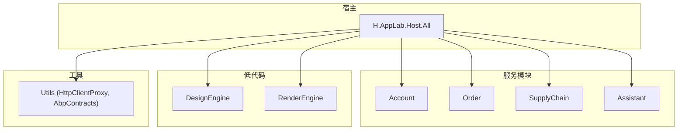
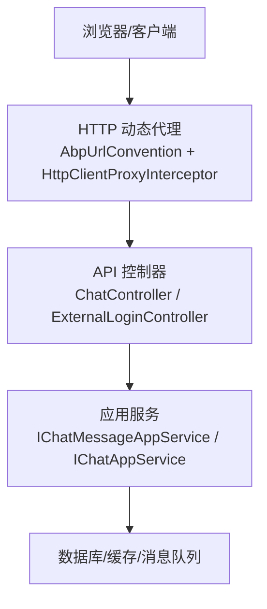
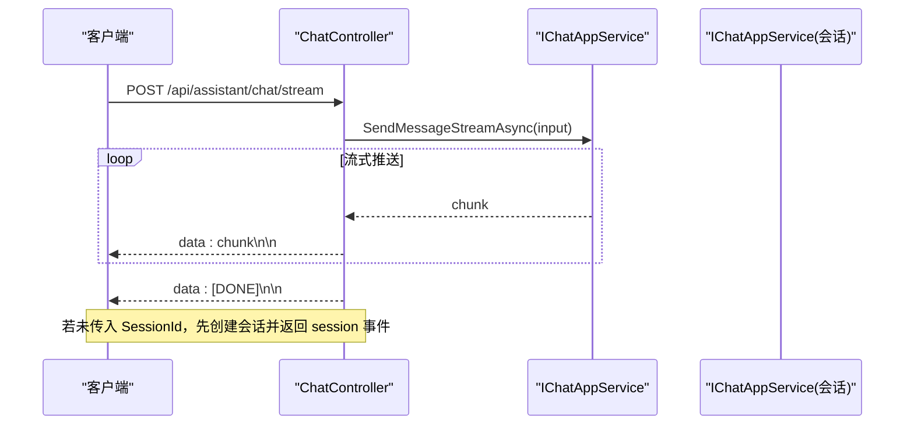
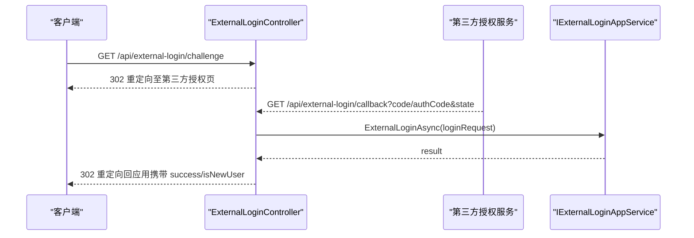
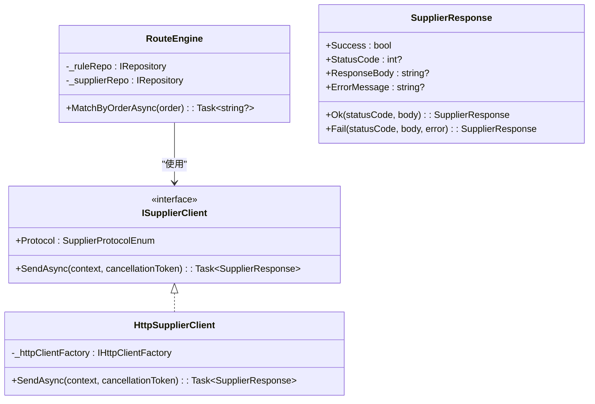
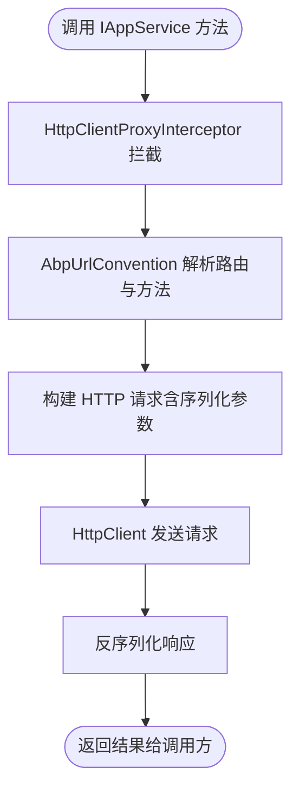
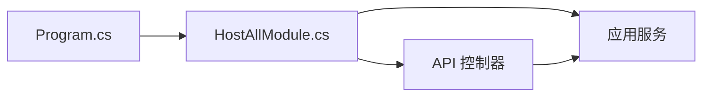

# API参考文档

<cite>
**本文引用的文件**   
- [README.md](file://README.md)
- [Program.cs](file://src/Host/H.AppLab.Host.All/H.AppLab.Host.All/Program.cs)
- [HostAllModule.cs](file://src/Host/H.AppLab.Host.All/H.AppLab.Host.All/HostAllModule.cs)
- [ChatController.cs](file://src/Agent/Assistant/H.Assistant.Application/Controllers/ChatController.cs)
- [ExternalLoginController.cs](file://src/Services/Account/H.Account.Application/ExternalLogin/ExternalLoginController.cs)
- [IAppService.cs](file://src/Utils/H.Abp.Application.Contracts/IAppService.cs)
- [HttpClientProxyInterceptor.cs](file://src/Utils/H.Abp.HttpClientProxy/HttpClientProxyInterceptor.cs)
- [AbpUrlConvention.cs](file://src/Utils/H.Abp.HttpClientProxy/AbpUrlConvention.cs)
- [RemoteServiceOptions.cs](file://src/Utils/H.Abp.HttpClientProxy/RemoteServiceOptions.cs)
- [ServiceCollectionExtensions.cs](file://src/Utils/H.Abp.HttpClientProxy/ServiceCollectionExtensions.cs)
- [RouteEngine.cs](file://src/Services/Order/H.Order.Application/Services/RouteEngine.cs)
- [SupplierClients.cs](file://src/Services/Order/H.Order.Application/Services/SupplierClients.cs)
- [ISupplierClient.cs](file://src/Services/Order/H.Order.Application.Contracts/Abstractions/ISupplierClient.cs)
- [ISupplierApiInvoker.cs](file://src/Services/SupplyChain/H.SupplyChain.Application.Contracts/Abstractions/ISupplierApiInvoker.cs)
- [Error.razor（宿主）](file://src/Host/H.AppLab.Host.All/H.AppLab.Host.All/Components/Pages/Error.razor)
</cite>

## 目录
1. [简介](#简介)
2. [项目结构](#项目结构)
3. [核心组件](#核心组件)
4. [架构总览](#架构总览)
5. [详细组件分析](#详细组件分析)
6. [依赖关系分析](#依赖关系分析)
7. [性能考虑](#性能考虑)
8. [故障排查指南](#故障排查指南)
9. [结论](#结论)
10. [附录](#附录)

## 简介
本文件为 AppLab 平台的完整 API 参考文档，覆盖以下方面：
- RESTful API 规范：HTTP 方法、URL 模式、请求与响应格式
- 认证授权与访问控制：Cookie/JWT、外部登录、多租户
- 错误码定义与异常处理机制
- 动态 HTTP 代理的使用方法与配置选项
- API 版本管理与向后兼容性说明
- 客户端 SDK 使用指南与集成示例

平台基于 .NET + Blazor，采用模块化架构，支持单体部署与按服务独立部署。前端通过 IAppService 接口实现 HTTP 动态代理调用后端应用服务，业务代码无感知。

**章节来源**
- [README.md:1-74](file://README.md#L1-L74)

## 项目结构
- Host：宿主程序，负责服务注册与中间件管线配置，不包含业务逻辑
- Components：共享 UI 组件（如 AppDrawer）
- LowCode：低代码核心（设计引擎、渲染引擎、元数据 Schema、默认组件库等）
- Services：企业级基础服务（Account、Organization、Approval、Notification、Order、Setting、SupplyChain、BackgroundTask、Testing 等）
- System：系统级应用（Enterprise、SystemPortal）
- Tools：数据库迁移工具
- Utils：通用工具库（ABP 契约、HTTP 动态代理、Blazor 工具、ID 生成等）

**图表来源**
- [Program.cs:1-115](file://src/Host/H.AppLab.Host.All/H.AppLab.Host.All/Program.cs#L1-L115)
- [HostAllModule.cs:40-117](file://src/Host/H.AppLab.Host.All/H.AppLab.Host.All/HostAllModule.cs#L40-L117)

**章节来源**
- [README.md:1-74](file://README.md#L1-L74)

## 核心组件
- 应用服务契约：所有可通过 HTTP 动态代理调用的服务需实现 IAppService 标记接口
- HTTP 动态代理：基于 DispatchProxy 拦截 IAppService 方法调用，按 ABP 路由约定转换为 HTTP 请求
- 控制器与服务：REST 控制器与应用服务暴露 API；SSE 流式接口用于聊天场景
- 认证与授权：Cookie 认证、JWT、外部登录（微信/钉钉）、多租户上下文

**章节来源**
- [IAppService.cs:1-9](file://src/Utils/H.Abp.Application.Contracts/IAppService.cs#L1-L9)
- [README.md:63-67](file://README.md#L63-L67)

## 架构总览
整体架构以宿主为中心，聚合各服务模块的控制器与应用服务，统一提供认证、授权、多租户、压缩、静态资源托管等能力。前端通过动态代理调用 IAppService，服务端由 ABP 自动映射到对应控制器或服务方法。

**图表来源**
- [Program.cs:57-114](file://src/Host/H.AppLab.Host.All/H.AppLab.Host.All/Program.cs#L57-L114)
- [ChatController.cs:1-79](file://src/Agent/Assistant/H.Assistant.Application/Controllers/ChatController.cs#L1-L79)
- [ExternalLoginController.cs:1-204](file://src/Services/Account/H.Account.Application/ExternalLogin/ExternalLoginController.cs#L1-L204)

## 详细组件分析

### 聊天 SSE 接口（流式响应）
- 端点：POST /api/assistant/chat/stream
- 功能：发送聊天消息并获取流式响应（Server-Sent Events）
- 请求体：包含会话 ID、消息内容、智能体类型等字段
- 响应：text/event-stream，逐块推送 data: JSON 片段，结束标记为 [DONE]
- 错误处理：异常时返回 type=error 的事件片段

**图表来源**
- [ChatController.cs:25-78](file://src/Agent/Assistant/H.Assistant.Application/Controllers/ChatController.cs#L25-L78)

**章节来源**
- [ChatController.cs:1-79](file://src/Agent/Assistant/H.Assistant.Application/Controllers/ChatController.cs#L1-L79)

### 外部登录（微信/钉钉）
- 端点：GET /api/external-login/challenge?provider={WeChat|DingTalk}&returnUrl=...
- 功能：发起第三方登录跳转，生成 state 并写入 Cookie，构建授权 URL 进行 302 重定向
- 回调：GET /api/external-login/callback?code=...|authCode=...&state=...
- 流程：验证 state → 换取用户信息 → 调用应用服务登录 → 重定向回 Blazor 应用
- 安全：SameSite=Lax、HttpOnly、Secure、短生命周期 Cookie

**图表来源**
- [ExternalLoginController.cs:37-192](file://src/Services/Account/H.Account.Application/ExternalLogin/ExternalLoginController.cs#L37-L192)

**章节来源**
- [ExternalLoginController.cs:1-204](file://src/Services/Account/H.Account.Application/ExternalLogin/ExternalLoginController.cs#L1-L204)

### 供应商对接与动态 HTTP 代理
- 供应商协议抽象：ISupplierClient，支持 HTTP/Mock 等多种实现
- HTTP 实现：支持 ApiKey/Header/Basic/Bearer 认证方式，按配置注入请求头或查询参数
- 路由规则引擎：根据订单属性匹配供应商，优先级排序，命中即返回
- 远端调用封装：SupplierResponse/SupplierApiResponse 统一成功/失败结构

**图表来源**
- [ISupplierClient.cs:76-96](file://src/Services/Order/H.Order.Application.Contracts/Abstractions/ISupplierClient.cs#L76-L96)
- [SupplierClients.cs:1-35](file://src/Services/Order/H.Order.Application/Services/SupplierClients.cs#L1-L35)
- [RouteEngine.cs:1-38](file://src/Services/Order/H.Order.Application/Services/RouteEngine.cs#L1-L38)

**章节来源**
- [SupplierClients.cs:1-35](file://src/Services/Order/H.Order.Application/Services/SupplierClients.cs#L1-L35)
- [RouteEngine.cs:1-38](file://src/Services/Order/H.Order.Application/Services/RouteEngine.cs#L1-L38)
- [ISupplierClient.cs:76-96](file://src/Services/Order/H.Order.Application.Contracts/Abstractions/ISupplierClient.cs#L76-L96)

### 动态 HTTP 代理与 ABP 路由约定
- 代理拦截：HttpClientProxyInterceptor 拦截 IAppService 方法调用
- 路由转换：AbpUrlConvention 将方法名转换为 HTTP 方法与路径（如 GetXxx→GET，CreateXxx→POST）
- 配置管理：RemoteServiceOptions 统一管理远程服务地址
- 批量注册：ServiceCollectionExtensions.AddHttpClientProxies 扫描程序集内 IAppService 接口并注册代理

**图表来源**
- [IAppService.cs:1-9](file://src/Utils/H.Abp.Application.Contracts/IAppService.cs#L1-L9)
- [HttpClientProxyInterceptor.cs](file://src/Utils/H.Abp.HttpClientProxy/HttpClientProxyInterceptor.cs)
- [AbpUrlConvention.cs](file://src/Utils/H.Abp.HttpClientProxy/AbpUrlConvention.cs)
- [RemoteServiceOptions.cs](file://src/Utils/H.Abp.HttpClientProxy/RemoteServiceOptions.cs)
- [ServiceCollectionExtensions.cs](file://src/Utils/H.Abp.HttpClientProxy/ServiceCollectionExtensions.cs)

**章节来源**
- [README.md:63-67](file://README.md#L63-L67)

## 依赖关系分析
- 宿主 Program 中启用中间件：认证、多租户、授权、抗伪造、压缩、静态资源、SignalR、Hangfire
- 模块装配：HostAllModule 聚合各服务 ApplicationModule，统一注册控制器与服务
- 控制器与服务解耦：控制器仅负责 HTTP 层，业务逻辑在应用服务中实现

**图表来源**
- [Program.cs:57-114](file://src/Host/H.AppLab.Host.All/H.AppLab.Host.All/Program.cs#L57-L114)
- [HostAllModule.cs:40-117](file://src/Host/H.AppLab.Host.All/H.AppLab.Host.All/HostAllModule.cs#L40-L117)

**章节来源**
- [Program.cs:1-115](file://src/Host/H.AppLab.Host.All/H.AppLab.Host.All/Program.cs#L1-L115)
- [HostAllModule.cs:40-117](file://src/Host/H.AppLab.Host.All/H.AppLab.Host.All/HostAllModule.cs#L40-L117)

## 性能考虑
- 响应压缩：启用 Brotli/Gzip，针对 WASM 资源优化传输体积
- 静态资源缓存：指纹化程序集启用 immutable 长缓存，避免重复下载
- SignalR 配置：限制最大接收消息大小，开发环境开启详细错误
- 懒加载：WASM 按需加载程序集，减少首屏体积
- AOT 与裁剪：Release 模式启用 AOT 与 Trimming，提升运行效率

**章节来源**
- [Program.cs:21-46](file://src/Host/H.AppLab.Host.All/H.AppLab.Host.All/Program.cs#L21-L46)
- [Program.cs:73-79](file://src/Host/H.AppLab.Host.All/H.AppLab.Host.All/Program.cs#L73-L79)
- [README.md:69-74](file://README.md#L69-L74)

## 故障排查指南
- 错误页面：统一错误页 /Error，开发环境显示更多细节
- 常见错误：
  - 登录状态过期：检查 Cookie 有效期与安全设置
  - 第三方授权失败：核对 provider 配置与回调地址
  - 供应商调用失败：检查 ApiUrl、认证配置与网络连通性
- 调试建议：
  - 启用开发环境详细错误
  - 查看 Hangfire 后台任务日志
  - 检查 SignalR 连接与消息大小限制

**章节来源**
- [Error.razor（宿主）:1-36](file://src/Host/H.AppLab.Host.All/H.AppLab.Host.All/Components/Pages/Error.razor#L1-L36)
- [ExternalLoginController.cs:94-192](file://src/Services/Account/H.Account.Application/ExternalLogin/ExternalLoginController.cs#L94-L192)
- [SupplierClients.cs:27-35](file://src/Services/Order/H.Order.Application/Services/SupplierClients.cs#L27-L35)

## 结论
AppLab 平台通过模块化架构与 ABP 框架提供了统一的 API 暴露方式与强大的动态代理能力。结合 Cookie/JWT 认证、外部登录与多租户支持，满足企业级应用的安全与扩展需求。SSE 流式接口与供应商对接机制进一步增强了实时性与生态集成能力。

## 附录

### API 列表与规范
- 聊天接口
  - 方法：POST
  - 路径：/api/assistant/chat/stream
  - 请求体：包含会话 ID、消息内容、智能体类型等
  - 响应：text/event-stream，逐块推送 JSON 片段，结束标记 [DONE]
- 外部登录
  - 方法：GET
  - 路径：/api/external-login/challenge?provider={WeChat|DingTalk}&returnUrl=...
  - 回调：GET /api/external-login/callback?code=...|authCode=...&state=...
  - 响应：302 重定向至第三方授权页或回调应用

**章节来源**
- [ChatController.cs:25-78](file://src/Agent/Assistant/H.Assistant.Application/Controllers/ChatController.cs#L25-L78)
- [ExternalLoginController.cs:37-192](file://src/Services/Account/H.Account.Application/ExternalLogin/ExternalLoginController.cs#L37-L192)

### 认证与授权
- 认证方式：Cookie 认证、JWT、外部登录（微信/钉钉）
- 授权策略：基于角色与权限的多租户隔离
- CSRF 保护：WASM 禁用服务端 CSRF 验证，SameSite Cookie 提供足够保护

**章节来源**
- [HostAllModule.cs:115-117](file://src/Host/H.AppLab.Host.All/H.AppLab.Host.All/HostAllModule.cs#L115-L117)
- [Program.cs:82-85](file://src/Host/H.AppLab.Host.All/H.AppLab.Host.All/Program.cs#L82-L85)

### 错误码与异常处理
- 统一错误页：/Error，开发环境显示详细错误信息
- 业务异常：控制器与服务中捕获异常并返回结构化错误信息
- 供应商调用：SupplierResponse/SupplierApiResponse 统一 Success/ErrorMessage 字段

**章节来源**
- [Error.razor（宿主）:1-36](file://src/Host/H.AppLab.Host.All/H.AppLab.Host.All/Components/Pages/Error.razor#L1-L36)
- [ISupplierClient.cs:76-96](file://src/Services/Order/H.Order.Application.Contracts/Abstractions/ISupplierClient.cs#L76-L96)
- [ISupplierApiInvoker.cs:43-60](file://src/Services/SupplyChain/H.SupplyChain.Application.Contracts/Abstractions/ISupplierApiInvoker.cs#L43-L60)

### 动态 HTTP 代理配置
- 添加代理：AddHttpClientProxies 扫描 IAppService 接口并注册
- 路由约定：AbpUrlConvention 将方法名转换为 HTTP 方法与路径
- 远程服务：RemoteServiceOptions 配置远程服务地址
- 拦截器：HttpClientProxyInterceptor 处理请求/响应序列化与错误

**章节来源**
- [README.md:63-67](file://README.md#L63-L67)
- [ServiceCollectionExtensions.cs](file://src/Utils/H.Abp.HttpClientProxy/ServiceCollectionExtensions.cs)
- [AbpUrlConvention.cs](file://src/Utils/H.Abp.HttpClientProxy/AbpUrlConvention.cs)
- [RemoteServiceOptions.cs](file://src/Utils/H.Abp.HttpClientProxy/RemoteServiceOptions.cs)
- [HttpClientProxyInterceptor.cs](file://src/Utils/H.Abp.HttpClientProxy/HttpClientProxyInterceptor.cs)

### API 版本管理与向后兼容
- 当前版本：未显式版本化，通过路由前缀区分模块
- 向后兼容：新增接口保持旧接口稳定，逐步引入新版本路径
- 建议：未来可引入 /api/v1/ 前缀进行版本化管理

[本节为概念性说明，不直接分析具体文件]

### 客户端 SDK 使用指南
- 前端仅需引用 IAppService 接口，无需手写 HttpClient 调用
- 通过 AddHttpClientProxies 自动注册代理，业务代码无感知
- 同一套接口在服务端进程内调用、在 WebAssembly 客户端为 HTTP 代理调用

**章节来源**
- [README.md:63-67](file://README.md#L63-L67)