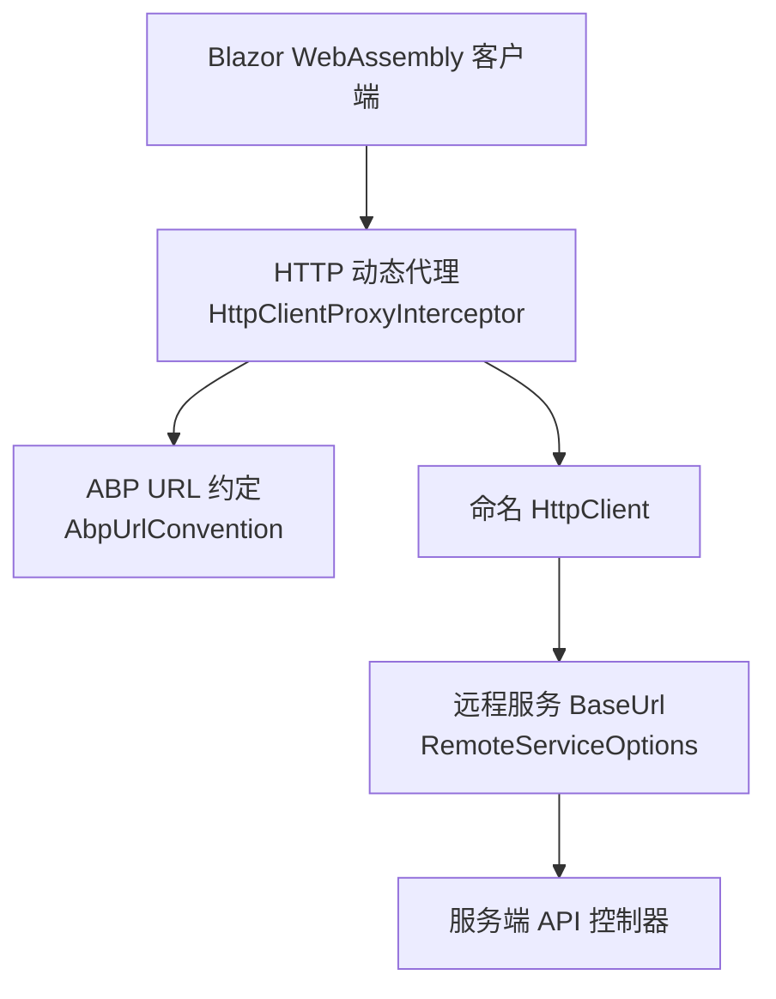
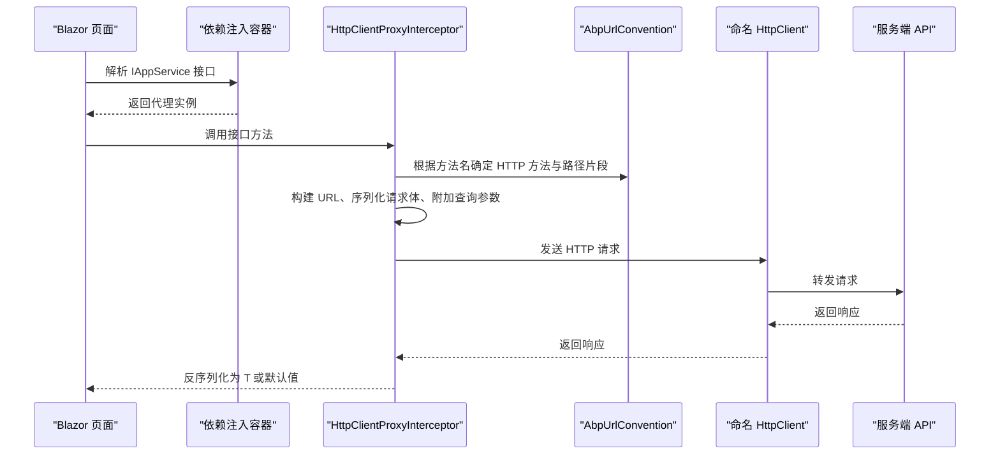
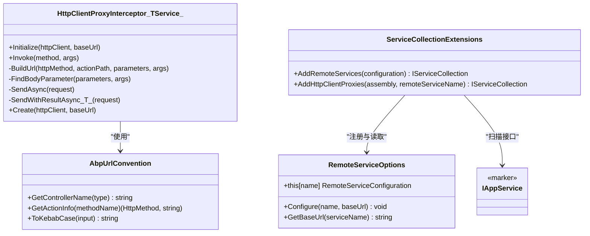
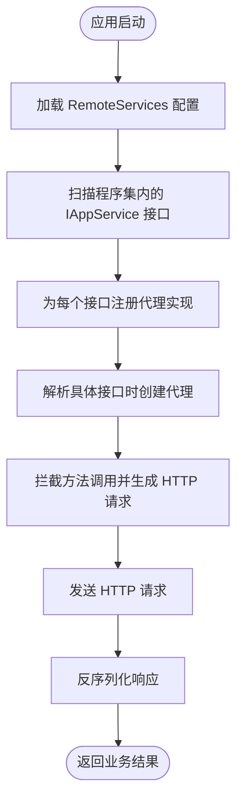
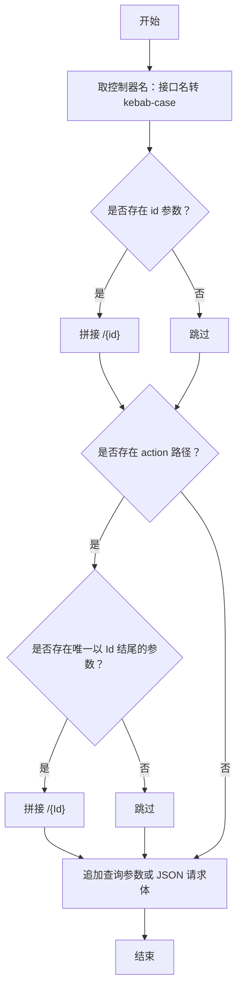
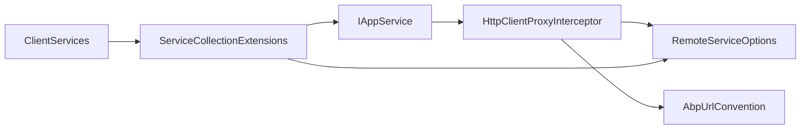

# API参考文档

<cite>
**本文引用的文件**   
- [README.md](file://README.md)
- [IAppService.cs](file://src/Utils/H.Abp.Application.Contracts/IAppService.cs)
- [HttpClientProxyInterceptor.cs](file://src/Utils/H.Abp.HttpClientProxy/HttpClientProxyInterceptor.cs)
- [AbpUrlConvention.cs](file://src/Utils/H.Abp.HttpClientProxy/AbpUrlConvention.cs)
- [RemoteServiceOptions.cs](file://src/Utils/H.Abp.HttpClientProxy/RemoteServiceOptions.cs)
- [ServiceCollectionExtensions.cs](file://src/Utils/H.Abp.HttpClientProxy/ServiceCollectionExtensions.cs)
- [ClientServices.cs（Web 宿主客户端）](file://src/Host/H.AppLab.Web.Host/H.AppLab.Web.Host.Client/ClientServices.cs)
</cite>

## 目录
1. [引言](#引言)
2. [项目结构](#项目结构)
3. [核心组件](#核心组件)
4. [架构总览](#架构总览)
5. [API设计规范：基于 IAppService](#apidesign规范基于-iappservice)
6. [HTTP动态代理机制](#http动态代理机制)
7. [RESTful API约定与调用示例](#restful-api约定与调用示例)
8. [认证、授权与多租户访问控制](#认证授权与多租户访问控制)
9. [API版本管理与向后兼容性](#api版本管理与向后兼容性)
10. [依赖关系分析](#依赖关系分析)
11. [性能与可靠性](#性能与可靠性)
12. [故障排查指南](#故障排查指南)
13. [结论](#结论)

## 引言
本文件为 H.AppLab 平台的 API 参考文档。平台采用模块化架构，支持单体部署与按服务独立部署；前端通过基于 `IAppService` 的 HTTP 动态代理，将 C# 接口方法自动转换为 RESTful HTTP 请求，从而在服务端进程内调用与 WebAssembly 远程调用之间保持统一业务代码。

平台由以下层次构成：
- Host：宿主程序，负责 Blazor Web App 启动与服务注册。
- LowCode：低代码核心，包含元数据 Schema、设计引擎、渲染引擎等。
- Services：按限界上下文划分的企业级应用服务模块。
- System：系统级应用（企业、系统门户）。
- Tools：数据库迁移工具。
- Utils：通用契约与工具库，包括 `IAppService` 标记接口与 HTTP 动态代理实现。

该文档聚焦于面向开发者的 API 使用方式、HTTP 路由约定、代理工作原理、安全策略及扩展建议。

**章节来源**
- [README.md:1-73](file://README.md#L1-L73)

## 项目结构
H.AppLab 的 API 相关代码主要分布在两个位置：
- `src/Utils/H.Abp.Application.Contracts`：定义应用服务契约基础类型与标记接口。
- `src/Utils/H.Abp.HttpClientProxy`：实现基于 `DispatchProxy` 的 HTTP 客户端代理、URL 约定、配置加载与 DI 扩展。
- 各业务模块在 `src/Services/*` 下提供 Application.Contracts，其接口通常继承 `IAppService`，并由 Web 客户端在运行时通过懒加载注册代理。

```mermaid
graph TB
    Client["Blazor WebAssembly 客户端"] --> Proxy["HTTP 动态代理<br/>HttpClientProxyInterceptor"]
    Proxy --> Convention["ABP URL 约定<br/>AbpUrlConvention"]
    Proxy --> HttpClient["命名 HttpClient"]
    HttpClient --> RemoteService["远程服务 BaseUrl<br/>RemoteServiceOptions"]
    RemoteService --> ApiServer["服务端 API 控制器"]
```

**图表来源**
- [HttpClientProxyInterceptor.cs:1-234](file://src/Utils/H.Abp.HttpClientProxy/HttpClientProxyInterceptor.cs#L1-L234)
- [AbpUrlConvention.cs:1-86](file://src/Utils/H.Abp.HttpClientProxy/AbpUrlConvention.cs#L1-L86)
- [RemoteServiceOptions.cs:1-33](file://src/Utils/H.Abp.HttpClientProxy/RemoteServiceOptions.cs#L1-L33)
- [ServiceCollectionExtensions.cs:1-63](file://src/Utils/H.Abp.HttpClientProxy/ServiceCollectionExtensions.cs#L1-L63)

**章节来源**
- [README.md:1-73](file://README.md#L1-L73)

## 核心组件
- `IAppService`：用于标识可通过 HTTP 代理远程调用的服务接口标记。
- `HttpClientProxyInterceptor<TService>`：基于 `DispatchProxy` 拦截接口方法，生成 HTTP 请求并返回结果。
- `AbpUrlConvention`：将接口名与方法名映射到 ABP 风格的 URL。
- `RemoteServiceOptions`：从配置读取远程服务 BaseUrl。
- `ServiceCollectionExtensions`：提供 `AddRemoteServices` 和 `AddHttpClientProxies` 扩展方法，完成配置加载与代理注册。
- `ClientServices`（Web 宿主客户端）：集中注册命名 HttpClient、Cookie 处理器，并在路由导航时懒加载各模块的代理。

**章节来源**
- [IAppService.cs:1-8](file://src/Utils/H.Abp.Application.Contracts/IAppService.cs#L1-L8)
- [HttpClientProxyInterceptor.cs:1-234](file://src/Utils/H.Abp.HttpClientProxy/HttpClientProxyInterceptor.cs#L1-L234)
- [AbpUrlConvention.cs:1-86](file://src/Utils/H.Abp.HttpClientProxy/AbpUrlConvention.cs#L1-L86)
- [RemoteServiceOptions.cs:1-33](file://src/Utils/H.Abp.HttpClientProxy/RemoteServiceOptions.cs#L1-L33)
- [ServiceCollectionExtensions.cs:1-63](file://src/Utils/H.Abp.HttpClientProxy/ServiceCollectionExtensions.cs#L1-L63)
- [ClientServices.cs（Web 宿主客户端）:1-193](file://src/Host/H.AppLab.Web.Host/H.AppLab.Web.Host.Client/ClientServices.cs#L1-L193)

## 架构总览
下图展示一次典型 API 调用从 Blazor 客户端到后端服务端的流程。

```mermaid
sequenceDiagram
    participant UI as "Blazor 页面"
    participant DI as "依赖注入容器"
    participant Proxy as "HttpClientProxyInterceptor"
    participant Conv as "AbpUrlConvention"
    participant Http as "命名 HttpClient"
    participant Server as "服务端 API"

    UI->>DI: 解析 IAppService 接口
    DI-->>UI: 返回代理实例
    UI->>Proxy: 调用接口方法
    Proxy->>Conv: 根据方法名确定 HTTP 方法与路径片段
    Proxy->>Proxy: 构建 URL、序列化请求体、附加查询参数
    Proxy->>Http: 发送 HTTP 请求
    Http->>Server: 转发请求
    Server-->>Http: 返回响应
    Http-->>Proxy: 返回响应
    Proxy-->>UI: 反序列化为 T 或默认值
```

**图表来源**
- [HttpClientProxyInterceptor.cs:1-234](file://src/Utils/H.Abp.HttpClientProxy/HttpClientProxyInterceptor.cs#L1-L234)
- [AbpUrlConvention.cs:1-86](file://src/Utils/H.Abp.HttpClientProxy/AbpUrlConvention.cs#L1-L86)
- [ServiceCollectionExtensions.cs:1-63](file://src/Utils/H.Abp.HttpClientProxy/ServiceCollectionExtensions.cs#L1-L63)

## API设计规范：基于 IAppService
### 接口标记
所有可被 HTTP 动态代理调用的服务接口都应继承 `IAppService`。该标记接口本身不包含方法，仅作为扫描与注册的筛选条件。

### 命名约定
- 接口命名以 `I` 开头并以 `AppService` 或 `ApplicationService` 结尾，例如 `IPageAppService`。
- 方法命名遵循 ABP 风格前缀：
  - 查询：`GetList`、`GetAll`、`Get`
  - 修改：`Put`、`Update`
  - 删除：`Delete`、`Remove`
  - 新增：`Create`、`Add`、`Insert`、`Post`
  - 部分更新：`Patch`
- 无前缀的方法将被视为 POST 请求，并使用完整方法名作为 action 路径片段。

### 参数约定
- 名为 `id` 的简单类型参数会被放入 URL 路径段，位于 action 之前。
- 名称以 `Id` 结尾且恰好只有一个这样的参数时，会作为第二个路径段，位于 action 之后。
- 其余简单类型参数转为查询字符串。
- GET/DELETE 方法的复杂对象参数会被展开为多个查询参数。
- POST/PUT 若有复杂类型参数，则将该参数序列化为 JSON 请求体。

### 返回值约定
- 支持 `Task` 与 `Task<T>`。
- 空响应体按目标类型返回默认值；若返回类型为 `string` 且内容类型为纯文本，直接返回原文。
- 其他类型尝试按 JSON 反序列化。

### 错误处理约定
- 非成功状态码会触发异常。
- 客户端应捕获代理层异常并进行用户提示或重试逻辑。

**章节来源**
- [IAppService.cs:1-8](file://src/Utils/H.Abp.Application.Contracts/IAppService.cs#L1-L8)
- [AbpUrlConvention.cs:1-86](file://src/Utils/H.Abp.HttpClientProxy/AbpUrlConvention.cs#L1-L86)
- [HttpClientProxyInterceptor.cs:1-234](file://src/Utils/H.Abp.HttpClientProxy/HttpClientProxyInterceptor.cs#L1-L234)

## HTTP动态代理机制
### 代理生命周期
1. 应用启动时通过 `AddRemoteServices` 加载 `RemoteServices` 配置。
2. 通过 `AddHttpClientProxies(assembly, remoteServiceName)` 扫描程序集中所有继承 `IAppService` 的接口并注册代理。
3. 每次解析接口时，使用 `IHttpClientFactory` 创建命名 `HttpClient`，并从 `RemoteServiceOptions` 获取对应服务的 BaseUrl。
4. 调用接口方法时，拦截器生成 URL 与请求体并发起 HTTP 请求。

### 关键类职责
- `HttpClientProxyInterceptor<TService>`：拦截方法、构造 URL、序列化、发送请求、反序列化响应。
- `AbpUrlConvention`：接口名转控制器名、方法名前缀转 HTTP 动词与 action。
- `RemoteServiceOptions`：维护服务名到 BaseUrl 的映射。
- `ServiceCollectionExtensions`：暴露 DI 扩展方法。

```mermaid
classDiagram
    class IAppService {
        <<marker>>
    }

    class HttpClientProxyInterceptor_TService_ {
        +Initialize(httpClient, baseUrl)
        +Invoke(method, args)
        -BuildUrl(httpMethod, actionPath, parameters, args)
        -FindBodyParameter(parameters, args)
        -SendAsync(request)
        -SendWithResultAsync_T_(request)
        +Create(httpClient, baseUrl)
    }

    class AbpUrlConvention {
        +GetControllerName(type) string
        +GetActionInfo(methodName) (HttpMethod, string)
        +ToKebabCase(input) string
    }

    class RemoteServiceOptions {
        +this[name] RemoteServiceConfiguration
        +Configure(name, baseUrl) void
        +GetBaseUrl(serviceName) string
    }

    class ServiceCollectionExtensions {
        +AddRemoteServices(configuration) IServiceCollection
        +AddHttpClientProxies(assembly, remoteServiceName) IServiceCollection
    }

    HttpClientProxyInterceptor_TService_ --> AbpUrlConvention : "使用"
    ServiceCollectionExtensions --> RemoteServiceOptions : "注册与读取"
    ServiceCollectionExtensions --> IAppService : "扫描接口"
```

**图表来源**
- [HttpClientProxyInterceptor.cs:1-234](file://src/Utils/H.Abp.HttpClientProxy/HttpClientProxyInterceptor.cs#L1-L234)
- [AbpUrlConvention.cs:1-86](file://src/Utils/H.Abp.HttpClientProxy/AbpUrlConvention.cs#L1-L86)
- [RemoteServiceOptions.cs:1-33](file://src/Utils/H.Abp.HttpClientProxy/RemoteServiceOptions.cs#L1-L33)
- [ServiceCollectionExtensions.cs:1-63](file://src/Utils/H.Abp.HttpClientProxy/ServiceCollectionExtensions.cs#L1-L63)

### 客户端代理生成流程

```mermaid
flowchart TD
    Start(["应用启动"]) --> LoadConfig["加载 RemoteServices 配置"]
    LoadConfig --> ScanInterfaces["扫描程序集内的 IAppService 接口"]
    ScanInterfaces --> RegisterProxies["为每个接口注册代理实现"]
    RegisterProxies --> ResolveInterface["解析具体接口时创建代理"]
    ResolveInterface --> InterceptCall["拦截方法调用并生成 HTTP 请求"]
    InterceptCall --> SendRequest["发送 HTTP 请求"]
    SendRequest --> ParseResponse["反序列化响应"]
    ParseResponse --> End(["返回业务结果"])
```

**图表来源**
- [ServiceCollectionExtensions.cs:1-63](file://src/Utils/H.Abp.HttpClientProxy/ServiceCollectionExtensions.cs#L1-L63)
- [HttpClientProxyInterceptor.cs:1-234](file://src/Utils/H.Abp.HttpClientProxy/HttpClientProxyInterceptor.cs#L1-L234)

**章节来源**
- [ServiceCollectionExtensions.cs:1-63](file://src/Utils/H.Abp.HttpClientProxy/ServiceCollectionExtensions.cs#L1-L63)
- [HttpClientProxyInterceptor.cs:1-234](file://src/Utils/H.Abp.HttpClientProxy/HttpClientProxyInterceptor.cs#L1-L234)
- [AbpUrlConvention.cs:1-86](file://src/Utils/H.Abp.HttpClientProxy/AbpUrlConvention.cs#L1-L86)
- [RemoteServiceOptions.cs:1-33](file://src/Utils/H.Abp.HttpClientProxy/RemoteServiceOptions.cs#L1-L33)

## RESTful API约定与调用示例
### URL 模式
- 控制器路径：`/api/app/{controller}`
- 控制器名：从接口名去除 `I` 前缀与 `AppService`/`ApplicationService` 后缀，再转换为 kebab-case。
- Action 路径：
  - 方法名前缀决定 HTTP 动词。
  - 剩余部分转换为 kebab-case 作为 action 路径片段。
- 路径参数：
  - 第一个简单类型 `id` 参数插入到 controller 之后。
  - 若存在唯一以 `Id` 结尾的简单类型参数，插入到 action 之后。
- 查询参数：
  - 其余简单类型参数作为查询项。
  - GET/DELETE 的复杂对象参数会被扁平展开为多个查询键值对。
- 请求体：
  - POST/PUT 的复杂对象参数作为 JSON 请求体。

### 常用方法前缀与 HTTP 动词
| 方法前缀 | HTTP 方法 | 说明 |
|---|---|---|
| `GetList` | GET | 列表查询 |
| `GetAll` | GET | 全量查询 |
| `Get` | GET | 单条查询 |
| `Put` | PUT | 替换更新 |
| `Update` | PUT | 替换更新 |
| `Delete` | DELETE | 删除 |
| `Remove` | DELETE | 删除 |
| `Create` | POST | 新增 |
| `Add` | POST | 新增 |
| `Insert` | POST | 新增 |
| `Post` | POST | 自定义新增 |
| `Patch` | PATCH | 部分更新 |

### URL 构建规则

```mermaid
flowchart TD
    A["开始"] --> B["取控制器名：接口名转 kebab-case"]
    B --> C{"是否存在 id 参数？"}
    C -->|是| D["拼接 /{id}"]
    C -->|否| E["跳过"]
    D --> F{"是否存在 action 路径？"}
    E --> F
    F -->|是| G{"是否存在唯一以 Id 结尾的参数？"}
    G -->|是| H["拼接 /{Id}"]
    G -->|否| I["跳过"]
    H --> J["追加查询参数或 JSON 请求体"]
    I --> J
    F -->|否| J
    J --> K["结束"]
```

**图表来源**
- [HttpClientProxyInterceptor.cs:1-234](file://src/Utils/H.Abp.HttpClientProxy/HttpClientProxyInterceptor.cs#L1-L234)

### 调用示例说明
由于本项目通过 C# 接口抽象 API 调用，不建议直接手写原始 HTTP 请求；但若需要跨语言对接，请遵循以下原则：

- **C# 客户端**
  - 通过 `AddHttpClientProxies` 注册代理后，直接注入 `IAppService` 子接口并调用方法。
  - 该方法会自动转换为 HTTP 请求，无需手动拼装 URL。

- **JavaScript 客户端**
  - 若需绕过代理直接调用后端 API，应遵循 `/api/app/{controller}/{action?}/{id?}/{secondId?}` 的 URL 模式，并将复杂对象放在请求体中。
  - 注意查询参数命名采用 camelCase，时间类型采用 ISO 格式。

- **Python、Go、Java 等客户端**
  - 同样遵循上述 URL 与参数约定；JSON 字段命名应与服务端 DTO 一致。

以上示例不展示具体代码，但可在现有客户端项目中参考代理注册与接口调用的使用方式。

**章节来源**
- [HttpClientProxyInterceptor.cs:1-234](file://src/Utils/H.Abp.HttpClientProxy/HttpClientProxyInterceptor.cs#L1-L234)
- [AbpUrlConvention.cs:1-86](file://src/Utils/H.Abp.HttpClientProxy/AbpUrlConvention.cs#L1-L86)

## 认证、授权与多租户访问控制
### Cookie 认证
Web 客户端通过 `CookieHandler` 为命名 `HttpClient` 添加消息处理器，使 Blazor WebAssembly 的 fetch 请求携带认证 Cookie。这意味着认证令牌通常以 Cookie 形式保存在浏览器中，后续请求自动附带。

### 权限验证
权限验证由服务端 API 控制器或中间件负责。客户端代理层只负责传输请求与响应，不负责鉴权决策。

### 多租户访问控制
多租户策略应由服务端根据当前用户、组织或租户上下文进行判断。客户端可通过以下方式配合：
- 在请求头中传递租户标识。
- 在查询参数中传递租户 ID。
- 在业务参数中包含租户信息。

当前仓库未提供统一的租户 Header 处理器；若需要，可在客户端扩展 `AppIdHeaderHandler` 或新增自定义消息处理器，在服务端由中间件或过滤器解析。

**章节来源**
- [ClientServices.cs（Web 宿主客户端）:1-193](file://src/Host/H.AppLab.Web.Host/H.AppLab.Web.Host.Client/ClientServices.cs#L1-L193)

## API版本管理与向后兼容性
### 当前版本策略
- 控制器级别未显式实现路径版本化（如 `/v1/api/app/...`），URL 由 `AbpUrlConvention` 直接生成。
- 接口契约通过 `IAppService` 与具体业务接口承载，变更应在 Application.Contracts 中进行语义化演进。

### 推荐实践
- 避免破坏性修改已有方法签名，尤其是路径参数与查询参数命名。
- 新增能力优先通过新方法前缀暴露，例如新增 `GetXxxV2` 或引入新控制器。
- 对 DTO 字段采用可选字段兼容旧客户端，服务端忽略未知字段。
- 对行为变更提供过渡期，并通过日志记录废弃接口的调用情况。

### 未来建议
- 若需要强版本控制，可在 `AbpUrlConvention` 中增加版本前缀，或在 `RemoteServiceOptions` 中区分不同 BaseUrl 指向不同版本服务。
- 在网关层实现路由版本选择与降级策略。

**章节来源**
- [AbpUrlConvention.cs:1-86](file://src/Utils/H.Abp.HttpClientProxy/AbpUrlConvention.cs#L1-L86)
- [RemoteServiceOptions.cs:1-33](file://src/Utils/H.Abp.HttpClientProxy/RemoteServiceOptions.cs#L1-L33)

## 依赖关系分析

```mermaid
graph LR
    IAppService["IAppService"] --> Proxy["HttpClientProxyInterceptor"]
    Proxy --> Convention["AbpUrlConvention"]
    Proxy --> Options["RemoteServiceOptions"]
    Extensions["ServiceCollectionExtensions"] --> Options
    Extensions --> IAppService
    ClientServices["ClientServices"] --> Extensions
```

**图表来源**
- [IAppService.cs:1-8](file://src/Utils/H.Abp.Application.Contracts/IAppService.cs#L1-L8)
- [HttpClientProxyInterceptor.cs:1-234](file://src/Utils/H.Abp.HttpClientProxy/HttpClientProxyInterceptor.cs#L1-L234)
- [AbpUrlConvention.cs:1-86](file://src/Utils/H.Abp.HttpClientProxy/AbpUrlConvention.cs#L1-L86)
- [RemoteServiceOptions.cs:1-33](file://src/Utils/H.Abp.HttpClientProxy/RemoteServiceOptions.cs#L1-L33)
- [ServiceCollectionExtensions.cs:1-63](file://src/Utils/H.Abp.HttpClientProxy/ServiceCollectionExtensions.cs#L1-L63)
- [ClientServices.cs（Web 宿主客户端）:1-193](file://src/Host/H.AppLab.Web.Host/H.AppLab.Web.Host.Client/ClientServices.cs#L1-L193)

**章节来源**
- [ClientServices.cs（Web 宿主客户端）:1-193](file://src/Host/H.AppLab.Web.Host/H.AppLab.Web.Host.Client/ClientServices.cs#L1-L193)

## 性能与可靠性
### 超时设置
- 测试执行相关的远程服务设置了无限超时，以避免长时间运行的批量测试用例被取消。
- 其他服务使用默认超时，应根据业务需求调整。

### 连接复用
- 使用 `IHttpClientFactory` 管理命名 `HttpClient`，有助于连接池复用与 DNS 刷新。

### 序列化开销
- 代理使用 `System.Text.Json` 进行序列化与反序列化，属性名采用 camelCase。
- 对于大量数据的列表接口，建议服务端分页并提供必要的过滤条件。

### 懒加载
- Web 客户端仅在路由导航时加载对应模块的 Contracts 程序集并注册代理，减少初始下载体积。

**章节来源**
- [ClientServices.cs（Web 宿主客户端）:1-193](file://src/Host/H.AppLab.Web.Host/H.AppLab.Web.Host.Client/ClientServices.cs#L1-L193)
- [HttpClientProxyInterceptor.cs:1-234](file://src/Utils/H.Abp.HttpClientProxy/HttpClientProxyInterceptor.cs#L1-L234)

## 故障排查指南
### 常见问题
- **404 未找到**
  - 检查接口名与方法名前缀是否符合约定。
  - 确认 `RemoteServices` 配置中的 BaseUrl 正确。
  - 确认服务端已注册对应控制器。

- **401 未认证**
  - 检查浏览器是否携带 Cookie。
  - 确认 `CookieHandler` 已添加到命名 HttpClient。

- **405 方法不允许**
  - 检查方法前缀是否正确映射到预期 HTTP 动词。
  - 检查服务端控制器是否支持该动作。

- **请求体为空**
  - 确认传入的是复杂类型参数，而非简单类型。
  - 检查方法是否为 POST/PUT。

- **反序列化失败**
  - 检查服务端返回的 JSON 结构与目标类型是否匹配。
  - 检查 Content-Type 是否为 JSON。

### 调试建议
- 在代理层输出最终 URL、HTTP 方法、请求体与响应状态。
- 在服务端记录请求路径、参数与异常堆栈。
- 使用浏览器网络面板查看实际请求与响应。

**章节来源**
- [HttpClientProxyInterceptor.cs:1-234](file://src/Utils/H.Abp.HttpClientProxy/HttpClientProxyInterceptor.cs#L1-L234)
- [ClientServices.cs（Web 宿主客户端）:1-193](file://src/Host/H.AppLab.Web.Host/H.AppLab.Web.Host.Client/ClientServices.cs#L1-L193)

## 结论
H.AppLab 通过 `IAppService` 标记接口与 HTTP 动态代理，将 C# 接口调用统一映射为 RESTful API。开发者只需关注接口设计与 DTO 模型，无需手写 HTTP 调用代码。平台提供了清晰的 URL 约定、参数绑定规则与客户端懒加载机制，适合在单体与微服务部署模式下保持一致的业务调用体验。

在实际使用中，应严格遵守方法前缀、参数命名与返回值约定，结合服务端认证授权与租户策略，保证 API 的安全性与可维护性。若需要跨语言集成，应遵循相同的 URL 与 JSON 约定，并通过网关或服务编排实现负载均衡与版本管理。