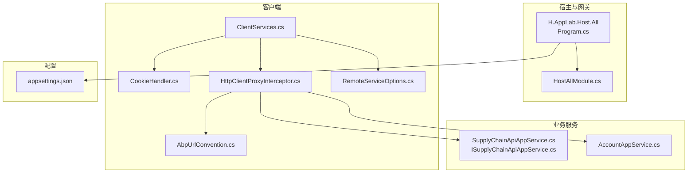
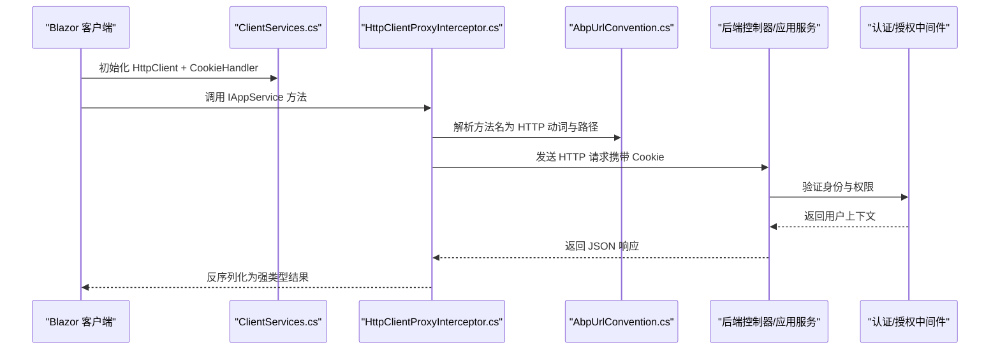
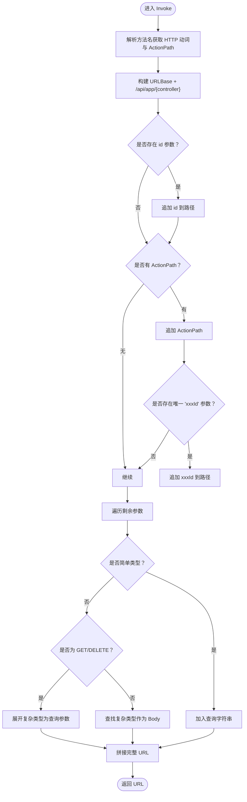
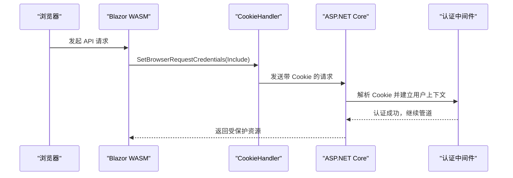
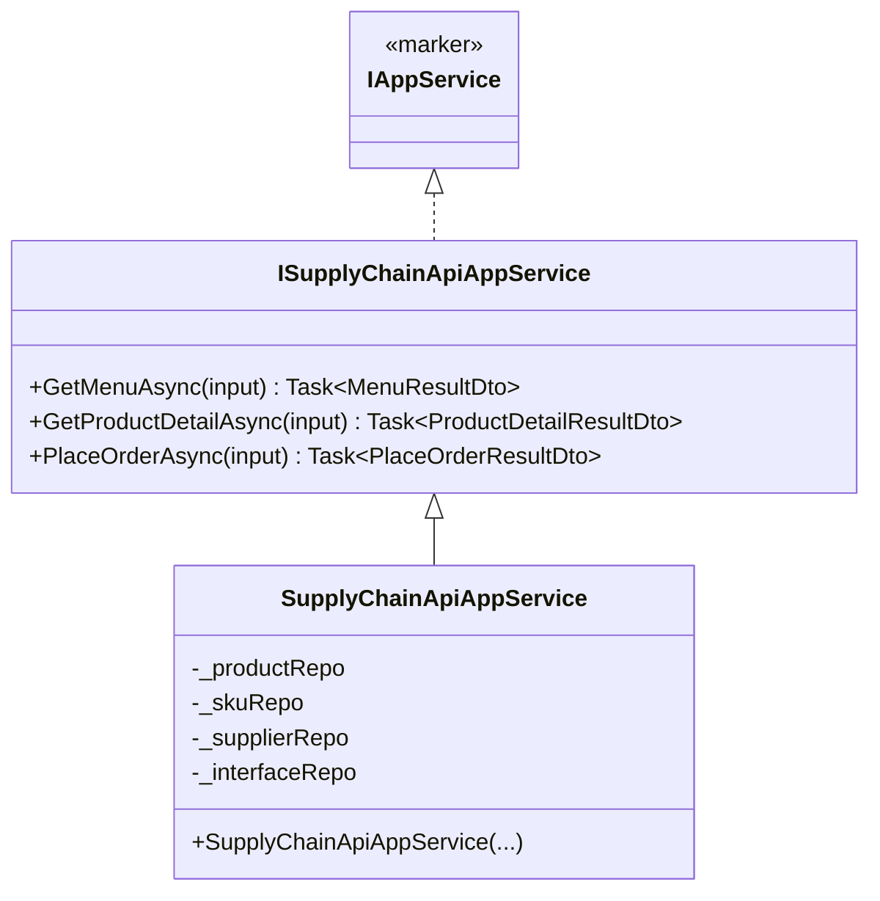
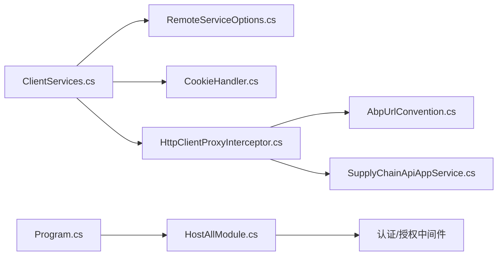

# API概览

<cite>
**本文引用的文件**   
- [README.md](file://README.md)
- [Program.cs](file://src/Host/H.AppLab.Host.All/H.AppLab.Host.All/Program.cs)
- [HostAllModule.cs](file://src/Host/H.AppLab.Host.All/H.AppLab.Host.All/HostAllModule.cs)
- [ClientServices.cs](file://src/Host/H.AppLab.Host.All/H.AppLab.Host.All.Client/ClientServices.cs)
- [CookieHandler.cs](file://src/Host/Account/H.Account.Host.Client/CookieHandler.cs)
- [HttpClientProxyInterceptor.cs](file://src/Utils/H.Abp.HttpClientProxy/HttpClientProxyInterceptor.cs)
- [AbpUrlConvention.cs](file://src/Utils/H.Abp.HttpClientProxy/AbpUrlConvention.cs)
- [RemoteServiceOptions.cs](file://src/Utils/H.Abp.HttpClientProxy/RemoteServiceOptions.cs)
- [IAppService.cs](file://src/Utils/H.Abp.Application.Contracts/IAppService.cs)
- [appsettings.json](file://src/Host/H.AppLab.Host.All/H.AppLab.Host.All/appsettings.json)
- [ISupplyChainApiAppService.cs](file://src/Services/SupplyChain/H.SupplyChain.Application.Contracts/Services/ISupplyChainApiAppService.cs)
- [SupplyChainApiAppService.cs](file://src/Services/SupplyChain/H.SupplyChain.Application/Services/SupplyChainApiAppService.cs)
- [AccountAppService.cs](file://src/Services/Account/H.Account.Application/Services/AccountAppService.cs)
- [Error.razor（宿主）](file://src/Host/H.AppLab.Host.All/H.AppLab.Host.All/Components/Pages/Error.razor)
</cite>

## 目录
1. [简介](#简介)
2. [项目结构](#项目结构)
3. [核心组件](#核心组件)
4. [架构总览](#架构总览)
5. [详细组件分析](#详细组件分析)
6. [依赖关系分析](#依赖关系分析)
7. [性能与序列化](#性能与序列化)
8. [故障排查指南](#故障排查指南)
9. [结论](#结论)
10. [附录：API调用模式与最佳实践](#附录api调用模式与最佳实践)

## 简介
本文件为 AppLab 平台的 API 概览文档，面向开发者与集成方，系统性阐述整体 API 架构设计、RESTful 规范、HTTP 动态代理机制、认证授权流程、版本管理与兼容性策略、请求响应格式标准、错误处理机制、数据序列化方式，以及客户端 SDK 使用指南与集成示例。同时给出 CORS 配置与安全注意事项，帮助快速理解并正确接入平台 API。

## 项目结构
- 宿主层（Host）
  - H.AppLab.Host.All：单体宿主，聚合所有服务，统一注册 Blazor、SignalR、JSON 序列化、压缩、路由、认证、授权等中间件。
  - 其他独立 Host（如 Account、RenderEngine）用于单服务部署场景。
- 业务服务（Services）
  - 按限界上下文划分（Account、Organization、Approval、Notification、Order、Setting、SupplyChain、BackgroundTask、Testing 等），每个模块遵循 Application.Contracts / Application / EntityFrameworkCore / Web 分层。
- 低代码（LowCode）
  - Common、DesignEngine、RenderEngine、MetaSchema、Themes 等，提供元数据驱动的设计与渲染能力。
- 工具库（Utils）
  - H.Abp.HttpClientProxy：基于 IAppService 接口的 HTTP 动态代理，实现前端只依赖契约接口即可发起 HTTP 调用。
  - H.Abp.Application.Contracts：应用服务基础契约（IAppService 等）。
- 工具（Tools）
  - 各服务的 DbMigrator 控制台程序，用于数据库迁移。

**图表来源** 
- [Program.cs:1-115](file://src/Host/H.AppLab.Host.All/H.AppLab.Host.All/Program.cs#L1-L115)
- [HostAllModule.cs:78-117](file://src/Host/H.AppLab.Host.All/H.AppLab.Host.All/HostAllModule.cs#L78-L117)
- [ClientServices.cs:1-171](file://src/Host/H.AppLab.Host.All/H.AppLab.Host.All.Client/ClientServices.cs#L1-L171)
- [CookieHandler.cs:1-17](file://src/Host/Account/H.Account.Host.Client/CookieHandler.cs#L1-L17)
- [HttpClientProxyInterceptor.cs:1-219](file://src/Utils/H.Abp.HttpClientProxy/HttpClientProxyInterceptor.cs#L1-L219)
- [AbpUrlConvention.cs:1-87](file://src/Utils/H.Abp.HttpClientProxy/AbpUrlConvention.cs#L1-L87)
- [RemoteServiceOptions.cs:1-34](file://src/Utils/H.Abp.HttpClientProxy/RemoteServiceOptions.cs#L1-L34)
- [appsettings.json:1-115](file://src/Host/H.AppLab.Host.All/H.AppLab.Host.All/appsettings.json#L1-L115)
- [SupplyChainApiAppService.cs:1-55](file://src/Services/SupplyChain/H.SupplyChain.Application/Services/SupplyChainApiAppService.cs#L1-L55)
- [ISupplyChainApiAppService.cs:1-29](file://src/Services/SupplyChain/H.SupplyChain.Application.Contracts/Services/ISupplyChainApiAppService.cs#L1-L29)
- [AccountAppService.cs:1-42](file://src/Services/Account/H.Account.Application/Services/AccountAppService.cs#L1-L42)

**章节来源**
- [README.md:1-74](file://README.md#L1-L74)

## 核心组件
- HTTP 动态代理（HttpClientProxyInterceptor）
  - 基于 DispatchProxy 拦截 IAppService 接口方法调用，自动转换为 HTTP 请求。
  - 支持 GET/POST/PUT/DELETE/PATCH 等动词映射，复杂参数自动序列化为 JSON 或查询字符串。
- URL 约定（AbpUrlConvention）
  - 将接口名与方法名转换为 ABP 风格的路由路径（kebab-case），与后端控制器路由保持一致。
- 远程服务配置（RemoteServiceOptions）
  - 从 appsettings.json 的 RemoteServices 节点读取各服务 BaseUrl，集中管理。
- 客户端服务注册（ClientServices）
  - 为每个命名 HttpClient 注入 CookieHandler，确保 WASM 请求携带认证 Cookie。
  - 懒加载模块代理：仅在导航到对应路由时按需注册各模块的 HttpClient 代理。
- 认证与授权（HostAllModule、Program）
  - 启用 Cookie 认证、多租户、授权、防跨站请求伪造（WASM 禁用服务端 CSRF 校验）。
  - 统一 JSON 序列化策略（驼峰命名）。
- 错误页面（Error.razor）
  - 统一的错误展示页，开发环境显示详细错误信息，生产环境隐藏敏感信息。

**章节来源**
- [HttpClientProxyInterceptor.cs:1-219](file://src/Utils/H.Abp.HttpClientProxy/HttpClientProxyInterceptor.cs#L1-L219)
- [AbpUrlConvention.cs:1-87](file://src/Utils/H.Abp.HttpClientProxy/AbpUrlConvention.cs#L1-L87)
- [RemoteServiceOptions.cs:1-34](file://src/Utils/H.Abp.HttpClientProxy/RemoteServiceOptions.cs#L1-L34)
- [ClientServices.cs:1-171](file://src/Host/H.AppLab.Host.All/H.AppLab.Host.All.Client/ClientServices.cs#L1-L171)
- [HostAllModule.cs:78-117](file://src/Host/H.AppLab.Host.All/H.AppLab.Host.All/HostAllModule.cs#L78-L117)
- [Program.cs:1-115](file://src/Host/H.AppLab.Host.All/H.AppLab.Host.All/Program.cs#L1-L115)
- [Error.razor（宿主）:1-36](file://src/Host/H.AppLab.Host.All/H.AppLab.Host.All/Components/Pages/Error.razor#L1-L36)

## 架构总览
AppLab 采用模块化架构，宿主统一编排中间件与服务，客户端通过动态代理以契约接口形式调用后端 API。认证采用 Cookie，跨域通过 SameSite Cookie 与服务器端配置保障安全。

**图表来源** 
- [ClientServices.cs:1-171](file://src/Host/H.AppLab.Host.All/H.AppLab.Host.All.Client/ClientServices.cs#L1-L171)
- [HttpClientProxyInterceptor.cs:1-219](file://src/Utils/H.Abp.HttpClientProxy/HttpClientProxyInterceptor.cs#L1-L219)
- [AbpUrlConvention.cs:1-87](file://src/Utils/H.Abp.HttpClientProxy/AbpUrlConvention.cs#L1-L87)
- [Program.cs:1-115](file://src/Host/H.AppLab.Host.All/H.AppLab.Host.All/Program.cs#L1-L115)

## 详细组件分析

### RESTful API 规范与 URL 约定
- 控制器名称与动作路径
  - 控制器名：从 IAppService 接口名推导，去除前缀 I 与后缀 AppService/ApplicationService，转为 kebab-case。
  - 动作路径：根据方法名前缀映射为 HTTP 动词（GetList/GetAll/Get → GET；Create/Add/Insert/Post → POST；Put/Update → PUT；Delete/Remove → DELETE；Patch → PATCH）。
- 参数绑定
  - 简单类型参数（string、int、Guid、DateTime 等）作为查询字符串。
  - 复杂类型在 POST/PUT 中作为 JSON Body；GET/DELETE 中的复杂类型会展开属性为查询参数。
  - id 参数特殊处理：位于 action 之前；若存在一个以 Id 结尾的参数，则位于 action 之后。

**图表来源** 
- [HttpClientProxyInterceptor.cs:72-131](file://src/Utils/H.Abp.HttpClientProxy/HttpClientProxyInterceptor.cs#L72-L131)
- [AbpUrlConvention.cs:34-82](file://src/Utils/H.Abp.HttpClientProxy/AbpUrlConvention.cs#L34-L82)

**章节来源**
- [AbpUrlConvention.cs:1-87](file://src/Utils/H.Abp.HttpClientProxy/AbpUrlConvention.cs#L1-L87)
- [HttpClientProxyInterceptor.cs:1-219](file://src/Utils/H.Abp.HttpClientProxy/HttpClientProxyInterceptor.cs#L1-L219)

### 认证与授权流程
- 认证方式
  - 服务端启用 Cookie 认证，WASM 客户端通过 CookieHandler 设置浏览器凭据 Include，使 fetch 请求携带 Cookie。
- 授权与多租户
  - 启用多租户与授权中间件，确保资源访问控制。
- 防跨站请求伪造（CSRF）
  - WASM 应用禁用服务端 AntiForgery 自动校验，SameSite Cookie 已提供足够保护。

**图表来源** 
- [CookieHandler.cs:1-17](file://src/Host/Account/H.Account.Host.Client/CookieHandler.cs#L1-L17)
- [HostAllModule.cs:78-117](file://src/Host/H.AppLab.Host.All/H.AppLab.Host.All/HostAllModule.cs#L78-L117)
- [Program.cs:82-85](file://src/Host/H.AppLab.Host.All/H.AppLab.Host.All/Program.cs#L82-L85)

**章节来源**
- [CookieHandler.cs:1-17](file://src/Host/Account/H.Account.Host.Client/CookieHandler.cs#L1-L17)
- [HostAllModule.cs:78-117](file://src/Host/H.AppLab.Host.All/H.AppLab.Host.All/HostAllModule.cs#L78-L117)
- [Program.cs:82-85](file://src/Host/H.AppLab.Host.All/H.AppLab.Host.All/Program.cs#L82-L85)

### 请求响应格式与数据序列化
- JSON 序列化
  - 服务端统一启用驼峰命名（CamelCase），客户端代理默认使用相同选项进行反序列化。
  - 时间类型按 ISO 8601 格式序列化。
- 响应体
  - 成功响应直接返回业务对象或集合；空内容（NoContent）返回默认值。
- 错误响应
  - 非 2xx 状态码抛出异常；错误页面统一展示错误信息与请求 ID。

**章节来源**
- [Program.cs:22-25](file://src/Host/H.AppLab.Host.All/H.AppLab.Host.All/Program.cs#L22-L25)
- [HttpClientProxyInterceptor.cs:17-21](file://src/Utils/H.Abp.HttpClientProxy/HttpClientProxyInterceptor.cs#L17-L21)
- [Error.razor（宿主）:1-36](file://src/Host/H.AppLab.Host.All/H.AppLab.Host.All/Components/Pages/Error.razor#L1-L36)

### 版本管理与向后兼容
- 版本策略
  - 当前未显式使用 URL 版本段（如 /v1/...），建议通过控制器命名空间或路由前缀区分版本，保持向后兼容。
- 兼容性保证
  - 新增字段应标记可选；删除字段需保留兼容过渡期；变更行为需通过版本升级说明。
- 契约优先
  - 通过 IAppService 契约定义接口，前后端共享契约，降低版本冲突风险。

[本节为概念性说明，不直接分析具体文件]

### 客户端 SDK 使用指南与集成示例
- 注册远程服务
  - 在 appsettings.json 的 RemoteServices 节点配置各服务 BaseUrl。
  - 使用 AddHttpClientProxies 扫描契约程序集，批量注册代理。
- 懒加载模块
  - 通过 ClientServices 的 LazyModuleRegistrations 在路由导航时按需注册模块代理。
- 示例：供应链对外 API
  - ISupplyChainApiAppService 暴露菜单、商品详情、下单接口，供外部系统调用。
  - 客户端只需引用契约程序集，无需手写 HttpClient 调用。

**图表来源** 
- [IAppService.cs:1-9](file://src/Utils/H.Abp.Application.Contracts/IAppService.cs#L1-L9)
- [ISupplyChainApiAppService.cs:1-29](file://src/Services/SupplyChain/H.SupplyChain.Application.Contracts/Services/ISupplyChainApiAppService.cs#L1-L29)
- [SupplyChainApiAppService.cs:1-55](file://src/Services/SupplyChain/H.SupplyChain.Application/Services/SupplyChainApiAppService.cs#L1-L55)

**章节来源**
- [ClientServices.cs:1-171](file://src/Host/H.AppLab.Host.All/H.AppLab.Host.All.Client/ClientServices.cs#L1-L171)
- [appsettings.json:22-68](file://src/Host/H.AppLab.Host.All/H.AppLab.Host.All/appsettings.json#L22-L68)
- [ISupplyChainApiAppService.cs:1-29](file://src/Services/SupplyChain/H.SupplyChain.Application.Contracts/Services/ISupplyChainApiAppService.cs#L1-L29)
- [SupplyChainApiAppService.cs:1-55](file://src/Services/SupplyChain/H.SupplyChain.Application/Services/SupplyChainApiAppService.cs#L1-L55)

### CORS 配置与安全考虑
- CORS
  - 当前未显式配置 CORS，如需跨域调用，应在 Program 中启用并限制允许的源、方法与头。
- 安全要点
  - 启用 HTTPS 重定向与 HSTS。
  - 使用 SameSite Cookie 与 Cookie 认证，避免 CSRF。
  - 最小权限原则：仅开放必要接口，结合授权策略控制访问。
  - 输入校验与输出编码，防止注入与 XSS。

[本节为通用安全建议，不直接分析具体文件]

## 依赖关系分析
- 客户端依赖
  - ClientServices 依赖 RemoteServiceOptions、IHttpClientFactory、CookieHandler。
  - 代理依赖 AbpUrlConvention 与 HttpClient。
- 服务端依赖
  - 宿主依赖 ASP.NET Core 中间件（认证、授权、多租户、响应压缩、静态资源）。
  - 业务服务依赖 EF Core 仓储与应用服务。

**图表来源** 
- [ClientServices.cs:1-171](file://src/Host/H.AppLab.Host.All/H.AppLab.Host.All.Client/ClientServices.cs#L1-L171)
- [RemoteServiceOptions.cs:1-34](file://src/Utils/H.Abp.HttpClientProxy/RemoteServiceOptions.cs#L1-L34)
- [CookieHandler.cs:1-17](file://src/Host/Account/H.Account.Host.Client/CookieHandler.cs#L1-L17)
- [HttpClientProxyInterceptor.cs:1-219](file://src/Utils/H.Abp.HttpClientProxy/HttpClientProxyInterceptor.cs#L1-L219)
- [AbpUrlConvention.cs:1-87](file://src/Utils/H.Abp.HttpClientProxy/AbpUrlConvention.cs#L1-L87)
- [Program.cs:1-115](file://src/Host/H.AppLab.Host.All/H.AppLab.Host.All/Program.cs#L1-L115)
- [HostAllModule.cs:78-117](file://src/Host/H.AppLab.Host.All/H.AppLab.Host.All/HostAllModule.cs#L78-L117)
- [SupplyChainApiAppService.cs:1-55](file://src/Services/SupplyChain/H.SupplyChain.Application/Services/SupplyChainApiAppService.cs#L1-L55)

**章节来源**
- [ClientServices.cs:1-171](file://src/Host/H.AppLab.Host.All/H.AppLab.Host.All.Client/ClientServices.cs#L1-L171)
- [Program.cs:1-115](file://src/Host/H.AppLab.Host.All/H.AppLab.Host.All/Program.cs#L1-L115)

## 性能与序列化
- 响应压缩
  - 启用 Brotli 与 Gzip 压缩，减少 WASM 资源传输体积。
- 懒加载
  - 客户端按需下载程序集，降低初始加载时间。
- 序列化优化
  - 统一驼峰命名，减少大小写转换开销；时间类型标准化序列化。

**章节来源**
- [Program.cs:22-46](file://src/Host/H.AppLab.Host.All/H.AppLab.Host.All/Program.cs#L22-L46)
- [README.md:63-74](file://README.md#L63-L74)

## 故障排查指南
- 常见问题
  - 401/403：检查 Cookie 是否正确携带（CookieHandler）、认证中间件是否启用。
  - 404：确认 RemoteServices.BaseUrl 与路由约定是否正确。
  - 序列化错误：检查 JSON 命名策略与时间格式。
- 错误页面
  - 开发环境显示详细错误信息；生产环境隐藏敏感信息。
- 调试建议
  - 启用详细日志与 SignalR 详细错误（开发环境）。
  - 使用浏览器网络面板查看请求与响应。

**章节来源**
- [Error.razor（宿主）:1-36](file://src/Host/H.AppLab.Host.All/H.AppLab.Host.All/Components/Pages/Error.razor#L1-L36)
- [Program.cs:15-19](file://src/Host/H.AppLab.Host.All/H.AppLab.Host.All/Program.cs#L15-L19)

## 结论
AppLab 平台通过模块化架构与 HTTP 动态代理实现了契约驱动的 API 调用，结合 Cookie 认证与统一序列化策略，提供了稳定、可维护且易于扩展的 API 体系。建议在版本管理中采用契约优先与向后兼容策略，并在生产环境中严格配置安全项（HTTPS、CORS、授权策略）。

[本节为总结性内容，不直接分析具体文件]

## 附录：API调用模式与最佳实践
- 一般调用模式
  - 在客户端引用契约程序集，注册代理后直接调用 IAppService 方法。
  - 简单参数作为查询字符串，复杂参数作为 JSON Body。
- 最佳实践
  - 明确接口职责，遵循 RESTful 语义。
  - 使用分页与排序 DTO，避免一次性返回大量数据。
  - 对敏感操作增加幂等性与重试机制。
  - 记录关键日志与追踪 ID，便于问题定位。
  - 定期审查授权策略与 CORS 配置，确保安全。

[本节为通用指导，不直接分析具体文件]