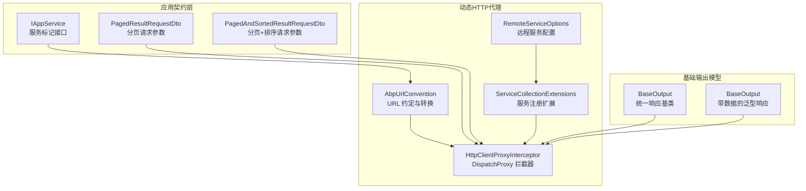
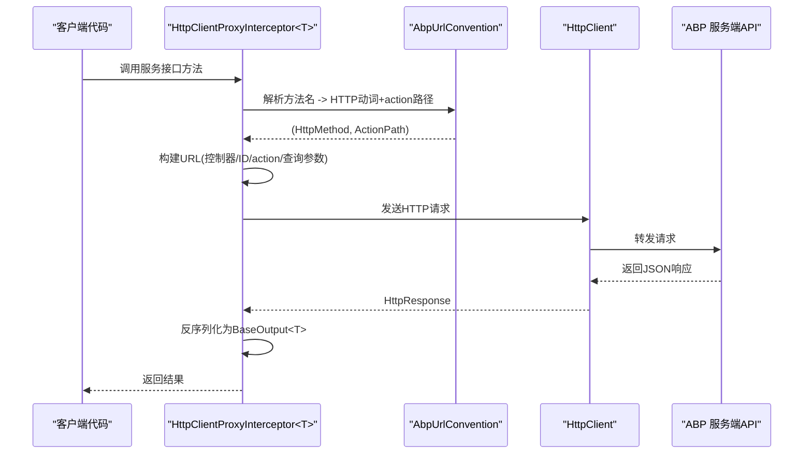
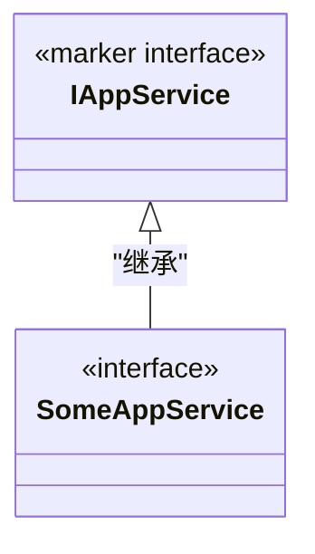
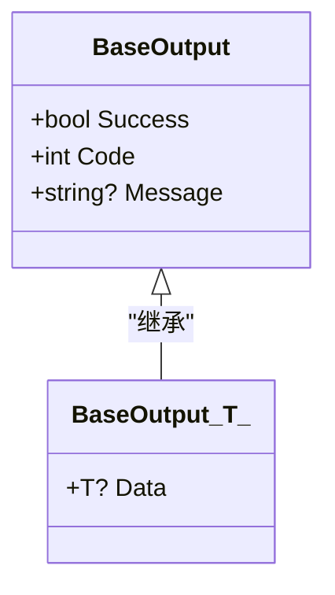
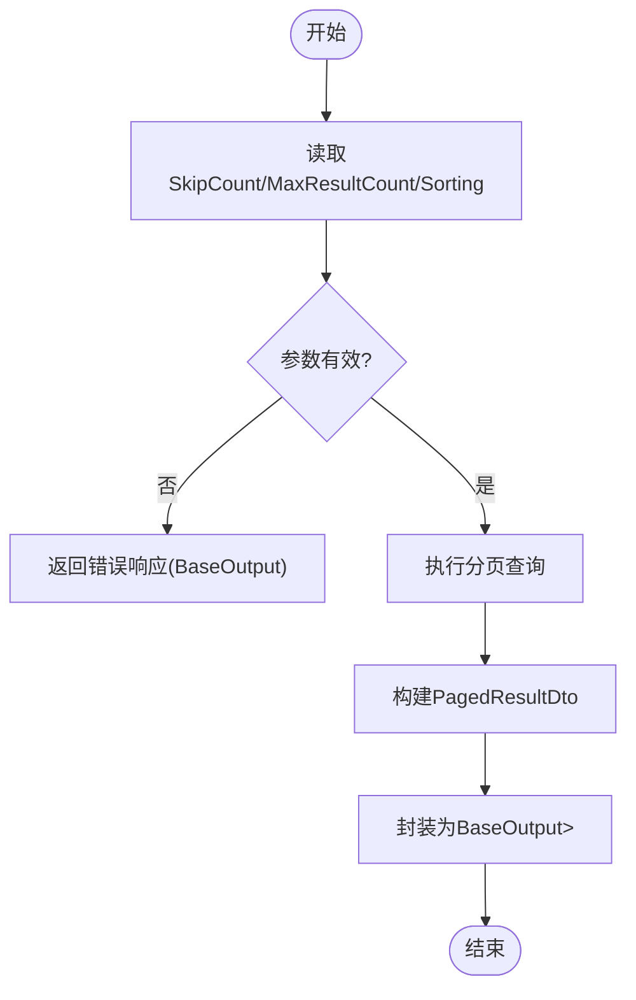
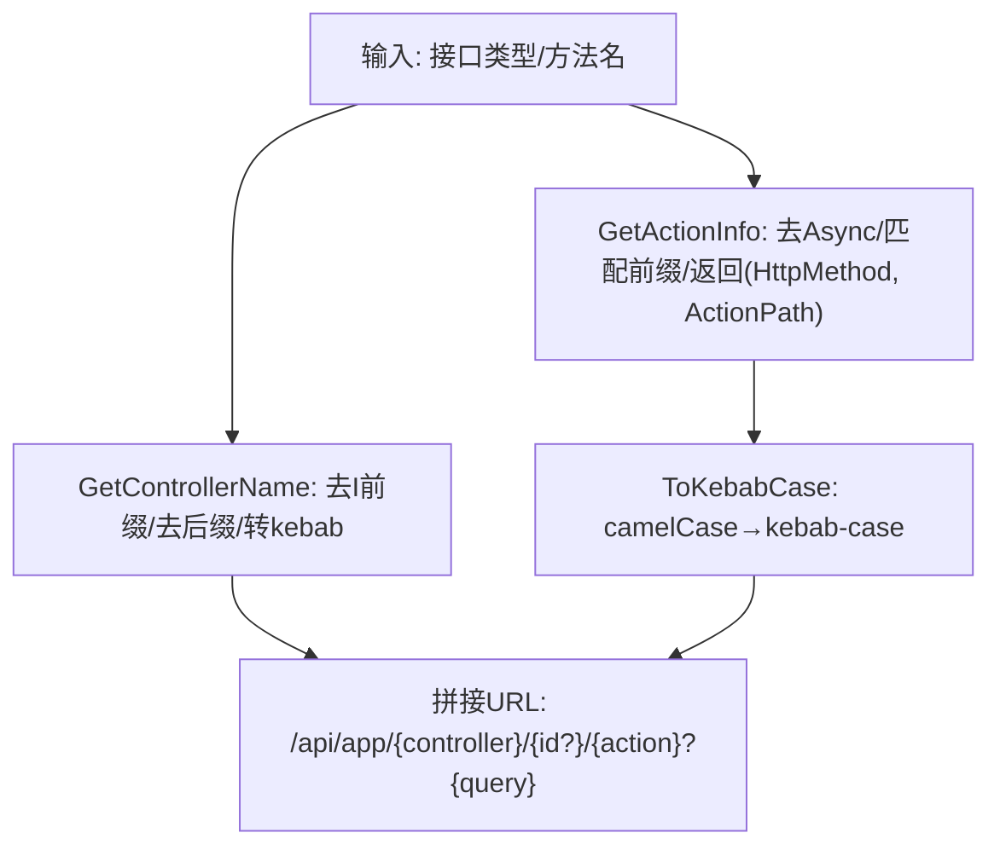
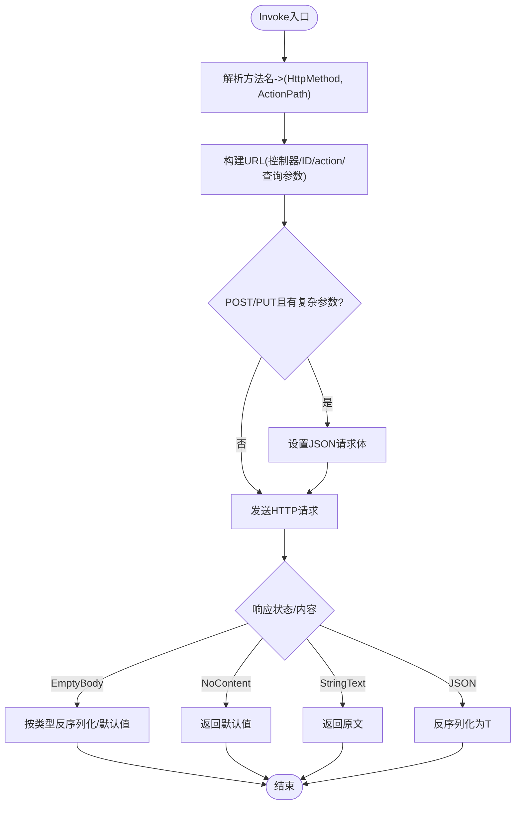
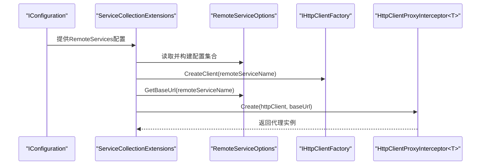
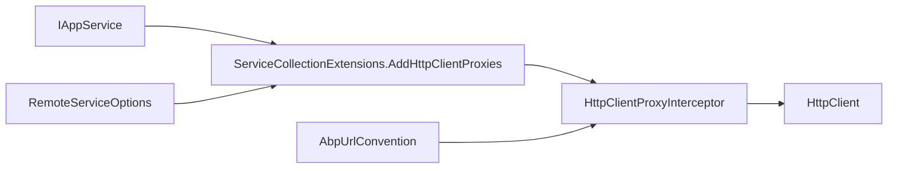
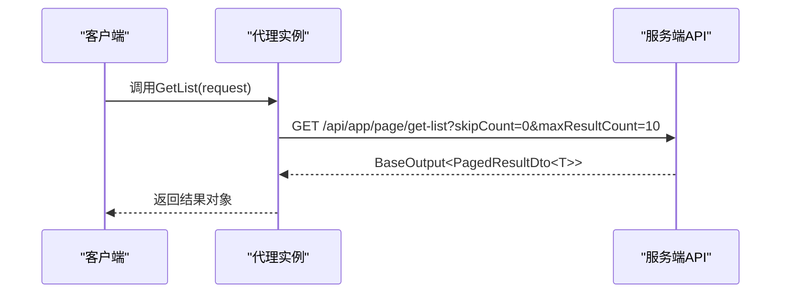

# API概览与规范

<cite>
**本文引用的文件**   
- [IAppService.cs](file://src/Utils/H.Abp.Application.Contracts/IAppService.cs)
- [PagedResultRequestDto.cs](file://src/Utils/H.Abp.Application.Contracts/PagedResultRequestDto.cs)
- [PagedAndSortedResultRequestDto.cs](file://src/Utils/H.Abp.Application.Contracts/PagedAndSortedResultRequestDto.cs)
- [BaseOutput.cs](file://src/Utils/H.Util.Base/BaseOutput.cs)
- [AbpUrlConvention.cs](file://src/Utils/H.Abp.HttpClientProxy/AbpUrlConvention.cs)
- [HttpClientProxyInterceptor.cs](file://src/Utils/H.Abp.HttpClientProxy/HttpClientProxyInterceptor.cs)
- [RemoteServiceOptions.cs](file://src/Utils/H.Abp.HttpClientProxy/RemoteServiceOptions.cs)
- [ServiceCollectionExtensions.cs](file://src/Utils/H.Abp.HttpClientProxy/ServiceCollectionExtensions.cs)
</cite>

## 目录
1. [引言](#引言)
2. [项目结构](#项目结构)
3. [核心组件](#核心组件)
4. [架构总览](#架构总览)
5. [详细组件分析](#详细组件分析)
6. [依赖关系分析](#依赖关系分析)
7. [性能考量](#性能考量)
8. [故障排查指南](#故障排查指南)
9. [结论](#结论)
10. [附录：API调用示例与最佳实践](#附录api调用示例与最佳实践)

## 引言
本规范面向 H.AppLab 平台，基于 IAppService 接口约定、统一响应模型 BaseOutput 以及动态 HTTP 代理（AbpUrlConvention + HttpClientProxyInterceptor）建立一套可维护、可扩展的 RESTful API 设计标准。文档覆盖接口命名约定、HTTP 方法映射规则、URL 路由生成机制、分页查询模式、请求响应模型使用方式、错误处理标准、版本管理策略与向后兼容性指导原则，并提供端到端调用链路示例。

## 项目结构
H.AppLab 相关 API 规范主要分布在以下三个工具包中：
- 应用契约层：IAppService、分页 DTO 等定义在 H.Abp.Application.Contracts。
- 基础输出模型：BaseOutput 及其泛型版本定义在 H.Util.Base。
- 动态 HTTP 代理：URL 转换、拦截器与服务注册扩展定义在 H.Abp.HttpClientProxy。

**图表来源**
- [IAppService.cs:1-8](file://src/Utils/H.Abp.Application.Contracts/IAppService.cs#L1-L8)
- [PagedResultRequestDto.cs:1-11](file://src/Utils/H.Abp.Application.Contracts/PagedResultRequestDto.cs#L1-L11)
- [PagedAndSortedResultRequestDto.cs:1-9](file://src/Utils/H.Abp.Application.Contracts/PagedAndSortedResultRequestDto.cs#L1-L9)
- [BaseOutput.cs:1-52](file://src/Utils/H.Util.Base/BaseOutput.cs#L1-L52)
- [AbpUrlConvention.cs:1-86](file://src/Utils/H.Abp.HttpClientProxy/AbpUrlConvention.cs#L1-L86)
- [HttpClientProxyInterceptor.cs:1-234](file://src/Utils/H.Abp.HttpClientProxy/HttpClientProxyInterceptor.cs#L1-L234)
- [RemoteServiceOptions.cs:1-33](file://src/Utils/H.Abp.HttpClientProxy/RemoteServiceOptions.cs#L1-L33)
- [ServiceCollectionExtensions.cs:1-63](file://src/Utils/H.Abp.HttpClientProxy/ServiceCollectionExtensions.cs#L1-L63)

**章节来源**
- [IAppService.cs:1-8](file://src/Utils/H.Abp.Application.Contracts/IAppService.cs#L1-L8)
- [BaseOutput.cs:1-52](file://src/Utils/H.Util.Base/BaseOutput.cs#L1-L52)
- [AbpUrlConvention.cs:1-86](file://src/Utils/H.Abp.HttpClientProxy/AbpUrlConvention.cs#L1-L86)
- [HttpClientProxyInterceptor.cs:1-234](file://src/Utils/H.Abp.HttpClientProxy/HttpClientProxyInterceptor.cs#L1-L234)
- [ServiceCollectionExtensions.cs:1-63](file://src/Utils/H.Abp.HttpClientProxy/ServiceCollectionExtensions.cs#L1-L63)

## 核心组件
- IAppService：作为所有可通过 HTTP 代理远程调用的应用服务接口的标记接口，用于扫描和自动注册客户端代理。
- BaseOutput / BaseOutput<T>：统一的 API 响应包装，包含 Success、Code、Message 字段；泛型版本还包含 Data 字段承载业务数据。
- PagedResultRequestDto / PagedAndSortedResultRequestDto：标准分页与分页排序请求参数，兼容 ABP 序列化结构。
- AbpUrlConvention：负责将 .NET 接口名与方法名转换为 ABP 风格的 URL（kebab-case），并映射 HTTP 动词。
- HttpClientProxyInterceptor：基于 DispatchProxy 的拦截器，将接口方法调用转为 HTTP 请求，自动构建 URL、参数、Body 并反序列化响应。
- ServiceCollectionExtensions：提供 AddRemoteServices 与 AddHttpClientProxies，从配置加载远程服务 BaseUrl 并扫描程序集注册代理。
- RemoteServiceOptions：读取 appsettings.json 中 RemoteServices 节点，提供按服务名获取 BaseUrl 的能力。

**章节来源**
- [IAppService.cs:1-8](file://src/Utils/H.Abp.Application.Contracts/IAppService.cs#L1-L8)
- [BaseOutput.cs:1-52](file://src/Utils/H.Util.Base/BaseOutput.cs#L1-L52)
- [PagedResultRequestDto.cs:1-11](file://src/Utils/H.Abp.Application.Contracts/PagedResultRequestDto.cs#L1-L11)
- [PagedAndSortedResultRequestDto.cs:1-9](file://src/Utils/H.Abp.Application.Contracts/PagedAndSortedResultRequestDto.cs#L1-L9)
- [AbpUrlConvention.cs:1-86](file://src/Utils/H.Abp.HttpClientProxy/AbpUrlConvention.cs#L1-L86)
- [HttpClientProxyInterceptor.cs:1-234](file://src/Utils/H.Abp.HttpClientProxy/HttpClientProxyInterceptor.cs#L1-L234)
- [ServiceCollectionExtensions.cs:1-63](file://src/Utils/H.Abp.HttpClientProxy/ServiceCollectionExtensions.cs#L1-L63)
- [RemoteServiceOptions.cs:1-33](file://src/Utils/H.Abp.HttpClientProxy/RemoteServiceOptions.cs#L1-L33)

## 架构总览
下图展示客户端通过 .NET 接口调用远端服务的完整链路：服务接口实现由服务端暴露为 ABP 风格 API；客户端通过 AddHttpClientProxies 生成的代理实例，使用 DispatchProxy 拦截方法调用，根据 AbpUrlConvention 生成 URL，并通过 HttpClient 发送请求，最后将 JSON 响应反序列化为 BaseOutput<T>。

**图表来源**
- [AbpUrlConvention.cs:1-86](file://src/Utils/H.Abp.HttpClientProxy/AbpUrlConvention.cs#L1-L86)
- [HttpClientProxyInterceptor.cs:1-234](file://src/Utils/H.Abp.HttpClientProxy/HttpClientProxyInterceptor.cs#L1-L234)

## 详细组件分析

### IAppService 接口规范
- 用途：作为“可被 HTTP 代理远程调用”的服务标记接口。
- 命名约定：建议以 “XxxAppService” 或 “XxxApplicationService” 结尾，便于 AbpUrlConvention 正确提取控制器名称。
- 扫描注册：AddHttpClientProxies 会扫描指定程序集中所有继承 IAppService 的非泛型接口，并为每个接口创建代理实现。

**图表来源**
- [IAppService.cs:1-8](file://src/Utils/H.Abp.Application.Contracts/IAppService.cs#L1-L8)
- [ServiceCollectionExtensions.cs:28-45](file://src/Utils/H.Abp.HttpClientProxy/ServiceCollectionExtensions.cs#L28-L45)

**章节来源**
- [IAppService.cs:1-8](file://src/Utils/H.Abp.Application.Contracts/IAppService.cs#L1-L8)
- [ServiceCollectionExtensions.cs:28-45](file://src/Utils/H.Abp.HttpClientProxy/ServiceCollectionExtensions.cs#L28-L45)

### BaseOutput 统一响应模型
- BaseOutput 包含三个关键字段：
  - Success：布尔值，表示请求是否成功。
  - Code：数字码，0 通常表示成功，非 0 表示失败或业务异常。
  - Message：人类可读的错误信息或提示。
- BaseOutput<T> 在此基础上增加 Data 字段承载业务数据。
- 构造函数行为：
  - 无参构造默认 Success=true。
  - 有参构造支持直接设置 code 与 message，并自动计算 Success=code==0。
  - 泛型构造支持直接传入 data，并默认 Success=true、Code=0。

**图表来源**
- [BaseOutput.cs:1-52](file://src/Utils/H.Util.Base/BaseOutput.cs#L1-L52)

**章节来源**
- [BaseOutput.cs:1-52](file://src/Utils/H.Util.Base/BaseOutput.cs#L1-L52)

### 分页查询标准模式
- PagedResultRequestDto：
  - SkipCount：跳过记录数。
  - MaxResultCount：每页最大记录数，默认 10。
- PagedAndSortedResultRequestDto：
  - 继承 PagedResultRequestDto。
  - Sorting：排序字符串（例如“name asc,age desc”）。
- 使用建议：
  - 列表查询接口应接受 PagedAndSortedResultRequestDto 作为查询参数。
  - 分页结果建议使用 BaseOutput<PagedResultDto<T>> 返回，保持与 ABP 一致的序列化结构。

**图表来源**
- [PagedResultRequestDto.cs:1-11](file://src/Utils/H.Abp.Application.Contracts/PagedResultRequestDto.cs#L1-L11)
- [PagedAndSortedResultRequestDto.cs:1-9](file://src/Utils/H.Abp.Application.Contracts/PagedAndSortedResultRequestDto.cs#L1-L9)

**章节来源**
- [PagedResultRequestDto.cs:1-11](file://src/Utils/H.Abp.Application.Contracts/PagedResultRequestDto.cs#L1-L11)
- [PagedAndSortedResultRequestDto.cs:1-9](file://src/Utils/H.Abp.Application.Contracts/PagedAndSortedResultRequestDto.cs#L1-L9)

### 动态 HTTP 代理工作原理

#### AbpUrlConvention URL 转换逻辑
- 控制器名称提取：
  - 去除 I 前缀。
  - 去除 AppService 或 ApplicationService 后缀。
  - 将剩余部分转换为 kebab-case（如 IPageAppService → page）。
- HTTP 动词与方法路径映射：
  - 支持 GetList、GetAll、Get、Put、Update、Delete、Remove、Create、Add、Insert、Post、Patch 等前缀。
  - 无前缀匹配时默认 POST，并将完整方法名转为 action 路径。
- kebab-case 转换：
  - 先将首字母小写，再在小写字母/数字与大写字母之间插入连字符，最终全部小写。

**图表来源**
- [AbpUrlConvention.cs:1-86](file://src/Utils/H.Abp.HttpClientProxy/AbpUrlConvention.cs#L1-L86)

**章节来源**
- [AbpUrlConvention.cs:1-86](file://src/Utils/H.Abp.HttpClientProxy/AbpUrlConvention.cs#L1-L86)

#### HttpClientProxyInterceptor 拦截机制
- 初始化：
  - 注入 HttpClient 与 baseUrl。
  - 通过 AbpUrlConvention.GetControllerName 计算控制器名。
- Invoke 流程：
  - 解析目标方法名得到 HttpMethod 与 ActionPath。
  - 构建 URL：
    - 首个简单类型且名为 id 的参数放入路径，位于 action 之前。
    - 若存在恰好一个以 Id 结尾的简单类型参数（非 id 本身），放入路径，位于 action 之后。
    - 其他简单参数转为查询字符串；GET/DELETE 的复杂参数展开属性到查询参数。
  - Body 构建：
    - POST/PUT 且有复杂类型参数时，将该参数序列化为 JSON 放入请求体。
  - 返回值处理：
    - 返回 Task 时直接发送请求。
    - 返回 Task<T> 时将响应体反序列化为 T；对 string 纯文本响应进行特殊处理。
    - NoContent 返回默认值；空响应体按类型返回默认值。

**图表来源**
- [HttpClientProxyInterceptor.cs:1-234](file://src/Utils/H.Abp.HttpClientProxy/HttpClientProxyInterceptor.cs#L1-L234)

**章节来源**
- [HttpClientProxyInterceptor.cs:1-234](file://src/Utils/H.Abp.HttpClientProxy/HttpClientProxyInterceptor.cs#L1-L234)

### 服务注册与配置
- AddRemoteServices：
  - 从 IConfiguration 的 RemoteServices 节点读取配置，构建 RemoteServiceOptions。
- AddHttpClientProxies：
  - 扫描指定程序集中所有继承 IAppService 的接口，为每个接口创建代理实现。
  - 代理实例通过 HttpClientFactory.CreateClient(remoteServiceName) 创建，并使用 RemoteServiceOptions.GetBaseUrl(remoteServiceName) 获取 BaseUrl。
- RemoteServiceOptions：
  - 提供字典式访问与 Configure/GetBaseUrl 方法，支持忽略大小写的服务名。

**图表来源**
- [ServiceCollectionExtensions.cs:1-63](file://src/Utils/H.Abp.HttpClientProxy/ServiceCollectionExtensions.cs#L1-L63)
- [RemoteServiceOptions.cs:1-33](file://src/Utils/H.Abp.HttpClientProxy/RemoteServiceOptions.cs#L1-L33)

**章节来源**
- [ServiceCollectionExtensions.cs:1-63](file://src/Utils/H.Abp.HttpClientProxy/ServiceCollectionExtensions.cs#L1-L63)
- [RemoteServiceOptions.cs:1-33](file://src/Utils/H.Abp.HttpClientProxy/RemoteServiceOptions.cs#L1-L33)

## 依赖关系分析
- IAppService 被 ServiceCollectionExtensions 扫描，用于发现可代理的服务接口。
- AbpUrlConvention 被 HttpClientProxyInterceptor 调用，用于 URL 与 HTTP 动词转换。
- HttpClientProxyInterceptor 依赖 HttpClient 发送请求，并依赖 System.Text.Json 进行序列化/反序列化。
- ServiceCollectionExtensions 依赖 IConfiguration 与 IHttpClientFactory，并组合 RemoteServiceOptions 提供 BaseUrl。

**图表来源**
- [ServiceCollectionExtensions.cs:1-63](file://src/Utils/H.Abp.HttpClientProxy/ServiceCollectionExtensions.cs#L1-L63)
- [HttpClientProxyInterceptor.cs:1-234](file://src/Utils/H.Abp.HttpClientProxy/HttpClientProxyInterceptor.cs#L1-L234)
- [AbpUrlConvention.cs:1-86](file://src/Utils/H.Abp.HttpClientProxy/AbpUrlConvention.cs#L1-L86)
- [RemoteServiceOptions.cs:1-33](file://src/Utils/H.Abp.HttpClientProxy/RemoteServiceOptions.cs#L1-L33)

**章节来源**
- [ServiceCollectionExtensions.cs:1-63](file://src/Utils/H.Abp.HttpClientProxy/ServiceCollectionExtensions.cs#L1-L63)
- [HttpClientProxyInterceptor.cs:1-234](file://src/Utils/H.Abp.HttpClientProxy/HttpClientProxyInterceptor.cs#L1-L234)
- [AbpUrlConvention.cs:1-86](file://src/Utils/H.Abp.HttpClientProxy/AbpUrlConvention.cs#L1-L86)
- [RemoteServiceOptions.cs:1-33](file://src/Utils/H.Abp.HttpClientProxy/RemoteServiceOptions.cs#L1-L33)

## 性能考量
- 代理开销：DispatchProxy 与反射会带来轻微运行时开销，建议在启动阶段完成服务扫描与代理注册，避免重复反射。
- JSON 序列化：使用统一的 JsonSerializerOptions（驼峰命名、大小写不敏感），减少序列化成本与歧义。
- 连接复用：通过 IHttpClientFactory 管理 HttpClient 生命周期，避免频繁创建销毁连接。
- 分页优化：合理使用 SkipCount 与 MaxResultCount，避免过大分页导致数据库压力；后端应配合索引优化查询性能。

[本节为通用性能指导，不涉及具体源码分析]

## 故障排查指南
- 返回类型不支持：
  - 当方法返回类型既不是 Task 也不是 Task<T> 时，会抛出 NotSupportedException。请确保所有公开接口方法返回异步类型。
- 响应为空或文本：
  - NoContent 将返回默认值；空响应体会按类型返回默认值；纯文本响应（text/*）对 string 类型直接返回原文。
- URL 路由不匹配：
  - 检查接口命名是否符合 AppService/ApplicationService 后缀约定；检查方法名前缀是否与支持的 HTTP 动词映射一致；确认 id 与 Id 参数的命名与顺序符合约定。
- 配置缺失：
  - 如果 RemoteServices 节点未配置对应服务名的 BaseUrl，则 GetBaseUrl 返回空字符串，可能导致 URL 不正确。请在配置文件中添加 RemoteServices 节点。

**章节来源**
- [HttpClientProxyInterceptor.cs:1-234](file://src/Utils/H.Abp.HttpClientProxy/HttpClientProxyInterceptor.cs#L1-L234)
- [RemoteServiceOptions.cs:1-33](file://src/Utils/H.Abp.HttpClientProxy/RemoteServiceOptions.cs#L1-L33)

## 结论
H.AppLab 平台的 API 规范以 IAppService 为核心标记接口，结合 BaseOutput 统一响应模型与动态 HTTP 代理机制，实现了从 .NET 接口到 ABP 风格 RESTful API 的无缝对接。通过标准化的命名约定、HTTP 方法映射、URL 生成与分页查询模式，开发者可以以最小成本构建可维护、可扩展的后端服务，并在客户端获得类型安全、易于使用的代理调用体验。

[本节为总结性内容，不涉及具体源码分析]

## 附录：API调用示例与最佳实践

### 接口命名与HTTP方法映射
- 接口命名：
  - 推荐使用 XxxAppService 或 XxxApplicationService 结尾。
- 方法命名与前缀映射：
  - GetList/GetAll/Get → GET
  - Put/Update → PUT
  - Delete/Remove → DELETE
  - Create/Add/Insert/Post → POST
  - Patch → PATCH
  - 无前缀 → 默认 POST，并将完整方法名转为 action 路径。

**章节来源**
- [AbpUrlConvention.cs:1-86](file://src/Utils/H.Abp.HttpClientProxy/AbpUrlConvention.cs#L1-L86)

### URL路由生成机制
- 控制器名称：
  - 去除 I 前缀与 AppService/ApplicationService 后缀后转 kebab-case。
- ID 参数：
  - 首个简单类型且名为 id 的参数放在 action 之前。
  - 若存在恰好一个以 Id 结尾的简单类型参数，放在 action 之后。
- 查询参数：
  - 简单类型参数转为查询字符串；GET/DELETE 的复杂参数展开属性到查询参数。

**章节来源**
- [AbpUrlConvention.cs:1-86](file://src/Utils/H.Abp.HttpClientProxy/AbpUrlConvention.cs#L1-L86)
- [HttpClientProxyInterceptor.cs:1-234](file://src/Utils/H.Abp.HttpClientProxy/HttpClientProxyInterceptor.cs#L1-L234)

### 统一响应模型使用场景
- BaseOutput：
  - 适用于无业务数据返回的操作，如删除、更新状态等。
  - Success=true、Code=0 表示成功；Success=false、Code!=0 表示失败，Message 描述原因。
- BaseOutput<T>：
  - 适用于需要返回业务数据的操作，Data 字段承载实体或 DTO。
  - 推荐分页查询返回 BaseOutput<PagedResultDto<T>>。

**章节来源**
- [BaseOutput.cs:1-52](file://src/Utils/H.Util.Base/BaseOutput.cs#L1-L52)

### 分页查询最佳实践
- 请求参数：
  - 使用 PagedAndSortedResultRequestDto，明确 SkipCount、MaxResultCount、Sorting。
- 后端实现：
  - 校验参数范围（如 MaxResultCount 上限），避免过大分页。
  - 使用数据库分页与排序，结合索引提升性能。
- 客户端消费：
  - 检查 BaseOutput.Success 与 Code，必要时显示 Message。
  - 从 Data 字段获取分页结果，并渲染 UI。

**章节来源**
- [PagedResultRequestDto.cs:1-11](file://src/Utils/H.Abp.Application.Contracts/PagedResultRequestDto.cs#L1-L11)
- [PagedAndSortedResultRequestDto.cs:1-9](file://src/Utils/H.Abp.Application.Contracts/PagedAndSortedResultRequestDto.cs#L1-L9)

### 完整API调用示例（端到端）
- 客户端：
  - 通过 AddHttpClientProxies 注册代理，注入服务接口。
  - 调用服务接口方法，如 GetList、Get、Create、Update、Delete。
- 代理：
  - 解析方法名，生成 URL 与 HTTP 方法。
  - 构建请求体与查询参数，发送 HTTP 请求。
- 服务端：
  - ABP 框架接收请求，路由到对应控制器方法。
  - 返回 BaseOutput<T> JSON 响应。
- 客户端处理：
  - 反序列化为 BaseOutput<T>，检查 Success/Code/Message，读取 Data。

**图表来源**
- [HttpClientProxyInterceptor.cs:1-234](file://src/Utils/H.Abp.HttpClientProxy/HttpClientProxyInterceptor.cs#L1-L234)
- [AbpUrlConvention.cs:1-86](file://src/Utils/H.Abp.HttpClientProxy/AbpUrlConvention.cs#L1-L86)

### 错误处理标准
- 成功：
  - Success=true，Code=0，Message可为空或提示语。
- 失败：
  - Success=false，Code!=0，Message包含错误详情。
- 业务异常：
  - 在服务端抛出业务异常，统一捕获后返回 BaseOutput，携带错误码与消息。

**章节来源**
- [BaseOutput.cs:1-52](file://src/Utils/H.Util.Base/BaseOutput.cs#L1-L52)

### 版本管理与向后兼容性
- 版本化策略：
  - 建议在 URL 中引入版本前缀（如 /v1/api/app/...），或在请求头中携带版本号。
  - 通过服务端路由约束与控制器命名空间隔离不同版本。
- 向后兼容：
  - 新增字段时应保持可选，避免破坏旧客户端。
  - 废弃字段应保留一段时间并给出弃用提示。
  - 重大变更通过新版本 API 发布，旧版本逐步下线。

[本节为通用指导，不涉及具体源码分析]