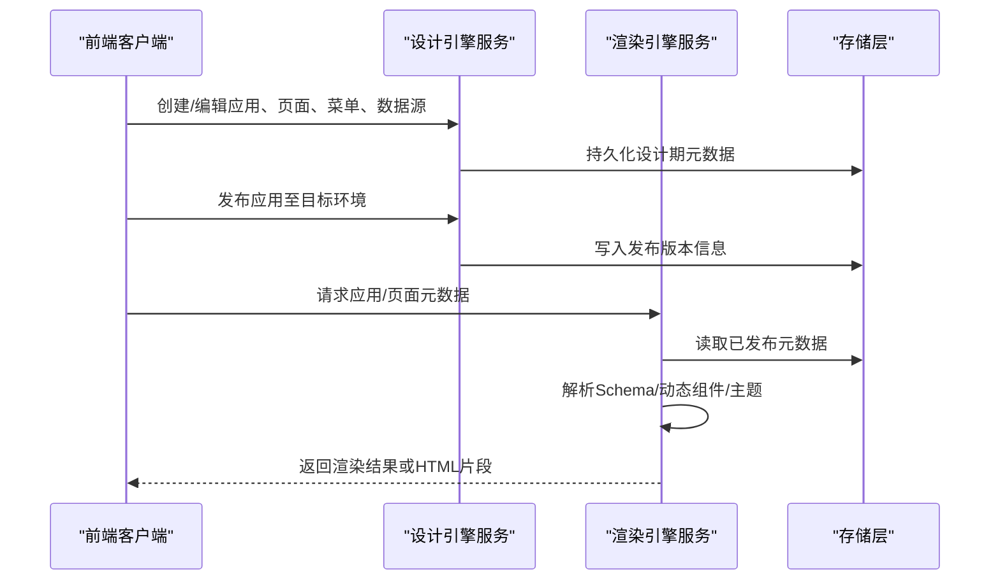
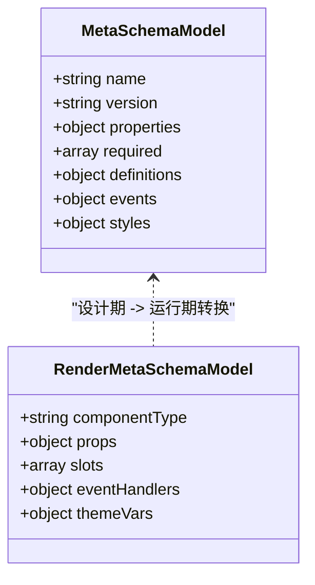
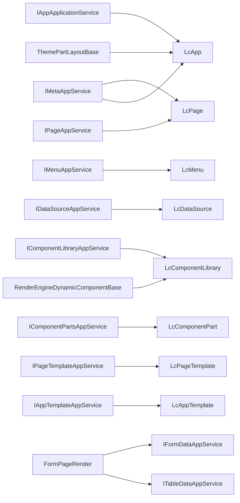

# 低代码平台API

<cite>
**本文引用的文件**   
- [H.LowCode.DesignEngine.Application.Contracts/AppServices/IAppApplicationService.cs](file://src/src/LowCode/DesignEngine/H.LowCode.DesignEngine.Application.Contracts/AppServices/IAppApplicationService.cs)
- [H.LowCode.DesignEngine.Application.Contracts/AppServices/IPageAppService.cs](file://src/src/LowCode/DesignEngine/H.LowCode.DesignEngine.Application.Contracts/AppServices/IPageAppService.cs)
- [H.LowCode.DesignEngine.Application.Contracts/AppServices/IMenuAppService.cs](file://src/src/LowCode/DesignEngine/H.LowCode.DesignEngine.Application.Contracts/AppServices/IMenuAppService.cs)
- [H.LowCode.DesignEngine.Application.Contracts/AppServices/IDataSourceAppService.cs](file://src/src/LowCode/DesignEngine/H.LowCode.DesignEngine.Application.Contracts/AppServices/IDataSourceAppService.cs)
- [H.LowCode.DesignEngine.Application.Contracts/AppServices/IAppPublishAppService.cs](file://src/src/LowCode/DesignEngine/H.LowCode.DesignEngine.Application.Contracts/AppServices/IAppPublishAppService.cs)
- [H.LowCode.DesignEngine.Application.Contracts/AppServices/IAppRbacAppService.cs](file://src/src/LowCode/DesignEngine/H.LowCode.DesignEngine.Application.Contracts/AppServices/IAppRbacAppService.cs)
- [H.LowCode.DesignEngine.Application.Contracts/PartsAppServices/IComponentLibraryAppService.cs](file://src/src/LowCode/DesignEngine/H.LowCode.DesignEngine.Application.Contracts/PartsAppServices/IComponentLibraryAppService.cs)
- [H.LowCode.DesignEngine.Application.Contracts/PartsAppServices/IComponentPartsAppService.cs](file://src/src/LowCode/DesignEngine/H.LowCode.DesignEngine.Application.Contracts/PartsAppServices/IComponentPartsAppService.cs)
- [H.LowCode.DesignEngine.Application.Contracts/PartsAppServices/IPageTemplateAppService.cs](file://src/src/LowCode/DesignEngine/H.LowCode.DesignEngine.Application.Contracts/PartsAppServices/IPageTemplateAppService.cs)
- [H.LowCode.DesignEngine.Application.Contracts/PartsAppServices/IAppTemplateAppService.cs](file://src/src/LowCode/DesignEngine/H.LowCode.DesignEngine.Application.Contracts/PartsAppServices/IAppTemplateAppService.cs)
- [H.LowCode.RenderEngine.Application.Contracts/RenderAppServices/IMetaAppService.cs](file://src/src/LowCode/RenderEngine/H.LowCode.RenderEngine.Application.Contracts/RenderAppServices/IMetaAppService.cs)
- [H.LowCode.Common.Application.Contracts/AppServices/IFormValidationAppService.cs](file://src/src/LowCode/Common/H.LowCode.Application.Contracts/AppServices/IFormValidationAppService.cs)
- [H.LowCode.Common.Application.Contracts/AppServices/IFormDataAppService.cs](file://src/src/LowCode/Common/H.LowCode.Application.Contracts/AppServices/IFormDataAppService.cs)
- [H.LowCode.Common.Application.Contracts/AppServices/ITableDataAppService.cs](file://src/src/LowCode/Common/H.LowCode.Application.Contracts/AppServices/ITableDataAppService.cs)
- [H.LowCode.MetaSchema.DesignEngine/Models/MetaSchemaModel.cs](file://src/src/LowCode/Common/H.LowCode.MetaSchema.DesignEngine/Models/MetaSchemaModel.cs)
- [H.LowCode.MetaSchema.RenderEngine/Models/RenderMetaSchemaModel.cs](file://src/src/LowCode/Common/H.LowCode.MetaSchema.RenderEngine/Models/RenderMetaSchemaModel.cs)
- [H.LowCode.Entity/Entities/LcApp.cs](file://src/src/LowCode/Common/H.LowCode.Entity/Entities/LcApp.cs)
- [H.LowCode.Entity/Entities/LcPage.cs](file://src/src/LowCode/Common/H.LowCode.Entity/Entities/LcPage.cs)
- [H.LowCode.Entity/Entities/LcMenu.cs](file://src/src/LowCode/Common/H.LowCode.Entity/Entities/LcMenu.cs)
- [H.LowCode.Entity/Entities/LcDataSource.cs](file://src/src/LowCode/Common/H.LowCode.Entity/Entities/LcDataSource.cs)
- [H.LowCode.Entity/Entities/LcComponentLibrary.cs](file://src/src/LowCode/Common/H.LowCode.Entity/Entities/LcComponentLibrary.cs)
- [H.LowCode.Entity/Entities/LcComponentPart.cs](file://src/src/LowCode/Common/H.LowCode.Entity/Entities/LcComponentPart.cs)
- [H.LowCode.Entity/Entities/LcPageTemplate.cs](file://src/src/LowCode/Common/H.LowCode.Entity/Entities/LcPageTemplate.cs)
- [H.LowCode.Entity/Entities/LcAppTemplate.cs](file://src/src/LowCode/Common/H.LowCode.Entity/Entities/LcAppTemplate.cs)
- [H.LowCode.RenderEngineBase/RenderEngineDynamicComponentBase.cs](file://src/src/LowCode/RenderEngine/H.LowCode.RenderEngineBase/RenderEngineDynamicComponentBase.cs)
- [H.LowCode.RenderEngineBase/Layout/ThemePartLayoutBase.cs](file://src/src/LowCode/RenderEngine/H.LowCode.RenderEngineBase/Layout/ThemePartLayoutBase.cs)
- [H.LowCode.RenderEngine/DataAppServices/FormPageRender.razor](file://src/src/LowCode/RenderEngine/H.LowCode.RenderEngine/PageRender/FormPageRender.razor)
- [AbpUrlConvention.cs](file://src/src/Utils/H.Abp.HttpClientProxy/AbpUrlConvention.cs)
</cite>

## 目录
1. [引言](#引言)
2. [项目结构](#项目结构)
3. [核心组件](#核心组件)
4. [架构总览](#架构总览)
5. [详细接口定义](#详细接口定义)
6. [依赖关系分析](#依赖关系分析)
7. [性能与可扩展性](#性能与可扩展性)
8. [排错指南](#排错指南)
9. [结论](#结论)
10. [附录：调用示例与开发规范](#附录调用示例与开发规范)

## 引言
本文件面向 H.AppLab 平台的低代码服务，系统性整理设计引擎、渲染引擎与元数据 Schema 相关的 RESTful API。文档基于后端应用服务契约、领域实体、渲染引擎运行时以及前端客户端约定进行归纳，重点覆盖：
- 设计引擎：页面、菜单、应用、数据源、组件库、模板等管理接口
- 渲染引擎：应用与页面元数据读取、动态组件渲染、主题装配接口
- 元数据 Schema：Schema 定义、验证规则、数据绑定模型
- 发布部署：应用发布、版本与运行态隔离策略
- 安全机制：RBAC、租户与应用边界隔离

说明：本文档不直接粘贴具体请求体或响应体的源码内容，而是给出字段语义、类型与约束；若需精确 DTO 定义，请参考“本文引用的文件”中列出的契约类。

## 项目结构
低代码平台由三大部分组成：
- 设计引擎：提供应用、页面、菜单、数据源、组件库与模板的建模与编排能力
- 渲染引擎：提供应用与页面的运行时渲染、动态组件解析与主题切换能力
- 元数据与公共契约：跨引擎共享的 Schema、基础实体与通用数据访问接口

```mermaid
graph TB
    subgraph "设计引擎"
        AppSvc["应用服务<br/>IAppApplicationService"]
        PageSvc["页面服务<br/>IPageAppService"]
        MenuSvc["菜单服务<br/>IMenuAppService"]
        DsSvc["数据源服务<br/>IDataSourceAppService"]
        PubSvc["发布服务<br/>IAppPublishAppService"]
        RbacSvc["权限服务<br/>IAppRbacAppService"]
        CompLibSvc["组件库服务<br/>IComponentLibraryAppService"]
        PartSvc["部件服务<br/>IComponentPartsAppService"]
        PageTplSvc["页面模板服务<br/>IPageTemplateAppService"]
        AppTplSvc["应用模板服务<br/>IAppTemplateAppService"]
    end

    subgraph "渲染引擎"
        MetaSvc["元数据服务<br/>IMetaAppService"]
        DynamicComp["动态组件基类<br/>RenderEngineDynamicComponentBase"]
        ThemeLayout["主题布局基类<br/>ThemePartLayoutBase"]
        FormPage["表单页渲染器<br/>FormPageRender"]
    end

    subgraph "公共契约与实体"
        LcApp["LcApp"]
        LcPage["LcPage"]
        LcMenu["LcMenu"]
        LcDs["LcDataSource"]
        LcCompLib["LcComponentLibrary"]
        LcCompPart["LcComponentPart"]
        LcPageTpl["LcPageTemplate"]
        LcAppTpl["LcAppTemplate"]
        FormVal["IFormValidationAppService"]
        FormData["IFormDataAppService"]
        TableData["ITableDataAppService"]
        MetaModel["MetaSchemaModel"]
        RenderMeta["RenderMetaSchemaModel"]
    end

    AppSvc --> LcApp
    PageSvc --> LcPage
    MenuSvc --> LcMenu
    DsSvc --> LcDs
    CompLibSvc --> LcCompLib
    PartSvc --> LcCompPart
    PageTplSvc --> LcPageTpl
    AppTplSvc --> LcAppTpl

    MetaSvc --> LcApp
    MetaSvc --> LcPage
    MetaSvc --> RenderMeta

    DynamicComp --> LcCompLib
    DynamicComp --> RenderMeta
    ThemeLayout --> RenderMeta
    FormPage --> FormData
    FormPage --> TableData

    AppSvc --> PubSvc
    AppSvc --> RbacSvc
    PageSvc --> CompLibSvc
```

图表来源
- [H.LowCode.DesignEngine.Application.Contracts/AppServices/IAppApplicationService.cs](file://src/src/LowCode/DesignEngine/H.LowCode.DesignEngine.Application.Contracts/AppServices/IAppApplicationService.cs)
- [H.LowCode.RenderEngine.Application.Contracts/RenderAppServices/IMetaAppService.cs](file://src/src/LowCode/RenderEngine/H.LowCode.RenderEngine.Application.Contracts/RenderAppServices/IMetaAppService.cs)
- [H.LowCode.RenderEngineBase/RenderEngineDynamicComponentBase.cs](file://src/src/LowCode/RenderEngine/H.LowCode.RenderEngineBase/RenderEngineDynamicComponentBase.cs)
- [H.LowCode.RenderEngineBase/Layout/ThemePartLayoutBase.cs](file://src/src/LowCode/RenderEngine/H.LowCode.RenderEngineBase/Layout/ThemePartLayoutBase.cs)
- [H.LowCode.RenderEngine/DataAppServices/FormPageRender.razor](file://src/src/LowCode/RenderEngine/H.LowCode.RenderEngine/PageRender/FormPageRender.razor)
- [H.LowCode.Entity/Entities/LcApp.cs](file://src/src/LowCode/Common/H.LowCode.Entity/Entities/LcApp.cs)
- [H.LowCode.Entity/Entities/LcPage.cs](file://src/src/LowCode/Common/H.LowCode.Entity/Entities/LcPage.cs)
- [H.LowCode.Entity/Entities/LcMenu.cs](file://src/src/LowCode/Common/H.LowCode.Entity/Entities/LcMenu.cs)
- [H.LowCode.Entity/Entities/LcDataSource.cs](file://src/src/LowCode/Common/H.LowCode.Entity/Entities/LcDataSource.cs)
- [H.LowCode.Entity/Entities/LcComponentLibrary.cs](file://src/src/LowCode/Common/H.LowCode.Entity/Entities/LcComponentLibrary.cs)
- [H.LowCode.Entity/Entities/LcComponentPart.cs](file://src/src/LowCode/Common/H.LowCode.Entity/Entities/LcComponentPart.cs)
- [H.LowCode.Entity/Entities/LcPageTemplate.cs](file://src/src/LowCode/Common/H.LowCode.Entity/Entities/LcPageTemplate.cs)
- [H.LowCode.Entity/Entities/LcAppTemplate.cs](file://src/src/LowCode/Common/H.LowCode.Entity/Entities/LcAppTemplate.cs)

章节来源
- [AbpUrlConvention.cs](file://src/src/Utils/H.Abp.HttpClientProxy/AbpUrlConvention.cs)

## 核心组件
- 设计引擎应用服务
  - IAppApplicationService：应用生命周期管理（创建、更新、删除、查询、克隆）
  - IPageAppService：页面建模（节点树、属性、事件、样式、路由）
  - IMenuAppService：菜单建模与层级组织
  - IDataSourceAppService：数据源配置（表、API、SQL、缓存）
  - IAppPublishAppService：应用发布与版本管理
  - IAppRbacAppService：应用级角色与权限分配
- 部件与模板服务
  - IComponentLibraryAppService：组件库管理（命名空间、资产、依赖）
  - IComponentPartsAppService：组件部件（可复用片段、插槽、参数）
  - IPageTemplateAppService / IAppTemplateAppService：页面与应用模板
- 渲染引擎
  - IMetaAppService：应用与页面元数据读取、Schema 解析
  - RenderEngineDynamicComponentBase：动态组件解析与渲染基类
  - ThemePartLayoutBase：主题与布局装配
  - FormPageRender：表单页数据加载、校验与提交
- 通用数据与验证
  - IFormValidationAppService：Schema 驱动表单校验
  - IFormDataAppService：表单数据读写与绑定
  - ITableDataAppService：表格数据分页、过滤、排序

章节来源
- [H.LowCode.DesignEngine.Application.Contracts/AppServices/IAppApplicationService.cs](file://src/src/LowCode/DesignEngine/H.LowCode.DesignEngine.Application.Contracts/AppServices/IAppApplicationService.cs)
- [H.LowCode.DesignEngine.Application.Contracts/AppServices/IPageAppService.cs](file://src/src/LowCode/DesignEngine/H.LowCode.DesignEngine.Application.Contracts/AppServices/IPageAppService.cs)
- [H.LowCode.DesignEngine.Application.Contracts/AppServices/IMenuAppService.cs](file://src/src/LowCode/DesignEngine/H.LowCode.DesignEngine.Application.Contracts/AppServices/IMenuAppService.cs)
- [H.LowCode.DesignEngine.Application.Contracts/AppServices/IDataSourceAppService.cs](file://src/src/LowCode/DesignEngine/H.LowCode.DesignEngine.Application.Contracts/AppServices/IDataSourceAppService.cs)
- [H.LowCode.DesignEngine.Application.Contracts/AppServices/IAppPublishAppService.cs](file://src/src/LowCode/DesignEngine/H.LowCode.DesignEngine.Application.Contracts/AppServices/IAppPublishAppService.cs)
- [H.LowCode.DesignEngine.Application.Contracts/AppServices/IAppRbacAppService.cs](file://src/src/LowCode/DesignEngine/H.LowCode.DesignEngine.Application.Contracts/AppServices/IAppRbacAppService.cs)
- [H.LowCode.DesignEngine.Application.Contracts/PartsAppServices/IComponentLibraryAppService.cs](file://src/src/LowCode/DesignEngine/H.LowCode.DesignEngine.Application.Contracts/PartsAppServices/IComponentLibraryAppService.cs)
- [H.LowCode.DesignEngine.Application.Contracts/PartsAppServices/IComponentPartsAppService.cs](file://src/src/LowCode/DesignEngine/H.LowCode.DesignEngine.Application.Contracts/PartsAppServices/IComponentPartsAppService.cs)
- [H.LowCode.DesignEngine.Application.Contracts/PartsAppServices/IPageTemplateAppService.cs](file://src/src/LowCode/DesignEngine/H.LowCode.DesignEngine.Application.Contracts/PartsAppServices/IPageTemplateAppService.cs)
- [H.LowCode.DesignEngine.Application.Contracts/PartsAppServices/IAppTemplateAppService.cs](file://src/src/LowCode/DesignEngine/H.LowCode.DesignEngine.Application.Contracts/PartsAppServices/IAppTemplateAppService.cs)
- [H.LowCode.RenderEngine.Application.Contracts/RenderAppServices/IMetaAppService.cs](file://src/src/LowCode/RenderEngine/H.LowCode.RenderEngine.Application.Contracts/RenderAppServices/IMetaAppService.cs)
- [H.LowCode.Common.Application.Contracts/AppServices/IFormValidationAppService.cs](file://src/src/LowCode/Common/H.LowCode.Application.Contracts/AppServices/IFormValidationAppService.cs)
- [H.LowCode.Common.Application.Contracts/AppServices/IFormDataAppService.cs](file://src/src/LowCode/Common/H.LowCode.Application.Contracts/AppServices/IFormDataAppService.cs)
- [H.LowCode.Common.Application.Contracts/AppServices/ITableDataAppService.cs](file://src/src/LowCode/Common/H.LowCode.Application.Contracts/AppServices/ITableDataAppService.cs)

## 架构总览
低代码平台采用“设计时-运行时”解耦的双引擎架构：
- 设计时：通过设计引擎提供的 CRUD 接口完成页面、组件、数据源的建模与编排
- 运行时：渲染引擎根据已发布的页面元数据，动态解析并渲染组件，结合主题与数据源提供最终视图

图表来源
- [H.LowCode.DesignEngine.Application.Contracts/AppServices/IAppApplicationService.cs](file://src/src/LowCode/DesignEngine/H.LowCode.DesignEngine.Application.Contracts/AppServices/IAppApplicationService.cs)
- [H.LowCode.DesignEngine.Application.Contracts/AppServices/IPageAppService.cs](file://src/src/LowCode/DesignEngine/H.LowCode.DesignEngine.Application.Contracts/AppServices/IPageAppService.cs)
- [H.LowCode.RenderEngine.Application.Contracts/RenderAppServices/IMetaAppService.cs](file://src/src/LowCode/RenderEngine/H.LowCode.RenderEngine.Application.Contracts/RenderAppServices/IMetaAppService.cs)

## 详细接口定义

### 设计引擎 API

#### 应用管理 IAppApplicationService
- 主要职责：应用的创建、更新、删除、查询、克隆、状态管理
- 典型端点语义
  - POST /api/applications：创建应用
  - PUT /api/applications/{id}：更新应用
  - DELETE /api/applications/{id}：删除应用
  - GET /api/applications/{id}：获取应用详情
  - GET /api/applications：分页列表
  - POST /api/applications/{id}/clone：克隆应用
- 关键入参与出参字段（概念说明）
  - 应用标识、名称、描述、图标、租户ID、创建/更新时间
  - 状态：草稿、已发布、已下线
  - 扩展属性：环境变量、路由前缀、鉴权开关
- 错误码建议：400（参数非法）、404（不存在）、403（无权限）、409（冲突）

章节来源
- [H.LowCode.DesignEngine.Application.Contracts/AppServices/IAppApplicationService.cs](file://src/src/LowCode/DesignEngine/H.LowCode.DesignEngine.Application.Contracts/AppServices/IAppApplicationService.cs)
- [H.LowCode.Entity/Entities/LcApp.cs](file://src/src/LowCode/Common/H.LowCode.Entity/Entities/LcApp.cs)

#### 页面管理 IPageAppService
- 主要职责：页面节点树、属性面板、事件绑定、样式、路由
- 典型端点语义
  - POST /api/pages：创建页面
  - PUT /api/pages/{id}：更新页面
  - DELETE /api/pages/{id}：删除页面
  - GET /api/pages/{id}：获取页面元数据
  - GET /api/pages：分页列表（按应用筛选）
- 关键字段
  - 页面唯一标识、所属应用、标题、路由路径、布局模式、节点树、事件钩子、样式变量、可见性控制
- 复杂度提示：页面节点树为嵌套结构，序列化/反序列化时需避免深度过大导致的内存压力

章节来源
- [H.LowCode.DesignEngine.Application.Contracts/AppServices/IPageAppService.cs](file://src/src/LowCode/DesignEngine/H.LowCode.DesignEngine.Application.Contracts/AppServices/IPageAppService.cs)
- [H.LowCode.Entity/Entities/LcPage.cs](file://src/src/LowCode/Common/H.LowCode.Entity/Entities/LcPage.cs)

#### 菜单管理 IMenuAppService
- 主要职责：菜单层级、显示项、跳转路由、权限标识
- 典型端点语义
  - POST /api/menus：新增菜单
  - PUT /api/menus/{id}：更新菜单
  - DELETE /api/menus/{id}：删除菜单
  - GET /api/menus：按应用/层级查询
- 关键字段
  - 父级ID、排序号、图标、标题、路由、权限Key、是否隐藏

章节来源
- [H.LowCode.DesignEngine.Application.Contracts/AppServices/IMenuAppService.cs](file://src/src/LowCode/DesignEngine/H.LowCode.DesignEngine.Application.Contracts/AppServices/IMenuAppService.cs)
- [H.LowCode.Entity/Entities/LcMenu.cs](file://src/src/LowCode/Common/H.LowCode.Entity/Entities/LcMenu.cs)

#### 数据源管理 IDataSourceAppService
- 主要职责：表数据源、API数据源、SQL数据源、连接与缓存配置
- 典型端点语义
  - POST /api/data-sources：新增数据源
  - PUT /api/data-sources/{id}：更新数据源
  - DELETE /api/data-sources/{id}：删除数据源
  - GET /api/data-sources/{id}：获取连接与元信息
  - POST /api/data-sources/test-connect：测试连接
- 关键字段
  - 类型（Table/API/SQL）、连接字符串/URL、认证方式、超时、重试、缓存策略、脱敏开关

章节来源
- [H.LowCode.DesignEngine.Application.Contracts/AppServices/IDataSourceAppService.cs](file://src/src/LowCode/DesignEngine/H.LowCode.DesignEngine.Application.Contracts/AppServices/IDataSourceAppService.cs)
- [H.LowCode.Entity/Entities/LcDataSource.cs](file://src/src/LowCode/Common/H.LowCode.Entity/Entities/LcDataSource.cs)

#### 组件库与部件 IComponentLibraryAppService / IComponentPartsAppService
- 主要职责：组件注册、版本、依赖、可用性与部件（插槽/参数）管理
- 典型端点语义
  - POST /api/component-libraries：注册组件库
  - GET /api/component-libraries：按应用/环境查询可用组件
  - POST /api/component-parts：新增部件
  - PUT /api/component-parts/{id}：更新部件
  - DELETE /api/component-parts/{id}：删除部件
- 关键字段
  - 组件名、命名空间、版本号、资产路径、依赖库、插槽定义、参数Schema

章节来源
- [H.LowCode.DesignEngine.Application.Contracts/PartsAppServices/IComponentLibraryAppService.cs](file://src/src/LowCode/DesignEngine/H.LowCode.DesignEngine.Application.Contracts/PartsAppServices/IComponentLibraryAppService.cs)
- [H.LowCode.DesignEngine.Application.Contracts/PartsAppServices/IComponentPartsAppService.cs](file://src/src/LowCode/DesignEngine/H.LowCode.DesignEngine.Application.Contracts/PartsAppServices/IComponentPartsAppService.cs)
- [H.LowCode.Entity/Entities/LcComponentLibrary.cs](file://src/src/LowCode/Common/H.LowCode.Entity/Entities/LcComponentLibrary.cs)
- [H.LowCode.Entity/Entities/LcComponentPart.cs](file://src/src/LowCode/Common/H.LowCode.Entity/Entities/LcComponentPart.cs)

#### 模板管理 IPageTemplateAppService / IAppTemplateAppService
- 主要职责：页面模板与应用模板的注册、预览、复制
- 典型端点语义
  - POST /api/page-templates：注册页面模板
  - POST /api/app-templates：注册应用模板
  - GET /api/templates：按分类/标签检索
- 关键字段
  - 模板类型、缩略图、描述、适用场景、默认布局、初始节点树

章节来源
- [H.LowCode.DesignEngine.Application.Contracts/PartsAppServices/IPageTemplateAppService.cs](file://src/src/LowCode/DesignEngine/H.LowCode.DesignEngine.Application.Contracts/PartsAppServices/IPageTemplateAppService.cs)
- [H.LowCode.DesignEngine.Application.Contracts/PartsAppServices/IAppTemplateAppService.cs](file://src/src/LowCode/DesignEngine/H.LowCode.DesignEngine.Application.Contracts/PartsAppServices/IAppTemplateAppService.cs)
- [H.LowCode.Entity/Entities/LcPageTemplate.cs](file://src/src/LowCode/Common/H.LowCode.Entity/Entities/LcPageTemplate.cs)
- [H.LowCode.Entity/Entities/LcAppTemplate.cs](file://src/src/LowCode/Common/H.LowCode.Entity/Entities/LcAppTemplate.cs)

#### 应用发布 IAppPublishAppService
- 主要职责：将设计期产物打包并发布到指定环境，支持版本回滚与环境隔离
- 典型端点语义
  - POST /api/apps/{id}/publish：发布应用
  - GET /api/apps/{id}/versions：查询发布历史
  - POST /api/apps/{id}/rollback：回滚到指定版本
- 关键字段
  - 目标环境、版本号、发布人、备注、状态、生效时间
- 流程要点
  - 校验依赖组件可用性
  - 生成发布包（页面元数据、组件清单、静态资源清单）
  - 记录版本快照与回滚点

章节来源
- [H.LowCode.DesignEngine.Application.Contracts/AppServices/IAppPublishAppService.cs](file://src/src/LowCode/DesignEngine/H.LowCode.DesignEngine.Application.Contracts/AppServices/IAppPublishAppService.cs)

#### 应用权限 IAppRbacAppService
- 主要职责：应用级角色、菜单权限、按钮级权限与数据范围控制
- 典型端点语义
  - POST /api/apps/{id}/roles：新增角色
  - PUT /api/apps/{id}/role-permissions：分配权限
  - GET /api/apps/{id}/members：查看成员与角色
- 关键字段
  - 角色名、权限Key集合、数据范围（全部/部门/本人）、成员ID

章节来源
- [H.LowCode.DesignEngine.Application.Contracts/AppServices/IAppRbacAppService.cs](file://src/src/LowCode/DesignEngine/H.LowCode.DesignEngine.Application.Contracts/AppServices/IAppRbacAppService.cs)

### 渲染引擎 API

#### 应用与页面元数据 IMetaAppService
- 主要职责：读取已发布的应用与页面元数据，供运行时动态渲染
- 典型端点语义
  - GET /api/meta/applications/{appId}：获取应用元数据
  - GET /api/meta/pages/{pageId}：获取页面元数据
  - GET /api/meta/components：获取当前环境可用组件清单
- 关键字段
  - 应用路由、主题、语言、全局变量
  - 页面节点树、事件映射、样式变量
  - 组件清单（名称、版本、入口、依赖）

章节来源
- [H.LowCode.RenderEngine.Application.Contracts/RenderAppServices/IMetaAppService.cs](file://src/src/LowCode/RenderEngine/H.LowCode.RenderEngine.Application.Contracts/RenderAppServices/IMetaAppService.cs)
- [H.LowCode.Entity/Entities/LcApp.cs](file://src/src/LowCode/Common/H.LowCode.Entity/Entities/LcApp.cs)
- [H.LowCode.Entity/Entities/LcPage.cs](file://src/src/LowCode/Common/H.LowCode.Entity/Entities/LcPage.cs)

#### 动态组件渲染
- 主要职责：根据页面元数据与组件清单，动态解析并渲染组件
- 关键点
  - 组件查找：按名称+版本从组件清单匹配
  - 参数注入：从页面属性与数据绑定表达式解析
  - 插槽填充：按插槽名注入子节点
  - 错误降级：组件缺失/版本不兼容时的占位与告警

章节来源
- [H.LowCode.RenderEngineBase/RenderEngineDynamicComponentBase.cs](file://src/src/LowCode/RenderEngine/H.LowCode.RenderEngineBase/RenderEngineDynamicComponentBase.cs)

#### 主题与布局
- 主要职责：根据应用配置加载主题与布局
- 关键点
  - 主题变量注入、CSS/JS 资源按需加载
  - 布局区域（Header/Main/Footer/Sidebar）组合

章节来源
- [H.LowCode.RenderEngineBase/Layout/ThemePartLayoutBase.cs](file://src/src/LowCode/RenderEngine/H.LowCode.RenderEngineBase/Layout/ThemePartLayoutBase.cs)

#### 表单页渲染
- 主要职责：表单数据加载、校验、提交与错误展示
- 关键点
  - 使用 IFormValidationAppService 执行 Schema 校验
  - 使用 IFormDataAppService 读写表单数据
  - 使用 ITableDataAppService 加载下拉、联动等远程数据

章节来源
- [H.LowCode.RenderEngine/DataAppServices/FormPageRender.razor](file://src/src/LowCode/RenderEngine/H.LowCode.RenderEngine/PageRender/FormPageRender.razor)
- [H.LowCode.Common.Application.Contracts/AppServices/IFormValidationAppService.cs](file://src/src/LowCode/Common/H.LowCode.Application.Contracts/AppServices/IFormValidationAppService.cs)
- [H.LowCode.Common.Application.Contracts/AppServices/IFormDataAppService.cs](file://src/src/LowCode/Common/H.LowCode.Application.Contracts/AppServices/IFormDataAppService.cs)
- [H.LowCode.Common.Application.Contracts/AppServices/ITableDataAppService.cs](file://src/src/LowCode/Common/H.LowCode.Application.Contracts/AppServices/ITableDataAppService.cs)

### 元数据 Schema 管理

#### Schema 模型
- 设计期 Schema：用于页面节点、组件参数、校验规则的建模
- 运行期 Schema：用于渲染器解析与实例化组件

图表来源
- [H.LowCode.MetaSchema.DesignEngine/Models/MetaSchemaModel.cs](file://src/src/LowCode/Common/H.LowCode.MetaSchema.DesignEngine/Models/MetaSchemaModel.cs)
- [H.LowCode.MetaSchema.RenderEngine/Models/RenderMetaSchemaModel.cs](file://src/src/LowCode/Common/H.LowCode.MetaSchema.RenderEngine/Models/RenderMetaSchemaModel.cs)

章节来源
- [H.LowCode.MetaSchema.DesignEngine/Models/MetaSchemaModel.cs](file://src/src/LowCode/Common/H.LowCode.MetaSchema.DesignEngine/Models/MetaSchemaModel.cs)
- [H.LowCode.MetaSchema.RenderEngine/Models/RenderMetaSchemaModel.cs](file://src/src/LowCode/Common/H.LowCode.MetaSchema.RenderEngine/Models/RenderMetaSchemaModel.cs)

#### Schema 格式规范
- 组件定义
  - name：组件唯一名称
  - version：组件版本
  - props：属性定义（类型、默认值、校验规则）
  - slots：插槽定义（名称、必填）
  - events：事件定义（事件名、参数Schema）
  - styles：样式变量（主题键、默认值）
- 校验规则
  - type：string/number/boolean/array/object
  - required：是否必填
  - minLength/maxLength、pattern、enum、exclusiveMinimum/exclusiveMaximum
  - custom：自定义校验函数引用
- 数据绑定
  - 支持表达式语法（如 $data.field、$event.value）
  - 支持远程数据源绑定（table/api/sql）

章节来源
- [H.LowCode.MetaSchema.DesignEngine/Models/MetaSchemaModel.cs](file://src/src/LowCode/Common/H.LowCode.MetaSchema.DesignEngine/Models/MetaSchemaModel.cs)
- [H.LowCode.MetaSchema.RenderEngine/Models/RenderMetaSchemaModel.cs](file://src/src/LowCode/Common/H.LowCode.MetaSchema.RenderEngine/Models/RenderMetaSchemaModel.cs)

## 依赖关系分析

图表来源
- [H.LowCode.DesignEngine.Application.Contracts/AppServices/IAppApplicationService.cs](file://src/src/LowCode/DesignEngine/H.LowCode.DesignEngine.Application.Contracts/AppServices/IAppApplicationService.cs)
- [H.LowCode.DesignEngine.Application.Contracts/AppServices/IPageAppService.cs](file://src/src/LowCode/DesignEngine/H.LowCode.DesignEngine.Application.Contracts/AppServices/IPageAppService.cs)
- [H.LowCode.DesignEngine.Application.Contracts/AppServices/IMenuAppService.cs](file://src/src/LowCode/DesignEngine/H.LowCode.DesignEngine.Application.Contracts/AppServices/IMenuAppService.cs)
- [H.LowCode.DesignEngine.Application.Contracts/AppServices/IDataSourceAppService.cs](file://src/src/LowCode/DesignEngine/H.LowCode.DesignEngine.Application.Contracts/AppServices/IDataSourceAppService.cs)
- [H.LowCode.DesignEngine.Application.Contracts/PartsAppServices/IComponentLibraryAppService.cs](file://src/src/LowCode/DesignEngine/H.LowCode.DesignEngine.Application.Contracts/PartsAppServices/IComponentLibraryAppService.cs)
- [H.LowCode.DesignEngine.Application.Contracts/PartsAppServices/IComponentPartsAppService.cs](file://src/src/LowCode/DesignEngine/H.LowCode.DesignEngine.Application.Contracts/PartsAppServices/IComponentPartsAppService.cs)
- [H.LowCode.DesignEngine.Application.Contracts/PartsAppServices/IPageTemplateAppService.cs](file://src/src/LowCode/DesignEngine/H.LowCode.DesignEngine.Application.Contracts/PartsAppServices/IPageTemplateAppService.cs)
- [H.LowCode.DesignEngine.Application.Contracts/PartsAppServices/IAppTemplateAppService.cs](file://src/src/LowCode/DesignEngine/H.LowCode.DesignEngine.Application.Contracts/PartsAppServices/IAppTemplateAppService.cs)
- [H.LowCode.RenderEngine.Application.Contracts/RenderAppServices/IMetaAppService.cs](file://src/src/LowCode/RenderEngine/H.LowCode.RenderEngine.Application.Contracts/RenderAppServices/IMetaAppService.cs)
- [H.LowCode.RenderEngineBase/RenderEngineDynamicComponentBase.cs](file://src/src/LowCode/RenderEngine/H.LowCode.RenderEngineBase/RenderEngineDynamicComponentBase.cs)
- [H.LowCode.RenderEngineBase/Layout/ThemePartLayoutBase.cs](file://src/src/LowCode/RenderEngine/H.LowCode.RenderEngineBase/Layout/ThemePartLayoutBase.cs)
- [H.LowCode.Common.Application.Contracts/AppServices/IFormDataAppService.cs](file://src/src/LowCode/Common/H.LowCode.Application.Contracts/AppServices/IFormDataAppService.cs)
- [H.LowCode.Common.Application.Contracts/AppServices/ITableDataAppService.cs](file://src/src/LowCode/Common/H.LowCode.Application.Contracts/AppServices/ITableDataAppService.cs)

## 性能与可扩展性
- 组件清单缓存：渲染时优先命中组件清单缓存，减少远端查询
- 页面节点树懒加载：对深层节点采用按需展开，降低首屏压力
- 主题资源异步加载：非关键样式与脚本延迟加载
- 数据源连接池：高频访问的数据源启用连接池与本地缓存
- 发布包增量更新：仅更新变更的页面与组件，避免全量刷新

## 排错指南
- 400 参数错误：检查页面节点树结构、Schema 校验规则、数据源连接串
- 404 未找到：确认应用/页面/组件版本是否存在于当前环境
- 403 权限不足：检查应用 RBAC 配置与用户角色
- 409 冲突：重复的组件名或路由冲突，需调整命名或路由前缀
- 渲染失败：查看组件清单与依赖是否匹配，确认插槽与事件绑定正确
- 表单校验失败：核对字段类型与必填规则，定位具体字段错误信息

## 结论
H.AppLab 的低代码平台以设计引擎与渲染引擎解耦为核心，通过统一的元数据 Schema 串联页面建模与动态渲染。依托应用、页面、菜单、数据源、组件库与模板等模块化的 API，平台能够支撑快速构建与灵活发布。配合 RBAC 与环境隔离，可实现多租户、多环境的安全稳定交付。

## 附录：调用示例与开发规范

### 调用示例（伪代码）
- 创建应用
  - 方法：POST
  - 路径：/api/applications
  - 入参：名称、描述、图标、租户ID、路由前缀
  - 出参：应用ID、创建时间
- 创建页面
  - 方法：POST
  - 路径：/api/pages
  - 入参：应用ID、标题、路由、节点树、样式变量
  - 出参：页面ID、创建时间
- 发布应用
  - 方法：POST
  - 路径：/api/apps/{id}/publish
  - 入参：目标环境、版本号、备注
  - 出参：发布ID、状态、生效时间
- 读取页面元数据
  - 方法：GET
  - 路径：/api/meta/pages/{pageId}
  - 出参：页面节点树、组件清单、事件映射、样式变量

说明：以上为接口语义示例，具体请求体与响应体结构请参照对应契约文件。

### 低代码应用开发指南
- 步骤一：在应用管理中创建应用，配置路由与主题
- 步骤二：在页面管理中设计页面，添加组件并配置属性
- 步骤三：在数据源管理中配置表/API/SQL 数据源并测试连接
- 步骤四：在组件库中注册业务组件，定义插槽与事件
- 步骤五：在发布管理中发布到目标环境，并进行灰度验证
- 步骤六：在运行时通过元数据接口获取页面并动态渲染

### 安全机制与数据隔离
- 应用级隔离：每个应用拥有独立的路由前缀与上下文
- 租户级隔离：通过租户ID区分不同客户数据
- 角色与权限：应用级 RBAC，细粒度控制菜单与按钮权限
- 数据源安全：敏感信息加密存储，连接串脱敏输出
- 组件白名单：仅在组件清单中的组件允许被渲染