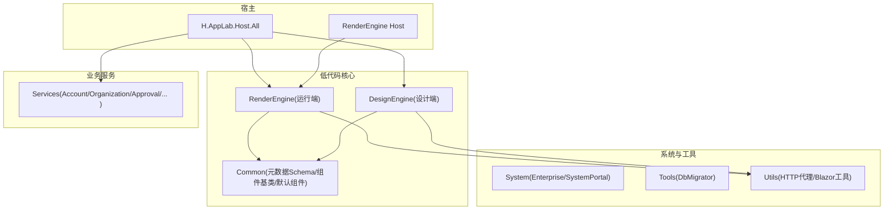
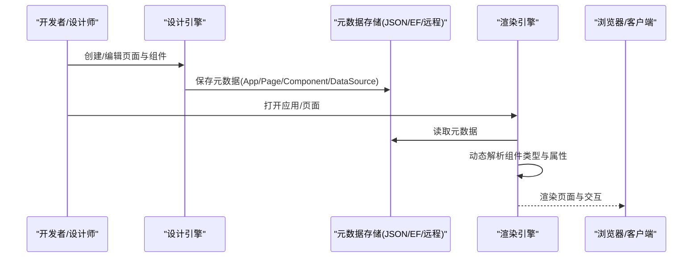
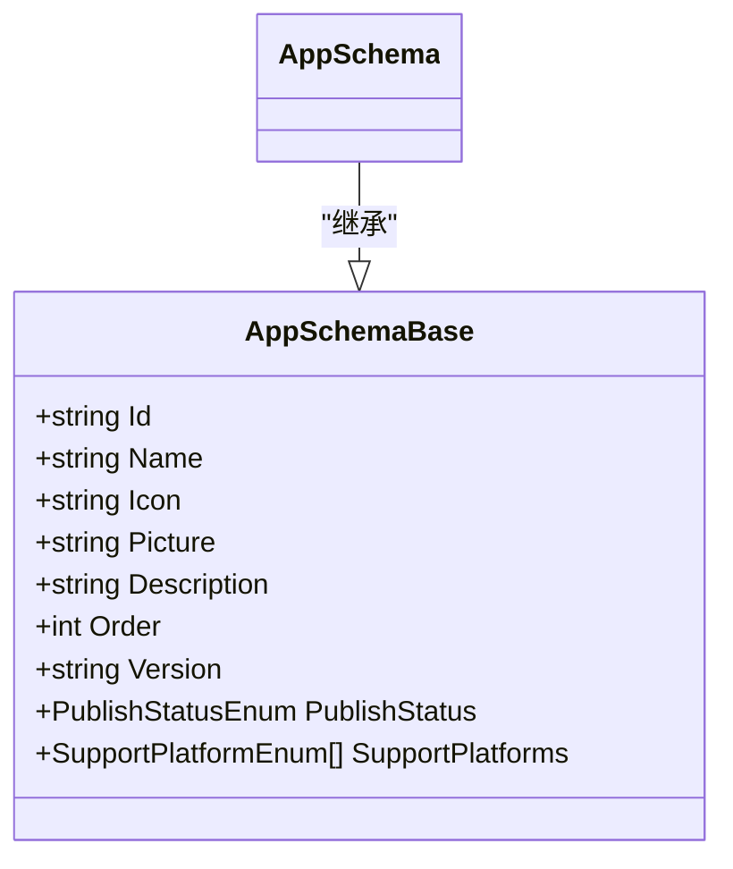
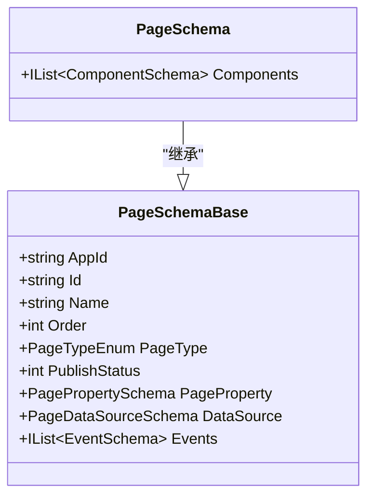
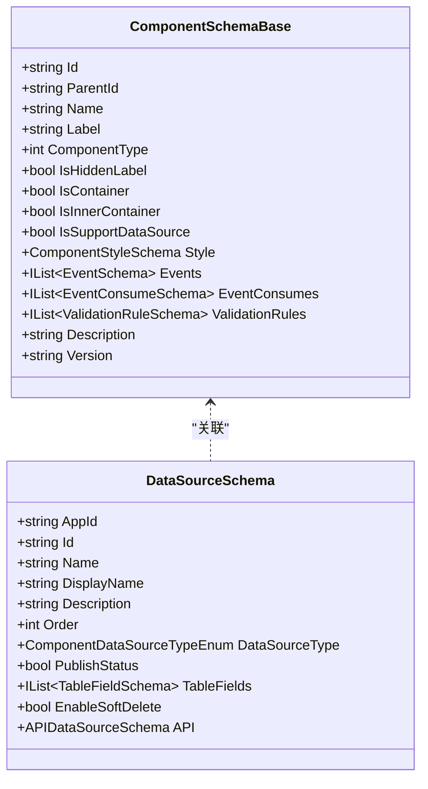
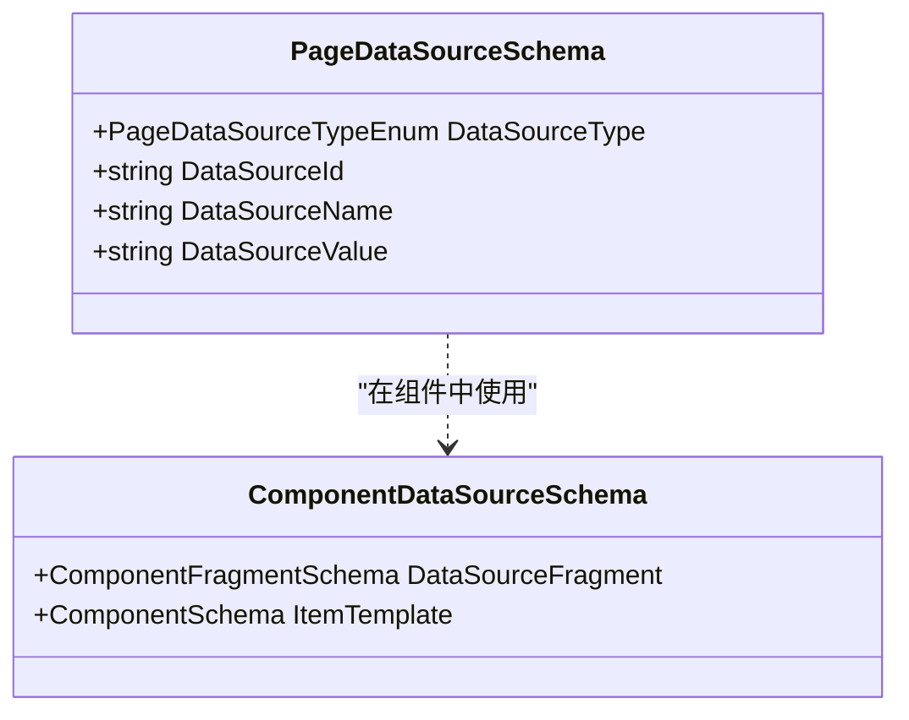
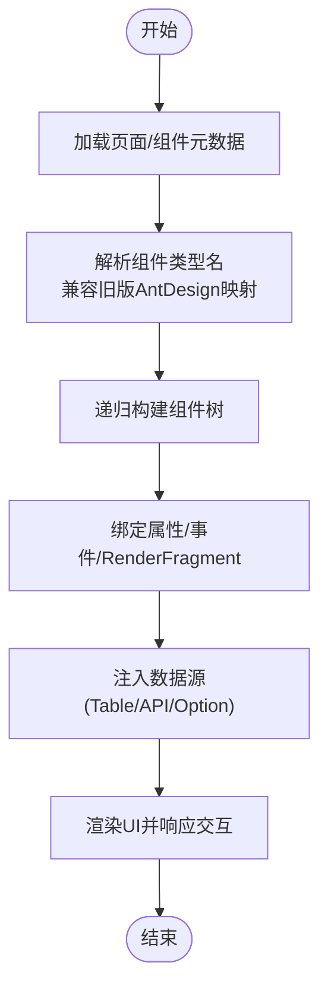
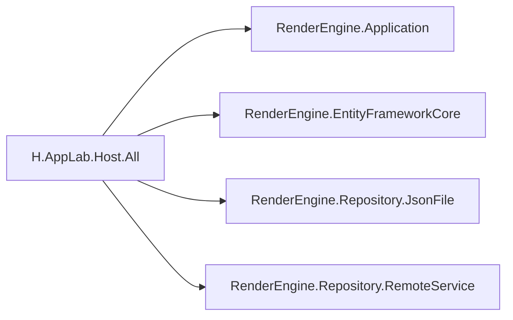

# 低代码引擎API

<cite>
**本文引用的文件**
- [README.md](file://README.md)
- [AppSchemaBase.cs](file://src/LowCode/Common/H.LowCode.MetaSchema/AppSchemaBase.cs)
- [PageSchemaBase.cs](file://src/LowCode/Common/H.LowCode.MetaSchema/PageSchemaBase.cs)
- [ComponentSchemaBase.cs](file://src/LowCode/Common/H.LowCode.MetaSchema/ComponentSchemaBase.cs)
- [DataSourceSchema.cs](file://src/LowCode/Common/H.LowCode.MetaSchema/DataSourceSchema.cs)
- [PageDataSourceSchema.cs](file://src/LowCode/Common/H.LowCode.MetaSchema/DataSourceSchemas/PageDataSourceSchema.cs)
- [ComponentDataSourceSchema.cs](file://src/LowCode/Common/H.LowCode.MetaSchema.RenderEngine/DataSourceSchemas/ComponentDataSourceSchema.cs)
- [AppSchema.cs](file://src/LowCode/Common/H.LowCode.MetaSchema.RenderEngine/AppSchema.cs)
- [PageSchema.cs](file://src/LowCode/Common/H.LowCode.MetaSchema.RenderEngine/PageSchema.cs)
- [RenderEngineDynamicComponentBase.cs](file://src/LowCode/RenderEngine/H.LowCode.RenderEngineBase/RenderEngineDynamicComponentBase.cs)
- [LowCodeDynamicComponentBase.cs](file://src/LowCode/Common/H.LowCode.ComponentBase/LowCodeDynamicComponentBase.cs)
- [TableDataAppService.cs](file://src/LowCode/RenderEngine/H.LowCode.RenderEngine.Application/DataAppServices/TableDataAppService.cs)
- [DataSourceAppService.cs](file://src/LowCode/DesignEngine/H.LowCode.DesignEngine.Application/AppServices/DataSourceAppService.cs)
- [RenderEngineHostModule.cs](file://src/Host/RenderEngine/H.LowCode.RenderEngine.Host/RenderEngineHostModule.cs)
- [RenderEngineApplicationModule.cs](file://src/LowCode/RenderEngine/H.LowCode.RenderEngine.Application/RenderEngineApplicationModule.cs)
- [RenderEngineEntityFrameworkCoreModule.cs](file://src/LowCode/RenderEngine/H.LowCode.RenderEngine.EntityFrameworkCore/RenderEngineEntityFrameworkCoreModule.cs)
- [RenderEngineJsonFileRepositoryModule.cs](file://src/LowCode/RenderEngine/H.LowCode.RenderEngine.Repository.JsonFile/RenderEngineJsonFileRepositoryModule.cs)
- [RenderEngineRemoteServiceRepositoryModule.cs](file://src/LowCode/RenderEngine/H.LowCode.RenderEngine.Repository.RemoteService/RenderEngineRemoteServiceRepositoryModule.cs)
- [H.AppLab.Host.All.csproj](file://src/Host/H.AppLab.Host.All/H.AppLab.Host.All/H.AppLab.Host.All.csproj)
</cite>

## 目录
1. [简介](#简介)
2. [项目结构](#项目结构)
3. [核心组件](#核心组件)
4. [架构总览](#架构总览)
5. [详细组件分析](#详细组件分析)
6. [依赖关系分析](#依赖关系分析)
7. [性能考量](#性能考量)
8. [故障排查指南](#故障排查指南)
9. [结论](#结论)
10. [附录：API规范与示例](#附录api规范与示例)

## 简介
本文件为低代码引擎的API文档，覆盖应用管理、页面设计、组件管理、数据源配置等核心接口；说明元数据Schema定义、动态渲染、主题定制等功能的API规范；并提供应用发布、版本管理、预览调试等开发工具接口的使用方式。同时阐述元数据驱动的动态组件加载机制与扩展点使用方法，给出完整的请求响应示例与错误处理说明。

## 项目结构
- Host 宿主程序：负责服务注册与启动，支持单体与按服务独立部署。
- LowCode 低代码核心：包含元数据Schema、组件基类、默认组件库、实体与契约；分为 DesignEngine（设计端）与 RenderEngine（运行端）。
- Services 企业级基础服务：按限界上下文划分，遵循 Application.Contracts / Application / EntityFrameworkCore / Web 分层。
- System 系统级应用：面向平台运营侧。
- Tools 数据库迁移工具：各服务的 DbMigrator 控制台程序。
- Utils 工具类库：ABP 契约、HTTP 动态代理、Blazor 工具、ID 生成等。

图表来源
- [H.AppLab.Host.All.csproj:24-39](file://src/Host/H.AppLab.Host.All/H.AppLab.Host.All/H.AppLab.Host.All.csproj#L24-L39)
- [RenderEngineHostModule.cs:1-39](file://src/Host/RenderEngine/H.LowCode.RenderEngine.Host/RenderEngineHostModule.cs#L1-L39)

章节来源
- [README.md:1-74](file://README.md#L1-L74)

## 核心组件
- 元数据Schema：应用、页面、组件、数据源的统一描述模型，贯穿设计与运行两端。
- 动态组件基类：基于 Blazor 的动态组件解析与属性绑定，支持事件回调与旧版类型兼容。
- 渲染引擎：根据元数据动态构建组件树，支持数据源注入、列表模板、条件渲染。
- 设计引擎：可视化编排页面与组件，产出元数据并持久化。

章节来源
- [AppSchemaBase.cs:1-32](file://src/LowCode/Common/H.LowCode.MetaSchema/AppSchemaBase.cs#L1-L32)
- [PageSchemaBase.cs:1-40](file://src/LowCode/Common/H.LowCode.MetaSchema/PageSchemaBase.cs#L1-L40)
- [ComponentSchemaBase.cs:1-104](file://src/LowCode/Common/H.LowCode.MetaSchema/ComponentSchemaBase.cs#L1-L104)
- [DataSourceSchema.cs:1-53](file://src/LowCode/Common/H.LowCode.MetaSchema/DataSourceSchema.cs#L1-L53)
- [RenderEngineDynamicComponentBase.cs:1-39](file://src/LowCode/RenderEngine/H.LowCode.RenderEngineBase/RenderEngineDynamicComponentBase.cs#L1-L39)
- [LowCodeDynamicComponentBase.cs:1-187](file://src/LowCode/Common/H.LowCode.ComponentBase/LowCodeDynamicComponentBase.cs#L1-L187)

## 架构总览
低代码引擎采用“设计端-运行端”分离架构：
- 设计端（DesignEngine）：提供可视化拖拽、属性编辑、数据源配置，输出元数据JSON。
- 运行端（RenderEngine）：读取元数据，动态解析组件类型，构建组件树并渲染。
- 存储层：支持 JSON 文件、EF Core、远程服务三种仓储实现，通过模块装配切换。
- 主题：基于 Ant Design Blazor 的主题包，提供统一的UI风格。

图表来源
- [RenderEngineHostModule.cs:1-39](file://src/Host/RenderEngine/H.LowCode.RenderEngine.Host/RenderEngineHostModule.cs#L1-L39)
- [RenderEngineApplicationModule.cs:1-31](file://src/LowCode/RenderEngine/H.LowCode.RenderEngine.Application/RenderEngineApplicationModule.cs#L1-L31)
- [RenderEngineJsonFileRepositoryModule.cs:1-22](file://src/LowCode/RenderEngine/H.LowCode.RenderEngine.Repository.JsonFile/RenderEngineJsonFileRepositoryModule.cs#L1-L22)
- [RenderEngineEntityFrameworkCoreModule.cs:1-34](file://src/LowCode/RenderEngine/H.LowCode.RenderEngine.EntityFrameworkCore/RenderEngineEntityFrameworkCoreModule.cs#L1-L34)
- [RenderEngineRemoteServiceRepositoryModule.cs:1-18](file://src/LowCode/RenderEngine/H.LowCode.RenderEngine.Repository.RemoteService/RenderEngineRemoteServiceRepositoryModule.cs#L1-L18)

## 详细组件分析

### 应用管理API（应用CRUD与版本/发布）
- 应用元数据字段：Id、Name、Icon、Picture、Description、Order、Version、PublishStatus、SupportPlatforms。
- 典型接口能力：
  - 获取应用列表/详情
  - 创建/更新/删除应用
  - 版本管理与发布状态变更
  - 多平台支持标记

图表来源
- [AppSchemaBase.cs:1-32](file://src/LowCode/Common/H.LowCode.MetaSchema/AppSchemaBase.cs#L1-L32)
- [AppSchema.cs:1-9](file://src/LowCode/Common/H.LowCode.MetaSchema.RenderEngine/AppSchema.cs#L1-L9)

章节来源
- [AppSchemaBase.cs:1-32](file://src/LowCode/Common/H.LowCode.MetaSchema/AppSchemaBase.cs#L1-L32)
- [AppSchema.cs:1-9](file://src/LowCode/Common/H.LowCode.MetaSchema.RenderEngine/AppSchema.cs#L1-L9)

### 页面设计API（页面元数据与事件）
- 页面元数据字段：AppId、Id、Name、Order、PageType、PublishStatus、PageProperty、DataSource、Events。
- 典型接口能力：
  - 页面列表/详情查询
  - 创建/更新/删除页面
  - 页面属性配置（布局、样式、全局变量）
  - 页面级数据源与事件绑定

图表来源
- [PageSchemaBase.cs:1-40](file://src/LowCode/Common/H.LowCode.MetaSchema/PageSchemaBase.cs#L1-L40)
- [PageSchema.cs:1-10](file://src/LowCode/Common/H.LowCode.MetaSchema.RenderEngine/PageSchema.cs#L1-L10)

章节来源
- [PageSchemaBase.cs:1-40](file://src/LowCode/Common/H.LowCode.MetaSchema/PageSchemaBase.cs#L1-L40)
- [PageSchema.cs:1-10](file://src/LowCode/Common/H.LowCode.MetaSchema.RenderEngine/PageSchema.cs#L1-L10)

### 组件管理API（组件元数据与数据源）
- 组件元数据字段：Id、ParentId、Name、Label、ComponentType、IsHiddenLabel、IsContainer、IsInnerContainer、IsSupportDataSource、Style、Events、EventConsumes、ValidationRules、Description、Version。
- 数据源Schema：支持 Table、API、Option 等多种类型，包含字段映射、软删除开关、API路径与方法等。
- 典型接口能力：
  - 组件库管理（新增/编辑/删除/排序）
  - 组件属性与校验规则配置
  - 组件级数据源绑定（表格字段、API参数映射、选项集）

图表来源
- [ComponentSchemaBase.cs:1-104](file://src/LowCode/Common/H.LowCode.MetaSchema/ComponentSchemaBase.cs#L1-L104)
- [DataSourceSchema.cs:1-53](file://src/LowCode/Common/H.LowCode.MetaSchema/DataSourceSchema.cs#L1-L53)

章节来源
- [ComponentSchemaBase.cs:1-104](file://src/LowCode/Common/H.LowCode.MetaSchema/ComponentSchemaBase.cs#L1-L104)
- [DataSourceSchema.cs:1-53](file://src/LowCode/Common/H.LowCode.MetaSchema/DataSourceSchema.cs#L1-L53)

### 数据源配置API（页面与组件数据源）
- 页面数据源：包含类型、数据源Id/名称/值等。
- 组件数据源：支持 Fragment 片段与 ItemTemplate 列表模板，用于复杂列表渲染。
- 典型接口能力：
  - 数据源列表查询（含类型、排序、显示名）
  - 数据源详情与测试连接
  - 组件数据源绑定与模板渲染

图表来源
- [PageDataSourceSchema.cs:1-18](file://src/LowCode/Common/H.LowCode.MetaSchema/DataSourceSchemas/PageDataSourceSchema.cs#L1-L18)
- [ComponentDataSourceSchema.cs:1-22](file://src/LowCode/Common/H.LowCode.MetaSchema.RenderEngine/DataSourceSchemas/ComponentDataSourceSchema.cs#L1-L22)

章节来源
- [PageDataSourceSchema.cs:1-18](file://src/LowCode/Common/H.LowCode.MetaSchema/DataSourceSchemas/PageDataSourceSchema.cs#L1-L18)
- [ComponentDataSourceSchema.cs:1-22](file://src/LowCode/Common/H.LowCode.MetaSchema.RenderEngine/DataSourceSchemas/ComponentDataSourceSchema.cs#L1-L22)

### 动态渲染与组件加载机制
- 动态组件基类：解析组件类型名；支持属性绑定、事件回调、RenderFragment 子内容。
- 渲染流程：从元数据中读取组件片段，递归构建组件树，注入数据源与事件处理器。
- 扩展点：
  - 自定义组件类型映射（在基类中维护映射表）
  - 自定义属性转换器（AttributeClrType 与 AttributeValue 转换）
  - 自定义数据源适配器（Table/API/Option）

图表来源
- [RenderEngineDynamicComponentBase.cs:1-39](file://src/LowCode/RenderEngine/H.LowCode.RenderEngineBase/RenderEngineDynamicComponentBase.cs#L1-L39)
- [LowCodeDynamicComponentBase.cs:1-187](file://src/LowCode/Common/H.LowCode.ComponentBase/LowCodeDynamicComponentBase.cs#L1-L187)

章节来源
- [RenderEngineDynamicComponentBase.cs:1-39](file://src/LowCode/RenderEngine/H.LowCode.RenderEngineBase/RenderEngineDynamicComponentBase.cs#L1-L39)
- [LowCodeDynamicComponentBase.cs:1-187](file://src/LowCode/Common/H.LowCode.ComponentBase/LowCodeDynamicComponentBase.cs#L1-L187)

### 主题定制API（Ant Design Blazor）
- 主题模块：通过主题模块装配，提供统一的组件渲染与样式。
- 扩展点：替换主题模块以适配不同UI框架或品牌色板。

章节来源
- [RenderEngineHostModule.cs:1-39](file://src/Host/RenderEngine/H.LowCode.RenderEngine.Host/RenderEngineHostModule.cs#L1-L39)

### 应用发布与版本管理API
- 发布状态：应用与页面均具备发布状态字段，支持草稿/已发布等状态流转。
- 版本管理：应用元数据包含版本号，便于灰度与回滚。
- 典型接口能力：
  - 应用/页面发布/撤销发布
  - 版本对比与回滚
  - 多平台发布策略（SupportPlatforms）

章节来源
- [AppSchemaBase.cs:1-32](file://src/LowCode/Common/H.LowCode.MetaSchema/AppSchemaBase.cs#L1-L32)
- [PageSchemaBase.cs:1-40](file://src/LowCode/Common/H.LowCode.MetaSchema/PageSchemaBase.cs#L1-L40)

### 预览调试API
- 设计端预览：在设计引擎中实时预览页面效果，支持数据源模拟与断点调试。
- 运行端调试：渲染引擎暴露数据查询接口（如表格数据），便于联调。

章节来源
- [TableDataAppService.cs:1-34](file://src/LowCode/RenderEngine/H.LowCode.RenderEngine.Application/DataAppServices/TableDataAppService.cs#L1-L34)

## 依赖关系分析
- 宿主装配：H.AppLab.Host.All 引用多个应用与服务，集中注册。
- 渲染引擎宿主：RenderEngine Host 装配 Application、EF Core、JSON 文件仓储模块。
- 仓储抽象：通过模块装配切换 JSON/EF/远程服务实现，解耦存储细节。

图表来源
- [H.AppLab.Host.All.csproj:24-39](file://src/Host/H.AppLab.Host.All/H.AppLab.Host.All/H.AppLab.Host.All.csproj#L24-L39)
- [RenderEngineApplicationModule.cs:1-31](file://src/LowCode/RenderEngine/H.LowCode.RenderEngine.Application/RenderEngineApplicationModule.cs#L1-L31)
- [RenderEngineEntityFrameworkCoreModule.cs:1-34](file://src/LowCode/RenderEngine/H.LowCode.RenderEngine.EntityFrameworkCore/RenderEngineEntityFrameworkCoreModule.cs#L1-L34)
- [RenderEngineJsonFileRepositoryModule.cs:1-22](file://src/LowCode/RenderEngine/H.LowCode.RenderEngine.Repository.JsonFile/RenderEngineJsonFileRepositoryModule.cs#L1-L22)
- [RenderEngineRemoteServiceRepositoryModule.cs:1-18](file://src/LowCode/RenderEngine/H.LowCode.RenderEngine.Repository.RemoteService/RenderEngineRemoteServiceRepositoryModule.cs#L1-L18)

章节来源
- [H.AppLab.Host.All.csproj:24-39](file://src/Host/H.AppLab.Host.All/H.AppLab.Host.All/H.AppLab.Host.All.csproj#L24-L39)
- [RenderEngineApplicationModule.cs:1-31](file://src/LowCode/RenderEngine/H.LowCode.RenderEngine.Application/RenderEngineApplicationModule.cs#L1-L31)
- [RenderEngineEntityFrameworkCoreModule.cs:1-34](file://src/LowCode/RenderEngine/H.LowCode.RenderEngine.EntityFrameworkCore/RenderEngineEntityFrameworkCoreModule.cs#L1-L34)
- [RenderEngineJsonFileRepositoryModule.cs:1-22](file://src/LowCode/RenderEngine/H.LowCode.RenderEngine.Repository.JsonFile/RenderEngineJsonFileRepositoryModule.cs#L1-L22)
- [RenderEngineRemoteServiceRepositoryModule.cs:1-18](file://src/LowCode/RenderEngine/H.LowCode.RenderEngine.Repository.RemoteService/RenderEngineRemoteServiceRepositoryModule.cs#L1-L18)

## 性能考量
- 前端懒加载：按需加载程序集，减少首屏体积。
- AOT与裁剪：Release模式启用AOT与Trimming，提升运行效率。
- 仓储选择：生产环境建议使用EF Core或远程服务，避免JSON文件并发问题。
- 组件解析缓存：建议对组件类型解析结果进行缓存，降低反射开销。

章节来源
- [README.md:69-74](file://README.md#L69-L74)

## 故障排查指南
- 组件类型解析失败：检查组件类型名是否正确，确认是否命中旧版AntDesign映射；查看日志警告信息。
- 数据源连接失败：验证数据源配置（路径、方法、字段映射），确保权限与网络可达。
- 属性绑定异常：检查AttributeClrType与AttributeValue类型一致性，确保目标组件存在对应属性。
- 发布状态不一致：核对应用/页面的PublishStatus字段，确保前后端状态同步。

章节来源
- [LowCodeDynamicComponentBase.cs:1-187](file://src/LowCode/Common/H.LowCode.ComponentBase/LowCodeDynamicComponentBase.cs#L1-L187)
- [DataSourceAppService.cs:1-31](file://src/LowCode/DesignEngine/H.LowCode.DesignEngine.Application/AppServices/DataSourceAppService.cs#L1-L31)

## 结论
本低代码引擎通过统一的元数据Schema与动态渲染机制，实现了应用、页面、组件与数据源的灵活编排与高效运行。设计端与运行端分离，仓储可插拔，主题可定制，具备良好的扩展性与可维护性。结合发布与版本管理能力，可满足企业级应用的快速开发与稳定交付需求。

## 附录：API规范与示例

### 应用管理接口
- 获取应用列表
  - 请求：GET /api/app/list
  - 响应：{ items: [AppSchemaBase], total: number }
- 创建应用
  - 请求：POST /api/app/create
  - 请求体：AppSchemaBase
  - 响应：{ id: string, version: string }
- 更新应用
  - 请求：PUT /api/app/update
  - 请求体：AppSchemaBase
  - 响应：{ success: boolean }
- 删除应用
  - 请求：DELETE /api/app/delete?id=string
  - 响应：{ success: boolean }
- 发布应用
  - 请求：POST /api/app/publish?id=string&status=int
  - 响应：{ success: boolean }

章节来源
- [AppSchemaBase.cs:1-32](file://src/LowCode/Common/H.LowCode.MetaSchema/AppSchemaBase.cs#L1-L32)

### 页面设计接口
- 获取页面列表
  - 请求：GET /api/page/list?appId=string
  - 响应：{ items: [PageSchemaBase], total: number }
- 创建页面
  - 请求：POST /api/page/create
  - 请求体：PageSchemaBase
  - 响应：{ id: string }
- 更新页面
  - 请求：PUT /api/page/update
  - 请求体：PageSchemaBase
  - 响应：{ success: boolean }
- 删除页面
  - 请求：DELETE /api/page/delete?id=string
  - 响应：{ success: boolean }

章节来源
- [PageSchemaBase.cs:1-40](file://src/LowCode/Common/H.LowCode.MetaSchema/PageSchemaBase.cs#L1-L40)

### 组件管理接口
- 获取组件库
  - 请求：GET /api/component/library
  - 响应：{ items: [ComponentSchemaBase] }
- 创建组件
  - 请求：POST /api/component/create
  - 请求体：ComponentSchemaBase
  - 响应：{ id: string }
- 更新组件
  - 请求：PUT /api/component/update
  - 请求体：ComponentSchemaBase
  - 响应：{ success: boolean }
- 删除组件
  - 请求：DELETE /api/component/delete?id=string
  - 响应：{ success: boolean }

章节来源
- [ComponentSchemaBase.cs:1-104](file://src/LowCode/Common/H.LowCode.MetaSchema/ComponentSchemaBase.cs#L1-L104)

### 数据源配置接口
- 获取数据源列表
  - 请求：GET /api/datasource/list?appId=string
  - 响应：{ items: [DataSourceSchema] }
- 测试数据源连接
  - 请求：POST /api/datasource/test
  - 请求体：DataSourceSchema
  - 响应：{ connected: boolean, message: string }
- 绑定组件数据源
  - 请求：PUT /api/component/datasource/bind
  - 请求体：{ componentId: string, dataSourceId: string }
  - 响应：{ success: boolean }

章节来源
- [DataSourceSchema.cs:1-53](file://src/LowCode/Common/H.LowCode.MetaSchema/DataSourceSchema.cs#L1-L53)
- [DataSourceAppService.cs:1-31](file://src/LowCode/DesignEngine/H.LowCode.DesignEngine.Application/AppServices/DataSourceAppService.cs#L1-L31)

### 表格数据接口（预览调试）
- 获取表格数据
  - 请求：GET /api/tabledata/list
  - 请求体：TableDataInput
  - 响应：{ items: Dictionary<string, object>[], total: number }
- 删除表格数据
  - 请求：DELETE /api/tabledata/delete
  - 请求体：TableDataDeleteInput
  - 响应：{ success: boolean }
- 更新表格数据
  - 请求：PUT /api/tabledata/update
  - 请求体：TableDataUpdateInput
  - 响应：{ success: boolean }

章节来源
- [TableDataAppService.cs:1-34](file://src/LowCode/RenderEngine/H.LowCode.RenderEngine.Application/DataAppServices/TableDataAppService.cs#L1-L34)

### 错误处理说明
- 常见错误码：
  - 400：参数校验失败（如必填字段缺失、类型不匹配）
  - 404：资源不存在（应用/页面/组件/数据源）
  - 500：服务器内部错误（组件类型解析失败、数据源连接失败）
- 错误响应格式：
  - { code: number, message: string, details: any }

章节来源
- [LowCodeDynamicComponentBase.cs:1-187](file://src/LowCode/Common/H.LowCode.ComponentBase/LowCodeDynamicComponentBase.cs#L1-L187)