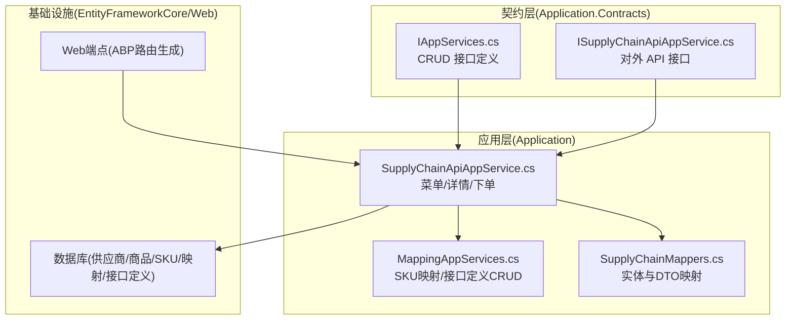
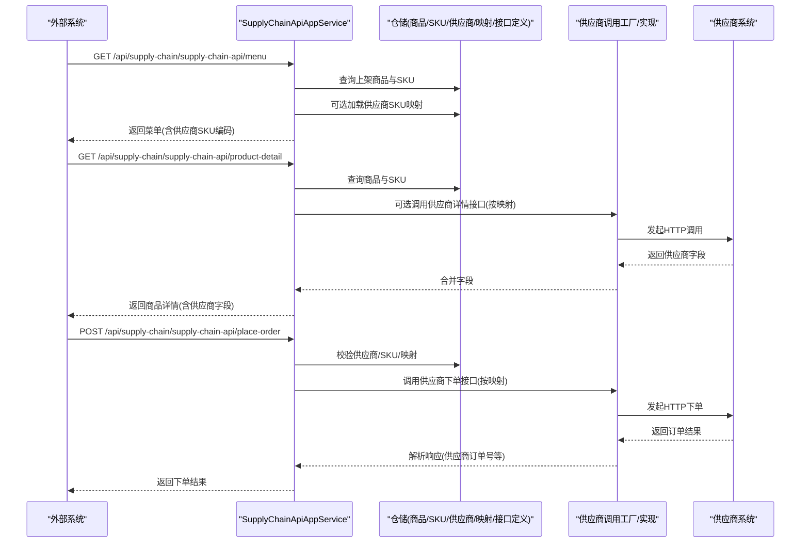
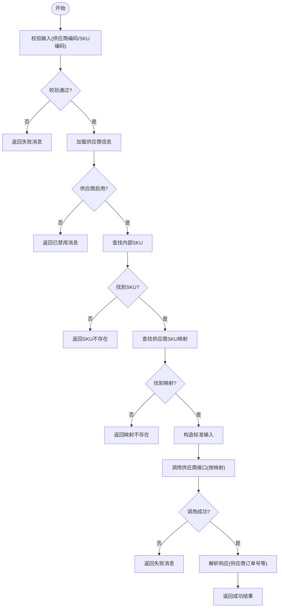
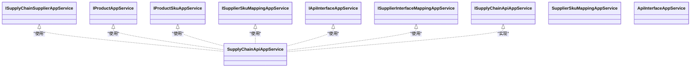

# 供应链管理API

<cite>
**本文引用的文件**   
- [IAppServices.cs](file://src/Services/SupplyChain/H.SupplyChain.Application.Contracts/Services/IAppServices.cs)
- [ISupplyChainApiAppService.cs](file://src/Services/SupplyChain/H.SupplyChain.Application.Contracts/Services/ISupplyChainApiAppService.cs)
- [SupplyChainApiAppService.cs](file://src/Services/SupplyChain/H.SupplyChain.Application/Services/SupplyChainApiAppService.cs)
- [MappingAppServices.cs](file://src/Services/SupplyChain/H.SupplyChain.Application/Services/MappingAppServices.cs)
- [SupplyChainMappers.cs](file://src/Services/SupplyChain/H.SupplyChain.Application/Mapping/SupplyChainMappers.cs)
- [README.md](file://README.md)
</cite>

## 目录
1. [简介](#简介)
2. [项目结构](#项目结构)
3. [核心组件](#核心组件)
4. [架构总览](#架构总览)
5. [详细组件分析](#详细组件分析)
6. [依赖关系分析](#依赖关系分析)
7. [性能与一致性策略](#性能与一致性策略)
8. [故障排查指南](#故障排查指南)
9. [结论](#结论)
10. [附录：接口规范与示例](#附录接口规范与示例)

## 简介
本文件为供应链管理服务提供完整的 API 文档，覆盖供应商管理、商品管理、采购流程（下单）、库存相关字段展示、供应商 SKU 映射、接口定义与字段映射配置等。系统基于 ABP 模块化架构，对外暴露统一的 RESTful 接口，内部通过“接口定义 + 供应商接口映射”驱动参数与返回值字段转换，并调用各供应商的协议实现完成协同与订单对接。

## 项目结构
供应链模块采用分层设计：Application.Contracts 定义对外契约（DTO、枚举、服务接口），Application 层实现业务逻辑与服务，EntityFrameworkCore 层负责数据持久化，Web 层暴露 HTTP 端点。外部系统通过 ISupplyChainApiAppService 提供的菜单、商品详情、下单三类接口进行集成；内部管理系统通过 CRUD 类应用服务进行数据维护。

图表来源 
- [IAppServices.cs:1-53](file://src/Services/SupplyChain/H.SupplyChain.Application.Contracts/Services/IAppServices.cs#L1-L53)
- [ISupplyChainApiAppService.cs:1-29](file://src/Services/SupplyChain/H.SupplyChain.Application.Contracts/Services/ISupplyChainApiAppService.cs#L1-L29)
- [SupplyChainApiAppService.cs:1-367](file://src/Services/SupplyChain/H.SupplyChain.Application/Services/SupplyChainApiAppService.cs#L1-L367)
- [MappingAppServices.cs:1-175](file://src/Services/SupplyChain/H.SupplyChain.Application/Services/MappingAppServices.cs#L1-L175)
- [SupplyChainMappers.cs](file://src/Services/SupplyChain/H.SupplyChain.Application/Mapping/SupplyChainMappers.cs)

章节来源
- [README.md:1-74](file://README.md#L1-L74)

## 核心组件
- 供应商管理：CRUD 接口，支持按过滤条件分页查询、创建、更新、删除。
- 商品与 SKU 管理：商品主数据与 SKU 维度管理，支持获取商品详情（含 SKU 列表）。
- 供应商 SKU 映射：一个内部 SKU 可映射多个供应商侧 SKU，用于跨系统编码对齐。
- 接口定义与映射：集中管理“菜单/商品详情/下单”等标准接口编码及请求/响应字段映射规则。
- 对外 API：菜单、商品详情、下单三类接口，支持按供应商增强返回或执行下单。

章节来源
- [IAppServices.cs:1-53](file://src/Services/SupplyChain/H.SupplyChain.Application.Contracts/Services/IAppServices.cs#L1-L53)
- [ISupplyChainApiAppService.cs:1-29](file://src/Services/SupplyChain/H.SupplyChain.Application.Contracts/Services/ISupplyChainApiAppService.cs#L1-L29)

## 架构总览
供应链对外 API 由 SupplyChainApiAppService 统一实现，遵循 ABP 约定自动生成 RESTful 端点。其核心流程包括：
- 菜单接口：返回内部商品目录，可选附加供应商侧 SKU 编码。
- 商品详情接口：返回商品主信息与 SKU 列表，可按供应商合并供应商侧字段。
- 下单接口：将内部 SKU 转换为供应商 SKU，构造标准输入，调用供应商接口并按映射解析响应。

图表来源 
- [ISupplyChainApiAppService.cs:1-29](file://src/Services/SupplyChain/H.SupplyChain.Application.Contracts/Services/ISupplyChainApiAppService.cs#L1-L29)
- [SupplyChainApiAppService.cs:1-367](file://src/Services/SupplyChain/H.SupplyChain.Application/Services/SupplyChainApiAppService.cs#L1-L367)

## 详细组件分析

### 供应商管理接口
- 能力：增删改查、分页、过滤。
- 典型用法：在管理后台维护供应商基础信息，启用/禁用控制是否允许下单。
- 错误处理：未找到记录时返回空结果或异常；重复创建时抛出异常提示。

章节来源
- [IAppServices.cs:1-53](file://src/Services/SupplyChain/H.SupplyChain.Application.Contracts/Services/IAppServices.cs#L1-L53)
- [MappingAppServices.cs:1-175](file://src/Services/SupplyChain/H.SupplyChain.Application/Services/MappingAppServices.cs#L1-L175)

### 商品与 SKU 管理接口
- 能力：商品主数据 CRUD、SKU 维度 CRUD、商品详情（含 SKU 列表）。
- 典型用法：商品上架后，SKU 作为最小库存单位参与菜单与下单。
- 错误处理：SKU 不存在时返回空详情；状态过滤仅返回上架商品。

章节来源
- [IAppServices.cs:1-53](file://src/Services/SupplyChain/H.SupplyChain.Application.Contracts/Services/IAppServices.cs#L1-L53)

### 供应商 SKU 映射管理接口
- 能力：维护内部 SKU 到供应商侧 SKU 的映射关系，支持按 SKU/供应商/启用状态筛选。
- 典型用法：为每个供应商配置其侧的 SKU 编码与名称，确保下单时能正确转换。
- 错误处理：重复映射时抛出异常；构建 DTO 时批量加载 SKU 与供应商编码以提升性能。

章节来源
- [MappingAppServices.cs:1-175](file://src/Services/SupplyChain/H.SupplyChain.Application/Services/MappingAppServices.cs#L1-L175)

### 接口定义与映射管理接口
- 能力：集中管理标准接口编码（如 menu、product-detail、place-order）及其请求/响应字段映射规则。
- 典型用法：为不同供应商配置不同的 SupplierApiUrl、RequestMappings、ResponseMappings。
- 错误处理：接口编码重复创建时抛出异常；未配置映射时按需忽略或返回失败。

章节来源
- [MappingAppServices.cs:1-175](file://src/Services/SupplyChain/H.SupplyChain.Application/Services/MappingAppServices.cs#L1-L175)

### 对外 API（菜单/详情/下单）
- 菜单接口：返回内部商品目录，可选附加供应商侧 SKU 编码；若配置了菜单接口映射，会尝试调用供应商并叠加字段。
- 商品详情接口：返回商品主信息与 SKU 列表；指定供应商时，按其接口映射调用供应商并合并供应商侧字段。
- 下单接口：将内部 SKU 转换为供应商 SKU，构造标准输入，调用供应商下单接口，按 ResponseMapping 解析供应商订单号等字段。

图表来源 
- [SupplyChainApiAppService.cs:194-277](file://src/Services/SupplyChain/H.SupplyChain.Application/Services/SupplyChainApiAppService.cs#L194-L277)

章节来源
- [ISupplyChainApiAppService.cs:1-29](file://src/Services/SupplyChain/H.SupplyChain.Application.Contracts/Services/ISupplyChainApiAppService.cs#L1-L29)
- [SupplyChainApiAppService.cs:1-367](file://src/Services/SupplyChain/H.SupplyChain.Application/Services/SupplyChainApiAppService.cs#L1-L367)

## 依赖关系分析
- 契约层与应用层解耦：前端或服务间仅依赖 Application.Contracts，通过 ABP 动态代理自动转换为 HTTP 调用。
- 应用层依赖仓储：通过 IRepository 访问领域实体，避免直接耦合 EF Core。
- 对外 API 依赖映射与调用工厂：根据接口定义与供应商映射动态构造请求与解析响应。

图表来源 
- [IAppServices.cs:1-53](file://src/Services/SupplyChain/H.SupplyChain.Application.Contracts/Services/IAppServices.cs#L1-L53)
- [ISupplyChainApiAppService.cs:1-29](file://src/Services/SupplyChain/H.SupplyChain.Application.Contracts/Services/ISupplyChainApiAppService.cs#L1-L29)
- [SupplyChainApiAppService.cs:1-367](file://src/Services/SupplyChain/H.SupplyChain.Application/Services/SupplyChainApiAppService.cs#L1-L367)
- [MappingAppServices.cs:1-175](file://src/Services/SupplyChain/H.SupplyChain.Application/Services/MappingAppServices.cs#L1-L175)

## 性能与一致性策略
- 分页与过滤：所有列表接口均支持分页与过滤，减少数据传输与内存占用。
- 批量加载：在构建 DTO 时批量加载关联数据（如 SKU 编码、供应商编码），避免 N+1 查询。
- 可选增强：菜单/详情接口在缺少供应商映射时不报错，保证主流程稳定。
- 多供应商一致性：通过“接口定义 + 字段映射”标准化交互，降低多供应商差异带来的不一致风险。
- 缓存建议：对频繁读取的商品目录与映射配置可引入缓存层（如 Redis）以降低数据库压力。
- 幂等性：下单接口应结合外部订单号（externalOrderNo）实现幂等，防止重复下单。

[本节为通用指导，不直接分析具体文件]

## 故障排查指南
- 供应商未配置接口映射：菜单/详情接口会忽略增强；下单接口将返回失败消息。检查接口定义与映射是否启用。
- SKU 映射缺失：下单前需确保内部 SKU 与供应商 SKU 映射存在且启用。
- 供应商被禁用：下单接口会拒绝并返回明确消息。
- 字段映射错误：检查 RequestMappings/ResponseMappings JSON 配置是否正确，确保目标字段名一致。
- 网络超时或异常：记录原始响应体与错误消息，便于定位供应商侧问题。

章节来源
- [SupplyChainApiAppService.cs:194-277](file://src/Services/SupplyChain/H.SupplyChain.Application/Services/SupplyChainApiAppService.cs#L194-L277)

## 结论
供应链管理服务通过标准化的接口定义与字段映射机制，实现了多供应商环境下的统一接入与数据同步。对外 API 提供菜单、商品详情、下单三大核心能力，内部管理能力完善，具备良好的扩展性与稳定性。建议在关键路径引入缓存与重试机制，进一步提升性能与可靠性。

[本节为总结，不直接分析具体文件]

## 附录：接口规范与示例

### 对外 API 端点
- 菜单接口
  - 方法：GET
  - 路径：/api/supply-chain/supply-chain-api/menu
  - 说明：返回内部商品目录，可选附加供应商侧 SKU 编码；若配置了菜单接口映射，会尝试调用供应商并叠加字段。
- 商品详情接口
  - 方法：GET
  - 路径：/api/supply-chain/supply-chain-api/product-detail
  - 说明：返回商品主信息与 SKU 列表；指定供应商时，按其接口映射调用供应商并合并供应商侧字段。
- 下单接口
  - 方法：POST
  - 路径：/api/supply-chain/supply-chain-api/place-order
  - 说明：将内部 SKU 转换为供应商 SKU，构造标准输入，调用供应商下单接口，按 ResponseMapping 解析响应。

章节来源
- [ISupplyChainApiAppService.cs:1-29](file://src/Services/SupplyChain/H.SupplyChain.Application.Contracts/Services/ISupplyChainApiAppService.cs#L1-L29)

### 请求与响应要点
- 菜单接口
  - 输入：分类过滤、关键词过滤、最大结果数、供应商编码（可选）
  - 输出：商品项列表，每项包含 SKU 列表；当指定供应商时，SKU 附加供应商侧 SKU 编码
- 商品详情接口
  - 输入：商品编码或 SKU 编码、供应商编码（可选）
  - 输出：商品主信息 + SKU 列表；当指定供应商时，附加供应商侧字段
- 下单接口
  - 输入：供应商编码、内部 SKU 编码、数量、外部订单号、收货人、地址、电话、备注
  - 输出：下单状态、原始响应体、映射后的字段（如供应商订单号）

章节来源
- [SupplyChainApiAppService.cs:48-119](file://src/Services/SupplyChain/H.SupplyChain.Application/Services/SupplyChainApiAppService.cs#L48-L119)
- [SupplyChainApiAppService.cs:121-192](file://src/Services/SupplyChain/H.SupplyChain.Application/Services/SupplyChainApiAppService.cs#L121-L192)
- [SupplyChainApiAppService.cs:194-277](file://src/Services/SupplyChain/H.SupplyChain.Application/Services/SupplyChainApiAppService.cs#L194-L277)

### 错误处理说明
- 参数校验失败：返回明确的失败消息（如供应商编码与 SKU 编码不能为空）
- 资源不存在：返回相应资源不存在消息（如内部 SKU 不存在、未找到映射）
- 供应商禁用：返回已禁用消息
- 调用失败：返回供应商侧错误消息或默认失败消息，并附带原始响应体以便排查

章节来源
- [SupplyChainApiAppService.cs:194-277](file://src/Services/SupplyChain/H.SupplyChain.Application/Services/SupplyChainApiAppService.cs#L194-L277)