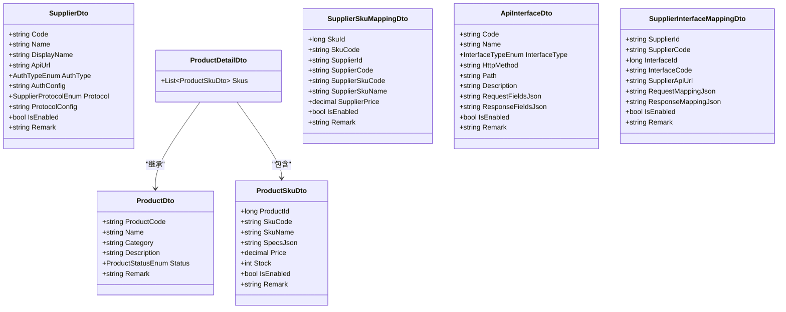
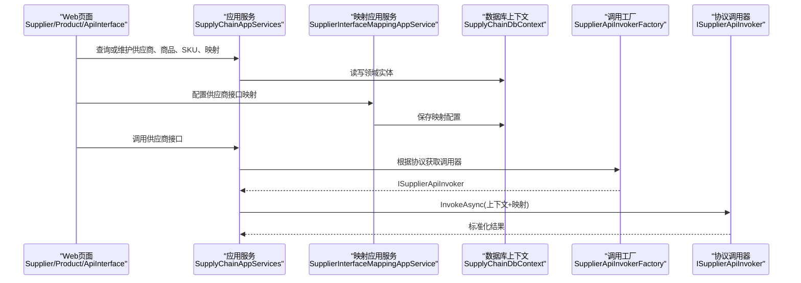
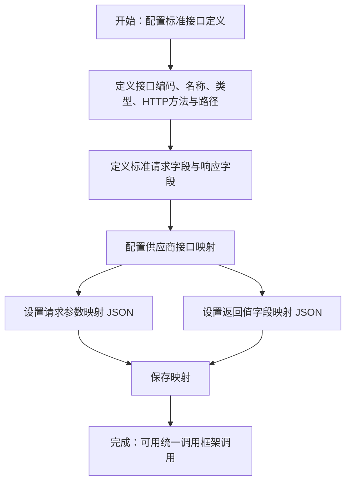
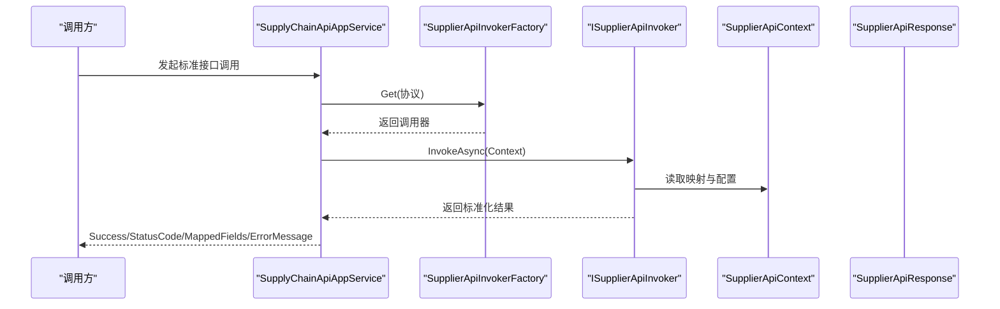
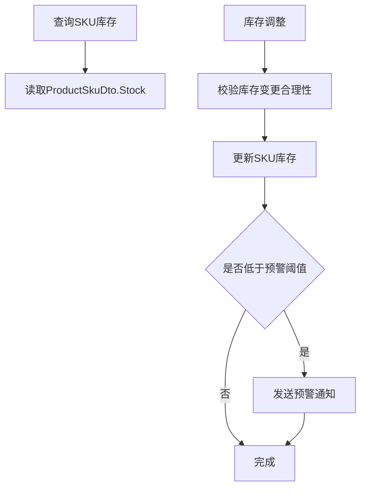
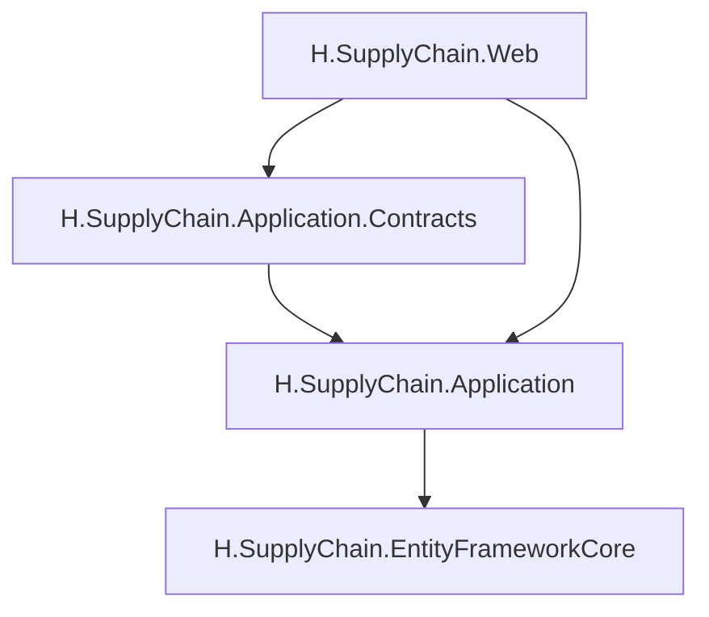

# 供应链管理API

<cite>
**本文引用的文件**   
- [ISupplierApiInvoker.cs](file://src/Services/SupplyChain/H.SupplyChain.Application.Contracts/Abstractions/ISupplierApiInvoker.cs)
- [SupplierDtos.cs](file://src/Services/SupplyChain/H.SupplyChain.Application.Contracts/Dtos/SupplierDtos.cs)
- [ProductDtos.cs](file://src/Services/SupplyChain/H.SupplyChain.Application.Contracts/Dtos/ProductDtos.cs)
- [ProductSkuDtos.cs](file://src/Services/SupplyChain/H.SupplyChain.Application.Contracts/Dtos/ProductSkuDtos.cs)
- [SupplierSkuMappingDtos.cs](file://src/Services/SupplyChain/H.SupplyChain.Application.Contracts/Dtos/SupplierSkuMappingDtos.cs)
- [ApiInterfaceDtos.cs](file://src/Services/SupplyChain/H.SupplyChain.Application.Contracts/Dtos/ApiInterfaceDtos.cs)
- [SupplierInterfaceMappingDtos.cs](file://src/Services/SupplyChain/H.SupplyChain.Application.Contracts/Dtos/SupplierInterfaceMappingDtos.cs)
- [FieldMapping.cs](file://src/Services/SupplyChain/H.SupplyChain.Application.Contracts/Abstractions/FieldMapping.cs)
- [SupplyChainEnums.cs](file://src/Services/SupplyChain/H.SupplyChain.Application.Contracts/Enums/SupplyChainEnums.cs)
- [ISupplyChainApiAppService.cs](file://src/Services/SupplyChain/H.SupplyChain.Application.Contracts/Services/ISupplyChainApiAppService.cs)
- [IAppServices.cs](file://src/Services/SupplyChain/H.SupplyChain.Application.Contracts/Services/IAppServices.cs)
- [SupplyChainApplicationContractsModule.cs](file://src/Services/SupplyChain/H.SupplyChain.Application.Contracts/SupplyChainApplicationContractsModule.cs)
- [SupplyChainAppServices.cs](file://src/Services/SupplyChain/H.SupplyChain.Application/Services/SupplyChainAppServices.cs)
- [SupplyChainApiAppService.cs](file://src/Services/SupplyChain/H.SupplyChain.Application/Services/SupplyChainApiAppService.cs)
- [SupplierInterfaceMappingAppService.cs](file://src/Services/SupplyChain/H.SupplyChain.Application/Services/SupplierInterfaceMappingAppService.cs)
- [MappingAppServices.cs](file://src/Services/SupplyChain/H.SupplyChain.Application/Services/MappingAppServices.cs)
- [SupplierApiInvokerFactory.cs](file://src/Services/SupplyChain/H.SupplyChain.Application/Services/SupplierApiInvokerFactory.cs)
- [SupplierApiInvokers.cs](file://src/Services/SupplyChain/H.SupplyChain.Application/Services/SupplierApiInvokers.cs)
- [SupplyChainDbContext.cs](file://src/Services/SupplyChain/H.SupplyChain.EntityFrameworkCore/SupplyChainDbContext.cs)
- [ProductEntity.cs](file://src/Services/SupplyChain/H.SupplyChain.EntityFrameworkCore/Entities/ProductEntity.cs)
- [ProductSkuEntity.cs](file://src/Services/SupplyChain/H.SupplyChain.EntityFrameworkCore/Entities/ProductSkuEntity.cs)
- [SupplierSkuMappingEntity.cs](file://src/Services/SupplyChain/H.SupplyChain.EntityFrameworkCore/Entities/SupplierSkuMappingEntity.cs)
- [ApiInterfaceEntity.cs](file://src/Services/SupplyChain/H.SupplyChain.EntityFrameworkCore/Entities/ApiInterfaceEntity.cs)
- [SupplyChainLayout.razor](file://src/Services/SupplyChain/H.SupplyChain.Web/Layout/SupplyChainLayout.razor)
- [ApiInterface.razor](file://src/Services/SupplyChain/H.SupplyChain.Web/Pages/ApiInterface.razor)
- [Product.razor](file://src/Services/SupplyChain/H.SupplyChain.Web/Pages/Product.razor)
- [Supplier.razor](file://src/Services/SupplyChain/H.SupplyChain.Web/Pages/Supplier.razor)
</cite>

## 目录
1. [简介](#简介)
2. [项目结构与定位](#项目结构与定位)
3. [核心领域与数据模型](#核心领域与数据模型)
4. [架构总览](#架构总览)
5. [供应商管理API](#供应商管理api)
6. [商品与SKU管理API](#商品与sku管理api)
7. [供应商SKU映射API](#供应商sku映射api)
8. [接口定义与字段映射API](#接口定义与字段映射api)
9. [供应商接口调用API](#供应商接口调用api)
10. [库存管理与预警说明](#库存管理与预警说明)
11. [采购订单、入库出库、物流配送API现状](#采购订单入库出库物流配送api现状)
12. [可视化分析与报表生成API现状](#可视化分析与报表生成api现状)
13. [依赖关系分析](#依赖关系分析)
14. [性能与扩展性建议](#性能与扩展性建议)
15. [安全与数据同步机制](#安全与数据同步机制)
16. [故障排查指南](#故障排查指南)
17. [结论](#结论)

## 简介
本文件为 H.AppLab 平台中供应链管理服务的技术与API文档。当前仓库中的供应链模块是一个“供应商对接与接口映射”能力，提供：
- 供应商信息管理
- 商品主数据与SKU管理
- 内部SKU与供应商SKU的映射
- 标准接口定义与供应商接口参数映射
- 基于协议抽象的供应商接口统一调用框架

该模块尚未实现完整的采购订单、入库出库、物流跟踪等业务实体；库存字段存在于SKU中，可作为后续库存管理的扩展基础。

## 项目结构与定位
供应链服务位于 `src/Services/SupplyChain`，按典型ABP分层组织：
- Application.Contracts：对外DTO、枚举、抽象接口与契约模块
- Application：应用服务、工厂、映射逻辑
- EntityFrameworkCore：数据库上下文与实体
- Web：Blazor页面、布局与菜单入口

```mermaid
graph TB
    subgraph "Web层"
        Layout["SupplyChainLayout.razor"]
        PageApi["ApiInterface.razor"]
        PageProduct["Product.razor"]
        PageSupplier["Supplier.razor"]
    end

    subgraph "应用层"
        AppServices["SupplyChainAppServices.cs"]
        ApiAppService["SupplyChainApiAppService.cs"]
        MappingApp["SupplierInterfaceMappingAppService.cs"]
        MappingApp2["MappingAppServices.cs"]
        InvokerFactory["SupplierApiInvokerFactory.cs"]
        Invokers["SupplierApiInvokers.cs"]
    end

    subgraph "契约层"
        DtoSupplier["SupplierDtos.cs"]
        DtoProduct["ProductDtos.cs"]
        DtoSku["ProductSkuDtos.cs"]
        DtoMap["SupplierSkuMappingDtos.cs"]
        DtoApi["ApiInterfaceDtos.cs"]
        DtoMapping["SupplierInterfaceMappingDtos.cs"]
        Abstraction["ISupplierApiInvoker.cs"]
        FieldMap["FieldMapping.cs"]
        Enums["SupplyChainEnums.cs"]
    end

    subgraph "数据层"
        DbContext["SupplyChainDbContext.cs"]
        EntityProduct["ProductEntity.cs"]
        EntitySku["ProductSkuEntity.cs"]
        EntityMap["SupplierSkuMappingEntity.cs"]
        EntityApi["ApiInterfaceEntity.cs"]
    end

    Layout --> AppServices
    PageApi --> MappingApp
    PageProduct --> AppServices
    PageSupplier --> AppServices

    AppServices --> DtoSupplier
    AppServices --> DtoProduct
    AppServices --> DtoSku
    AppServices --> DtoMap
    AppServices --> DtoApi
    AppServices --> DtoMapping

    ApiAppService --> Abstraction
    MappingApp --> DtoMapping
    MappingApp2 --> DtoMapping
    InvokerFactory --> Abstraction
    Invokers --> Abstraction

    AppServices --> DbContext
    MappingApp --> DbContext
    ApiAppService --> DbContext
    DbContext --> EntityProduct
    DbContext --> EntitySku
    DbContext --> EntityMap
    DbContext --> EntityApi
```

**图表来源**
- [SupplyChainLayout.razor](file://src/Services/SupplyChain/H.SupplyChain.Web/Layout/SupplyChainLayout.razor)
- [ApiInterface.razor](file://src/Services/SupplyChain/H.SupplyChain.Web/Pages/ApiInterface.razor)
- [Product.razor](file://src/Services/SupplyChain/H.SupplyChain.Web/Pages/Product.razor)
- [Supplier.razor](file://src/Services/SupplyChain/H.SupplyChain.Web/Pages/Supplier.razor)
- [SupplyChainAppServices.cs](file://src/Services/SupplyChain/H.SupplyChain.Application/Services/SupplyChainAppServices.cs)
- [SupplyChainApiAppService.cs](file://src/Services/SupplyChain/H.SupplyChain.Application/Services/SupplyChainApiAppService.cs)
- [SupplierInterfaceMappingAppService.cs](file://src/Services/SupplyChain/H.SupplyChain.Application/Services/SupplierInterfaceMappingAppService.cs)
- [MappingAppServices.cs](file://src/Services/SupplyChain/H.SupplyChain.Application/Services/MappingAppServices.cs)
- [SupplierApiInvokerFactory.cs](file://src/Services/SupplyChain/H.SupplyChain.Application/Services/SupplierApiInvokerFactory.cs)
- [SupplierApiInvokers.cs](file://src/Services/SupplyChain/H.SupplyChain.Application/Services/SupplierApiInvokers.cs)
- [SupplyChainDbContext.cs](file://src/Services/SupplyChain/H.SupplyChain.EntityFrameworkCore/SupplyChainDbContext.cs)

**章节来源**
- [SupplyChainLayout.razor](file://src/Services/SupplyChain/H.SupplyChain.Web/Layout/SupplyChainLayout.razor)
- [SupplyChainApplicationContractsModule.cs](file://src/Services/SupplyChain/H.SupplyChain.Application.Contracts/SupplyChainApplicationContractsModule.cs)

## 核心领域与数据模型
供应链模块围绕“供应商、商品、SKU、供应商SKU映射、标准接口定义、供应商接口映射”构建，形成一套可扩展的供应商对接骨架。

### 主要领域对象
- 供应商：包含编码、名称、认证方式、认证配置、协议类型、协议配置、启用状态等
- 商品：包含商品编码、名称、类别、描述、状态、备注
- SKU：商品最小售卖单元，包含SKU编码、名称、规格JSON、售价、库存、启用状态
- 供应商SKU映射：内部SKU与供应商SKU的关联，记录供应商编码、供应商SKU编码、供应商名称、供货价格、启用状态
- 接口定义：标准接口元数据，包含接口编码、名称、类型、HTTP方法、路径、请求字段定义、响应字段定义
- 供应商接口映射：将标准接口与具体供应商的参数映射和返回值映射关联起来

```mermaid
classDiagram
    class SupplierDto {
        +string Code
        +string Name
        +string DisplayName
        +string ApiUrl
        +AuthTypeEnum AuthType
        +string AuthConfig
        +SupplierProtocolEnum Protocol
        +string ProtocolConfig
        +bool IsEnabled
        +string Remark
    }

    class ProductDto {
        +string ProductCode
        +string Name
        +string Category
        +string Description
        +ProductStatusEnum Status
        +string Remark
    }

    class ProductDetailDto {
        +List~ProductSkuDto~ Skus
    }

    class ProductSkuDto {
        +long ProductId
        +string SkuCode
        +string SkuName
        +string SpecsJson
        +decimal Price
        +int Stock
        +bool IsEnabled
        +string Remark
    }

    class SupplierSkuMappingDto {
        +long SkuId
        +string SkuCode
        +string SupplierId
        +string SupplierCode
        +string SupplierSkuCode
        +string SupplierSkuName
        +decimal SupplierPrice
        +bool IsEnabled
        +string Remark
    }

    class ApiInterfaceDto {
        +string Code
        +string Name
        +InterfaceTypeEnum InterfaceType
        +string HttpMethod
        +string Path
        +string Description
        +string RequestFieldsJson
        +string ResponseFieldsJson
        +bool IsEnabled
        +string Remark
    }

    class SupplierInterfaceMappingDto {
        +string SupplierId
        +string SupplierCode
        +long InterfaceId
        +string InterfaceCode
        +string SupplierApiUrl
        +string RequestMappingJson
        +string ResponseMappingJson
        +bool IsEnabled
        +string Remark
    }

    ProductDetailDto --> ProductDto : "继承"
    ProductDetailDto --> ProductSkuDto : "包含"
```

**图表来源**
- [SupplierDtos.cs](file://src/Services/SupplyChain/H.SupplyChain.Application.Contracts/Dtos/SupplierDtos.cs)
- [ProductDtos.cs](file://src/Services/SupplyChain/H.SupplyChain.Application.Contracts/Dtos/ProductDtos.cs)
- [ProductSkuDtos.cs](file://src/Services/SupplyChain/H.SupplyChain.Application.Contracts/Dtos/ProductSkuDtos.cs)
- [SupplierSkuMappingDtos.cs](file://src/Services/SupplyChain/H.SupplyChain.Application.Contracts/Dtos/SupplierSkuMappingDtos.cs)
- [ApiInterfaceDtos.cs](file://src/Services/SupplyChain/H.SupplyChain.Application.Contracts/Dtos/ApiInterfaceDtos.cs)
- [SupplierInterfaceMappingDtos.cs](file://src/Services/SupplyChain/H.SupplyChain.Application.Contracts/Dtos/SupplierInterfaceMappingDtos.cs)

**章节来源**
- [SupplierDtos.cs:1-120](file://src/Services/SupplyChain/H.SupplyChain.Application.Contracts/Dtos/SupplierDtos.cs#L1-L120)
- [ProductDtos.cs:1-96](file://src/Services/SupplyChain/H.SupplyChain.Application.Contracts/Dtos/ProductDtos.cs#L1-L96)
- [ProductSkuDtos.cs:1-102](file://src/Services/SupplyChain/H.SupplyChain.Application.Contracts/Dtos/ProductSkuDtos.cs#L1-L102)
- [SupplierSkuMappingDtos.cs:1-100](file://src/Services/SupplyChain/H.SupplyChain.Application.Contracts/Dtos/SupplierSkuMappingDtos.cs#L1-L100)
- [ApiInterfaceDtos.cs:1-123](file://src/Services/SupplyChain/H.SupplyChain.Application.Contracts/Dtos/ApiInterfaceDtos.cs#L1-L123)
- [SupplierInterfaceMappingDtos.cs:1-100](file://src/Services/SupplyChain/H.SupplyChain.Application.Contracts/Dtos/SupplierInterfaceMappingDtos.cs#L1-L100)

## 架构总览
供应链服务采用“标准接口 + 供应商映射 + 协议抽象调用”的设计：
- 标准接口定义在系统中统一管理
- 每个供应商通过“接口映射”把标准字段转换为供应商字段
- 协议抽象层支持HTTP、Mock、MQ、gRPC等，新增协议只需新增实现并在工厂注册
- Web页面对应供应商、商品、接口管理等业务界面

```mermaid
sequenceDiagram
    participant UI as "Web页面<br/>Supplier/Product/ApiInterface"
    participant App as "应用服务<br/>SupplyChainAppServices"
    participant MapApp as "映射应用服务<br/>SupplierInterfaceMappingAppService"
    participant Ctx as "数据库上下文<br/>SupplyChainDbContext"
    participant Factory as "调用工厂<br/>SupplierApiInvokerFactory"
    participant Invoker as "协议调用器<br/>ISupplierApiInvoker"

    UI->>App: 查询或维护供应商、商品、SKU、映射
    App->>Ctx: 读写领域实体
    UI->>MapApp: 配置供应商接口映射
    MapApp->>Ctx: 保存映射配置
    UI->>App: 调用供应商接口
    App->>Factory: 根据协议获取调用器
    Factory-->>App: ISupplierApiInvoker
    App->>Invoker: InvokeAsync(上下文+映射)
    Invoker-->>App: 标准化结果
```

**图表来源**
- [SupplyChainAppServices.cs](file://src/Services/SupplyChain/H.SupplyChain.Application/Services/SupplyChainAppServices.cs)
- [SupplierInterfaceMappingAppService.cs](file://src/Services/SupplyChain/H.SupplyChain.Application/Services/SupplierInterfaceMappingAppService.cs)
- [SupplyChainDbContext.cs](file://src/Services/SupplyChain/H.SupplyChain.EntityFrameworkCore/SupplyChainDbContext.cs)
- [SupplierApiInvokerFactory.cs](file://src/Services/SupplyChain/H.SupplyChain.Application/Services/SupplierApiInvokerFactory.cs)
- [ISupplierApiInvoker.cs](file://src/Services/SupplyChain/H.SupplyChain.Application.Contracts/Abstractions/ISupplierApiInvoker.cs)

## 供应商管理API
供应商管理用于维护供应商基本信息、认证方式、协议类型与启用状态。其CRUD契约由通用应用契约接口提供，并通过供应商DTO定义数据结构。

### 端点清单（契约级）
- 创建供应商：POST /suppliers
  - 请求体：CreateSupplierDto
  - 关键字段：Code、Name、DisplayName、ApiUrl、AuthType、AuthConfig、Protocol、ProtocolConfig、IsEnabled、Remark
- 更新供应商：PUT /suppliers/{id}
  - 请求体：UpdateSupplierDto
- 删除供应商：DELETE /suppliers/{id}
- 获取供应商详情：GET /suppliers/{id}
- 分页查询供应商：GET /suppliers
  - 查询参数：Filter、IsEnabled、排序分页参数来自PagedResultRequestDto

### 数据结构要点
- Code是供应商唯一编码
- AuthType表示认证方式，AuthConfig为JSON格式的认证配置
- Protocol表示对接协议类型，ProtocolConfig为JSON格式协议配置
- IsEnabled控制是否启用该供应商

**章节来源**
- [SupplierDtos.cs:1-120](file://src/Services/SupplyChain/H.SupplyChain.Application.Contracts/Dtos/SupplierDtos.cs#L1-L120)
- [IAppServices.cs](file://src/Services/SupplyChain/H.SupplyChain.Application.Contracts/Services/IAppServices.cs)

## 商品与SKU管理API
商品与SKU管理用于维护商品主数据和SKU维度信息，SKU中包含Stock字段，可用于后续库存管理扩展。

### 端点清单（契约级）
- 创建商品：POST /products
  - 请求体：CreateProductDto
  - 关键字段：ProductCode、Name、Category、Description、Status、Remark
- 更新商品：PUT /products/{id}
  - 请求体：UpdateProductDto
- 删除商品：DELETE /products/{id}
- 获取商品详情：GET /products/{id}
  - 返回ProductDetailDto，包含Skus列表
- 分页查询商品：GET /products
  - 查询参数：Filter、Category、Status、排序分页参数

- 创建SKU：POST /product-skus
  - 请求体：CreateProductSkuDto
  - 关键字段：ProductId、SkuCode、SkuName、SpecsJson、Price、Stock、IsEnabled、Remark
- 更新SKU：PUT /product-skus/{id}
  - 请求体：UpdateProductSkuDto
- 删除SKU：DELETE /product-skus/{id}
- 获取SKU详情：GET /product-skus/{id}
- 分页查询SKU：GET /product-skus
  - 查询参数：ProductId、Filter、IsEnabled、排序分页参数

### 数据结构要点
- ProductDetailDto聚合商品主信息与SKU列表
- SpecsJson用于存储SKU规格属性，例如颜色、尺寸等
- Stock是SKU维度的库存数量字段，可作为库存调整与预警的基础

**章节来源**
- [ProductDtos.cs:1-96](file://src/Services/SupplyChain/H.SupplyChain.Application.Contracts/Dtos/ProductDtos.cs#L1-L96)
- [ProductSkuDtos.cs:1-102](file://src/Services/SupplyChain/H.SupplyChain.Application.Contracts/Dtos/ProductSkuDtos.cs#L1-L102)
- [IAppServices.cs](file://src/Services/SupplyChain/H.SupplyChain.Application.Contracts/Services/IAppServices.cs)

## 供应商SKU映射API
供应商SKU映射用于建立“内部SKU与供应商SKU”的关系，从而向不同供应商下单。

### 端点清单（契约级）
- 创建映射：POST /supplier-sku-mappings
  - 请求体：CreateSupplierSkuMappingDto
  - 关键字段：SkuId、SupplierId、SupplierSkuCode、SupplierSkuName、SupplierPrice、IsEnabled、Remark
- 更新映射：PUT /supplier-sku-mappings/{id}
  - 请求体：UpdateSupplierSkuMappingDto
- 删除映射：DELETE /supplier-sku-mappings/{id}
- 获取映射详情：GET /supplier-sku-mappings/{id}
- 分页查询映射：GET /supplier-sku-mappings
  - 查询参数：SkuId、SupplierId、IsEnabled、排序分页参数

### 数据结构要点
- 一个内部SKU可映射多个供应商SKU，适合多源采购
- SupplierPrice表示从该供应商购买该SKU的供货价
- SkuCode和SupplierCode为冗余展示字段

**章节来源**
- [SupplierSkuMappingDtos.cs:1-100](file://src/Services/SupplyChain/H.SupplyChain.Application.Contracts/Dtos/SupplierSkuMappingDtos.cs#L1-L100)
- [IAppServices.cs](file://src/Services/SupplyChain/H.SupplyChain.Application.Contracts/Services/IAppServices.cs)

## 接口定义与字段映射API
接口定义与字段映射是供应链服务的核心扩展点：系统先定义标准接口，再为每个供应商配置请求参数映射和返回值字段映射。

### 端点清单（契约级）
- 创建接口定义：POST /api-interfaces
  - 请求体：CreateApiInterfaceDto
  - 关键字段：Code、Name、InterfaceType、HttpMethod、Path、Description、RequestFieldsJson、ResponseFieldsJson、IsEnabled、Remark
- 更新接口定义：PUT /api-interfaces/{id}
  - 请求体：UpdateApiInterfaceDto
- 删除接口定义：DELETE /api-interfaces/{id}
- 获取接口定义详情：GET /api-interfaces/{id}
- 分页查询接口定义：GET /api-interfaces
  - 查询参数：Filter、InterfaceType、IsEnabled、排序分页参数

- 创建供应商接口映射：POST /supplier-interface-mappings
  - 请求体：CreateSupplierInterfaceMappingDto
  - 关键字段：SupplierId、InterfaceId、SupplierApiUrl、RequestMappingJson、ResponseMappingJson、IsEnabled、Remark
- 更新供应商接口映射：PUT /supplier-interface-mappings/{id}
  - 请求体：UpdateSupplierInterfaceMappingDto
- 删除供应商接口映射：DELETE /supplier-interface-mappings/{id}
- 获取映射详情：GET /supplier-interface-mappings/{id}
- 分页查询映射：GET /supplier-interface-mappings
  - 查询参数：SupplierId、InterfaceId、IsEnabled、排序分页参数

### 字段映射结构
- FieldMapping用于描述标准字段到供应商字段的映射规则
- RequestMappingJson与ResponseMappingJson均为JSON数组，使用FieldMapping定义
- 接口定义的RequestFieldsJson与ResponseFieldsJson用于声明标准字段结构

```mermaid
flowchart TD
    Start["开始：配置标准接口定义"] --> Define["定义接口编码、名称、类型、HTTP方法与路径"]
    Define --> Fields["定义标准请求字段与响应字段"]
    Fields --> Map["配置供应商接口映射"]
    Map --> RequestMap["设置请求参数映射 JSON"]
    Map --> ResponseMap["设置返回值字段映射 JSON"]
    RequestMap --> Save["保存映射"]
    ResponseMap --> Save
    Save --> End["完成：可用统一调用框架调用"]
```

**图表来源**
- [ApiInterfaceDtos.cs:1-123](file://src/Services/SupplyChain/H.SupplyChain.Application.Contracts/Dtos/ApiInterfaceDtos.cs#L1-L123)
- [SupplierInterfaceMappingDtos.cs:1-100](file://src/Services/SupplyChain/H.SupplyChain.Application.Contracts/Dtos/SupplierInterfaceMappingDtos.cs#L1-L100)
- [FieldMapping.cs](file://src/Services/SupplyChain/H.SupplyChain.Application.Contracts/Abstractions/FieldMapping.cs)

**章节来源**
- [ApiInterfaceDtos.cs:1-123](file://src/Services/SupplyChain/H.SupplyChain.Application.Contracts/Dtos/ApiInterfaceDtos.cs#L1-L123)
- [SupplierInterfaceMappingDtos.cs:1-100](file://src/Services/SupplyChain/H.SupplyChain.Application.Contracts/Dtos/SupplierInterfaceMappingDtos.cs#L1-L100)
- [FieldMapping.cs](file://src/Services/SupplyChain/H.SupplyChain.Application.Contracts/Abstractions/FieldMapping.cs)
- [SupplierInterfaceMappingAppService.cs](file://src/Services/SupplyChain/H.SupplyChain.Application/Services/SupplierInterfaceMappingAppService.cs)

## 供应商接口调用API
供应商接口调用通过抽象接口统一封装，支持多种协议。调用流程包括：
- 根据协议选择调用器
- 使用RequestMappings将标准输入映射为供应商请求体
- 调用供应商接口
- 使用ResponseMappings解析供应商应答为标准输出

```mermaid
sequenceDiagram
    participant Caller as "调用方"
    participant Service as "SupplyChainApiAppService"
    participant Factory as "SupplierApiInvokerFactory"
    participant Invoker as "ISupplierApiInvoker"
    participant Context as "SupplierApiContext"
    participant Result as "SupplierApiResponse"

    Caller->>Service: 发起标准接口调用
    Service->>Factory: Get(协议)
    Factory-->>Service: 返回调用器
    Service->>Invoker: InvokeAsync(Context)
    Invoker->>Context: 读取映射与配置
    Invoker-->>Service: 返回标准化结果
    Service-->>Caller: Success/StatusCode/MappedFields/ErrorMessage
```

**图表来源**
- [SupplyChainApiAppService.cs](file://src/Services/SupplyChain/H.SupplyChain.Application/Services/SupplyChainApiAppService.cs)
- [SupplierApiInvokerFactory.cs](file://src/Services/SupplyChain/H.SupplyChain.Application/Services/SupplierApiInvokerFactory.cs)
- [ISupplierApiInvoker.cs](file://src/Services/SupplyChain/H.SupplyChain.Application.Contracts/Abstractions/ISupplierApiInvoker.cs)

**章节来源**
- [ISupplierApiInvoker.cs:1-60](file://src/Services/SupplyChain/H.SupplyChain.Application.Contracts/Abstractions/ISupplierApiInvoker.cs#L1-L60)
- [SupplierApiInvokerFactory.cs](file://src/Services/SupplyChain/H.SupplyChain.Application/Services/SupplierApiInvokerFactory.cs)
- [SupplierApiInvokers.cs](file://src/Services/SupplyChain/H.SupplyChain.Application/Services/SupplierApiInvokers.cs)
- [SupplyChainApiAppService.cs](file://src/Services/SupplyChain/H.SupplyChain.Application/Services/SupplyChainApiAppService.cs)

## 库存管理与预警说明
当前库存能力体现在SKU维度的Stock字段，可用于未来扩展：
- 库存查询：可通过SKU分页查询接口获取Stock
- 库存调整：可设计库存变更API，修改ProductSkuDto中的Stock
- 库存预警：可结合SKU的Stock与外部阈值策略进行预警

由于当前仓库未提供独立的库存应用服务或库存预警实体，建议在现有SKU基础上扩展：
- 增加库存流水表
- 增加库存预警规则表
- 在SKU更新时触发库存事件或异步处理

```mermaid
flowchart TD
    Query["查询SKU库存"] --> ReadStock["读取ProductSkuDto.Stock"]
    Adjust["库存调整"] --> Validate["校验库存变更合理性"]
    Validate --> Persist["更新SKU库存"]
    Persist --> Alert{"是否低于预警阈值"}
    Alert -->|是| Notify["发送预警通知"]
    Alert -->|否| Done["完成"]
    Notify --> Done
```

**图表来源**
- [ProductSkuDtos.cs:1-102](file://src/Services/SupplyChain/H.SupplyChain.Application.Contracts/Dtos/ProductSkuDtos.cs#L1-L102)

**章节来源**
- [ProductSkuDtos.cs:1-102](file://src/Services/SupplyChain/H.SupplyChain.Application.Contracts/Dtos/ProductSkuDtos.cs#L1-L102)

## 采购订单、入库出库、物流配送API现状
当前代码库中没有明确的采购订单、入库单、出库单、配送计划、物流跟踪、签收确认等业务实体或服务。因此，这些功能目前无法以RESTful API形式提供。若需扩展：
- 可在Application.Contracts中新增订单、入库、出库、物流相关DTO
- 在Application中新增对应应用服务
- 在EntityFrameworkCore中新增实体与数据库上下文
- 在Web中新增页面与布局

**章节来源**
- [SupplyChainDbContext.cs](file://src/Services/SupplyChain/H.SupplyChain.EntityFrameworkCore/SupplyChainDbContext.cs)
- [ProductEntity.cs](file://src/Services/SupplyChain/H.SupplyChain.EntityFrameworkCore/Entities/ProductEntity.cs)
- [ProductSkuEntity.cs](file://src/Services/SupplyChain/H.SupplyChain.EntityFrameworkCore/Entities/ProductSkuEntity.cs)
- [SupplierSkuMappingEntity.cs](file://src/Services/SupplyChain/H.SupplyChain.EntityFrameworkCore/Entities/SupplierSkuMappingEntity.cs)
- [ApiInterfaceEntity.cs](file://src/Services/SupplyChain/H.SupplyChain.EntityFrameworkCore/Entities/ApiInterfaceEntity.cs)

## 可视化分析与报表生成API现状
当前供应链模块没有专门的可视化分析与报表生成API。现有Web页面主要用于供应商、商品、接口定义等基础数据的维护。若需要可视化分析：
- 可复用现有的分页查询与筛选能力作为数据源
- 在Web层新增图表组件与报表页面
- 在后端新增聚合统计类应用服务，返回汇总数据

**章节来源**
- [ApiInterface.razor](file://src/Services/SupplyChain/H.SupplyChain.Web/Pages/ApiInterface.razor)
- [Product.razor](file://src/Services/SupplyChain/H.SupplyChain.Web/Pages/Product.razor)
- [Supplier.razor](file://src/Services/SupplyChain/H.SupplyChain.Web/Pages/Supplier.razor)

## 依赖关系分析
供应链模块依赖ABP通用应用契约、EF Core持久化、以及Blazor Web层。协议抽象层允许扩展新的供应商协议实现。

```mermaid
graph TB
    Contracts["H.SupplyChain.Application.Contracts"]
    App["H.SupplyChain.Application"]
    EF["H.SupplyChain.EntityFrameworkCore"]
    Web["H.SupplyChain.Web"]

    Contracts --> App
    App --> EF
    Web --> App
    Web --> Contracts
```

**图表来源**
- [SupplyChainApplicationContractsModule.cs](file://src/Services/SupplyChain/H.SupplyChain.Application.Contracts/SupplyChainApplicationContractsModule.cs)
- [SupplyChainAppServices.cs](file://src/Services/SupplyChain/H.SupplyChain.Application/Services/SupplyChainAppServices.cs)
- [SupplyChainDbContext.cs](file://src/Services/SupplyChain/H.SupplyChain.EntityFrameworkCore/SupplyChainDbContext.cs)

**章节来源**
- [SupplyChainApplicationContractsModule.cs](file://src/Services/SupplyChain/H.SupplyChain.Application.Contracts/SupplyChainApplicationContractsModule.cs)

## 性能与扩展性建议
- 分页查询：所有查询DTO继承PagedResultRequestDto，建议使用合理分页大小避免一次性加载过多数据
- 映射JSON：RequestFieldsJson、ResponseFieldsJson、RequestMappingJson、ResponseMappingJson为JSON字符串，注意序列化与反序列化性能
- 协议调用：新增协议实现时，确保调用超时、重试与错误处理策略一致
- 缓存：对静态接口定义与供应商配置可考虑缓存，减少频繁数据库访问
- 扩展点：协议抽象层允许新增HTTP、Mock、MQ、gRPC等多种实现，便于横向扩展

[本节为通用指导，不直接分析具体代码文件]

## 安全与数据同步机制
- 供应商认证：SupplierDto包含AuthType与AuthConfig，用于配置供应商认证方式与凭证
- 协议配置：SupplierDto包含Protocol与ProtocolConfig，用于配置不同协议的连接与安全参数
- 字段映射：通过RequestMappingJson与ResponseMappingJson控制请求与响应的字段转换，避免明文敏感字段泄露
- 数据同步：当前模块未提供跨系统数据同步机制；如需同步，可在应用服务层引入消息队列或任务调度，并结合SupplierApiInvoker扩展MQ/gRPC协议

**章节来源**
- [SupplierDtos.cs:1-120](file://src/Services/SupplyChain/H.SupplyChain.Application.Contracts/Dtos/SupplierDtos.cs#L1-L120)
- [SupplierInterfaceMappingDtos.cs:1-100](file://src/Services/SupplyChain/H.SupplyChain.Application.Contracts/Dtos/SupplierInterfaceMappingDtos.cs#L1-L100)
- [ISupplierApiInvoker.cs:1-60](file://src/Services/SupplyChain/H.SupplyChain.Application.Contracts/Abstractions/ISupplierApiInvoker.cs#L1-L60)

## 故障排查指南
- 供应商配置错误：检查SupplierDto中的ApiUrl、AuthType、AuthConfig、Protocol、ProtocolConfig是否正确
- 接口映射缺失：检查SupplierInterfaceMappingDto中是否配置了RequestMappingJson与ResponseMappingJson
- 协议调用失败：查看SupplierApiResponse中的Success、StatusCode、ResponseBody、MappedFields、ErrorMessage
- 数据不一致：核对Product、ProductSku、SupplierSkuMapping之间的关系，确保SkuId与SupplierId正确
- Web页面异常：检查Layout与各Page是否正确引用应用服务与DTO

**章节来源**
- [ISupplierApiInvoker.cs:1-60](file://src/Services/SupplyChain/H.SupplyChain.Application.Contracts/Abstractions/ISupplierApiInvoker.cs#L1-L60)
- [SupplierDtos.cs:1-120](file://src/Services/SupplyChain/H.SupplyChain.Application.Contracts/Dtos/SupplierDtos.cs#L1-L120)
- [SupplierInterfaceMappingDtos.cs:1-100](file://src/Services/SupplyChain/H.SupplyChain.Application.Contracts/Dtos/SupplierInterfaceMappingDtos.cs#L1-L100)

## 结论
H.AppLab供应链管理服务当前聚焦于供应商管理、商品与SKU管理、供应商SKU映射、标准接口定义与字段映射，以及协议抽象的供应商接口调用框架。它提供了良好的扩展基础，但尚未实现完整的采购订单、入库出库、物流配送与可视化报表能力。后续可在现有SKU与接口映射基础上，逐步扩展库存管理、订单流转、物流跟踪与分析报表等功能，并完善安全认证与数据同步机制。