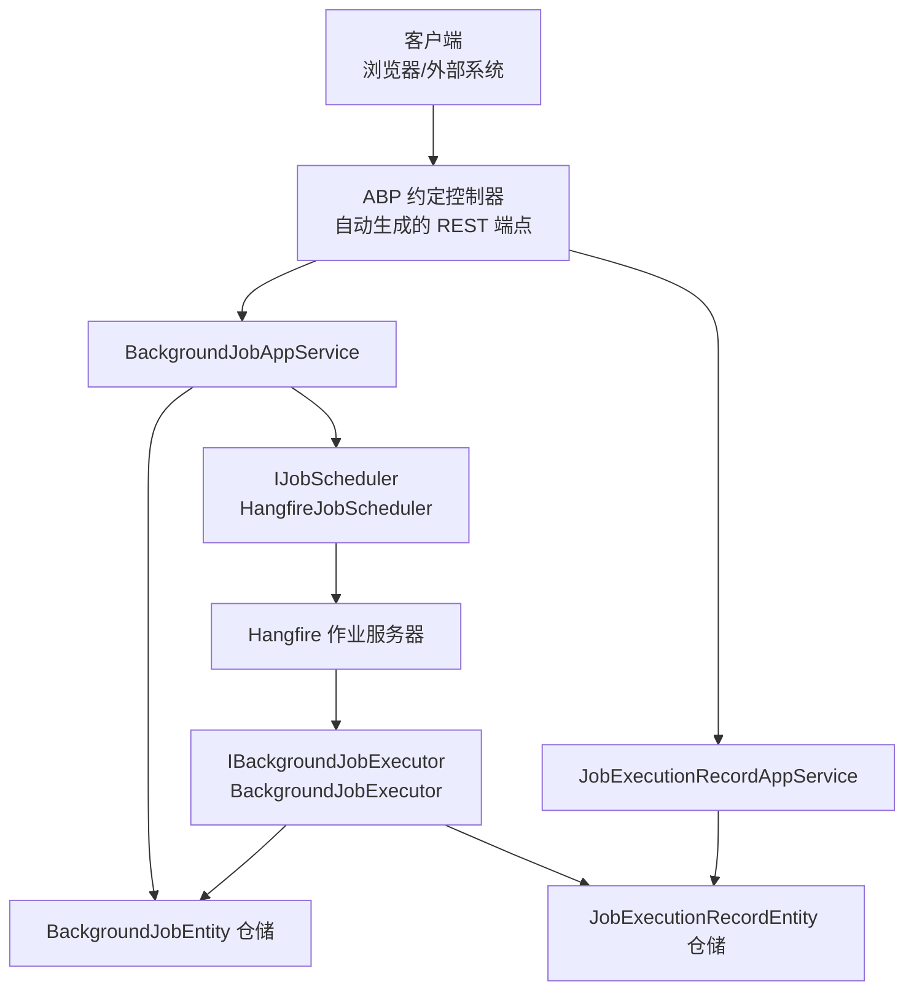
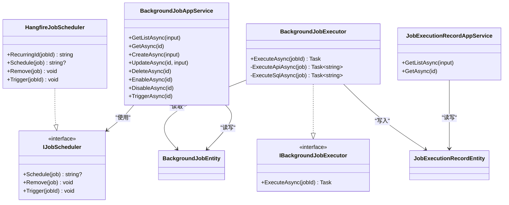
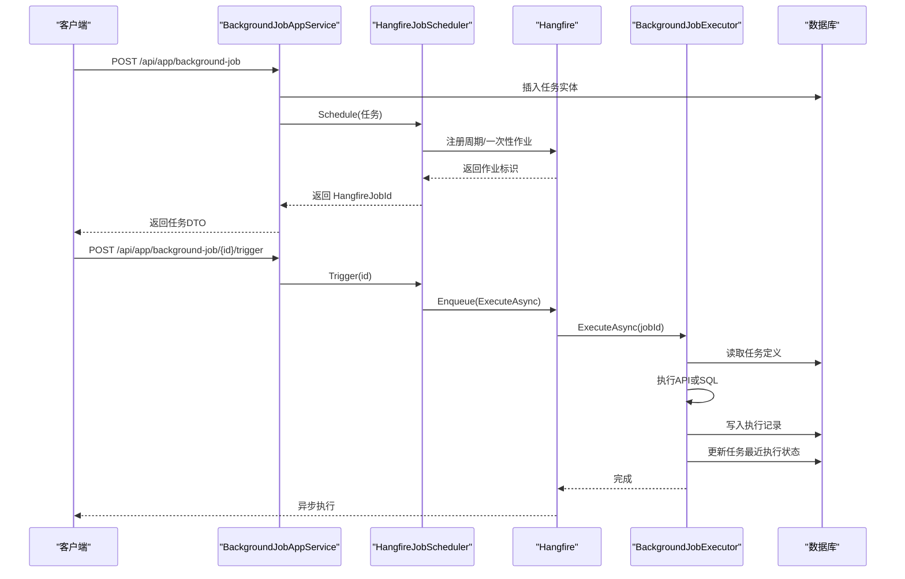
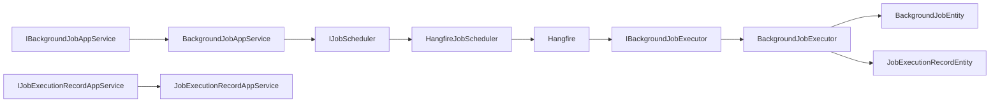
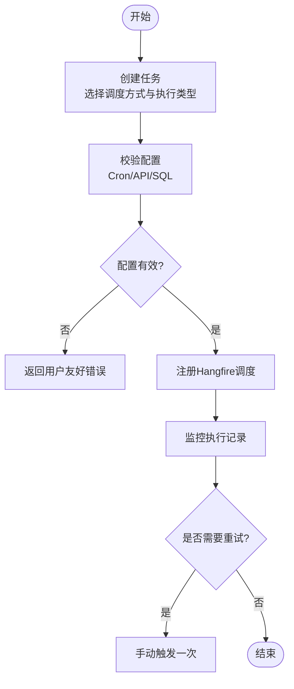

# 后台任务API

<cite>
**本文引用的文件**   
- [BackgroundTaskEnums.cs](file://src/Services/BackgroundTask/H.BackgroundTask.Application.Contracts/Enums/BackgroundTaskEnums.cs)
- [BackgroundJobDtos.cs](file://src/Services/BackgroundTask/H.BackgroundTask.Application.Contracts/Dtos/BackgroundJobDtos.cs)
- [JobExecutionRecordDtos.cs](file://src/Services/BackgroundTask/H.BackgroundTask.Application.Contracts/Dtos/JobExecutionRecordDtos.cs)
- [IBackgroundJobAppService.cs](file://src/Services/BackgroundTask/H.BackgroundTask.Application.Contracts/Services/IBackgroundJobAppService.cs)
- [IJobExecutionRecordAppService.cs](file://src/Services/BackgroundTask/H.BackgroundTask.Application.Contracts/Services/IJobExecutionRecordAppService.cs)
- [BackgroundJobAppService.cs](file://src/Services/BackgroundTask/H.BackgroundTask.Application/Services/BackgroundJobAppService.cs)
- [JobExecutionRecordAppService.cs](file://src/Services/BackgroundTask/H.BackgroundTask.Application/Services/JobExecutionRecordAppService.cs)
- [IJobScheduler.cs](file://src/Services/BackgroundTask/H.BackgroundTask.Application/Services/IJobScheduler.cs)
- [HangfireJobScheduler.cs](file://src/Services/BackgroundTask/H.BackgroundTask.Application/Services/HangfireJobScheduler.cs)
- [IBackgroundJobExecutor.cs](file://src/Services/BackgroundTask/H.BackgroundTask.Application/Services/IBackgroundJobExecutor.cs)
- [BackgroundJobExecutor.cs](file://src/Services/BackgroundTask/H.BackgroundTask.Application/Services/BackgroundJobExecutor.cs)
- [BackgroundJobEntity.cs](file://src/Services/BackgroundTask/H.BackgroundTask.EntityFrameworkCore/Entities/BackgroundJobEntity.cs)
- [JobExecutionRecordEntity.cs](file://src/Services/BackgroundTask/H.BackgroundTask.EntityFrameworkCore/Entities/JobExecutionRecordEntity.cs)
- [BackgroundTaskDbContext.cs](file://src/Services/BackgroundTask/H.BackgroundTask.EntityFrameworkCore/BackgroundTaskDbContext.cs)
- [20260724162027_Init.cs](file://src/Tools/H.BackgroundTask.DbMigrator/Migrations/20260724162027_Init.cs)
- [Program.cs](file://src/Host/H.AppLab.Web.Host/H.AppLab.Web.Host/Program.cs)
</cite>

## 目录
1. [简介](#简介)
2. [项目结构](#项目结构)
3. [核心组件](#核心组件)
4. [架构总览](#架构总览)
5. [详细组件分析](#详细组件分析)
6. [依赖关系分析](#依赖关系分析)
7. [性能与可观测性](#性能与可观测性)
8. [故障排查指南](#故障排查指南)
9. [结论](#结论)
10. [附录：REST API 定义](#附录rest-api-定义)

## 简介
本文件为 H.AppLab 平台的“后台任务服务”提供完整 API 文档。该服务基于 ABP 框架与 Hangfire，提供任务的创建、启用/禁用、更新、删除、手动触发、定时调度以及执行记录查询等能力。后端通过 ABP 约定控制器自动生成 RESTful 接口，前端或外部系统可通过 HTTP 调用这些端点管理任务。

## 项目结构
后台任务服务由应用契约层、应用服务层、实体数据访问层以及迁移脚本组成，并在宿主程序中暴露 Hangfire 监控面板。

**图表来源**  
- [IBackgroundJobAppService.cs:1-35](file://src/Services/BackgroundTask/H.BackgroundTask.Application.Contracts/Services/IBackgroundJobAppService.cs#L1-L35)
- [BackgroundJobAppService.cs:1-143](file://src/Services/BackgroundTask/H.BackgroundTask.Application/Services/BackgroundJobAppService.cs#L1-L143)
- [IJobExecutionRecordAppService.cs:1-16](file://src/Services/BackgroundTask/H.BackgroundTask.Application.Contracts/Services/IJobExecutionRecordAppService.cs#L1-L16)
- [JobExecutionRecordAppService.cs:1-46](file://src/Services/BackgroundTask/H.BackgroundTask.Application/Services/JobExecutionRecordAppService.cs#L1-L46)
- [IJobScheduler.cs:1-21](file://src/Services/BackgroundTask/H.BackgroundTask.Application/Services/IJobScheduler.cs#L1-L21)
- [HangfireJobScheduler.cs:1-89](file://src/Services/BackgroundTask/H.BackgroundTask.Application/Services/HangfireJobScheduler.cs#L1-L89)
- [IBackgroundJobExecutor.cs:1-13](file://src/Services/BackgroundTask/H.BackgroundTask.Application/Services/IBackgroundJobExecutor.cs#L1-L13)
- [BackgroundJobExecutor.cs:1-173](file://src/Services/BackgroundTask/H.BackgroundTask.Application/Services/BackgroundJobExecutor.cs#L1-L173)

**章节来源**  
- [BackgroundTaskDbContext.cs:1-61](file://src/Services/BackgroundTask/H.BackgroundTask.EntityFrameworkCore/BackgroundTaskDbContext.cs#L1-L61)
- [20260724162027_Init.cs:1-117](file://src/Tools/H.BackgroundTask.DbMigrator/Migrations/20260724162027_Init.cs#L1-L117)
- [Program.cs:1-112](file://src/Host/H.AppLab.Web.Host/H.AppLab.Web.Host/Program.cs#L1-L112)

## 核心组件
- 枚举定义：任务调度方式、执行类型、执行结果状态。
- DTO 定义：任务定义、任务查询参数、任务创建/更新模型、执行记录及查询参数。
- 应用服务接口：对外暴露的后台任务管理与执行记录查询接口。
- 应用服务实现：业务校验、分页查询、任务增删改查、启用禁用、立即触发、执行记录查询。
- 调度器抽象与实现：封装 Hangfire 的作业注册、移除、触发逻辑。
- 执行器接口与实现：根据执行类型调用 API 或执行 SQL，并持久化执行记录。
- 实体与数据库上下文：任务定义与执行记录的 EF Core 映射及索引。

**章节来源**  
- [BackgroundTaskEnums.cs:1-37](file://src/Services/BackgroundTask/H.BackgroundTask.Application.Contracts/Enums/BackgroundTaskEnums.cs#L1-L37)
- [BackgroundJobDtos.cs:1-115](file://src/Services/BackgroundTask/H.BackgroundTask.Application.Contracts/Dtos/BackgroundJobDtos.cs#L1-L115)
- [JobExecutionRecordDtos.cs:1-48](file://src/Services/BackgroundTask/H.BackgroundTask.Application.Contracts/Dtos/JobExecutionRecordDtos.cs#L1-L48)
- [IBackgroundJobAppService.cs:1-35](file://src/Services/BackgroundTask/H.BackgroundTask.Application.Contracts/Services/IBackgroundJobAppService.cs#L1-L35)
- [IJobExecutionRecordAppService.cs:1-16](file://src/Services/BackgroundTask/H.BackgroundTask.Application.Contracts/Services/IJobExecutionRecordAppService.cs#L1-L16)
- [BackgroundJobAppService.cs:1-143](file://src/Services/BackgroundTask/H.BackgroundTask.Application/Services/BackgroundJobAppService.cs#L1-L143)
- [JobExecutionRecordAppService.cs:1-46](file://src/Services/BackgroundTask/H.BackgroundTask.Application/Services/JobExecutionRecordAppService.cs#L1-L46)
- [IJobScheduler.cs:1-21](file://src/Services/BackgroundTask/H.BackgroundTask.Application/Services/IJobScheduler.cs#L1-L21)
- [HangfireJobScheduler.cs:1-89](file://src/Services/BackgroundTask/H.BackgroundTask.Application/Services/HangfireJobScheduler.cs#L1-L89)
- [IBackgroundJobExecutor.cs:1-13](file://src/Services/BackgroundTask/H.BackgroundTask.Application/Services/IBackgroundJobExecutor.cs#L1-L13)
- [BackgroundJobExecutor.cs:1-173](file://src/Services/BackgroundTask/H.BackgroundTask.Application/Services/BackgroundJobExecutor.cs#L1-L173)
- [BackgroundJobEntity.cs:1-61](file://src/Services/BackgroundTask/H.BackgroundTask.EntityFrameworkCore/Entities/BackgroundJobEntity.cs#L1-L61)
- [JobExecutionRecordEntity.cs:1-40](file://src/Services/BackgroundTask/H.BackgroundTask.EntityFrameworkCore/Entities/JobExecutionRecordEntity.cs#L1-L40)
- [BackgroundTaskDbContext.cs:1-61](file://src/Services/BackgroundTask/H.BackgroundTask.EntityFrameworkCore/BackgroundTaskDbContext.cs#L1-L61)

## 架构总览
后台任务服务采用分层架构：
- 契约层（Application.Contracts）定义对外接口与 DTO、枚举。
- 应用层（Application）实现应用服务、调度器、执行器。
- 基础设施层（EntityFrameworkCore）定义实体、数据库上下文、迁移。
- 宿主程序（Web Host）集成 Hangfire 仪表盘与 ASP.NET Core 管道。

**图表来源**  
- [BackgroundJobAppService.cs:1-143](file://src/Services/BackgroundTask/H.BackgroundTask.Application/Services/BackgroundJobAppService.cs#L1-L143)
- [JobExecutionRecordAppService.cs:1-46](file://src/Services/BackgroundTask/H.BackgroundTask.Application/Services/JobExecutionRecordAppService.cs#L1-L46)
- [IJobScheduler.cs:1-21](file://src/Services/BackgroundTask/H.BackgroundTask.Application/Services/IJobScheduler.cs#L1-L21)
- [HangfireJobScheduler.cs:1-89](file://src/Services/BackgroundTask/H.BackgroundTask.Application/Services/HangfireJobScheduler.cs#L1-L89)
- [IBackgroundJobExecutor.cs:1-13](file://src/Services/BackgroundTask/H.BackgroundTask.Application/Services/IBackgroundJobExecutor.cs#L1-L13)
- [BackgroundJobExecutor.cs:1-173](file://src/Services/BackgroundTask/H.BackgroundTask.Application/Services/BackgroundJobExecutor.cs#L1-L173)
- [BackgroundJobEntity.cs:1-61](file://src/Services/BackgroundTask/H.BackgroundTask.EntityFrameworkCore/Entities/BackgroundJobEntity.cs#L1-L61)
- [JobExecutionRecordEntity.cs:1-40](file://src/Services/BackgroundTask/H.BackgroundTask.EntityFrameworkCore/Entities/JobExecutionRecordEntity.cs#L1-L40)

## 详细组件分析

### 任务调度相关 API
- 分页查询任务列表
  - 方法：GET
  - URL：/api/app/background-job/list
  - 请求体：BackgroundJobQueryDto（继承自分页请求对象），支持关键词过滤、调度方式、执行类型、是否启用筛选。
  - 响应：BaseOutput<PagedResultDto<BackgroundJobDto>>。
  - 行为：按 CreationTime 倒序分页；若 MaxResultCount<=0 默认返回 10 条。
  - 参考路径：[BackgroundJobAppService.cs:23-50](file://src/Services/BackgroundTask/H.BackgroundTask.Application/Services/BackgroundJobAppService.cs#L23-L50)

- 获取任务详情
  - 方法：GET
  - URL：/api/app/background-job/{id}
  - 响应：BaseOutput<BackgroundJobDto>。
  - 参考路径：[BackgroundJobAppService.cs:52-58](file://src/Services/BackgroundTask/H.BackgroundTask.Application/Services/BackgroundJobAppService.cs#L52-L58)

- 创建任务（同时注册到 Hangfire）
  - 方法：POST
  - URL：/api/app/background-job
  - 请求体：CreateBackgroundJobDto。
  - 校验规则：
    - 周期任务必须配置 CronExpression。
    - API 类型必须配置 ApiUrl。
    - SQL 类型必须配置 SqlConnectionString 与 SqlStatement。
  - 行为：插入任务实体后调用调度器 Schedule，回写 HangfireJobId。
  - 响应：BaseOutput<BackgroundJobDto>。
  - 参考路径：[BackgroundJobAppService.cs:60-76](file://src/Services/BackgroundTask/H.BackgroundTask.Application/Services/BackgroundJobAppService.cs#L60-L76)

- 更新任务（同步更新 Hangfire 调度）
  - 方法：PUT
  - URL：/api/app/background-job/{id}
  - 请求体：UpdateBackgroundJobDto。
  - 行为：先移除既有调度，再应用新字段并重新注册调度。
  - 响应：BaseOutput<BackgroundJobDto>。
  - 参考路径：[BackgroundJobAppService.cs:78-94](file://src/Services/BackgroundTask/H.BackgroundTask.Application/Services/BackgroundJobAppService.cs#L78-L94)

- 删除任务（同时移除 Hangfire 作业）
  - 方法：DELETE
  - URL：/api/app/background-job/{id}
  - 行为：调用调度器 Remove 后删除实体。
  - 响应：BaseOutput。
  - 参考路径：[BackgroundJobAppService.cs:96-105](file://src/Services/BackgroundTask/H.BackgroundTask.Application/Services/BackgroundJobAppService.cs#L96-L105)

- 启用任务
  - 方法：POST
  - URL：/api/app/background-job/{id}/enable
  - 行为：IsEnabled=true，并重新注册调度。
  - 响应：BaseOutput。
  - 参考路径：[BackgroundJobAppService.cs:107-116](file://src/Services/BackgroundTask/H.BackgroundTask.Application/Services/BackgroundJobAppService.cs#L107-L116)

- 禁用任务
  - 方法：POST
  - URL：/api/app/background-job/{id}/disable
  - 行为：IsEnabled=false，移除调度并清空 HangfireJobId。
  - 响应：BaseOutput。
  - 参考路径：[BackgroundJobAppService.cs:118-127](file://src/Services/BackgroundTask/H.BackgroundTask.Application/Services/BackgroundJobAppService.cs#L118-L127)

- 手动立即触发一次执行
  - 方法：POST
  - URL：/api/app/background-job/{id}/trigger
  - 行为：校验任务存在后立即入队执行。
  - 响应：BaseOutput。
  - 参考路径：[BackgroundJobAppService.cs:129-138](file://src/Services/BackgroundTask/H.BackgroundTask.Application/Services/BackgroundJobAppService.cs#L129-L138)

**章节来源**  
- [IBackgroundJobAppService.cs:1-35](file://src/Services/BackgroundTask/H.BackgroundTask.Application.Contracts/Services/IBackgroundJobAppService.cs#L1-L35)
- [BackgroundJobAppService.cs:1-143](file://src/Services/BackgroundTask/H.BackgroundTask.Application/Services/BackgroundJobAppService.cs#L1-L143)

### 任务监控相关 API
- 分页查询执行记录
  - 方法：GET
  - URL：/api/app/job-execution-record/list
  - 请求体：JobExecutionRecordQueryDto，支持按 JobId、Status 筛选。
  - 响应：BaseOutput<PagedResultDto<JobCaseExecutionRecordDto>>。
  - 行为：按 StartTime 倒序分页。
  - 参考路径：[JobExecutionRecordAppService.cs:22-43](file://src/Services/BackgroundTask/H.BackgroundTask.Application/Services/JobExecutionRecordAppService.cs#L22-L43)

- 获取单条执行记录
  - 方法：GET
  - URL：/api/app/job-execution-record/{id}
  - 响应：BaseOutput<JobCaseExecutionRecordDto>。
  - 参考路径：[JobExecutionRecordAppService.cs:45-46](file://src/Services/BackgroundTask/H.BackgroundTask.Application/Services/JobExecutionRecordAppService.cs#L45-L46)

**章节来源**  
- [IJobExecutionRecordAppService.cs:1-16](file://src/Services/BackgroundTask/H.BackgroundTask.Application.Contracts/Services/IJobExecutionRecordAppService.cs#L1-L16)
- [JobExecutionRecordAppService.cs:1-46](file://src/Services/BackgroundTask/H.BackgroundTask.Application/Services/JobExecutionRecordAppService.cs#L1-L46)

### 任务队列与优先级
当前实现未暴露独立的队列配置或优先级设置 API。Hangfire 默认使用单一队列，优先级由 Hangfire 内部机制决定。如需多队列与优先级，可在调度器扩展中注入队列名称与优先级参数。

**章节来源**  
- [HangfireJobScheduler.cs:1-89](file://src/Services/BackgroundTask/H.BackgroundTask.Application/Services/HangfireJobScheduler.cs#L1-L89)

### Hangfire 集成与分布式任务处理
- 调度器实现
  - 周期性任务：使用 recurring job id 约定 bgtask:{jobId}，并通过 AddOrUpdate 注册 Cron 表达式。
  - 一次性任务：
    - 未来时间：使用 Schedule 在指定 DateTimeOffset 执行。
    - 过去或空时间：直接 Enqueue 立即入队。
  - 移除调度：根据 TriggerKind 分别调用 RecurringJobManager 或 BackgroundJobClient 删除。
  - 立即触发：统一 Enqueue 执行器。
  - 参考路径：[HangfireJobScheduler.cs:15-89](file://src/Services/BackgroundTask/H.BackgroundTask.Application/Services/HangfireJobScheduler.cs#L15-L89)

- 执行器实现
  - 工作单元：每个执行在独立 UOW 中运行，保证 Hangfire 环境下的数据一致性。
  - API 执行：
    - 支持 GET/POST/PUT/DELETE。
    - 支持从 JSON 字符串解析请求头。
    - 非 GET/HEAD 时携带请求体，Content-Type 为 application/json。
    - 超时：HttpClient 命名客户端 BackgroundTask 超时为 2 分钟。
    - 非成功状态码抛出异常，导致执行失败记录。
  - SQL 执行：
    - 使用 SqlConnection 打开连接，CommandTimeout 120 秒。
    - 返回影响行数。
  - 执行记录：
    - 记录开始/结束时间、耗时毫秒、结果（截断至 8000 字符）、错误信息。
    - 更新任务的最近执行时间与状态。
  - 参考路径：[BackgroundJobExecutor.cs:23-173](file://src/Services/BackgroundTask/H.BackgroundTask.Application/Services/BackgroundJobExecutor.cs#L23-L173)

- 监控面板
  - 宿主程序挂载 Hangfire Dashboard 于 /hangfire。
  - 参考路径：[Program.cs:96-98](file://src/Host/H.AppLab.Web.Host/H.AppLab.Web.Host/Program.cs#L96-L98)

**图表来源**  
- [BackgroundJobAppService.cs:60-105](file://src/Services/BackgroundTask/H.BackgroundTask.Application/Services/BackgroundJobAppService.cs#L60-L105)
- [HangfireJobScheduler.cs:27-89](file://src/Services/BackgroundTask/H.BackgroundTask.Application/Services/HangfireJobScheduler.cs#L27-L89)
- [BackgroundJobExecutor.cs:40-146](file://src/Services/BackgroundTask/H.BackgroundTask.Application/Services/BackgroundJobExecutor.cs#L40-L146)

**章节来源**  
- [HangfireJobScheduler.cs:1-89](file://src/Services/BackgroundTask/H.BackgroundTask.Application/Services/HangfireJobScheduler.cs#L1-L89)
- [BackgroundJobExecutor.cs:1-173](file://src/Services/BackgroundTask/H.BackgroundTask.Application/Services/BackgroundJobExecutor.cs#L1-L173)
- [Program.cs:1-112](file://src/Host/H.AppLab.Web.Host/H.AppLab.Web.Host/Program.cs#L1-L112)

## 依赖关系分析
- 应用服务依赖仓储与调度器，解耦具体调度实现。
- 调度器依赖 Hangfire 客户端与管理器，隔离应用对 Hangfire 的直接依赖。
- 执行器依赖 HttpClientFactory、UnitOfWorkManager、日志器，确保在 Hangfire 环境中正确执行。
- 实体与上下文定义表结构与索引，迁移脚本确认初始 schema。

**图表来源**  
- [IBackgroundJobAppService.cs:1-35](file://src/Services/BackgroundTask/H.BackgroundTask.Application.Contracts/Services/IBackgroundJobAppService.cs#L1-L35)
- [BackgroundJobAppService.cs:1-143](file://src/Services/BackgroundTask/H.BackgroundTask.Application/Services/BackgroundJobAppService.cs#L1-L143)
- [IJobExecutionRecordAppService.cs:1-16](file://src/Services/BackgroundTask/H.BackgroundTask.Application.Contracts/Services/IJobExecutionRecordAppService.cs#L1-L16)
- [JobExecutionRecordAppService.cs:1-46](file://src/Services/BackgroundTask/H.BackgroundTask.Application/Services/JobExecutionRecordAppService.cs#L1-L46)
- [IJobScheduler.cs:1-21](file://src/Services/BackgroundTask/H.BackgroundTask.Application/Services/IJobScheduler.cs#L1-L21)
- [HangfireJobScheduler.cs:1-89](file://src/Services/BackgroundTask/H.BackgroundTask.Application/Services/HangfireJobScheduler.cs#L1-L89)
- [IBackgroundJobExecutor.cs:1-13](file://src/Services/BackgroundTask/H.BackgroundTask.Application/Services/IBackgroundJobExecutor.cs#L1-L13)
- [BackgroundJobExecutor.cs:1-173](file://src/Services/BackgroundTask/H.BackgroundTask.Application/Services/BackgroundJobExecutor.cs#L1-L173)
- [BackgroundJobEntity.cs:1-61](file://src/Services/BackgroundTask/H.BackgroundTask.EntityFrameworkCore/Entities/BackgroundJobEntity.cs#L1-L61)
- [JobExecutionRecordEntity.cs:1-40](file://src/Services/BackgroundTask/H.BackgroundTask.EntityFrameworkCore/Entities/JobExecutionRecordEntity.cs#L1-L40)

**章节来源**  
- [BackgroundTaskDbContext.cs:1-61](file://src/Services/BackgroundTask/H.BackgroundTask.EntityFrameworkCore/BackgroundTaskDbContext.cs#L1-L61)
- [20260724162027_Init.cs:1-117](file://src/Tools/H.BackgroundTask.DbMigrator/Migrations/20260724162027_Init.cs#L1-L117)

## 性能与可观测性
- 执行记录截断：最大保存 8000 字符，避免大结果集拖慢存储与展示。
- 超时控制：
  - HTTP 客户端 BackgroundTask 超时 2 分钟。
  - SQL CommandTimeout 120 秒。
- 分页优化：默认排序按 CreationTime/StartTime 倒序，Skip/Take 分页。
- Hangfire 监控：Dashboard 暴露 /hangfire，便于观察作业状态、重试次数、队列情况。
- 日志：执行失败记录异常消息，便于定位问题。

**章节来源**  
- [BackgroundJobExecutor.cs:152-173](file://src/Services/BackgroundTask/H.BackgroundTask.Application/Services/BackgroundJobExecutor.cs#L152-L173)
- [BackgroundJobAppService.cs:32-48](file://src/Services/BackgroundTask/H.BackgroundTask.Application/Services/BackgroundJobAppService.cs#L32-L48)
- [JobExecutionRecordAppService.cs:31-43](file://src/Services/BackgroundTask/H.BackgroundTask.Application/Services/JobExecutionRecordAppService.cs#L31-L43)
- [Program.cs:96-98](file://src/Host/H.AppLab.Web.Host/H.AppLab.Web.Host/Program.cs#L96-L98)

## 故障排查指南
- 周期任务未触发
  - 检查 CronExpression 是否有效且任务处于启用状态。
  - 查看 Hangfire 面板中是否存在对应 recurring job。
  - 参考路径：[HangfireJobScheduler.cs:36-52](file://src/Services/BackgroundTask/H.BackgroundTask.Application/Services/HangfireJobScheduler.cs#L36-L52)

- API 任务失败
  - 检查 ApiUrl、ApiHttpMethod、ApiHeaders、ApiBody 配置是否正确。
  - 关注响应状态码与 Body，非成功状态将抛异常并记录失败。
  - 参考路径：[BackgroundJobExecutor.cs:84-130](file://src/Services/BackgroundTask/H.BackgroundTask.Application/Services/BackgroundJobExecutor.cs#L84-L130)

- SQL 任务失败
  - 检查 SqlConnectionString 与 SqlStatement 是否配置。
  - 注意命令超时与连接可用性。
  - 参考路径：[BackgroundJobExecutor.cs:132-151](file://src/Services/BackgroundTask/H.BackgroundTask.Application/Services/BackgroundJobExecutor.cs#L132-L151)

- 执行记录缺失
  - 确认任务执行是否进入 ExecuteAsync。
  - 检查工作单元是否正常 Complete。
  - 参考路径：[BackgroundJobExecutor.cs:40-83](file://src/Services/BackgroundTask/H.BackgroundTask.Application/Services/BackgroundJobExecutor.cs#L40-L83)

**章节来源**  
- [BackgroundJobExecutor.cs:40-173](file://src/Services/BackgroundTask/H.BackgroundTask.Application/Services/BackgroundJobExecutor.cs#L40-L173)
- [HangfireJobScheduler.cs:36-89](file://src/Services/BackgroundTask/H.BackgroundTask.Application/Services/HangfireJobScheduler.cs#L36-L89)

## 结论
H.AppLab 后台任务服务通过 ABP 约定控制器暴露统一的 REST API，结合 Hangfire 实现稳定可靠的定时与一次性任务调度。执行器支持 HTTP API 调用与 SQL 执行，并提供完整的执行记录与状态追踪。对于生产环境，建议：
- 规范 Cron 表达式与任务配置。
- 合理设置 HTTP 与 SQL 超时。
- 利用 Hangfire 监控面板进行运维观察。
- 在执行器中增加幂等性与重试策略以增强健壮性。

## 附录：REST API 定义

### 通用说明
- 所有接口返回 BaseOutput<T> 包装结构。
- 分页接口使用 PagedResultRequestDto/PagedResultDto，包含 SkipCount、MaxResultCount、TotalCount 等字段。
- 枚举值：
  - JobTriggerKind：OneTime=0，Recurring=1
  - JobExecuteType：Api=0，Sql=1
  - JobExecutionStatus：Success=0，Failed=1

**章节来源**  
- [BackgroundTaskEnums.cs:1-37](file://src/Services/BackgroundTask/H.BackgroundTask.Application.Contracts/Enums/BackgroundTaskEnums.cs#L1-L37)

### 任务定义 DTO 字段
- BackgroundJobDto：
  - Name、TriggerKind、ExecuteType、CronExpression、ScheduledTime
  - ApiUrl、ApiHttpMethod、ApiHeaders、ApiBody
  - SqlConnectionString、SqlStatement
  - IsEnabled、HangfireJobId、LastExecutionTime、LastExecutionStatus、Remark
- CreateBackgroundJobDto：同上（不含 Id、HangfireJobId、LastExecution*）。
- UpdateBackgroundJobDto：同 CreateBackgroundJobDto。
- BackgroundJobQueryDto：Filter、TriggerKind、ExecuteType、IsEnabled。

**章节来源**  
- [BackgroundJobDtos.cs:1-115](file://src/Services/BackgroundTask/H.BackgroundTask.Application.Contracts/Dtos/BackgroundJobDtos.cs#L1-L115)

### 执行记录 DTO 字段
- JobCaseExecutionRecordDto：
  - JobId、JobName、ExecuteType、Status、StartTime、EndTime、DurationMs、Result、ErrorMessage
- JobExecutionRecordQueryDto：
  - JobId、Status

**章节来源**  
- [JobExecutionRecordDtos.cs:1-48](file://src/Services/BackgroundTask/H.BackgroundTask.Application.Contracts/Dtos/JobExecutionRecordDtos.cs#L1-L48)

### 任务编排方案示例（概念流程）

[本图为概念流程，不对应具体代码结构]