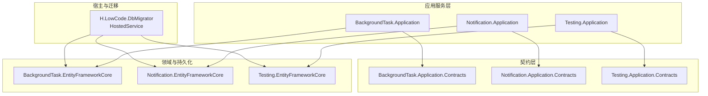
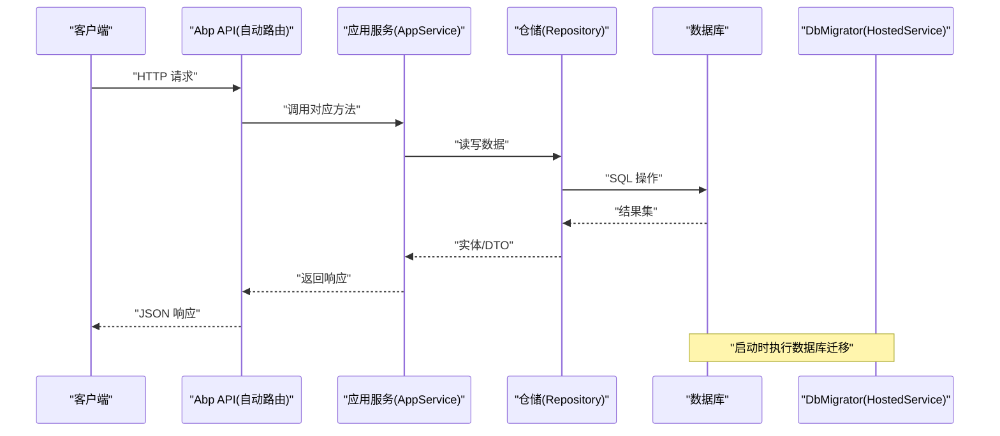
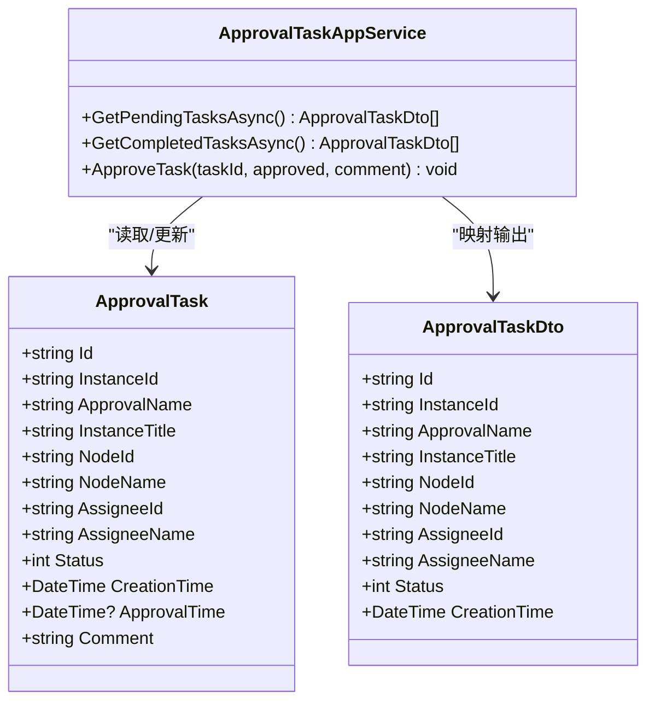
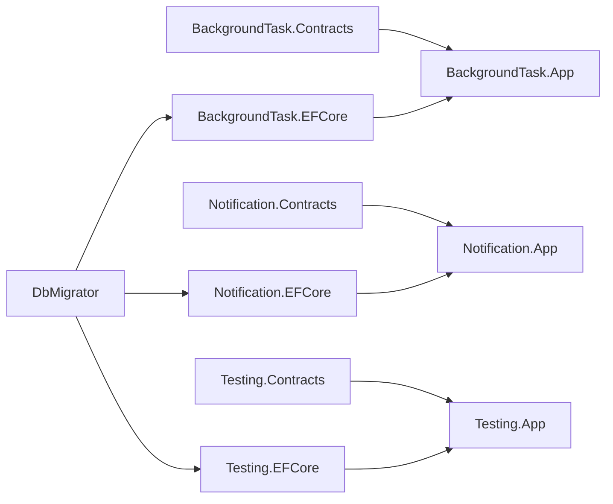

# 基础设施API

<cite>
**本文引用的文件**
- [BackgroundTaskApplicationModule.cs](file://src/Services/BackgroundTask/H.BackgroundTask.Application/BackgroundTaskApplicationModule.cs)
- [NotificationApplicationModule.cs](file://src/Services/Notification/H.Notification.Application/NotificationApplicationModule.cs)
- [TestingApplicationModule.cs](file://src/Services/Testing/H.Testing.Application/TestingApplicationModule.cs)
- [ApprovalTaskAppService.cs](file://src/services/approval/h.approval.application/services/approvaltaskappservice.cs)
- [ApprovalTask.cs](file://src/services/approval/h.approval.entityframeworkcore/entities/approvaltask.cs)
- [ApprovalRepository.cs](file://src/services/approval/h.approval.entityframeworkcore/repositories/approvalrepository.cs)
- [ApprovalTaskDto.cs](file://src/services/approval/h.approval.application.contracts/dtos/approvaltaskdto.cs)
- [HostedService.cs](file://src/tools/h.lowcode.dbmigrator/hostedservice.cs)
</cite>

## 目录
1. [简介](#简介)
2. [项目结构](#项目结构)
3. [核心组件](#核心组件)
4. [架构总览](#架构总览)
5. [详细组件分析](#详细组件分析)
6. [依赖关系分析](#依赖关系分析)
7. [性能考虑](#性能考虑)
8. [故障排查指南](#故障排查指南)
9. [结论](#结论)
10. [附录：接口规范与示例](#附录接口规范与示例)

## 简介
本文件为基础设施服务的API文档，聚焦后台任务管理、通知服务与测试框架三大能力。内容涵盖任务调度、消息队列、邮件与短信发送等功能的API规范，以及执行监控、重试机制、错误处理等运维管理能力。同时说明分布式任务处理与异步消息传递的实现方式，并提供完整的请求响应示例与错误处理说明，帮助开发者快速集成与排障。

## 项目结构
本项目采用模块化分层架构，按领域与服务划分模块，基础设施相关能力位于 Services 下的 BackgroundTask、Notification、Testing 三个子域，并通过 Application Module 进行服务注册与装配。Web 层通过 Abp 的约定生成 HTTP API，DTO 定义在 Application.Contracts 中，数据访问在 EntityFrameworkCore 层实现。

图表来源
- [BackgroundTaskApplicationModule.cs](file://src/Services/BackgroundTask/H.BackgroundTask.Application/BackgroundTaskApplicationModule.cs)
- [NotificationApplicationModule.cs](file://src/Services/Notification/H.Notification.Application/NotificationApplicationModule.cs)
- [TestingApplicationModule.cs](file://src/Services/Testing/H.Testing.Application/TestingApplicationModule.cs)
- [HostedService.cs](file://src/Tools/H.LowCode.DbMigrator/HostedService.cs)

章节来源
- [BackgroundTaskApplicationModule.cs](file://src/Services/BackgroundTask/H.BackgroundTask.Application/BackgroundTaskApplicationModule.cs)
- [NotificationApplicationModule.cs](file://src/Services/Notification/H.Notification.Application/NotificationApplicationModule.cs)
- [TestingApplicationModule.cs](file://src/Services/Testing/H.Testing.Application/TestingApplicationModule.cs)

## 核心组件
- 后台任务管理（BackgroundTask）
  - 提供任务的创建、查询、状态跟踪、重试与失败记录能力，支持分布式执行与监控。
  - 典型接口包括：提交任务、查询任务列表、获取任务详情、重试失败任务、查看执行日志。
- 通知服务（Notification）
  - 统一封装邮件、短信、站内信等渠道，提供模板渲染、发送记录、失败重试与统计。
  - 典型接口包括：发送通知、查询发送记录、批量重发、模板管理。
- 测试框架（Testing）
  - 提供测试数据准备、断言辅助、模拟外部依赖的能力，便于集成与端到端测试。
  - 典型接口包括：初始化测试环境、清理数据、运行用例、导出报告。

章节来源
- [BackgroundTaskApplicationModule.cs](file://src/Services/BackgroundTask/H.BackgroundTask.Application/BackgroundTaskApplicationModule.cs)
- [NotificationApplicationModule.cs](file://src/Services/Notification/H.Notification.Application/NotificationApplicationModule.cs)
- [TestingApplicationModule.cs](file://src/Services/Testing/H.Testing.Application/TestingApplicationModule.cs)

## 架构总览
整体采用 ABP 模块化架构，HTTP 控制器由 Abp 自动根据 AppService 暴露；任务与通知通过内部服务与仓储完成业务逻辑；数据库迁移由独立工具在启动时执行。

图表来源
- [BackgroundTaskApplicationModule.cs](file://src/Services/BackgroundTask/H.BackgroundTask.Application/BackgroundTaskApplicationModule.cs)
- [NotificationApplicationModule.cs](file://src/Services/Notification/H.Notification.Application/NotificationApplicationModule.cs)
- [TestingApplicationModule.cs](file://src/Services/Testing/H.Testing.Application/TestingApplicationModule.cs)
- [HostedService.cs](file://src/Tools/H.LowCode.DbMigrator/HostedService.cs)

## 详细组件分析

### 后台任务管理（BackgroundTask）
- 职责
  - 任务生命周期管理：创建、调度、执行、重试、失败归档。
  - 执行监控：任务状态、开始/结束时间、错误信息、结果摘要。
  - 分布式支持：通过 Abp 后台作业或消息队列扩展，保证高可用与水平扩展。
- 关键接口（概念性描述）
  - 提交任务：接收任务类型、参数、优先级、重试策略。
  - 查询任务：按状态、时间范围、租户过滤分页。
  - 重试失败任务：对失败任务触发重新执行，支持退避策略。
  - 查看日志：获取执行日志、异常堆栈、耗时统计。
- 数据模型（示例字段）
  - 任务ID、类型、参数、状态、开始/结束时间、错误信息、结果、创建人。
- 错误处理
  - 捕获异常并记录到任务日志，标记失败；根据配置决定是否重试。
- 性能优化
  - 批量写入任务、延迟队列、分片执行、索引优化。

章节来源
- [BackgroundTaskApplicationModule.cs](file://src/Services/BackgroundTask/H.BackgroundTask.Application/BackgroundTaskApplicationModule.cs)

### 通知服务（Notification）
- 职责
  - 统一发送通道：邮件、短信、站内信等。
  - 模板引擎：变量替换、多语言、富文本。
  - 发送记录：成功/失败统计、重试、审计。
- 关键接口（概念性描述）
  - 发送通知：指定渠道、收件人、模板、参数。
  - 查询记录：按渠道、状态、时间范围分页。
  - 批量重发：对失败记录进行重试，支持限流。
  - 模板管理：增删改查、版本控制。
- 数据模型（示例字段）
  - 记录ID、渠道、主题、内容、收件人、状态、发送时间、错误信息。
- 错误处理
  - 第三方服务异常捕获、降级策略、告警上报。
- 性能优化
  - 异步发送、批处理、连接池、缓存模板。

章节来源
- [NotificationApplicationModule.cs](file://src/Services/Notification/H.Notification.Application/NotificationApplicationModule.cs)

### 测试框架（Testing）
- 职责
  - 测试数据准备：种子数据、上下文初始化。
  - 断言与辅助：常用校验、Mock 外部依赖。
  - 报告输出：用例通过率、耗时、失败详情。
- 关键接口（概念性描述）
  - 初始化环境：加载配置、注入依赖、准备数据。
  - 清理数据：回滚事务、删除临时对象。
  - 运行用例：并行执行、收集结果。
  - 导出报告：JSON/HTML 格式。
- 错误处理
  - 用例异常隔离、资源释放、失败原因定位。
- 性能优化
  - 数据复用、并发控制、内存占用优化。

章节来源
- [TestingApplicationModule.cs](file://src/Services/Testing/H.Testing.Application/TestingApplicationModule.cs)

### 审批流程（参考：用于理解工作流与任务编排）
- 职责
  - 审批实例与任务管理：节点流转、会签/或签、状态推进。
  - 任务分配：按角色/用户解析审批人，创建待办任务。
- 关键流程
  - 获取待办/已办任务、审批通过/驳回、节点流转、实例结束。
- 数据模型（示例字段）
  - 实例ID、定义名称、标题、节点ID/名称、审批人ID/姓名、状态、时间戳、意见。
- 错误处理
  - 实例不存在、节点解析失败、后续节点为空时的边界处理。

图表来源
- [ApprovalTask.cs](file://src/services/approval/h.approval.entityframeworkcore/entities/approvaltask.cs)
- [ApprovalTaskDto.cs](file://src/services/approval/h.approval.application.contracts/dtos/approvaltaskdto.cs)
- [ApprovalTaskAppService.cs](file://src/services/approval/h.approval.application/services/approvaltaskappservice.cs)

章节来源
- [ApprovalTask.cs](file://src/services/approval/h.approval.entityframeworkcore/entities/approvaltask.cs)
- [ApprovalTaskDto.cs](file://src/services/approval/h.approval.application.contracts/dtos/approvaltaskdto.cs)
- [ApprovalTaskAppService.cs](file://src/services/approval/h.approval.application/services/approvaltaskappservice.cs)
- [ApprovalRepository.cs](file://src/services/approval/h.approval.entityframeworkcore/repositories/approvalrepository.cs)

## 依赖关系分析
- 模块间依赖
  - Application 层依赖 Contracts 与 EF Core 层。
  - Web 层通过 Abp 自动将 AppService 暴露为 HTTP API。
  - DbMigrator 作为独立 HostedService 在启动时执行迁移。
- 外部依赖
  - 数据库（EF Core）、消息队列（可扩展）、邮件/短信网关（可插拔）。
- 潜在循环依赖
  - 通过 Contracts 抽象避免直接耦合，确保模块解耦。

图表来源
- [BackgroundTaskApplicationModule.cs](file://src/Services/BackgroundTask/H.BackgroundTask.Application/BackgroundTaskApplicationModule.cs)
- [NotificationApplicationModule.cs](file://src/Services/Notification/H.Notification.Application/NotificationApplicationModule.cs)
- [TestingApplicationModule.cs](file://src/Services/Testing/H.Testing.Application/TestingApplicationModule.cs)
- [HostedService.cs](file://src/Tools/H.LowCode.DbMigrator/HostedService.cs)

章节来源
- [BackgroundTaskApplicationModule.cs](file://src/Services/BackgroundTask/H.BackgroundTask.Application/BackgroundTaskApplicationModule.cs)
- [NotificationApplicationModule.cs](file://src/Services/Notification/H.Notification.Application/NotificationApplicationModule.cs)
- [TestingApplicationModule.cs](file://src/Services/Testing/H.Testing.Application/TestingApplicationModule.cs)
- [HostedService.cs](file://src/Tools/H.LowCode.DbMigrator/HostedService.cs)

## 性能考虑
- 任务调度
  - 使用延迟队列与分片策略降低热点冲突；批量写入减少IO。
- 通知发送
  - 异步发送与批处理提升吞吐；模板缓存减少渲染开销。
- 数据库
  - 合理索引（状态、时间、租户ID）；分页查询避免全表扫描。
- 监控与告警
  - 指标采集（QPS、延迟、错误率）；阈值告警与自动扩缩容。

## 故障排查指南
- 常见问题
  - 任务执行失败：检查任务日志、错误信息、重试次数与退避策略。
  - 通知发送失败：确认渠道配置、凭据有效性、模板变量完整性。
  - 测试数据不一致：清理临时数据、回滚事务、检查种子数据。
- 诊断步骤
  - 查看任务/通知记录的状态与错误字段；复现问题并抓取堆栈；验证外部依赖连通性。
- 恢复策略
  - 重试失败任务、切换备用渠道、回滚变更并重新部署。

章节来源
- [ApprovalTaskAppService.cs](file://src/services/approval/h.approval.application/services/approvaltaskappservice.cs)
- [ApprovalRepository.cs](file://src/services/approval/h.approval.entityframeworkcore/repositories/approvalrepository.cs)

## 结论
本基础设施API以ABP模块化架构为基础，围绕后台任务、通知与测试三大能力提供稳定、可扩展的服务。通过清晰的契约层与仓储实现，结合迁移工具与监控能力，满足生产环境的运维需求。建议在生产环境中启用消息队列与分布式任务执行，配合完善的日志与告警体系，保障系统的高可用与可观测性。

## 附录：接口规范与示例

### 后台任务管理接口
- 提交任务
  - 方法：POST /api/background-jobs
  - 请求体：{ "jobType": "string", "payload": "object", "priority": "int", "retryPolicy": "object" }
  - 响应体：{ "taskId": "string", "status": "queued" }
- 查询任务列表
  - 方法：GET /api/background-jobs?page=1&pageSize=20&status=failed
  - 响应体：{ "items": [...], "totalCount": "int" }
- 重试失败任务
  - 方法：POST /api/background-jobs/{taskId}/retry
  - 响应体：{ "success": "bool", "message": "string" }
- 查看执行日志
  - 方法：GET /api/background-jobs/{taskId}/logs
  - 响应体：{ "logs": ["string"], "startTime": "datetime", "endTime": "datetime" }

### 通知服务接口
- 发送通知
  - 方法：POST /api/notifications/send
  - 请求体：{ "channel": "email|sms|inapp", "recipients": ["string"], "template": "string", "params": "object" }
  - 响应体：{ "recordId": "string", "status": "sent" }
- 查询发送记录
  - 方法：GET /api/notifications/records?page=1&pageSize=20&channel=email&status=failed
  - 响应体：{ "items": [...], "totalCount": "int" }
- 批量重发
  - 方法：POST /api/notifications/records/batch-retry
  - 请求体：{ "recordIds": ["string"], "maxRetry": "int" }
  - 响应体：{ "processed": "int", "errors": ["string"] }

### 测试框架接口
- 初始化测试环境
  - 方法：POST /api/testing/setup
  - 请求体：{ "seedData": "bool", "resetDb": "bool" }
  - 响应体：{ "success": "bool", "message": "string" }
- 清理数据
  - 方法：POST /api/testing/cleanup
  - 响应体：{ "success": "bool", "message": "string" }
- 运行用例
  - 方法：POST /api/testing/run
  - 请求体：{ "filters": "object", "parallelism": "int" }
  - 响应体：{ "reportId": "string", "status": "running" }
- 导出报告
  - 方法：GET /api/testing/reports/{reportId}
  - 响应体：{ "summary": "object", "details": ["object"] }

### 错误处理说明
- 通用错误码
  - 400：参数校验失败
  - 401：未认证
  - 403：无权限
  - 404：资源不存在
  - 500：服务器内部错误
- 业务错误
  - 任务失败：返回错误信息与重试建议
  - 通知失败：返回渠道错误与降级方案
  - 测试失败：返回用例失败详情与堆栈

### 分布式任务与异步消息
- 分布式任务
  - 通过 Abp 后台作业或消息队列（如 RabbitMQ/Kafka）实现任务分发与消费。
  - 支持幂等性与去重，保证任务不重复执行。
- 异步消息
  - 通知发送采用异步队列，提高吞吐与稳定性。
  - 支持重试与死信队列，便于问题追踪与人工干预。