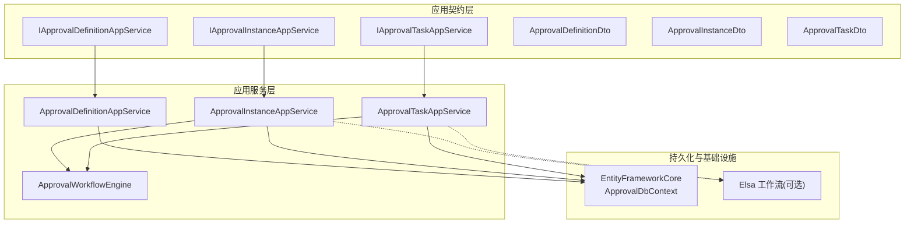
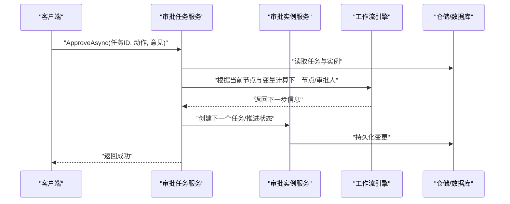
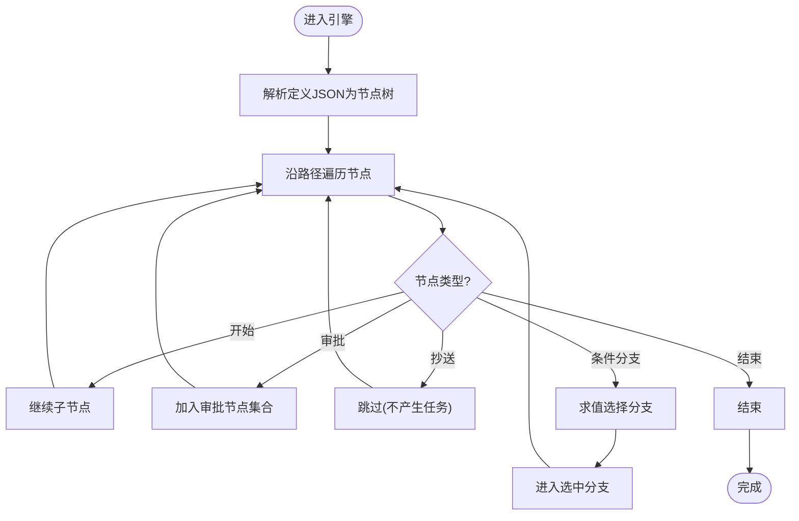
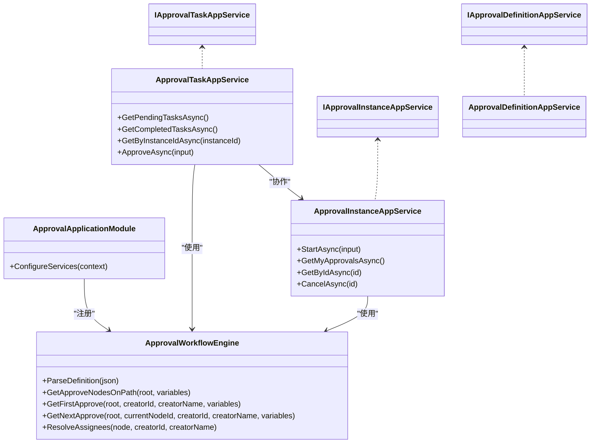

# 审批流程API

<cite>
**本文引用的文件**   
- [ApprovalApplicationModule.cs](file://src/Services/Approval/H.Approval.Application/ApprovalApplicationModule.cs)
- [ApprovalWorkflowEngine.cs](file://src/Services/Approval/H.Approval.Application/Services/ApprovalWorkflowEngine.cs)
- [ApprovalInstanceAppService.cs](file://src/Services/Approval/H.Approval.Application/Services/ApprovalInstanceAppService.cs)
- [ApprovalTaskAppService.cs](file://src/Services/Approval/H.Approval.Application/Services/ApprovalTaskAppService.cs)
- [IApprovalDefinitionAppService.cs](file://src/Services/Approval/H.Approval.Application.Contracts/Services/IApprovalDefinitionAppService.cs)
- [IApprovalInstanceAppService.cs](file://src/Services/Approval/H.Approval.Application.Contracts/Services/IApprovalInstanceAppService.cs)
- [IApprovalTaskAppService.cs](file://src/Services/Approval/H.Approval.Application.Contracts/Services/IApprovalTaskAppService.cs)
- [ApprovalDefinitionDto.cs](file://src/Services/Approval/H.Approval.Application.Contracts/Dtos/ApprovalDefinitionDto.cs)
- [ApprovalInstanceDto.cs](file://src/Services/Approval/H.Approval.Application.Contracts/Dtos/ApprovalInstanceDto.cs)
- [ApprovalTaskDto.cs](file://src/Services/Approval/H.Approval.Application.Contracts/Dtos/ApprovalTaskDto.cs)
</cite>

## 目录
1. [简介](#简介)
2. [项目结构](#项目结构)
3. [核心组件](#核心组件)
4. [架构总览](#架构总览)
5. [详细组件分析](#详细组件分析)
6. [依赖关系分析](#依赖关系分析)
7. [性能考虑](#性能考虑)
8. [故障排查指南](#故障排查指南)
9. [结论](#结论)
10. [附录：接口规范与示例](#附录接口规范与示例)

## 简介
本文件为“审批流程服务”的API文档，覆盖审批模板（定义）管理、流程定义、实例创建、任务处理等核心能力，并详细说明工作流引擎的节点类型、条件分支、会签机制等功能的API规范。同时提供审批状态跟踪、流程监控、历史查询等管理能力说明，以及请求响应示例与错误处理建议，帮助开发者快速集成与排障。

## 项目结构
审批服务采用分层架构：应用契约层（DTO与接口）、应用服务层（业务编排）、领域引擎（自包含的工作流引擎）、持久化（EF Core）。Web模块负责对外暴露HTTP API。

图表来源
- [ApprovalApplicationModule.cs:18-36](file://src/Services/Approval/H.Approval.Application/ApprovalApplicationModule.cs#L18-L36)
- [ApprovalWorkflowEngine.cs:13-30](file://src/Services/Approval/H.Approval.Application/Services/ApprovalWorkflowEngine.cs#L13-L30)
- [ApprovalInstanceAppService.cs:13-36](file://src/Services/Approval/H.Approval.Application/Services/ApprovalInstanceAppService.cs#L13-L36)
- [ApprovalTaskAppService.cs:13-39](file://src/Services/Approval/H.Approval.Application/Services/ApprovalTaskAppService.cs#L13-L39)

章节来源
- [ApprovalApplicationModule.cs:18-36](file://src/Services/Approval/H.Approval.Application/ApprovalApplicationModule.cs#L18-L36)

## 核心组件
- 审批定义服务（模板管理）：提供定义的CRUD、启用/禁用、按分类管理等能力。
- 审批实例服务（流程运行）：启动实例、查询我的发起、详情（含任务历史）、取消实例。
- 审批任务服务（任务处理）：待办/已办列表、按实例查历史、执行通过/驳回并推进流程。
- 工作流引擎（自包含）：解析设计器产出的节点树JSON，支持依次/会签/或签、抄送跳过、条件分支求值、结束节点。

章节来源
- [IApprovalDefinitionAppService.cs:1-39](file://src/Services/Approval/H.Approval.Application.Contracts/Services/IApprovalDefinitionAppService.cs#L1-L39)
- [IApprovalInstanceAppService.cs:1-29](file://src/Services/Approval/H.Approval.Application.Contracts/Services/IApprovalInstanceAppService.cs#L1-L29)
- [IApprovalTaskAppService.cs:1-29](file://src/Services/Approval/H.Approval.Application.Contracts/Services/IApprovalTaskAppService.cs#L1-L29)
- [ApprovalWorkflowEngine.cs:13-30](file://src/Services/Approval/H.Approval.Application/Services/ApprovalWorkflowEngine.cs#L13-L30)

## 架构总览
整体调用链以应用服务为入口，结合仓储访问数据库，并通过工作流引擎对节点树进行求值与流转控制。Elsa在应用模块中注册，可用于扩展工作流能力（当前引擎为自包含实现）。

图表来源
- [ApprovalTaskAppService.cs:145-170](file://src/Services/Approval/H.Approval.Application/Services/ApprovalTaskAppService.cs#L145-L170)
- [ApprovalInstanceAppService.cs:13-36](file://src/Services/Approval/H.Approval.Application/Services/ApprovalInstanceAppService.cs#L13-L36)
- [ApprovalWorkflowEngine.cs:178-201](file://src/Services/Approval/H.Approval.Application/Services/ApprovalWorkflowEngine.cs#L178-L201)

## 详细组件分析

### 审批定义（模板）管理
- 能力概览
  - 获取所有定义、按ID获取、创建、更新、删除、启用/禁用。
  - 定义包含名称、描述、版本、是否启用、定义JSON、表单Schema、图标、分组、发起人权限、管理员配置等。
- 关键DTO
  - ApprovalDefinitionDto：定义元数据与JSON内容。
  - CreateApprovalDefinitionDto / UpdateApprovalDefinitionDto：输入参数。
- 典型用法
  - 创建定义后，前端可基于DefinitionJson渲染流程设计；运行时由工作流引擎解析该JSON驱动流转。

章节来源
- [IApprovalDefinitionAppService.cs:1-39](file://src/Services/Approval/H.Approval.Application.Contracts/Services/IApprovalDefinitionAppService.cs#L1-L39)
- [ApprovalDefinitionDto.cs:1-217](file://src/Services/Approval/H.Approval.Application.Contracts/Dtos/ApprovalDefinitionDto.cs#L1-L217)

### 审批实例（流程运行）
- 能力概览
  - StartAsync：传入DefinitionId、Title、VariablesJson，启动一个实例并生成首个任务。
  - GetMyApprovalsAsync：当前用户发起的实例列表。
  - GetByIdAsync：实例详情，包含当前节点信息与任务历史。
  - CancelAsync：取消进行中实例。
- 关键DTO
  - ApprovalInstanceDto：实例基本信息、当前节点、变量JSON、任务列表等。
  - StartApprovalInstanceDto：启动输入。
- 关键点
  - VariablesJson用于条件分支求值，需符合引擎期望的键值结构。

章节来源
- [IApprovalInstanceAppService.cs:1-29](file://src/Services/Approval/H.Approval.Application.Contracts/Services/IApprovalInstanceAppService.cs#L1-L29)
- [ApprovalInstanceDto.cs:1-96](file://src/Services/Approval/H.Approval.Application.Contracts/Dtos/ApprovalInstanceDto.cs#L1-L96)
- [ApprovalInstanceAppService.cs:13-36](file://src/Services/Approval/H.Approval.Application/Services/ApprovalInstanceAppService.cs#L13-L36)

### 审批任务（任务处理）
- 能力概览
  - GetPendingTasksAsync：当前用户的待办任务。
  - GetCompletedTasksAsync：当前用户的已办任务。
  - GetByInstanceIdAsync：某实例的全部任务（历史）。
  - ApproveAsync：对任务执行通过/驳回，并推进工作流到下一节点。
- 关键DTO
  - ApprovalTaskDto：任务详情（实例ID、节点、审批人、状态、时间、意见等）。
  - ApprovalTaskActionDto：任务操作输入（任务ID、动作、意见）。
- 审批模式
  - 依次审批：按顺序逐个审批人推进。
  - 会签/或签：由引擎根据节点配置决定多人审批策略（代码中体现为ApproverModeEnum）。
- 推进逻辑
  - 根据当前节点与变量，计算下一节点及审批人，创建新任务或结束流程。

章节来源
- [IApprovalTaskAppService.cs:1-29](file://src/Services/Approval/H.Approval.Application.Contracts/Services/IApprovalTaskAppService.cs#L1-L29)
- [ApprovalTaskDto.cs:1-91](file://src/Services/Approval/H.Approval.Application.Contracts/Dtos/ApprovalTaskDto.cs#L1-L91)
- [ApprovalTaskAppService.cs:13-39](file://src/Services/Approval/H.Approval.Application/Services/ApprovalTaskAppService.cs#L13-L39)
- [ApprovalTaskAppService.cs:145-170](file://src/Services/Approval/H.Approval.Application/Services/ApprovalTaskAppService.cs#L145-L170)

### 工作流引擎（节点、分支与会签）
- 节点类型
  - 开始、审批、抄送（跳过不产生任务）、条件分支、结束。
- 条件分支
  - 多规则AND求值，支持等于、不等于、大小比较、包含等操作符。
  - 默认分支兜底，未命中则回退到第一个分支。
- 审批人解析
  - 指定成员、发起人自选、角色、部门主管（暂未集成，回退到发起人）。
  - 若解析为空，回退到发起人。
- 路径遍历
  - 根据变量求值选择一条分支路径，收集路径上的审批节点。
  - 提供获取首个/下一个审批节点及其审批人的方法。

图表来源
- [ApprovalWorkflowEngine.cs:65-104](file://src/Services/Approval/H.Approval.Application/Services/ApprovalWorkflowEngine.cs#L65-L104)
- [ApprovalWorkflowEngine.cs:109-139](file://src/Services/Approval/H.Approval.Application/Services/ApprovalWorkflowEngine.cs#L109-L139)
- [ApprovalWorkflowEngine.cs:144-173](file://src/Services/Approval/H.Approval.Application/Services/ApprovalWorkflowEngine.cs#L144-L173)
- [ApprovalWorkflowEngine.cs:206-257](file://src/Services/Approval/H.Approval.Application/Services/ApprovalWorkflowEngine.cs#L206-L257)

章节来源
- [ApprovalWorkflowEngine.cs:25-30](file://src/Services/Approval/H.Approval.Application/Services/ApprovalWorkflowEngine.cs#L25-L30)
- [ApprovalWorkflowEngine.cs:65-104](file://src/Services/Approval/H.Approval.Application/Services/ApprovalWorkflowEngine.cs#L65-L104)
- [ApprovalWorkflowEngine.cs:109-139](file://src/Services/Approval/H.Approval.Application/Services/ApprovalWorkflowEngine.cs#L109-L139)
- [ApprovalWorkflowEngine.cs:144-173](file://src/Services/Approval/H.Approval.Application/Services/ApprovalWorkflowEngine.cs#L144-L173)
- [ApprovalWorkflowEngine.cs:178-201](file://src/Services/Approval/H.Approval.Application/Services/ApprovalWorkflowEngine.cs#L178-L201)
- [ApprovalWorkflowEngine.cs:206-257](file://src/Services/Approval/H.Approval.Application/Services/ApprovalWorkflowEngine.cs#L206-L257)

## 依赖关系分析
- 应用模块注册了Elsa工作流管理与运行时（SQL Server），同时注册自包含的ApprovalWorkflowEngine。
- 应用服务依赖仓储访问数据库，任务服务还依赖实例服务与工作流引擎。
- DTO位于契约层，供前后端共享。

图表来源
- [ApprovalApplicationModule.cs:18-36](file://src/Services/Approval/H.Approval.Application/ApprovalApplicationModule.cs#L18-L36)
- [ApprovalWorkflowEngine.cs:13-30](file://src/Services/Approval/H.Approval.Application/Services/ApprovalWorkflowEngine.cs#L13-L30)
- [ApprovalInstanceAppService.cs:13-36](file://src/Services/Approval/H.Approval.Application/Services/ApprovalInstanceAppService.cs#L13-L36)
- [ApprovalTaskAppService.cs:13-39](file://src/Services/Approval/H.Approval.Application/Services/ApprovalTaskAppService.cs#L13-L39)

章节来源
- [ApprovalApplicationModule.cs:18-36](file://src/Services/Approval/H.Approval.Application/ApprovalApplicationModule.cs#L18-L36)

## 性能考虑
- 条件分支求值
  - 变量JSON解析为字典，避免重复解析；建议在启动实例时缓存常用变量。
- 任务批量查询
  - 待办/已办列表建议分页与索引优化（按AssigneeId、Status、CreationTime）。
- 并发推进
  - 同一实例的任务推进应加锁或事务保护，避免重复创建任务。
- 日志与追踪
  - 引擎与服务层已记录关键路径与分支命中，便于定位性能瓶颈。

[本节为通用指导，无需引用具体文件]

## 故障排查指南
- 常见问题
  - 启动失败：检查DefinitionId是否存在且启用；VariablesJson格式是否正确。
  - 任务无法推进：确认当前节点是否为最后一个审批人；条件分支规则是否满足。
  - 审批人解析为空：检查节点的指定成员/角色配置；将回退到发起人。
- 排查步骤
  - 查看实例详情（GetByIdAsync）中的CurrentNodeId与VariablesJson。
  - 查看任务历史（GetByInstanceIdAsync）确认流转轨迹。
  - 检查引擎日志（分支命中、回退提示）。

章节来源
- [ApprovalInstanceAppService.cs:13-36](file://src/Services/Approval/H.Approval.Application/Services/ApprovalInstanceAppService.cs#L13-L36)
- [ApprovalTaskAppService.cs:145-170](file://src/Services/Approval/H.Approval.Application/Services/ApprovalTaskAppService.cs#L145-L170)
- [ApprovalWorkflowEngine.cs:206-257](file://src/Services/Approval/H.Approval.Application/Services/ApprovalWorkflowEngine.cs#L206-L257)

## 结论
审批流程服务通过清晰的契约层与应用服务划分，配合自包含工作流引擎，实现了灵活的模板管理、实例运行与任务处理能力。条件分支与会签机制覆盖了常见复杂场景，结合日志与追踪能力，便于运维与排障。建议在生产环境关注变量缓存、任务并发与数据库索引优化，以获得更稳定的性能表现。

[本节为总结性内容，无需引用具体文件]

## 附录：接口规范与示例

### 接口清单
- 审批定义（模板）
  - GetAllAsync：获取所有定义
  - GetByIdAsync：按ID获取定义
  - CreateAsync：创建定义
  - UpdateAsync：更新定义
  - DeleteAsync：删除定义
  - ToggleEnabledAsync：启用/禁用定义
- 审批实例
  - StartAsync：启动实例
  - GetMyApprovalsAsync：我发起的实例
  - GetByIdAsync：实例详情（含任务历史）
  - CancelAsync：取消实例
- 审批任务
  - GetPendingTasksAsync：待我审批
  - GetCompletedTasksAsync：我已审批
  - GetByInstanceIdAsync：实例全部任务
  - ApproveAsync：通过/驳回并推进

章节来源
- [IApprovalDefinitionAppService.cs:1-39](file://src/Services/Approval/H.Approval.Application.Contracts/Services/IApprovalDefinitionAppService.cs#L1-L39)
- [IApprovalInstanceAppService.cs:1-29](file://src/Services/Approval/H.Approval.Application.Contracts/Services/IApprovalInstanceAppService.cs#L1-L29)
- [IApprovalTaskAppService.cs:1-29](file://src/Services/Approval/H.Approval.Application.Contracts/Services/IApprovalTaskAppService.cs#L1-L29)

### 请求与响应示例（字段说明）
- 启动实例
  - 请求体关键字段：DefinitionId、Title、VariablesJson
  - 响应体关键字段：Id、DefinitionId、DefinitionName、Title、Status、CreatorId、CreatorName、CurrentNodeId、CurrentNodeName、VariablesJson、Tasks[]、CreationTime、CompletionTime
- 任务操作
  - 请求体关键字段：TaskId、Action（1-通过，2-驳回）、Comment
  - 响应体：无或标准成功响应
- 任务列表
  - 响应体数组元素关键字段：Id、InstanceId、ApprovalName、InstanceTitle、NodeId、NodeName、AssigneeId、AssigneeName、Status、CreationTime、ApprovalTime、Comment

章节来源
- [ApprovalInstanceDto.cs:1-96](file://src/Services/Approval/H.Approval.Application.Contracts/Dtos/ApprovalInstanceDto.cs#L1-L96)
- [ApprovalTaskDto.cs:1-91](file://src/Services/Approval/H.Approval.Application.Contracts/Dtos/ApprovalTaskDto.cs#L1-L91)

### 错误处理建议
- 参数校验失败：返回400，提示缺失或非法字段（如VariablesJson格式错误）。
- 资源不存在：返回404（如DefinitionId无效、TaskId不存在）。
- 权限不足：返回403（如非发起人取消实例、非审批人处理任务）。
- 业务异常：返回422或500，附带错误码与消息（如分支未命中、审批人解析为空）。

[本节为通用指导，无需引用具体文件]