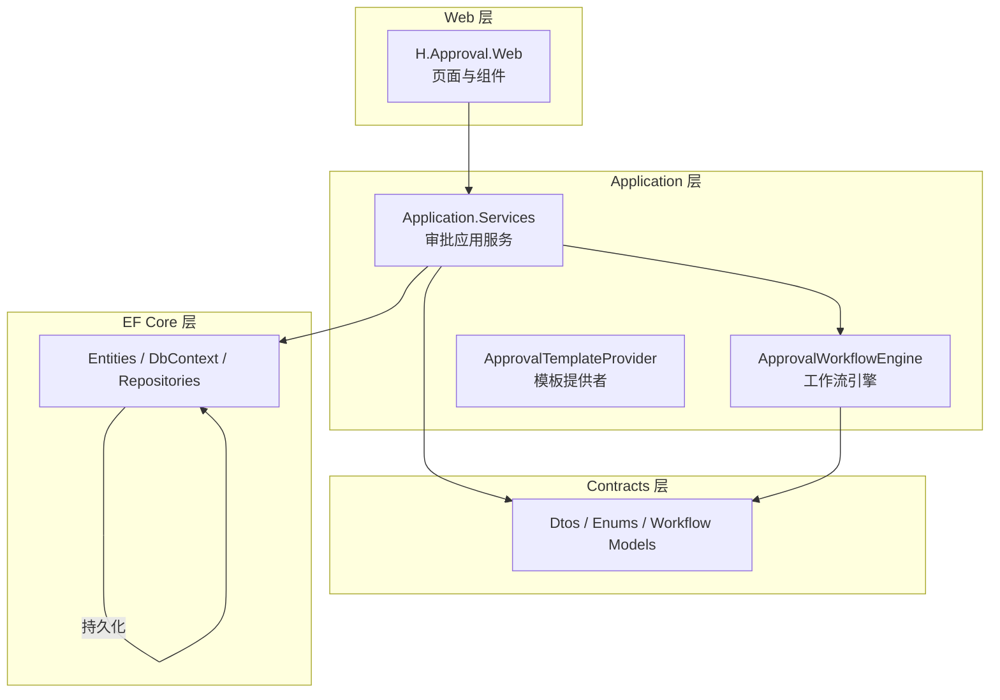
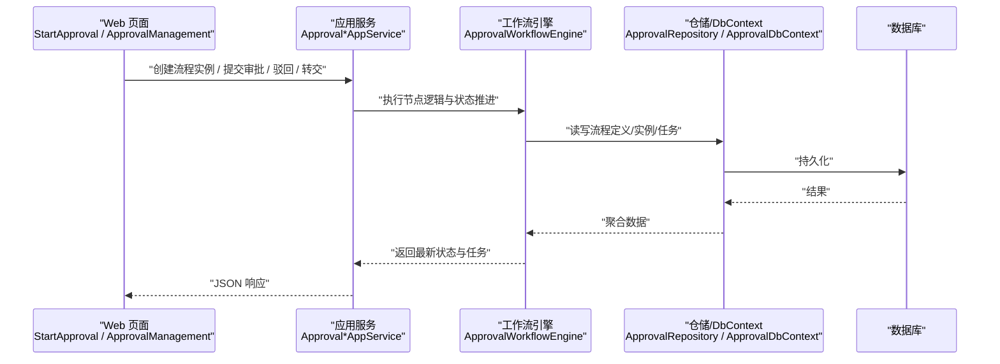
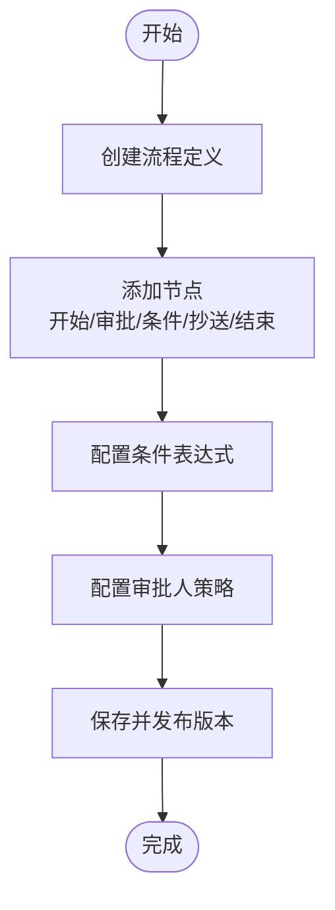
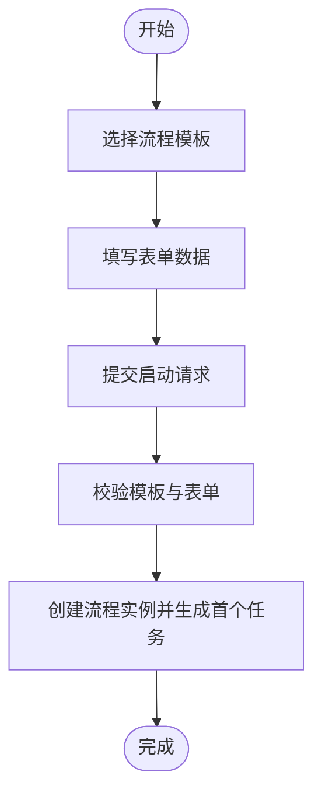
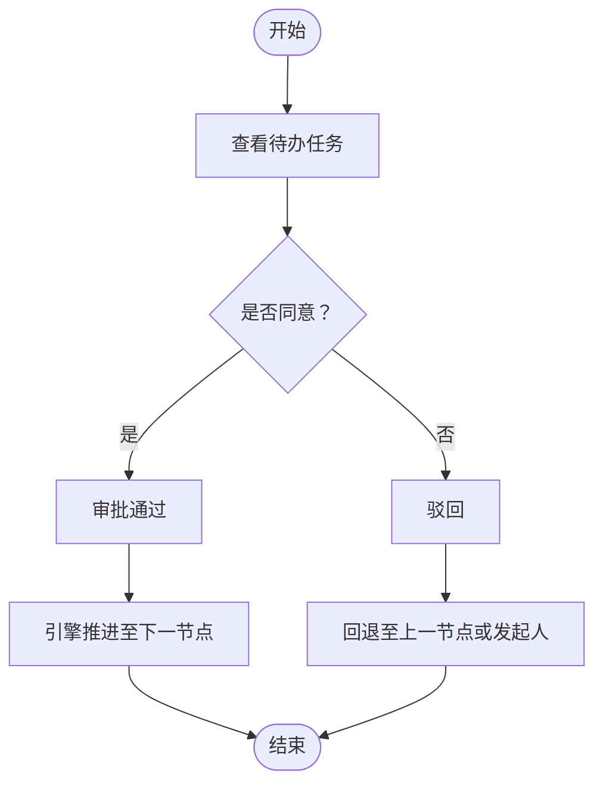
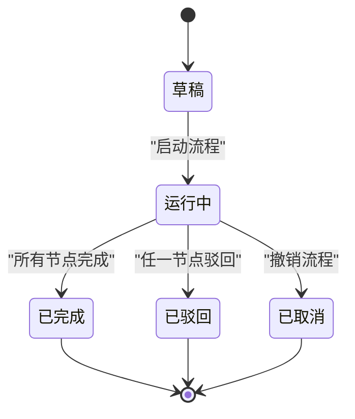
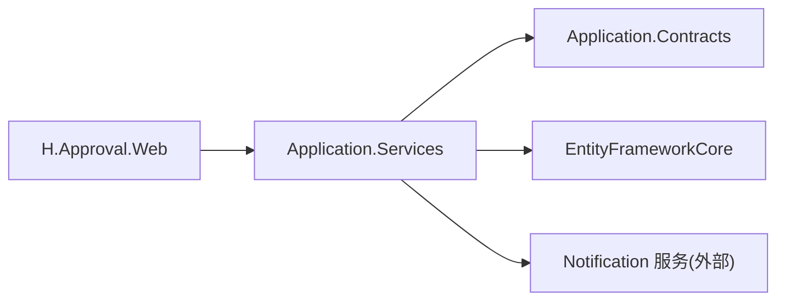
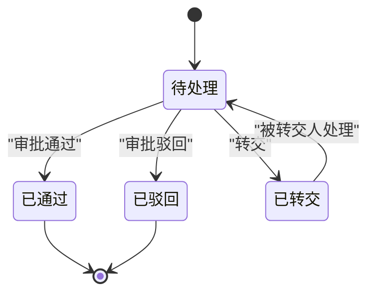

# 审批流程API

<cite>
**本文引用的文件**   
- [IApprovalDefinitionAppService.cs](file://src/Services/Approval/H.Approval.Application.Contracts/Services/IApprovalDefinitionAppService.cs)
- [ApprovalDefinitionAppService.cs](file://src/Services/Approval/H.Approval.Application/Services/ApprovalDefinitionAppService.cs)
- [IApprovalInstanceAppService.cs](file://src/Services/Approval/H.Approval.Application.Contracts/Services/IApprovalInstanceAppService.cs)
- [ApprovalInstanceAppService.cs](file://src/Services/Approval/H.Approval.Application/Services/ApprovalInstanceAppService.cs)
- [IApprovalTaskAppService.cs](file://src/Services/Approval/H.Approval.Application.Contracts/Services/IApprovalTaskAppService.cs)
- [ApprovalTaskAppService.cs](file://src/Services/Approval/H.Approval.Application/Services/ApprovalTaskAppService.cs)
- [ApprovalWorkflowEngine.cs](file://src/Services/Approval/H.Approval.Application/Services/ApprovalWorkflowEngine.cs)
- [ApprovalStatusEnum.cs](file://src/Services/Approval/H.Approval.Application.Contracts/Enums/ApprovalStatusEnum.cs)
- [ApprovalTemplateProvider.cs](file://src/Services/Approval/H.Approval.Application/Templates/ApprovalTemplateProvider.cs)
- [NodeModelBase.cs](file://src/Services/Approval/H.Approval.Application.Contracts/Workflow/NodeModelBase.cs)
- [NodeModels.cs](file://src/Services/Approval/H.Approval.Application.Contracts/Workflow/NodeModels.cs)
- [FormSchema.cs](file://src/Services/Approval/H.Approval.Application.Contracts/Workflow/FormSchema.cs)
- [ApprovalDefinitionDto.cs](file://src/Services/Approval/H.Approval.Application.Contracts/Dtos/ApprovalDefinitionDto.cs)
- [ApprovalInstanceDto.cs](file://src/Services/Approval/H.Approval.Application.Contracts/Dtos/ApprovalInstanceDto.cs)
- [ApprovalTaskDto.cs](file://src/Services/Approval/H.Approval.Application.Contracts/Dtos/ApprovalTaskDto.cs)
- [ApprovalCategoryDto.cs](file://src/Services/Approval/H.Approval.Application.Contracts/Dtos/ApprovalCategoryDto.cs)
- [ApprovalDefinition.cs](file://src/Services/Approval/H.Approval.EntityFrameworkCore/Entities/ApprovalDefinition.cs)
- [ApprovalInstance.cs](file://src/Services/Approval/H.Approval.EntityFrameworkCore/Entities/ApprovalInstance.cs)
- [ApprovalTask.cs](file://src/Services/Approval/H.Approval.EntityFrameworkCore/Entities/ApprovalTask.cs)
- [ApprovalCategory.cs](file://src/Services/Approval/H.Approval.EntityFrameworkCore/Entities/ApprovalCategory.cs)
- [ApprovalDbContext.cs](file://src/Services/Approval/H.Approval.EntityFrameworkCore/ApprovalDbContext.cs)
- [IApprovalRepository.cs](file://src/Services/Approval/H.Approval.EntityFrameworkCore/Repositories/IApprovalRepository.cs)
- [ApprovalRepository.cs](file://src/Services/Approval/H.Approval.EntityFrameworkCore/Repositories/ApprovalRepository.cs)
- [StartApproval.razor](file://src/Services/Approval/H.Approval.Web/Pages/StartApproval.razor)
- [StartApprovalForm.razor](file://src/Services/Approval/H.Approval.Web/Pages/StartApprovalForm.razor)
- [ApprovalManagement.razor](file://src/Services/Approval/H.Approval.Web/Pages/ApprovalManagement.razor)
- [ApprovalCenter.razor](file://src/Services/Approval/H.Approval.Web/Pages/ApprovalCenter.razor)
- [ApprovalDesigner.razor](file://src/Services/Approval/H.Approval.Web/Pages/ApprovalDesigner.razor)
- [ConditionSettingDialog.razor](file://src/Services/Approval/H.Approval.Web/Components/Panels/ConditionSettingDialog.razor)
- [ApproverSettingDialog.razor](file://src/Services/Approval/H.Approval.Web/Components/Panels/ApproverSettingDialog.razor)
- [CarbonCopySettingDialog.razor](file://src/Services/Approval/H.Approval.Web/Components/Panels/CarbonCopySettingDialog.razor)
- [H.Approval.Web.csproj](file://src/Services/Approval/H.Approval.Web/H.Approval.Web.csproj)
</cite>

## 目录
1. [引言](#引言)
2. [项目结构](#项目结构)
3. [核心组件](#核心组件)
4. [架构总览](#架构总览)
5. [详细接口说明](#详细接口说明)
6. [依赖分析](#依赖分析)
7. [性能考虑](#性能考虑)
8. [故障排查指南](#故障排查指南)
9. [结论](#结论)
10. [附录：状态机与流转规则](#附录状态机与流转规则)

## 引言
本文档为 H.AppLab 平台的“审批流程服务”提供完整的 API 文档。内容覆盖：
- 审批工作流设计相关 RESTful 接口：流程模板创建、节点配置、条件设置等；
- 审批任务管理接口：任务分配、审批处理、驳回处理、转交处理等；
- 审批状态跟踪接口：流程实例查询、审批历史查看、统计报表等；
- 审批流程的状态机设计与流转规则；
- 请求参数定义、响应数据结构、业务流程图；
- 调用示例代码路径与复杂审批场景的处理方案；
- 审批通知机制与消息推送相关接口（由 Notification 服务提供，本文给出集成方式）。

本服务采用 ABP 模块化架构，Web 层通过 Application 层的服务暴露 REST API，Domain/Entity Framework Core 负责数据持久化，Application.Contracts 定义对外契约和 DTO。

## 项目结构
审批服务位于 Services/Approval 下，按 ABP 分层组织：
- Web 层：页面与 UI 组件，用于审批中心、流程设计器、任务处理等界面；
- Application 层：应用服务与工作流引擎，承载业务编排；
- Application.Contracts：对外契约、DTO、枚举、工作流模型；
- EntityFrameworkCore：实体、数据库上下文、仓储实现；
- Tools：迁移工具。

```mermaid
graph TB
    subgraph "Web 层"
        A["H.Approval.Web<br/>页面与组件"]
    end
    subgraph "Application 层"
        B["Application.Services<br/>审批应用服务"]
        C["ApprovalWorkflowEngine<br/>工作流引擎"]
        D["ApprovalTemplateProvider<br/>模板提供者"]
    end
    subgraph "Contracts 层"
        E["Dtos / Enums / Workflow Models"]
    end
    subgraph "EF Core 层"
        F["Entities / DbContext / Repositories"]
    end
    A --> B
    B --> C
    B --> E
    B --> F
    C --> E
    F -->|持久化| F
```

**图表来源**
- [H.Approval.Web.csproj](file://src/Services/Approval/H.Approval.Web/H.Approval.Web.csproj)
- [ApprovalDefinitionAppService.cs](file://src/Services/Approval/H.Approval.Application/Services/ApprovalDefinitionAppService.cs)
- [ApprovalWorkflowEngine.cs](file://src/Services/Approval/H.Approval.Application/Services/ApprovalWorkflowEngine.cs)
- [ApprovalDbContext.cs](file://src/Services/Approval/H.Approval.EntityFrameworkCore/ApprovalDbContext.cs)

**章节来源**
- [H.Approval.Web.csproj](file://src/Services/Approval/H.Approval.Web/H.Approval.Web.csproj)

## 核心组件
- 应用服务
  - IApprovalDefinitionAppService / ApprovalDefinitionAppService：流程定义与模板的 CRUD、版本发布、节点与条件配置。
  - IApprovalInstanceAppService / ApprovalInstanceAppService：流程实例生命周期管理、查询、统计。
  - IApprovalTaskAppService / ApprovalTaskAppService：任务分配、审批、驳回、转交、加签、抄送等任务操作。
- 工作流引擎
  - ApprovalWorkflowEngine：驱动节点执行、条件分支计算、状态推进与历史记录生成。
- 数据模型
  - 流程定义：ApprovalDefinition、ApprovalDefinitionDto
  - 流程实例：ApprovalInstance、ApprovalInstanceDto
  - 审批任务：ApprovalTask、ApprovalTaskDto
  - 分类：ApprovalCategory、ApprovalCategoryDto
- 工作流模型
  - NodeModelBase、NodeModels：节点基类与具体节点模型（开始、审批、条件、抄送、结束等）
  - FormSchema：表单结构定义，供启动与审批时渲染
- 枚举
  - ApprovalStatusEnum：流程与任务状态枚举

**章节来源**
- [IApprovalDefinitionAppService.cs](file://src/Services/Approval/H.Approval.Application.Contracts/Services/IApprovalDefinitionAppService.cs)
- [ApprovalDefinitionAppService.cs](file://src/Services/Approval/H.Approval.Application/Services/ApprovalDefinitionAppService.cs)
- [IApprovalInstanceAppService.cs](file://src/Services/Approval/H.Approval.Application.Contracts/Services/IApprovalInstanceAppService.cs)
- [ApprovalInstanceAppService.cs](file://src/Services/Approval/H.Approval.Application/Services/ApprovalInstanceAppService.cs)
- [IApprovalTaskAppService.cs](file://src/Services/Approval/H.Approval.Application.Contracts/Services/IApprovalTaskAppService.cs)
- [ApprovalTaskAppService.cs](file://src/Services/Approval/H.Approval.Application/Services/ApprovalTaskAppService.cs)
- [ApprovalWorkflowEngine.cs](file://src/Services/Approval/H.Approval.Application/Services/ApprovalWorkflowEngine.cs)
- [ApprovalStatusEnum.cs](file://src/Services/Approval/H.Approval.Application.Contracts/Enums/ApprovalStatusEnum.cs)
- [ApprovalDefinitionDto.cs](file://src/Services/Approval/H.Approval.Application.Contracts/Dtos/ApprovalDefinitionDto.cs)
- [ApprovalInstanceDto.cs](file://src/Services/Approval/H.Approval.Application.Contracts/Dtos/ApprovalInstanceDto.cs)
- [ApprovalTaskDto.cs](file://src/Services/Approval/H.Approval.Application.Contracts/Dtos/ApprovalTaskDto.cs)
- [ApprovalCategoryDto.cs](file://src/Services/Approval/H.Approval.Application.Contracts/Dtos/ApprovalCategoryDto.cs)
- [NodeModelBase.cs](file://src/Services/Approval/H.Approval.Application.Contracts/Workflow/NodeModelBase.cs)
- [NodeModels.cs](file://src/Services/Approval/H.Approval.Application.Contracts/Workflow/NodeModels.cs)
- [FormSchema.cs](file://src/Services/Approval/H.Approval.Application.Contracts/Workflow/FormSchema.cs)

## 架构总览
下图展示从前端页面到后端服务再到数据层的调用链，以及工作流引擎在审批流转中的作用。

```mermaid
sequenceDiagram
    participant UI as "Web 页面<br/>StartApproval / ApprovalManagement"
    participant AppSvc as "应用服务<br/>Approval*AppService"
    participant Engine as "工作流引擎<br/>ApprovalWorkflowEngine"
    participant Repo as "仓储/DbContext<br/>ApprovalRepository / ApprovalDbContext"
    participant DB as "数据库"

    UI->>AppSvc: "创建流程实例 / 提交审批 / 驳回 / 转交"
    AppSvc->>Engine: "执行节点逻辑与状态推进"
    Engine->>Repo: "读写流程定义/实例/任务"
    Repo->>DB: "持久化"
    DB-->>Repo: "结果"
    Repo-->>Engine: "聚合数据"
    Engine-->>AppSvc: "返回最新状态与任务"
    AppSvc-->>UI: "JSON 响应"
```

**图表来源**
- [StartApproval.razor](file://src/Services/Approval/H.Approval.Web/Pages/StartApproval.razor)
- [ApprovalManagement.razor](file://src/Services/Approval/H.Approval.Web/Pages/ApprovalManagement.razor)
- [ApprovalInstanceAppService.cs](file://src/Services/Approval/H.Approval.Application/Services/ApprovalInstanceAppService.cs)
- [ApprovalTaskAppService.cs](file://src/Services/Approval/H.Approval.Application/Services/ApprovalTaskAppService.cs)
- [ApprovalWorkflowEngine.cs](file://src/Services/Approval/H.Approval.Application/Services/ApprovalWorkflowEngine.cs)
- [ApprovalDbContext.cs](file://src/Services/Approval/H.Approval.EntityFrameworkCore/ApprovalDbContext.cs)
- [ApprovalRepository.cs](file://src/Services/Approval/H.Approval.EntityFrameworkCore/Repositories/ApprovalRepository.cs)

## 详细接口说明

### 一、流程模板与设计接口（流程定义）
面向管理员与流程设计者，用于创建工作流模板、配置节点与条件。

- 接口集合
  - 流程定义
    - POST /api/approval/definitions：创建流程模板
    - GET /api/approval/definitions/{id}：获取流程模板详情
    - PUT /api/approval/definitions/{id}：更新流程模板
    - DELETE /api/approval/definitions/{id}：删除流程模板
    - GET /api/approval/definitions：分页查询流程模板
  - 流程分类
    - POST /api/approval/categories：创建分类
    - GET /api/approval/categories/{id}：获取分类
    - PUT /api/approval/categories/{id}：更新分类
    - DELETE /api/approval/categories/{id}：删除分类
    - GET /api/approval/categories：分页查询分类
  - 版本与发布
    - POST /api/approval/definitions/{id}/publish：发布流程模板版本
    - GET /api/approval/definitions/{id}/versions：查询版本列表

- 主要请求体字段（以流程定义为例）
  - code：流程编码（唯一标识）
  - name：流程名称
  - description：描述
  - categoryCode：所属分类编码
  - nodes：节点数组（开始、审批、条件、抄送、结束等）
  - formSchema：启动表单结构
  - variables：流程变量定义（可选）

- 节点模型要点
  - 开始节点：指定发起人角色或表达式
  - 审批节点：指定审批人策略（指定用户/角色/上级/动态表达式）
  - 条件节点：基于表单变量或流程变量的布尔表达式
  - 抄送节点：抄送对象集合
  - 结束节点：流程终止

- 关键 DTO 与模型
  - ApprovalDefinitionDto：流程定义传输对象
  - ApprovalCategoryDto：分类传输对象
  - NodeModelBase / NodeModels：节点基类与各节点模型
  - FormSchema：表单结构定义

- 调用示例路径
  - 创建流程模板：参考 [ApprovalDefinitionAppService.cs](file://src/Services/Approval/H.Approval.Application/Services/ApprovalDefinitionAppService.cs)
  - 节点与条件配置：参考 [NodeModelBase.cs](file://src/Services/Approval/H.Approval.Application.Contracts/Workflow/NodeModelBase.cs)、[NodeModels.cs](file://src/Services/Approval/H.Approval.Application.Contracts/Workflow/NodeModels.cs)、[FormSchema.cs](file://src/Services/Approval/H.Approval.Application.Contracts/Workflow/FormSchema.cs)
  - Web 端配置对话框：参考 [ConditionSettingDialog.razor](file://src/Services/Approval/H.Approval.Web/Components/Panels/ConditionSettingDialog.razor)、[ApproverSettingDialog.razor](file://src/Services/Approval/H.Approval.Web/Components/Panels/ApproverSettingDialog.razor)、[CarbonCopySettingDialog.razor](file://src/Services/Approval/H.Approval.Web/Components/Panels/CarbonCopySettingDialog.razor)

- 典型业务流程图（模板设计）

```mermaid
flowchart TD
    Start(["开始"]) --> CreateDef["创建流程定义"]
    CreateDef --> AddNodes["添加节点<br/>开始/审批/条件/抄送/结束"]
    AddNodes --> SetConditions["配置条件表达式"]
    SetConditions --> SetApprovers["配置审批人策略"]
    SetApprovers --> SaveDef["保存并发布版本"]
    SaveDef --> End(["完成"])
```

**章节来源**
- [IApprovalDefinitionAppService.cs](file://src/Services/Approval/H.Approval.Application.Contracts/Services/IApprovalDefinitionAppService.cs)
- [ApprovalDefinitionAppService.cs](file://src/Services/Approval/H.Approval.Application/Services/ApprovalDefinitionAppService.cs)
- [ApprovalDefinitionDto.cs](file://src/Services/Approval/H.Approval.Application.Contracts/Dtos/ApprovalDefinitionDto.cs)
- [ApprovalCategoryDto.cs](file://src/Services/Approval/H.Approval.Application.Contracts/Dtos/ApprovalCategoryDto.cs)
- [NodeModelBase.cs](file://src/Services/Approval/H.Approval.Application.Contracts/Workflow/NodeModelBase.cs)
- [NodeModels.cs](file://src/Services/Approval/H.Approval.Application.Contracts/Workflow/NodeModels.cs)
- [FormSchema.cs](file://src/Services/Approval/H.Approval.Application.Contracts/Workflow/FormSchema.cs)
- [ConditionSettingDialog.razor](file://src/Services/Approval/H.Approval.Web/Components/Panels/ConditionSettingDialog.razor)
- [ApproverSettingDialog.razor](file://src/Services/Approval/H.Approval.Web/Components/Panels/ApproverSettingDialog.razor)
- [CarbonCopySettingDialog.razor](file://src/Services/Approval/H.Approval.Web/Components/Panels/CarbonCopySettingDialog.razor)

### 二、流程实例与运行接口
用于业务系统发起流程、查询实例状态与历史。

- 接口集合
  - 流程实例
    - POST /api/approval/instances：根据模板启动流程实例
    - GET /api/approval/instances/{instanceId}：查询实例详情
    - GET /api/approval/instances：分页查询实例列表（支持按状态、分类、时间过滤）
    - DELETE /api/approval/instances/{instanceId}：撤销流程实例（受权限控制）
  - 流程历史
    - GET /api/approval/instances/{instanceId}/history：查询实例审批历史
  - 统计报表
    - GET /api/approval/statistics：统计指标（如待办数、已办数、平均耗时等）

- 主要请求体字段（启动实例）
  - definitionCode：流程模板编码
  - version：模板版本号（可选，未传则使用最新版本）
  - formData：表单数据（与模板 formSchema 对应）
  - variables：流程变量（可选）

- 关键 DTO 与模型
  - ApprovalInstanceDto：流程实例传输对象
  - ApprovalInstance：流程实例实体
  - ApprovalStatusEnum：流程与任务状态枚举

- 调用示例路径
  - 启动流程实例：参考 [ApprovalInstanceAppService.cs](file://src/Services/Approval/H.Approval.Application/Services/ApprovalInstanceAppService.cs)
  - Web 端入口：参考 [StartApproval.razor](file://src/Services/Approval/H.Approval.Web/Pages/StartApproval.razor)、[StartApprovalForm.razor](file://src/Services/Approval/H.Approval.Web/Pages/StartApprovalForm.razor)

- 典型业务流程图（实例启动）

```mermaid
flowchart TD
    S(["开始"]) --> ChooseDef["选择流程模板"]
    ChooseDef --> FillForm["填写表单数据"]
    FillForm --> Submit["提交启动请求"]
    Submit --> Validate["校验模板与表单"]
    Validate --> CreateInstance["创建流程实例并生成首个任务"]
    CreateInstance --> Done(["完成"])
```

**章节来源**
- [IApprovalInstanceAppService.cs](file://src/Services/Approval/H.Approval.Application.Contracts/Services/IApprovalInstanceAppService.cs)
- [ApprovalInstanceAppService.cs](file://src/Services/Approval/H.Approval.Application/Services/ApprovalInstanceAppService.cs)
- [ApprovalInstanceDto.cs](file://src/Services/Approval/H.Approval.Application.Contracts/Dtos/ApprovalInstanceDto.cs)
- [ApprovalInstance.cs](file://src/Services/Approval/H.Approval.EntityFrameworkCore/Entities/ApprovalInstance.cs)
- [ApprovalStatusEnum.cs](file://src/Services/Approval/H.Approval.Application.Contracts/Enums/ApprovalStatusEnum.cs)
- [StartApproval.razor](file://src/Services/Approval/H.Approval.Web/Pages/StartApproval.razor)
- [StartApprovalForm.razor](file://src/Services/Approval/H.Approval.Web/Pages/StartApprovalForm.razor)

### 三、审批任务管理接口
用于处理待办、已办、驳回、转交、加签、抄送等任务操作。

- 接口集合
  - 任务
    - GET /api/approval/tasks/{taskId}：获取任务详情
    - GET /api/approval/tasks：分页查询我的待办/已办（支持按状态、实例、时间过滤）
    - POST /api/approval/tasks/{taskId}/approve：审批通过
    - POST /api/approval/tasks/{taskId}/reject：驳回
    - POST /api/approval/tasks/{taskId}/transfer：转交给其他用户
    - POST /api/approval/tasks/{taskId}/counterSign：加签（会签）
    - POST /api/approval/tasks/{taskId}/cc：抄送（记录抄送行为）
  - 批量操作
    - POST /api/approval/tasks/batch-approve：批量通过
    - POST /api/approval/tasks/batch-reject：批量驳回

- 主要请求体字段（审批/驳回/转交）
  - taskId：任务标识
  - comment：审批意见（可选）
  - assigneeId：被转交用户 ID（转交时必填）
  - counterSignIds：加签目标用户 ID 列表（加签时必填）

- 关键 DTO 与模型
  - ApprovalTaskDto：任务传输对象
  - ApprovalTask：任务实体
  - ApprovalStatusEnum：任务状态枚举

- 调用示例路径
  - 任务处理：参考 [ApprovalTaskAppService.cs](file://src/Services/Approval/H.Approval.Application/Services/ApprovalTaskAppService.cs)
  - 任务列表页：参考 [ApprovalCenter.razor](file://src/Services/Approval/H.Approval.Web/Pages/ApprovalCenter.razor)、[ApprovalManagement.razor](file://src/Services/Approval/H.Approval.Web/Pages/ApprovalManagement.razor)

- 典型业务流程图（任务处理）

```mermaid
flowchart TD
    T0(["开始"]) --> ViewTask["查看待办任务"]
    ViewTask --> Decision{"是否同意？"}
    Decision -->|是| Approve["审批通过"]
    Decision -->|否| Reject["驳回"]
    Approve --> NextStep["引擎推进至下一节点"]
    Reject --> BackToPrev["回退至上一节点或发起人"]
    NextStep --> End(["结束"])
    BackToPrev --> End
```

**章节来源**
- [IApprovalTaskAppService.cs](file://src/Services/Approval/H.Approval.Application.Contracts/Services/IApprovalTaskAppService.cs)
- [ApprovalTaskAppService.cs](file://src/Services/Approval/H.Approval.Application/Services/ApprovalTaskAppService.cs)
- [ApprovalTaskDto.cs](file://src/Services/Approval/H.Approval.Application.Contracts/Dtos/ApprovalTaskDto.cs)
- [ApprovalTask.cs](file://src/Services/Approval/H.Approval.EntityFrameworkCore/Entities/ApprovalTask.cs)
- [ApprovalStatusEnum.cs](file://src/Services/Approval/H.Approval.Application.Contracts/Enums/ApprovalStatusEnum.cs)
- [ApprovalCenter.razor](file://src/Services/Approval/H.Approval.Web/Pages/ApprovalCenter.razor)
- [ApprovalManagement.razor](file://src/Services/Approval/H.Approval.Web/Pages/ApprovalManagement.razor)

### 四、流程引擎与状态机
- 工作流引擎
  - ApprovalWorkflowEngine：负责解析节点序列、计算条件分支、分配任务、推进状态、记录历史与审计信息。
- 状态机
  - 流程实例状态：草稿、运行中、已完成、已取消、已驳回
  - 任务状态：待处理、已通过、已驳回、已转交、已取消

```mermaid
stateDiagram-v2
    [*] --> 草稿
    草稿 --> 运行中 : "启动流程"
    运行中 --> 已完成 : "所有节点完成"
    运行中 --> 已驳回 : "任一节点驳回"
    运行中 --> 已取消 : "撤销流程"
    已完成 --> [*]
    已驳回 --> [*]
    已取消 --> [*]
```

**图表来源**
- [ApprovalWorkflowEngine.cs](file://src/Services/Approval/H.Approval.Application/Services/ApprovalWorkflowEngine.cs)
- [ApprovalStatusEnum.cs](file://src/Services/Approval/H.Approval.Application.Contracts/Enums/ApprovalStatusEnum.cs)

**章节来源**
- [ApprovalWorkflowEngine.cs](file://src/Services/Approval/H.Approval.Application/Services/ApprovalWorkflowEngine.cs)
- [ApprovalStatusEnum.cs](file://src/Services/Approval/H.Approval.Application.Contracts/Enums/ApprovalStatusEnum.cs)

### 五、通知与消息推送
- 通知机制概述
  - 审批流程触发通知（如待办提醒、审批结果通知）由 Notification 服务统一提供。
  - 审批服务可通过 Notification 的应用服务发送站内信、邮件、短信等消息。
- 常见通知类型
  - 任务到达通知：当新任务分配给某用户时；
  - 审批结果通知：当任务通过或驳回时；
  - 流程结束通知：当流程完成或终止时。
- 集成方式
  - 在 ApprovalWorkflowEngine 或各 AppService 中，调用 Notification 服务的发消息接口（具体方法名以 Notification 服务契约为准），携带通知标题、正文、接收人、业务关联 ID 等。

（注：Notification 服务的具体接口定义请参考 Notification 模块的 Application.Contracts。）

**章节来源**
- [ApprovalWorkflowEngine.cs](file://src/Services/Approval/H.Approval.Application/Services/ApprovalWorkflowEngine.cs)

## 依赖分析
- 模块耦合关系
  - Web 层依赖 Application 层的服务；
  - Application 层依赖 Contracts 层的 DTO、枚举与工作流模型；
  - Application 层通过 EF Core 仓储访问数据库；
  - 工作流引擎与模板提供者协同解析流程定义。

```mermaid
graph LR
    Web["H.Approval.Web"] --> App["Application.Services"]
    App --> Contracts["Application.Contracts"]
    App --> EF["EntityFrameworkCore"]
    App --> Notif["Notification 服务(外部)"]
```

**图表来源**
- [H.Approval.Web.csproj](file://src/Services/Approval/H.Approval.Web/H.Approval.Web.csproj)
- [ApprovalDefinitionAppService.cs](file://src/Services/Approval/H.Approval.Application/Services/ApprovalDefinitionAppService.cs)
- [ApprovalInstanceAppService.cs](file://src/Services/Approval/H.Approval.Application/Services/ApprovalInstanceAppService.cs)
- [ApprovalTaskAppService.cs](file://src/Services/Approval/H.Approval.Application/Services/ApprovalTaskAppService.cs)

**章节来源**
- [H.Approval.Web.csproj](file://src/Services/Approval/H.Approval.Web/H.Approval.Web.csproj)

## 性能考虑
- 分页与过滤
  - 对流程实例、任务列表进行分页与多条件过滤，减少网络与数据库负载。
- 索引优化
  - 对 instanceId、taskId、status、categoryCode、assigneeId 等高频查询字段建立索引。
- 缓存建议
  - 对流程模板、分类字典等读多写少数据可引入缓存。
- 异步与批处理
  - 大批量任务操作建议使用批量接口，避免多次往返。
- 幂等性
  - 对重复提交场景做幂等处理（例如基于 taskId 的去重）。

[本节为通用性能建议，不直接分析具体文件]

## 故障排查指南
- 常见问题
  - 模板版本不一致：确认启动实例时传入的 version 与当前发布的版本一致；
  - 条件表达式错误：检查条件节点的表达式语法与可用变量；
  - 审批人解析失败：确认审批人策略（角色/上级/表达式）是否正确且用户存在；
  - 状态冲突：任务已被处理导致再次操作的冲突，应重试或刷新状态。
- 日志与审计
  - 关注工作流引擎的执行日志与审批历史，定位问题节点与操作人。
- 数据一致性
  - 若出现状态不同步，优先核查任务与实例的状态是否一致，必要时重置任务或撤销流程后重新发起。

**章节来源**
- [ApprovalWorkflowEngine.cs](file://src/Services/Approval/H.Approval.Application/Services/ApprovalWorkflowEngine.cs)
- [ApprovalTaskAppService.cs](file://src/Services/Approval/H.Approval.Application/Services/ApprovalTaskAppService.cs)
- [ApprovalInstanceAppService.cs](file://src/Services/Approval/H.Approval.Application/Services/ApprovalInstanceAppService.cs)

## 结论
审批流程服务围绕“流程定义—流程实例—审批任务”三条主线构建，配合工作流引擎实现灵活的节点编排与状态流转。通过标准化的 RESTful 接口与清晰的 DTO 模型，便于上层业务系统集成。建议在复杂场景中充分利用条件分支、多级会签与抄送能力，并结合通知服务提升用户体验。

[本节为总结性内容，不直接分析具体文件]

## 附录：状态机与流转规则
- 流程实例状态
  - 草稿：模板已创建但未启动；
  - 运行中：至少有一个任务处于待处理；
  - 已完成：所有节点均已完成；
  - 已驳回：任一节点驳回；
  - 已取消：流程被撤销。
- 任务状态
  - 待处理：等待审批人处理；
  - 已通过：审批通过；
  - 已驳回：审批驳回；
  - 已转交：任务转交给他人；
  - 已取消：任务被撤销或流程终止。

```mermaid
stateDiagram-v2
    [*] --> 待处理
    待处理 --> 已通过 : "审批通过"
    待处理 --> 已驳回 : "审批驳回"
    待处理 --> 已转交 : "转交"
    已通过 --> [*]
    已驳回 --> [*]
    已转交 --> 待处理 : "被转交人处理"
```

**图表来源**
- [ApprovalStatusEnum.cs](file://src/Services/Approval/H.Approval.Application.Contracts/Enums/ApprovalStatusEnum.cs)
- [ApprovalTask.cs](file://src/Services/Approval/H.Approval.EntityFrameworkCore/Entities/ApprovalTask.cs)
- [ApprovalInstance.cs](file://src/Services/Approval/H.Approval.EntityFrameworkCore/Entities/ApprovalInstance.cs)

**章节来源**
- [ApprovalStatusEnum.cs](file://src/Services/Approval/H.Approval.Application.Contracts/Enums/ApprovalStatusEnum.cs)
- [ApprovalTask.cs](file://src/Services/Approval/H.Approval.EntityFrameworkCore/Entities/ApprovalTask.cs)
- [ApprovalInstance.cs](file://src/Services/Approval/H.Approval.EntityFrameworkCore/Entities/ApprovalInstance.cs)