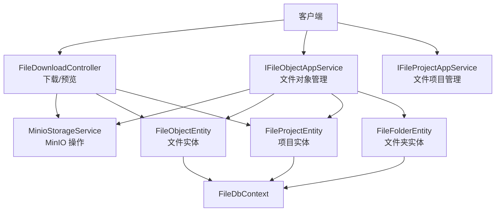
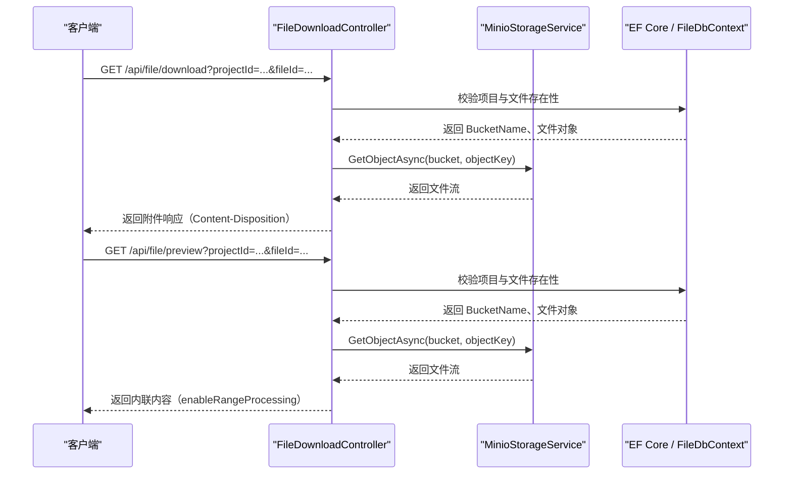
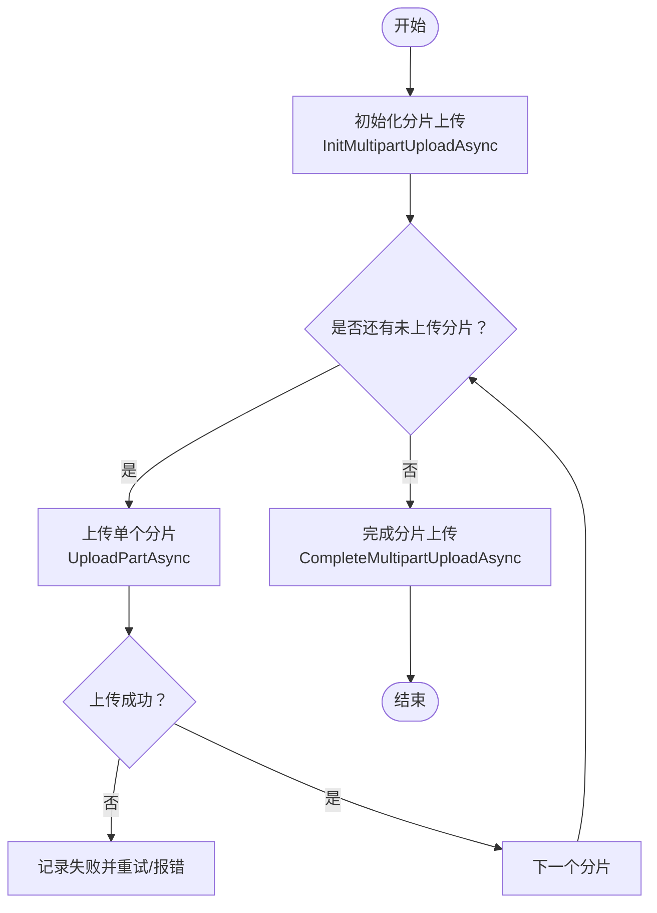
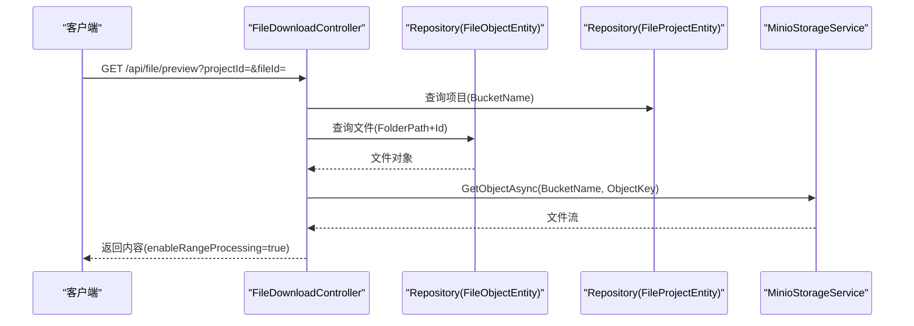
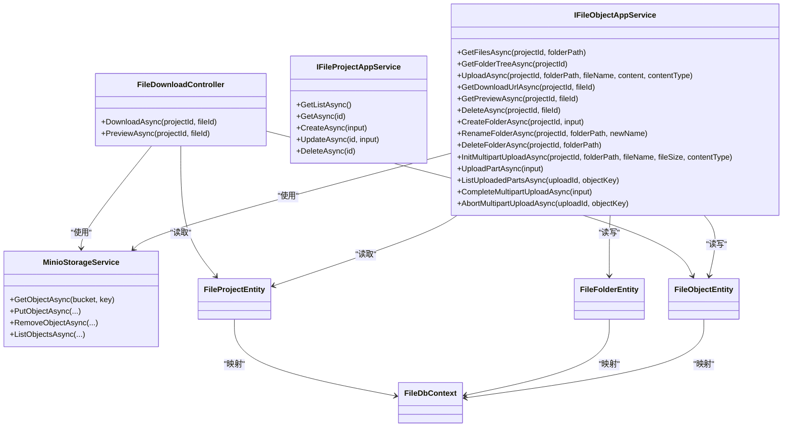

# 文件服务API

<cite>
**本文引用的文件**   
- [IFileObjectAppService.cs](file://src/Services/File/H.File.Application.Contracts/Services/IFileObjectAppService.cs)
- [IFileProjectAppService.cs](file://src/Services/File/H.File.Application.Contracts/Services/IFileProjectAppService.cs)
- [FileDtos.cs](file://src/Services/File/H.File.Application.Contracts/Dtos/FileDtos.cs)
- [FileDownloadController.cs](file://src/Services/File/H.File.Application/Controllers/FileDownloadController.cs)
- [MinioStorageService.cs](file://src/Services/File/H.File.Application/Services/MinioStorageService.cs)
- [FileObjectEntity.cs](file://src/Services/File/H.File.EntityFrameworkCore/Entities/FileObjectEntity.cs)
- [FileFolderEntity.cs](file://src/Services/File/H.File.EntityFrameworkCore/Entities/FileFolderEntity.cs)
- [FileProjectEntity.cs](file://src/Services/File/H.File.EntityFrameworkCore/Entities/FileProjectEntity.cs)
- [FileDbContext.cs](file://src/Services/File/H.File.EntityFrameworkCore/FileDbContext.cs)
- [FileApplicationModule.cs](file://src/Services/File/H.File.Application/FileApplicationModule.cs)
- [FileWebModule.cs](file://src/Services/File/H.File.Web/FileWebModule.cs)
</cite>

## 目录
1. [简介](#简介)
2. [项目结构](#项目结构)
3. [核心组件](#核心组件)
4. [架构总览](#架构总览)
5. [详细接口文档](#详细接口文档)
6. [依赖关系分析](#依赖关系分析)
7. [性能与CDN集成](#性能与cdn集成)
8. [安全机制](#安全机制)
9. [故障排查](#故障排查)
10. [结论](#结论)

## 简介
本文件为 H.AppLab 平台的“文件服务”REST API 文档，覆盖以下能力：
- 文件对象管理：列表查询、文件夹树、上传、下载、预览、删除、分类（文件夹）创建/重命名/删除。
- 分片上传：初始化、上传单个分片、查询已上传分片、完成合并、取消清理，支持断点续传。
- 文件项目管理：项目（Bucket）的增删改查。
- 存储配置与安全：MinIO 后端集成、访问控制与权限校验、类型与大小限制说明、错误码约定。

## 项目结构
文件服务由应用层契约、应用服务、控制器、实体与数据库上下文以及 MinIO 存储适配组成，典型分层如下：
- 应用契约层：定义对外 API 的 DTO 与服务接口。
- 应用层：实现业务逻辑，封装 MinIO 操作。
- Web 层：暴露 REST 控制器。
- 领域/持久化层：文件、文件夹、项目的实体与 EF Core 上下文。

图示来源
- [FileDownloadController.cs:1-67](file://src/Services/File/H.File.Application/Controllers/FileDownloadController.cs#L1-L67)
- [IFileObjectAppService.cs:1-52](file://src/Services/File/H.File.Application.Contracts/Services/IFileObjectAppService.cs#L1-L52)
- [IFileProjectAppService.cs:1-25](file://src/Services/File/H.File.Application.Contracts/Services/IFileProjectAppService.cs#L1-L25)
- [MinioStorageService.cs](file://src/Services/File/H.File.Application/Services/MinioStorageService.cs)
- [FileObjectEntity.cs](file://src/Services/File/H.File.EntityFrameworkCore/Entities/FileObjectEntity.cs)
- [FileFolderEntity.cs](file://src/Services/File/H.File.EntityFrameworkCore/Entities/FileFolderEntity.cs)
- [FileProjectEntity.cs](file://src/Services/File/H.File.EntityFrameworkCore/Entities/FileProjectEntity.cs)
- [FileDbContext.cs](file://src/Services/File/H.File.EntityFrameworkCore/FileDbContext.cs)

章节来源
- [FileDownloadController.cs:1-67](file://src/Services/File/H.File.Application/Controllers/FileDownloadController.cs#L1-L67)
- [IFileObjectAppService.cs:1-52](file://src/Services/File/H.File.Application.Contracts/Services/IFileObjectAppService.cs#L1-L52)
- [IFileProjectAppService.cs:1-25](file://src/Services/File/H.File.Application.Contracts/Services/IFileProjectAppService.cs#L1-L25)
- [FileDtos.cs:1-191](file://src/Services/File/H.File.Application.Contracts/Dtos/FileDtos.cs#L1-L191)

## 核心组件
- IFileObjectAppService：文件对象级管理，包括文件列表、文件夹树、上传、下载URL、预览、删除、分类管理与分片上传流程。
- IFileProjectAppService：项目（Bucket）管理，对应 MinIO Bucket 的增删改查。
- FileDownloadController：提供服务端下载与预览接口，保证附件下载行为与浏览器内预览一致性。
- MinioStorageService：封装 MinIO SDK 的读写、分片上传等底层操作。
- 实体与上下文：FileObjectEntity、FileFolderEntity、FileProjectEntity、FileDbContext 用于持久化文件元数据、目录结构与项目信息。

章节来源
- [IFileObjectAppService.cs:1-52](file://src/Services/File/H.File.Application.Contracts/Services/IFileObjectAppService.cs#L1-L52)
- [IFileProjectAppService.cs:1-25](file://src/Services/File/H.File.Application.Contracts/Services/IFileProjectAppService.cs#L1-L25)
- [FileDownloadController.cs:1-67](file://src/Services/File/H.File.Application/Controllers/FileDownloadController.cs#L1-L67)
- [MinioStorageService.cs](file://src/Services/File/H.File.Application/Services/MinioStorageService.cs)
- [FileObjectEntity.cs](file://src/Services/File/H.File.EntityFrameworkCore/Entities/FileObjectEntity.cs)
- [FileFolderEntity.cs](file://src/Services/File/H.File.EntityFrameworkCore/Entities/FileFolderEntity.cs)
- [FileProjectEntity.cs](file://src/Services/File/H.File.EntityFrameworkCore/Entities/FileProjectEntity.cs)
- [FileDbContext.cs](file://src/Services/File/H.File.EntityFrameworkCore/FileDbContext.cs)

## 架构总览
文件服务以 ABP 模块化架构组织，Web 层通过控制器暴露下载/预览接口；业务侧通过应用服务接口暴露文件与项目管理能力；底层存储通过 MinIO 对象存储进行实际数据落盘。

图示来源
- [FileDownloadController.cs:1-67](file://src/Services/File/H.File.Application/Controllers/FileDownloadController.cs#L1-L67)
- [FileDbContext.cs](file://src/Services/File/H.File.EntityFrameworkCore/FileDbContext.cs)
- [MinioStorageService.cs](file://src/Services/File/H.File.Application/Services/MinioStorageService.cs)

## 详细接口文档

### 通用约定
- 基础路径
  - 下载/预览控制器：`/api/file`
  - 应用服务接口：通过 ABP Remote Service 协议调用，方法名与 IFileObjectAppService/IFileProjectAppService 一致。
- 统一响应包装
  - 所有接口均返回 `BaseOutput<T>` 包装，其中包含状态、消息与业务数据 T。
- 认证与授权
  - 接口需具备有效登录态；跨项目访问受项目维度权限控制。
- 参数校验
  - GUID 格式校验、必填字段校验、长度与字符集校验（如项目编号）。

章节来源
- [FileDownloadController.cs:1-67](file://src/Services/File/H.File.Application/Controllers/FileDownloadController.cs#L1-L67)
- [IFileObjectAppService.cs:1-52](file://src/Services/File/H.File.Application.Contracts/Services/IFileObjectAppService.cs#L1-L52)
- [IFileProjectAppService.cs:1-25](file://src/Services/File/H.File.Application.Contracts/Services/IFileProjectAppService.cs#L1-L25)
- [FileDtos.cs:1-191](file://src/Services/File/H.File.Application.Contracts/Dtos/FileDtos.cs#L1-L191)

### 文件对象管理（IFileObjectAppService）

#### 获取文件列表
- 方法：GetFilesAsync(projectId, folderPath?)
- 功能：获取指定项目下某路径的文件列表。
- 请求参数
  - projectId：Guid，必填
  - folderPath：字符串，可选，以 `/` 结尾表示目录前缀
- 响应数据
  - BaseOutput<List<FileObjectDto>>
  - FileObjectDto：Id、FileName、Size、ContentType、LastModified、IsFolder
- 错误
  - 项目不存在或无权限：UserFriendlyException
  - 其他系统异常：BaseOutput 中返回错误信息

章节来源
- [IFileObjectAppService.cs:1-52](file://src/Services/File/H.File.Application.Contracts/Services/IFileObjectAppService.cs#L1-L52)
- [FileDtos.cs:1-191](file://src/Services/File/H.File.Application.Contracts/Dtos/FileDtos.cs#L1-L191)

#### 获取文件夹树
- 方法：GetFolderTreeAsync(projectId)
- 功能：获取指定项目下的文件夹树。
- 请求参数
  - projectId：Guid，必填
- 响应数据
  - BaseOutput<List<FileFolderDto>>
  - FileFolderDto：Path、Code、Name、Children

章节来源
- [IFileObjectAppService.cs:1-52](file://src/Services/File/H.File.Application.Contracts/Services/IFileObjectAppService.cs#L1-L52)
- [FileDtos.cs:1-191](file://src/Services/File/H.File.Application.Contracts/Dtos/FileDtos.cs#L1-L191)

#### 单文件上传
- 方法：UploadAsync(projectId, folderPath?, fileName="", content=null, contentType=null)
- 功能：上传文件到指定项目与目录。
- 请求参数
  - projectId：Guid，必填
  - folderPath：字符串，可选
  - fileName：字符串，可选，默认空
  - content：字节数组，可选
  - contentType：字符串，可选
- 响应数据
  - BaseOutput<FileUploadResultDto>
  - FileUploadResultDto：Id、FileName、Size、Success、Message
- 注意
  - 当 content 为空时，可由上层框架处理 multipart/form-data 绑定。

章节来源
- [IFileObjectAppService.cs:1-52](file://src/Services/File/H.File.Application.Contracts/Services/IFileObjectAppService.cs#L1-L52)
- [FileDtos.cs:1-191](file://src/Services/File/H.File.Application.Contracts/Dtos/FileDtos.cs#L1-L191)

#### 获取文件下载URL
- 方法：GetDownloadUrlAsync(projectId, fileId)
- 功能：返回可下载的 URL。
- 请求参数
  - projectId：Guid，必填
  - fileId：Guid，必填
- 响应数据
  - BaseOutput<FileDownloadResultDto>
  - FileDownloadResultDto：Url
- 说明
  - 避免直接返回裸字符串导致 JSON 反序列化问题。

章节来源
- [IFileObjectAppService.cs:1-52](file://src/Services/File/H.File.Application.Contracts/Services/IFileObjectAppService.cs#L1-L52)
- [FileDtos.cs:1-191](file://src/Services/File/H.File.Application.Contracts/Dtos/FileDtos.cs#L1-L191)

#### 获取文件预览信息
- 方法：GetPreviewAsync(projectId, fileId)
- 功能：返回文件预览所需的信息与内容片段。
- 请求参数
  - projectId：Guid，必填
  - fileId：Guid，必填
- 响应数据
  - BaseOutput<FilePreviewDto>
  - FilePreviewDto：FileName、ContentType、Size、PreviewType、PreviewUrl、TextContent、Base64Content
  - PreviewType：image、text、markdown、html、pdf、office、unsupported

章节来源
- [IFileObjectAppService.cs:1-52](file://src/Services/File/H.File.Application.Contracts/Services/IFileObjectAppService.cs#L1-L52)
- [FileDtos.cs:1-191](file://src/Services/File/H.File.Application.Contracts/Dtos/FileDtos.cs#L1-L191)

#### 删除文件
- 方法：DeleteAsync(projectId, fileId)
- 功能：删除指定文件。
- 请求参数
  - projectId：Guid，必填
  - fileId：Guid，必填
- 响应数据
  - BaseOutput

章节来源
- [IFileObjectAppService.cs:1-52](file://src/Services/File/H.File.Application.Contracts/Services/IFileObjectAppService.cs#L1-L52)

#### 分类（文件夹）管理
- 创建分类：CreateFolderAsync(projectId, CreateFolderInput)
  - CreateFolderInput：ParentPath、Name、Code
- 重命名分类：RenameFolderAsync(projectId, folderPath, newName)
- 删除分类：DeleteFolderAsync(projectId, folderPath)
- 说明
  - Code 作为 MinIO 目录名，留空自动生成 8 位小写字母。

章节来源
- [IFileObjectAppService.cs:1-52](file://src/Services/File/H.File.Application.Contracts/Services/IFileObjectAppService.cs#L1-L52)
- [FileDtos.cs:1-191](file://src/Services/File/H.File.Application.Contracts/Dtos/FileDtos.cs#L1-L191)

#### 分片上传（断点续传）
- 初始化分片上传：InitMultipartUploadAsync(projectId, folderPath?, fileName="", fileSize=0, contentType=null)
  - 返回 MultipartUploadDto：UploadId、ObjectId、ObjectKey、TotalParts、PartSize
- 上传单个分片：UploadPartAsync(UploadPartInput)
  - UploadPartInput：UploadId、ObjectKey、BucketName、PartIndex、Data
  - 返回 UploadPartResult：PartIndex、ETag、Success、Message
- 查询已上传分片：ListUploadedPartsAsync(uploadId, objectKey)
  - 返回 UploadedPartDto 列表：PartNumber、ETag、Size
- 完成分片上传：CompleteMultipartUploadAsync(CompleteMultipartUploadInput)
  - CompleteMultipartUploadInput：ProjectId、UploadId、ObjectId、ObjectKey、FileName、FileSize、ContentType、FolderPath、Parts
  - 返回 FileUploadResultDto
- 取消分片上传：AbortMultipartUploadAsync(uploadId, objectKey)
  - 清理临时数据

图示来源
- [IFileObjectAppService.cs:1-52](file://src/Services/File/H.File.Application.Contracts/Services/IFileObjectAppService.cs#L1-L52)
- [FileDtos.cs:1-191](file://src/Services/File/H.File.Application.Contracts/Dtos/FileDtos.cs#L1-L191)

章节来源
- [IFileObjectAppService.cs:1-52](file://src/Services/File/H.File.Application.Contracts/Services/IFileObjectAppService.cs#L1-L52)
- [FileDtos.cs:1-191](file://src/Services/File/H.File.Application.Contracts/Dtos/FileDtos.cs#L1-L191)

### 文件项目管理（IFileProjectAppService）

#### 获取项目列表
- 方法：GetListAsync()
- 响应数据：BaseOutput<List<FileProjectDto>>
- FileProjectDto：Id、Name、Code、Description、Icon、BucketName、TotalSize、FileCount、CreationTime

#### 获取单个项目
- 方法：GetAsync(id)
- 响应数据：BaseOutput<FileProjectDto>

#### 创建项目
- 方法：CreateAsync(CreateFileProjectDto)
- 输入：CreateFileProjectDto：Name、Code（3-20 位小写字母，留空生成 8 位）、Description、Icon
- 说明：同时创建 MinIO Bucket

#### 更新项目
- 方法：UpdateAsync(id, UpdateFileProjectDto)
- 输入：UpdateFileProjectDto：Name、Description、Icon

#### 删除项目
- 方法：DeleteAsync(id)
- 说明：同时删除 MinIO Bucket 及其中所有文件

章节来源
- [IFileProjectAppService.cs:1-25](file://src/Services/File/H.File.Application.Contracts/Services/IFileProjectAppService.cs#L1-L25)
- [FileDtos.cs:1-191](file://src/Services/File/H.File.Application.Contracts/Dtos/FileDtos.cs#L1-L191)

### 下载与预览（FileDownloadController）

#### 下载文件
- 端点：GET /api/file/download?projectId={guid}&fileId={guid}
- 行为：服务端转发 MinIO 文件并以附件形式返回，确保图片/PDF 等在浏览器内打开时也按附件保存。
- 响应：二进制文件流，Content-Type 取自文件 ContentType 或 application/octet-stream。

#### 预览文件
- 端点：GET /api/file/preview?projectId={guid}&fileId={guid}
- 行为：内联返回内容，供 img/iframe 直接渲染，并启用 Range 处理以支持大文件分段读取。
- 响应：二进制文件流，Content-Type 取自文件 ContentType 或 application/octet-stream。

图示来源
- [FileDownloadController.cs:1-67](file://src/Services/File/H.File.Application/Controllers/FileDownloadController.cs#L1-L67)

章节来源
- [FileDownloadController.cs:1-67](file://src/Services/File/H.File.Application/Controllers/FileDownloadController.cs#L1-L67)

## 依赖关系分析

图示来源
- [IFileObjectAppService.cs:1-52](file://src/Services/File/H.File.Application.Contracts/Services/IFileObjectAppService.cs#L1-L52)
- [IFileProjectAppService.cs:1-25](file://src/Services/File/H.File.Application.Contracts/Services/IFileProjectAppService.cs#L1-L25)
- [FileDownloadController.cs:1-67](file://src/Services/File/H.File.Application/Controllers/FileDownloadController.cs#L1-L67)
- [MinioStorageService.cs](file://src/Services/File/H.File.Application/Services/MinioStorageService.cs)
- [FileObjectEntity.cs](file://src/Services/File/H.File.EntityFrameworkCore/Entities/FileObjectEntity.cs)
- [FileFolderEntity.cs](file://src/Services/File/H.File.EntityFrameworkCore/Entities/FileFolderEntity.cs)
- [FileProjectEntity.cs](file://src/Services/File/H.File.EntityFrameworkCore/Entities/FileProjectEntity.cs)
- [FileDbContext.cs](file://src/Services/File/H.File.EntityFrameworkCore/FileDbContext.cs)

## 性能与CDN集成

- 下载/预览优化
  - 预览接口启用 Range 处理，便于前端对大文件进行分段加载。
  - 下载接口统一以附件形式返回，避免浏览器行为不一致。
- 分片上传
  - 默认分片大小为 5MB，可通过 CompleteMultipartUploadInput 传入 Parts 列表完成合并。
  - 支持查询已上传分片以实现断点续传。
- CDN 集成建议
  - 将 MinIO 对象直连地址通过 GetDownloadUrlAsync 返回给前端，由 CDN 加速静态资源分发。
  - 针对预览类接口（图片、PDF），优先走 CDN；文本/Office 内容可在服务端缓存后再下发。
- 并发与吞吐
  - 上传采用分片并行策略；服务端仅做元数据落库与分片聚合，降低主线程阻塞。
  - 下载/预览建议使用连接池与异步 I/O，避免同步阻塞。

章节来源
- [FileDtos.cs:1-191](file://src/Services/File/H.File.Application.Contracts/Dtos/FileDtos.cs#L1-L191)
- [FileDownloadController.cs:1-67](file://src/Services/File/H.File.Application/Controllers/FileDownloadController.cs#L1-L67)
- [IFileObjectAppService.cs:1-52](file://src/Services/File/H.File.Application.Contracts/Services/IFileObjectAppService.cs#L1-L52)

## 安全机制

- 类型校验
  - 项目编号 Code 要求 3-20 位小写字母，留空自动生成 8 位。
  - 文件名、路径等参数由上层校验与过滤，防止路径穿越。
- 大小限制
  - 单文件上传与分片大小在应用层控制；分片默认 5MB，可按需调整。
- 病毒扫描
  - 当前代码仓库未内置病毒扫描模块；建议在上传成功后通过后台任务触发第三方扫描，并根据结果标记文件状态或隔离。
- 访问控制
  - 所有接口基于 ABP 认证授权体系；跨项目访问需校验 projectId 与当前用户权限。
  - 下载/预览接口在服务端校验项目与文件归属后返回内容。

章节来源
- [FileDtos.cs:1-191](file://src/Services/File/H.File.Application.Contracts/Dtos/FileDtos.cs#L1-L191)
- [FileDownloadController.cs:1-67](file://src/Services/File/H.File.Application/Controllers/FileDownloadController.cs#L1-L67)
- [IFileObjectAppService.cs:1-52](file://src/Services/File/H.File.Application.Contracts/Services/IFileObjectAppService.cs#L1-L52)

## 故障排查

- 常见问题
  - “文件不存在”：检查 projectId 与 fileId 是否正确且属于同一项目。
  - 下载内容为 text/plain：确认通过 GetDownloadUrlAsync 返回 URL 并由浏览器正确解析；或直接使用 /api/file/download 接口。
  - 预览乱码：检查 ContentType 设置与编码转换逻辑。
  - 分片上传失败：核对 UploadId、ObjectKey、BucketName、PartIndex、ETag 与顺序。
- 定位步骤
  - 查看 BaseOutput 中的 Message 字段。
  - 检查 MinIO Bucket 是否存在，对象 Key 是否为 FolderPath + Id（无分隔符）。
  - 核对数据库实体与 MinIO 对象是否一致。

章节来源
- [FileDownloadController.cs:1-67](file://src/Services/File/H.File.Application/Controllers/FileDownloadController.cs#L1-L67)
- [IFileObjectAppService.cs:1-52](file://src/Services/File/H.File.Application.Contracts/Services/IFileObjectAppService.cs#L1-L52)
- [FileDtos.cs:1-191](file://src/Services/File/H.File.Application.Contracts/Dtos/FileDtos.cs#L1-L191)

## 结论
文件服务提供了完整的文件对象与项目管理能力，结合 MinIO 实现稳定可靠的对象存储。通过分片上传与 Range 预览，满足大文件场景的性能需求；配合 CDN 可实现高效的静态资源分发。安全方面，建议补充病毒扫描与更细粒度的访问控制策略，以完善企业级文件管理能力。