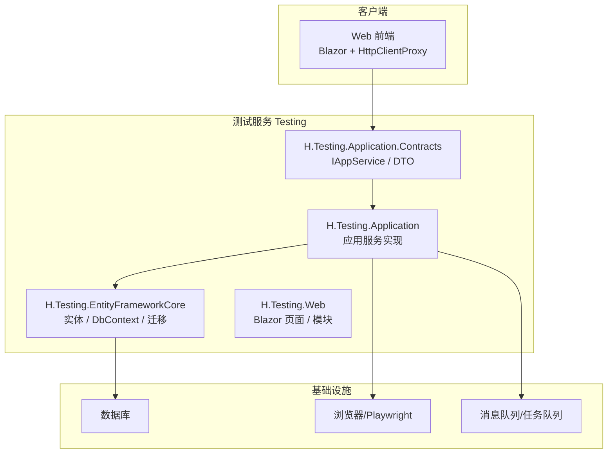
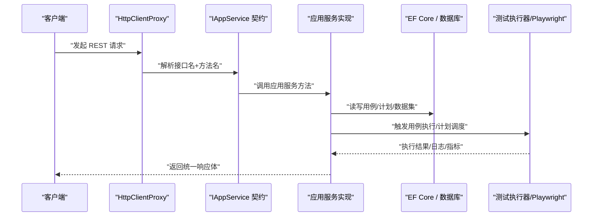
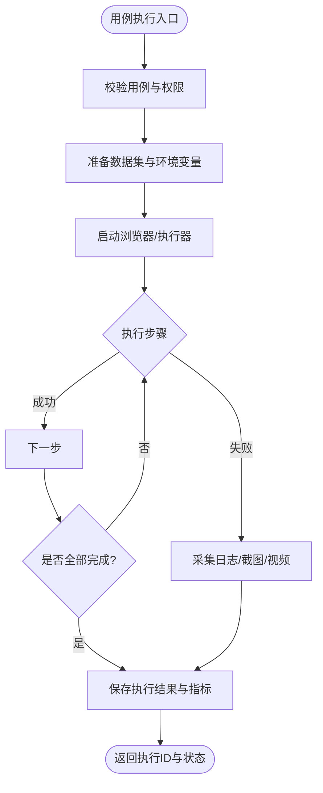
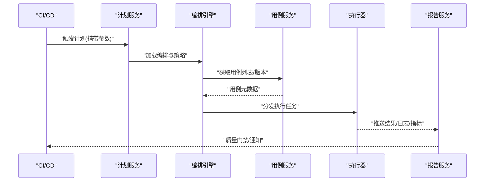
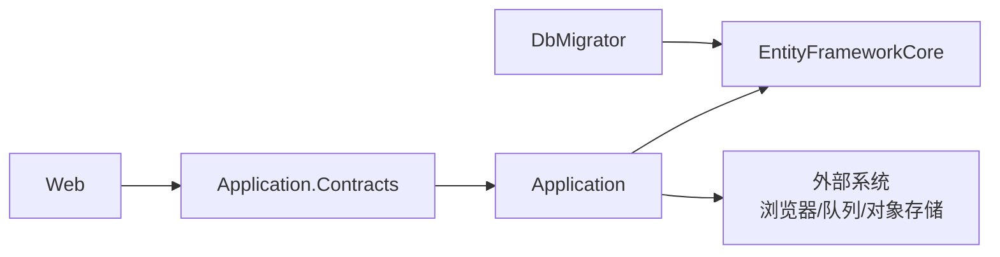
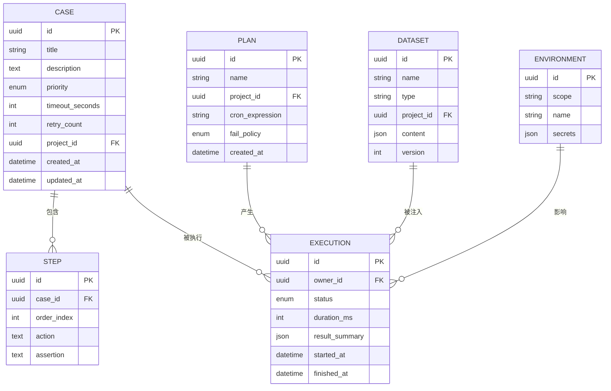

# 测试管理API

<cite>
**本文引用的文件**   
- [README.md](file://README.md)
- [TestingApplicationContractsModule.cs](file://src/Services/Testing/H.Testing.Application.Contracts/TestingApplicationContractsModule.cs)
- [TemplateJson.cs](file://src/Services/Testing/H.Testing.Application/Services/Templates/TemplateJson.cs)
- [TestingApplicationModule.cs](file://src/Services/Testing/H.Testing.Application/TestingApplicationModule.cs)
- [TestingDbContext.cs](file://src/Services/Testing/H.Testing.EntityFrameworkCore/TestingDbContext.cs)
- [TestingEntityFrameworkCoreModule.cs](file://src/Services/Testing/H.Testing.EntityFrameworkCore/TestingEntityFrameworkCoreModule.cs)
</cite>

## 目录
1. [引言](#引言)
2. [项目结构](#项目结构)
3. [核心组件](#核心组件)
4. [架构总览](#架构总览)
5. [详细组件分析](#详细组件分析)
6. [依赖关系分析](#依赖关系分析)
7. [性能与可观测性](#性能与可观测性)
8. [故障排查指南](#故障排查指南)
9. [结论](#结论)
10. [附录：API参考](#附录api参考)

## 引言
本文面向 H.AppLab 平台的“测试管理服务”，聚焦以下能力边界：
- 测试用例管理与执行：用例创建、编辑、查询、批量编排、触发执行、结果查看。
- 测试计划与调度：计划创建、用例编排、定时/流水线触发、执行历史。
- 测试数据集与环境：数据准备、环境配置、结果分析与报告。
- CI/CD 集成：流水线触发、自动化测试、质量报告。
- 安全与隔离：租户/项目级数据隔离、鉴权控制、敏感信息保护。

当前仓库中，测试服务采用 ABP 模块化架构，对外暴露 IAppService 契约，前端通过动态 HTTP 代理自动映射为 RESTful API。实际路由、参数与返回类型由 IAppService 接口及其 DTO 决定；受限于本仓库快照未包含完整实现源码，本文对具体端点使用“占位式 API 参考”进行结构化描述，并在附录给出调用约定、状态码、示例与最佳实践，便于对接方快速落地。

## 项目结构
测试服务位于 Services/Testing，遵循 ABP 标准分层：
- Application.Contracts：对外契约（IAppService、DTO）。
- Application：应用服务实现（业务编排、工作流、外部工具调用）。
- EntityFrameworkCore：领域模型、EF Core 上下文与迁移。
- Web：Blazor 页面与运行时模块注册。
- Tools/H.Testing.DbMigrator：数据库迁移工具。

**图表来源**
- [README.md:1-73](file://README.md#L1-L73)
- [TestingApplicationContractsModule.cs](file://src/Services/Testing/H.Testing.Application.Contracts/TestingApplicationContractsModule.cs)
- [TestingApplicationModule.cs](file://src/Services/Testing/H.Testing.Application/TestingApplicationModule.cs)
- [TestingEntityFrameworkCoreModule.cs](file://src/Services/Testing/H.Testing.EntityFrameworkCore/TestingEntityFrameworkCoreModule.cs)
- [TestingDbContext.cs](file://src/Services/Testing/H.Testing.EntityFrameworkCore/TestingDbContext.cs)

**章节来源**
- [README.md:1-73](file://README.md#L1-L73)

## 核心组件
- IAppService 契约层：定义所有对外 API 的接口与方法签名，HTTP 路由由 ABP 约定生成。
- 应用服务层：编排用例执行、测试计划调度、数据集管理、报告生成等业务流程。
- 数据访问层：基于 EF Core 的实体与 DbContext，承载用例、计划、数据集、执行记录等持久化。
- Web 模块：Blazor 页面与运行时注入，提供 UI 与部分轻量逻辑。
- 模板引擎：用于渲染测试模板或报告内容（如 TemplateJson.cs）。

**章节来源**
- [TestingApplicationContractsModule.cs](file://src/Services/Testing/H.Testing.Application.Contracts/TestingApplicationContractsModule.cs)
- [TestingApplicationModule.cs](file://src/Services/Testing/H.Testing.Application/TestingApplicationModule.cs)
- [TemplateJson.cs](file://src/Services/Testing/H.Testing.Application/Services/Templates/TemplateJson.cs)
- [TestingDbContext.cs](file://src/Services/Testing/H.Testing.EntityFrameworkCore/TestingDbContext.cs)

## 架构总览
ABP 动态 HTTP 代理将 IAppService 方法自动转换为 REST 请求：
- GetXxx → GET
- CreateXxx → POST
- UpdateXxx → PUT/PATCH
- DeleteXxx → DELETE
- XxxAsync 方法名会按 ABP 约定映射到对应 HTTP 动词与路径。

**图表来源**
- [README.md:1-73](file://README.md#L1-L73)

## 详细组件分析

### 测试用例管理 API
- 用例创建：POST /api/test/cases
- 用例更新：PUT /api/test/cases/{id}
- 用例删除：DELETE /api/test/cases/{id}
- 用例查询：GET /api/test/cases?projectId=...&keyword=...&status=...
- 用例详情：GET /api/test/cases/{id}
- 用例复制：POST /api/test/cases/{id}/copy
- 用例导入/导出：POST /api/test/cases/import, GET /api/test/cases/export
- 用例执行：POST /api/test/cases/{id}/run
- 用例批量执行：POST /api/test/cases/run-batch
- 用例结果：GET /api/test/cases/{id}/results?executionId=...
- 用例结果下载：GET /api/test/cases/{id}/results/{executionId}/download

说明：
- 用例对象通常包含：标题、描述、标签、优先级、所属项目、步骤定义、预期结果、超时、重试次数、关联数据集、环境变量、断言规则、截图/视频开关等。
- 执行状态包括：待执行、运行中、成功、失败、中断、超时、回滚等。

**图表来源**
- [TestingApplicationModule.cs](file://src/Services/Testing/H.Testing.Application/TestingApplicationModule.cs)
- [TemplateJson.cs](file://src/Services/Testing/H.Testing.Application/Services/Templates/TemplateJson.cs)

**章节来源**
- [TestingApplicationModule.cs](file://src/Services/Testing/H.Testing.Application/TestingApplicationModule.cs)
- [TemplateJson.cs](file://src/Services/Testing/H.Testing.Application/Services/Templates/TemplateJson.cs)

### 测试计划 API
- 计划创建：POST /api/test/plans
- 计划更新：PUT /api/test/plans/{id}
- 计划删除：DELETE /api/test/plans/{id}
- 计划查询：GET /api/test/plans?projectId=...&name=...
- 计划详情：GET /api/test/plans/{id}
- 用例编排：POST /api/test/plans/{id}/steps
- 执行计划：POST /api/test/plans/{id}/run
- 立即执行：POST /api/test/plans/{id}/run-now
- 计划暂停/恢复：PUT /api/test/plans/{id}/pause, PUT /api/test/plans/{id}/resume
- 计划历史：GET /api/test/plans/{id}/executions
- 计划统计：GET /api/test/plans/{id}/stats

说明：
- 计划支持 Cron 表达式或事件触发（如流水线回调），支持并发度、失败重试、失败告警。
- 编排步骤支持串行/并行、条件分支、失败策略（继续/终止）、依赖用例/计划。

**图表来源**
- [TestingApplicationModule.cs](file://src/Services/Testing/H.Testing.Application/TestingApplicationModule.cs)

**章节来源**
- [TestingApplicationModule.cs](file://src/Services/Testing/H.Testing.Application/TestingApplicationModule.cs)

### 测试数据集与环境 API
- 数据集创建：POST /api/test/datasets
- 数据集更新：PUT /api/test/datasets/{id}
- 数据集删除：DELETE /api/test/datasets/{id}
- 数据集查询：GET /api/test/datasets?projectId=...&type=...
- 数据集详情：GET /api/test/datasets/{id}
- 数据集版本：GET /api/test/datasets/{id}/versions
- 数据初始化：POST /api/test/datasets/{id}/init
- 环境配置：POST /api/test/environments
- 环境变量查询：GET /api/test/environments?scope=project|global
- 变量覆盖：POST /api/test/executions/{id}/env-overrides
- 结果分析：GET /api/test/executions/{id}/analysis

说明：
- 数据集类型支持 JSON、CSV、SQL、Mock 脚本等。
- 环境变量支持项目级/全局级，支持加密存储与按需注入。

**章节来源**
- [TestingDbContext.cs](file://src/Services/Testing/H.Testing.EntityFrameworkCore/TestingDbContext.cs)

### CI/CD 集成 API
- 流水线触发：POST /api/test/integrations/ci/trigger
- 构建事件回调：POST /api/test/integrations/webhooks/build
- 质量报告：GET /api/test/reports?executionId=...
- 报告导出：GET /api/test/reports/{id}/export
- 门禁判定：GET /api/test/gate?planId=...&branch=...

说明：
- 支持 GitHub Actions、GitLab CI、Jenkins 等常见平台，通过 Webhook 或 Token 鉴权。
- 质量报告包含通过率、耗时、覆盖率、缺陷趋势、截图/视频链接等。

**章节来源**
- [TestingApplicationModule.cs](file://src/Services/Testing/H.Testing.Application/TestingApplicationModule.cs)

### 安全与数据隔离
- 项目级隔离：所有资源默认归属 ProjectId，跨项目不可见。
- 租户级隔离：若启用多租户，所有查询自动附加 TenantId。
- 鉴权：基于 ABP 权限体系，按角色/用户授权访问。
- 敏感信息：环境变量、Token、证书等加密存储，运行时解密注入。
- 审计：关键操作记录审计日志（创建/更新/删除/执行）。

**章节来源**
- [TestingDbContext.cs](file://src/Services/Testing/H.Testing.EntityFrameworkCore/TestingDbContext.cs)

## 依赖关系分析
- 契约层仅依赖 ABP 基础库，保持最小外置依赖。
- 应用层依赖 EF Core、消息队列、浏览器驱动（Playwright）等。
- Web 层依赖 Blazor 运行时与 HttpClientProxy 动态代理。
- 数据库迁移工具独立于运行服务，避免部署耦合。

**图表来源**
- [TestingApplicationContractsModule.cs](file://src/Services/Testing/H.Testing.Application.Contracts/TestingApplicationContractsModule.cs)
- [TestingApplicationModule.cs](file://src/Services/Testing/H.Testing.Application/TestingApplicationModule.cs)
- [TestingEntityFrameworkCoreModule.cs](file://src/Services/Testing/H.Testing.EntityFrameworkCore/TestingEntityFrameworkCoreModule.cs)
- [TestingDbContext.cs](file://src/Services/Testing/H.Testing.EntityFrameworkCore/TestingDbContext.cs)

**章节来源**
- [TestingApplicationContractsModule.cs](file://src/Services/Testing/H.Testing.Application.Contracts/TestingApplicationContractsModule.cs)
- [TestingApplicationModule.cs](file://src/Services/Testing/H.Testing.Application/TestingApplicationModule.cs)
- [TestingEntityFrameworkCoreModule.cs](file://src/Services/Testing/H.Testing.EntityFrameworkCore/TestingEntityFrameworkCoreModule.cs)

## 性能与可观测性
- 执行并发：支持用例级与计划级并发度限制，避免资源争用。
- 异步执行：长耗时任务采用后台任务或消息队列，避免阻塞 HTTP 线程。
- 缓存策略：对静态配置、模板、数据集索引进行缓存。
- 指标与日志：输出执行时长、成功率、错误堆栈、浏览器控制台日志、截图与视频。
- 扩缩容：横向扩展执行节点，通过分布式队列与共享存储协调。

[本节为通用建议，不直接分析具体文件]

## 故障排查指南
常见问题与处理建议：
- 浏览器无法启动：检查 Playwright 安装与权限，确认系统依赖已安装。
- 数据集初始化失败：校验数据源连接、SQL 语法与字段映射。
- 执行超时：调整用例超时与重试策略，检查被测系统可用性。
- 报告缺失：确认执行完成后报告生成流程是否成功写入对象存储或本地磁盘。
- 鉴权失败：检查用户角色、项目权限与 Token 有效性。

[本节为通用建议，不直接分析具体文件]

## 结论
H.AppLab 测试服务以 ABP 模块化架构为基础，通过 IAppService 契约对外暴露统一的 RESTful API，结合 EF Core 持久化与浏览器自动化执行能力，形成从用例管理、计划编排、数据集与环境到 CI/CD 集成的闭环。在数据隔离、鉴权、审计与可观测性方面具备良好扩展点，适合企业级测试场景的快速落地与持续演进。

[本节为总结性内容，不直接分析具体文件]

## 附录：API参考
以下为“占位式”API 参考，供对接方按 ABP 约定与项目实际契约补齐具体 DTO 与枚举值。

- 公共约定
  - 基础路径：/api/test
  - 认证：基于 ABP 认证方案（如 JWT），请求头携带 Authorization。
  - 响应体：统一包装 { success, code, message, data }。
  - 分页：列表接口支持 page、pageSize、sortBy、sortOrder、keyword 等查询参数。
  - 状态码：200 成功；400 参数错误；401 未认证；403 无权限；404 不存在；422 校验失败；500 服务器错误。

- 用例管理
  - POST /api/test/cases
    - 请求体：CaseCreateDto（标题、描述、标签、优先级、ProjectId、Steps[]、Timeout、Retry、DatasetId、EnvScope、Assertions[]）
    - 响应：CaseDto
  - PUT /api/test/cases/{id}
    - 请求体：CaseUpdateDto
    - 响应：CaseDto
  - DELETE /api/test/cases/{id}
    - 响应：空
  - GET /api/test/cases
    - 查询参数：ProjectId、Keyword、Status、Tag、Page、PageSize
    - 响应：PagedResultDto<CaseDto>
  - GET /api/test/cases/{id}
    - 响应：CaseDto
  - POST /api/test/cases/{id}/copy
    - 响应：CaseDto
  - POST /api/test/cases/import
    - 请求体：multipart/form-data（文件）
    - 响应：ImportResultDto
  - GET /api/test/cases/export
    - 响应：文件流
  - POST /api/test/cases/{id}/run
    - 请求体：RunCaseDto（Environment、DataVersion、Timeout、Concurrency）
    - 响应：ExecutionDto
  - POST /api/test/cases/run-batch
    - 请求体：RunBatchDto（CaseIds[], Environment, Strategy）
    - 响应：ExecutionBatchDto
  - GET /api/test/cases/{id}/results
    - 查询参数：ExecutionId
    - 响应：ExecutionDetailDto
  - GET /api/test/cases/{id}/results/{executionId}/download
    - 响应：附件流（日志/截图/视频/报告）

- 测试计划
  - POST /api/test/plans
    - 请求体：PlanCreateDto（名称、ProjectId、Cron、Strategy、FailPolicy）
    - 响应：PlanDto
  - PUT /api/test/plans/{id}
    - 请求体：PlanUpdateDto
    - 响应：PlanDto
  - DELETE /api/test/plans/{id}
    - 响应：空
  - GET /api/test/plans
    - 查询参数：ProjectId、Name、Page、PageSize
    - 响应：PagedResultDto<PlanDto>
  - GET /api/test/plans/{id}
    - 响应：PlanDto
  - POST /api/test/plans/{id}/steps
    - 请求体：StepCreateDto（CaseId、Order、Condition、Strategy）
    - 响应：StepDto
  - POST /api/test/plans/{id}/run
    - 请求体：RunPlanDto（TriggerSource、Variables）
    - 响应：ExecutionDto
  - POST /api/test/plans/{id}/run-now
    - 响应：ExecutionDto
  - PUT /api/test/plans/{id}/pause
    - 响应：空
  - PUT /api/test/plans/{id}/resume
    - 响应：空
  - GET /api/test/plans/{id}/executions
    - 响应：PagedResultDto<ExecutionDto>
  - GET /api/test/plans/{id}/stats
    - 响应：PlanStatsDto

- 数据集与环境
  - POST /api/test/datasets
    - 请求体：DatasetCreateDto（名称、ProjectId、Type、Content、Version）
    - 响应：DatasetDto
  - PUT /api/test/datasets/{id}
    - 请求体：DatasetUpdateDto
    - 响应：DatasetDto
  - DELETE /api/test/datasets/{id}
    - 响应：空
  - GET /api/test/datasets
    - 查询参数：ProjectId、Type、Page、PageSize
    - 响应：PagedResultDto<DatasetDto>
  - GET /api/test/datasets/{id}
    - 响应：DatasetDto
  - GET /api/test/datasets/{id}/versions
    - 响应：ListDto<DatasetVersionDto>
  - POST /api/test/datasets/{id}/init
    - 请求体：InitDatasetDto（TargetEnv、DryRun）
    - 响应：InitResultDto
  - POST /api/test/environments
    - 请求体：EnvironmentCreateDto（Scope、Name、Secrets[]）
    - 响应：EnvironmentDto
  - GET /api/test/environments
    - 查询参数：Scope
    - 响应：ListDto<EnvironmentDto>
  - POST /api/test/executions/{id}/env-overrides
    - 请求体：OverrideDto（Key、Value）
    - 响应：空
  - GET /api/test/executions/{id}/analysis
    - 响应：AnalysisDto（通过率、失败项、耗时、覆盖率、截图/视频链接）

- CI/CD 集成
  - POST /api/test/integrations/ci/trigger
    - 请求体：CiTriggerDto（Provider、BuildId、Branch、Commit、Variables）
    - 响应：ExecutionDto
  - POST /api/test/integrations/webhooks/build
    - 请求体：WebhookBuildEventDto（Provider、Payload）
    - 响应：空
  - GET /api/test/reports
    - 查询参数：ExecutionId
    - 响应：ReportDto
  - GET /api/test/reports/{id}/export
    - 响应：文件流
  - GET /api/test/gate
    - 查询参数：PlanId、Branch、Thresholds
    - 响应：GateResultDto（Pass/Fail、Reasons）

- 数据模型（概念图）

**图表来源**
- [TestingDbContext.cs](file://src/Services/Testing/H.Testing.EntityFrameworkCore/TestingDbContext.cs)