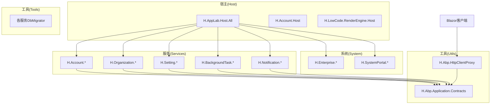
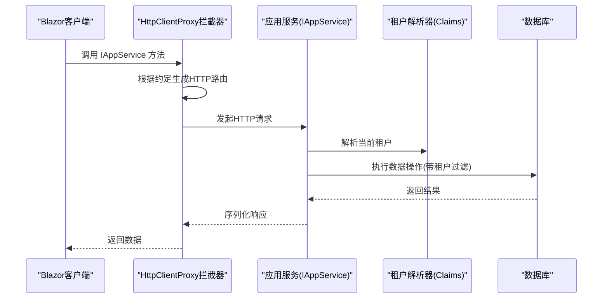
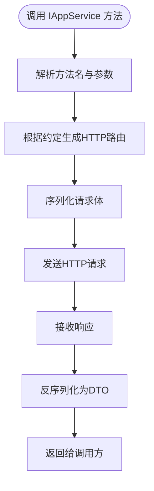
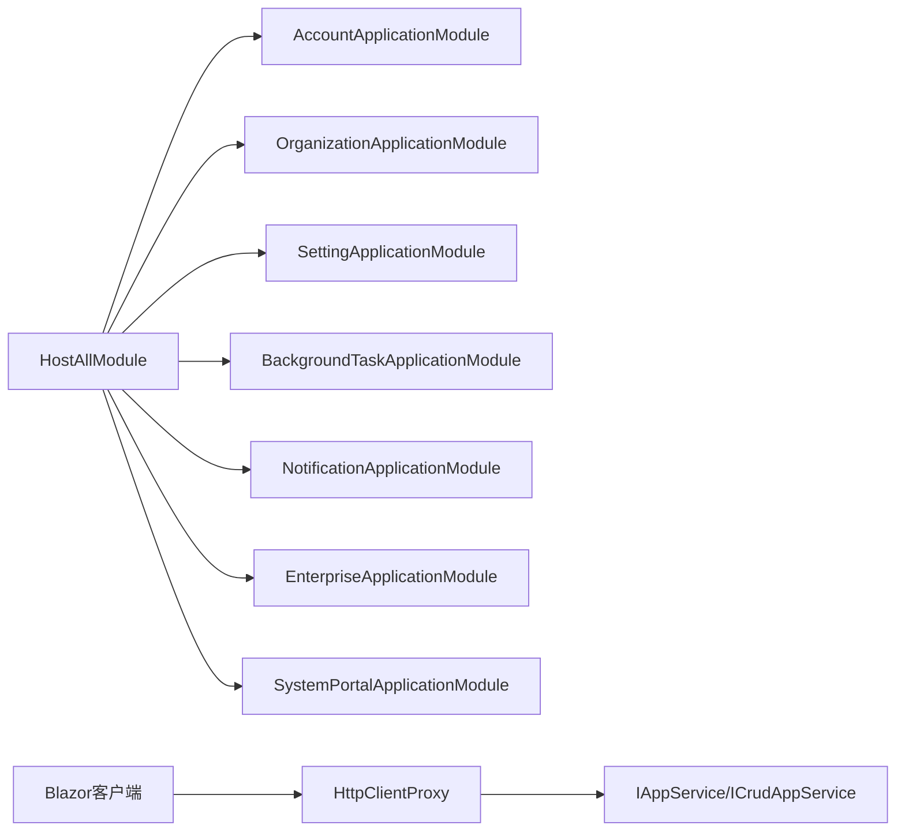

# 系统管理API

<cite>
**本文引用的文件**   
- [README.md](file://README.md)
- [H.AppLab.Host.All/Program.cs](file://src/Host/H.AppLab.Host.All/Program.cs)
- [H.AppLab.Host.All/HostAllModule.cs](file://src/Host/H.AppLab.Host.All/HostAllModule.cs)
- [H.AppLab.Host.All/ClaimsTenantResolveContributor.cs](file://src/Host/H.AppLab.Host.All/ClaimsTenantResolveContributor.cs)
- [H.Abp.HttpClientProxy/AbpUrlConvention.cs](file://src/Utils/H.Abp.HttpClientProxy/AbpUrlConvention.cs)
- [H.Abp.HttpClientProxy/HttpClientProxyInterceptor.cs](file://src/Utils/H.Abp.HttpClientProxy/HttpClientProxyInterceptor.cs)
- [H.Abp.HttpClientProxy/RemoteServiceOptions.cs](file://src/Utils/H.Abp.HttpClientProxy/RemoteServiceOptions.cs)
- [H.Abp.Application.Contracts/IAppService.cs](file://src/Utils/H.Abp.Application.Contracts/IAppService.cs)
- [H.Abp.Application.Contracts/ICrudAppService.cs](file://src/Utils/H.Abp.Application.Contracts/ICrudAppService.cs)
- [H.Abp.Application.Contracts/PagedResultDto.cs](file://src/Utils/H.Abp.Application.Contracts/PagedResultDto.cs)
- [H.Abp.Application.Contracts/PagedResultRequestDto.cs](file://src/Utils/H.Abp.Application.Contracts/PagedResultRequestDto.cs)
- [H.Account.Application/AccountApplicationModule.cs](file://src/Services/Account/H.Account.Application/AccountApplicationModule.cs)
- [H.Organization.Application/OrganizationApplicationModule.cs](file://src/Services/Organization/H.Organization.Application/OrganizationApplicationModule.cs)
- [H.Setting.Application/SettingApplicationModule.cs](file://src/Services/Setting/H.Setting.Application/SettingApplicationModule.cs)
- [H.BackgroundTask.Application/BackgroundTaskApplicationModule.cs](file://src/Services/BackgroundTask/H.BackgroundTask.Application/BackgroundTaskApplicationModule.cs)
- [H.Notification.Application/NotificationApplicationModule.cs](file://src/Services/Notification/H.Notification.Application/NotificationApplicationModule.cs)
- [H.Enterprise.Application/EnterpriseApplicationModule.cs](file://src/System/Enterprise/H.Enterprise.Application/EnterpriseApplicationModule.cs)
- [H.SystemPortal.Application/SystemPortalApplicationModule.cs](file://src/System/SystemPortal/H.SystemPortal.Application/SystemPortalApplicationModule.cs)
</cite>

## 目录
1. [简介](#简介)
2. [项目结构](#项目结构)
3. [核心组件](#核心组件)
4. [架构总览](#架构总览)
5. [详细组件分析](#详细组件分析)
6. [依赖关系分析](#依赖关系分析)
7. [性能考虑](#性能考虑)
8. [故障排查指南](#故障排查指南)
9. [结论](#结论)
10. [附录](#附录)

## 简介
本文件为系统管理API的权威文档，覆盖企业管理、租户管理、系统配置、用户管理等核心接口，并说明多租户隔离、资源配额、权限控制等能力。同时包含系统监控、日志管理、配置热更新等运维管理接口规范，以及企业级应用的部署管理与集群协调机制说明。文档基于仓库中的宿主模块、HTTP动态代理与契约层实现进行归纳，确保与实际代码一致。

## 项目结构
系统采用模块化架构，支持单体部署与按服务独立部署。Host 为宿主程序，负责服务注册与启动；System 提供平台运营侧应用（Enterprise、SystemPortal）；Services 下按限界上下文划分业务模块；Utils 提供通用契约与HTTP动态代理；Tools 提供数据库迁移工具。

图表来源
- [README.md:1-74](file://README.md#L1-L74)

章节来源
- [README.md:1-74](file://README.md#L1-L74)

## 核心组件
- 应用服务契约：IAppService、ICrudAppService 定义服务端应用服务接口与通用CRUD能力，前端通过动态代理调用。
- HTTP动态代理：AbpUrlConvention、HttpClientProxyInterceptor、RemoteServiceOptions 将接口方法名转换为HTTP请求，统一远程服务地址。
- 宿主与模块：HostAllModule 聚合各模块服务；ClaimsTenantResolveContributor 提供租户解析；各领域 ApplicationModule 注册服务。

章节来源
- [H.Abp.Application.Contracts/IAppService.cs](file://src/Utils/H.Abp.Application.Contracts/IAppService.cs)
- [H.Abp.Application.Contracts/ICrudAppService.cs](file://src/Utils/H.Abp.Application.Contracts/ICrudAppService.cs)
- [H.Abp.HttpClientProxy/AbpUrlConvention.cs](file://src/Utils/H.Abp.HttpClientProxy/AbpUrlConvention.cs)
- [H.Abp.HttpClientProxy/HttpClientProxyInterceptor.cs](file://src/Utils/H.Abp.HttpClientProxy/HttpClientProxyInterceptor.cs)
- [H.Abp.HttpClientProxy/RemoteServiceOptions.cs](file://src/Utils/H.Abp.HttpClientProxy/RemoteServiceOptions.cs)
- [H.AppLab.Host.All/HostAllModule.cs](file://src/Host/H.AppLab.Host.All/HostAllModule.cs)
- [H.AppLab.Host.All/ClaimsTenantResolveContributor.cs](file://src/Host/H.AppLab.Host.All/ClaimsTenantResolveContributor.cs)

## 架构总览
系统以 Blazor Web App（Server + WebAssembly）模式运行，前端通过 IAppService 动态代理访问后端服务。租户信息通过 Claims 解析注入到请求上下文，所有应用服务可基于当前租户进行数据隔离。

图表来源
- [H.Abp.HttpClientProxy/HttpClientProxyInterceptor.cs](file://src/Utils/H.Abp.HttpClientProxy/HttpClientProxyInterceptor.cs)
- [H.Abp.HttpClientProxy/AbpUrlConvention.cs](file://src/Utils/H.Abp.HttpClientProxy/AbpUrlConvention.cs)
- [H.AppLab.Host.All/ClaimsTenantResolveContributor.cs](file://src/Host/H.AppLab.Host.All/ClaimsTenantResolveContributor.cs)

## 详细组件分析

### 企业管理API（Enterprise）
- 功能范围：企业创建、更新、删除、查询、启用/禁用、成员管理、角色分配、资源配额设置等。
- 典型接口：
  - 企业列表：分页查询，支持按名称、状态筛选。
  - 企业详情：获取企业基本信息与关联角色、成员。
  - 企业创建/更新：校验唯一性、初始化默认配置。
  - 企业禁用/启用：影响该租户下的登录与会话。
  - 资源配额：CPU/内存/存储/并发限制。
- 多租户隔离：所有企业相关数据以 tenantId 维度隔离。
- 权限控制：仅平台管理员或企业超级管理员可操作。

章节来源
- [H.Enterprise.Application/EnterpriseApplicationModule.cs](file://src/System/Enterprise/H.Enterprise.Application/EnterpriseApplicationModule.cs)

### 租户管理API（Organization）
- 功能范围：组织树维护、部门/岗位、成员加入/退出、角色与权限映射。
- 典型接口：
  - 组织树：递归查询组织层级。
  - 成员管理：新增、移除、角色变更。
  - 权限映射：角色到菜单/功能的授权。
- 多租户隔离：组织数据归属特定租户，跨租户不可见。
- 权限控制：组织管理员与平台管理员具备不同粒度权限。

章节来源
- [H.Organization.Application/OrganizationApplicationModule.cs](file://src/Services/Organization/H.Organization.Application/OrganizationApplicationModule.cs)

### 系统配置API（Setting）
- 功能范围：全局配置项、租户级配置、配置分组与版本管理。
- 典型接口：
  - 配置项CRUD：键值对、类型、作用域（全局/租户）。
  - 配置热更新：运行时刷新缓存，无需重启。
  - 配置导入导出：批量同步与备份。
- 多租户隔离：租户级配置优先于全局配置。
- 权限控制：系统管理员可修改全局配置，租户管理员仅能修改租户级配置。

章节来源
- [H.Setting.Application/SettingApplicationModule.cs](file://src/Services/Setting/H.Setting.Application/SettingApplicationModule.cs)

### 用户管理API（Account）
- 功能范围：用户注册、登录、密码重置、账户锁定、外部登录集成。
- 典型接口：
  - 登录/登出：JWT令牌签发与撤销。
  - 用户CRUD：基础信息与状态管理。
  - 密码策略：复杂度、过期时间、历史密码检查。
  - 外部登录：OAuth/SAML集成。
- 多租户隔离：用户归属租户，跨租户不可用。
- 权限控制：基于角色的访问控制（RBAC），细粒度到菜单与操作。

章节来源
- [H.Account.Application/AccountApplicationModule.cs](file://src/Services/Account/H.Account.Application/AccountApplicationModule.cs)

### 后台任务与通知API（BackgroundTask / Notification）
- 功能范围：异步任务调度、重试、失败告警；消息模板、发送渠道、订阅管理。
- 典型接口：
  - 任务管理：创建、查询、取消、重试。
  - 通知模板：增删改查、变量替换。
  - 发送记录：查看发送状态与重试历史。
- 多租户隔离：任务与通知均按租户隔离。
- 权限控制：仅具备相应权限的用户可触发或查看。

章节来源
- [H.BackgroundTask.Application/BackgroundTaskApplicationModule.cs](file://src/Services/BackgroundTask/H.BackgroundTask.Application/BackgroundTaskApplicationModule.cs)
- [H.Notification.Application/NotificationApplicationModule.cs](file://src/Services/Notification/H.Notification.Application/NotificationApplicationModule.cs)

### 系统门户API（SystemPortal）
- 功能范围：平台仪表盘、应用目录、审计日志、健康检查。
- 典型接口：
  - 仪表盘：系统指标、租户统计、资源使用率。
  - 应用目录：已发布应用列表与状态。
  - 审计日志：操作记录查询与导出。
  - 健康检查：服务存活与依赖健康状态。
- 多租户隔离：平台级数据不区分租户。
- 权限控制：平台管理员专属。

章节来源
- [H.SystemPortal.Application/SystemPortalApplicationModule.cs](file://src/System/SystemPortal/H.SystemPortal.Application/SystemPortalApplicationModule.cs)

### 前端HTTP动态代理与路由约定
- 动态代理：基于 DispatchProxy 拦截 IAppService 方法调用，自动转换为HTTP请求。
- 路由约定：GetXxx → GET，CreateXxx → POST，UpdateXxx → PUT，DeleteXxx → DELETE。
- 远程服务地址：通过 RemoteServiceOptions 统一管理。

图表来源
- [H.Abp.HttpClientProxy/HttpClientProxyInterceptor.cs](file://src/Utils/H.Abp.HttpClientProxy/HttpClientProxyInterceptor.cs)
- [H.Abp.HttpClientProxy/AbpUrlConvention.cs](file://src/Utils/H.Abp.HttpClientProxy/AbpUrlConvention.cs)
- [H.Abp.HttpClientProxy/RemoteServiceOptions.cs](file://src/Utils/H.Abp.HttpClientProxy/RemoteServiceOptions.cs)

章节来源
- [H.Abp.HttpClientProxy/HttpClientProxyInterceptor.cs](file://src/Utils/H.Abp.HttpClientProxy/HttpClientProxyInterceptor.cs)
- [H.Abp.HttpClientProxy/AbpUrlConvention.cs](file://src/Utils/H.Abp.HttpClientProxy/AbpUrlConvention.cs)
- [H.Abp.HttpClientProxy/RemoteServiceOptions.cs](file://src/Utils/H.Abp.HttpClientProxy/RemoteServiceOptions.cs)

## 依赖关系分析
- 宿主模块聚合各应用服务模块，统一生命周期管理。
- 前端通过动态代理依赖契约层，避免直接耦合具体服务实现。
- 租户解析器在请求管道中注入租户上下文，供后续服务使用。

图表来源
- [H.AppLab.Host.All/HostAllModule.cs](file://src/Host/H.AppLab.Host.All/HostAllModule.cs)
- [H.Abp.Application.Contracts/IAppService.cs](file://src/Utils/H.Abp.Application.Contracts/IAppService.cs)
- [H.Abp.Application.Contracts/ICrudAppService.cs](file://src/Utils/H.Abp.Application.Contracts/ICrudAppService.cs)

章节来源
- [H.AppLab.Host.All/HostAllModule.cs](file://src/Host/H.AppLab.Host.All/HostAllModule.cs)
- [H.Abp.Application.Contracts/IAppService.cs](file://src/Utils/H.Abp.Application.Contracts/IAppService.cs)
- [H.Abp.Application.Contracts/ICrudAppService.cs](file://src/Utils/H.Abp.Application.Contracts/ICrudAppService.cs)

## 性能考虑
- 懒加载：WebAssembly按需加载程序集，减少首屏体积。
- AOT与裁剪：Release模式启用AOT与Trimming，提升启动速度与减小包大小。
- 分页与排序：使用 PagedResultDto 与 PagedResultRequestDto 优化大数据量查询。
- 缓存：配置热更新避免频繁重启，结合本地缓存降低数据库压力。

章节来源
- [README.md:69-74](file://README.md#L69-L74)
- [H.Abp.Application.Contracts/PagedResultDto.cs](file://src/Utils/H.Abp.Application.Contracts/PagedResultDto.cs)
- [H.Abp.Application.Contracts/PagedResultRequestDto.cs](file://src/Utils/H.Abp.Application.Contracts/PagedResultRequestDto.cs)

## 故障排查指南
- 动态代理失败：检查 AbpUrlConvention 路由约定与 RemoteServiceOptions 配置是否正确。
- 租户解析异常：确认 ClaimsTenantResolveContributor 是否成功注入租户ID。
- 服务未注册：验证各 ApplicationModule 是否在 HostAllModule 中正确注册。
- 数据库连接问题：通过对应 DbMigrator 检查连接字符串与迁移状态。

章节来源
- [H.Abp.HttpClientProxy/AbpUrlConvention.cs](file://src/Utils/H.Abp.HttpClientProxy/AbpUrlConvention.cs)
- [H.Abp.HttpClientProxy/RemoteServiceOptions.cs](file://src/Utils/H.Abp.HttpClientProxy/RemoteServiceOptions.cs)
- [H.AppLab.Host.All/ClaimsTenantResolveContributor.cs](file://src/Host/H.AppLab.Host.All/ClaimsTenantResolveContributor.cs)
- [H.AppLab.Host.All/HostAllModule.cs](file://src/Host/H.AppLab.Host.All/HostAllModule.cs)

## 结论
本系统管理API基于模块化架构与HTTP动态代理，实现了企业级多租户隔离、权限控制与配置热更新。通过统一的契约层与宿主聚合，系统具备良好的扩展性与可维护性。建议在生产环境中启用AOT与裁剪，并结合缓存与分页优化性能。

## 附录
- 部署方式：支持单体部署（HostAll）与按服务独立部署（各Host）。
- 集群协调：可通过容器编排（Docker Compose/Kubernetes）管理服务实例与健康检查。
- 监控与日志：通过 SystemPortal 的仪表盘与审计日志接口进行集中管理。

章节来源
- [README.md:1-74](file://README.md#L1-L74)
- [H.SystemPortal.Application/SystemPortalApplicationModule.cs](file://src/System/SystemPortal/H.SystemPortal.Application/SystemPortalApplicationModule.cs)