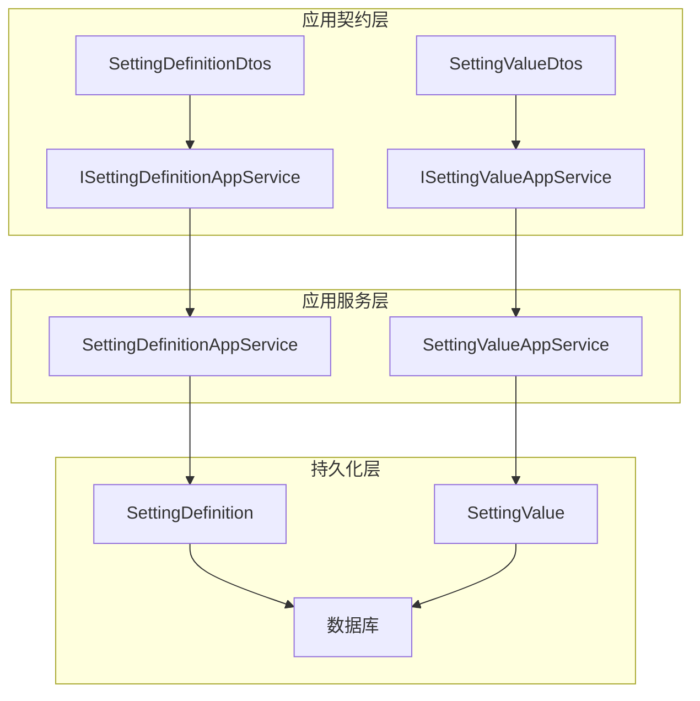
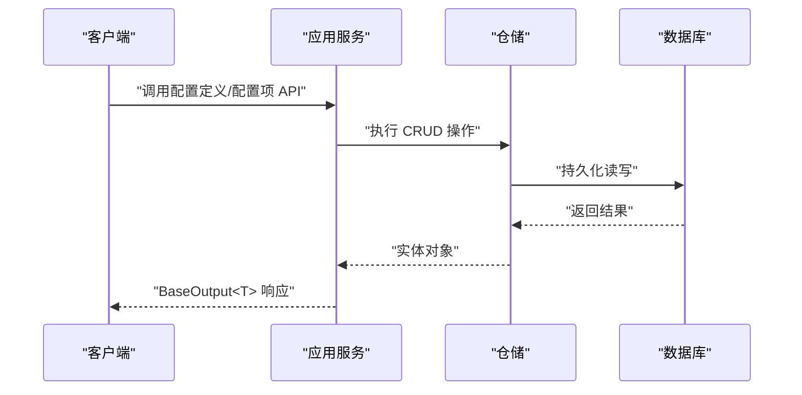
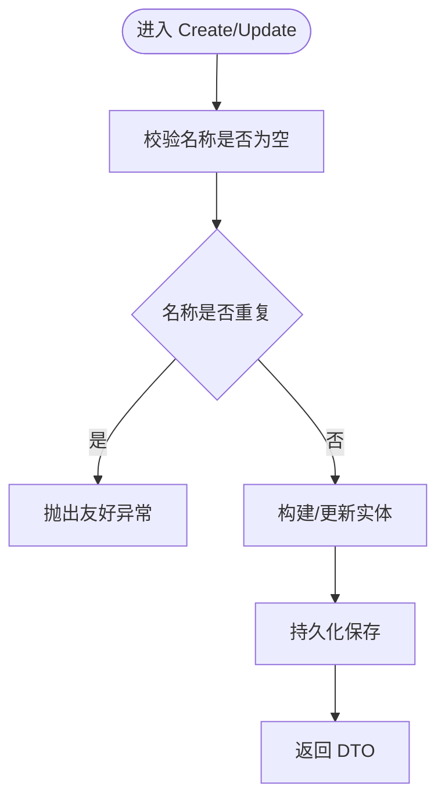
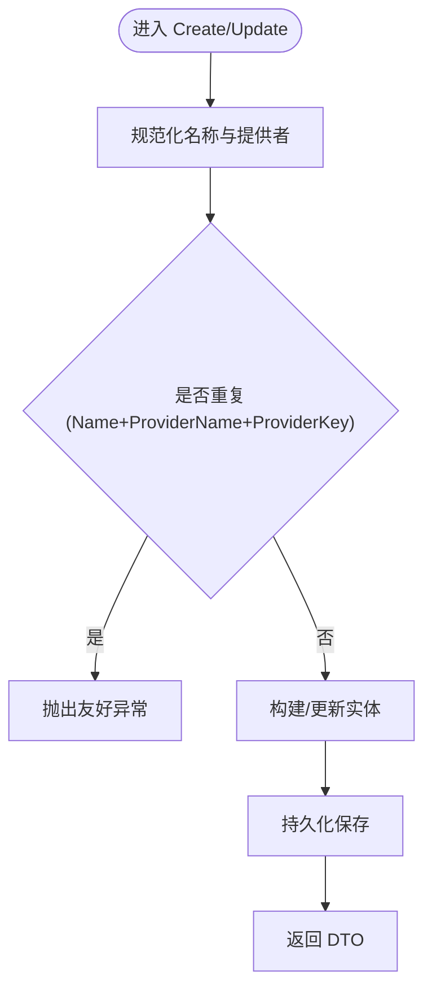
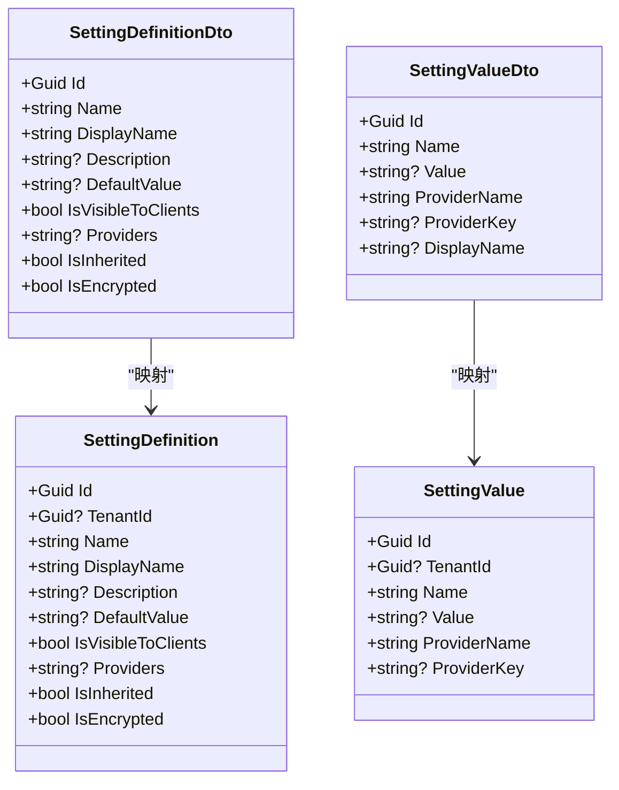

# 系统设置API

<cite>
**本文引用的文件**   
- [ISettingDefinitionAppService.cs](file://src/Services/Setting/H.Setting.Application.Contracts/Services/ISettingDefinitionAppService.cs)
- [ISettingValueAppService.cs](file://src/Services/Setting/H.Setting.Application.Contracts/Services/ISettingValueAppService.cs)
- [SettingDefinitionDtos.cs](file://src/Services/Setting/H.Setting.Application.Contracts/Dtos/SettingDefinitionDtos.cs)
- [SettingValueDtos.cs](file://src/Services/Setting/H.Setting.Application.Contracts/Dtos/SettingValueDtos.cs)
- [SettingDefinitionAppService.cs](file://src/Services/Setting/H.Setting.Application/Services/SettingDefinitionAppService.cs)
- [SettingValueAppService.cs](file://src/Services/Setting/H.Setting.Application/Services/SettingValueAppService.cs)
- [SettingDefinition.cs](file://src/Services/Setting/H.Setting.EntityFrameworkCore/Entities/SettingDefinition.cs)
- [SettingValue.cs](file://src/Services/Setting/H.Setting.EntityFrameworkCore/Entities/SettingValue.cs)
- [Program.cs](file://src/Tools/H.Setting.DbMigrator/Program.cs)
</cite>

## 目录
1. [引言](#引言)
2. [项目结构](#项目结构)
3. [核心组件](#核心组件)
4. [架构总览](#架构总览)
5. [详细组件分析](#详细组件分析)
6. [依赖关系分析](#依赖关系分析)
7. [性能与缓存](#性能与缓存)
8. [安全与权限](#安全与权限)
9. [配置验证规则](#配置验证规则)
10. [调用示例](#调用示例)
11. [数据迁移与备份恢复](#数据迁移与备份恢复)
12. [故障排查](#故障排查)
13. [结论](#结论)

## 引言
本文档为 H.AppLab 平台的“系统设置服务”提供完整的 RESTful API 文档。该服务基于 ABP 框架，负责系统级“配置定义”和“配置项（配置值）”的增删改查、分页查询、过滤、下拉字典等能力，并支持全局、租户、用户三种提供者维度，满足多租户场景下的差异化配置需求。

需要特别说明的是：
- 当前仓库中未发现专门的“系统字典管理”模块；但“配置定义下拉项”接口可用于前端选择关联的配置定义，起到类似字典枚举的作用。
- 未实现显式的“热更新”机制；配置变更后需由调用方或后续扩展通过读取最新值来生效。
- 未实现内置的“系统设置备份与恢复”接口；可结合数据库迁移工具进行备份与恢复。

## 项目结构
系统设置服务采用分层架构：
- Application.Contracts：对外暴露的 API 契约、DTO、分页模型。
- Application：应用服务实现，包含业务逻辑与校验。
- EntityFrameworkCore：领域实体与 DbContext。
- Web：Web 模块标记类（当前为空）。
- Tools/H.Setting.DbMigrator：数据库迁移执行入口。

图表来源
- [ISettingDefinitionAppService.cs:1-16](file://src/Services/Setting/H.Setting.Application.Contracts/Services/ISettingDefinitionAppService.cs#L1-L16)
- [ISettingValueAppService.cs:1-19](file://src/Services/Setting/H.Setting.Application.Contracts/Services/ISettingValueAppService.cs#L1-L19)
- [SettingDefinitionAppService.cs:1-136](file://src/Services/Setting/H.Setting.Application/Services/SettingDefinitionAppService.cs#L1-L136)
- [SettingValueAppService.cs:1-167](file://src/Services/Setting/H.Setting.Application/Services/SettingValueAppService.cs#L1-L167)
- [SettingDefinition.cs:1-37](file://src/Services/Setting/H.Setting.EntityFrameworkCore/Entities/SettingDefinition.cs#L1-L37)
- [SettingValue.cs:1-25](file://src/Services/Setting/H.Setting.EntityFrameworkCore/Entities/SettingValue.cs#L1-L25)

章节来源
- [ISettingDefinitionAppService.cs:1-16](file://src/Services/Setting/H.Setting.Application.Contracts/Services/ISettingDefinitionAppService.cs#L1-L16)
- [ISettingValueAppService.cs:1-19](file://src/Services/Setting/H.Setting.Application.Contracts/Services/ISettingValueAppService.cs#L1-L19)
- [SettingDefinitionAppService.cs:1-136](file://src/Services/Setting/H.Setting.Application/Services/SettingDefinitionAppService.cs#L1-L136)
- [SettingValueAppService.cs:1-167](file://src/Services/Setting/H.Setting.Application/Services/SettingValueAppService.cs#L1-L167)
- [SettingDefinition.cs:1-37](file://src/Services/Setting/H.Setting.EntityFrameworkCore/Entities/SettingDefinition.cs#L1-L37)
- [SettingValue.cs:1-25](file://src/Services/Setting/H.Setting.EntityFrameworkCore/Entities/SettingValue.cs#L1-L25)

## 核心组件
- 配置定义管理服务：用于维护配置的元数据（名称、显示名、描述、默认值、可见性、提供者范围、是否继承、是否加密等），并提供增删改查与分页过滤。
- 配置项管理服务：用于维护具体配置值，按“名称 + 提供者名称 + 提供者键”唯一约束，支持分页、过滤、创建、更新、删除，以及获取全部配置定义的下拉列表。
- 领域实体：
  - SettingDefinition：配置定义实体，支持多租户字段 TenantId。
  - SettingValue：配置项实体，支持多租户字段 TenantId，以及 ProviderName/ProviderKey。

章节来源
- [ISettingDefinitionAppService.cs:1-16](file://src/Services/Setting/H.Setting.Application.Contracts/Services/ISettingDefinitionAppService.cs#L1-L16)
- [ISettingValueAppService.cs:1-19](file://src/Services/Setting/H.Setting.Application.Contracts/Services/ISettingValueAppService.cs#L1-L19)
- [SettingDefinition.cs:1-37](file://src/Services/Setting/H.Setting.EntityFrameworkCore/Entities/SettingDefinition.cs#L1-L37)
- [SettingValue.cs:1-25](file://src/Services/Setting/H.Setting.EntityFrameworkCore/Entities/SettingValue.cs#L1-L25)

## 架构总览

图表来源
- [SettingDefinitionAppService.cs:1-136](file://src/Services/Setting/H.Setting.Application/Services/SettingDefinitionAppService.cs#L1-L136)
- [SettingValueAppService.cs:1-167](file://src/Services/Setting/H.Setting.Application/Services/SettingValueAppService.cs#L1-L167)

## 详细组件分析

### 配置定义管理 API（ISettingDefinitionAppService）
- 接口方法
  - 分页查询：GetListAsync(SettingDefinitionQueryDto)
  - 获取详情：GetAsync(Guid id)
  - 新增：CreateAsync(CreateUpdateSettingDefinitionDto)
  - 修改：UpdateAsync(Guid id, CreateUpdateSettingDefinitionDto)
  - 删除：DeleteAsync(Guid id)

- 请求参数
  - GetListAsync
    - Filter: 可选，按名称或显示名模糊过滤
    - SkipCount、MaxResultCount：来自 PagedResultRequestDto
  - CreateUpdateSettingDefinitionDto
    - Name: 必填，唯一标识
    - DisplayName: 必填
    - Description: 可选
    - DefaultValue: 可选
    - IsVisibleToClients: 是否对客户端可见
    - Providers: 允许提供者（逗号分隔，如 G,T,U）
    - IsInherited: 是否可被下层提供者继承
    - IsEncrypted: 是否加密存储

- 响应数据结构
  - BaseOutput<PagedResultDto<SettingDefinitionDto>>
  - BaseOutput<SettingDefinitionDto>
  - BaseOutput（删除成功）

- 业务规则与校验
  - 名称不可为空，且不可重复（新增时严格检查；修改时排除自身）
  - 删除前检查是否存在关联配置项，存在则拒绝删除

- 复杂度分析
  - 分页查询：O(n) 扫描+排序，使用 Skip/Take 控制页大小
  - 删除前检查：先查询是否存在关联项，再删除

图表来源
- [SettingDefinitionAppService.cs:53-106](file://src/Services/Setting/H.Setting.Application/Services/SettingDefinitionAppService.cs#L53-L106)
- [ISettingDefinitionAppService.cs:1-16](file://src/Services/Setting/H.Setting.Application.Contracts/Services/ISettingDefinitionAppService.cs#L1-L16)

章节来源
- [ISettingDefinitionAppService.cs:1-16](file://src/Services/Setting/H.Setting.Application.Contracts/Services/ISettingDefinitionAppService.cs#L1-L16)
- [SettingDefinitionAppService.cs:1-136](file://src/Services/Setting/H.Setting.Application/Services/SettingDefinitionAppService.cs#L1-L136)
- [SettingDefinitionDtos.cs:1-57](file://src/Services/Setting/H.Setting.Application.Contracts/Dtos/SettingDefinitionDtos.cs#L1-L57)

### 配置项管理 API（ISettingValueAppService）
- 接口方法
  - 分页查询：GetListAsync(SettingValueQueryDto)
  - 获取详情：GetAsync(Guid id)
  - 新增：CreateAsync(CreateUpdateSettingValueDto)
  - 修改：UpdateAsync(Guid id, CreateUpdateSettingValueDto)
  - 删除：DeleteAsync(Guid id)
  - 获取配置定义下拉：GetDefinitionLookupAsync()

- 请求参数
  - GetListAsync
    - Filter: 可选，按配置名称模糊过滤
    - ProviderName: 可选，按提供者名称过滤（G=全局，T=租户，U=用户）
    - SkipCount、MaxResultCount：来自 PagedResultRequestDto
  - CreateUpdateSettingValueDto
    - Name: 必填，关联配置定义的 Name
    - Value: 可选
    - ProviderName: 可选，默认全局（G）
    - ProviderKey: 可选，提供者键（如租户ID/用户ID）

- 响应数据结构
  - BaseOutput<PagedResultDto<SettingValueDto>>
  - BaseOutput<SettingValueDto>
  - BaseOutput<List<SettingDefinitionLookupDto>>

- 业务规则与校验
  - 名称不可为空
  - 提供者名称为空时规范化为全局（G）
  - 唯一性约束：同一 Name + ProviderName + ProviderKey 不得重复（新增与修改时检查）
  - 删除直接删除对应配置项

- 列表展示增强
  - 在分页查询时，会批量加载关联的定义，补充 DisplayName 便于展示

图表来源
- [SettingValueAppService.cs:72-121](file://src/Services/Setting/H.Setting.Application/Services/SettingValueAppService.cs#L72-L121)
- [ISettingValueAppService.cs:1-19](file://src/Services/Setting/H.Setting.Application.Contracts/Services/ISettingValueAppService.cs#L1-L19)

章节来源
- [ISettingValueAppService.cs:1-19](file://src/Services/Setting/H.Setting.Application.Contracts/Services/ISettingValueAppService.cs#L1-L19)
- [SettingValueAppService.cs:1-167](file://src/Services/Setting/H.Setting.Application/Services/SettingValueAppService.cs#L1-L167)
- [SettingValueDtos.cs:1-72](file://src/Services/Setting/H.Setting.Application.Contracts/Dtos/SettingValueDtos.cs#L1-L72)

### 数据模型与关系

图表来源
- [SettingDefinition.cs:1-37](file://src/Services/Setting/H.Setting.EntityFrameworkCore/Entities/SettingDefinition.cs#L1-L37)
- [SettingValue.cs:1-25](file://src/Services/Setting/H.Setting.EntityFrameworkCore/Entities/SettingValue.cs#L1-L25)
- [SettingDefinitionDtos.cs:1-57](file://src/Services/Setting/H.Setting.Application.Contracts/Dtos/SettingDefinitionDtos.cs#L1-L57)
- [SettingValueDtos.cs:1-72](file://src/Services/Setting/H.Setting.Application.Contracts/Dtos/SettingValueDtos.cs#L1-L72)

## 依赖关系分析
- 应用契约层与应用服务层：接口与实现分离，便于测试与替换。
- 应用服务层与持久化层：通过 IRepository 抽象访问数据库实体。
- 实体设计参考 ABP SettingManagement，具备多租户字段，便于后续扩展租户级配置。

图表来源
- [ISettingDefinitionAppService.cs:1-16](file://src/Services/Setting/H.Setting.Application.Contracts/Services/ISettingDefinitionAppService.cs#L1-L16)
- [ISettingValueAppService.cs:1-19](file://src/Services/Setting/H.Setting.Application.Contracts/Services/ISettingValueAppService.cs#L1-L19)
- [SettingDefinitionAppService.cs:1-136](file://src/Services/Setting/H.Setting.Application/Services/SettingDefinitionAppService.cs#L1-L136)
- [SettingValueAppService.cs:1-167](file://src/Services/Setting/H.Setting.Application/Services/SettingValueAppService.cs#L1-L167)
- [SettingDefinition.cs:1-37](file://src/Services/Setting/H.Setting.EntityFrameworkCore/Entities/SettingDefinition.cs#L1-L37)
- [SettingValue.cs:1-25](file://src/Services/Setting/H.Setting.EntityFrameworkCore/Entities/SettingValue.cs#L1-L25)

## 性能与缓存
- 分页查询：
  - 使用 Skip/Take 控制每页条数，避免一次性加载全量数据。
  - 列表查询时会对关联的定义进行批量加载并构建 DisplayName 映射，减少 N+1 查询问题。
- 无内置缓存：
  - 当前实现未引入内存缓存或分布式缓存；每次请求均从数据库读取。
- 无热更新：
  - 未实现监听配置变更的事件机制；如需热更新，可在现有基础上增加缓存刷新与事件通知。

建议优化点：
- 为频繁读的配置定义与常用配置项添加缓存层（如内存缓存），并配合失效策略。
- 为 Settings 表 Name、ProviderName、ProviderKey 建立索引以提升查询性能。
- 若未来启用加密存储，应评估加解密对性能的影响并考虑按需解密。

[本节为通用性能指导，不直接分析具体代码文件]

## 安全与权限
- 多租户隔离：
  - 实体包含 TenantId 字段，可通过 ABP 多租户机制隔离数据。
- 提供者维度：
  - ProviderName 支持 G（全局）、T（租户）、U（用户），结合 ProviderKey 区分不同租户或用户。
- 加密存储：
  - 配置定义包含 IsEncrypted 字段，表示值是否加密；应用服务层未实现自动加解密逻辑，应由上层或扩展实现。
- 权限控制：
  - 当前未实现 RBAC 权限拦截；应在网关或中间件层增加鉴权，或在应用服务上增加授权注解。

章节来源
- [SettingDefinition.cs:1-37](file://src/Services/Setting/H.Setting.EntityFrameworkCore/Entities/SettingDefinition.cs#L1-L37)
- [SettingValue.cs:1-25](file://src/Services/Setting/H.Setting.EntityFrameworkCore/Entities/SettingValue.cs#L1-L25)

## 配置验证规则
- 配置定义
  - Name：必填，唯一，去除首尾空格后校验
  - DisplayName：必填
  - Providers：可选，逗号分隔字符串（约定 G,T,U）
  - IsInherited：可选，默认 true
  - IsEncrypted：可选
  - 删除保护：当存在关联配置项时禁止删除
- 配置项
  - Name：必填，关联配置定义的 Name
  - ProviderName：可选，默认全局（G），去除首尾空格
  - ProviderKey：可选
  - 唯一性：Name + ProviderName + ProviderKey 组合唯一
  - 校验失败时抛出友好异常提示

章节来源
- [SettingDefinitionAppService.cs:53-106](file://src/Services/Setting/H.Setting.Application/Services/SettingDefinitionAppService.cs#L53-L106)
- [SettingValueAppService.cs:72-121](file://src/Services/Setting/H.Setting.Application/Services/SettingValueAppService.cs#L72-L121)

## 调用示例
以下示例以 JSON 形式说明请求体与响应体结构。实际 HTTP 路径与认证方式由 ABP 路由与宿主决定。

- 新增配置定义
  - 请求
    - 方法：POST
    - 路径：/api/setting-definition（示例）
    - 请求体
      - Name: string（必填）
      - DisplayName: string（必填）
      - Description: string（可选）
      - DefaultValue: string（可选）
      - IsVisibleToClients: bool（可选）
      - Providers: string（可选）
      - IsInherited: bool（可选）
      - IsEncrypted: bool（可选）
  - 响应
    - BaseOutput<SettingDefinitionDto>

- 查询配置定义
  - 请求
    - 方法：GET
    - 路径：/api/setting-definition/list（示例）
    - 查询参数
      - Filter: string（可选）
      - SkipCount: int（可选）
      - MaxResultCount: int（可选）
  - 响应
    - BaseOutput<PagedResultDto<SettingDefinitionDto>>

- 修改配置定义
  - 请求
    - 方法：PUT
    - 路径：/api/setting-definition/{id}（示例）
    - 请求体：同新增
  - 响应
    - BaseOutput<SettingDefinitionDto>

- 删除配置定义
  - 请求
    - 方法：DELETE
    - 路径：/api/setting-definition/{id}（示例）
  - 响应
    - BaseOutput

- 新增配置项
  - 请求
    - 方法：POST
    - 路径：/api/setting-value（示例）
    - 请求体
      - Name: string（必填）
      - Value: string（可选）
      - ProviderName: string（可选，默认 G）
      - ProviderKey: string（可选）
  - 响应
    - BaseOutput<SettingValueDto>

- 查询配置项
  - 请求
    - 方法：GET
    - 路径：/api/setting-value/list（示例）
    - 查询参数
      - Filter: string（可选）
      - ProviderName: string（可选）
      - SkipCount: int（可选）
      - MaxResultCount: int（可选）
  - 响应
    - BaseOutput<PagedResultDto<SettingValueDto>>

- 修改配置项
  - 请求
    - 方法：PUT
    - 路径：/api/setting-value/{id}（示例）
    - 请求体：同新增
  - 响应
    - BaseOutput<SettingValueDto>

- 删除配置项
  - 请求
    - 方法：DELETE
    - 路径：/api/setting-value/{id}（示例）
  - 响应
    - BaseOutput

- 获取配置定义下拉
  - 请求
    - 方法：GET
    - 路径：/api/setting-value/definition-lookup（示例）
  - 响应
    - BaseOutput<List<SettingDefinitionLookupDto>>

章节来源
- [ISettingDefinitionAppService.cs:1-16](file://src/Services/Setting/H.Setting.Application.Contracts/Services/ISettingDefinitionAppService.cs#L1-L16)
- [ISettingValueAppService.cs:1-19](file://src/Services/Setting/H.Setting.Application.Contracts/Services/ISettingValueAppService.cs#L1-L19)
- [SettingDefinitionDtos.cs:1-57](file://src/Services/Setting/H.Setting.Application.Contracts/Dtos/SettingDefinitionDtos.cs#L1-L57)
- [SettingValueDtos.cs:1-72](file://src/Services/Setting/H.Setting.Application.Contracts/Dtos/SettingValueDtos.cs#L1-L72)

## 数据迁移与备份恢复
- 数据库迁移
  - 使用 H.Setting.DbMigrator 工具执行迁移，连接字符串名为 SettingDb。
  - 程序启动时会输出“开始执行数据库迁移...”，完成后输出“数据库迁移完成”。
  - 若出现异常，会打印错误信息与堆栈跟踪。

- 备份与恢复
  - 当前未提供内置备份与恢复 API。
  - 建议：
    - 定期备份 SQL Server 数据库（含 Settings 相关表）。
    - 通过版本化迁移记录保持结构与数据演进的可追溯性。

章节来源
- [Program.cs:1-55](file://src/Tools/H.Setting.DbMigrator/Program.cs#L1-L55)

## 故障排查
- 常见错误
  - 名称为空：新增或修改配置定义/配置项时，名称必须非空。
  - 名称重复：新增或修改配置定义时，名称必须唯一。
  - 配置项重复：新增或修改配置项时，Name + ProviderName + ProviderKey 组合必须唯一。
  - 无法删除配置定义：当存在关联配置项时，禁止删除。
- 处理建议
  - 检查请求体参数是否正确。
  - 检查是否存在冲突的数据。
  - 查看服务端日志与异常信息。

章节来源
- [SettingDefinitionAppService.cs:53-106](file://src/Services/Setting/H.Setting.Application/Services/SettingDefinitionAppService.cs#L53-L106)
- [SettingValueAppService.cs:72-121](file://src/Services/Setting/H.Setting.Application/Services/SettingValueAppService.cs#L72-L121)

## 结论
H.AppLab 的系统设置服务提供了完善的“配置定义”与“配置项”管理能力，支持多租户、提供者维度与基础校验。当前实现未内置缓存与热更新机制，也未提供系统字典管理与备份恢复 API；但这些能力可以在现有架构上扩展实现。对于生产环境，建议补充缓存、权限、审计与备份恢复等横切关注点，以提升系统的稳定性与可运维性。