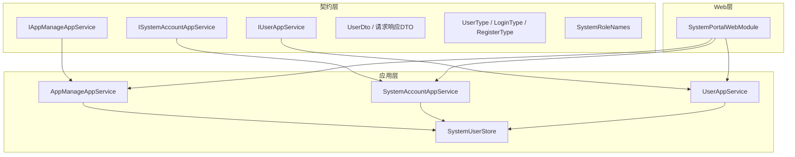
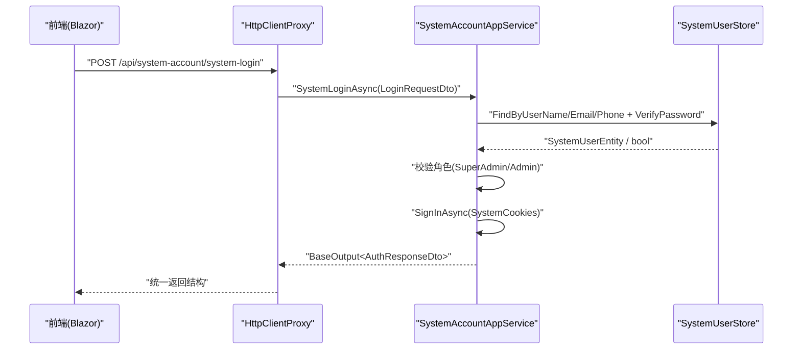
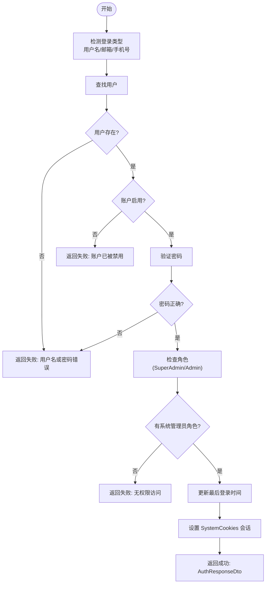
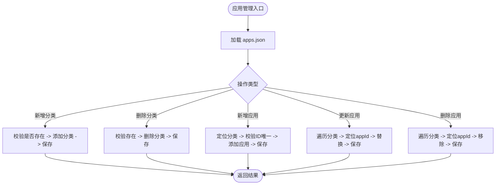
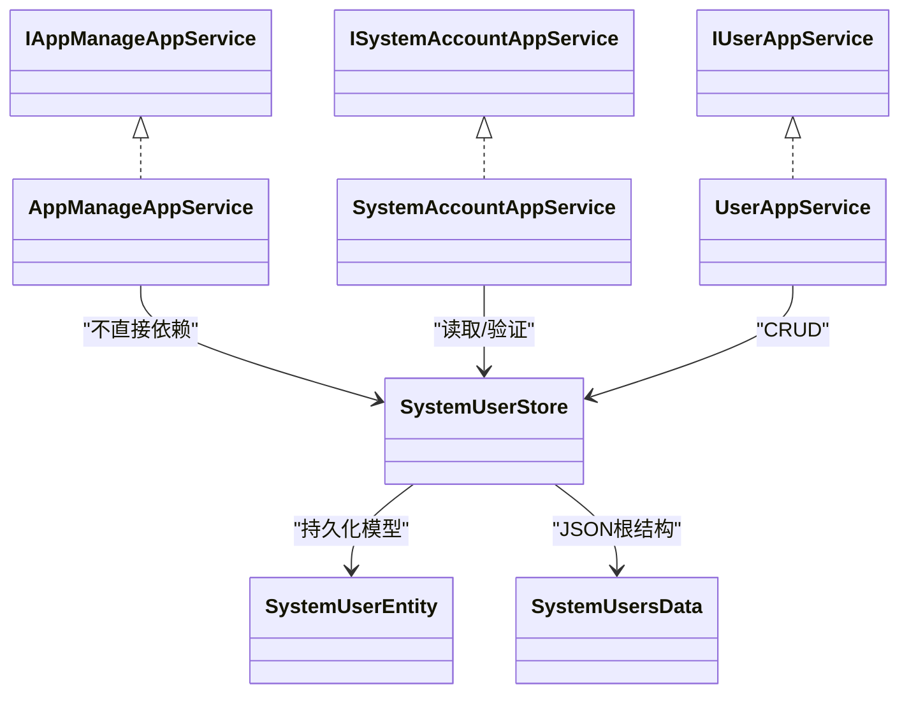

# 系统门户API

<cite>
**本文引用的文件**   
- [README.md](file://README.md)
- [IAppManageAppService.cs](file://src/System/SystemPortal/H.SystemPortal.Application.Contracts/Services/IAppManageAppService.cs)
- [ISystemAccountAppService.cs](file://src/System/SystemPortal/H.SystemPortal.Application.Contracts/Services/ISystemAccountAppService.cs)
- [IUserAppService.cs](file://src/System/SystemPortal/H.SystemPortal.Application.Contracts/Services/IUserAppService.cs)
- [UserDto.cs](file://src/System/SystemPortal/H.SystemPortal.Application.Contracts/Dtos/UserDto.cs)
- [UserType.cs](file://src/System/SystemPortal/H.SystemPortal.Application.Contracts/Enums/UserType.cs)
- [SystemRoleNames.cs](file://src/System/SystemPortal/H.SystemPortal.Application.Contracts/Constants/SystemRoleNames.cs)
- [SystemAccountAppService.cs](file://src/System/SystemPortal/H.SystemPortal.Application/Services/SystemAccountAppService.cs)
- [UserAppService.cs](file://src/System/SystemPortal/H.SystemPortal.Application/Services/UserAppService.cs)
- [AppManageAppService.cs](file://src/System/SystemPortal/H.SystemPortal.Application/Services/AppManageAppService.cs)
- [SystemUserStore.cs](file://src/System/SystemPortal/H.SystemPortal.Application/Services/SystemUserStore.cs)
- [SystemPortalApplicationModule.cs](file://src/System/SystemPortal/H.SystemPortal.Application/SystemPortalApplicationModule.cs)
- [SystemPortalWebModule.cs](file://src/System/SystemPortal/H.SystemPortal.Web/SystemPortalWebModule.cs)
</cite>

## 目录
1. [引言](#引言)
2. [项目结构](#项目结构)
3. [核心组件](#核心组件)
4. [架构总览](#架构总览)
5. [详细接口文档](#详细接口文档)
6. [依赖关系分析](#依赖关系分析)
7. [性能与扩展性](#性能与扩展性)
8. [故障排查指南](#故障排查指南)
9. [结论](#结论)

## 引言
本文件为 H.AppLab 平台的“系统门户”模块 API 文档，聚焦系统管理员侧能力。当前代码仓库中系统门户提供三类应用服务：
- 账户与安全：系统登录、登出、获取当前用户。
- 用户管理：用户的查询、分页、创建、更新、状态变更、密码重置、删除、角色分配与查询等。
- 应用管理：应用分类与应用项的读取与增删改（基于 JSON 文件）。

该模块采用 ABP 模块化架构，前端通过 HttpClientProxy 动态代理 IAppService 接口发起 HTTP 请求；后端以 Application Service 暴露 RESTful 风格 API，数据持久化在 JSON 文件中。

## 项目结构
系统门户相关代码位于 System/SystemPortal 下，按 ABP 约定分层：
- H.SystemPortal.Application.Contracts：对外契约（接口与 DTO）。
- H.SystemPortal.Application：应用服务实现与存储。
- H.SystemPortal.Web：Blazor Web 端点与模块标记。

图示来源
- [IAppManageAppService.cs:1-41](file://src/System/SystemPortal/H.SystemPortal.Application.Contracts/Services/IAppManageAppService.cs#L1-L41)
- [ISystemAccountAppService.cs:1-22](file://src/System/SystemPortal/H.SystemPortal.Application.Contracts/Services/ISystemAccountAppService.cs#L1-L22)
- [IUserAppService.cs:1-30](file://src/System/SystemPortal/H.SystemPortal.Application.Contracts/Services/IUserAppService.cs#L1-L30)
- [AppManageAppService.cs](file://src/System/SystemPortal/H.SystemPortal.Application/Services/AppManageAppService.cs)
- [SystemAccountAppService.cs](file://src/System/SystemPortal/H.SystemPortal.Application/Services/SystemAccountAppService.cs)
- [UserAppService.cs](file://src/System/SystemPortal/H.SystemPortal.Application/Services/UserAppService.cs)
- [SystemUserStore.cs](file://src/System/SystemPortal/H.SystemPortal.Application/Services/SystemUserStore.cs)
- [SystemPortalWebModule.cs:1-8](file://src/System/SystemPortal/H.SystemPortal.Web/SystemPortalWebModule.cs#L1-L8)

章节来源
- [README.md:1-73](file://README.md#L1-L73)

## 核心组件
- IAppManageAppService：应用分类与应用项的管理接口，包含读取、新增、更新、删除分类和应用。
- ISystemAccountAppService：系统账户登录、登出、获取当前登录用户。
- IUserAppService：用户实体与角色的管理接口，包括查询、分页、CRUD、状态、密码、角色分配与查询。
- SystemUserStore：基于 JSON 文件的用户存储与密码哈希验证。
- AppManageAppService：应用配置 JSON 文件的读写实现。
- SystemAccountAppService：系统登录鉴权、Cookie 认证、当前用户解析。
- UserAppService：用户数据的 CRUD、校验、分页过滤、角色管理等业务编排。

章节来源
- [IAppManageAppService.cs:1-41](file://src/System/SystemPortal/H.SystemPortal.Application.Contracts/Services/IAppManageAppService.cs#L1-L41)
- [ISystemAccountAppService.cs:1-22](file://src/System/SystemPortal/H.SystemPortal.Application.Contracts/Services/ISystemAccountAppService.cs#L1-L22)
- [IUserAppService.cs:1-30](file://src/System/SystemPortal/H.SystemPortal.Application.Contracts/Services/IUserAppService.cs#L1-L30)
- [SystemUserStore.cs](file://src/System/SystemPortal/H.SystemPortal.Application/Services/SystemUserStore.cs)
- [AppManageAppService.cs](file://src/System/SystemPortal/H.SystemPortal.Application/Services/AppManageAppService.cs)
- [SystemAccountAppService.cs](file://src/System/SystemPortal/H.SystemPortal.Application/Services/SystemAccountAppService.cs)
- [UserAppService.cs](file://src/System/SystemPortal/H.SystemPortal.Application/Services/UserAppService.cs)

## 架构总览
系统门户采用 ABP 标准分层，结合 Blazor WebAssembly 前端与 HttpClientProxy 动态代理机制：
- 前端仅依赖 IAppService 契约，自动生成 HTTP 调用。
- 后端 Application Service 通过 DI 注入 SystemUserStore 或操作 JSON 文件。
- Cookie 认证方案名为 SystemCookies，用于系统管理员会话。

图示来源
- [ISystemAccountAppService.cs:1-22](file://src/System/SystemPortal/H.SystemPortal.Application.Contracts/Services/ISystemAccountAppService.cs#L1-L22)
- [SystemAccountAppService.cs](file://src/System/SystemPortal/H.SystemPortal.Application/Services/SystemAccountAppService.cs)
- [SystemUserStore.cs](file://src/System/SystemPortal/H.SystemPortal.Application/Services/SystemUserStore.cs)

## 详细接口文档

### 通用约定
- 所有接口继承自 IAppService，遵循 ABP 路由约定：GetXxx → GET，CreateXxx → POST，UpdateXxx → PUT，DeleteXxx → DELETE。
- 统一返回包装为 BaseOutput<T>，成功时携带数据，失败时包含 Message。
- 认证方式：系统管理员使用 Cookie 认证方案 SystemCookies；未认证或无权限将返回空或错误信息。
- 数据模型：UserDto、PagedResult<T>、各类请求 DTO 均定义于契约层。

章节来源
- [UserDto.cs](file://src/System/SystemPortal/H.SystemPortal.Application.Contracts/Dtos/UserDto.cs)
- [ISystemAccountAppService.cs:1-22](file://src/System/SystemPortal/H.SystemPortal.Application.Contracts/Services/ISystemAccountAppService.cs#L1-L22)
- [IUserAppService.cs:1-30](file://src/System/SystemPortal/H.SystemPortal.Application.Contracts/Services/IUserAppService.cs#L1-L30)

### 系统账户与安全接口

#### 系统登录
- 接口方法：SystemLoginAsync
- 功能说明：根据用户名、邮箱或手机号匹配用户，校验密码并检查是否拥有 SuperAdmin 或 Admin 角色；成功后设置 SystemCookies 会话并返回用户信息。
- 输入参数：
  - Account：支持用户名、邮箱、手机号三种模式。
  - Password：明文密码。
  - RememberMe：是否长期记住登录。
- 输出结构：
  - Success：布尔值，表示登录是否成功。
  - Message：提示信息。
  - User：UserDto，包含用户基本信息与角色列表。
- 行为要点：
  - 自动检测登录类型（用户名、邮箱、手机号）。
  - 首次登录成功会更新 LastLoginAt。
  - 非系统管理员将被拒绝访问。

图示来源
- [SystemAccountAppService.cs](file://src/System/SystemPortal/H.SystemPortal.Application/Services/SystemAccountAppService.cs)
- [UserType.cs:1-22](file://src/System/SystemPortal/H.SystemPortal.Application.Contracts/Enums/UserType.cs#L1-L22)
- [SystemRoleNames.cs:1-29](file://src/System/SystemPortal/H.SystemPortal.Application.Contracts/Constants/SystemRoleNames.cs#L1-L29)

#### 获取当前用户
- 接口方法：GetCurrentUserAsync
- 功能说明：从 SystemCookies 中提取身份，解析用户并校验是否为系统管理员，返回当前用户信息。
- 输出结构：UserDto? 或 null（未登录或无权限）。

#### 系统登出
- 接口方法：SystemLogoutAsync
- 功能说明：清除 SystemCookies 会话。

章节来源
- [ISystemAccountAppService.cs:1-22](file://src/System/SystemPortal/H.SystemPortal.Application.Contracts/Services/ISystemAccountAppService.cs#L1-L22)
- [SystemAccountAppService.cs](file://src/System/SystemPortal/H.SystemPortal.Application/Services/SystemAccountAppService.cs)

### 用户管理接口

#### 基础查询
- GetUserByUserNameAsync(userName)
- GetUserByEmailAsync(email)
- GetUserByIdAsync(userId)
- GetUserDtoByIdAsync(userId)（与 GetById 等价）

输出：BaseOutput<UserDto?>，不存在时为 null。

#### 用户创建
- CreateUserAsync(UserDto)
  - 直接由传入的 UserDto 构建用户实体，进行密码哈希后保存。
- CreateUserAsync(CreateUserDto, currentUserId?)
  - 校验用户名、邮箱唯一性与两次密码一致性；保存用户并返回 UserDto。

#### 用户更新
- UpdateUserAsync(UserDto)
  - 根据 Id 更新用户名、邮箱、手机号。
- UpdateUserAsync(Guid userId, UpdateUserDto, currentUserId?)
  - 更完整的更新字段，包括用户类型、角色、状态与备注。

#### 用户状态与密码
- UpdateUserStatusAsync(Guid userId, UpdateUserStatusDto, currentUserId?)
  - 切换 IsActive 状态。
- ResetPasswordAsync(Guid userId, ResetPasswordDto)
  - 校验两次密码一致性后更新密码哈希。

#### 用户删除
- DeleteUserAsync(Guid userId)
  - 删除指定用户。

#### 存在性校验与密码校验
- ExistsByUserNameAsync(userName, excludeId?)
- ExistsByEmailAsync(email, excludeId?)
- VerifyPasswordAsync(userName, password)

#### 分页与筛选
- GetPagedUsersAsync(UserQueryParams)
  - 支持关键词（用户名、邮箱、手机号）、用户类型、启用状态的过滤。
  - 返回 PagedResult<UserDto>，包含 Items、Total、PageIndex、PageSize、TotalPages。

#### 角色管理
- AssignRolesToUserAsync(Guid userId, List<string> roleNames)
- GetUserRoleNamesAsync(Guid userId)

章节来源
- [IUserAppService.cs:1-30](file://src/System/SystemPortal/H.SystemPortal.Application.Contracts/Services/IUserAppService.cs#L1-L30)
- [UserDto.cs](file://src/System/SystemPortal/H.SystemPortal.Application.Contracts/Dtos/UserDto.cs)
- [UserAppService.cs](file://src/System/SystemPortal/H.SystemPortal.Application/Services/UserAppService.cs)

### 应用管理接口

#### 应用分类与应用项
- GetAllCategoriesAsync()
  - 读取 apps.json，返回应用分类数组。
- AddAppAsync(categoryName, app)
  - 向指定分类添加应用；若分类不存在则自动创建；重复 ID 抛出异常。
- UpdateAppAsync(appId, updatedApp)
  - 根据 appId 更新应用项。
- DeleteAppAsync(appId)
  - 根据 appId 删除应用项。
- AddCategoryAsync(categoryName)
  - 添加新分类（不允许重复名称）。
- DeleteCategoryAsync(categoryName)
  - 删除分类。

图示来源
- [IAppManageAppService.cs:1-41](file://src/System/SystemPortal/H.SystemPortal.Application.Contracts/Services/IAppManageAppService.cs#L1-L41)
- [AppManageAppService.cs](file://src/System/SystemPortal/H.SystemPortal.Application/Services/AppManageAppService.cs)

章节来源
- [IAppManageAppService.cs:1-41](file://src/System/SystemPortal/H.SystemPortal.Application.Contracts/Services/IAppManageAppService.cs#L1-L41)
- [AppManageAppService.cs](file://src/System/SystemPortal/H.SystemPortal.Application/Services/AppManageAppService.cs)

### 数据模型与枚举

#### 用户相关
- UserDto：用户主体信息，包含用户名、邮箱、手机号、密码（注意：不应直接暴露）、用户类型、角色名集合、登录模式、启用状态、确认状态、锁定信息、创建与更新时间、最近登录时间、创建者与更新者、备注、外部账号关联。
- CreateUserDto：创建用户请求体，含用户名、邮箱、密码及确认、手机号、用户类型、角色名、启用状态、确认状态、备注。
- UpdateUserDto：更新用户请求体，字段同 UserDto 的可编辑部分。
- UpdateUserStatusDto：仅包含启用状态与备注。
- ResetPasswordDto：包含新密码与确认密码。
- UserQueryParams：分页与筛选参数，包括关键词、用户类型、启用状态、页码与每页数量。
- PagedResult<T>：分页结果，包含 Items、Total、PageIndex、PageSize、TotalPages。
- ExternalAccountDto：外部账号绑定信息（Provider、ProviderKey、DisplayName、BoundAt）。
- LoginRequestDto：登录请求，包含 Account、Password、RememberMe。
- LoginType：登录类型（用户名、邮箱、手机号）。
- RegisterType：注册类型（用户名、邮箱、手机号）。
- UserType：用户类型（Normal、Admin、SuperAdmin）。

章节来源
- [UserDto.cs](file://src/System/SystemPortal/H.SystemPortal.Application.Contracts/Dtos/UserDto.cs)
- [UserType.cs:1-22](file://src/System/SystemPortal/H.SystemPortal.Application.Contracts/Enums/UserType.cs#L1-L22)

#### 系统角色常量
- SystemRoleNames：内置角色 SuperAdmin、Admin 及其判断方法 IsBuiltIn。

章节来源
- [SystemRoleNames.cs:1-29](file://src/System/SystemPortal/H.SystemPortal.Application.Contracts/Constants/SystemRoleNames.cs#L1-L29)

## 依赖关系分析
- Application Service 依赖 SystemUserStore 进行用户数据的持久化与密码校验。
- SystemUserStore 使用 JSON 文件作为存储后端，并提供 PBKDF2 密码哈希与时间安全比较。
- 应用管理依赖于 apps.json 配置文件，路径探测逻辑确保开发环境与发布环境均可找到同一份数据。
- ABP 模块 SystemPortalApplicationModule 将 SystemUserStore 注册为单例。
- Web 模块 SystemPortalWebModule 作为标记类，参与模块装配。

图示来源
- [IAppManageAppService.cs:1-41](file://src/System/SystemPortal/H.SystemPortal.Application.Contracts/Services/IAppManageAppService.cs#L1-L41)
- [ISystemAccountAppService.cs:1-22](file://src/System/SystemPortal/H.SystemPortal.Application.Contracts/Services/ISystemAccountAppService.cs#L1-L22)
- [IUserAppService.cs:1-30](file://src/System/SystemPortal/H.SystemPortal.Application.Contracts/Services/IUserAppService.cs#L1-L30)
- [AppManageAppService.cs](file://src/System/SystemPortal/H.SystemPortal.Application/Services/AppManageAppService.cs)
- [SystemAccountAppService.cs](file://src/System/SystemPortal/H.SystemPortal.Application/Services/SystemAccountAppService.cs)
- [UserAppService.cs](file://src/System/SystemPortal/H.SystemPortal.Application/Services/UserAppService.cs)
- [SystemUserStore.cs](file://src/System/SystemPortal/H.SystemPortal.Application/Services/SystemUserStore.cs)

章节来源
- [SystemPortalApplicationModule.cs:1-12](file://src/System/SystemPortal/H.SystemPortal.Application/SystemPortalApplicationModule.cs#L1-L12)
- [SystemPortalWebModule.cs:1-8](file://src/System/SystemPortal/H.SystemPortal.Web/SystemPortalWebModule.cs#L1-L8)

## 性能与扩展性
- 用户存储基于 JSON 文件，适合轻量级部署；高并发场景建议替换为数据库实现。
- 密码哈希使用 PBKDF2，迭代次数较高，计算开销明显，应配合缓存与会话优化。
- 应用管理 JSON 读写在每次修改时全量序列化，建议引入锁与增量写入策略。
- 分页查询在内存中进行过滤与排序，数据规模增大时应考虑数据库分页。

[本节为通用指导，不直接分析具体文件]

## 故障排查指南
- 登录失败
  - 检查 Account 格式是否正确（用户名、邮箱、手机号）。
  - 确认用户处于启用状态且拥有 SuperAdmin 或 Admin 角色。
  - 查看密码是否正确，注意首次登录会将明文转换为哈希存储。
- 获取当前用户为空
  - 检查 SystemCookies 是否已建立，浏览器是否清除了 Cookie。
  - 确认当前用户是否为系统管理员。
- 用户管理操作失败
  - 检查用户名或邮箱是否冲突。
  - 确认用户是否存在后再执行更新或删除。
  - 校验密码重置时的两次密码一致性。
- 应用管理失败
  - 检查 apps.json 文件路径是否能被正确定位。
  - 确认分类与应用 ID 的唯一性约束。
- 存储问题
  - 检查 data/system-users.json 与 data/apps.json 的文件权限与可写性。
  - 调试模式下文件路径可能不同，需确认运行环境的工作目录。

章节来源
- [SystemAccountAppService.cs](file://src/System/SystemPortal/H.SystemPortal.Application/Services/SystemAccountAppService.cs)
- [UserAppService.cs](file://src/System/SystemPortal/H.SystemPortal.Application/Services/UserAppService.cs)
- [AppManageAppService.cs](file://src/System/SystemPortal/H.SystemPortal.Application/Services/AppManageAppService.cs)
- [SystemUserStore.cs](file://src/System/SystemPortal/H.SystemPortal.Application/Services/SystemUserStore.cs)

## 结论
系统门户当前提供了系统管理员所需的账户安全、用户管理与应用配置管理能力。其实现简洁清晰，便于快速集成与扩展。针对生产环境的可靠性与性能，建议：
- 将 JSON 存储迁移至结构化数据库。
- 增加审计日志、访问控制与监控指标。
- 对敏感接口实施更强的鉴权与限流策略。
- 完善错误码与统一异常处理。

[本节为总结性内容，不直接分析具体文件]