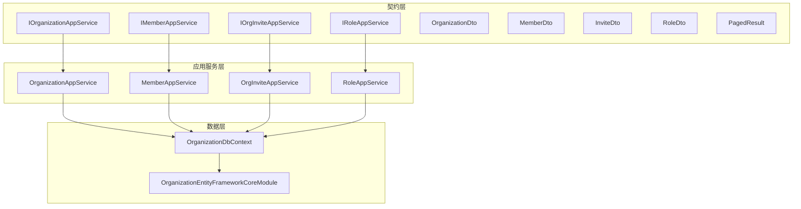
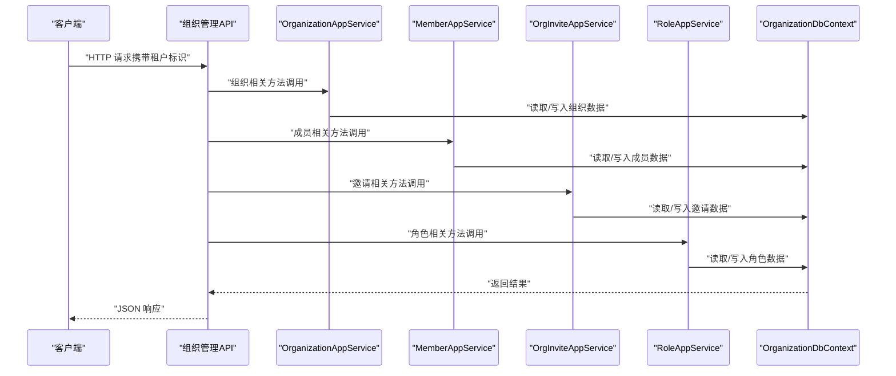
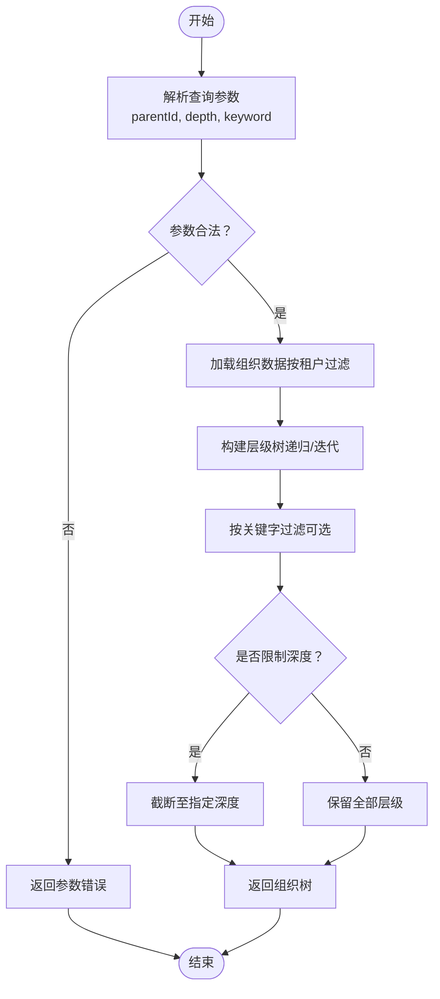
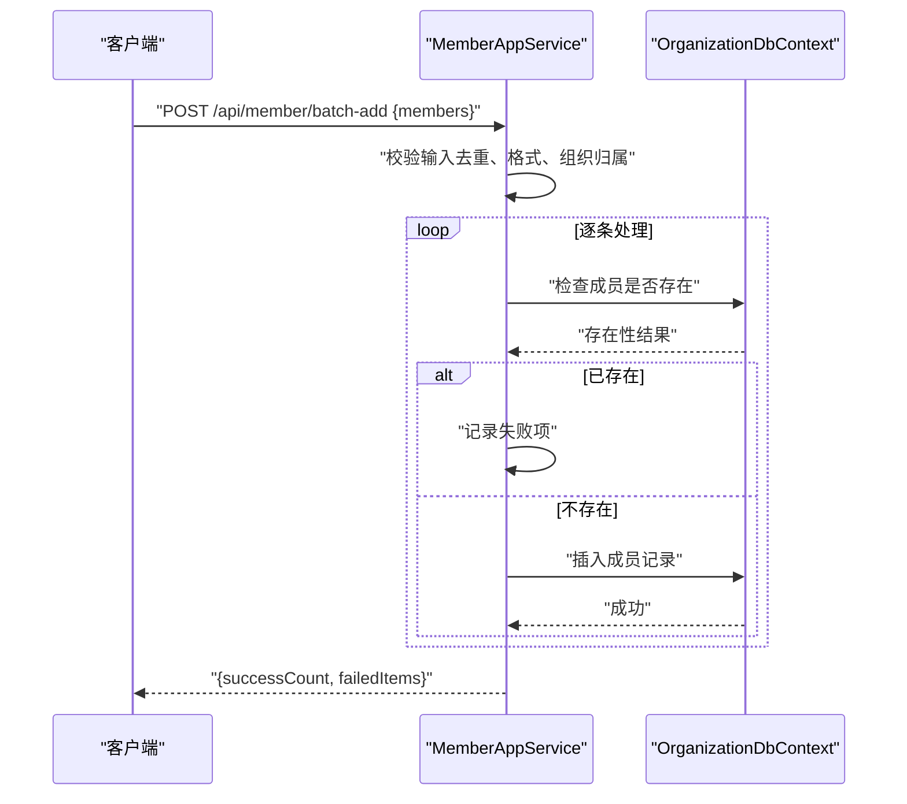
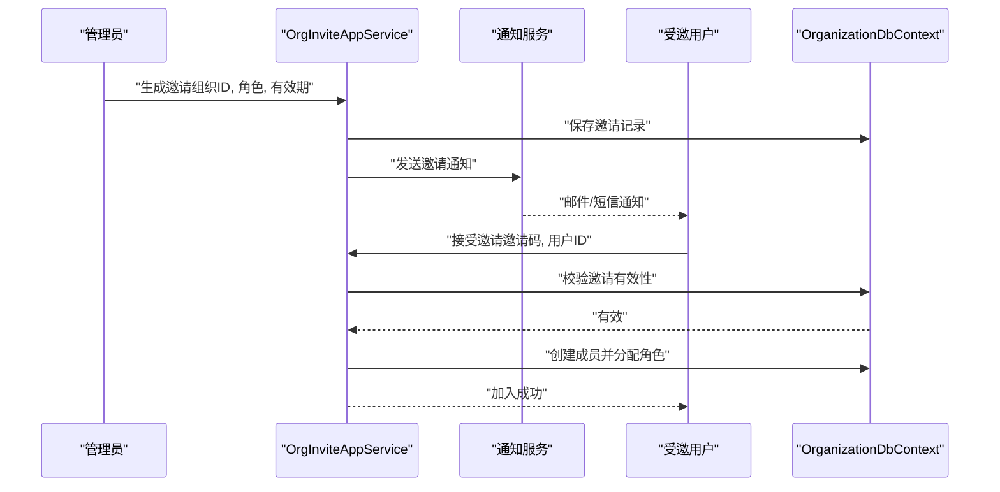
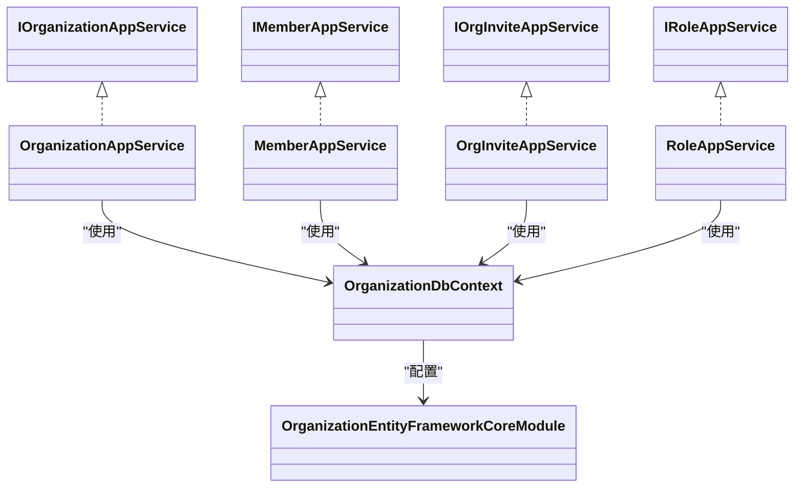

# 组织管理API

<cite>
**本文引用的文件**   
- [OrganizationApplicationModule.cs](file://src/Services/Organization/H.Organization.Application/OrganizationApplicationModule.cs)
- [OrganizationApplicationContractsModule.cs](file://src/Services/Organization/H.Organization.Application.Contracts/OrganizationApplicationContractsModule.cs)
- [OrganizationAppService.cs](file://src/Services/Organization/H.Organization.Application.Services/OrganizationAppService.cs)
- [MemberAppService.cs](file://src/Services/Organization/H.Organization.Application.Services/MemberAppService.cs)
- [OrgInviteAppService.cs](file://src/Services/Organization/H.Organization.Application.Services/OrgInviteAppService.cs)
- [RoleAppService.cs](file://src/Services/Organization/H.Organization.Application.Services/RoleAppService.cs)
- [IOrganizationAppService.cs](file://src/Services/Organization/H.Organization.Application.Contracts/Interfaces/IOrganizationAppService.cs)
- [IMemberAppService.cs](file://src/Services/Organization/H.Organization.Application.Contracts/Interfaces/IMemberAppService.cs)
- [IOrgInviteAppService.cs](file://src/Services/Organization/H.Organization.Application.Contracts/Interfaces/IOrgInviteAppService.cs)
- [IRoleAppService.cs](file://src/Services/Organization/H.Organization.Application.Contracts/Interfaces/IRoleAppService.cs)
- [OrganizationDto.cs](file://src/Services/Organization/H.Organization.Application.Contracts/Dtos/OrganizationDto.cs)
- [MemberDto.cs](file://src/Services/Organization/H.Organization.Application.Contracts/Dtos/MemberDto.cs)
- [InviteDto.cs](file://src/Services/Organization/H.Organization.Application.Contracts/Dtos/InviteDto.cs)
- [RoleDto.cs](file://src/Services/Organization/H.Organization.Application.Contracts/Dtos/RoleDto.cs)
- [PagedResult.cs](file://src/Services/Organization/H.Organization.Application.Contracts/Dtos/PagedResult.cs)
- [OrganizationDbContext.cs](file://src/Services/Organization/H.Organization.EntityFrameworkCore/OrganizationDbContext.cs)
- [OrganizationEntityFrameworkCoreModule.cs](file://src/Services/Organization/H.Organization.EntityFrameworkCore/OrganizationEntityFrameworkCoreModule.cs)
</cite>

## 目录
1. [简介](#简介)
2. [项目结构](#项目结构)
3. [核心组件](#核心组件)
4. [架构总览](#架构总览)
5. [详细组件分析](#详细组件分析)
6. [依赖关系分析](#依赖关系分析)
7. [性能考虑](#性能考虑)
8. [故障排查指南](#故障排查指南)
9. [结论](#结论)
10. [附录](#附录)

## 简介
本文件为“组织管理服务”的API文档，覆盖组织架构、部门、成员、角色等核心能力，重点说明组织邀请与加入流程、权限继承机制、组织结构树查询、批量操作、数据导入导出以及多租户环境下的组织隔离与访问控制。文档面向开发者与集成方，提供接口规范、请求响应示例与错误处理建议，帮助快速对接并稳定使用。

## 项目结构
组织管理模块采用分层架构：应用契约层（DTO与接口）、应用服务层（业务编排）、实体框架层（数据持久化）。关键目录与职责如下：
- H.Organization.Application.Contracts：定义对外暴露的服务接口与数据传输对象（DTO），供Web端或客户端调用。
- H.Organization.Application：实现具体应用服务，协调领域逻辑与外部依赖。
- H.Organization.EntityFrameworkCore：数据库上下文与EF Core配置，负责数据存取。

图表来源
- [OrganizationApplicationContractsModule.cs:1-10](file://src/Services/Organization/H.Organization.Application.Contracts/OrganizationApplicationContractsModule.cs#L1-L10)
- [OrganizationApplicationModule.cs:1-17](file://src/Services/Organization/H.Organization.Application/OrganizationApplicationModule.cs#L1-L17)
- [OrganizationDbContext.cs](file://src/Services/Organization/H.Organization.EntityFrameworkCore/OrganizationDbContext.cs)
- [OrganizationEntityFrameworkCoreModule.cs](file://src/Services/Organization/H.Organization.EntityFrameworkCore/OrganizationEntityFrameworkCoreModule.cs)

章节来源
- [OrganizationApplicationModule.cs:1-17](file://src/Services/Organization/H.Organization.Application/OrganizationApplicationModule.cs#L1-L17)
- [OrganizationApplicationContractsModule.cs:1-10](file://src/Services/Organization/H.Organization.Application.Contracts/OrganizationApplicationContractsModule.cs#L1-L10)

## 核心组件
- 组织服务（Organization）：负责组织的创建、更新、删除、层级树查询、分页列表等。
- 成员服务（Member）：负责成员的添加、移除、角色分配、成员信息查询与分页。
- 邀请服务（Invite）：负责邀请码生成、邀请发送、邀请状态管理与加入流程。
- 角色服务（Role）：负责角色的CRUD、权限点管理、角色与成员关联。

章节来源
- [IOrganizationAppService.cs](file://src/Services/Organization/H.Organization.Application.Contracts/Interfaces/IOrganizationAppService.cs)
- [IMemberAppService.cs](file://src/Services/Organization/H.Organization.Application.Contracts/Interfaces/IMemberAppService.cs)
- [IOrgInviteAppService.cs](file://src/Services/Organization/H.Organization.Application.Contracts/Interfaces/IOrgInviteAppService.cs)
- [IRoleAppService.cs](file://src/Services/Organization/H.Organization.Application.Contracts/Interfaces/IRoleAppService.cs)

## 架构总览
下图展示从客户端到应用服务再到数据层的典型调用路径，体现多租户上下文在请求进入时注入并在服务中使用的整体流程。

图表来源
- [OrganizationAppService.cs](file://src/Services/Organization/H.Organization.Application.Services/OrganizationAppService.cs)
- [MemberAppService.cs](file://src/Services/Organization/H.Organization.Application.Services/MemberAppService.cs)
- [OrgInviteAppService.cs](file://src/Services/Organization/H.Organization.Application.Services/OrgInviteAppService.cs)
- [RoleAppService.cs](file://src/Services/Organization/H.Organization.Application.Services/RoleAppService.cs)
- [OrganizationDbContext.cs](file://src/Services/Organization/H.Organization.EntityFrameworkCore/OrganizationDbContext.cs)

## 详细组件分析

### 组织服务（Organization）
- 功能范围
  - 组织创建、更新、删除
  - 组织树查询（支持按父级过滤、深度限制）
  - 组织分页列表（支持关键字搜索、排序）
  - 组织详情获取
- 典型接口
  - 创建组织：POST /api/organization/create
  - 更新组织：PUT /api/organization/update
  - 删除组织：DELETE /api/organization/delete
  - 组织树：GET /api/organization/tree?parentId=...&depth=...
  - 分页列表：GET /api/organization/list?page=...&pageSize=...&keyword=...
  - 详情：GET /api/organization/detail?id=...
- 请求参数与响应
  - 创建/更新：包含名称、编码、上级组织ID、描述、排序号等字段
  - 树查询：返回节点集合，每个节点含ID、名称、父ID、子节点集合
  - 分页：返回PagedResult<T>，包含数据集合、总数、页码、每页大小
- 权限与多租户
  - 所有操作需具备组织管理权限；默认仅允许当前租户内操作
  - 树查询与列表自动按租户隔离过滤
- 错误处理
  - 重复编码：返回冲突错误
  - 非法父级：返回参数校验错误
  - 无权限：返回未授权错误

章节来源
- [IOrganizationAppService.cs](file://src/Services/Organization/H.Organization.Application.Contracts/Interfaces/IOrganizationAppService.cs)
- [OrganizationDto.cs](file://src/Services/Organization/H.Organization.Application.Contracts/Dtos/OrganizationDto.cs)
- [PagedResult.cs](file://src/Services/Organization/H.Organization.Application.Contracts/Dtos/PagedResult.cs)

#### 组织树查询流程图

图表来源
- [OrganizationAppService.cs](file://src/Services/Organization/H.Organization.Application.Services/OrganizationAppService.cs)

### 成员服务（Member）
- 功能范围
  - 成员添加、移除、角色分配
  - 成员信息查询与分页
  - 批量操作（批量添加、批量移除、批量赋权）
- 典型接口
  - 添加成员：POST /api/member/add
  - 移除成员：POST /api/member/remove
  - 分配角色：POST /api/member/assign-role
  - 成员列表：GET /api/member/list?page=...&pageSize=...&orgId=...
  - 批量添加：POST /api/member/batch-add
  - 批量移除：POST /api/member/batch-remove
- 请求参数与响应
  - 添加/移除：包含成员标识、组织ID、角色ID集合
  - 列表：返回PagedResult<MemberDto>，支持按组织、关键字筛选
  - 批量：返回成功计数与失败明细
- 权限与多租户
  - 成员操作需在所属组织上下文中执行，跨组织访问将被拒绝
  - 角色分配遵循最小权限原则，避免越权
- 错误处理
  - 成员已存在/不存在：返回相应错误
  - 角色无效：返回参数校验错误
  - 批量部分失败：返回失败项清单

章节来源
- [IMemberAppService.cs](file://src/Services/Organization/H.Organization.Application.Contracts/Interfaces/IMemberAppService.cs)
- [MemberDto.cs](file://src/Services/Organization/H.Organization.Application.Contracts/Dtos/MemberDto.cs)
- [PagedResult.cs](file://src/Services/Organization/H.Organization.Application.Contracts/Dtos/PagedResult.cs)

#### 成员批量添加序列图

图表来源
- [MemberAppService.cs](file://src/Services/Organization/H.Organization.Application.Services/MemberAppService.cs)
- [OrganizationDbContext.cs](file://src/Services/Organization/H.Organization.EntityFrameworkCore/OrganizationDbContext.cs)

### 邀请服务（Invite）
- 功能范围
  - 生成邀请码、发送邀请通知、查看邀请状态、接受邀请加入组织
- 典型接口
  - 生成邀请：POST /api/invite/generate
  - 发送邀请：POST /api/invite/send
  - 查询邀请：GET /api/invite/status?code=...
  - 接受邀请：POST /api/invite/accept
- 请求参数与响应
  - 生成：包含组织ID、有效期、角色ID、备注
  - 发送：包含接收人信息（邮箱/手机号）、模板变量
  - 接受：包含邀请码、用户标识
- 权限与多租户
  - 邀请生成与发送需具备组织管理员权限
  - 接受邀请后，成员自动获得对应角色与权限
- 错误处理
  - 邀请码过期/无效：返回参数错误
  - 重复接受：返回业务错误
  - 发送失败：返回通知服务错误

章节来源
- [IOrgInviteAppService.cs](file://src/Services/Organization/H.Organization.Application.Contracts/Interfaces/IOrgInviteAppService.cs)
- [InviteDto.cs](file://src/Services/Organization/H.Organization.Application.Contracts/Dtos/InviteDto.cs)

#### 邀请加入流程序列图

图表来源
- [OrgInviteAppService.cs](file://src/Services/Organization/H.Organization.Application.Services/OrgInviteAppService.cs)
- [OrganizationDbContext.cs](file://src/Services/Organization/H.Organization.EntityFrameworkCore/OrganizationDbContext.cs)

### 角色服务（Role）
- 功能范围
  - 角色CRUD、权限点管理、角色与成员关联
- 典型接口
  - 创建角色：POST /api/role/create
  - 更新角色：PUT /api/role/update
  - 删除角色：DELETE /api/role/delete
  - 分配权限：POST /api/role/assign-permissions
  - 成员角色列表：GET /api/role/members?roleId=...
- 请求参数与响应
  - 创建/更新：包含名称、编码、描述、权限点集合
  - 分配权限：包含角色ID与权限点列表
  - 成员列表：返回PagedResult<RoleMemberDto>
- 权限与多租户
  - 角色管理仅限组织管理员
  - 权限点按组织维度隔离
- 错误处理
  - 编码重复：返回冲突错误
  - 权限点无效：返回参数校验错误

章节来源
- [IRoleAppService.cs](file://src/Services/Organization/H.Organization.Application.Contracts/Interfaces/IRoleAppService.cs)
- [RoleDto.cs](file://src/Services/Organization/H.Organization.Application.Contracts/Dtos/RoleDto.cs)
- [PagedResult.cs](file://src/Services/Organization/H.Organization.Application.Contracts/Dtos/PagedResult.cs)

### 数据结构与模型
- OrganizationDto：组织基本信息（ID、名称、编码、父ID、描述、排序等）
- MemberDto：成员基本信息（ID、姓名、联系方式、角色集合、加入时间等）
- InviteDto：邀请信息（邀请码、组织ID、角色ID、有效期、状态等）
- RoleDto：角色信息（ID、名称、编码、权限点集合、描述等）
- PagedResult<T>：通用分页结果（数据集合、总数、页码、每页大小）

章节来源
- [OrganizationDto.cs](file://src/Services/Organization/H.Organization.Application.Contracts/Dtos/OrganizationDto.cs)
- [MemberDto.cs](file://src/Services/Organization/H.Organization.Application.Contracts/Dtos/MemberDto.cs)
- [InviteDto.cs](file://src/Services/Organization/H.Organization.Application.Contracts/Dtos/InviteDto.cs)
- [RoleDto.cs](file://src/Services/Organization/H.Organization.Application.Contracts/Dtos/RoleDto.cs)
- [PagedResult.cs](file://src/Services/Organization/H.Organization.Application.Contracts/Dtos/PagedResult.cs)

## 依赖关系分析
- 应用契约层与应用服务层通过接口解耦，便于替换实现与测试。
- 应用服务层依赖数据上下文进行数据读写，EF Core模块负责连接与迁移。
- 多租户上下文由宿主层注入，确保各服务在同一租户范围内操作。

图表来源
- [IOrganizationAppService.cs](file://src/Services/Organization/H.Organization.Application.Contracts/Interfaces/IOrganizationAppService.cs)
- [OrganizationAppService.cs](file://src/Services/Organization/H.Organization.Application.Services/OrganizationAppService.cs)
- [IMemberAppService.cs](file://src/Services/Organization/H.Organization.Application.Contracts/Interfaces/IMemberAppService.cs)
- [MemberAppService.cs](file://src/Services/Organization/H.Organization.Application.Services/MemberAppService.cs)
- [IOrgInviteAppService.cs](file://src/Services/Organization/H.Organization.Application.Contracts/Interfaces/IOrgInviteAppService.cs)
- [OrgInviteAppService.cs](file://src/Services/Organization/H.Organization.Application.Services/OrgInviteAppService.cs)
- [IRoleAppService.cs](file://src/Services/Organization/H.Organization.Application.Contracts/Interfaces/IRoleAppService.cs)
- [RoleAppService.cs](file://src/Services/Organization/H.Organization.Application.Services/RoleAppService.cs)
- [OrganizationDbContext.cs](file://src/Services/Organization/H.Organization.EntityFrameworkCore/OrganizationDbContext.cs)
- [OrganizationEntityFrameworkCoreModule.cs](file://src/Services/Organization/H.Organization.EntityFrameworkCore/OrganizationEntityFrameworkCoreModule.cs)

## 性能考虑
- 分页查询：优先使用分页接口，避免一次性拉取大量数据。
- 树查询优化：对深层树结构建议使用增量加载或缓存热点节点。
- 批量操作：服务端应支持事务与幂等，减少网络往返与锁竞争。
- 索引设计：对常用查询字段（如组织ID、成员ID、邀请码）建立索引以提升检索性能。
- 并发控制：对敏感操作（如角色分配、邀请接受）增加乐观锁或分布式锁，防止竞态条件。

## 故障排查指南
- 常见错误
  - 未授权：检查当前用户是否具备所需角色与权限点。
  - 参数校验失败：核对必填字段、格式与取值范围。
  - 数据冲突：如编码重复、成员已存在等，需调整输入或清理数据。
  - 多租户隔离：确认请求头或会话中包含正确的租户标识。
- 日志定位
  - 关注应用服务层的异常堆栈与业务日志。
  - 数据库层日志用于定位慢查询与约束冲突。
- 恢复建议
  - 重试策略：对网络抖动与临时性错误实施指数退避重试。
  - 补偿机制：对部分失败的批量操作提供回滚或补偿接口。

## 结论
组织管理API以清晰的层次结构与完善的接口设计，支撑了组织、成员、角色与邀请的全生命周期管理。通过多租户隔离与权限控制，保障数据安全与访问合规。结合分页、批量与树查询等高级能力，满足复杂企业场景需求。建议在集成时严格遵循接口规范与错误处理建议，确保系统稳定性与可维护性。

## 附录
- 多租户隔离要点
  - 所有数据访问均按租户ID过滤，避免跨租户数据泄露。
  - 权限判断基于角色与权限点，结合组织上下文生效。
- 数据导入导出建议
  - 导入：提供CSV/Excel模板，服务端进行数据校验与转换。
  - 导出：支持按条件筛选与分页导出，避免大文件阻塞。
- 安全最佳实践
  - 传输层启用HTTPS，敏感参数加密传输。
  - 接口鉴权使用JWT或会话令牌，定期刷新与吊销。
  - 审计日志记录关键操作，便于追溯与合规审查。