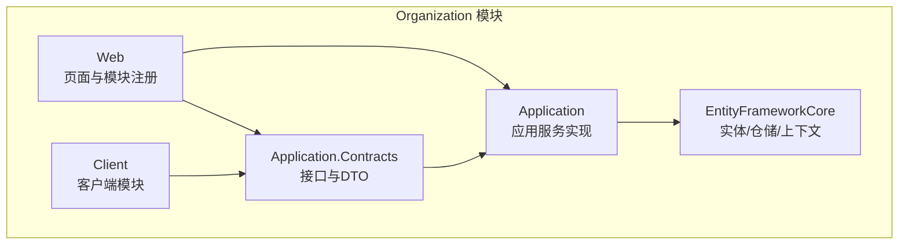
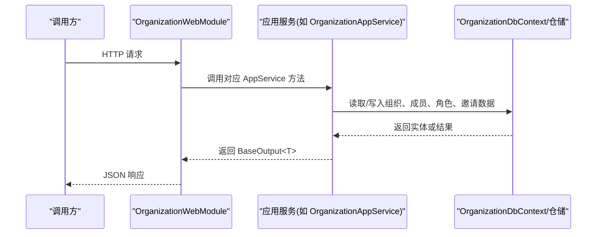
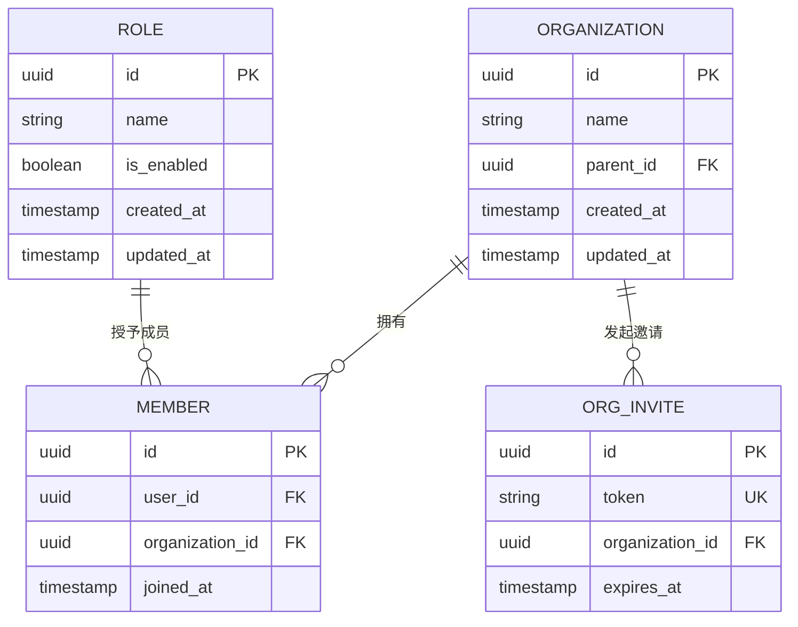
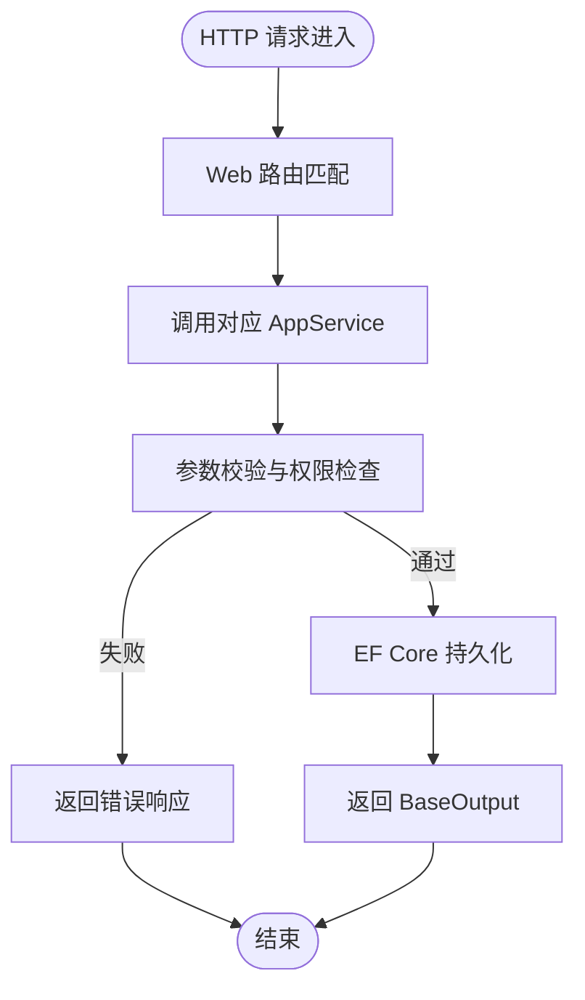

# 组织管理API

<cite>
**本文引用的文件**   
- [IOrganizationAppService.cs](file://src/Services/Organization/H.Organization.Application.Contracts/Interfaces/IOrganizationAppService.cs)
- [IMemberAppService.cs](file://src/Services/Organization/H.Organization.Application.Contracts/Interfaces/IMemberAppService.cs)
- [IRoleAppService.cs](file://src/Services/Organization/H.Organization.Application.Contracts/Interfaces/IRoleAppService.cs)
- [IOrgInviteAppService.cs](file://src/Services/Organization/H.Organization.Application.Contracts/Interfaces/IOrgInviteAppService.cs)
- [OrganizationAppService.cs](file://src/Services/Organization/H.Organization.Application/Services/OrganizationAppService.cs)
- [MemberAppService.cs](file://src/Services/Organization/H.Organization.Application/Services/MemberAppService.cs)
- [RoleAppService.cs](file://src/Services/Organization/H.Organization.Application/Services/RoleAppService.cs)
- [OrgInviteAppService.cs](file://src/Services/Organization/H.Organization.Application/Services/OrgInviteAppService.cs)
- [OrganizationEntity.cs](file://src/Services/Organization/H.Organization.EntityFrameworkCore/Entities/OrganizationEntity.cs)
- [MemberEntity.cs](file://src/Services/Organization/H.Organization.EntityFrameworkCore/Entities/MemberEntity.cs)
- [RoleEntity.cs](file://src/Services/Organization/H.Organization.EntityFrameworkCore/Entities/RoleEntity.cs)
- [OrgInviteEntity.cs](file://src/Services/Organization/H.Organization.EntityFrameworkCore/Entities/OrgInviteEntity.cs)
- [OrganizationDbContext.cs](file://src/Services/Organization/H.Organization.EntityFrameworkCore/OrganizationDbContext.cs)
- [OrganizationApplicationModule.cs](file://src/Services/Organization/H.Organization.Application/OrganizationApplicationModule.cs)
- [OrganizationWebModule.cs](file://src/Services/Organization/H.Organization.Web/OrganizationWebModule.cs)
- [H.AppLab.Web.Host.Client/Routes.razor](file://src/Host/H.AppLab.Web.Host/H.AppLab.Web.Host.Client/Routes.razor)
- [README.md](file://src/Services/Organization/README.md)
</cite>

## 目录
1. [引言](#引言)
2. [项目结构](#项目结构)
3. [核心组件](#核心组件)
4. [架构总览](#架构总览)
5. [详细接口文档](#详细接口文档)
6. [依赖与数据流分析](#依赖与数据流分析)
7. [权限控制与数据隔离](#权限控制与数据隔离)
8. [性能考虑](#性能考虑)
9. [故障排查指南](#故障排查指南)
10. [结论](#结论)

## 引言
本文件为 H.AppLab 平台的“组织管理服务”提供 API 文档。该服务以 ABP 模块化方式实现，对外暴露组织、成员、角色与邀请等能力，用于支撑企业级组织架构管理与人员管理场景。文档重点覆盖：
- 部门创建、层级关系维护与树形结构操作
- 员工信息 CRUD、部门人员分配与状态管理
- 角色与成员关联
- 邀请入组织流程
- 调用示例、常见使用场景与注意事项

## 项目结构
组织管理服务位于 Services/Organization 模块下，采用典型分层：
- Application.Contracts：对外暴露的接口与 DTO
- Application：应用服务实现（业务编排）
- EntityFrameworkCore：实体、仓储与数据库上下文
- Web：页面与模块注册（Blazor 前端页面与后端模块）
- Client：客户端模块（供宿主或其他服务引用）

```mermaid
graph TB
    subgraph "Organization 模块"
        Contracts["Application.Contracts<br/>接口与DTO"]
        App["Application<br/>应用服务实现"]
        EF["EntityFrameworkCore<br/>实体/仓储/上下文"]
        Web["Web<br/>页面与模块注册"]
        Client["Client<br/>客户端模块"]
    end

    Contracts --> App
    App --> EF
    Web --> App
    Web --> Contracts
    Client --> Contracts
```

图表来源
- [OrganizationApplicationModule.cs](file://src/Services/Organization/H.Organization.Application/OrganizationApplicationModule.cs)
- [OrganizationWebModule.cs](file://src/Services/Organization/H.Organization.Web/OrganizationWebModule.cs)

章节来源
- [README.md](file://src/Services/Organization/README.md)

## 核心组件
- IOrganizationAppService：部门树查询、分页列表、详情、增删改查、批量删除、部门用户集合获取
- IMemberAppService：成员分页与详情、新增与批量新增、可分配用户搜索、角色分配与查询、更新与删除、按部门获取成员、存在性检查
- IRoleAppService：角色分页与详情、增删改、批量删除、启用角色列表、角色成员查询
- IOrgInviteAppService：创建邀请、获取邀请信息、接受邀请

章节来源
- [IOrganizationAppService.cs:1-53](file://src/Services/Organization/H.Organization.Application.Contracts/Interfaces/IOrganizationAppService.cs#L1-L53)
- [IMemberAppService.cs:1-70](file://src/Services/Organization/H.Organization.Application.Contracts/Interfaces/IMemberAppService.cs#L1-L70)
- [IRoleAppService.cs:1-50](file://src/Services/Organization/H.Organization.Application.Contracts/Interfaces/IRoleAppService.cs#L1-L50)
- [IOrgInviteAppService.cs:1-25](file://src/Services/Organization/H.Organization.Application.Contracts/Interfaces/IOrgInviteAppService.cs#L1-L25)

## 架构总览
组织管理服务通过 ABP 的 IAppService 暴露 RESTful 风格方法，由 Web 模块注册路由，最终访问 EntityFrameworkCore 层持久化数据。

```mermaid
sequenceDiagram
    participant Client as "调用方"
    participant Web as "OrganizationWebModule"
    participant App as "应用服务(如 OrganizationAppService)"
    participant DB as "OrganizationDbContext/仓储"

    Client->>Web: HTTP 请求
    Web->>App: 调用对应 AppService 方法
    App->>DB: 读取/写入组织、成员、角色、邀请数据
    DB-->>App: 返回实体或结果
    App-->>Web: 返回 BaseOutput<T>
    Web-->>Client: JSON 响应
```

图表来源
- [OrganizationWebModule.cs](file://src/Services/Organization/H.Organization.Web/OrganizationWebModule.cs)
- [OrganizationDbContext.cs](file://src/Services/Organization/H.Organization.EntityFrameworkCore/OrganizationDbContext.cs)

## 详细接口文档

### 通用约定
- 所有接口均继承自 IAppService，默认遵循 ABP 远程服务约定
- 统一返回类型为 BaseOutput<T>，包含成功/失败状态与数据体
- 分页相关返回使用 PagedResult<T>

### 部门管理接口（IOrganizationAppService）
- 获取部门树
  - 方法签名：GetAllAsTreeAsync()
  - 用途：获取全量部门树形结构
  - 参数：无
  - 返回：BaseOutput<List<OrganizationTreeDto>>
- 获取部门分页列表
  - 方法签名：GetListAsync(queryParams)
  - 用途：根据条件分页查询部门
  - 参数：OrganizationQueryParams
  - 返回：BaseOutput<PagedResult<OrganizationDto>>
- 获取部门详情
  - 方法签名：GetByIdAsync(id)
  - 参数：Guid id
  - 返回：BaseOutput<OrganizationDto>
- 创建部门
  - 方法签名：CreateAsync(input)
  - 参数：CreateOrganizationDto
  - 返回：BaseOutput<OrganizationDto>
- 更新部门
  - 方法签名：UpdateAsync(id, input)
  - 参数：Guid id, UpdateOrganizationDto
  - 返回：BaseOutput<OrganizationDto>
- 删除部门
  - 方法签名：DeleteAsync(id)
  - 参数：Guid id
  - 返回：BaseOutput
- 批量删除部门
  - 方法签名：BatchDeleteAsync(ids)
  - 参数：List<Guid> ids
  - 返回：BaseOutput
- 获取部门用户集合
  - 方法签名：GetOrganizationUserIdsAsync(organizationId, includeChildren = true)
  - 用途：获取指定部门及其子部门的用户ID集合
  - 参数：Guid organizationId, bool includeChildren
  - 返回：BaseOutput<List<Guid>>

调用示例
- 获取部门树：调用 GetAllAsTreeAsync 并解析返回的 BaseOutput<List<OrganizationTreeDto>>
- 分页查询部门：构造 OrganizationQueryParams，调用 GetListAsync，处理 PagedResult<OrganizationDto>
- 创建部门：构造 CreateOrganizationDto，调用 CreateAsync，校验返回的 OrganizationDto

章节来源
- [IOrganizationAppService.cs:1-53](file://src/Services/Organization/H.Organization.Application.Contracts/Interfaces/IOrganizationAppService.cs#L1-L53)

### 成员管理接口（IMemberAppService）
- 获取成员分页列表
  - 方法签名：GetListAsync(queryParams)
  - 参数：MemberQueryParams
  - 返回：BaseOutput<PagedResult<MemberDto>>
- 获取成员详情
  - 方法签名：GetByIdAsync(id)
  - 参数：Guid id
  - 返回：BaseOutput<MemberDto>
- 添加成员
  - 方法签名：AddAsync(input)
  - 说明：从 Account 服务获取用户信息后建立成员关系
  - 参数：AddMemberDto
  - 返回：BaseOutput<MemberDto>
- 批量添加成员
  - 方法签名：AddBatchAsync(input)
  - 说明：一个用户可关联多个部门
  - 参数：AddMemberBatchDto
  - 返回：BaseOutput<List<MemberDto>>
- 搜索可分配用户
  - 方法签名：SearchAssignableUsersAsync(keyword)
  - 用途：用于成员选择器
  - 参数：string? keyword
  - 返回：BaseOutput<List<AssignableUserDto>>
- 为成员分配角色
  - 方法签名：AssignRolesAsync(memberId, input)
  - 说明：全量重建成员的已授角色集合
  - 参数：Guid memberId, AssignMemberRolesDto
  - 返回：BaseOutput
- 获取成员已授角色ID列表
  - 方法签名：GetMemberRoleIdsAsync(memberId)
  - 参数：Guid memberId
  - 返回：BaseOutput<List<Guid>>
- 更新成员
  - 方法签名：UpdateAsync(id, input)
  - 参数：Guid id, UpdateMemberDto
  - 返回：BaseOutput<MemberDto>
- 删除成员
  - 方法签名：DeleteAsync(id)
  - 参数：Guid id
  - 返回：BaseOutput
- 批量删除成员
  - 方法签名：BatchDeleteAsync(ids)
  - 参数：List<Guid> ids
  - 返回：BaseOutput
- 获取部门下所有成员
  - 方法签名：GetMembersByOrganizationIdAsync(organizationId)
  - 参数：Guid organizationId
  - 返回：BaseOutput<List<MemberDto>>
- 检查用户是否已是部门成员
  - 方法签名：ExistsAsync(organizationId, userId)
  - 参数：Guid organizationId, Guid userId
  - 返回：BaseOutput<bool>

调用示例
- 批量添加成员：构造 AddMemberBatchDto，调用 AddBatchAsync，根据返回的成员列表进行后续操作
- 分配角色：调用 AssignRolesAsync 后，可通过 GetMemberRoleIdsAsync 校验结果

章节来源
- [IMemberAppService.cs:1-70](file://src/Services/Organization/H.Organization.Application.Contracts/Interfaces/IMemberAppService.cs#L1-L70)

### 角色管理接口（IRoleAppService）
- 获取角色分页列表
  - 方法签名：GetListAsync(queryParams)
  - 参数：RoleQueryParams
  - 返回：BaseOutput<PagedResult<RoleDto>>
- 获取角色详情
  - 方法签名：GetByIdAsync(id)
  - 参数：Guid id
  - 返回：BaseOutput<RoleDto>
- 创建角色
  - 方法签名：CreateAsync(input)
  - 参数：CreateRoleDto
  - 返回：BaseOutput<RoleDto>
- 更新角色
  - 方法签名：UpdateAsync(id, input)
  - 参数：Guid id, UpdateRoleDto
  - 返回：BaseOutput<RoleDto>
- 删除角色
  - 方法签名：DeleteAsync(id)
  - 参数：Guid id
  - 返回：BaseOutput
- 批量删除角色
  - 方法签名：BatchDeleteAsync(ids)
  - 参数：List<Guid> ids
  - 返回：BaseOutput
- 获取所有启用的角色
  - 方法签名：GetAllEnabledAsync()
  - 返回：BaseOutput<List<RoleDto>>
- 获取角色已分配成员
  - 方法签名：GetRoleMembersAsync(roleId)
  - 参数：Guid roleId
  - 返回：BaseOutput<List<RoleMemberDto>>

调用示例
- 启用角色列表：调用 GetAllEnabledAsync，用于前端下拉选择可用角色
- 查看角色成员：调用 GetRoleMembersAsync，用于展示某角色的成员清单

章节来源
- [IRoleAppService.cs:1-50](file://src/Services/Organization/H.Organization.Application.Contracts/Interfaces/IRoleAppService.cs#L1-L50)

### 邀请入组织接口（IOrgInviteAppService）
- 创建邀请
  - 方法签名：CreateInviteAsync(input)
  - 说明：生成令牌；若填写手机号则发送短信邀请链接
  - 参数：CreateInviteDto
  - 返回：BaseOutput<InviteDto>
- 获取邀请信息
  - 方法签名：GetInviteInfoAsync(token)
  - 说明：用于确认加入页，校验令牌有效性
  - 参数：string token
  - 返回：BaseOutput<InviteInfoDto>
- 接受邀请
  - 方法签名：AcceptInviteAsync(token)
  - 说明：当前登录用户加入组织，消费令牌
  - 参数：string token
  - 返回：BaseOutput

调用示例
- 邀请加入：先调用 CreateInviteAsync 获取 InviteDto，再通过 GetInviteInfoAsync 校验，最后 AcceptInviteAsync 完成加入

章节来源
- [IOrgInviteAppService.cs:1-25](file://src/Services/Organization/H.Organization.Application.Contracts/Interfaces/IOrgInviteAppService.cs#L1-L25)

### 数据模型概览

```mermaid
erDiagram
  ORGANIZATION {
    uuid id PK
    string name
    uuid parent_id FK
    timestamp created_at
    timestamp updated_at
  }

  MEMBER {
    uuid id PK
    uuid user_id FK
    uuid organization_id FK
    timestamp joined_at
  }

  ROLE {
    uuid id PK
    string name
    boolean is_enabled
    timestamp created_at
    timestamp updated_at
  }

  ORG_INVITE {
    uuid id PK
    string token UK
    uuid organization_id FK
    timestamp expires_at
  }

  ORGANIZATION ||--o{ MEMBER : "拥有"
  ORGANIZATION ||--o{ ORG_INVITE : "发起邀请"
  ROLE ||--o{ MEMBER : "授予成员"
```

图表来源
- [OrganizationEntity.cs](file://src/Services/Organization/H.Organization.EntityFrameworkCore/Entities/OrganizationEntity.cs)
- [MemberEntity.cs](file://src/Services/Organization/H.Organization.EntityFrameworkCore/Entities/MemberEntity.cs)
- [RoleEntity.cs](file://src/Services/Organization/H.Organization.EntityFrameworkCore/Entities/RoleEntity.cs)
- [OrgInviteEntity.cs](file://src/Services/Organization/H.Organization.EntityFrameworkCore/Entities/OrgInviteEntity.cs)

## 依赖与数据流分析
- 应用服务依赖实体与上下文进行数据读写
- Web 模块负责将接口暴露为远程服务，供前端与外部系统调用
- 宿主侧可能通过 Routes.razor 配置路由或导航

```mermaid
flowchart TD
    Start(["HTTP 请求进入"]) --> Route["Web 路由匹配"]
    Route --> Service["调用对应 AppService"]
    Service --> Validate["参数校验与权限检查"]
    Validate -->|通过| Persist["EF Core 持久化"]
    Validate -->|失败| Error["返回错误响应"]
    Persist --> Success["返回 BaseOutput<T>"]
    Error --> End(["结束"])
    Success --> End
```

图表来源
- [OrganizationWebModule.cs](file://src/Services/Organization/H.Organization.Web/OrganizationWebModule.cs)
- [OrganizationDbContext.cs](file://src/Services/Organization/H.Organization.EntityFrameworkCore/OrganizationDbContext.cs)

章节来源
- [H.AppLab.Web.Host.Client/Routes.razor](file://src/Host/H.AppLab.Web.Host/H.AppLab.Web.Host.Client/Routes.razor)

## 权限控制与数据隔离
- 接口层：所有 AppService 继承自 IAppService，ABP 框架默认支持基于策略的授权；可在应用服务方法上附加授权注解或中间件实现细粒度控制
- 数据范围：组织数据通常以租户或组织维度隔离，建议在使用 OrganizationDbContext 时结合租户上下文与组织上下文过滤数据
- 成员与角色：成员-角色分配逻辑在 MemberAppService 中体现，应确保仅在具备相应权限的用户执行分配与变更操作
- 邀请机制：邀请令牌需校验有效期与归属组织，避免跨组织越权访问

注意
- 具体权限策略需在应用服务或中间件中定义，本文档仅给出接入点与原则
- 建议在组织树操作与成员分配场景中增加二次确认与审计日志记录

章节来源
- [IMemberAppService.cs:1-70](file://src/Services/Organization/H.Organization.Application.Contracts/Interfaces/IMemberAppService.cs#L1-L70)
- [IOrgInviteAppService.cs:1-25](file://src/Services/Organization/H.Organization.Application.Contracts/Interfaces/IOrgInviteAppService.cs#L1-L25)

## 性能考虑
- 树形结构：获取组织树应避免深层递归多次查询，建议使用一次性加载与内存构建
- 分页与过滤：成员与角色列表务必使用分页参数，减少单次传输与数据库压力
- 批量操作：批量删除与批量添加成员时应使用事务保证一致性
- 索引优化：对常用查询字段（如 parent_id、user_id、organization_id、token）建立索引以提升检索性能

## 故障排查指南
常见问题与定位思路：
- 返回空数据
  - 检查查询参数是否正确，特别是分页与过滤条件
  - 检查权限与租户上下文是否限制可见范围
- 成员无法加入组织
  - 检查邀请令牌是否有效、未过期且属于目标组织
  - 检查当前登录用户是否已通过身份认证
- 角色分配不生效
  - 检查 AssignRolesAsync 调用是否成功，随后通过 GetMemberRoleIdsAsync 验证
- 部门树异常
  - 检查父级部门是否存在，是否存在循环引用

定位工具与建议：
- 开启 ABP 日志与数据库慢查询日志
- 在关键步骤输出 BaseOutput 的结构，便于快速判断成功/失败分支
- 针对批量操作，拆分测试用例逐步验证

章节来源
- [OrganizationAppService.cs](file://src/Services/Organization/H.Organization.Application/Services/OrganizationAppService.cs)
- [MemberAppService.cs](file://src/Services/Organization/H.Organization.Application/Services/MemberAppService.cs)
- [RoleAppService.cs](file://src/Services/Organization/H.Organization.Application/Services/RoleAppService.cs)
- [OrgInviteAppService.cs](file://src/Services/Organization/H.Organization.Application/Services/OrgInviteAppService.cs)

## 结论
组织管理服务围绕部门、成员、角色与邀请四个核心领域提供了完整的 API 能力，满足企业级组织管理与人员管理的基本需求。开发者可在此基础上扩展更多规则与功能，例如：
- 增强组织树的移动与层级校验
- 完善成员状态的审批工作流
- 引入更丰富的角色-权限映射与数据范围策略
- 扩展邀请渠道与多语言通知