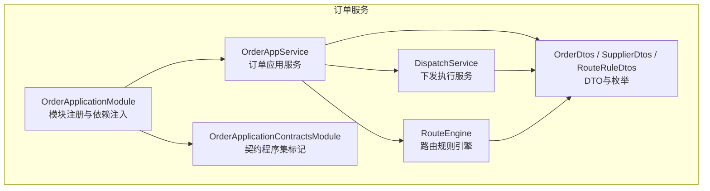
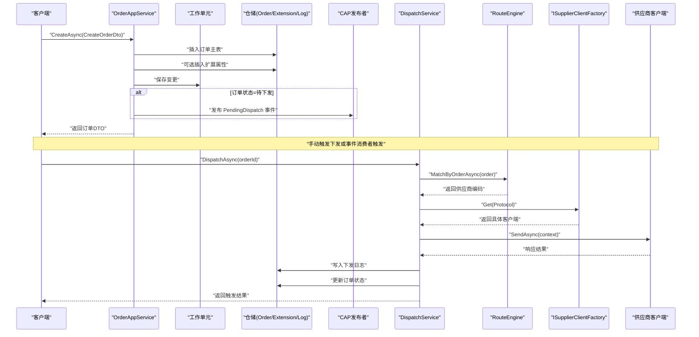
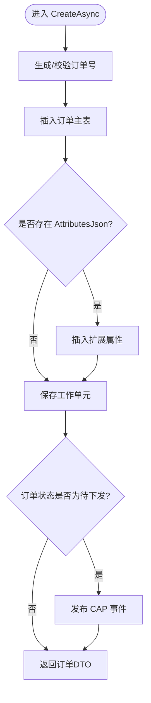
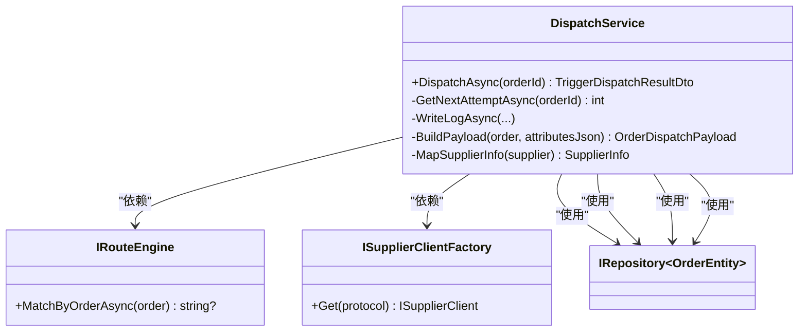
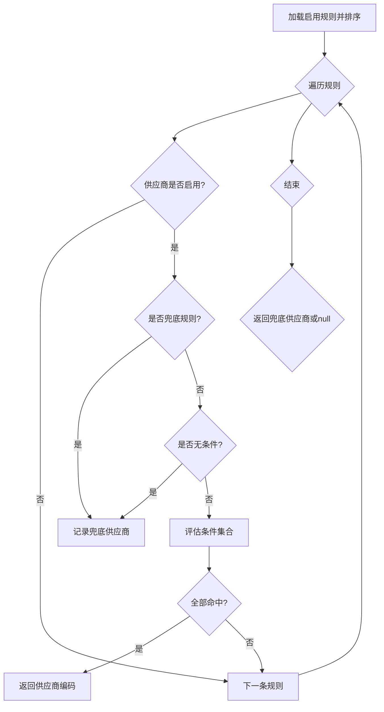
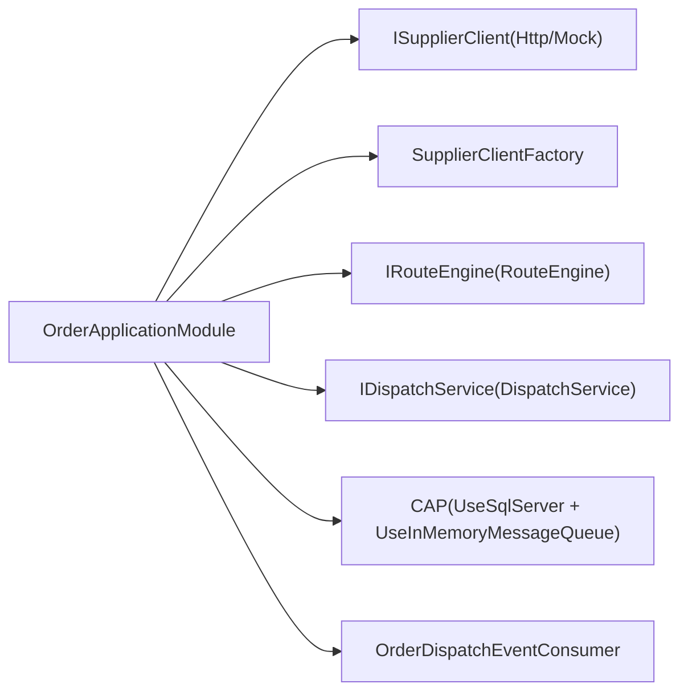

# 订单管理API

<cite>
**本文引用的文件**   
- [OrderApplicationModule.cs](file://src/Services/Order/H.Order.Application/OrderApplicationModule.cs)
- [OrderAppService.cs](file://src/Services/Order/H.Order.Application/Services/OrderAppService.cs)
- [DispatchService.cs](file://src/Services/Order/H.Order.Application/Services/DispatchService.cs)
- [RouteEngine.cs](file://src/Services/Order/H.Order.Application/Services/RouteEngine.cs)
- [OrderDtos.cs](file://src/Services/Order/H.Order.Application.Contracts/Dtos/OrderDtos.cs)
- [DispatchLogDtos.cs](file://src/Services/Order/H.Order.Application.Contracts/Dtos/DispatchLogDtos.cs)
- [SupplierDtos.cs](file://src/Services/Order/H.Order.Application.Contracts/Dtos/SupplierDtos.cs)
- [RouteRuleDtos.cs](file://src/Services/Order/H.Order.Application.Contracts/Dtos/RouteRuleDtos.cs)
- [OrderEnums.cs](file://src/Services/Order/H.Order.Application.Contracts/Enums/OrderEnums.cs)
</cite>

## 目录
1. [简介](#简介)
2. [项目结构](#项目结构)
3. [核心组件](#核心组件)
4. [架构总览](#架构总览)
5. [详细组件分析](#详细组件分析)
6. [依赖关系分析](#依赖关系分析)
7. [性能考虑](#性能考虑)
8. [故障排查指南](#故障排查指南)
9. [结论](#结论)
10. [附录：接口规范与示例](#附录接口规范与示例)

## 简介
本文件为订单管理服务的API文档，覆盖订单创建、查询、详情、状态更新、手动触发下发、供应商管理、路由规则管理等核心能力。系统采用ABP模块化架构，结合CAP实现分布式事务与消息队列集成；通过可插拔的供应商客户端工厂支持HTTP/Mock等协议扩展；路由引擎基于规则条件匹配将订单分发至合适供应商。

## 项目结构
订单服务位于 Services/Order 下，包含应用层（Application）、契约层（Application.Contracts）与数据访问层（EntityFrameworkCore）。关键入口与模块注册在 OrderApplicationModule 中完成，对外暴露的应用服务为 OrderAppService，业务编排由 DispatchService 与 RouteEngine 协同完成。

图表来源
- [OrderApplicationModule.cs:18-48](file://src/Services/Order/H.Order.Application/OrderApplicationModule.cs#L18-L48)
- [OrderAppService.cs:17-39](file://src/Services/Order/H.Order.Application/Services/OrderAppService.cs#L17-L39)
- [DispatchService.cs:16-45](file://src/Services/Order/H.Order.Application/Services/DispatchService.cs#L16-L45)
- [RouteEngine.cs:22-33](file://src/Services/Order/H.Order.Application/Services/RouteEngine.cs#L22-L33)
- [OrderDtos.cs:8-98](file://src/Services/Order/H.Order.Application.Contracts/Dtos/OrderDtos.cs#L8-L98)
- [SupplierDtos.cs:8-39](file://src/Services/Order/H.Order.Application.Contracts/Dtos/SupplierDtos.cs#L8-L39)
- [RouteRuleDtos.cs:8-33](file://src/Services/Order/H.Order.Application.Contracts/Dtos/RouteRuleDtos.cs#L8-L33)
- [OrderApplicationContractsModule.cs:6-9](file://src/Services/Order/H.Order.Application.Contracts/OrderApplicationContractsModule.cs#L6-L9)

章节来源
- [OrderApplicationModule.cs:18-48](file://src/Services/Order/H.Order.Application/OrderApplicationModule.cs#L18-L48)
- [OrderApplicationContractsModule.cs:6-9](file://src/Services/Order/H.Order.Application.Contracts/OrderApplicationContractsModule.cs#L6-L9)

## 核心组件
- 订单应用服务（OrderAppService）：提供订单CRUD、列表分页、详情聚合、手动触发下发、最近下发状态查询、以及待下发事件发布。
- 下发执行服务（DispatchService）：封装“路由匹配→供应商调用→日志记录→状态更新”的完整流程，支持重试次数计算与失败重试时间设置。
- 路由规则引擎（RouteEngine）：按优先级加载启用的规则，对订单属性进行条件评估，返回命中供应商编码或兜底供应商。
- 契约与DTO：定义订单、供应商、路由规则、下发日志等数据结构与枚举，统一对外API输入输出。

章节来源
- [OrderAppService.cs:17-241](file://src/Services/Order/H.Order.Application/Services/OrderAppService.cs#L17-L241)
- [DispatchService.cs:16-220](file://src/Services/Order/H.Order.Application/Services/DispatchService.cs#L16-L220)
- [RouteEngine.cs:22-149](file://src/Services/Order/H.Order.Application/Services/RouteEngine.cs#L22-L149)
- [OrderDtos.cs:8-161](file://src/Services/Order/H.Order.Application.Contracts/Dtos/OrderDtos.cs#L8-L161)
- [DispatchLogDtos.cs:8-96](file://src/Services/Order/H.Order.Application.Contracts/Dtos/DispatchLogDtos.cs#L8-L96)
- [SupplierDtos.cs:8-120](file://src/Services/Order/H.Order.Application.Contracts/Dtos/SupplierDtos.cs#L8-L120)
- [RouteRuleDtos.cs:8-108](file://src/Services/Order/H.Order.Application.Contracts/Dtos/RouteRuleDtos.cs#L8-L108)
- [OrderEnums.cs:6-91](file://src/Services/Order/H.Order.Application.Contracts/Enums/OrderEnums.cs#L6-L91)

## 架构总览
订单服务以ABP模块化组织，应用服务通过仓储访问数据库实体，使用CAP发布/消费事件，借助工厂模式选择供应商客户端协议实现。

图表来源
- [OrderAppService.cs:109-145](file://src/Services/Order/H.Order.Application/Services/OrderAppService.cs#L109-L145)
- [OrderAppService.cs:224-234](file://src/Services/Order/H.Order.Application/Services/OrderAppService.cs#L224-L234)
- [DispatchService.cs:47-162](file://src/Services/Order/H.Order.Application/Services/DispatchService.cs#L47-L162)
- [RouteEngine.cs:35-77](file://src/Services/Order/H.Order.Application/Services/RouteEngine.cs#L35-L77)
- [OrderApplicationModule.cs:23-27](file://src/Services/Order/H.Order.Application/OrderApplicationModule.cs#L23-L27)

## 详细组件分析

### 订单应用服务（OrderAppService）
- 列表查询：仅返回核心字段，避免关联扩展表，提升性能。
- 详情查询：合并核心字段与扩展属性JSON，并附带最近一次下发状态摘要。
- 创建订单：生成订单号（唯一性校验），持久化主表与扩展表，若状态为待下发则发布CAP事件。
- 更新订单：支持部分字段更新与扩展属性的upsert逻辑；当状态变更为待下发时发布事件。
- 删除订单：级联删除扩展属性。
- 触发下发：委托给DispatchService执行。
- 查询最近下发状态：从下发日志表取最新一条记录。

图表来源
- [OrderAppService.cs:109-145](file://src/Services/Order/H.Order.Application/Services/OrderAppService.cs#L109-L145)
- [OrderAppService.cs:224-234](file://src/Services/Order/H.Order.Application/Services/OrderAppService.cs#L224-L234)

章节来源
- [OrderAppService.cs:44-82](file://src/Services/Order/H.Order.Application/Services/OrderAppService.cs#L44-L82)
- [OrderAppService.cs:93-104](file://src/Services/Order/H.Order.Application/Services/OrderAppService.cs#L93-L104)
- [OrderAppService.cs:109-145](file://src/Services/Order/H.Order.Application/Services/OrderAppService.cs#L109-L145)
- [OrderAppService.cs:147-181](file://src/Services/Order/H.Order.Application/Services/OrderAppService.cs#L147-L181)
- [OrderAppService.cs:183-194](file://src/Services/Order/H.Order.Application/Services/OrderAppService.cs#L183-L194)
- [OrderAppService.cs:197-206](file://src/Services/Order/H.Order.Application/Services/OrderAppService.cs#L197-L206)
- [OrderAppService.cs:208-222](file://src/Services/Order/H.Order.Application/Services/OrderAppService.cs#L208-L222)
- [OrderAppService.cs:224-234](file://src/Services/Order/H.Order.Application/Services/OrderAppService.cs#L224-L234)

### 下发执行服务（DispatchService）
- 入参校验：订单存在性、已取消不可下发、已下发无需重复下发。
- 路由匹配：调用RouteEngine获取供应商编码。
- 供应商校验：检查供应商是否存在且启用。
- 构建负载：合并订单主表与扩展属性JSON。
- 协议调用：通过工厂获取对应协议的客户端发送请求。
- 日志记录：记录请求/响应、状态码、错误信息、尝试次数与下次重试时间。
- 状态更新：成功则更新订单状态为已下发。

图表来源
- [DispatchService.cs:16-45](file://src/Services/Order/H.Order.Application/Services/DispatchService.cs#L16-L45)
- [DispatchService.cs:47-162](file://src/Services/Order/H.Order.Application/Services/DispatchService.cs#L47-L162)
- [DispatchService.cs:164-196](file://src/Services/Order/H.Order.Application/Services/DispatchService.cs#L164-L196)
- [DispatchService.cs:198-220](file://src/Services/Order/H.Order.Application/Services/DispatchService.cs#L198-L220)
- [RouteEngine.cs:11-15](file://src/Services/Order/H.Order.Application/Services/RouteEngine.cs#L11-L15)

章节来源
- [DispatchService.cs:47-162](file://src/Services/Order/H.Order.Application/Services/DispatchService.cs#L47-L162)
- [DispatchService.cs:164-196](file://src/Services/Order/H.Order.Application/Services/DispatchService.cs#L164-L196)
- [DispatchService.cs:198-220](file://src/Services/Order/H.Order.Application/Services/DispatchService.cs#L198-L220)

### 路由规则引擎（RouteEngine）
- 规则加载：读取所有启用规则并按优先级升序排序。
- 供应商过滤：仅允许启用状态的供应商被匹配。
- 条件评估：支持字符串比较（eq/ne/in/contains）、数值比较（eq/ne/gt/lt/gte/lte/between/in）与范围解析。
- 兜底策略：无条件的规则或标记为兜底的规则作为最终匹配。

图表来源
- [RouteEngine.cs:35-77](file://src/Services/Order/H.Order.Application/Services/RouteEngine.cs#L35-L77)
- [RouteEngine.cs:82-149](file://src/Services/Order/H.Order.Application/Services/RouteEngine.cs#L82-L149)

章节来源
- [RouteEngine.cs:35-77](file://src/Services/Order/H.Order.Application/Services/RouteEngine.cs#L35-L77)
- [RouteEngine.cs:82-149](file://src/Services/Order/H.Order.Application/Services/RouteEngine.cs#L82-L149)

### 契约与DTO
- 订单DTO：列表DTO仅含核心字段；详情DTO附加AttributesJson与最近下发状态。
- 订单枚举：订单状态、下发状态、供应商协议、认证方式、路由规则类型。
- 供应商DTO：编码、名称、API地址、认证方式与配置、协议与配置、启用标志。
- 路由规则DTO：规则名称、目标供应商、规则类型、优先级、启用标志、条件JSON、兜底标志。
- 下发日志DTO：订单ID、供应商编码、状态、尝试次数、请求/响应负载、状态码、错误信息、重试时间、请求/响应时间。

章节来源
- [OrderDtos.cs:8-161](file://src/Services/Order/H.Order.Application.Contracts/Dtos/OrderDtos.cs#L8-L161)
- [OrderEnums.cs:6-91](file://src/Services/Order/H.Order.Application.Contracts/Enums/OrderEnums.cs#L6-L91)
- [SupplierDtos.cs:8-120](file://src/Services/Order/H.Order.Application.Contracts/Dtos/SupplierDtos.cs#L8-L120)
- [RouteRuleDtos.cs:8-108](file://src/Services/Order/H.Order.Application.Contracts/Dtos/RouteRuleDtos.cs#L8-L108)
- [DispatchLogDtos.cs:8-96](file://src/Services/Order/H.Order.Application.Contracts/Dtos/DispatchLogDtos.cs#L8-L96)

## 依赖关系分析
- 模块注册：OrderApplicationModule 注入供应商客户端实现、路由引擎、下发服务、CAP存储与队列、消费者。
- 依赖注入：ISupplierClient 与工厂按协议分发；IRouteEngine 与 IDispatchService 为领域服务。
- CAP集成：SqlServer作为Outbox存储，In-Memory作为传输层（开发环境），生产可替换为RabbitMQ/Kafka。

图表来源
- [OrderApplicationModule.cs:23-48](file://src/Services/Order/H.Order.Application/OrderApplicationModule.cs#L23-L48)

章节来源
- [OrderApplicationModule.cs:23-48](file://src/Services/Order/H.Order.Application/OrderApplicationModule.cs#L23-L48)

## 性能考虑
- 列表查询不关联扩展表，减少JOIN与数据传输量。
- 详情查询按需加载扩展属性与最近下发状态，避免全量关联。
- 路由规则按优先级排序并在内存中评估，降低数据库压力。
- CAP失败重试间隔与次数可配置，避免瞬时风暴。
- 下发日志错误信息截断至固定长度，控制存储大小。

[本节为通用指导，不直接分析具体文件]

## 故障排查指南
- 未匹配到供应商：检查路由规则是否启用、优先级是否正确、兜底规则是否配置。
- 供应商不存在：确认供应商编码与启用状态。
- 下发失败：查看下发日志中的错误信息与状态码，必要时调整认证配置或协议配置。
- 重复下发：订单已下发状态会阻止重复下发，需先恢复或新建订单。
- CAP事件未消费：检查CAP连接串与队列配置，确认消费者已注册。

章节来源
- [DispatchService.cs:77-102](file://src/Services/Order/H.Order.Application/Services/DispatchService.cs#L77-L102)
- [DispatchService.cs:171-196](file://src/Services/Order/H.Order.Application/Services/DispatchService.cs#L171-L196)
- [OrderApplicationModule.cs:38-48](file://src/Services/Order/H.Order.Application/OrderApplicationModule.cs#L38-L48)

## 结论
订单管理服务通过清晰的职责划分与可扩展的协议抽象，实现了稳定的订单生命周期管理与灵活的供应商路由机制。CAP保障异步一致性，下发日志提供可观测性与排障依据。建议在生产环境替换消息队列实现，并结合监控告警完善运维体系。

[本节为总结，不直接分析具体文件]

## 附录：接口规范与示例

### 订单接口
- 创建订单
  - 方法：POST
  - 路径：/api/order/create
  - 请求体：CreateOrderDto（见 OrderDtos.cs）
  - 响应：OrderDto
  - 说明：订单号为空时自动生成；状态为待下发时会发布CAP事件
  - 错误：订单号重复抛出异常

- 更新订单
  - 方法：PUT
  - 路径：/api/order/update/{id}
  - 请求体：UpdateOrderDto（见 OrderDtos.cs）
  - 响应：OrderDto
  - 说明：AttributesJson为null表示不更新扩展属性；状态变更为待下发会发布事件

- 删除订单
  - 方法：DELETE
  - 路径：/api/order/delete/{id}
  - 响应：无
  - 说明：同时删除扩展属性

- 订单列表
  - 方法：GET
  - 路径：/api/order/list
  - 查询参数：OrderQueryDto（见 OrderDtos.cs）
  - 响应：PagedResultDto<OrderDto>
  - 说明：仅返回核心字段，不包含扩展属性

- 订单详情
  - 方法：GET
  - 路径：/api/order/detail/{id}
  - 响应：OrderDetailDto（包含 AttributesJson 与 DispatchStatus）
  - 说明：按需加载扩展属性与最近下发状态

- 手动触发下发
  - 方法：POST
  - 路径：/api/order/dispatch/trigger/{id}
  - 响应：TriggerDispatchResultDto（见 DispatchLogDtos.cs）
  - 说明：内部调用DispatchService执行路由与供应商调用

- 查询最近下发状态
  - 方法：GET
  - 路径：/api/order/dispatch/status/{id}
  - 响应：DispatchStatusDto?（见 DispatchLogDtos.cs）

章节来源
- [OrderAppService.cs:44-82](file://src/Services/Order/H.Order.Application/Services/OrderAppService.cs#L44-L82)
- [OrderAppService.cs:93-104](file://src/Services/Order/H.Order.Application/Services/OrderAppService.cs#L93-L104)
- [OrderAppService.cs:109-145](file://src/Services/Order/H.Order.Application/Services/OrderAppService.cs#L109-L145)
- [OrderAppService.cs:147-181](file://src/Services/Order/H.Order.Application/Services/OrderAppService.cs#L147-L181)
- [OrderAppService.cs:183-194](file://src/Services/Order/H.Order.Application/Services/OrderAppService.cs#L183-L194)
- [OrderAppService.cs:197-206](file://src/Services/Order/H.Order.Application/Services/OrderAppService.cs#L197-L206)
- [OrderAppService.cs:208-222](file://src/Services/Order/H.Order.Application/Services/OrderAppService.cs#L208-L222)
- [OrderDtos.cs:8-161](file://src/Services/Order/H.Order.Application.Contracts/Dtos/OrderDtos.cs#L8-L161)
- [DispatchLogDtos.cs:60-96](file://src/Services/Order/H.Order.Application.Contracts/Dtos/DispatchLogDtos.cs#L60-L96)

### 供应商接口
- 创建供应商
  - 方法：POST
  - 路径：/api/supplier/create
  - 请求体：CreateSupplierDto（见 SupplierDtos.cs）
  - 响应：SupplierDto

- 更新供应商
  - 方法：PUT
  - 路径：/api/supplier/update/{id}
  - 请求体：UpdateSupplierDto（见 SupplierDtos.cs）
  - 响应：SupplierDto

- 删除供应商
  - 方法：DELETE
  - 路径：/api/supplier/delete/{id}
  - 响应：无

- 供应商列表
  - 方法：GET
  - 路径：/api/supplier/list
  - 查询参数：SupplierQueryDto（见 SupplierDtos.cs）
  - 响应：PagedResultDto<SupplierDto>

章节来源
- [SupplierDtos.cs:8-120](file://src/Services/Order/H.Order.Application.Contracts/Dtos/SupplierDtos.cs#L8-L120)

### 路由规则接口
- 创建路由规则
  - 方法：POST
  - 路径：/api/rule/create
  - 请求体：CreateRouteRuleDto（见 RouteRuleDtos.cs）
  - 响应：RouteRuleDto

- 更新路由规则
  - 方法：PUT
  - 路径：/api/rule/update/{id}
  - 请求体：UpdateRouteRuleDto（见 RouteRuleDtos.cs）
  - 响应：RouteRuleDto

- 删除路由规则
  - 方法：DELETE
  - 路径：/api/rule/delete/{id}
  - 响应：无

- 路由规则列表
  - 方法：GET
  - 路径：/api/rule/list
  - 查询参数：RouteRuleQueryDto（见 RouteRuleDtos.cs）
  - 响应：PagedResultDto<RouteRuleDto>

章节来源
- [RouteRuleDtos.cs:8-108](file://src/Services/Order/H.Order.Application.Contracts/Dtos/RouteRuleDtos.cs#L8-L108)

### 下发日志接口
- 下发日志列表
  - 方法：GET
  - 路径：/api/dispatch/log/list
  - 查询参数：DispatchLogQueryDto（见 DispatchLogDtos.cs）
  - 响应：PagedResultDto<DispatchLogDto>

章节来源
- [DispatchLogDtos.cs:8-57](file://src/Services/Order/H.Order.Application.Contracts/Dtos/DispatchLogDtos.cs#L8-L57)

### 枚举与状态说明
- 订单状态：草稿、待下发、已下发、已完成、已取消
- 下发状态：待下发、成功、失败、重试中
- 供应商协议：HTTP、Mock
- 认证方式：None、ApiKey、Header、Basic、Bearer
- 路由规则类型：Industry、Category、AmountRange、Custom

章节来源
- [OrderEnums.cs:6-91](file://src/Services/Order/H.Order.Application.Contracts/Enums/OrderEnums.cs#L6-L91)

### 分布式事务与消息队列集成
- Outbox模式：CAP使用SqlServer作为Outbox表，保证本地事务与消息发布的原子性。
- 传输层：开发环境使用In-Memory消息队列，生产环境可替换为RabbitMQ/Kafka等。
- 失败重试：可配置失败重试次数与间隔，确保消息最终一致。
- 消费者：OrderDispatchEventConsumer用于处理订单待下发事件，触发后续流程。

章节来源
- [OrderApplicationModule.cs:38-48](file://src/Services/Order/H.Order.Application/OrderApplicationModule.cs#L38-L48)