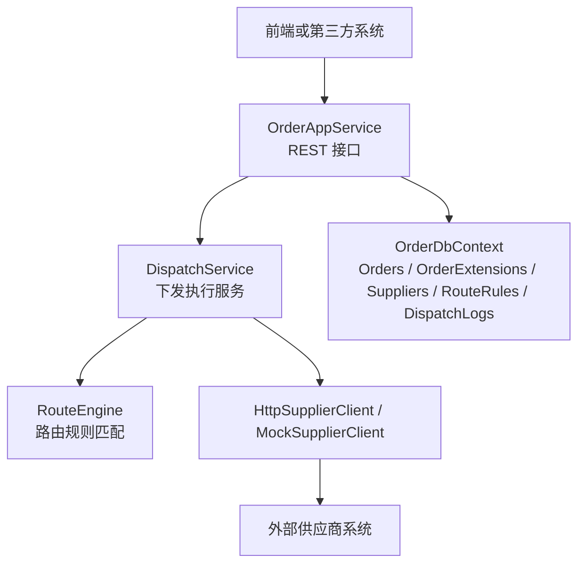
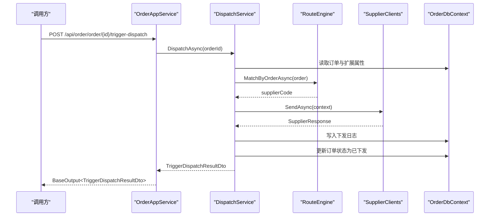
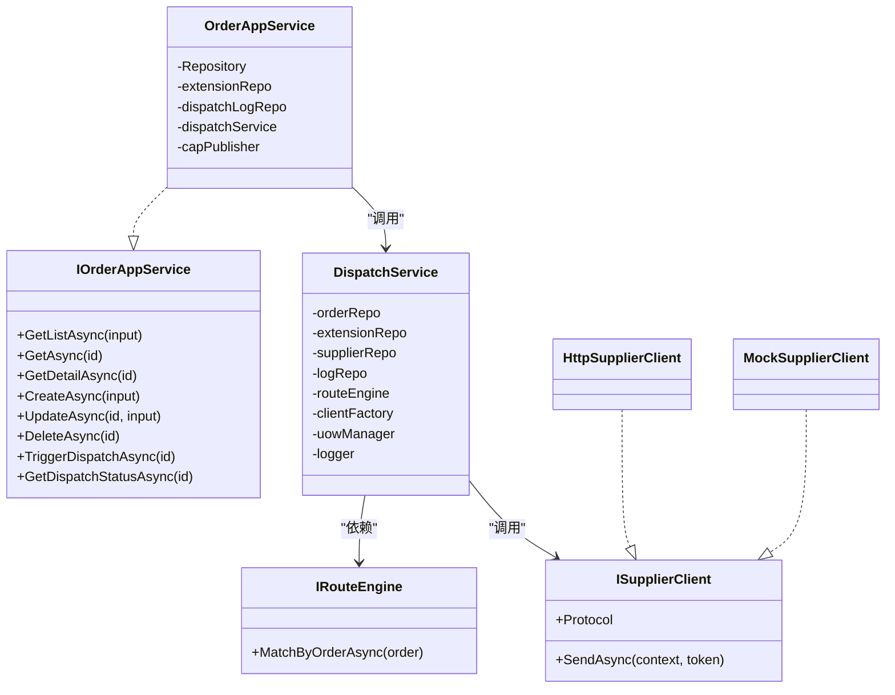
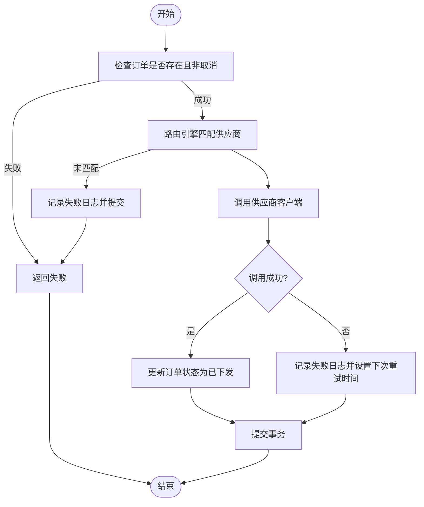

# 订单管理API

<cite>
**本文引用的文件**
- [IOrderAppService.cs](file://src/Services/Order/H.Order.Application.Contracts/Services/IOrderAppService.cs)
- [OrderDtos.cs](file://src/Services/Order/H.Order.Application.Contracts/Dtos/OrderDtos.cs)
- [DispatchLogDtos.cs](file://src/Services/Order/H.Order.Application.Contracts/Dtos/DispatchLogDtos.cs)
- [SupplierDtos.cs](file://src/Services/Order/H.Order.Application.Contracts/Dtos/SupplierDtos.cs)
- [RouteRuleDtos.cs](file://src/Services/Order/H.Order.Application.Contracts/Dtos/RouteRuleDtos.cs)
- [OrderEnums.cs](file://src/Services/Order/H.Order.Application.Contracts/Enums/OrderEnums.cs)
- [ISupplierClient.cs](file://src/Services/Order/H.Order.Application.Contracts/Abstractions/ISupplierClient.cs)
- [OrderEvents.cs](file://src/Services/Order/H.Order.Application.Contracts/Events/OrderEvents.cs)
- [OrderAppService.cs](file://src/Services/Order/H.Order.Application/Services/OrderAppService.cs)
- [DispatchService.cs](file://src/Services/Order/H.Order.Application/Services/DispatchService.cs)
- [SupplierAppService.cs](file://src/Services/Order/H.Order.Application/Services/SupplierAppService.cs)
- [RouteEngine.cs](file://src/Services/Order/H.Order.Application/Services/RouteEngine.cs)
- [SupplierClients.cs](file://src/Services/Order/H.Order.Application/Services/SupplierClients.cs)
- [OrderEntities.cs](file://src/Services/Order/H.Order.EntityFrameworkCore/Entities/OrderEntities.cs)
- [OrderDbContext.cs](file://src/Services/Order/H.Order.EntityFrameworkCore/OrderDbContext.cs)
</cite>

## 目录
1. [引言](#引言)
2. [项目结构](#项目结构)
3. [核心组件](#核心组件)
4. [架构总览](#架构总览)
5. [详细接口文档](#详细接口文档)
6. [依赖关系分析](#依赖关系分析)
7. [性能与一致性](#性能与一致性)
8. [故障排查](#故障排查)
9. [结论](#结论)

## 引言
本文件为 H.AppLab 平台中“订单管理服务”的 RESTful API 文档，聚焦订单生命周期、供应商下发、路由规则、供应商管理与下发日志等能力。该服务采用 ABP 模块化架构，通过 Application.Contracts 暴露 IAppService 接口，由 ABP 约定控制器自动生成 REST 端点；领域模型与持久化位于 EntityFrameworkCore 层，外部调用通过 HTTP 或模拟协议接入上游供应商。

注意：当前代码未实现支付集成、库存扣减与物流跟踪相关的业务域，因此本 API 文档不包含支付发起、支付结果查询、退款处理、库存管理与物流跟踪的接口定义。若需要这些能力，应在对应限界上下文内扩展应用服务。

## 项目结构
订单服务按 ABP 标准分层组织：
- Application.Contracts：对外契约（DTO、枚举、事件、抽象接口）
- Application：应用服务、领域编排、路由引擎、供应商客户端
- EntityFrameworkCore：实体、数据库上下文、迁移
- Web：Web 模块注册（由宿主聚合）

```mermaid
graph TB
    Client["前端或第三方系统"] --> OrderAPI["OrderAppService<br/>REST 接口"]
    OrderAPI --> DispatchService["DispatchService<br/>下发执行服务"]
    DispatchService --> RouteEngine["RouteEngine<br/>路由规则匹配"]
    DispatchService --> SupplierClients["HttpSupplierClient / MockSupplierClient"]
    OrderAPI --> DbContext["OrderDbContext<br/>Orders / OrderExtensions / Suppliers / RouteRules / DispatchLogs"]
    SupplierClients --> ExternalSupplier["外部供应商系统"]
```

**图表来源**
- [IOrderAppService.cs:1-43](file://src/Services/Order/H.Order.Application.Contracts/Services/IOrderAppService.cs#L1-L43)
- [OrderAppService.cs:1-200](file://src/Services/Order/H.Order.Application/Services/OrderAppService.cs#L1-L200)
- [DispatchService.cs:1-200](file://src/Services/Order/H.Order.Application/Services/DispatchService.cs#L1-L200)
- [RouteEngine.cs:1-149](file://src/Services/Order/H.Order.Application/Services/RouteEngine.cs#L1-L149)
- [SupplierClients.cs:1-150](file://src/Services/Order/H.Order.Application/Services/SupplierClients.cs#L1-L150)
- [OrderDbContext.cs:1-110](file://src/Services/Order/H.Order.EntityFrameworkCore/OrderDbContext.cs#L1-L110)

**章节来源**
- [IOrderAppService.cs:1-43](file://src/Services/Order/H.Order.Application.Contracts/Services/IOrderAppService.cs#L1-L43)
- [OrderDbContext.cs:1-110](file://src/Services/Order/H.Order.EntityFrameworkCore/OrderDbContext.cs#L1-L110)

## 核心组件
- 订单应用服务：提供订单 CRUD、详情、分页、手动触发下发、最近下发状态查询。
- 下发执行服务：负责路由匹配、供应商调用、下发日志记录、订单状态更新。
- 路由引擎：根据行业、商品类别、金额区间等条件选择供应商。
- 供应商客户端：HTTP 与 Mock 两种协议实现，支持多种认证方式。
- 供应商与路由规则管理：CRUD 接口，支撑下发策略配置。
- 下发日志：记录每次下发的请求、响应、错误、重试时间等。

**章节来源**
- [OrderAppService.cs:1-242](file://src/Services/Order/H.Order.Application/Services/OrderAppService.cs#L1-L242)
- [DispatchService.cs:1-200](file://src/Services/Order/H.Order.Application/Services/DispatchService.cs#L1-L200)
- [RouteEngine.cs:1-149](file://src/Services/Order/H.Order.Application/Services/RouteEngine.cs#L1-L149)
- [SupplierClients.cs:1-150](file://src/Services/Order/H.Order.Application/Services/SupplierClients.cs#L1-L150)
- [SupplierAppService.cs:1-185](file://src/Services/Order/H.Order.Application/Services/SupplierAppService.cs#L1-L185)

## 架构总览
订单创建后进入待下发状态时，会发布 CAP 事件，消费者再调用下发执行逻辑；也可通过手动触发接口直接执行下发。下发流程包括：
1. 校验订单存在性与状态
2. 使用路由引擎匹配供应商
3. 构造标准化订单载荷并调用供应商客户端
4. 记录下发日志并更新订单状态

```mermaid
sequenceDiagram
    participant C as "调用方"
    participant O as "OrderAppService"
    participant D as "DispatchService"
    participant R as "RouteEngine"
    participant S as "SupplierClients"
    participant DB as "OrderDbContext"

    C->>O: POST /api/order/order/{id}/trigger-dispatch
    O->>D: DispatchAsync(orderId)
    D->>DB: 读取订单与扩展属性
    D->>R: MatchByOrderAsync(order)
    R-->>D: supplierCode
    D->>S: SendAsync(context)
    S-->>D: SupplierResponse
    D->>DB: 写入下发日志
    D->>DB: 更新订单状态为已下发
    D-->>O: TriggerDispatchResultDto
    O-->>C: BaseOutput<TriggerDispatchResultDto>
```

**图表来源**
- [OrderAppService.cs:1-242](file://src/Services/Order/H.Order.Application/Services/OrderAppService.cs#L1-L242)
- [DispatchService.cs:1-200](file://src/Services/Order/H.Order.Application/Services/DispatchService.cs#L1-L200)
- [RouteEngine.cs:1-149](file://src/Services/Order/H.Order.Application/Services/RouteEngine.cs#L1-L149)
- [SupplierClients.cs:1-150](file://src/Services/Order/H.Order.Application/Services/SupplierClients.cs#L1-L150)
- [OrderDbContext.cs:1-110](file://src/Services/Order/H.Order.EntityFrameworkCore/OrderDbContext.cs#L1-L110)

## 详细接口文档

### 通用约定
- 所有接口返回统一包装类型 `BaseOutput<T>`，其中包含业务数据与通用信息。
- 分页查询参数继承自 `PagedResultRequestDto`，常用字段包括：
  - SkipCount：跳过条数
  - MaxResultCount：每页条数
- 所有 DTO 均继承自 ABP 审计基类，包含 Id、CreationTime 等公共字段。

### 订单生命周期接口

#### 分页查询订单列表
- 方法：GET
- 路径：/api/order/order
- 说明：仅返回订单核心字段，不关联扩展表。
- 请求参数：
  - QueryString：
    - Filter：关键词（订单号或商品名称模糊匹配）
    - OrderNo：精确订单号
    - Industry：行业
    - BuyerId：买家ID
    - Status：订单状态
    - MinAmount：最小金额
    - MaxAmount：最大金额
    - CreateTimeStart：创建时间起
    - CreateTimeEnd：创建时间止
    - SkipCount：跳过数量
    - MaxResultCount：每页数量
- 响应体：`BaseOutput<PagedResultDto<OrderDto>>`
- 业务规则：
  - 默认按 CreationTime 倒序排序
  - 未指定 MaxResultCount 时默认返回 10 条

**章节来源**
- [IOrderAppService.cs:12-20](file://src/Services/Order/H.Order.Application.Contracts/Services/IOrderAppService.cs#L12-L20)
- [OrderDtos.cs:1-161](file://src/Services/Order/H.Order.Application.Contracts/Dtos/OrderDtos.cs#L1-L161)
- [OrderAppService.cs:36-71](file://src/Services/Order/H.Order.Application/Services/OrderAppService.cs#L36-L71)

#### 获取订单核心信息
- 方法：GET
- 路径：/api/order/order/{id}
- 说明：返回订单核心 DTO，不含扩展属性。
- 路径参数：
  - id：订单 GUID
- 响应体：`BaseOutput<OrderDto>`

**章节来源**
- [IOrderAppService.cs:20-22](file://src/Services/Order/H.Order.Application.Contracts/Services/IOrderAppService.cs#L20-L22)
- [OrderAppService.cs:87-91](file://src/Services/Order/H.Order.Application/Services/OrderAppService.cs#L87-L91)

#### 获取订单详情（含扩展属性与最近下发状态）
- 方法：GET
- 路径：/api/order/order/{id}/detail
- 说明：返回核心字段 + 行业特有扩展属性 JSON + 最近一次下发状态摘要。
- 路径参数：
  - id：订单 GUID
- 响应体：`BaseOutput<OrderDetailDto>`

**章节来源**
- [IOrderAppService.cs:22-25](file://src/Services/Order/H.Order.Application.Contracts/Services/IOrderAppService.cs#L22-L25)
- [OrderAppService.cs:93-110](file://src/Services/Order/H.Order.Application/Services/OrderAppService.cs#L93-L110)

#### 创建订单
- 方法：POST
- 路径：/api/order/order
- 说明：创建订单核心字段与扩展属性（同事务写入）；若订单状态为待下发则发布 CAP 事件。
- 请求体：`CreateOrderDto`
  - OrderNo：订单号（为空时系统生成）
  - ProductName：商品名称
  - BuyerId：买家ID
  - OrderStatus：订单状态（默认待下发）
  - Industry：行业
  - ProductCategory：商品类别
  - TotalAmount：总金额
  - Remark：备注
  - AttributesJson：行业特有属性 JSON
- 响应体：`BaseOutput<OrderDto>`
- 业务规则：
  - 订单号唯一性校验
  - 扩展属性仅在传入时写入
  - 待下发状态发布 PendingDispatch 事件

**章节来源**
- [IOrderAppService.cs:25-28](file://src/Services/Order/H.Order.Application.Contracts/Services/IOrderAppService.cs#L25-L28)
- [OrderDtos.cs:64-96](file://src/Services/Order/H.Order.Application.Contracts/Dtos/OrderDtos.cs#L64-L96)
- [OrderAppService.cs:112-160](file://src/Services/Order/H.Order.Application/Services/OrderAppService.cs#L112-L160)
- [OrderEvents.cs:1-20](file://src/Services/Order/H.Order.Application.Contracts/Events/OrderEvents.cs#L1-L20)

#### 更新订单
- 方法：PUT
- 路径：/api/order/order/{id}
- 说明：更新订单核心字段；AttributesJson 为 null 表示不修改扩展属性。
- 路径参数：
  - id：订单 GUID
- 请求体：`UpdateOrderDto`
  - 字段含义同 UpdateOrderDto 定义
- 响应体：`BaseOutput<OrderDto>`
- 业务规则：
  - 扩展属性 upsert（不存在则插入，存在则更新）
  - 若设置为待下发状态，则发布 PendingDispatch 事件

**章节来源**
- [IOrderAppService.cs:28-30](file://src/Services/Order/H.Order.Application.Contracts/Services/IOrderAppService.cs#L28-L30)
- [OrderDtos.cs:98-122](file://src/Services/Order/H.Order.Application.Contracts/Dtos/OrderDtos.cs#L98-L122)
- [OrderAppService.cs:162-190](file://src/Services/Order/H.Order.Application/Services/OrderAppService.cs#L162-L190)

#### 删除订单
- 方法：DELETE
- 路径：/api/order/order/{id}
- 说明：同步删除订单及其扩展属性。
- 路径参数：
  - id：订单 GUID
- 响应体：`BaseOutput`

**章节来源**
- [IOrderAppService.cs:30-32](file://src/Services/Order/H.Order.Application.Contracts/Services/IOrderAppService.cs#L30-L32)
- [OrderAppService.cs:192-200](file://src/Services/Order/H.Order.Application/Services/OrderAppService.cs#L192-L200)

#### 手动触发订单下发
- 方法：POST
- 路径：/api/order/order/{id}/trigger-dispatch
- 说明：立即执行供应商下发逻辑，包括路由匹配、供应商调用、日志记录与订单状态更新。
- 路径参数：
  - id：订单 GUID
- 响应体：`BaseOutput<TriggerDispatchResultDto>`
- 业务规则：
  - 已取消订单不可下发
  - 已下发订单无需重复下发
  - 未匹配到供应商则失败
  - 调用失败记录日志并可重试

**章节来源**
- [IOrderAppService.cs:32-35](file://src/Services/Order/H.Order.Application.Contracts/Services/IOrderAppService.cs#L32-L35)
- [OrderAppService.cs:200-206](file://src/Services/Order/H.Order.Application/Services/OrderAppService.cs#L200-L206)
- [DispatchService.cs:63-169](file://src/Services/Order/H.Order.Application/Services/DispatchService.cs#L63-L169)
- [DispatchLogDtos.cs:59-76](file://src/Services/Order/H.Order.Application.Contracts/Dtos/DispatchLogDtos.cs#L59-L76)

#### 查询订单最近一次下发状态
- 方法：GET
- 路径：/api/order/order/{id}/dispatch-status
- 说明：返回最近一条下发日志的状态摘要。
- 路径参数：
  - id：订单 GUID
- 响应体：`BaseOutput<DispatchStatusDto>`

**章节来源**
- [IOrderAppService.cs:35-38](file://src/Services/Order/H.Order.Application.Contracts/Services/IOrderAppService.cs#L35-L38)
- [OrderAppService.cs:208-242](file://src/Services/Order/H.Order.Application/Services/OrderAppService.cs#L208-L242)
- [DispatchLogDtos.cs:1-57](file://src/Services/Order/H.Order.Application.Contracts/Dtos/DispatchLogDtos.cs#L1-L57)

### 订单商品管理接口
当前订单模型以“商品名称”作为单一描述字段，未拆分为独立的商品行项；因此不存在独立的“商品添加、数量修改、价格计算”子资源接口。若需要复杂商品清单与明细计价，应在领域模型中引入订单行项实体并在应用服务层扩展相应接口。

**章节来源**
- [OrderEntities.cs:12-42](file://src/Services/Order/H.Order.EntityFrameworkCore/Entities/OrderEntities.cs#L12-L42)
- [OrderDtos.cs:1-62](file://src/Services/Order/H.Order.Application.Contracts/Dtos/OrderDtos.cs#L1-L62)

### 支付集成相关接口
当前订单服务不包含支付网关对接、支付结果回调与退款处理逻辑。如需支付集成，建议在支付限界上下文中提供独立应用服务，并通过事件或消息总线与订单服务解耦。

[本节不涉及具体代码文件]

### 库存管理与物流跟踪接口
当前订单服务不包含库存扣减、在途跟踪、签收等供应链能力。供应链能力由 SupplyChain 服务负责，订单服务可通过事件或远程服务与其协作。

[本节不涉及具体代码文件]

### 供应商与路由规则管理接口

#### 供应商管理（CRUD）
- 列表：GET /api/order/supplier
- 详情：GET /api/order/supplier/{id}
- 创建：POST /api/order/supplier
- 更新：PUT /api/order/supplier/{id}
- 删除：DELETE /api/order/supplier/{id}
- 主要字段：
  - Code：供应商编码（唯一）
  - Name：供应商名称
  - DisplayName：显示名称
  - ApiUrl：API 地址
  - AuthType：认证方式
  - AuthConfig：认证配置 JSON
  - Protocol：对接协议（HTTP/Mock）
  - ProtocolConfig：协议配置 JSON
  - IsEnabled：是否启用
  - Remark：备注

**章节来源**
- [SupplierAppService.cs:15-74](file://src/Services/Order/H.Order.Application/Services/SupplierAppService.cs#L15-L74)
- [SupplierDtos.cs:1-120](file://src/Services/Order/H.Order.Application.Contracts/Dtos/SupplierDtos.cs#L1-L120)

#### 路由规则管理（CRUD）
- 列表：GET /api/order/route-rule
- 详情：GET /api/order/route-rule/{id}
- 创建：POST /api/order/route-rule
- 更新：PUT /api/order/route-rule/{id}
- 删除：DELETE /api/order/route-rule/{id}
- 主要字段：
  - Name：规则名称
  - SupplierCode：命中后的供应商编码
  - RuleType：规则类型
  - Priority：优先级（越小越优先）
  - IsEnabled：是否启用
  - ConditionsJson：条件集合 JSON
  - Fallback：是否为兜底规则
  - Remark：备注

**章节来源**
- [SupplierAppService.cs:76-147](file://src/Services/Order/H.Order.Application/Services/SupplierAppService.cs#L76-L147)
- [RouteRuleDtos.cs:1-108](file://src/Services/Order/H.Order.Application.Contracts/Dtos/RouteRuleDtos.cs#L1-L108)

### 下发日志接口

#### 下发日志分页查询
- 方法：GET
- 路径：/api/order/dispatch-log
- 参数：
  - OrderId：订单ID
  - SupplierCode：供应商编码
  - Status：下发状态
  - SkipCount：跳过数量
  - MaxResultCount：每页数量
- 响应体：`BaseOutput<PagedResultDto<DispatchLogDto>>`

**章节来源**
- [SupplierAppService.cs:149-185](file://src/Services/Order/H.Order.Application/Services/SupplierAppService.cs#L149-L185)
- [DispatchLogDtos.cs:1-57](file://src/Services/Order/H.Order.Application.Contracts/Dtos/DispatchLogDtos.cs#L1-L57)

#### 按订单ID获取最新下发日志
- 方法：GET
- 路径：/api/order/dispatch-log/latest/{orderId}
- 响应体：`BaseOutput<DispatchLogDto?>`

**章节来源**
- [SupplierAppService.cs:175-185](file://src/Services/Order/H.Order.Application/Services/SupplierAppService.cs#L175-L185)

#### 重试下发
- 方法：POST
- 路径：/api/order/dispatch-log/{logId}/retry
- 说明：基于某条下发日志重新执行下发逻辑。
- 响应体：`BaseOutput<TriggerDispatchResultDto>`

**章节来源**
- [SupplierAppService.cs:181-185](file://src/Services/Order/H.Order.Application/Services/SupplierAppService.cs#L181-L185)
- [DispatchLogDtos.cs:59-76](file://src/Services/Order/H.Order.Application.Contracts/Dtos/DispatchLogDtos.cs#L59-L76)

### 数据模型与枚举

#### 订单状态
- Draft：草稿
- PendingDispatch：待下发
- Dispatched：已下发
- Completed：已完成
- Cancelled：已取消

#### 下发状态
- Pending：待下发
- Success：成功
- Failed：失败
- Retrying：重试中

#### 供应商协议与认证
- 协议：Http、Mock
- 认证：None、ApiKey、Header、Basic、Bearer

**章节来源**
- [OrderEnums.cs:1-91](file://src/Services/Order/H.Order.Application.Contracts/Enums/OrderEnums.cs#L1-L91)

## 依赖关系分析

```mermaid
classDiagram
    class IOrderAppService {
        +GetListAsync(input)
        +GetAsync(id)
        +GetDetailAsync(id)
        +CreateAsync(input)
        +UpdateAsync(id, input)
        +DeleteAsync(id)
        +TriggerDispatchAsync(id)
        +GetDispatchStatusAsync(id)
    }

    class OrderAppService {
        -Repository
        -extensionRepo
        -dispatchLogRepo
        -dispatchService
        -capPublisher
    }

    class DispatchService {
        -orderRepo
        -extensionRepo
        -supplierRepo
        -logRepo
        -routeEngine
        -clientFactory
        -uowManager
        -logger
    }

    class IRouteEngine {
        +MatchByOrderAsync(order)
    }

    class ISupplierClient {
        +Protocol
        +SendAsync(context, token)
    }

    class HttpSupplierClient
    class MockSupplierClient

    OrderAppService ..|> IOrderAppService
    OrderAppService --> DispatchService : "调用"
    DispatchService --> IRouteEngine : "依赖"
    DispatchService --> ISupplierClient : "调用"
    HttpSupplierClient ..|> ISupplierClient
    MockSupplierClient ..|> ISupplierClient
```

**图表来源**
- [IOrderAppService.cs:1-43](file://src/Services/Order/H.Order.Application.Contracts/Services/IOrderAppService.cs#L1-L43)
- [OrderAppService.cs:1-242](file://src/Services/Order/H.Order.Application/Services/OrderAppService.cs#L1-L242)
- [DispatchService.cs:1-200](file://src/Services/Order/H.Order.Application/Services/DispatchService.cs#L1-L200)
- [RouteEngine.cs:1-149](file://src/Services/Order/H.Order.Application/Services/RouteEngine.cs#L1-L149)
- [ISupplierClient.cs:1-96](file://src/Services/Order/H.Order.Application.Contracts/Abstractions/ISupplierClient.cs#L1-L96)
- [SupplierClients.cs:1-150](file://src/Services/Order/H.Order.Application/Services/SupplierClients.cs#L1-L150)

**章节来源**
- [IOrderAppService.cs:1-43](file://src/Services/Order/H.Order.Application.Contracts/Services/IOrderAppService.cs#L1-L43)
- [OrderAppService.cs:1-242](file://src/Services/Order/H.Order.Application/Services/OrderAppService.cs#L1-L242)
- [DispatchService.cs:1-200](file://src/Services/Order/H.Order.Application/Services/DispatchService.cs#L1-L200)
- [RouteEngine.cs:1-149](file://src/Services/Order/H.Order.Application/Services/RouteEngine.cs#L1-L149)
- [ISupplierClient.cs:1-96](file://src/Services/Order/H.Order.Application.Contracts/Abstractions/ISupplierClient.cs#L1-L96)

## 性能与一致性

### 事务与一致性
- 订单创建：核心订单与扩展属性在同一工作单元中保存，确保原子性。
- 订单更新：核心字段与扩展属性的 upsert 操作在同一工作单元中提交。
- 下发执行：DispatchService 显式开启 UOW，将日志写入与订单状态更新置于同一事务中；失败分支也会记录日志并提交，保证可观测性。
- 幂等控制：
  - 订单号唯一索引防止重复订单号。
  - 已下发订单重复触发下发直接返回成功提示，避免重复调用供应商。
  - 已取消订单拒绝下发。

```mermaid
flowchart TD
    Start(["开始"]) --> CheckOrder["检查订单是否存在且非取消"]
    CheckOrder -->|失败| ReturnFail["返回失败"]
    CheckOrder -->|成功| MatchSupplier["路由引擎匹配供应商"]
    MatchSupplier -->|未匹配| LogFail["记录失败日志并提交"]
    LogFail --> ReturnFail
    MatchSupplier --> CallSupplier["调用供应商客户端"]
    CallSupplier --> Response{"调用成功?"}
    Response -->|是| UpdateOrder["更新订单状态为已下发"]
    Response -->|否| LogFailed["记录失败日志并设置下次重试时间"]
    UpdateOrder --> Commit["提交事务"]
    LogFailed --> Commit
    Commit --> End(["结束"])
    ReturnFail --> End
```

**图表来源**
- [DispatchService.cs:63-169](file://src/Services/Order/H.Order.Application/Services/DispatchService.cs#L63-L169)
- [OrderDbContext.cs:1-110](file://src/Services/Order/H.Order.EntityFrameworkCore/OrderDbContext.cs#L1-L110)

### 并发控制
- 通过 ABP 工作单元与 EF Core 的事务机制保证单请求内的数据一致性。
- 未实现分布式锁或乐观并发版本号，高并发场景下建议：
  - 在调用层对同一订单的下发请求进行去重（如基于 orderId 的令牌桶）。
  - 使用数据库唯一约束（如订单号）与状态机约束避免非法状态转换。
  - 对下游供应商调用增加超时与重试退避策略。

### 可扩展性
- 新增供应商协议：实现 ISupplierClient 并在工厂中注册。
- 新增路由条件：扩展 RouteEngine 的条件评估逻辑。
- 新增订单扩展属性：通过 AttributesJson 灵活存储行业特性字段。

**章节来源**
- [DispatchService.cs:63-200](file://src/Services/Order/H.Order.Application/Services/DispatchService.cs#L63-L200)
- [OrderDbContext.cs:1-110](file://src/Services/Order/H.Order.EntityFrameworkCore/OrderDbContext.cs#L1-L110)
- [ISupplierClient.cs:1-96](file://src/Services/Order/H.Order.Application.Contracts/Abstractions/ISupplierClient.cs#L1-L96)
- [RouteEngine.cs:1-149](file://src/Services/Order/H.Order.Application/Services/RouteEngine.cs#L1-L149)

## 故障排查

### 常见问题
- 未匹配到供应商：
  - 现象：下发失败，提示未匹配到供应商。
  - 原因：未配置路由规则或未启用兜底规则。
  - 处理：检查启用的路由规则与供应商是否启用，必要时配置兜底规则。
- 供应商不存在：
  - 现象：下发失败，提示供应商不存在。
  - 原因：路由规则指向的供应商编码无效。
  - 处理：核对供应商编码与路由规则配置。
- 供应商未配置 ApiUrl：
  - 现象：HTTP 下发失败。
  - 原因：供应商配置缺少 ApiUrl。
  - 处理：补充供应商 API 地址。
- 认证配置错误：
  - 现象：HTTP 返回错误或鉴权失败。
  - 原因：AuthType 与 AuthConfig 配置不匹配。
  - 处理：核对认证方式与 JSON 配置键值。

### 日志与重试
- 下发日志记录请求负载、响应内容、HTTP 状态码、错误信息与重试时间。
- 可通过下发日志接口查看最近一次下发状态，或使用重试接口重新触发下发。

**章节来源**
- [DispatchService.cs:121-169](file://src/Services/Order/H.Order.Application/Services/DispatchService.cs#L121-L169)
- [SupplierClients.cs:25-93](file://src/Services/Order/H.Order.Application/Services/SupplierClients.cs#L25-L93)
- [SupplierAppService.cs:149-185](file://src/Services/Order/H.Order.Application/Services/SupplierAppService.cs#L149-L185)

## 结论
H.AppLab 订单管理服务提供了完整的订单生命周期管理、供应商下发与路由规则管理能力，具备清晰的 REST API 设计、可扩展的供应商协议与认证机制，以及完善的事件驱动与日志可观测性。当前未覆盖支付、库存与物流等供应链环节，这些能力可在各自限界上下文中扩展并与订单服务通过事件或消息进行协同。对于高并发与强一致性场景，建议结合分布式锁、幂等设计与重试退避策略进一步完善。