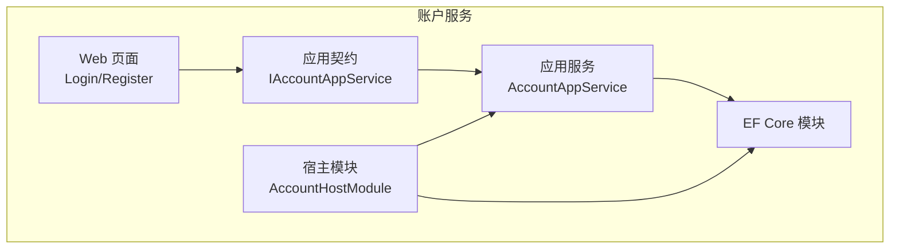
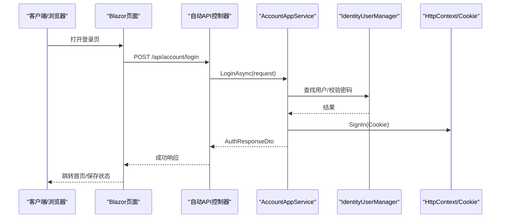
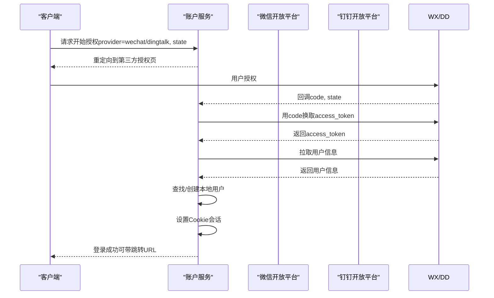
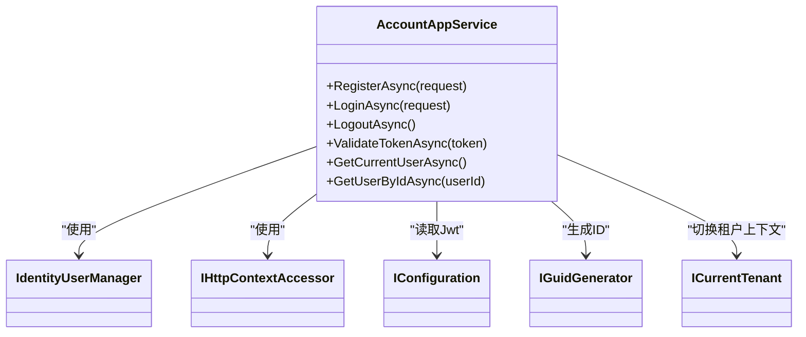

# 账户管理API

<cite>
**本文引用的文件**   
- [AccountApplicationContractsModule.cs](file://src/Services/Account/H.Account.Application.Contracts/AccountApplicationContractsModule.cs)
- [IAccountAppService.cs](file://src/Services/Account/H.Account.Application.Contracts/Services/IAccountAppService.cs)
- [AccountApplicationModule.cs](file://src/services/account/h.account.application/accountapplicationmodule.cs)
- [AccountAppService.cs](file://src/services/account/h.account.application/services/accountappservice.cs)
- [AccountHostModule.cs](file://src/host/account/h.account.host/accounthostmodule.cs)
- [Login.razor](file://src/services/account/h.account.web/pages/login.razor)
- [Register.razor](file://src/services/account/h.account.web/pages/register.razor)
- [README.md](file://src/services/account/readme.md)
</cite>

## 目录
1. [简介](#简介)
2. [项目结构](#项目结构)
3. [核心组件](#核心组件)
4. [架构总览](#架构总览)
5. [详细接口规范](#详细接口规范)
6. [依赖关系分析](#依赖关系分析)
7. [性能与扩展性](#性能与扩展性)
8. [故障排查指南](#故障排查指南)
9. [结论](#结论)
10. [附录：客户端集成示例](#附录客户端集成示例)

## 简介
本文件为账户管理服务（Account）的API文档，覆盖用户注册、登录、登出、令牌校验、当前用户获取等核心能力；并给出外部登录（微信、钉钉）OAuth2.0流程说明。同时包含多租户环境下的用户隔离机制、请求参数验证规则、响应数据结构与错误码定义，以及客户端集成建议。

## 项目结构
账户服务采用ABP模块化分层：
- Application.Contracts：对外暴露的服务契约与DTO
- Application：应用服务实现（业务编排、认证逻辑）
- EntityFrameworkCore：数据访问模块（由宿主装配）
- Web：Blazor页面（登录、注册等）
- Host：宿主模块，装配认证、外部登录、自动API控制器等

图表来源
- [IAccountAppService.cs:1-18](file://src/Services/Account/H.Account.Application.Contracts/Services/IAccountAppService.cs#L1-L18)
- [AccountAppService.cs:1-356](file://src/services/account/h.account.application/services/accountappservice.cs#L1-L356)
- [AccountApplicationModule.cs:1-24](file://src/services/account/h.account.application/accountapplicationmodule.cs#L1-L24)
- [AccountHostModule.cs:1-44](file://src/host/account/h.account.host/accounthostmodule.cs#L1-L44)
- [Login.razor:1-38](file://src/services/account/h.account.web/pages/login.razor#L1-L38)
- [Register.razor:1-167](file://src/services/account/h.account.web/pages/register.razor#L1-L167)

章节来源
- [README.md:1-48](file://src/services/account/readme.md#L1-L48)

## 核心组件
- IAccountAppService：定义注册、登录、按ID获取用户、令牌校验、登出、获取当前用户等接口
- AccountAppService：实现上述接口，使用IdentityUserManager进行用户操作，基于Cookie完成会话，提供JWT校验能力
- AccountApplicationModule：注册HttpContextAccessor与HttpClient，供后续外部登录使用
- AccountHostModule：装配Abp Identity、Mvc、EF Core，配置认证与外部登录

章节来源
- [IAccountAppService.cs:1-18](file://src/Services/Account/H.Account.Application.Contracts/Services/IAccountAppService.cs#L1-L18)
- [AccountAppService.cs:1-356](file://src/services/account/h.account.application/services/accountappservice.cs#L1-L356)
- [AccountApplicationModule.cs:1-24](file://src/services/account/h.account.application/accountapplicationmodule.cs#L1-L24)
- [AccountHostModule.cs:1-44](file://src/host/account/h.account.host/accounthostmodule.cs#L1-L44)

## 架构总览
账户服务通过ASP.NET Core MVC自动API控制器暴露REST接口，前端Blazor页面调用应用服务完成认证与会话管理。登录成功后设置Cookie，后续请求携带Cookie完成鉴权。

图表来源
- [AccountAppService.cs:114-210](file://src/services/account/h.account.application/services/accountappservice.cs#L114-L210)
- [AccountHostModule.cs:29-41](file://src/host/account/h.account.host/accounthostmodule.cs#L29-L41)

## 详细接口规范

### 通用约定
- 内容类型：application/json
- 统一响应体：AuthResponseDto
  - success: boolean
  - message: string
  - user: UserDto?
- 错误码：
  - 业务错误：success=false，message描述原因
  - 系统异常：HTTP 5xx（未捕获异常）
- 安全：
  - 登录/注册/登出接口忽略防伪令牌（用于简化表单提交）
  - 登录后通过Cookie维持会话

章节来源
- [AccountAppService.cs:43-112](file://src/services/account/h.account.application/services/accountappservice.cs#L43-L112)
- [AccountAppService.cs:114-210](file://src/services/account/h.account.application/services/accountappservice.cs#L114-L210)
- [AccountAppService.cs:249-257](file://src/services/account/h.account.application/services/accountappservice.cs#L249-L257)

### 用户注册
- 接口：POST /api/account/register
- 请求体：RegisterRequestDto
  - registerType: enum（UserName/Email/PhoneNumber）
  - userName: string?（当registerType=UserName时必填）
  - email: string?（当registerType=Email或UserName时建议提供）
  - phoneNumber: string?（当registerType=PhoneNumber时必填）
  - password: string（必填）
  - confirmPassword: string（必填，需与password一致）
- 响应：AuthResponseDto
- 验证规则：
  - 邮箱唯一、手机号唯一、用户名唯一
  - 密码与确认密码必须一致
- 典型错误：
  - 邮箱已被注册
  - 手机号已被注册
  - 用户名已存在
  - 密码和确认密码不匹配

章节来源
- [IAccountAppService.cs:7](file://src/Services/Account/H.Account.Application.Contracts/Services/IAccountAppService.cs#L7)
- [AccountAppService.cs:44-112](file://src/services/account/h.account.application/services/accountappservice.cs#L44-L112)

### 用户登录
- 接口：POST /api/account/login
- 请求体：LoginRequestDto
  - account: string（支持用户名/邮箱/手机号，自动识别）
  - password: string（必填）
  - rememberMe: bool（可选，是否持久化Cookie）
- 响应：AuthResponseDto
- 行为：
  - 自动识别account类型（用户名/邮箱/手机号）
  - 跨租户查找用户（Host上下文）
  - 校验账号状态与密码
  - 登录成功设置Cookie会话
- 典型错误：
  - 用户名或密码错误
  - 账户已被禁用

章节来源
- [IAccountAppService.cs:8](file://src/Services/Account/H.Account.Application.Contracts/Services/IAccountAppService.cs#L8)
- [AccountAppService.cs:114-210](file://src/services/account/h.account.application/services/accountappservice.cs#L114-L210)

### 用户登出
- 接口：POST /api/account/logout
- 请求体：无
- 响应：AuthResponseDto（success=true表示成功）
- 行为：清除Cookie会话

章节来源
- [IAccountAppService.cs:11](file://src/Services/Account/H.Account.Application.Contracts/Services/IAccountAppService.cs#L11)
- [AccountAppService.cs:249-257](file://src/services/account/h.account.application/services/accountappservice.cs#L249-L257)

### 令牌校验
- 接口：GET /api/account/validate-token
- 查询参数：token: string
- 响应：bool（true表示有效）
- 说明：基于配置的Jwt密钥与签发者/受众校验

章节来源
- [IAccountAppService.cs:10](file://src/Services/Account/H.Account.Application.Contracts/Services/IAccountAppService.cs#L10)
- [AccountAppService.cs:222-247](file://src/services/account/h.account.application/services/accountappservice.cs#L222-L247)

### 获取当前用户
- 接口：GET /api/account/current-user
- 请求体：无
- 响应：UserDto?（未登录返回null）
- 说明：从Cookie中解析用户标识，跨租户查找用户信息

章节来源
- [IAccountAppService.cs:16](file://src/Services/Account/H.Account.Application.Contracts/Services/IAccountAppService.cs#L16)
- [AccountAppService.cs:259-279](file://src/services/account/h.account.application/services/accountappservice.cs#L259-L279)

### 按ID获取用户
- 接口：GET /api/account/users/{userId}
- 路径参数：userId: Guid
- 响应：UserDto?
- 说明：跨租户查找用户

章节来源
- [IAccountAppService.cs:9](file://src/Services/Account/H.Account.Application.Contracts/Services/IAccountAppService.cs#L9)
- [AccountAppService.cs:212-220](file://src/services/account/h.account.application/services/accountappservice.cs#L212-L220)

### 用户模型（UserDto）字段说明
- id: Guid
- userName: string
- email: string
- phoneNumber: string
- isActive: bool（是否可用）
- emailConfirmed: bool
- phoneNumberConfirmed: bool
- lockoutEnd: DateTime?
- accessFailedCount: int
- createdAt: DateTime
- updatedAt: DateTime
- lastLoginAt: DateTime

章节来源
- [AccountAppService.cs:311-329](file://src/services/account/h.account.application/services/accountappservice.cs#L311-L329)

### 外部登录集成（微信、钉钉）OAuth2.0流程
- 目标：通过第三方平台授权登录，创建或绑定本地账户，建立本地会话
- 前置条件：
  - 在宿主中注册HttpClient（已配置）
  - 配置第三方应用的AppId/AppSecret及回调地址
- 流程步骤：
  1) 客户端发起“开始授权”请求（携带state防CSRF）
  2) 服务端生成state并重定向到第三方授权页
  3) 用户授权后回调至服务端，服务端用code换取access_token
  4) 使用access_token拉取用户信息（昵称、头像、OpenId等）
  5) 根据OpenId查找或创建本地用户，必要时提示绑定邮箱/手机
  6) 登录成功，设置本地Cookie会话
  7) 返回前端所需信息（如跳转URL或用户基本信息）
- 注意事项：
  - state需与服务端存储一致，防止CSRF
  - code有效期短，需立即交换
  - 第三方用户信息可能变更，需定期同步
  - 敏感配置（AppSecret）应通过配置中心或环境变量注入

[此图为概念流程图，无需代码来源]

## 依赖关系分析
- AccountAppService依赖：
  - IdentityUserManager：用户CRUD、密码校验、锁定策略
  - IHttpContextAccessor：读写Cookie与Claims
  - IConfiguration：读取Jwt配置
  - IGuidGenerator：生成用户ID
  - ICurrentTenant：切换Host上下文以跨租户查询
- 宿主模块装配：
  - Abp Identity、EF Core、Mvc
  - HttpClient、HttpContextAccessor
  - 自动API控制器映射

图表来源
- [AccountAppService.cs:21-41](file://src/services/account/h.account.application/services/accountappservice.cs#L21-L41)
- [AccountApplicationModule.cs:15-22](file://src/services/account/h.account.application/accountapplicationmodule.cs#L15-L22)
- [AccountHostModule.cs:29-41](file://src/host/account/h.account.host/accounthostmodule.cs#L29-L41)

章节来源
- [AccountAppService.cs:1-41](file://src/services/account/h.account.application/services/accountappservice.cs#L1-L41)
- [AccountApplicationModule.cs:1-24](file://src/services/account/h.account.application/accountapplicationmodule.cs#L1-L24)
- [AccountHostModule.cs:1-44](file://src/host/account/h.account.host/accounthostmodule.cs#L1-L44)

## 性能与扩展性
- 登录性能：
  - 避免全表扫描手机号匹配，建议对PhoneNumber建立索引
  - 减少ToListAsync的使用，改用分页或条件查询
- 并发与安全：
  - 使用强随机state与nonce，限制重试频率
  - 合理设置Cookie过期时间，区分rememberMe场景
- 可扩展点：
  - 外部登录抽象：新增Provider只需实现授权与用户信息拉取
  - 令牌策略：可在应用层增加刷新令牌、设备指纹等

[本节为通用建议，无需代码来源]

## 故障排查指南
- 登录失败：
  - 检查account格式是否正确（邮箱/手机号/用户名）
  - 检查用户是否被禁用（isActive=false）
  - 查看AccessFailedCount是否达到锁定阈值
- 令牌校验失败：
  - 核对Jwt.SecretKey、Issuer、Audience配置
  - 检查服务器时钟偏差（ClockSkew）
- 外部登录异常：
  - 检查回调地址与授权域配置
  - 确认code有效性与时区差异
  - 记录第三方API返回的错误码

章节来源
- [AccountAppService.cs:114-210](file://src/services/account/h.account.application/services/accountappservice.cs#L114-L210)
- [AccountAppService.cs:222-247](file://src/services/account/h.account.application/services/accountappservice.cs#L222-L247)

## 结论
账户服务提供了完整的注册、登录、登出、令牌校验与当前用户获取能力，并通过Cookie维护会话。外部登录（微信、钉钉）可通过标准OAuth2.0流程接入。在多租户环境下，用户数据为全局共享，需在Host上下文进行查询。建议在生产环境中完善索引、配置管理与错误监控。

[本节为总结，无需代码来源]

## 附录：客户端集成示例
- Blazor页面调用：
  - 登录页：调用LoginAsync，成功后导航至首页
  - 注册页：调用RegisterAsync，成功后跳转登录页
- HTTP客户端调用：
  - 登录：POST /api/account/login，携带JSON请求体
  - 登出：POST /api/account/logout
  - 校验令牌：GET /api/account/validate-token?token=...
  - 获取当前用户：GET /api/account/current-user

章节来源
- [Login.razor:1-38](file://src/services/account/h.account.web/pages/login.razor#L1-L38)
- [Register.razor:1-167](file://src/services/account/h.account.web/pages/register.razor#L1-L167)