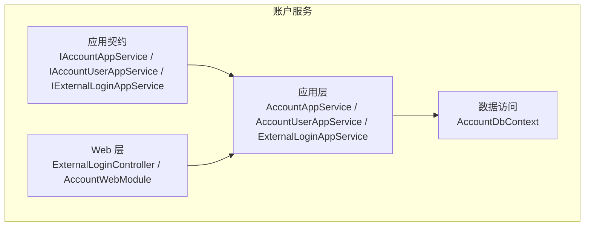
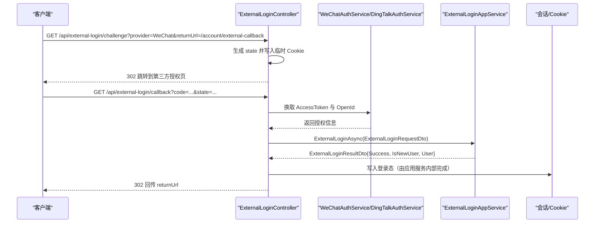
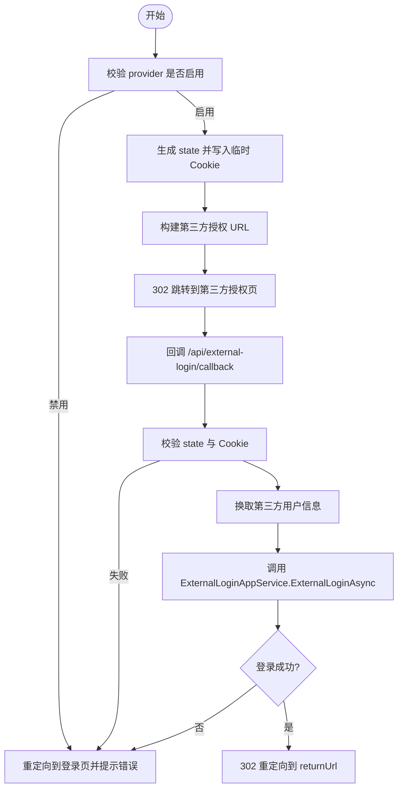
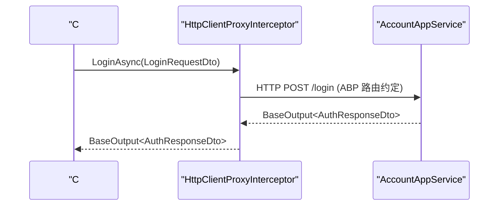
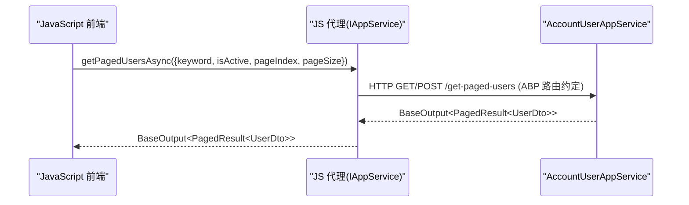
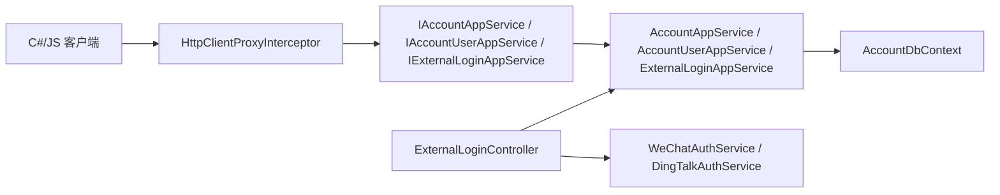

# 账户管理API

<cite>
**本文引用的文件**   
- [README.md](file://README.md)
- [IAccountAppService.cs](file://src/Services/Account/H.Account.Application.Contracts/Services/IAccountAppService.cs)
- [IAccountUserAppService.cs](file://src/Services/Account/H.Account.Application.Contracts/Services/IAccountUserAppService.cs)
- [IExternalLoginAppService.cs](file://src/Services/Account/H.Account.Application.Contracts/Services/IExternalLoginAppService.cs)
- [AccountDtos.cs](file://src/Services/Account/H.Account.Application.Contracts/Dtos/AccountDtos.cs)
- [ExternalLoginDtos.cs](file://src/Services/Account/H.Account.Application.Contracts/Dtos/ExternalLoginDtos.cs)
- [ExternalLoginController.cs](file://src/Services/Account/H.Account.Application/ExternalLogin/ExternalLoginController.cs)
- [ExternalLoginAppService.cs](file://src/Services/Account/H.Account.Application/ExternalLogin/ExternalLoginAppService.cs)
- [AccountAppService.cs](file://src/Services/Account/H.Account.Application/Services/AccountAppService.cs)
- [AccountUserAppService.cs](file://src/Services/Account/H.Account.Application/Services/AccountUserAppService.cs)
- [AccountApplicationModule.cs](file://src/Services/Account/H.Account.Application/AccountApplicationModule.cs)
- [AccountWebModule.cs](file://src/Services/Account/H.Account.Web/AccountWebModule.cs)
- [AccountDbContext.cs](file://src/Services/Account/H.Account.EntityFrameworkCore/AccountDbContext.cs)
- [H.Abp.HttpClientProxy.csproj](file://src/Utils/src/Utils/H.Abp.HttpClientProxy/H.Abp.HttpClientProxy.csproj)
- [AbpUrlConvention.cs](file://src/Utils/src/Utils/H.Abp.HttpClientProxy/AbpUrlConvention.cs)
- [HttpClientProxyInterceptor.cs](file://src/Utils/src/Utils/H.Abp.HttpClientProxy/HttpClientProxyInterceptor.cs)
- [ServiceCollectionExtensions.cs](file://src/Utils/src/Utils/H.Abp.HttpClientProxy/ServiceCollectionExtensions.cs)
</cite>

## 目录
1. [简介](#简介)
2. [项目结构](#项目结构)
3. [核心组件](#核心组件)
4. [架构总览](#架构总览)
5. [详细接口说明](#详细接口说明)
6. [依赖关系分析](#依赖关系分析)
7. [性能与安全考虑](#性能与安全考虑)
8. [故障排查指南](#故障排查指南)
9. [结论](#结论)

## 简介
本文件为 H.AppLab 平台“账户管理服务”的 API 文档，聚焦以下范围：
- 用户认证相关 RESTful 端点：登录、注册、登出、令牌校验、当前用户获取。
- 用户信息管理 API：按 ID 查询、分页查询、密码重置等。
- 外部登录集成：微信、钉钉扫码登录流程与回调。
- 多租户与企业隔离：基于 ABP Identity 的用户模型与上下文。
- 客户端调用：C# 与 JavaScript 调用示例（通过 IAppService 动态代理）。
- 安全与最佳实践：Cookie、State、Token、刷新策略与错误处理。

该服务采用模块化架构，遵循 Application.Contracts / Application / EntityFrameworkCore / Web 分层，支持单体与独立部署。前端可通过 HttpClient 动态代理直接调用后端 IAppService 接口，无需手写 HTTP 请求。

章节来源
- [README.md:1-73](file://README.md#L1-L73)

## 项目结构
账户服务位于 Services/Account 下，包含以下关键模块：
- H.Account.Application.Contracts：对外暴露的应用契约（IAppService 接口与 DTO）。
- H.Account.Application：应用服务实现、外部登录控制器与应用模块。
- H.Account.EntityFrameworkCore：数据访问与实体上下文。
- H.Account.Web：Web 层模块标记。

```mermaid
graph TB
    subgraph "账户服务"
        Contracts["应用契约<br/>IAccountAppService / IAccountUserAppService / IExternalLoginAppService"]
        App["应用层<br/>AccountAppService / AccountUserAppService / ExternalLoginAppService"]
        EF["数据访问<br/>AccountDbContext"]
        Web["Web 层<br/>ExternalLoginController / AccountWebModule"]
    end

    Contracts --> App
    App --> EF
    Web --> App
```

图表来源
- [IAccountAppService.cs:1-18](file://src/Services/Account/H.Account.Application.Contracts/Services/IAccountAppService.cs#L1-L18)
- [IAccountUserAppService.cs:1-26](file://src/Services/Account/H.Account.Application.Contracts/Services/IAccountUserAppService.cs#L1-L26)
- [IExternalLoginAppService.cs:1-30](file://src/Services/Account/H.Account.Application.Contracts/Services/IExternalLoginAppService.cs#L1-L30)
- [AccountAppService.cs](file://src/Services/Account/H.Account.Application/Services/AccountAppService.cs)
- [AccountUserAppService.cs](file://src/Services/Account/H.Account.Application/Services/AccountUserAppService.cs)
- [ExternalLoginAppService.cs](file://src/Services/Account/H.Account.Application/ExternalLogin/ExternalLoginAppService.cs)
- [AccountDbContext.cs](file://src/Services/Account/H.Account.EntityFrameworkCore/AccountDbContext.cs)
- [ExternalLoginController.cs:1-202](file://src/Services/Account/H.Account.Application/ExternalLogin/ExternalLoginController.cs#L1-L202)
- [AccountWebModule.cs:1-8](file://src/Services/Account/H.Account.Web/AccountWebModule.cs#L1-L8)

章节来源
- [README.md:1-73](file://README.md#L1-L73)

## 核心组件
- 应用契约接口
  - IAccountAppService：提供注册、登录、获取用户、令牌校验、登出、获取当前企业用户。
  - IAccountUserAppService：提供用户信息查询、分页查询、密码重置。
  - IExternalLoginAppService：提供外部账号绑定、解绑、查询列表及统一外部登录处理。
- DTO 模型
  - UserDto、AuthResponseDto、LoginRequestDto、RegisterRequestDto、ResetPasswordDto、UserQueryParams、PagedResult<T>。
  - ExternalLoginRequestDto、ExternalLoginResultDto、ExternalAccountDto。
- 外部登录控制器
  - ExternalLoginController：负责微信/钉钉授权跳转、回调、state 校验与重定向。
- 应用模块
  - AccountApplicationModule：注册 HttpContextAccessor、HttpClient。
  - AccountWebModule：Web 模块标记类。

章节来源
- [IAccountAppService.cs:1-18](file://src/Services/Account/H.Account.Application.Contracts/Services/IAccountAppService.cs#L1-L18)
- [IAccountUserAppService.cs:1-26](file://src/Services/Account/H.Account.Application.Contracts/Services/IAccountUserAppService.cs#L1-L26)
- [IExternalLoginAppService.cs:1-30](file://src/Services/Account/H.Account.Application.Contracts/Services/IExternalLoginAppService.cs#L1-L30)
- [AccountDtos.cs:1-123](file://src/Services/Account/H.Account.Application.Contracts/Dtos/AccountDtos.cs#L1-L123)
- [ExternalLoginDtos.cs:1-48](file://src/Services/Account/H.Account.Application.Contracts/Dtos/ExternalLoginDtos.cs#L1-L48)
- [AccountApplicationModule.cs:1-22](file://src/Services/Account/H.Account.Application/AccountApplicationModule.cs#L1-L22)
- [AccountWebModule.cs:1-8](file://src/Services/Account/H.Account.Web/AccountWebModule.cs#L1-L8)

## 架构总览
账户服务在 ABP 框架之上扩展，使用 Volo.Abp.Identity 作为身份领域模块，结合自定义应用服务与外部登录控制器完成认证与用户管理。外部登录控制器通过 WeChatAuthService 与 DingTalkAuthService 与第三方平台交互，最终交由 ExternalLoginAppService 处理登录或自动注册逻辑，并写入 Cookie 完成会话。

```mermaid
sequenceDiagram
    participant Client as "客户端"
    participant Controller as "ExternalLoginController"
    participant AuthSvc as "WeChatAuthService/DingTalkAuthService"
    participant AppSvc as "ExternalLoginAppService"
    participant Session as "会话/Cookie"

    Client->>Controller: GET /api/external-login/challenge?provider=WeChat&returnUrl=/account/external-callback
    Controller->>Controller: 生成 state 并写入临时 Cookie
    Controller-->>Client: 302 跳转到第三方授权页

    Client->>Controller: GET /api/external-login/callback?code=...&state=...
    Controller->>AuthSvc: 换取 AccessToken 与 OpenId
    AuthSvc-->>Controller: 返回授权信息
    Controller->>AppSvc: ExternalLoginAsync(ExternalLoginRequestDto)
    AppSvc-->>Controller: ExternalLoginResultDto{Success, IsNewUser, User}
    Controller->>Session: 写入登录态（由应用服务内部完成）
    Controller-->>Client: 302 回传 returnUrl
```

图表来源
- [ExternalLoginController.cs:1-202](file://src/Services/Account/H.Account.Application/ExternalLogin/ExternalLoginController.cs#L1-L202)
- [ExternalLoginAppService.cs](file://src/Services/Account/H.Account.Application/ExternalLogin/ExternalLoginAppService.cs)

## 详细接口说明

### 认证与会话接口（IAccountAppService）
- 注册
  - 方法：RegisterAsync(RegisterRequestDto)
  - 功能：根据用户名、邮箱或手机号进行用户注册，支持验证码校验。
  - 输入：RegisterRequestDto（UserName/Email/PhoneNumber、Password、ConfirmPassword、EmailCode/PhoneCode、RegisterType）。
  - 输出：BaseOutput<AuthResponseDto>，包含 Success、Message、User。
- 登录
  - 方法：LoginAsync(LoginRequestDto)
  - 功能：支持按账号、邮箱或手机号登录，返回认证响应。
  - 输入：LoginRequestDto（Account、Password、RememberMe）。
  - 输出：BaseOutput<AuthResponseDto>。
- 获取用户
  - 方法：GetUserByIdAsync(Guid userId)
  - 功能：根据用户 ID 获取用户详情。
  - 输出：BaseOutput<UserDto?>。
- 令牌校验
  - 方法：ValidateTokenAsync(string token)
  - 功能：验证 JWT Token 有效性。
  - 输出：BaseOutput<bool>。
- 登出
  - 方法：LogoutAsync()
  - 功能：清除会话状态。
  - 输出：BaseOutput。
- 获取当前企业用户
  - 方法：GetCurrentUserAsync()
  - 功能：返回当前登录的企业用户信息。
  - 输出：BaseOutput<UserDto?>。

说明
- 所有方法返回统一包装 BaseOutput<T>，其中 Data 字段承载业务数据。
- 认证响应中的 User 字段携带用户基本信息与外部账号列表。

章节来源
- [IAccountAppService.cs:1-18](file://src/Services/Account/H.Account.Application.Contracts/Services/IAccountAppService.cs#L1-L18)
- [AccountDtos.cs:1-123](file://src/Services/Account/H.Account.Application.Contracts/Dtos/AccountDtos.cs#L1-L123)

### 企业管理接口（IAccountUserAppService）
- 获取用户详情
  - 方法：GetUserDtoByIdAsync(Guid userId)
  - 功能：根据 ID 查询企业用户信息。
  - 输出：BaseOutput<UserDto?>。
- 分页查询用户
  - 方法：GetPagedUsersAsync(UserQueryParams queryParams)
  - 功能：按关键字、是否启用、页码与大小分页查询用户列表。
  - 输入：UserQueryParams（Keyword、IsActive、PageIndex、PageSize）。
  - 输出：BaseOutput<PagedResult<UserDto>>。
- 重置密码
  - 方法：ResetPasswordAsync(Guid userId, ResetPasswordDto dto)
  - 功能：根据用户 ID 重置密码。
  - 输入：ResetPasswordDto（NewPassword、ConfirmPassword）。
  - 输出：BaseOutput。

章节来源
- [IAccountUserAppService.cs:1-26](file://src/Services/Account/H.Account.Application.Contracts/Services/IAccountUserAppService.cs#L1-L26)
- [AccountDtos.cs:1-123](file://src/Services/Account/H.Account.Application.Contracts/Dtos/AccountDtos.cs#L1-L123)

### 外部登录接口（IExternalLoginAppService）
- 外部登录
  - 方法：ExternalLoginAsync(ExternalLoginRequestDto)
  - 功能：查找绑定、自动注册或直接登录，并写入会话。
  - 输入：ExternalLoginRequestDto（Provider、ProviderKey、DisplayName、AvatarUrl、UnionId）。
  - 输出：BaseOutput<ExternalLoginResultDto>（Success、Message、IsNewUser、User）。
- 绑定外部账号
  - 方法：BindExternalAccountAsync(Guid userId, ExternalLoginRequestDto request)
  - 功能：将第三方账号绑定到已登录用户。
  - 输出：BaseOutput<ExternalLoginResultDto>。
- 解绑外部账号
  - 方法：UnbindExternalAccountAsync(Guid userId, string provider)
  - 功能：移除指定提供商的外部账号绑定。
  - 输出：BaseOutput<bool>。
- 查询外部账号列表
  - 方法：GetExternalAccountsAsync(Guid userId)
  - 功能：返回用户已绑定的第三方账号列表。
  - 输出：BaseOutput<List<ExternalAccountDto>>。

章节来源
- [IExternalLoginAppService.cs:1-30](file://src/Services/Account/H.Account.Application.Contracts/Services/IExternalLoginAppService.cs#L1-L30)
- [ExternalLoginDtos.cs:1-48](file://src/Services/Account/H.Account.Application.Contracts/Dtos/ExternalLoginDtos.cs#L1-L48)

### 外部登录控制端点（ExternalLoginController）
- 发起授权跳转
  - 路径：GET /api/external-login/challenge
  - 参数：provider（WeChat/DingTalk）、returnUrl（可选）
  - 行为：校验 provider 是否启用，生成 state 并写入临时 HttpOnly+Secure Cookie，构建第三方授权 URL 并 302 跳转。
- 处理回调
  - 路径：GET /api/external-login/callback
  - 参数：code（微信）、authCode（钉钉新版）、state
  - 行为：读取并校验 state Cookie，换取第三方用户信息，调用 ExternalLoginAppService 处理登录，最后 302 重定向到 returnUrl 或默认页面。

```mermaid
flowchart TD
    Start(["开始"]) --> ValidateProvider["校验 provider 是否启用"]
    ValidateProvider -->|禁用| RedirectError["重定向到登录页并提示错误"]
    ValidateProvider -->|启用| GenerateState["生成 state 并写入临时 Cookie"]
    GenerateState --> BuildAuthUrl["构建第三方授权 URL"]
    BuildAuthUrl --> RedirectAuth["302 跳转到第三方授权页"]
    RedirectAuth --> Callback["回调 /api/external-login/callback"]
    Callback --> ValidateState["校验 state 与 Cookie"]
    ValidateState -->|失败| RedirectError
    ValidateState --> GetUserInfo["换取第三方用户信息"]
    GetUserInfo --> CallAppService["调用 ExternalLoginAppService.ExternalLoginAsync"]
    CallAppService --> HandleResult{"登录成功?"}
    HandleResult -->|是| RedirectReturn["302 重定向到 returnUrl"]
    HandleResult -->|否| RedirectError
```

图表来源
- [ExternalLoginController.cs:1-202](file://src/Services/Account/H.Account.Application/ExternalLogin/ExternalLoginController.cs#L1-L202)

章节来源
- [ExternalLoginController.cs:1-202](file://src/Services/Account/H.Account.Application/ExternalLogin/ExternalLoginController.cs#L1-L202)

### 请求参数与响应数据结构

- 通用返回包装
  - BaseOutput<T>
    - Data：业务数据对象。
    - Success：布尔值，表示操作是否成功。
    - Message：消息文本。
- 用户模型 UserDto
  - Id、UserName、Email、PhoneNumber、LoginMode、IsActive、EmailConfirmed、PhoneNumberConfirmed、IsLocked、LockoutEnd、AccessFailedCount、CreatedAt、UpdatedAt、LastLoginAt、Remark、ExternalAccounts。
- 认证响应 AuthResponseDto
  - Success、Message、User。
- 登录请求 LoginRequestDto
  - Account、Password、RememberMe。
- 注册请求 RegisterRequestDto
  - UserName、Email、PhoneNumber、Password、ConfirmPassword、EmailCode、PhoneCode、RegisterType。
- 重置密码 ResetPasswordDto
  - NewPassword、ConfirmPassword。
- 分页查询 UserQueryParams
  - Keyword、IsActive、PageIndex、PageSize。
- 分页结果 PagedResult<T>
  - Items、Total、PageIndex、PageSize、TotalPages。
- 外部登录 ExternalLoginRequestDto
  - Provider、ProviderKey、DisplayName、AvatarUrl、UnionId。
- 外部登录结果 ExternalLoginResultDto
  - Success、Message、IsNewUser、User。
- 外部账号 ExternalAccountDto
  - Provider、ProviderKey、DisplayName、BoundAt。

章节来源
- [AccountDtos.cs:1-123](file://src/Services/Account/H.Account.Application.Contracts/Dtos/AccountDtos.cs#L1-L123)
- [ExternalLoginDtos.cs:1-48](file://src/Services/Account/H.Account.Application.Contracts/Dtos/ExternalLoginDtos.cs#L1-L48)

### C# 客户端调用示例（通过 IAppService 动态代理）
- 步骤概述
  - 引用 H.Abp.HttpClientProxy，并在启动时添加动态代理：AddHttpClientProxies。
  - 远程服务地址通过配置 RemoteServices 节点统一管理。
  - 在 Blazor 或控制台应用中注入 IAccountAppService、IAccountUserAppService、IExternalLoginAppService。
  - 调用接口方法与调用进程内服务一致，底层自动转换为 HTTP 请求。

- 调用序列（登录）

```mermaid
sequenceDiagram
    participant App as "C# 客户端"
    participant Proxy as "HttpClientProxyInterceptor"
    participant Server as "AccountAppService"

    App->>Proxy: LoginAsync(LoginRequestDto)
    Proxy->>Server: HTTP POST /login (ABP 路由约定)
    Server-->>Proxy: BaseOutput<AuthResponseDto>
    Proxy-->>App: BaseOutput<AuthResponseDto>
```

图表来源
- [HttpClientProxyInterceptor.cs](file://src/Utils/src/Utils/H.Abp.HttpClientProxy/HttpClientProxyInterceptor.cs)
- [AbpUrlConvention.cs](file://src/Utils/src/Utils/H.Abp.HttpClientProxy/AbpUrlConvention.cs)
- [ServiceCollectionExtensions.cs](file://src/Utils/src/Utils/H.Abp.HttpClientProxy/ServiceCollectionExtensions.cs)
- [IAccountAppService.cs:1-18](file://src/Services/Account/H.Account.Application.Contracts/Services/IAccountAppService.cs#L1-L18)

章节来源
- [README.md:1-73](file://README.md#L1-L73)
- [H.Abp.HttpClientProxy.csproj](file://src/Utils/src/Utils/H.Abp.HttpClientProxy/H.Abp.HttpClientProxy.csproj)

### JavaScript 客户端调用示例（通过 IAppService 动态代理）
- 步骤概述
  - 前端引入由 IAppService 生成的 JavaScript 代理库。
  - 初始化代理时设置 RemoteServices 中 Account 服务的远端地址。
  - 在页面脚本中调用 accountAppService.loginAsync、getPagedUsersAsync 等方法。
  - 复杂参数会被自动序列化为请求体，GET/POST 方法名映射由 AbpUrlConvention 决定。

- 调用序列（分页查询用户）

```mermaid
sequenceDiagram
    participant JS as "JavaScript 前端"
    participant Proxy as "JS 代理(IAppService)"
    participant Server as "AccountUserAppService"

    JS->>Proxy: getPagedUsersAsync({keyword, isActive, pageIndex, pageSize})
    Proxy->>Server: HTTP GET/POST /get-paged-users (ABP 路由约定)
    Server-->>Proxy: BaseOutput<PagedResult<UserDto>>
    Proxy-->>JS: BaseOutput<PagedResult<UserDto>>
```

图表来源
- [AbpUrlConvention.cs](file://src/Utils/src/Utils/H.Abp.HttpClientProxy/AbpUrlConvention.cs)
- [IAccountUserAppService.cs:1-26](file://src/Services/Account/H.Account.Application.Contracts/Services/IAccountUserAppService.cs#L1-L26)

章节来源
- [README.md:1-73](file://README.md#L1-L73)

### JWT 令牌获取流程与刷新机制
- 令牌获取
  - 通过 IAccountAppService.LoginAsync 成功后，服务端应返回包含令牌的信息（通常由上层 Host 或中间件处理），或在外部登录回调后由应用服务写入会话 Cookie。
  - 若使用 JWT，可在登录响应中返回 token，并由客户端在后续请求中附加 Authorization: Bearer <token>。
- 令牌校验
  - 使用 ValidateTokenAsync(token) 验证令牌有效性。
- 刷新机制
  - 仓库未提供专门的 RefreshToken 接口；如需刷新，建议：
    - 在登录响应中包含 Access Token 与 Refresh Token，并在 Access Token 过期时调用后端刷新接口（需扩展 IAccountAppService）。
    - 或使用服务端会话 Cookie 方式（外部登录控制器已演示 Cookie 用法），减少刷新复杂度。
- 安全最佳实践
  - 使用 HTTPS 传输所有认证请求。
  - Cookie 应设置 HttpOnly、Secure、SameSite=Lax/Straict。
  - State 校验用于防 CSRF，外部登录回调必须校验 state。
  - 限制 RememberMe 的使用场景，避免长期凭据泄露风险。
  - 对密码重置等操作增加二次验证（短信/邮箱验证码）。

章节来源
- [ExternalLoginController.cs:1-202](file://src/Services/Account/H.Account.Application/ExternalLogin/ExternalLoginController.cs#L1-L202)
- [IAccountAppService.cs:1-18](file://src/Services/Account/H.Account.Application.Contracts/Services/IAccountAppService.cs#L1-L18)

### 权限控制与多租户支持
- 权限控制
  - 当前代码未定义角色管理、菜单权限或显式授权策略；可借助 ABP 的授权系统（如 Authorize 特性）在服务端扩展。
- 多租户与企业隔离
  - 应用模块依赖 AbpIdentityDomainModule，表明使用 ABP 的身份领域能力，通常包含租户、组织等上下文。
  - 用户模型 UserDto 体现企业级用户属性，建议在查询与更新时根据当前租户与组织上下文过滤数据。
  - 具体多租户与权限的实现细节需结合 Domain 层与 Host 层的配置，当前仓库未提供对应代码片段。

章节来源
- [AccountApplicationModule.cs:1-22](file://src/Services/Account/H.Account.Application/AccountApplicationModule.cs#L1-L22)
- [AccountDtos.cs:1-123](file://src/Services/Account/H.Account.Application.Contracts/Dtos/AccountDtos.cs#L1-L123)

## 依赖关系分析
账户服务依赖 ABP Identity 领域模块，并通过 EF Core 管理数据。外部登录控制器依赖 WeChatAuthService 与 DingTalkAuthService 与第三方平台交互。前端通过 HttpClient 动态代理将 IAppService 调用转为 HTTP 请求。

```mermaid
graph LR
    Contracts["IAccountAppService / IAccountUserAppService / IExternalLoginAppService"] --> App["AccountAppService / AccountUserAppService / ExternalLoginAppService"]
    App --> EF["AccountDbContext"]
    Controller["ExternalLoginController"] --> App
    Controller --> ThirdParty["WeChatAuthService / DingTalkAuthService"]
    Frontend["C#/JS 客户端"] --> Proxy["HttpClientProxyInterceptor"]
    Proxy --> Contracts
```

图表来源
- [AccountApplicationModule.cs:1-22](file://src/Services/Account/H.Account.Application/AccountApplicationModule.cs#L1-L22)
- [ExternalLoginController.cs:1-202](file://src/Services/Account/H.Account.Application/ExternalLogin/ExternalLoginController.cs#L1-L202)
- [HttpClientProxyInterceptor.cs](file://src/Utils/src/Utils/H.Abp.HttpClientProxy/HttpClientProxyInterceptor.cs)
- [IAccountAppService.cs:1-18](file://src/Services/Account/H.Account.Application.Contracts/Services/IAccountAppService.cs#L1-L18)
- [IAccountUserAppService.cs:1-26](file://src/Services/Account/H.Account.Application.Contracts/Services/IAccountUserAppService.cs#L1-L26)
- [IExternalLoginAppService.cs:1-30](file://src/Services/Account/H.Account.Application.Contracts/Services/IExternalLoginAppService.cs#L1-L30)

章节来源
- [AccountApplicationModule.cs:1-22](file://src/Services/Account/H.Account.Application/AccountApplicationModule.cs#L1-L22)
- [ExternalLoginController.cs:1-202](file://src/Services/Account/H.Account.Application/ExternalLogin/ExternalLoginController.cs#L1-L202)

## 性能与安全考虑
- 性能
  - 分页查询应避免大页大小，合理设置 PageSize。
  - 外部登录回调涉及网络请求，注意超时与重试策略。
  - 使用 EF Core 的异步查询提升吞吐。
- 安全
  - 强制 HTTPS。
  - 使用 HttpOnly、Secure、SameSite Cookie。
  - 严格校验 external login state。
  - 对敏感操作（重置密码、绑定外部账号）增加二次验证。
  - 最小化日志记录，避免泄露凭据。

[本节为通用指导，不直接分析具体文件]

## 故障排查指南
- 外部登录失败
  - 检查 provider 是否启用与回调地址是否正确。
  - 确认 state Cookie 存在且未被篡改。
  - 查看第三方平台返回的错误码与消息。
- 登录失败
  - 检查用户名/邮箱/手机号与密码是否正确。
  - 确认用户是否被锁定（LockoutEnd、AccessFailedCount）。
- 令牌校验失败
  - 确认 Token 格式与有效期。
  - 检查服务端时间同步与签名密钥配置。
- 分页查询异常
  - 检查参数合法性（PageIndex、PageSize、Keyword、IsActive）。
  - 确认数据库连接与迁移已完成。

章节来源
- [ExternalLoginController.cs:1-202](file://src/Services/Account/H.Account.Application/ExternalLogin/ExternalLoginController.cs#L1-L202)
- [AccountDtos.cs:1-123](file://src/Services/Account/H.Account.Application.Contracts/Dtos/AccountDtos.cs#L1-L123)

## 结论
账户服务提供了完整的用户认证与企业用户管理能力，并集成了微信与钉钉外部登录。通过 IAppService 动态代理，前后端可以以一致的方式调用接口，简化开发。多租户与权限控制可基于 ABP Identity 进一步扩展。建议在生产环境中强化安全策略，完善令牌刷新与审计机制。

[本节为总结性内容，不直接分析具体文件]