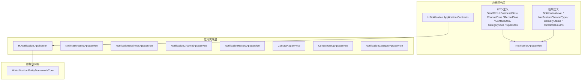
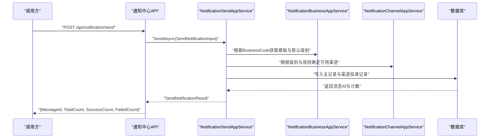
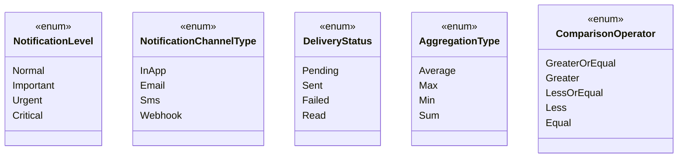
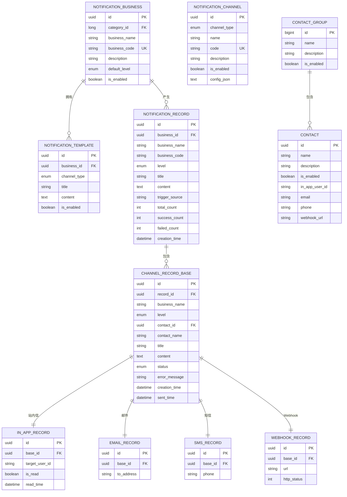

# 通知中心API

<cite>
**本文引用的文件**   
- [SendDtos.cs](file://src/Services/Notification/H.Notification.Application.Contracts/Dtos/SendDtos.cs)
- [SpecDtos.cs](file://src/Services/Notification/H.Notification.Application.Contracts/Dtos/SpecDtos.cs)
- [RecordDtos.cs](file://src/Services/Notification/H.Notification.Application.Contracts/Dtos/RecordDtos.cs)
- [ContactDtos.cs](file://src/Services/Notification/H.Notification.Application.Contracts/Dtos/ContactDtos.cs)
- [ChannelDtos.cs](file://src/Services/Notification/H.Notification.Application.Contracts/Dtos/ChannelDtos.cs)
- [CategoryDtos.cs](file://src/Services/Notification/H.Notification.Application.Contracts/Dtos/CategoryDtos.cs)
- [BusinessDtos.cs](file://src/Services/Notification/H.Notification.Application.Contracts/Dtos/BusinessDtos.cs)
- [ThresholdEnums.cs](file://src/Services/Notification/H.Notification.Application.Contracts/Enums/ThresholdEnums.cs)
- [DeliveryStatus.cs](file://src/Services/Notification/H.Notification.Application.Contracts/Enums/DeliveryStatus.cs)
- [NotificationChannelType.cs](file://src/Services/Notification/H.Notification.Application.Contracts/Enums/NotificationChannelType.cs)
- [NotificationLevel.cs](file://src/Services/Notification/H.Notification.Application.Contracts/Enums/NotificationLevel.cs)
- [INotificationAppService.cs](file://src/Services/Notification/H.Notification.Application.Contracts/Services/INotificationAppService.cs)
- [NotificationSendAppService.cs](file://src/Services/Notification/H.Notification.Application/Services/NotificationSendAppService.cs)
- [NotificationBusinessAppService.cs](file://src/Services/Notification/H.Notification.Application/Services/NotificationBusinessAppService.cs)
- [NotificationChannelAppService.cs](file://src/Services/Notification/H.Notification.Application/Services/NotificationChannelAppService.cs)
- [NotificationRecordAppService.cs](file://src/Services/Notification/H.Notification.Application/Services/NotificationRecordAppService.cs)
- [ContactAppService.cs](file://src/Services/Notification/H.Notification.Application/Services/ContactAppService.cs)
- [ContactGroupAppService.cs](file://src/Services/Notification/H.Notification.Application/Services/ContactGroupAppService.cs)
- [NotificationCategoryAppService.cs](file://src/Services/Notification/H.Notification.Application/Services/NotificationCategoryAppService.cs)
</cite>

## 目录
1. [简介](#简介)
2. [项目结构](#项目结构)
3. [核心组件](#核心组件)
4. [架构总览](#架构总览)
5. [详细接口文档](#详细接口文档)
6. [依赖与类型分析](#依赖与类型分析)
7. [性能与可靠性](#性能与可靠性)
8. [故障排查](#故障排查)
9. [结论](#结论)
10. [附录：错误码与最佳实践](#附录错误码与最佳实践)

## 简介
本文件为 H.AppLab 平台“通知中心”服务的 API 文档，覆盖以下能力：
- 通知发送：邮件、短信、站内信、Webhook 等渠道的统一触发与结果统计。
- 通知模板与业务配置：按业务编码+级别管理模板、变量替换与默认级别。
- 通知渠道配置：邮件服务器、短信网关、站内信与 Webhook 的通道定义与启用开关。
- 通知记录查询：主记录与渠道级投递记录的检索、筛选与分页。
- 联系人及分组管理：用于接收通知的目标人员、群组与批量选择。
- 实时推送说明：基于现有模型给出站内信实时推送建议（SignalR/WebSocket），并在实现缺失时明确标注。

本服务采用 ABP 风格的应用服务分层：Application.Contracts 暴露 DTO 与接口契约；Application 提供应用服务实现；EntityFrameworkCore 负责持久化；Web 层暴露 HTTP API。

## 项目结构
通知中心相关代码位于 Services/Notification 下，包含：
- Application.Contracts：DTO、枚举、应用服务接口。
- Application：应用服务实现，编排发送、模板、渠道、记录、联系人等业务逻辑。
- EntityFrameworkCore：数据库上下文与实体映射（迁移由 DbMigrator 工具维护）。
- Web：HTTP 控制器（在本仓库中未直接列出控制器文件，但可通过 Application.Contracts 接口推断 REST 端点命名约定）。

图表来源
- [INotificationAppService.cs](file://src/Services/Notification/H.Notification.Application.Contracts/Services/INotificationAppService.cs)
- [SendDtos.cs](file://src/Services/Notification/H.Notification.Application.Contracts/Dtos/SendDtos.cs)
- [BusinessDtos.cs](file://src/Services/Notification/H.Notification.Application.Contracts/Dtos/BusinessDtos.cs)
- [ChannelDtos.cs](file://src/Services/Notification/H.Notification.Application.Contracts/Dtos/ChannelDtos.cs)
- [RecordDtos.cs](file://src/Services/Notification/H.Notification.Application.Contracts/Dtos/RecordDtos.cs)
- [ContactDtos.cs](file://src/Services/Notification/H.Notification.Application.Contracts/Dtos/ContactDtos.cs)
- [CategoryDtos.cs](file://src/Services/Notification/H.Notification.Application.Contracts/Dtos/CategoryDtos.cs)
- [SpecDtos.cs](file://src/Services/Notification/H.Notification.Application.Contracts/Dtos/SpecDtos.cs)
- [NotificationChannelType.cs](file://src/Services/Notification/H.Notification.Application.Contracts/Enums/NotificationChannelType.cs)
- [NotificationLevel.cs](file://src/Services/Notification/H.Notification.Application.Contracts/Enums/NotificationLevel.cs)
- [DeliveryStatus.cs](file://src/Services/Notification/H.Notification.Application.Contracts/Enums/DeliveryStatus.cs)
- [ThresholdEnums.cs](file://src/Services/Notification/H.Notification.Application.Contracts/Enums/ThresholdEnums.cs)

章节来源
- [INotificationAppService.cs](file://src/Services/Notification/H.Notification.Application.Contracts/Services/INotificationAppService.cs)
- [SendDtos.cs:1-73](file://src/Services/Notification/H.Notification.Application.Contracts/Dtos/SendDtos.cs#L1-L73)
- [BusinessDtos.cs:1-95](file://src/Services/Notification/H.Notification.Application.Contracts/Dtos/BusinessDtos.cs#L1-L95)
- [ChannelDtos.cs:1-52](file://src/Services/Notification/H.Notification.Application.Contracts/Dtos/ChannelDtos.cs#L1-L52)
- [RecordDtos.cs:1-92](file://src/Services/Notification/H.Notification.Application.Contracts/Dtos/RecordDtos.cs#L1-L92)
- [ContactDtos.cs:1-122](file://src/Services/Notification/H.Notification.Application.Contracts/Dtos/ContactDtos.cs#L1-L122)
- [CategoryDtos.cs:1-41](file://src/Services/Notification/H.Notification.Application.Contracts/Dtos/CategoryDtos.cs#L1-L41)
- [SpecDtos.cs:1-49](file://src/Services/Notification/H.Notification.Application.Contracts/Dtos/SpecDtos.cs#L1-L49)

## 核心组件
- 发送服务 NotificationSendAppService：对外暴露统一发送入口，支持按业务编码、级别、模板变量进行渲染与分发。
- 业务与模板 NotificationBusinessAppService：管理业务编码、默认通知级别、模板集合。
- 渠道配置 NotificationChannelAppService：管理各渠道（站内信、邮件、短信、Webhook）的配置 JSON、启用状态。
- 通知记录 NotificationRecordAppService：查询主记录与渠道投递记录，支持分页、过滤。
- 联系人 ContactAppService / ContactGroupAppService：管理接收通知的联系人及其分组。
- 分类 NotificationCategoryAppService：对业务进行分类组织。

章节来源
- [NotificationSendAppService.cs](file://src/Services/Notification/H.Notification.Application/Services/NotificationSendAppService.cs)
- [NotificationBusinessAppService.cs](file://src/Services/Notification/H.Notification.Application/Services/NotificationBusinessAppService.cs)
- [NotificationChannelAppService.cs](file://src/Services/Notification/H.Notification.Application/Services/NotificationChannelAppService.cs)
- [NotificationRecordAppService.cs](file://src/Services/Notification/H.Notification.Application/Services/NotificationRecordAppService.cs)
- [ContactAppService.cs](file://src/Services/Notification/H.Notification.Application/Services/ContactAppService.cs)
- [ContactGroupAppService.cs](file://src/Services/Notification/H.Notification.Application/Services/ContactGroupAppService.cs)
- [NotificationCategoryAppService.cs](file://src/Services/Notification/H.Notification.Application/Services/NotificationCategoryAppService.cs)

## 架构总览
通知中心以“业务编码 + 通知级别 + 模板变量”作为触发三要素，通过渠道配置与联系人组解析目标收件人，最终落库生成主记录与渠道投递记录。

图表来源
- [INotificationAppService.cs](file://src/Services/Notification/H.Notification.Application.Contracts/Services/INotificationAppService.cs)
- [NotificationSendAppService.cs](file://src/Services/Notification/H.Notification.Application/Services/NotificationSendAppService.cs)
- [SendDtos.cs:1-73](file://src/Services/Notification/H.Notification.Application.Contracts/Dtos/SendDtos.cs#L1-L73)

## 详细接口文档

### 通用约定
- 基础路径：/api/notification
- 认证：遵循平台统一鉴权机制（ABP 标准）。
- 分页参数：继承 PagedResultRequestDto（如 SkipCount、MaxResultCount、Sorting 等）。
- 通用响应：成功返回具体 DTO；失败返回 ABP 标准错误信息。

#### 1) 通知发送与测试

- 发送通知
  - 方法：POST
  - 路径：/api/notification/send
  - 请求体：SendNotificationInput
    - businessCode：必填，字符串，业务编码。
    - level：可选，NotificationLevel，为空则使用业务默认级别。
    - data：键值对字典，用于模板 {{key}} 占位符替换。
    - recipientIds：可选，Guid 列表，指定通知人；为空时使用业务绑定的联系人组。
  - 响应：SendNotificationResult
    - messageId：生成的通知消息ID（可空）。
    - totalCount：投递总数。
    - successCount：成功数。
    - failedCount：失败数。
    - message：提示信息。

- 测试发送
  - 方法：POST
  - 路径：/api/notification/test-send
  - 请求体：TestSendInput
    - businessCode：必填。
    - level：可选。
    - data：可选，模板变量。
    - recipientIds：可选，指定测试收件人。
  - 响应：SendNotificationResult

章节来源
- [SendDtos.cs:1-73](file://src/Services/Notification/H.Notification.Application.Contracts/Dtos/SendDtos.cs#L1-L73)
- [NotificationSendAppService.cs](file://src/Services/Notification/H.Notification.Application/Services/NotificationSendAppService.cs)

#### 2) 通知业务与模板管理

- 创建通知业务
  - 方法：POST
  - 路径：/api/notification/business
  - 请求体：CreateNotificationBusinessDto
    - categoryId：必填，所属分类ID。
    - businessName：必填，业务名称。
    - codeSuffix：必填，3-16位小写字母后缀；系统拼接为 “categoryId-suffix”。
    - description：可选。
    - defaultLevel：可选，NotificationLevel，默认 Normal。
    - isEnabled：可选，布尔，默认 true。
    - templates：可选，NotificationTemplateDto 列表。
  - 响应：NotificationBusinessDto（含完整 BusinessCode、Templates、ConfiguredChannels、GroupCount）。

- 更新通知业务
  - 方法：PUT
  - 路径：/api/notification/business/{id}
  - 请求体：UpdateNotificationBusinessDto
  - 响应：NotificationBusinessDto

- 查询通知业务
  - 方法：GET
  - 路径：/api/notification/business
  - 查询参数：NotificationBusinessQueryDto（filter、categoryId、分页参数）。
  - 响应：分页的 NotificationBusinessDto 列表。

- 删除通知业务
  - 方法：DELETE
  - 路径：/api/notification/business/{id}
  - 响应：无内容或操作结果。

- 模板说明
  - 模板属于业务对象的一部分，按渠道类型区分：InApp、Email、Sms、Webhook。
  - 模板内容支持变量替换，变量来源于 SendNotificationInput.data。
  - 模板在业务 DTO 中以 Templates 字段聚合展示。

章节来源
- [BusinessDtos.cs:1-95](file://src/Services/Notification/H.Notification.Application.Contracts/Dtos/BusinessDtos.cs#L1-L95)
- [NotificationBusinessAppService.cs](file://src/Services/Notification/H.Notification.Application/Services/NotificationBusinessAppService.cs)

#### 3) 通知渠道配置管理

- 创建渠道
  - 方法：POST
  - 路径：/api/notification/channel
  - 请求体：CreateNotificationChannelDto
    - channelType：必填，NotificationChannelType。
    - name：必填。
    - code：必填，渠道编码。
    - description：可选。
    - isEnabled：可选，默认 true。
    - configJson：可选，JSON 字符串，存储 provider 所需参数（如 SMTP、短信网关密钥等）。
  - 响应：NotificationChannelDto

- 更新渠道
  - 方法：PUT
  - 路径：/api/notification/channel/{id}
  - 请求体：UpdateNotificationChannelDto
  - 响应：NotificationChannelDto

- 查询渠道
  - 方法：GET
  - 路径：/api/notification/channel
  - 查询参数：NotificationChannelQueryDto（filter、分页参数）。
  - 响应：分页的 NotificationChannelDto 列表。

- 删除渠道
  - 方法：DELETE
  - 路径：/api/notification/channel/{id}
  - 响应：无内容或操作结果。

章节来源
- [ChannelDtos.cs:1-52](file://src/Services/Notification/H.Notification.Application.Contracts/Dtos/ChannelDtos.cs#L1-L52)
- [NotificationChannelAppService.cs](file://src/Services/Notification/H.Notification.Application/Services/NotificationChannelAppService.cs)

#### 4) 通知记录查询

- 查询主记录
  - 方法：GET
  - 路径：/api/notification/record
  - 查询参数：NotificationRecordQueryDto
    - businessId：可选。
    - level：可选，NotificationLevel。
    - 分页参数。
  - 响应：分页的 NotificationRecordDto 列表，包含 title、content、triggerSource、count 汇总等。

- 查询渠道投递记录
  - 方法：GET
  - 路径：/api/notification/channel-record
  - 查询参数：ChannelRecordQueryDto
    - status：可选，DeliveryStatus。
    - filter：可选，模糊搜索。
    - 分页参数。
  - 响应：分页的渠道记录，根据渠道类型不同返回：
    - InAppRecordDto：含 targetUserId、isRead、readTime。
    - EmailRecordDto：含 toAddress。
    - SmsRecordDto：含 phone。
    - WebhookRecordDto：含 url、httpStatus。

章节来源
- [RecordDtos.cs:1-92](file://src/Services/Notification/H.Notification.Application.Contracts/Dtos/RecordDtos.cs#L1-L92)
- [NotificationRecordAppService.cs](file://src/Services/Notification/H.Notification.Application/Services/NotificationRecordAppService.cs)

#### 5) 联系人及分组管理

- 联系人 CRUD
  - 创建：POST /api/notification/contact，请求体 CreateContactDto。
  - 更新：PUT /api/notification/contact/{id}，请求体 UpdateContactDto。
  - 查询：GET /api/notification/contact，查询参数 ContactQueryDto（filter、groupId、分页）。
  - 删除：DELETE /api/notification/contact/{id}。
  - 响应：ContactDto，包含 inAppUserId、email、phone、webhookUrl、groupIds。

- 联系人分组 CRUD
  - 创建：POST /api/notification/contact-group，请求体 CreateContactGroupDto。
  - 更新：PUT /api/notification/contact-group/{id}，请求体 UpdateContactGroupDto。
  - 查询：GET /api/notification/contact-group，查询参数 ContactGroupQueryDto（filter、分页）。
  - 删除：DELETE /api/notification/contact-group/{id}。
  - 响应：ContactGroupDto，包含 contactCount、contactIds（GetAsync 时填充）。

章节来源
- [ContactDtos.cs:1-122](file://src/Services/Notification/H.Notification.Application.Contracts/Dtos/ContactDtos.cs#L1-L122)
- [ContactAppService.cs](file://src/Services/Notification/H.Notification.Application/Services/ContactAppService.cs)
- [ContactGroupAppService.cs](file://src/Services/Notification/H.Notification.Application/Services/ContactGroupAppService.cs)

#### 6) 通知分类管理

- 分类 CRUD
  - 创建：POST /api/notification/category，请求体 CreateNotificationCategoryDto。
  - 更新：PUT /api/notification/category/{id}，请求体 UpdateNotificationCategoryDto。
  - 查询：GET /api/notification/category，分页。
  - 删除：DELETE /api/notification/category/{id}。
  - 响应：NotificationCategoryDto，包含 businessCount。

章节来源
- [CategoryDtos.cs:1-41](file://src/Services/Notification/H.Notification.Application.Contracts/Dtos/CategoryDtos.cs#L1-L41)
- [NotificationCategoryAppService.cs](file://src/Services/Notification/H.Notification.Application/Services/NotificationCategoryAppService.cs)

#### 7) 阈值告警规则（Spec）

- 说明
  - 该模块用于定义“某业务在某级别下的渠道与阈值告警配置”，包括连续周期数、单周期时长、聚合方式、比较运算符与阈值。
  - 适用于周期性指标触发通知的场景。
- DTO
  - NotificationSpecDto：包含 id、level、isEnabled、channels、consecutivePeriods、periodMinutes、aggregation、comparison、threshold。

章节来源
- [SpecDtos.cs:1-49](file://src/Services/Notification/H.Notification.Application.Contracts/Dtos/SpecDtos.cs#L1-L49)
- [ThresholdEnums.cs:1-58](file://src/Services/Notification/H.Notification.Application.Contracts/Enums/ThresholdEnums.cs#L1-L58)

## 依赖与类型分析

### 枚举定义
- NotificationLevel：Normal、Important、Urgent、Critical。
- NotificationChannelType：InApp、Email、Sms、Webhook。
- DeliveryStatus：Pending、Sent、Failed、Read（仅站内信）。
- AggregationType：Average、Max、Min、Sum。
- ComparisonOperator：GreaterOrEqual、Greater、LessOrEqual、Less、Equal。

图表来源
- [NotificationLevel.cs](file://src/Services/Notification/H.Notification.Application.Contracts/Enums/NotificationLevel.cs)
- [NotificationChannelType.cs](file://src/Services/Notification/H.Notification.Application.Contracts/Enums/NotificationChannelType.cs)
- [DeliveryStatus.cs](file://src/Services/Notification/H.Notification.Application.Contracts/Enums/DeliveryStatus.cs)
- [ThresholdEnums.cs:1-58](file://src/Services/Notification/H.Notification.Application.Contracts/Enums/ThresholdEnums.cs#L1-L58)

### 关键数据模型关系

图表来源
- [BusinessDtos.cs:1-95](file://src/Services/Notification/H.Notification.Application.Contracts/Dtos/BusinessDtos.cs#L1-L95)
- [ChannelDtos.cs:1-52](file://src/Services/Notification/H.Notification.Application.Contracts/Dtos/ChannelDtos.cs#L1-L52)
- [RecordDtos.cs:1-92](file://src/Services/Notification/H.Notification.Application.Contracts/Dtos/RecordDtos.cs#L1-L92)
- [ContactDtos.cs:1-122](file://src/Services/Notification/H.Notification.Application.Contracts/Dtos/ContactDtos.cs#L1-L122)

## 性能与可靠性

- 异步处理
  - 发送流程应使用异步 IO（SMTP、短信网关、HTTP Webhook）以减少阻塞。
  - 推荐将消息入队（如后台任务队列）再消费，避免同步调用第三方通道造成超时。

- 重试机制
  - 对瞬时失败（网络抖动、限流）实施指数退避重试。
  - 区分可重试与不可重试错误，避免无限重试。
  - 重试次数与间隔应可配置，并与渠道配置解耦。

- 送达状态跟踪
  - 每次尝试均写入渠道投递记录，包含 status、errorMessage、sentTime、httpStatus（Webhook）。
  - 对站内信增加 readTime 与 isRead 标记，便于前端展示已读状态。

- 批量发送优化
  - 按渠道合并同批目标，减少重复连接与鉴权开销。
  - 对邮件/短信网关进行节流控制，避免触发供应商限流。

[本节为通用指导，不直接分析具体源码文件]

## 故障排查

- 常见问题
  - 模板变量缺失：data 中缺少模板占位符对应的 key，导致渲染失败。
  - 渠道未启用：channel.isEnabled=false 时不会投递。
  - 联系人无效：inAppUserId/email/phone/webhookUrl 为空或格式错误。
  - 网关限流或认证失败：检查 configJson 配置与凭据有效性。

- 定位手段
  - 通过 NotificationRecordAppService 查询主记录，确认 totalCount/successCount/failedCount。
  - 通过 ChannelRecordQueryDto 筛选 DeliveryStatus=Failed 的记录，查看 errorMessage 与 httpStatus。
  - 对 Webhook 渠道，关注返回的 HttpStatus 判断服务端是否接受回调。

章节来源
- [RecordDtos.cs:1-92](file://src/Services/Notification/H.Notification.Application.Contracts/Dtos/RecordDtos.cs#L1-L92)
- [NotificationRecordAppService.cs](file://src/Services/Notification/H.Notification.Application/Services/NotificationRecordAppService.cs)

## 结论
通知中心提供了跨渠道的统一通知能力，并通过业务编码与模板变量实现了灵活的通知内容渲染。结合联系人分组与渠道配置，可实现精细化的通知策略。建议在集成阶段优先完成渠道配置与联系人准备，随后通过测试发送验证模板变量替换，最后在生产环境启用异步与重试机制以提升稳定性。

## 附录：错误码与最佳实践

- 常见错误
  - 业务编码不存在：校验 BusinessCode 是否存在且启用。
  - 渠道配置缺失：确保对应渠道已配置并启用。
  - 权限不足：检查调用方是否具有相应资源访问权限。
  - 模板变量不完整：补齐 data 中的必要键值。

- 最佳实践
  - 模板设计：保持模板简洁，避免过长正文；使用变量提升复用性。
  - 渠道选择：根据紧急程度选择合适的渠道组合（如紧急用站内信+短信）。
  - 监控与审计：定期导出投递记录，分析成功率与失败原因。
  - 安全：敏感配置（如 SMTP 密码、短信密钥）建议使用加密存储或外部密钥管理服务。

[本节为通用指导，不直接分析具体源码文件]