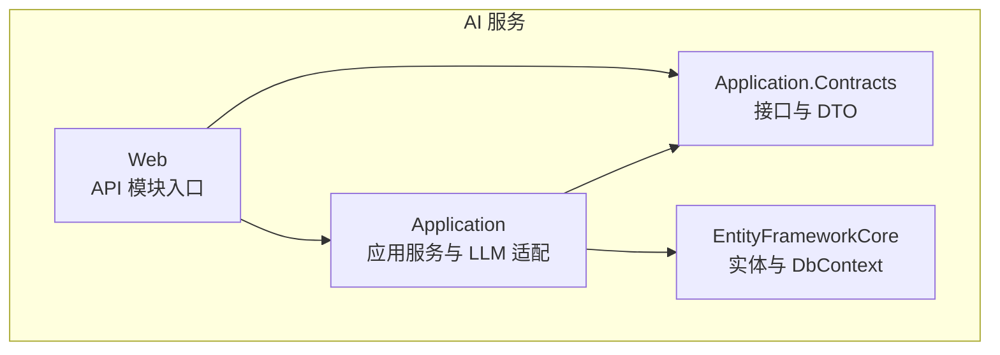
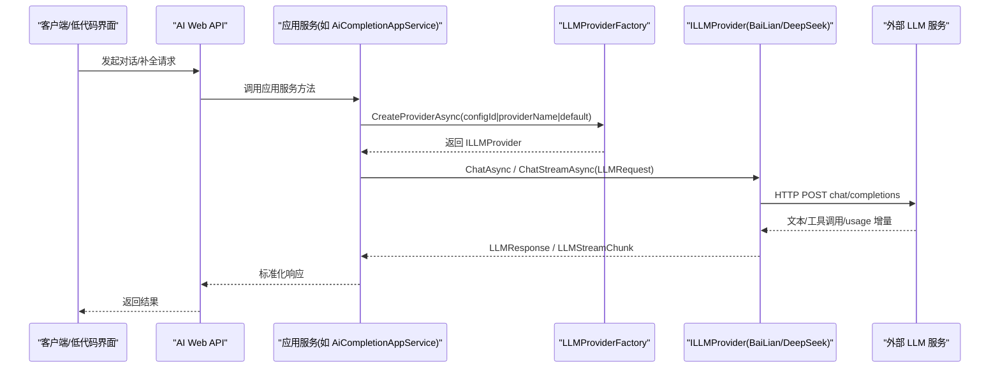
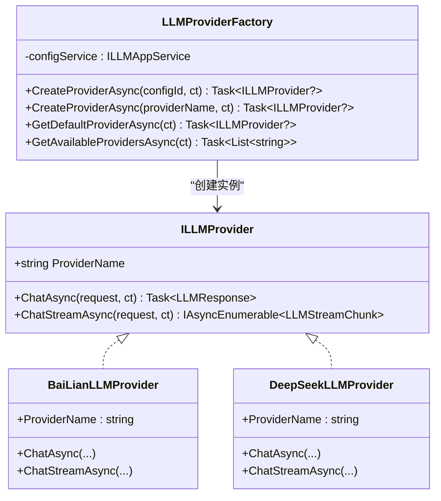
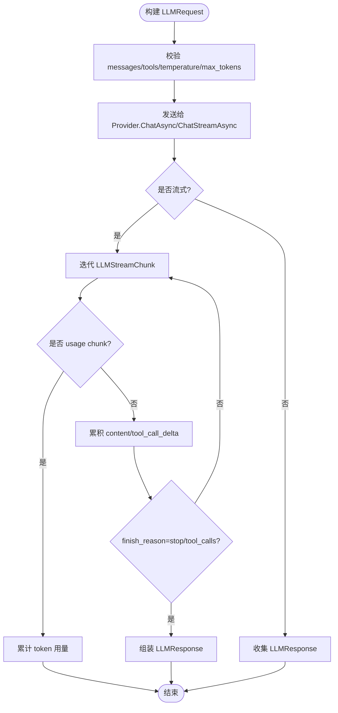
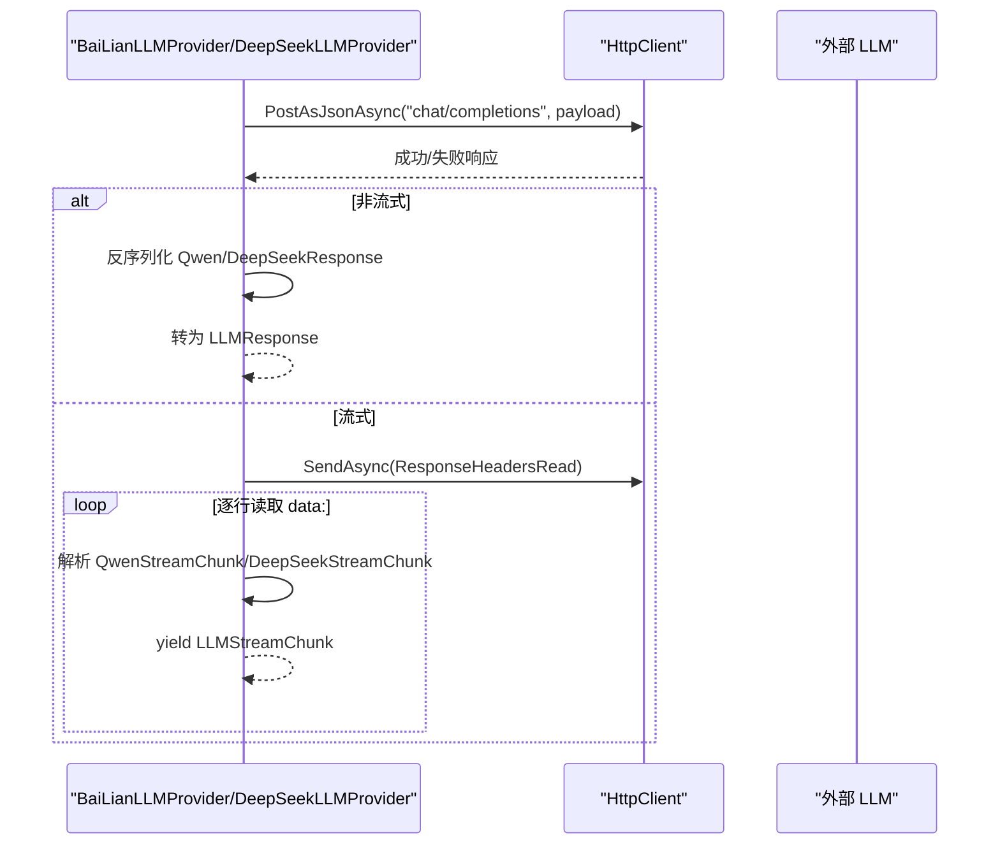
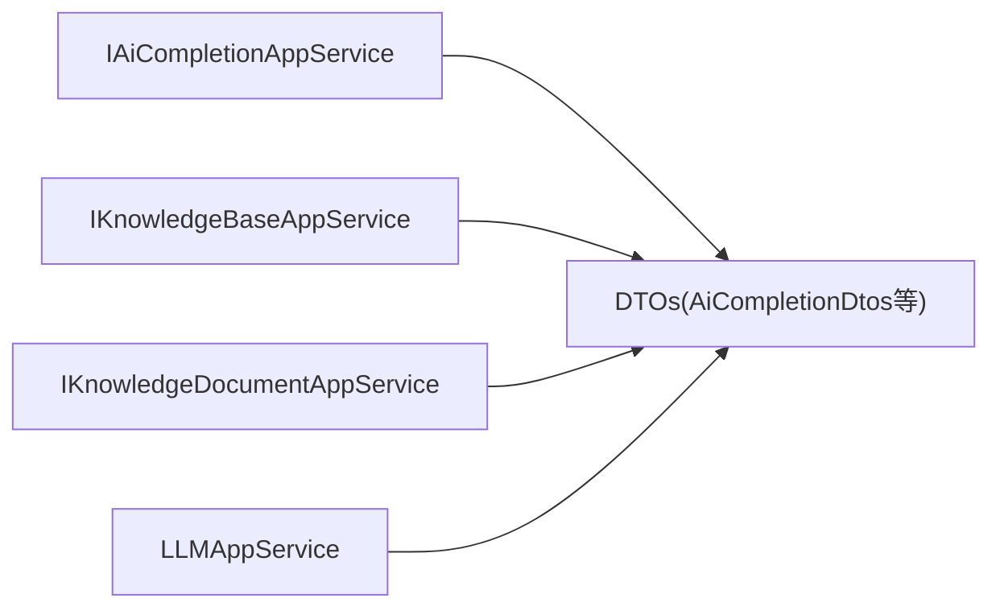
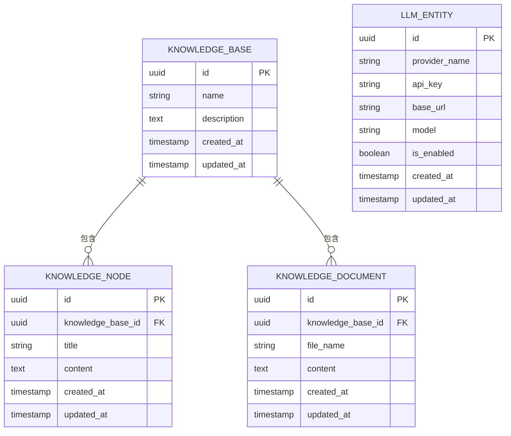
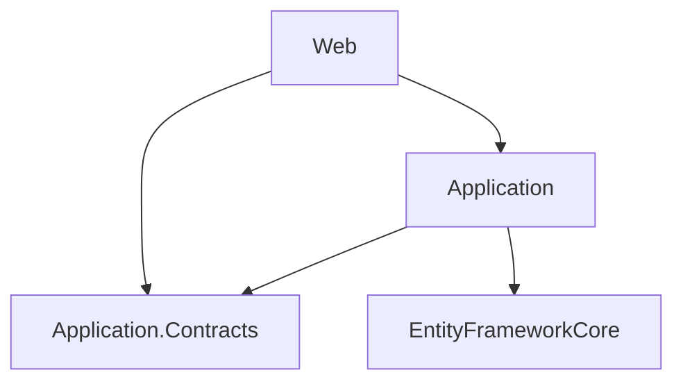
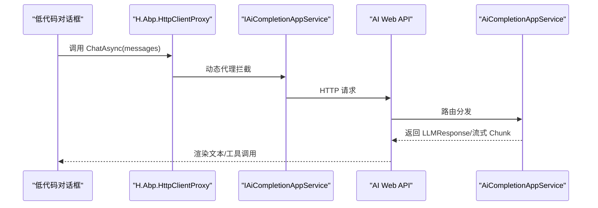

# AI服务

<cite>
**本文引用的文件**   
- [README.md](file://README.md)
- [AIApplicationContractsModule.cs](file://src/Services/AI/H.AI.Application.Contracts/AIApplicationContractsModule.cs)
- [ILLMProvider.cs](file://src/Services/AI/H.AI.Application/Llm/ILLMProvider.cs)
- [LLMProviderFactory.cs](file://src/Services/AI/H.AI.Application/Llm/LLMProviderFactory.cs)
- [LLMRequest.cs](file://src/Services/AI/H.AI.Application/Llm/LLMRequest.cs)
- [LLMResponse.cs](file://src/Services/AI/H.AI.Application/Llm/LLMResponse.cs)
- [LLMStreamChunk.cs](file://src/Services/AI/H.AI.Application/Llm/LLMStreamChunk.cs)
- [BaiLianLLMProvider.cs](file://src/Services/AI/H.AI.Application/Llm/Providers/BaiLianLLMProvider.cs)
- [DeepSeekLLMProvider.cs](file://src/Services/AI/H.AI.Application/Llm/Providers/DeepSeekLLMProvider.cs)
- [AiCompletionDtos.cs](file://src/Services/AI/H.AI.Application.Contracts/Dtos/Ai/AiCompletionDtos.cs)
- [IAiCompletionAppService.cs](file://src/Services/AI/H.AI.Application.Contracts/Services/Ai/IAiCompletionAppService.cs)
- [CreateKnowledgeBaseDto.cs](file://src/Services/AI/H.AI.Application.Contracts/Dtos/Knowledge/CreateKnowledgeBaseDto.cs)
- [UpdateKnowledgeBaseDto.cs](file://src/Services/AI/H.AI.Application.Contracts/Dtos/Knowledge/UpdateKnowledgeBaseDto.cs)
- [KnowledgeBaseDto.cs](file://src/Services/AI/H.AI.Application.Contracts/Dtos/Knowledge/KnowledgeBaseDto.cs)
- [CreateKnowledgeNodeDto.cs](file://src/Services/AI/H.AI.Application.Contracts/Dtos/Knowledge/CreateKnowledgeNodeDto.cs)
- [UpdateKnowledgeNodeDto.cs](file://src/Services/AI/H.AI.Application.Contracts/Dtos/Knowledge/UpdateKnowledgeNodeDto.cs)
- [KnowledgeNodeDto.cs](file://src/Services/AI/H.AI.Application.Contracts/Dtos/Knowledge/KnowledgeNodeDto.cs)
- [SaveKnowledgeDocumentDto.cs](file://src/Services/AI/H.AI.Application.Contracts/Dtos/Knowledge/SaveKnowledgeDocumentDto.cs)
- [KnowledgeDocumentDto.cs](file://src/Services/AI/H.AI.Application.Contracts/Dtos/Knowledge/KnowledgeDocumentDto.cs)
- [IKnowledgeBaseAppService.cs](file://src/Services/AI/H.AI.Application.Contracts/Services/Knowledge/IKnowledgeBaseAppService.cs)
- [IKnowledgeDocumentAppService.cs](file://src/Services/AI/H.AI.Application.Contracts/Services/Knowledge/IKnowledgeDocumentAppService.cs)
- [KnowledgeBaseEntity.cs](file://src/Services/AI/H.AI.EntityFrameworkCore/Entities/KnowledgeBaseEntity.cs)
- [KnowledgeNodeEntity.cs](file://src/Services/AI/H.AI.EntityFrameworkCore/Entities/KnowledgeNodeEntity.cs)
- [KnowledgeDocumentEntity.cs](file://src/Services/AI/H.AI.EntityFrameworkCore/Entities/KnowledgeDocumentEntity.cs)
- [LLMEntity.cs](file://src/Services/AI/H.AI.EntityFrameworkCore/Entities/LLMEntity.cs)
- [AIDbContext.cs](file://src/Services/AI/H.AI.EntityFrameworkCore/AIDbContext.cs)
- [AIEntityFrameworkCoreModule.cs](file://src/Services/AI/H.AI.EntityFrameworkCore/AIEntityFrameworkCoreModule.cs)
- [AIMapperProfile.cs](file://src/Services/AI/H.AI.Application\Mapping/AIMapperProfile.cs)
- [AIWebModule.cs](file://src/Services/AI/H.AI.Web/AIWebModule.cs)
- [H.AI.Application.Contracts.csproj](file://src/Services/AI/H.AI.Application.Contracts/H.AI.Application.Contracts.csproj)
- [H.AI.Application.csproj](file://src/Services/AI/H.AI.Application/H.AI.Application.csproj)
- [H.AI.EntityFrameworkCore.csproj](file://src/Services/AI/H.AI.EntityFrameworkCore/H.AI.EntityFrameworkCore.csproj)
- [H.AI.Web.csproj](file://src/Services/AI/H.AI.Web/H.AI.Web.csproj)
</cite>

## 目录
1. [简介](#简介)
2. [项目结构](#项目结构)
3. [核心组件](#核心组件)
4. [架构总览](#架构总览)
5. [详细组件分析](#详细组件分析)
6. [依赖关系分析](#依赖关系分析)
7. [性能与可靠性优化](#性能与可靠性优化)
8. [使用示例与场景](#使用示例与场景)
9. [低代码平台集成方式](#低代码平台集成方式)
10. [故障排查指南](#故障排查指南)
11. [结论](#结论)

## 简介
本模块为 H.AppLab 的 AI 服务，围绕大语言模型（LLM）集成、对话能力封装、知识库管理以及应用契约层展开。整体采用 ABP 风格的服务分层：Application.Contracts 暴露接口与数据传输对象，Application 实现业务逻辑与 LLM 适配，EntityFrameworkCore 负责实体与数据库映射，Web 提供 HTTP API 注册入口。README 说明该项目基于 .NET + Blazor，支持模块化单体与按服务独立部署，且前端通过动态 HttpClient 代理调用 IAppService 接口。

## 项目结构
AI 服务由四个程序集组成：
- Application.Contracts：对外契约、DTO、应用服务接口
- Application：领域应用服务、LLM Provider 抽象与实现、映射配置
- EntityFrameworkCore：实体、DbContext、EF Core 模块
- Web：HTTP API 模块入口

**图表来源**
- [AIApplicationContractsModule.cs:1-9](file://src/Services/AI/H.AI.Application.Contracts/AIApplicationContractsModule.cs#L1-L9)
- [H.AI.Application.Contracts.csproj](file://src/Services/AI/H.AI.Application.Contracts/H.AI.Application.Contracts.csproj)
- [H.AI.Application.csproj](file://src/Services/AI/H.AI.Application/H.AI.Application.csproj)
- [H.AI.EntityFrameworkCore.csproj](file://src/Services/AI/H.AI.EntityFrameworkCore/H.AI.EntityFrameworkCore.csproj)
- [H.AI.Web.csproj](file://src/Services/AI/H.AI.Web/H.AI.Web.csproj)

**章节来源**
- [README.md:1-73](file://README.md#L1-L73)

## 核心组件
- LLM Provider 抽象与工厂
  - ILLMProvider：统一同步与流式对话接口，包含 ProviderName、ChatAsync、ChatStreamAsync
  - LLMProviderFactory：根据配置 ID、ProviderName 或默认配置创建具体 Provider，并列出可用 Provider 名称
- LLM 请求/响应模型
  - LLMRequest：包含 Model、Messages、Temperature、MaxTokens、Tools
  - LLMResponse：包含 Content、Model、UsageTokens、PromptTokens、CompletionTokens、ToolCalls
  - LLMStreamChunk：流式增量内容、工具调用增量、FinishReason、Usage
  - ToolCall、FunctionCall、Message、ToolDefinition、FunctionDefinition：OpenAI 兼容协议相关结构
- Provider 实现
  - BaiLianLLMProvider：阿里云百炼 DashScope 兼容实现
  - DeepSeekLLMProvider：DeepSeek 兼容实现
- 应用服务
  - IAiCompletionAppService 与 AiCompletionDtos：智能问答与补全契约
  - IKnowledgeBaseAppService / IKnowledgeDocumentAppService：知识库与文档契约
  - LLMAppService：LLM 凭据与应用侧编排服务（路径存在，未读取实现）
- 数据层
  - AIDbContext、KnowledgeBaseEntity、KnowledgeNodeEntity、KnowledgeDocumentEntity、LLMEntity
  - AIMapperProfile：DTO 与实体映射
  - AIEntityFrameworkCoreModule：EF Core 模块注册

**章节来源**
- [ILLMProvider.cs:1-22](file://src/Services/AI/H.AI.Application/Llm/ILLMProvider.cs#L1-L22)
- [LLMProviderFactory.cs:1-72](file://src/Services/AI/H.AI.Application/Llm/LLMProviderFactory.cs#L1-L72)
- [LLMRequest.cs:1-57](file://src/Services/AI/H.AI.Application/Llm/LLMRequest.cs#L1-L57)
- [LLMResponse.cs:1-40](file://src/Services/AI/H.AI.Application/Llm/LLMResponse.cs#L1-L40)
- [LLMStreamChunk.cs:1-39](file://src/Services/AI/H.AI.Application/Llm/LLMStreamChunk.cs#L1-L39)
- [BaiLianLLMProvider.cs:1-261](file://src/Services/AI/H.AI.Application/Llm/Providers/BaiLianLLMProvider.cs#L1-L261)
- [DeepSeekLLMProvider.cs:1-261](file://src/Services/AI/H.AI.Application/Llm/Providers/DeepSeekLLMProvider.cs#L1-L261)

## 架构总览
AI 服务通过 Application.Contracts 暴露接口，Application 层实现业务与 LLM 适配，EntityFrameworkCore 持久化知识库与 LLM 配置，Web 层注册 API。LLM 调用链路从应用服务到 Provider 工厂再到具体 Provider，最终通过 HTTP 与外部 LLM 服务交互。

**图表来源**
- [LLMProviderFactory.cs:1-72](file://src/Services/AI/H.AI.Application/Llm/LLMProviderFactory.cs#L1-L72)
- [BaiLianLLMProvider.cs:1-261](file://src/Services/AI/H.AI.Application/Llm/Providers/BaiLianLLMProvider.cs#L1-L261)
- [DeepSeekLLMProvider.cs:1-261](file://src/Services/AI/H.Application/Llm/Providers/DeepSeekLLMProvider.cs#L1-L261)

## 详细组件分析

### LLM Provider 抽象与工厂
- ILLMProvider 定义 ProviderName、同步 ChatAsync 与流式 ChatStreamAsync；所有 Provider 需实现该接口以接入统一调用面。
- LLMProviderFactory 通过 ILLMAppService 获取凭据配置，按 ProviderName 分发到 BaiLianLLMProvider 或 DeepSeekLLMProvider；若配置无效则返回 null，交由上层进行回退处理。
- 工厂同时提供 GetAvailableProvidersAsync，用于前端选择可用 Provider。

**图表来源**
- [ILLMProvider.cs:1-22](file://src/Services/AI/H.AI.Application/Llm/ILLMProvider.cs#L1-L22)
- [LLMProviderFactory.cs:1-72](file://src/Services/AI/H.AI.Application/Llm/LLMProviderFactory.cs#L1-L72)
- [BaiLianLLMProvider.cs:1-261](file://src/Services/AI/H.AI.Application/Llm/Providers/BaiLianLLMProvider.cs#L1-L261)
- [DeepSeekLLMProvider.cs:1-261](file://src/Services/AI/H.AI.Application/Llm/Providers/DeepSeekLLMProvider.cs#L1-L261)

**章节来源**
- [ILLMProvider.cs:1-22](file://src/Services/AI/H.AI.Application/Llm/ILLMProvider.cs#L1-L22)
- [LLMProviderFactory.cs:1-72](file://src/Services/AI/H.AI.Application/Llm/LLMProviderFactory.cs#L1-L72)

### LLM 请求、响应与流式增量
- LLMRequest 承载 model、messages、temperature、max_tokens、tools，支持 OpenAI 风格的 tool_calls 与 function 定义。
- LLMResponse 聚合最终文本、模型名、token 用量及工具调用列表。
- LLMStreamChunk 表示流式增量：content、tool_call_delta、finish_reason、usage；当 choices 为空时携带 usage chunk。
- ToolCallDelta 支持增量拼装工具调用参数。

**图表来源**
- [LLMRequest.cs:1-57](file://src/Services/AI/H.AI.Application/Llm/LLMRequest.cs#L1-L57)
- [LLMResponse.cs:1-40](file://src/Services/AI/H.AI.Application/Llm/LLMResponse.cs#L1-L40)
- [LLMStreamChunk.cs:1-39](file://src/Services/AI/H.AI.Application/Llm/LLMStreamChunk.cs#L1-L39)

**章节来源**
- [LLMRequest.cs:1-57](file://src/Services/AI/H.AI.Application/Llm/LLMRequest.cs#L1-L57)
- [LLMResponse.cs:1-40](file://src/Services/AI/H.AI.Application/Llm/LLMResponse.cs#L1-L40)
- [LLMStreamChunk.cs:1-39](file://src/Services/AI/H.AI.Application/Llm/LLMStreamChunk.cs#L1-L39)

### Provider 实现：百炼与 DeepSeek
两个 Provider 都遵循相同模式：
- 构造 HttpClient 并设置 Authorization 与 BaseAddress
- 非流式：POST chat/completions 或 v1/chat/completions，反序列化为各自 Response 类型后转换为 LLMResponse
- 流式：使用 ResponseHeadersRead 读取 SSE data: 行，解析增量，提取 content、tool_calls delta、finish_reason、usage
- 均支持 tools、temperature、max_tokens、stream_options.include_usage

**图表来源**
- [BaiLianLLMProvider.cs:1-261](file://src/Services/AI/H.AI.Application/Llm/Providers/BaiLianLLMProvider.cs#L1-L261)
- [DeepSeekLLMProvider.cs:1-261](file://src/Services/AI/H.Application/Llm/Providers/DeepSeekLLMProvider.cs#L1-L261)

**章节来源**
- [BaiLianLLMProvider.cs:1-261](file://src/Services/AI/H.AI.Application/Llm/Providers/BaiLianLLMProvider.cs#L1-L261)
- [DeepSeekLLMProvider.cs:1-261](file://src/Services/AI/H.AI.Application/Llm/Providers/DeepSeekLLMProvider.cs#L1-L261)

### 应用服务与契约
- IAiCompletionAppService 与 AiCompletionDtos：定义智能问答与补全接口与 DTO，供上层应用（如 Workbench AI 应用）调用。
- IKnowledgeBaseAppService 与 IKnowledgeDocumentAppService：定义知识库与文档的 CRUD 与保存接口。
- LLMAppService：对 LLM 配置与服务编排的应用服务（路径存在）。
- AIApplicationContractsModule：契约程序集标记类，便于程序集定位。

**图表来源**
- [IAiCompletionAppService.cs](file://src/Services/AI/H.AI.Application.Contracts/Services/Ai/IAiCompletionAppService.cs)
- [AiCompletionDtos.cs](file://src/Services/AI/H.AI.Application.Contracts/Dtos/Ai/AiCompletionDtos.cs)
- [IKnowledgeBaseAppService.cs](file://src/Services/AI/H.AI.Application.Contracts/Services/Knowledge/IKnowledgeBaseAppService.cs)
- [IKnowledgeDocumentAppService.cs](file://src/Services/AI/H.AI.Application.Contracts/Services/Knowledge/IKnowledgeDocumentAppService.cs)
- [AIApplicationContractsModule.cs:1-9](file://src/Services/AI/H.AI.Application.Contracts/AIApplicationContractsModule.cs#L1-L9)

**章节来源**
- [AIApplicationContractsModule.cs:1-9](file://src/Services/AI/H.AI.Application.Contracts/AIApplicationContractsModule.cs#L1-L9)
- [IAiCompletionAppService.cs](file://src/Services/AI/H.AI.Application.Contracts/Services/Ai/IAiCompletionAppService.cs)
- [AiCompletionDtos.cs](file://src/Services/AI/H.AI.Application.Contracts/Dtos/Ai/AiCompletionDtos.cs)
- [IKnowledgeBaseAppService.cs](file://src/Services/AI/H.AI.Application.Contracts/Services/Knowledge/IKnowledgeBaseAppService.cs)
- [IKnowledgeDocumentAppService.cs](file://src/Services/AI/H.AI.Application.Contracts/Services/Knowledge/IKnowledgeDocumentAppService.cs)

### 数据模型与持久化
- KnowledgeBaseEntity、KnowledgeNodeEntity、KnowledgeDocumentEntity：知识库、节点与文档实体
- LLMEntity：LLM 凭据与配置实体
- AIDbContext：AI 服务专属 DbContext
- AIMapperProfile：DTO 与实体映射配置
- AIEntityFrameworkCoreModule：EF Core 模块注册

**图表来源**
- [KnowledgeBaseEntity.cs](file://src/Services/AI/H.AI.EntityFrameworkCore/Entities/KnowledgeBaseEntity.cs)
- [KnowledgeNodeEntity.cs](file://src/Services/AI/H.AI.EntityFrameworkCore/Entities/KnowledgeNodeEntity.cs)
- [KnowledgeDocumentEntity.cs](file://src/Services/AI/H.AI.EntityFrameworkCore/Entities/KnowledgeDocumentEntity.cs)
- [LLMEntity.cs](file://src/Services/AI/H.AI.EntityFrameworkCore/Entities/LLMEntity.cs)
- [AIDbContext.cs](file://src/Services/AI/H.AI.EntityFrameworkCore/AIDbContext.cs)
- [AIMapperProfile.cs](file://src/Services/AI/H.AI.Application\Mapping/AIMapperProfile.cs)
- [AIEntityFrameworkCoreModule.cs](file://src/Services/AI/H.AI.EntityFrameworkCore/AIEntityFrameworkCoreModule.cs)

**章节来源**
- [KnowledgeBaseEntity.cs](file://src/Services/AI/H.AI.EntityFrameworkCore/Entities/KnowledgeBaseEntity.cs)
- [KnowledgeNodeEntity.cs](file://src/Services/AI/H.AI.EntityFrameworkCore/Entities/KnowledgeNodeEntity.cs)
- [KnowledgeDocumentEntity.cs](file://src/Services/AI/H.AI.EntityFrameworkCore/Entities/KnowledgeDocumentEntity.cs)
- [LLMEntity.cs](file://src/Services/AI/H.AI.EntityFrameworkCore/Entities/LLMEntity.cs)
- [AIDbContext.cs](file://src/Services/AI/H.AI.EntityFrameworkCore/AIDbContext.cs)
- [AIMapperProfile.cs](file://src/Services/AI/H.AI.Application\Mapping/AIMapperProfile.cs)
- [AIEntityFrameworkCoreModule.cs](file://src/Services/AI/H.AI.EntityFrameworkCore/AIEntityFrameworkCoreModule.cs)

## 依赖关系分析
- Application.Contracts 仅声明接口与 DTO，无运行时实现，保证契约稳定
- Application 依赖 Contracts 与 EntityFrameworkCore；Provider 工厂依赖 LLM 配置服务
- Web 依赖 Contracts 与 Application，用于暴露 API 与注册模块
- EntityFrameworkCore 依赖实体与 DbContext，与数据库解耦

**图表来源**
- [H.AI.Application.Contracts.csproj](file://src/Services/AI/H.AI.Application.Contracts/H.AI.Application.Contracts.csproj)
- [H.AI.Application.csproj](file://src/Services/AI/H.AI.Application/H.AI.Application.csproj)
- [H.AI.EntityFrameworkCore.csproj](file://src/Services/AI/H.AI.EntityFrameworkCore/H.AI.EntityFrameworkCore.csproj)
- [H.AI.Web.csproj](file://src/Services/AI/H.AI.Web/H.AI.Web.csproj)

**章节来源**
- [H.AI.Application.Contracts.csproj](file://src/Services/AI/H.AI.Application.Contracts/H.AI.Application.Contracts.csproj)
- [H.AI.Application.csproj](file://src/Services/AI/H.AI.Application/H.AI.Application.csproj)
- [H.AI.EntityFrameworkCore.csproj](file://src/Services/AI/H.AI.EntityFrameworkCore/H.AI.EntityFrameworkCore.csproj)
- [H.AI.Web.csproj](file://src/Services/AI/H.AI.Web/H.AI.Web.csproj)

## 性能与可靠性优化
- 流式输出与增量拼装
  - 使用 ResponseHeadersRead 立即返回响应头，边接收边解析 SSE data 行，降低首字节延迟
  - 对 tool_calls 增量进行增量拼装，避免等待完整 JSON
- Token 用量统计
  - 在流式请求中启用 stream_options.include_usage，末尾 usage chunk 汇总 PromptTokens、CompletionTokens、TotalTokens，作为成本记账依据
- 采样参数一致性
  - 非流式与流式路径均写入 temperature 与 max_tokens，确保 ReAct 主路径也能生效
- Provider 可插拔与多后端
  - 通过 LLMProviderFactory 按配置动态创建 Provider，新增 Provider 只需实现 ILLMProvider 并在工厂中注册
- 错误处理
  - Provider 对 HTTP 非成功状态码抛出 HttpRequestException，并附带服务端错误体，便于上层日志与重试策略
- 连接复用建议
  - 当前 Provider 内部使用 new HttpClient()，在生产环境建议注入 IHttpClientFactory 以复用连接池，减少端口耗尽风险

**章节来源**
- [BaiLianLLMProvider.cs:1-261](file://src/Services/AI/H.AI.Application/Llm/Providers/BaiLianLLMProvider.cs#L1-L261)
- [DeepSeekLLMProvider.cs:1-261](file://src/Services/AI/H.AI.Application/Llm/Providers/DeepSeekLLMProvider.cs#L1-L261)

## 使用示例与场景
- 智能问答
  - 调用 IAiCompletionAppService 的补全接口，传入用户消息与系统提示，Provider 返回文本回复
- 工具调用（ReAct）
  - 在 LLMRequest.Tools 中声明 FunctionDefinition，Provider 返回 ToolCalls，上层执行函数后以 tool 角色消息追加上下文，再次请求直至 finish_reason=stop
- 文本生成
  - 调整 Temperature、MaxTokens 控制创造性与长度，适用于文案、摘要、翻译
- 数据分析
  - 结合知识库检索（见下节），将相关片段拼接进 Messages，让模型基于事实回答，减少幻觉

[本节为概念性说明，不直接分析具体文件]

## 低代码平台集成方式
- 前端通过 H.Abp.HttpClientProxy 动态代理 IAppService 接口，无需手写 HttpClient
- AI 服务契约（IAiCompletionAppService、IKnowledgeBaseAppService、IKnowledgeDocumentAppService）可在低代码前端项目中引用，配合路由懒加载按需加载程序集
- 对话框 UI 可通过低代码组件定制，绑定 IAiCompletionAppService 的方法完成发送、接收流式增量、展示工具调用进度

**图表来源**
- [README.md:1-73](file://README.md#L1-L73)
- [IAiCompletionAppService.cs](file://src/Services/AI/H.AI.Application.Contracts/Services/Ai/IAiCompletionAppService.cs)
- [AIWebModule.cs](file://src/Services/AI/H.AI.Web/AIWebModule.cs)

**章节来源**
- [README.md:1-73](file://README.md#L1-L73)
- [IAiCompletionAppService.cs](file://src/Services/AI/H.AI.Application.Contracts/Services/Ai/IAiCompletionAppService.cs)
- [AIWebModule.cs](file://src/Services/AI/H.AI.Web/AIWebModule.cs)

## 故障排查指南
- 无法创建 Provider
  - 检查 LLMProviderFactory.CreateFromConfig 的配置项：isEnabled、ApiKey、ProviderName
  - 确认 ILLMAppService.GetCredentialAsync / GetAllAsync 返回有效数据
- 外部 API 报错
  - Provider 会抛出 HttpRequestException，查看 StatusCode 与 errorBody
  - 核对 BaseUrl 与 ApiKey，确认 chat/completions 或 v1/chat/completions 路径正确
- 流式无内容
  - 检查是否启用 stream_options.include_usage
  - 确认上游 SSE 格式为 data: json 行，且不为 [DONE]
- 工具调用未触发
  - 检查 LLMRequest.Tools 是否正确声明 FunctionDefinition
  - 确认上层已处理 assistant.tool_calls 并以 tool 角色追加 tool_call_id 的消息

**章节来源**
- [LLMProviderFactory.cs:1-72](file://src/Services/AI/H.AI.Application/Llm/LLMProviderFactory.cs#L1-L72)
- [BaiLianLLMProvider.cs:1-261](file://src/Services/AI/H.AI.Application/Llm/Providers/BaiLianLLMProvider.cs#L1-L261)
- [DeepSeekLLMProvider.cs:1-261](file://src/Services/AI/H.AI.Application/Llm/Providers/DeepSeekLLMProvider.cs#L1-L261)

## 结论
AI 服务通过统一的 ILLMProvider 抽象与 LLMProviderFactory 工厂，实现了多后端 LLM 的可插拔接入；基于 OpenAI 兼容协议的请求/响应模型简化了适配成本。知识库实体与 DTO 分离，配合 Mapper 提升可维护性。结合低代码平台的动态 HTTP 代理，可将 AI 能力快速嵌入到对话界面中。生产环境中建议引入连接池、缓存与重试策略，进一步提升稳定性与吞吐。