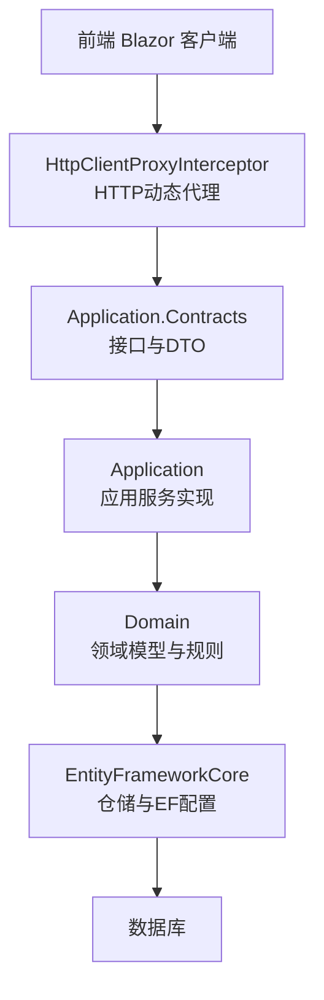
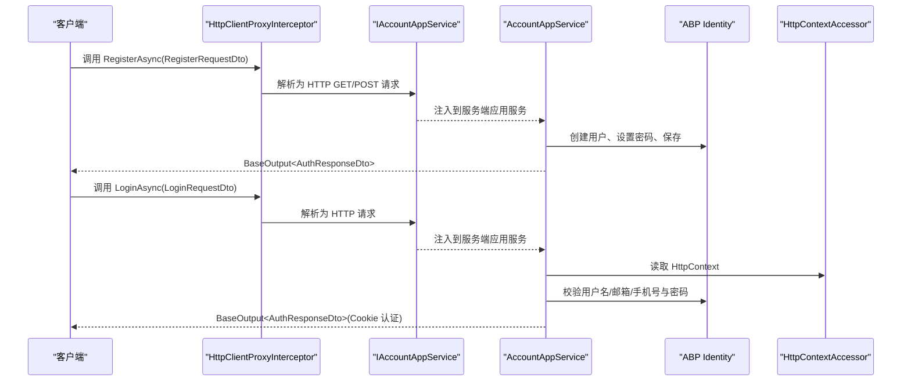
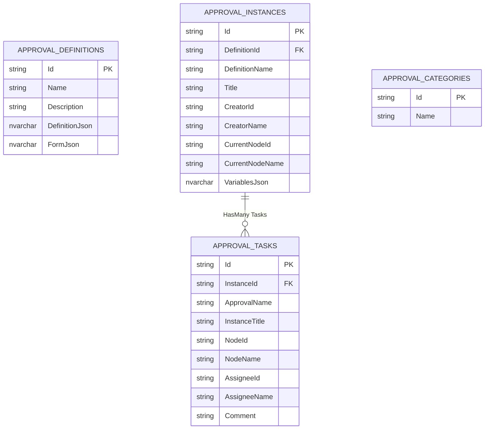
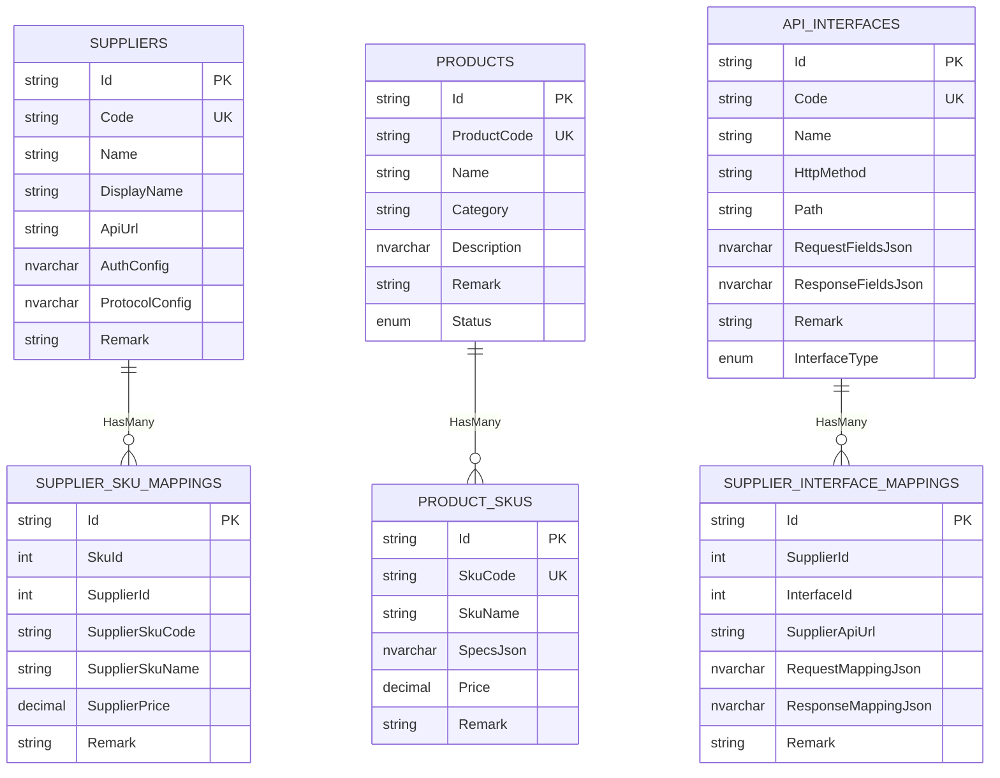
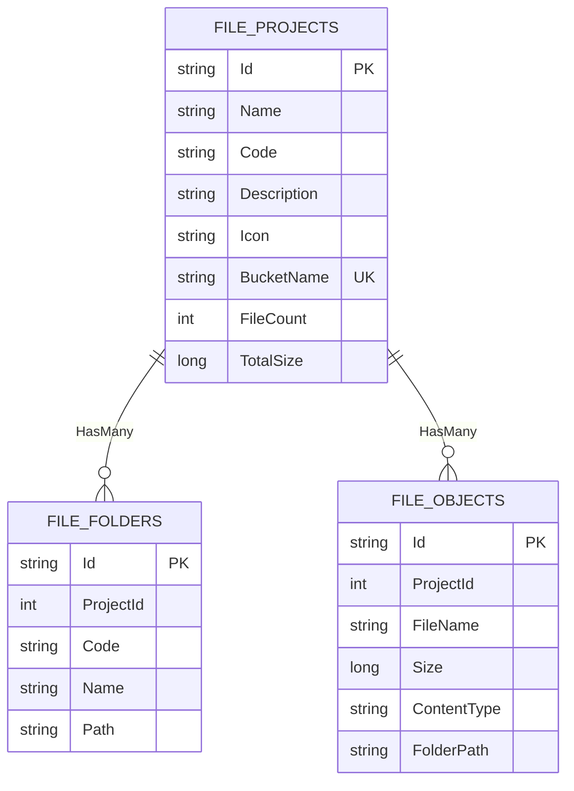
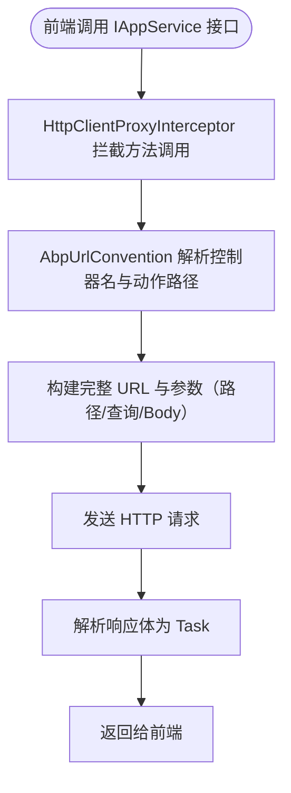

# 业务服务模块

<cite>
**本文引用的文件**   
- [README.md](file://README.md)
- [IAppService.cs](file://src/Utils/H.Abp.Application.Contracts/IAppService.cs)
- [ICrudAppService.cs](file://src/Utils/H.Abp.Application.Contracts/ICrudAppService.cs)
- [AbpUrlConvention.cs](file://src/Utils/H.Abp.HttpClientProxy/AbpUrlConvention.cs)
- [HttpClientProxyInterceptor.cs](file://src/Utils/H.Abp.HttpClientProxy/HttpClientProxyInterceptor.cs)
- [ServiceCollectionExtensions.cs](file://src/Utils/H.Abp.HttpClientProxy/ServiceCollectionExtensions.cs)
- [AccountApplicationContractsModule.cs](file://src/Services/Account/H.Account.Application.Contracts/AccountApplicationContractsModule.cs)
- [AccountApplicationModule.cs](file://src/Services/Account/H.Account.Application/AccountApplicationModule.cs)
- [AccountWebModule.cs](file://src/Services/Account/H.Account.Web/AccountWebModule.cs)
- [AccountEntityFrameworkCoreModule.cs](file://src/Services/Account/H.Account.EntityFrameworkCore/AccountEntityFrameworkCoreModule.cs)
- [IAccountAppService.cs](file://src/Services/Account/H.Account.Application.Contracts/Services/IAccountAppService.cs)
- [AccountAppService.cs](file://src/Services/Account/H.Account.Application/Services/AccountAppService.cs)
- [ApprovalDbContext.cs](file://src/Services/Approval/H.Approval.EntityFrameworkCore/ApprovalDbContext.cs)
- [OrderDbContext.cs](file://src/Services/Order/H.Order.EntityFrameworkCore/OrderDbContext.cs)
- [SupplyChainDbContext.cs](file://src/Services/SupplyChain/H.SupplyChain.EntityFrameworkCore/SupplyChainDbContext.cs)
- [FileDbContext.cs](file://src/Services/File/H.File.EntityFrameworkCore/FileDbContext.cs)
</cite>

## 目录
1. [引言](#引言)
2. [项目结构](#项目结构)
3. [核心组件](#核心组件)
4. [架构总览](#架构总览)
5. [详细组件分析](#详细组件分析)
6. [依赖与解耦分析](#依赖与解耦分析)
7. [性能考虑](#性能考虑)
8. [故障排查指南](#故障排查指南)
9. [结论](#结论)
10. [附录：各业务领域边界与职责](#附录各业务领域边界与职责)

## 引言
H.AppLab 是一个基于 .NET + Blazor 的模块化应用实验性项目，采用 ABP Framework 的分层架构，支持单体部署与按服务独立部署。其 Services 目录下的企业级基础服务按限界上下文划分，每个业务模块遵循 Application.Contracts、Application、EntityFrameworkCore、Web 的分层约定，并通过统一的工具库实现前后端契约复用与 HTTP 动态代理调用。该文档面向开发者，系统说明分层架构在各业务模块中的实现方式、业务领域的职责边界、模块间解耦机制、以及典型业务流程和接口约定。

## 项目结构
仓库整体结构以 Host、Components、LowCode、Services、System、Tools、Utils 为主要分组：
- Host：宿主程序，负责聚合并启动多个业务服务或单服务宿主。
- Components：共享 UI 组件，如 AppDrawer。
- LowCode：低代码引擎（设计器、渲染器）及其公共元数据与组件库。
- Services：企业级基础服务，按限界上下文划分为 Account、Organization、Approval、AI、Notification、Order、Portal、Setting、SupplyChain、BackgroundTask、Testing 等。
- System：平台运营侧的系统级应用 Enterprise、SystemPortal。
- Tools：各服务的数据库迁移控制台程序。
- Utils：跨服务共享的基础库，包含应用契约基类型、HTTP 客户端代理、Blazor 工具、ID 生成器等。

```mermaid
graph TB
    subgraph "宿主与应用"
        Host["Host 宿主程序"]
        Portal["Portal 门户应用"]
    end

    subgraph "业务服务 Services"
        Account["Account 账户服务"]
        Organization["Organization 组织服务"]
        Approval["Approval 审批服务"]
        AI["AI 能力服务"]
        Notification["Notification 通知服务"]
        Order["Order 订单服务"]
        SupplyChain["SupplyChain 供应链服务"]
        Setting["Setting 配置服务"]
        BackgroundTask["BackgroundTask 后台任务服务"]
        File["File 文件服务"]
        Testing["Testing 测试服务"]
    end

    subgraph "共享基础设施"
        Utils["Utils 工具库"]
        LowCode["LowCode 低代码引擎"]
        System["System 系统级应用"]
        Tools["Tools 迁移工具"]
    end

    Host --> Portal
    Host --> Account
    Host --> Organization
    Host --> Approval
    Host --> AI
    Host --> Notification
    Host --> Order
    Host --> SupplyChain
    Host --> Setting
    Host --> BackgroundTask
    Host --> File
    Host --> Testing

    Account --- Utils
    Organization --- Utils
    Approval --- Utils
    AI --- Utils
    Notification --- Utils
    Order --- Utils
    SupplyChain --- Utils
    Setting --- Utils
    BackgroundTask --- Utils
    File --- Utils
    Testing --- Utils

    Portal --- LowCode
    Host --- LowCode
    Host --- System
    Host --- Tools
```



图表来源
- [README.md:1-73](file://README.md#L1-L73)

章节来源
- [README.md:1-73](file://README.md#L1-L73)

## 核心组件
本项目的核心能力由以下通用组件提供：
- IAppService：标记可通过 HTTP 代理远程调用的服务接口，是前端动态代理扫描的基础。
- ICrudAppService：定义与 ABP 风格一致的 CRUD 应用服务契约，统一返回 BaseOutput 包装。
- AbpUrlConvention：将接口名与方法名转换为 ABP 风格的 API URL（控制器名称 kebab-case、动作路径映射）。
- HttpClientProxyInterceptor：基于 DispatchProxy 拦截 IAppService 方法调用，构造 HTTP 请求并返回结果。
- ServiceCollectionExtensions：提供 AddRemoteServices 与 AddHttpClientProxies，批量注册远端服务代理。

这些组件共同构成了“前端只依赖 Application.Contracts 接口，运行时自动生成 HTTP 调用”的能力，使前后端在进程内与服务端之间保持行为一致。

章节来源
- [IAppService.cs:1-8](file://src/Utils/H.Abp.Application.Contracts/IAppService.cs#L1-L8)
- [ICrudAppService.cs:1-15](file://src/Utils/H.Abp.Application.Contracts/ICrudAppService.cs#L1-L15)
- [AbpUrlConvention.cs:1-86](file://src/Utils/H.Abp.HttpClientProxy/AbpUrlConvention.cs#L1-L86)
- [HttpClientProxyInterceptor.cs:1-200](file://src/Utils/H.Abp.HttpClientProxy/HttpClientProxyInterceptor.cs#L1-L200)
- [ServiceCollectionExtensions.cs:1-63](file://src/Utils/H.Abp.HttpClientProxy/ServiceCollectionExtensions.cs#L1-L63)

## 架构总览
H.AppLab 的业务服务模块遵循 ABP 的典型分层：
- Application.Contracts：对外暴露的应用服务接口与 DTO，不依赖具体实现。
- Application：应用服务实现，编排业务逻辑，调用领域对象、仓储、外部服务等。
- EntityFrameworkCore：实体模型、DbContext、迁移及 EF Core 配置。
- Web：Web 层模块标记类（部分服务），用于承载路由、中间件或进一步的服务装配。



图表来源
- [IAppService.cs:1-8](file://src/Utils/H.Abp.Application.Contracts/IAppService.cs#L1-L8)
- [AbpUrlConvention.cs:1-86](file://src/Utils/H.Abp.HttpClientProxy/AbpUrlConvention.cs#L1-L86)
- [HttpClientProxyInterceptor.cs:1-200](file://src/Utils/H.Abp.HttpClientProxy/HttpClientProxyInterceptor.cs#L1-L200)
- [AccountEntityFrameworkCoreModule.cs:1-37](file://src/Services/Account/H.Account.EntityFrameworkCore/AccountEntityFrameworkCoreModule.cs#L1-L37)

章节来源
- [README.md:1-73](file://README.md#L1-L73)

## 详细组件分析

### 账户管理模块（Account）
职责范围
- 用户注册、登录、登出、令牌校验、当前用户信息获取。
- 与 ABP Identity 集成，使用 Cookie 认证。
- 通过 Application.Contracts 暴露 IAccountAppService，供前端或其他服务调用。

分层结构
- Application.Contracts：IAccountAppService 定义认证相关接口；DTO 定义请求响应模型。
- Application：AccountAppService 实现注册、登录、令牌校验、用户信息查询等流程，封装身份验证、租户上下文、用户管理等逻辑。
- EntityFrameworkCore：AccountEntityFrameworkCoreModule 配置 DbContext、连接字符串与默认仓储。
- Web：AccountWebModule 作为 Web 模块标记类。

典型流程：用户注册与登录



图表来源
- [IAccountAppService.cs:1-18](file://src/Services/Account/H.Account.Application.Contracts/Services/IAccountAppService.cs#L1-L18)
- [AccountAppService.cs:1-200](file://src/Services/Account/H.Account.Application/Services/AccountAppService.cs#L1-L200)
- [HttpClientProxyInterceptor.cs:1-200](file://src/Utils/H.Abp.HttpClientProxy/HttpClientProxyInterceptor.cs#L1-L200)

章节来源
- [IAccountAppService.cs:1-18](file://src/Services/Account/H.Account.Application.Contracts/Services/IAccountAppService.cs#L1-L18)
- [AccountAppService.cs:1-200](file://src/Services/Account/H.Account.Application/Services/AccountAppService.cs#L1-L200)
- [AccountApplicationModule.cs:1-22](file://src/Services/Account/H.Account.Application/AccountApplicationModule.cs#L1-L22)
- [AccountEntityFrameworkCoreModule.cs:1-37](file://src/Services/Account/H.Account.EntityFrameworkCore/AccountEntityFrameworkCoreModule.cs#L1-L37)
- [AccountWebModule.cs:1-8](file://src/Services/Account/H.Account.Web/AccountWebModule.cs#L1-L8)

### 审批流程模块（Approval）
职责范围
- 审批定义、审批实例、审批任务、审批分类的管理与执行。
- 通过 EF Core 维护审批流程相关表结构，并借助 Elsa（Elsa.EntityFrameworkCore）扩展工作流能力。

数据模型概览



图表来源
- [ApprovalDbContext.cs:1-97](file://src/Services/Approval/H.Approval.EntityFrameworkCore/ApprovalDbContext.cs#L1-L97)

章节来源
- [ApprovalDbContext.cs:1-97](file://src/Services/Approval/H.Approval.EntityFrameworkCore/ApprovalDbContext.cs#L1-L97)

### 订单处理模块（Order）
职责范围
- 订单生命周期管理、供应商路由、订单下发与日志记录。
- 使用 EF Core 存储订单、扩展属性、供应商、路由规则、下发日志等数据。

数据模型概览

```mermaid
erDiagram
  ORDERS {
    string Id PK
    string OrderNo UK
    string ProductName
    string BuyerId
    string Industry
    string ProductCategory
    decimal TotalAmount
    string Remark
    enum OrderStatus
  }

  ORDER_EXTENSIONS {
    string Id PK
    string OrderId UK FK
    nvarchar AttributesJson
  }

  SUPPLIERS {
    string Id PK
    string Code UK
    string Name
    string DisplayName
    string ApiUrl
    nvarchar AuthConfig
    nvarchar ProtocolConfig
    string Remark
  }

  ROUTE_RULES {
    string Id PK
    string Name
    string SupplierCode
    nvarchar ConditionsJson
    string Remark
    bool IsEnabled
  }

  DISPATCH_LOGS {
    string Id PK
    string OrderId
    string SupplierCode
    nvarchar RequestPayload
    nvarchar ResponsePayload
    string ErrorMessage
    enum Status
    datetime NextRetryTime
  }

  ORDERS ||--o| ORDER_EXTENSIONS : "One-to-One Extension"
  ORDERS ||--o{ DISPATCH_LOGS : "HasMany Logs"
  ROUTE_RULES }o--|| SUPPLIERS : "SupplierCode Ref"
```

图表来源
- [OrderDbContext.cs:1-110](file://src/Services/Order/H.Order.EntityFrameworkCore/OrderDbContext.cs#L1-L110)

章节来源
- [OrderDbContext.cs:1-110](file://src/Services/Order/H.Order.EntityFrameworkCore/OrderDbContext.cs#L1-L110)

### 供应链管理模块（SupplyChain）
职责范围
- 供应商、商品、SKU、供应商 SKU 映射、API 接口定义与供应商接口映射的管理。
- 通过 EF Core 维护供应链主数据与集成映射关系。

数据模型概览



图表来源
- [SupplyChainDbContext.cs:1-141](file://src/Services/SupplyChain/H.SupplyChain.EntityFrameworkCore/SupplyChainDbContext.cs#L1-L141)

章节来源
- [SupplyChainDbContext.cs:1-141](file://src/Services/SupplyChain/H.SupplyChain.EntityFrameworkCore/SupplyChainDbContext.cs#L1-L141)

### 文件管理模块（File）
职责范围
- 文件项目、文件夹、文件对象的层次化组织与管理。
- 使用 EF Core 存储文件目录结构与元数据。

数据模型概览



图表来源
- [FileDbContext.cs:1-59](file://src/Services/File/H.File.EntityFrameworkCore/FileDbContext.cs#L1-L59)

章节来源
- [FileDbContext.cs:1-59](file://src/Services/File/H.File.EntityFrameworkCore/FileDbContext.cs#L1-L59)

## 依赖与解耦分析
模块间解耦主要通过以下机制实现：
- 接口契约定义：Application.Contracts 中定义 IAppService 接口与 DTO，被 Web、Client 与其他服务引用，避免直接依赖实现细节。
- 事件驱动通信：ABP Framework 的事件总线与模块依赖机制（DependsOn）允许模块间松耦合协作，例如通过领域事件触发跨模块流程。
- 共享库使用：Utils 提供 H.Abp.Application.Contracts、H.Abp.HttpClientProxy、H.Util.Base、H.Util.Blazor、H.Util.Ids 等通用能力，降低重复实现。
- 模块装配：各模块通过 AbpModule（ApplicationModule、EntityFrameworkCoreModule、WebModule）进行服务注册与依赖声明，便于独立部署与组合。

HTTP 动态代理关键流程



图表来源
- [AbpUrlConvention.cs:1-86](file://src/Utils/H.Abp.HttpClientProxy/AbpUrlConvention.cs#L1-L86)
- [HttpClientProxyInterceptor.cs:1-200](file://src/Utils/H.Abp.HttpClientProxy/HttpClientProxyInterceptor.cs#L1-L200)
- [ServiceCollectionExtensions.cs:1-63](file://src/Utils/H.Abp.HttpClientProxy/ServiceCollectionExtensions.cs#L1-L63)

章节来源
- [README.md:1-73](file://README.md#L1-L73)
- [IAppService.cs:1-8](file://src/Utils/H.Abp.Application.Contracts/IAppService.cs#L1-L8)
- [ServiceCollectionExtensions.cs:1-63](file://src/Utils/H.Abp.HttpClientProxy/ServiceCollectionExtensions.cs#L1-L63)

## 性能考虑
- 懒加载与 AOT：前端按需加载程序集，Release 模式启用 AOT 与裁剪以减少体积。
- HTTP 代理优化：DispatchProxy 与 JsonContent 自动序列化复杂参数，减少样板代码；RemoteServices 集中管理远端地址，避免硬编码。
- 数据库索引：各模块 DbContext 对常用字段建立索引，提升查询效率（如订单号、行业、买家 ID、状态、供应商代码等）。
- 连接字符串与多库：各模块 DbContext 通过 ConnectionStringName 指定独立数据库，隔离负载与风险。

[本节为一般性指导，不涉及具体源码分析]

## 故障排查指南
常见问题与定位要点：
- 接口无法调用：确认前端是否已调用 AddHttpClientProxies 扫描 IAppService 接口，RemoteServices 配置是否正确。
- URL 不匹配：检查 AbpUrlConvention 的命名规范，确保接口名与方法名前缀符合约定（GetList、Create、Update、Delete 等）。
- 认证失败：Account 模块使用 Cookie 认证，需确认登录成功后 HttpContext.SignInAsync 是否正常写入 Cookie。
- 数据库迁移问题：使用对应 DbMigrator 控制台程序执行迁移；检查 ConnectionStringName 与 appsettings.json 的连接串。

章节来源
- [AccountAppService.cs:1-200](file://src/Services/Account/H.Account.Application/Services/AccountAppService.cs#L1-L200)
- [ServiceCollectionExtensions.cs:1-63](file://src/Utils/H.Abp.HttpClientProxy/ServiceCollectionExtensions.cs#L1-L63)
- [AbpUrlConvention.cs:1-86](file://src/Utils/H.Abp.HttpClientProxy/AbpUrlConvention.cs#L1-L86)

## 结论
H.AppLab 通过 ABP Framework 的分层架构与模块化设计，将账户、组织、审批、AI、订单、供应链、文件、通知、配置、后台任务等业务能力清晰拆分，并在 Application.Contracts 中暴露稳定的接口契约。借助 Utils 提供的 HTTP 动态代理与通用工具库，前后端可以围绕同一份接口协作，实现进程内与服务端的一致体验。各模块通过 AbpModule 装配、EF Core 管理数据模型与索引，具备良好的可维护性与可扩展性。

[本节为总结性内容，不涉及具体源码分析]

## 附录：各业务领域边界与职责
- 账户管理（Account）：用户注册、登录、登出、令牌校验、当前用户信息。
- 组织管理（Organization）：组织架构、部门、岗位、成员等组织维度管理。
- 审批流程（Approval）：审批定义、实例、任务与分类，结合 Elsa 工作流扩展。
- AI 能力（AI）：AI 模型调用、提示词、会话等能力抽象与集成。
- 订单处理（Order）：订单生命周期、供应商路由、下发与日志。
- 供应链管理（SupplyChain）：供应商、商品、SKU、接口映射与集成。
- 文件管理（File）：文件项目、文件夹、文件对象的结构化管理。
- 通知中心（Notification）：消息通知、渠道、模板与发送策略。
- 配置管理（Setting）：系统配置项、租户配置、功能开关。
- 后台任务（BackgroundTask）：定时任务、异步任务调度与执行。
- 测试服务（Testing）：单元测试、集成测试与示例场景。

[本节为概念性概述，不涉及具体源码分析]