# 供应链服务

<cite>
**本文引用的文件**   
- [SupplyChainEnums.cs](file://src/Services/SupplyChain/H.SupplyChain.Application.Contracts/Enums/SupplyChainEnums.cs)
- [ProductDtos.cs](file://src/Services/SupplyChain/H.SupplyChain.Application.Contracts/Dtos/ProductDtos.cs)
- [ProductSkuDtos.cs](file://src/Services/SupplyChain/H.SupplyChain.Application.Contracts/Dtos/ProductSkuDtos.cs)
- [SupplierDtos.cs](file://src/Services/SupplyChain/H.SupplyChain.Application.Contracts/Dtos/SupplierDtos.cs)
- [SupplierSkuMappingDtos.cs](file://src/Services/SupplyChain/H.SupplyChain.Application.Contracts/Dtos/SupplierSkuMappingDtos.cs)
- [SupplierInterfaceMappingDtos.cs](file://src/Services/SupplyChain/H.SupplyChain.Application.Contracts/Dtos/SupplierInterfaceMappingDtos.cs)
- [FieldMapping.cs](file://src/Services/SupplyChain/H.SupplyChain.Application.Contracts/Abstractions/FieldMapping.cs)
- [ISupplierApiInvoker.cs](file://src/Services/SupplyChain/H.SupplyChain.Application.Contracts/Abstractions/ISupplierApiInvoker.cs)
- [SupplierApiContext.cs](file://src/Services/SupplyChain/H.SupplyChain.Application.Contracts/Abstractions/SupplierApiContext.cs)
- [SupplyChainApplicationContractsModule.cs](file://src/Services/SupplyChain/H.SupplyChain.Application.Contracts/SupplyChainApplicationContractsModule.cs)
- [ISupplyChainApiAppService.cs](file://src/Services/SupplyChain/H.SupplyChain.Application.Contracts/Services/ISupplyChainApiAppService.cs)
- [IAppServices.cs](file://src/Services/SupplyChain/H.SupplyChain.Application.Contracts/Services/IAppServices.cs)
- [SupplyChainApplicationModule.cs](file://src/Services/SupplyChain/H.SupplyChain.Application/SupplyChainApplicationModule.cs)
- [SupplierApiInvokerFactory.cs](file://src/Services/SupplyChain/H.SupplyChain.Application/Services/SupplierApiInvokerFactory.cs)
- [SupplierApiInvokers.cs](file://src/Services/SupplyChain/H.SupplyChain.Application/Services/SupplierApiInvokers.cs)
- [MappingAppServices.cs](file://src/Services/SupplyChain/H.SupplyChain.Application/Services/MappingAppServices.cs)
- [SupplierInterfaceMappingAppService.cs](file://src/Services/SupplyChain/H.SupplyChain.Application/Services/SupplierInterfaceMappingAppService.cs)
- [SupplyChainApiAppService.cs](file://src/Services/SupplyChain/H.SupplyChain.Application/Services/SupplyChainApiAppService.cs)
- [SupplyChainAppServices.cs](file://src/Services/SupplyChain/H.SupplyChain.Application/Services/SupplyChainAppServices.cs)
- [SupplyChainMappers.cs](file://src/Services/SupplyChain/H.SupplyChain.Application/Mapping/SupplyChainMappers.cs)
- [SupplyChainEntityFrameworkCoreModule.cs](file://src/Services/SupplyChain/H.SupplyChain.EntityFrameworkCore/SupplyChainEntityFrameworkCoreModule.cs)
- [SupplyChainDbContext.cs](file://src/Services/SupplyChain/H.SupplyChain.EntityFrameworkCore/SupplyChainDbContext.cs)
- [SupplyChainEntities.cs](file://src/Services/SupplyChain/H.SupplyChain.EntityFrameworkCore/Entities/SupplyChainEntities.cs)
- [ProductEntity.cs](file://src/Services/SupplyChain/H.SupplyChain.EntityFrameworkCore/Entities/ProductEntity.cs)
- [ProductSkuEntity.cs](file://src/Services/SupplyChain/H.SupplyChain.EntityFrameworkCore/Entities/ProductSkuEntity.cs)
- [SupplierSkuMappingEntity.cs](file://src/Services/SupplyChain/H.SupplyChain.EntityFrameworkCore/Entities/SupplierSkuMappingEntity.cs)
- [ApiInterfaceEntity.cs](file://src/Services/SupplyChain/H.SupplyChain.EntityFrameworkCore/Entities/ApiInterfaceEntity.cs)
- [H.SupplyChain.Application.csproj](file://src/Services/SupplyChain/H.SupplyChain.Application/H.SupplyChain.Application.csproj)
- [H.SupplyChain.Application.Contracts.csproj](file://src/Services/SupplyChain/H.SupplyChain.Application.Contracts/H.SupplyChain.Application.Contracts.csproj)
- [H.SupplyChain.EntityFrameworkCore.csproj](file://src/Services/SupplyChain/H.SupplyChain.EntityFrameworkCore/H.SupplyChain.EntityFrameworkCore.csproj)
- [H.SupplyChain.Web.csproj](file://src/Services/SupplyChain/H.SupplyChain.Web/H.SupplyChain.Web.csproj)
- [H.SupplyChain.DbMigrator.csproj](file://src/Tools/H.SupplyChain.DbMigrator/H.SupplyChain.DbMigrator.csproj)
</cite>

## 目录
1. [引言](#引言)
2. [项目结构](#项目结构)
3. [核心组件](#核心组件)
4. [架构总览](#架构总览)
5. [详细组件分析](#详细组件分析)
6. [依赖关系分析](#依赖关系分析)
7. [性能与可扩展性](#性能与可扩展性)
8. [故障排查指南](#故障排查指南)
9. [结论](#结论)
10. [附录：业务场景与集成要点](#附录业务场景与集成要点)

## 引言
本文件面向 H.AppLab 供应链服务模块，系统性说明其领域模型、供应商对接、接口映射、商品与 SKU 管理、库存与价格体系、订单下单流程以及可视化与决策支持能力。该模块以 ABP 模块化方式组织，通过应用层 AppService 暴露 API，使用 EntityFrameworkCore 持久化数据，并通过可插拔的供应商 API 调用机制实现多供应商统一接入。文档同时给出与订单服务的集成思路和数据一致性建议。

## 项目结构
供应链服务由四个主要工程组成：
- 应用契约层：定义枚举、DTO、接口抽象与模块注册。
- 应用层：实现业务逻辑、AppService、映射器与供应商 API 调度。
- 实体框架层：定义领域实体、数据库上下文与 EF Core 模块。
- Web 层：对外提供 HTTP API 并承载前端资源。
- 迁移工具：负责数据库迁移执行。

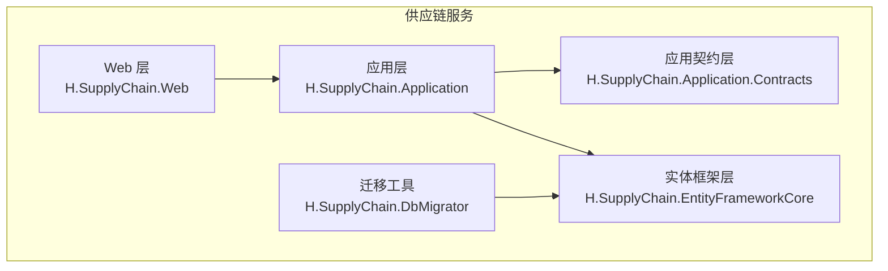

**图表来源**
- [H.SupplyChain.Application.csproj](file://src/Services/SupplyChain/H.SupplyChain.Application/H.SupplyChain.Application.csproj)
- [H.SupplyChain.Application.Contracts.csproj](file://src/Services/SupplyChain/H.SupplyChain.Application.Contracts/H.SupplyChain.Application.Contracts.csproj)
- [H.SupplyChain.EntityFrameworkCore.csproj](file://src/Services/SupplyChain/H.SupplyChain.EntityFrameworkCore/H.SupplyChain.EntityFrameworkCore.csproj)
- [H.SupplyChain.Web.csproj](file://src/Services/SupplyChain/H.SupplyChain.Web/H.SupplyChain.Web.csproj)
- [H.SupplyChain.DbMigrator.csproj](file://src/Tools/H.SupplyChain.DbMigrator/H.SupplyChain.DbMigrator.csproj)

**章节来源**
- [SupplyChainApplicationContractsModule.cs](file://src/Services/SupplyChain/H.SupplyChain.Application.Contracts/SupplyChainApplicationContractsModule.cs)
- [SupplyChainApplicationModule.cs](file://src/Services/SupplyChain/H.SupplyChain.Application/SupplyChainApplicationModule.cs)
- [SupplyChainEntityFrameworkCoreModule.cs](file://src/Services/SupplyChain/H.SupplyChain.EntityFrameworkCore/SupplyChainEntityFrameworkCoreModule.cs)

## 核心组件
- 领域枚举与协议：定义接口类型、商品状态、供应商协议、认证方式、下单结果等关键枚举，统一跨层语义。
- 领域 DTO：覆盖商品主表、SKU、供应商、供应商-SKU 映射、供应商接口映射等 CRUD 请求与响应对象。
- 应用服务：提供商品、SKU、供应商、接口映射、API 调用编排等能力。
- 供应商 API 适配：通过工厂与 Invoker 机制，按供应商配置动态发起 HTTP 或 Mock 调用。
- 字段映射：以结构化 FieldMapping 描述请求参数与返回值的字段转换规则。
- 持久化模型：基于 EF Core 的商品、SKU、供应商映射、接口定义等实体与 DbContext。

**章节来源**
- [SupplyChainEnums.cs](file://src/Services/SupplyChain/H.SupplyChain.Application.Contracts/Enums/SupplyChainEnums.cs)
- [ProductDtos.cs](file://src/Services/SupplyChain/H.SupplyChain.Application.Contracts/Dtos/ProductDtos.cs)
- [ProductSkuDtos.cs](file://src/Services/SupplyChain/H.SupplyChain.Application.Contracts/Dtos/ProductSkuDtos.cs)
- [SupplierDtos.cs](file://src/Services/SupplyChain/H.SupplyChain.Application.Contracts/Dtos/SupplierDtos.cs)
- [SupplierSkuMappingDtos.cs](file://src/Services/SupplyChain/H.SupplyChain.Application.Contracts/Dtos/SupplierSkuMappingDtos.cs)
- [SupplierInterfaceMappingDtos.cs](file://src/Services/SupplyChain/H.SupplyChain.Application.Contracts/Dtos/SupplierInterfaceMappingDtos.cs)
- [FieldMapping.cs](file://src/Services/SupplyChain/H.SupplyChain.Application.Contracts/Abstractions/FieldMapping.cs)

## 架构总览
供应链服务采用分层架构：
- 契约层定义稳定的对外接口与数据结构。
- 应用层编排业务流程，协调仓储与外部供应商 API。
- EF 层负责数据建模与持久化。
- Web 层提供 RESTful API 与静态资源。
- 迁移工具独立运行，保证数据库版本一致。

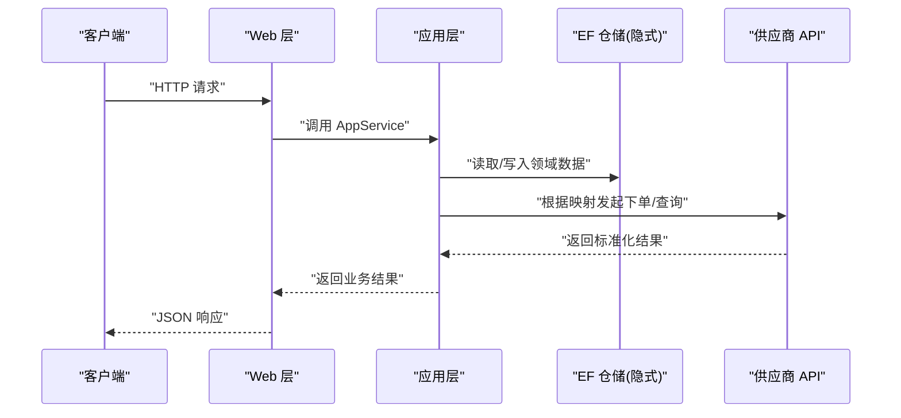

**图表来源**
- [ISupplyChainApiAppService.cs](file://src/Services/SupplyChain/H.SupplyChain.Application.Contracts/Services/ISupplyChainApiAppService.cs)
- [SupplyChainApiAppService.cs](file://src/Services/SupplyChain/H.SupplyChain.Application/Services/SupplyChainApiAppService.cs)
- [SupplierApiInvokerFactory.cs](file://src/Services/SupplyChain/H.SupplyChain.Application/Services/SupplierApiInvokerFactory.cs)
- [SupplierApiInvokers.cs](file://src/Services/SupplyChain/H.SupplyChain.Application/Services/SupplierApiInvokers.cs)

## 详细组件分析

### 领域模型与数据建模
- 商品主表：包含商品编码、名称、类别、描述、状态、备注等基础信息。
- 商品 SKU：最小可售单元，包含 SKU 编码、名称、规格 JSON、售价、库存、启用状态、备注。
- 供应商：包含编码、名称、显示名、API 地址、认证方式、认证配置 JSON、协议类型、协议配置 JSON、启用状态、备注。
- 供应商-SKU 映射：将内部 SKU 与多个供应商及其商品编码、名称、供货价关联。
- 供应商接口映射：为每个供应商和接口定义（菜单/详情/下单/自定义）配置请求与返回值字段映射，支持覆盖供应商默认 API 地址。
- 接口定义：存储接口编码、类型、是否启用、备注等元数据。

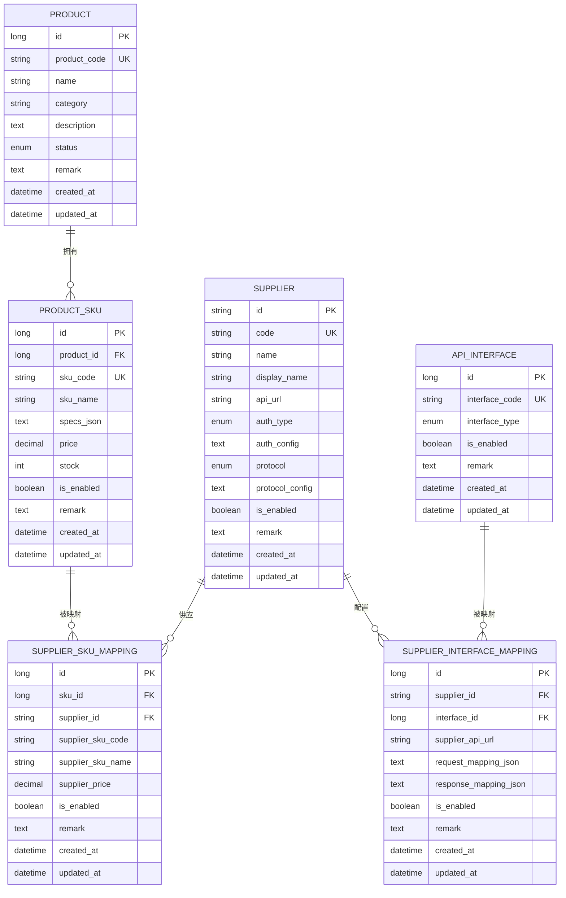

**图表来源**
- [ProductEntity.cs](file://src/Services/SupplyChain/H.SupplyChain.EntityFrameworkCore/Entities/ProductEntity.cs)
- [ProductSkuEntity.cs](file://src/Services/SupplyChain/H.SupplyChain.EntityFrameworkCore/Entities/ProductSkuEntity.cs)
- [SupplierSkuMappingEntity.cs](file://src/Services/SupplyChain/H.SupplyChain.EntityFrameworkCore/Entities/SupplierSkuMappingEntity.cs)
- [ApiInterfaceEntity.cs](file://src/Services/SupplyChain/H.SupplyChain.EntityFrameworkCore/Entities/ApiInterfaceEntity.cs)
- [SupplyChainEntities.cs](file://src/Services/SupplyChain/H.SupplyChain.EntityFrameworkCore/Entities/SupplyChainEntities.cs)

**章节来源**
- [ProductDtos.cs](file://src/Services/SupplyChain/H.SupplyChain.Application.Contracts/Dtos/ProductDtos.cs)
- [ProductSkuDtos.cs](file://src/Services/SupplyChain/H.SupplyChain.Application.Contracts/Dtos/ProductSkuDtos.cs)
- [SupplierDtos.cs](file://src/Services/SupplyChain/H.SupplyChain.Application.Contracts/Dtos/SupplierDtos.cs)
- [SupplierSkuMappingDtos.cs](file://src/Services/SupplyChain/H.SupplyChain.Application.Contracts/Dtos/SupplierSkuMappingDtos.cs)
- [SupplierInterfaceMappingDtos.cs](file://src/Services/SupplyChain/H.SupplyChain.Application.Contracts/Dtos/SupplierInterfaceMappingDtos.cs)
- [SupplyChainEntities.cs](file://src/Services/SupplyChain/H.SupplyChain.EntityFrameworkCore/Entities/SupplyChainEntities.cs)

### 供应商对接与认证
- 协议支持：HTTP 与 Mock；Mock 用于本地调试，不实际调用外部系统。
- 认证方式：无认证、ApiKey（支持 query 或头）、自定义头、Basic、Bearer Token。
- 协议配置与认证配置均以 JSON 存储，便于扩展。
- 接口类型：菜单、商品详情、下单、自定义，支撑不同业务阶段的数据交互。

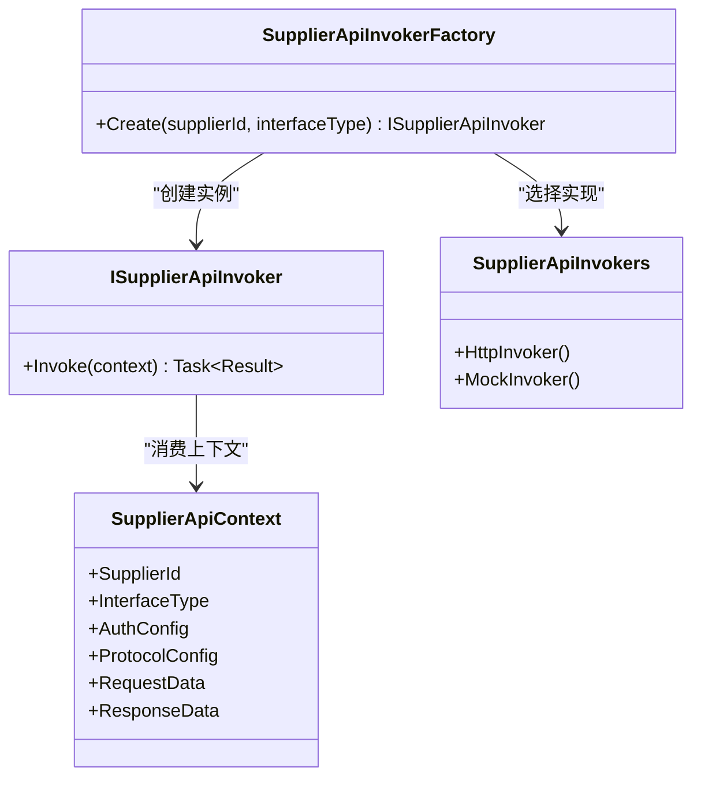

**图表来源**
- [ISupplierApiInvoker.cs](file://src/Services/SupplyChain/H.SupplyChain.Application.Contracts/Abstractions/ISupplierApiInvoker.cs)
- [SupplierApiInvokerFactory.cs](file://src/Services/SupplyChain/H.SupplyChain.Application/Services/SupplierApiInvokerFactory.cs)
- [SupplierApiInvokers.cs](file://src/Services/SupplyChain/H.SupplyChain.Application/Services/SupplierApiInvokers.cs)
- [SupplierApiContext.cs](file://src/Services/SupplyChain/H.SupplyChain.Application.Contracts/Abstractions/SupplierApiContext.cs)

**章节来源**
- [SupplyChainEnums.cs](file://src/Services/SupplyChain/H.SupplyChain.Application.Contracts/Enums/SupplyChainEnums.cs)
- [SupplierDtos.cs](file://src/Services/SupplyChain/H.SupplyChain.Application.Contracts/Dtos/SupplierDtos.cs)

### 字段映射与接口编排
- 字段映射：以 FieldMapping 列表描述请求与返回值的字段转换规则，支持复杂嵌套结构的序列化字段映射。
- 接口映射：对每个供应商与接口定义绑定 RequestMappingJson 与 ResponseMappingJson，并可覆盖 SupplierApiUrl。
- 映射 AppService：提供接口映射与通用映射配置的 CRUD 能力。

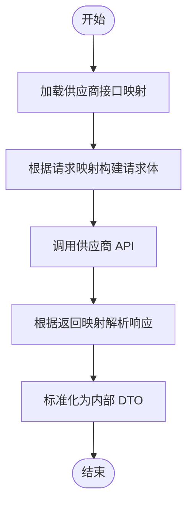

**图表来源**
- [FieldMapping.cs](file://src/Services/SupplyChain/H.SupplyChain.Application.Contracts/Abstractions/FieldMapping.cs)
- [SupplierInterfaceMappingDtos.cs](file://src/Services/SupplyChain/H.SupplyChain.Application.Contracts/Dtos/SupplierInterfaceMappingDtos.cs)
- [MappingAppServices.cs](file://src/Services/SupplyChain/H.SupplyChain.Application/Services/MappingAppServices.cs)
- [SupplierInterfaceMappingAppService.cs](file://src/Services/SupplyChain/H.SupplyChain.Application/Services/SupplierInterfaceMappingAppService.cs)

**章节来源**
- [FieldMapping.cs](file://src/Services/SupplyChain/H.SupplyChain.Application.Contracts/Abstractions/FieldMapping.cs)
- [SupplierInterfaceMappingDtos.cs](file://src/Services/SupplyChain/H.SupplyChain.Application.Contracts/Dtos/SupplierInterfaceMappingDtos.cs)
- [MappingAppServices.cs](file://src/Services/SupplyChain/H.SupplyChain.Application/Services/MappingAppServices.cs)
- [SupplierInterfaceMappingAppService.cs](file://src/Services/SupplyChain/H.SupplyChain.Application/Services/SupplierInterfaceMappingAppService.cs)

### 商品与 SKU 管理
- 商品主表管理：编码唯一，支持分页、关键词、类别、状态过滤。
- SKU 管理：每个 SKU 含规格 JSON、售价、库存、启用状态；支持按商品、关键词、启用状态查询。
- 商品详情：聚合 SKU 列表与可用供应商映射，便于前端展示与下游选择。

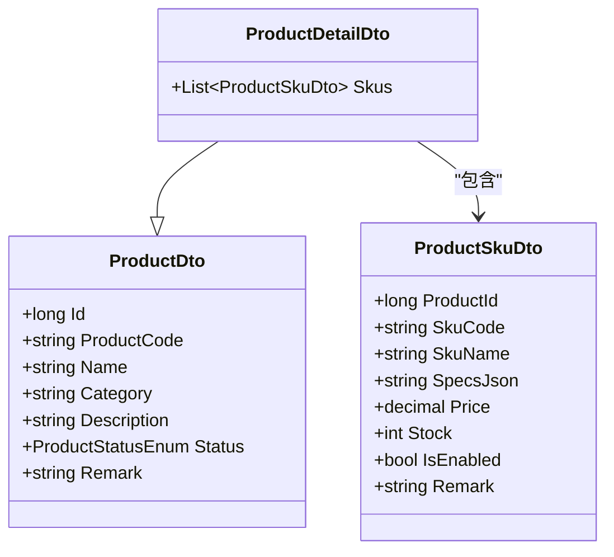

**图表来源**
- [ProductDtos.cs](file://src/Services/SupplyChain/H.SupplyChain.Application.Contracts/Dtos/ProductDtos.cs)
- [ProductSkuDtos.cs](file://src/Services/SupplyChain/H.SupplyChain.Application.Contracts/Dtos/ProductSkuDtos.cs)

**章节来源**
- [ProductDtos.cs](file://src/Services/SupplyChain/H.SupplyChain.Application.Contracts/Dtos/ProductDtos.cs)
- [ProductSkuDtos.cs](file://src/Services/SupplyChain/H.SupplyChain.Application.Contracts/Dtos/ProductSkuDtos.cs)

### 供应商-SKU 映射与采购策略
- 映射维度：内部 SKU 到多个供应商及其商品编码、名称、供货价。
- 采购策略：可通过启用状态与供货价进行简单优选；更复杂的评分与配额可在上层扩展。
- 查询能力：按 SKU、供应商、启用状态分页查询。

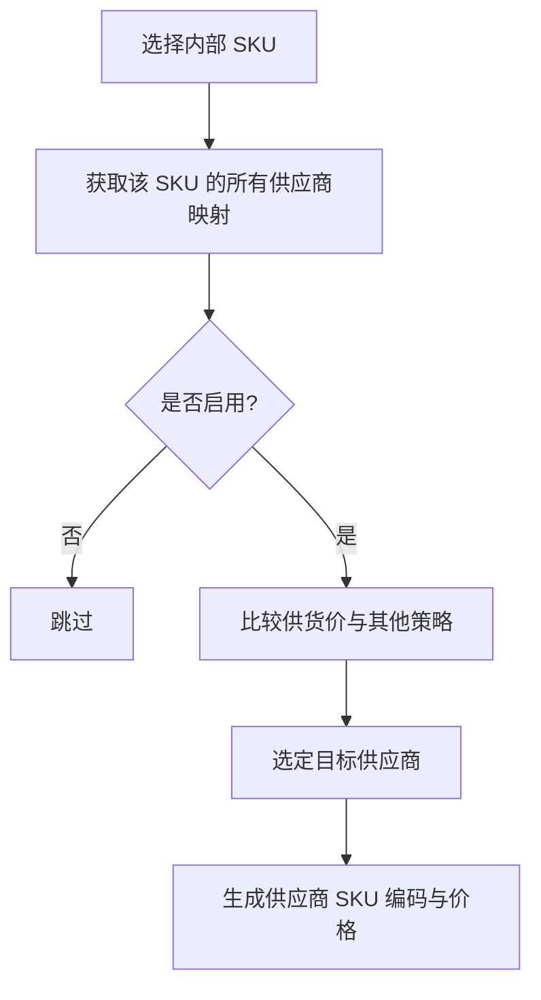

**图表来源**
- [SupplierSkuMappingDtos.cs](file://src/Services/SupplyChain/H.SupplyChain.Application.Contracts/Dtos/SupplierSkuMappingDtos.cs)

**章节来源**
- [SupplierSkuMappingDtos.cs](file://src/Services/SupplyChain/H.SupplyChain.Application.Contracts/Dtos/SupplierSkuMappingDtos.cs)

### 下单流程与结果处理
- 输入：内部 SKU、数量、目标供应商（可由映射选择）。
- 处理：根据接口映射组装请求，调用供应商 API，解析返回并转换为内部下单结果。
- 输出：下单成功或失败的状态及必要追踪信息。

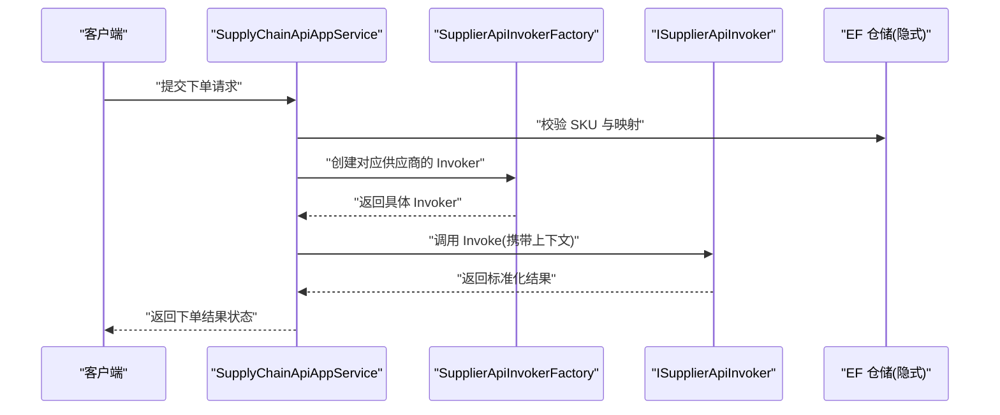

**图表来源**
- [ISupplyChainApiAppService.cs](file://src/Services/SupplyChain/H.SupplyChain.Application.Contracts/Services/ISupplyChainApiAppService.cs)
- [SupplyChainApiAppService.cs](file://src/Services/SupplyChain/H.SupplyChain.Application/Services/SupplyChainApiAppService.cs)
- [SupplierApiInvokerFactory.cs](file://src/Services/SupplyChain/H.SupplyChain.Application/Services/SupplierApiInvokerFactory.cs)
- [ISupplierApiInvoker.cs](file://src/Services/SupplyChain/H.SupplyChain.Application.Contracts/Abstractions/ISupplierApiInvoker.cs)

**章节来源**
- [SupplyChainEnums.cs](file://src/Services/SupplyChain/H.SupplyChain.Application.Contracts/Enums/SupplyChainEnums.cs)
- [ISupplyChainApiAppService.cs](file://src/Services/SupplyChain/H.SupplyChain.Application.Contracts/Services/ISupplyChainApiAppService.cs)
- [SupplyChainApiAppService.cs](file://src/Services/SupplyChain/H.SupplyChain.Application/Services/SupplyChainApiAppService.cs)

### 数据映射与转换器
- 应用层提供统一映射器集合，负责 DTO 与实体之间的转换，避免在各 AppService 中重复编写映射逻辑。
- 映射器通常集中注册，便于测试与复用。

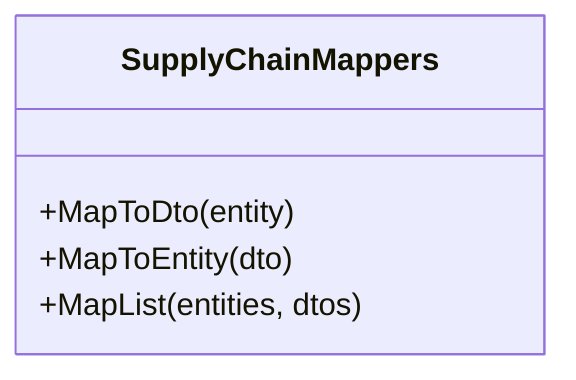

**图表来源**
- [SupplyChainMappers.cs](file://src/Services/SupplyChain/H.SupplyChain.Application/Mapping/SupplyChainMappers.cs)

**章节来源**
- [SupplyChainMappers.cs](file://src/Services/SupplyChain/H.SupplyChain.Application/Mapping/SupplyChainMappers.cs)

### 数据库上下文与模块注册
- DbContext：集中配置实体集与连接字符串等。
- 模块：分别在契约层、应用层、EF 层与 Web 层注册依赖注入、中间件与 API 路由。
- 迁移：DbMigrator 工程负责执行 EF 迁移脚本，确保数据库结构与代码一致。

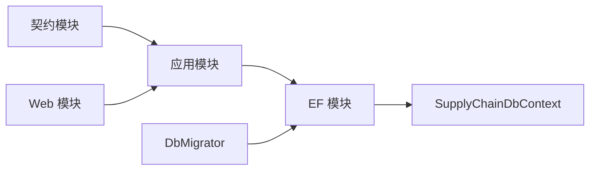

**图表来源**
- [SupplyChainApplicationContractsModule.cs](file://src/Services/SupplyChain/H.SupplyChain.Application.Contracts/SupplyChainApplicationContractsModule.cs)
- [SupplyChainApplicationModule.cs](file://src/Services/SupplyChain/H.SupplyChain.Application/SupplyChainApplicationModule.cs)
- [SupplyChainEntityFrameworkCoreModule.cs](file://src/Services/SupplyChain/H.SupplyChain.EntityFrameworkCore/SupplyChainEntityFrameworkCoreModule.cs)
- [SupplyChainDbContext.cs](file://src/Services/SupplyChain/H.SupplyChain.EntityFrameworkCore/SupplyChainDbContext.cs)
- [H.SupplyChain.DbMigrator.csproj](file://src/Tools/H.SupplyChain.DbMigrator/H.SupplyChain.DbMigrator.csproj)

**章节来源**
- [SupplyChainDbContext.cs](file://src/Services/SupplyChain/H.SupplyChain.EntityFrameworkCore/SupplyChainDbContext.cs)
- [SupplyChainEntityFrameworkCoreModule.cs](file://src/Services/SupplyChain/H.SupplyChain.EntityFrameworkCore/SupplyChainEntityFrameworkCoreModule.cs)

## 依赖关系分析
- 契约层被应用层与 Web 层引用，作为稳定接口边界。
- 应用层依赖契约层与 EF 层，负责编排业务逻辑与数据访问。
- EF 层仅依赖契约层中的枚举与 DTO 类型（如需要），保持实体与契约解耦。
- Web 层依赖应用层暴露的 AppService 接口。
- DbMigrator 依赖 EF 层以执行迁移。

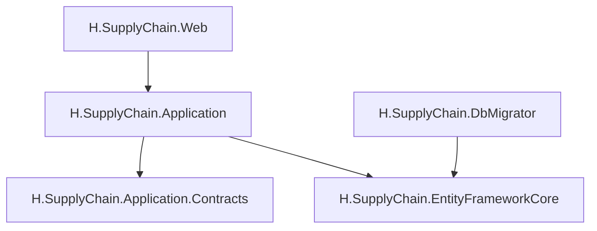

**图表来源**
- [H.SupplyChain.Application.csproj](file://src/Services/SupplyChain/H.SupplyChain.Application/H.SupplyChain.Application.csproj)
- [H.SupplyChain.Application.Contracts.csproj](file://src/Services/SupplyChain/H.SupplyChain.Application.Contracts/H.SupplyChain.Application.Contracts.csproj)
- [H.SupplyChain.EntityFrameworkCore.csproj](file://src/Services/SupplyChain/H.SupplyChain.EntityFrameworkCore/H.SupplyChain.EntityFrameworkCore.csproj)
- [H.SupplyChain.Web.csproj](file://src/Services/SupplyChain/H.SupplyChain.Web/H.SupplyChain.Web.csproj)
- [H.SupplyChain.DbMigrator.csproj](file://src/Tools/H.SupplyChain.DbMigrator/H.SupplyChain.DbMigrator.csproj)

**章节来源**
- [H.SupplyChain.Application.csproj](file://src/Services/SupplyChain/H.SupplyChain.Application/H.SupplyChain.Application.csproj)
- [H.SupplyChain.Application.Contracts.csproj](file://src/Services/SupplyChain/H.SupplyChain.Application.Contracts/H.SupplyChain.Application.Contracts.csproj)
- [H.SupplyChain.EntityFrameworkCore.csproj](file://src/Services/SupplyChain/H.SupplyChain.EntityFrameworkCore/H.SupplyChain.EntityFrameworkCore.csproj)
- [H.SupplyChain.Web.csproj](file://src/Services/SupplyChain/H.SupplyChain.Web/H.SupplyChain.Web.csproj)
- [H.SupplyChain.DbMigrator.csproj](file://src/Tools/H.SupplyChain.DbMigrator/H.SupplyChain.DbMigrator.csproj)

## 性能与可扩展性
- 分页与过滤：所有查询 DTO 继承分页基类，支持分页与排序，减少大数据量传输压力。
- 缓存建议：商品详情与 SKU 列表可考虑短期缓存，降低频繁查询外部映射与供应商数据的开销。
- 并发下单：在应用层对同一 SKU 的并发下单需加锁或队列化，避免超卖与重复下单。
- 扩展点：
  - 新增供应商协议：扩展 SupplierApiInvokerFactory 与 SupplierApiInvokers。
  - 新增接口类型：在枚举与映射表中增加新接口类型，并在 Invoker 中实现相应逻辑。
  - 评估体系：可在映射与策略层引入评分、交期、质量指标等扩展字段，实现更智能的供应商选择。

[本节为通用指导，不直接分析具体文件]

## 故障排查指南
- 认证失败：检查供应商的认证方式与认证配置 JSON 是否正确，确认 ApiKey、Basic、Bearer 等参数是否匹配供应商要求。
- 接口映射错误：核对 RequestMappingJson 与 ResponseMappingJson 是否与供应商实际接口字段一致，必要时使用 Mock 协议先行验证。
- 下单失败：查看 OrderPlaceStatusEnum 的返回状态，结合日志定位是网络问题、参数不合法还是上游业务拒绝。
- 数据不一致：核对 SKU 与供应商映射是否启用，供货价是否更新；检查商品状态是否为上架。
- 迁移问题：确认 DbMigrator 已执行最新迁移，DbContext 连接字符串正确。

**章节来源**
- [SupplyChainEnums.cs](file://src/Services/SupplyChain/H.SupplyChain.Application.Contracts/Enums/SupplyChainEnums.cs)
- [SupplierDtos.cs](file://src/Services/SupplyChain/H.SupplyChain.Application.Contracts/Dtos/SupplierDtos.cs)
- [SupplierInterfaceMappingDtos.cs](file://src/Services/SupplyChain/H.SupplyChain.Application.Contracts/Dtos/SupplierInterfaceMappingDtos.cs)

## 结论
供应链服务以清晰的契约层与应用层分离，结合 EF Core 持久化与可插拔的供应商 API 适配机制，提供了商品与 SKU 管理、供应商对接、接口映射、下单流程等核心能力。通过枚举与 DTO 的统一约定，系统具备良好的可读性与扩展性。后续可在供应商评估、库存优化、物流跟踪等方面继续扩展，增强决策支持与可视化能力。

[本节为总结，不直接分析具体文件]

## 附录：业务场景与集成要点

### 常见业务场景
- 采购申请审批：在应用层记录采购申请单，触发审批流后生成供应商下单任务。
- 供应商选择：依据启用状态、供货价与扩展评分选择最优供应商。
- 物流配送：在下单成功后记录物流信息，支持后续跟踪与异常上报。
- 入库出库：基于 SKU 库存字段进行出入库扣减与补充，保障库存准确性。

[本节为概念性说明，不直接分析具体文件]

### 与订单服务的集成方式
- 订单履约：供应链服务完成下单后，通过领域事件或消息通知订单服务，订单服务据此创建履约单。
- 库存同步：当供应商返回发货或到货状态时，回调供应链服务更新库存与在途数量。
- 数据一致性：建议在应用层使用事务或补偿机制，确保下单结果与库存变更的一致性；对于跨服务调用，采用最终一致性模式（如出队重试、幂等键）。

[本节为概念性说明，不直接分析具体文件]

### 可视化与决策支持
- 商品与 SKU 看板：展示 SKU 价格、库存、启用状态与供应商映射数量。
- 供应商绩效看板：统计下单成功率、交付时效、退货率等指标，辅助评估与淘汰。
- 库存预警：低于安全库存阈值时发出预警，支持自动补货建议。
- 成本优化：基于历史采购价与市场波动趋势，推荐最优供应商组合。

[本节为概念性说明，不直接分析具体文件]