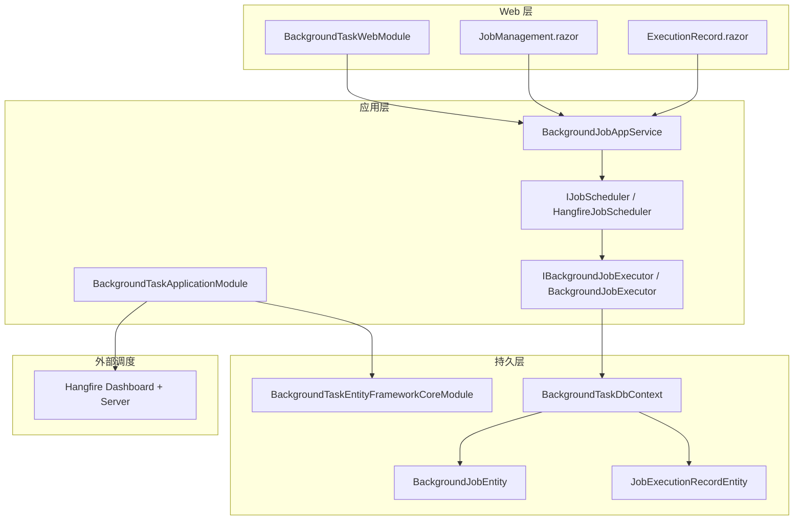
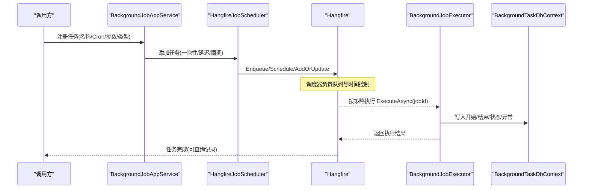
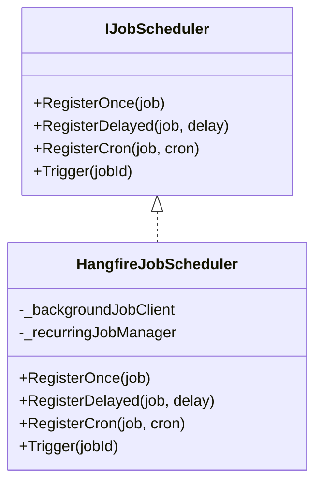
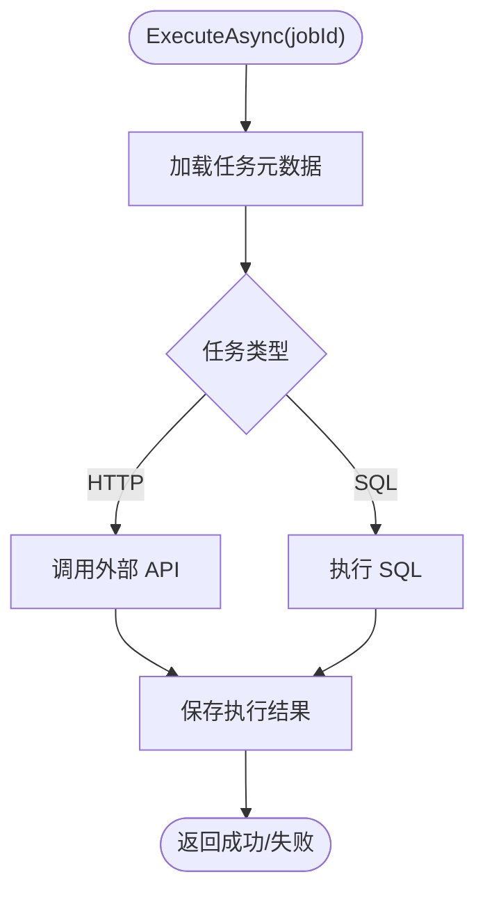
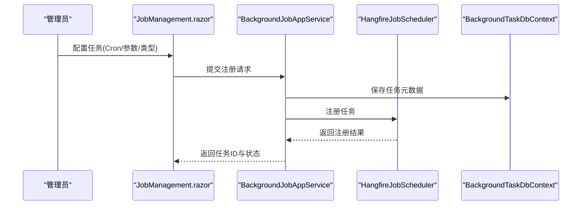
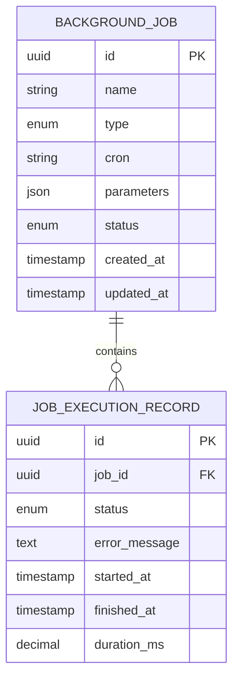
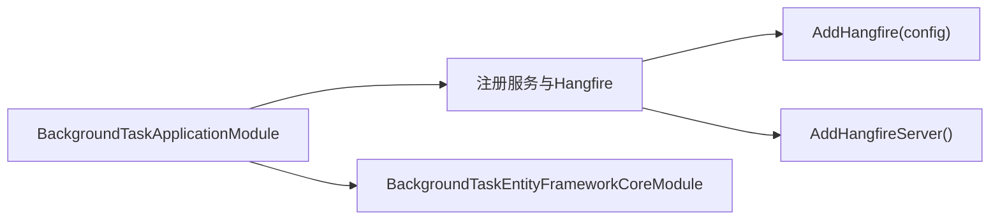
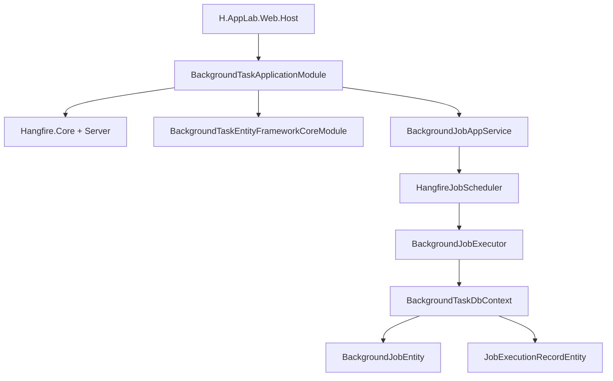

# 后台任务服务

<cite>
**本文引用的文件**   
- [Program.cs](file://src/Host/H.AppLab.Web.Host/H.AppLab.Web.Host/Program.cs)
- [BackgroundTaskApplicationModule.cs](file://src/Services/BackgroundTask/H.BackgroundTask.Application/BackgroundTaskApplicationModule.cs)
- [BackgroundTaskWebModule.cs](file://src/Services/BackgroundTask/H.BackgroundTask.Web/BackgroundTaskWebModule.cs)
- [BackgroundTaskEntityFrameworkCoreModule.cs](file://src/Services/BackgroundTask/H.BackgroundTask.EntityFrameworkCore/BackgroundTaskEntityFrameworkCoreModule.cs)
- [IJobScheduler.cs](file://src/Services/BackgroundTask/H.BackgroundTask.Application/Services/IJobScheduler.cs)
- [HangfireJobScheduler.cs](file://src/Services/BackgroundTask/H.BackgroundTask.Application/Services/HangfireJobScheduler.cs)
- [IBackgroundJobExecutor.cs](file://src/Services/BackgroundTask/H.BackgroundTask.Application/Services/IBackgroundJobExecutor.cs)
- [BackgroundJobExecutor.cs](file://src/Services/BackgroundTask/H.BackgroundTask.Application/Services/BackgroundJobExecutor.cs)
- [BackgroundJobAppService.cs](file://src/Services/BackgroundTask/H.BackgroundTask.Application/Services/BackgroundJobAppService.cs)
- [BackgroundTaskDbContext.cs](file://src/Services/BackgroundTask/H.BackgroundTask.EntityFrameworkCore/BackgroundTaskDbContext.cs)
- [BackgroundJobEntity.cs](file://src/Services/BackgroundTask/H.BackgroundTask.EntityFrameworkCore/Entities/BackgroundJobEntity.cs)
- [JobExecutionRecordEntity.cs](file://src/Services/BackgroundTask/H.BackgroundTask.EntityFrameworkCore/Entities/JobExecutionRecordEntity.cs)
- [BackgroundTaskMappers.cs](file://src/Services/BackgroundTask/H.BackgroundTask.Application/Mapping/BackgroundTaskMappers.cs)
- [BackgroundJobDtos.cs](file://src/Services/BackgroundTask/H.BackgroundTask.Application.Contracts/Dtos/BackgroundJobDtos.cs)
- [JobExecutionRecordDtos.cs](file://src/Services/BackgroundTask/H.BackgroundTask.Application.Contracts/Dtos/JobExecutionRecordDtos.cs)
- [BackgroundTaskEnums.cs](file://src/Services/BackgroundTask/H.BackgroundTask.Application.Contracts/Enums/BackgroundTaskEnums.cs)
- [JobManagement.razor](file://src/Services/BackgroundTask/H.BackgroundTask.Web/Pages/JobManagement.razor)
- [ExecutionRecord.razor](file://src/Services/BackgroundTask/H.BackgroundTask.Web/Pages/ExecutionRecord.razor)
- [BackgroundTaskLayout.razor](file://src/Services/BackgroundTask/H.BackgroundTask.Web/Layout/BackgroundTaskLayout.razor)
- [H.BackgroundTask.DbMigrator.csproj](file://src/Tools/H.BackgroundTask.DbMigrator/H.BackgroundTask.DbMigrator.csproj)
- [BackgroundTaskDbContextFactory.cs](file://src/Tools/H.BackgroundTask.DbMigrator/BackgroundTaskDbContextFactory.cs)
- [20260724162027_Init.cs](file://src/Tools/H.BackgroundTask.DbMigrator/Migrations/20260724162027_Init.cs)
</cite>

## 目录
1. [引言](#引言)
2. [项目结构](#项目结构)
3. [核心组件](#核心组件)
4. [架构总览](#架构总览)
5. [详细组件分析](#详细组件分析)
6. [依赖关系分析](#依赖关系分析)
7. [性能与可扩展性](#性能与可扩展性)
8. [监控、日志与告警](#监控日志与告警)
9. [常见问题排查](#常见问题排查)
10. [结论](#结论)

## 引言
本模块为 H.AppLab 的后台任务服务，基于 ABP 模块化架构，使用 Hangfire 作为分布式任务调度引擎，提供任务注册、定时执行、一次性执行、延迟执行、失败重试、执行记录持久化以及 Web 管理界面。该服务通过应用服务对外暴露 API，由 Hangfire 在独立工作进程或宿主进程中调度执行，适合数据同步、邮件发送、报表生成等常见后台场景。

## 项目结构
后台任务服务采用 ABP 标准分层：
- Application：应用服务、调度器、执行器、映射配置、模块注册。
- Application.Contracts：DTO、枚举、接口契约。
- EntityFrameworkCore：数据库实体、EF Core 上下文、迁移与模块注册。
- Web：Blazor 页面用于任务管理与执行记录查看。
- Tools.H.BackgroundTask.DbMigrator：独立的数据库迁移工具。

图表来源
- [BackgroundTaskApplicationModule.cs:14-55](file://src/Services/BackgroundTask/H.BackgroundTask.Application/BackgroundTaskApplicationModule.cs#L14-L55)
- [BackgroundTaskEntityFrameworkCoreModule.cs:9-30](file://src/Services/BackgroundTask/H.BackgroundTask.EntityFrameworkCore/BackgroundTaskEntityFrameworkCoreModule.cs#L9-L30)
- [BackgroundTaskWebModule.cs:1-30](file://src/Services/BackgroundTask/H.BackgroundTask.Web/BackgroundTaskWebModule.cs#L1-L30)
- [BackgroundJobAppService.cs:18-28](file://src/Services/BackgroundTask/H.BackgroundTask.Application/Services/BackgroundJobAppService.cs#L18-L28)
- [HangfireJobScheduler.cs:10-89](file://src/Services/BackgroundTask/H.BackgroundTask.Application/Services/HangfireJobScheduler.cs#L10-L89)
- [BackgroundJobExecutor.cs:17-173](file://src/Services/BackgroundTask/H.BackgroundTask.Application/Services/BackgroundJobExecutor.cs#L17-L173)

章节来源
- [BackgroundTaskApplicationModule.cs:14-55](file://src/Services/BackgroundTask/H.BackgroundTask.Application/BackgroundTaskApplicationModule.cs#L14-L55)
- [BackgroundTaskWebModule.cs:1-30](file://src/Services/BackgroundTask/H.BackgroundTask.Web/BackgroundTaskWebModule.cs#L1-L30)
- [BackgroundTaskEntityFrameworkCoreModule.cs:9-30](file://src/Services/BackgroundTask/H.BackgroundTask.EntityFrameworkCore/BackgroundTaskEntityFrameworkCoreModule.cs#L9-L30)

## 核心组件
- IJobScheduler 与 HangfireJobScheduler：封装 Hangfire 的一次性、延迟、周期任务调度能力，屏蔽底层调用细节。
- IBackgroundJobExecutor 与 BackgroundJobExecutor：根据任务类型分发到 HTTP 调用或 SQL 执行，并持久化执行结果。
- BackgroundJobAppService：面向前端的任务注册、查询、手动触发、删除等操作。
- BackgroundTaskDbContext 及实体：持久化任务元数据与执行记录。
- BackgroundTaskApplicationModule：注册 Hangfire、ABP 服务与模块依赖。
- BackgroundTaskWebModule：注册 Blazor 路由与页面。
- DB Migrator：初始化与升级任务相关数据库表结构。

章节来源
- [IJobScheduler.cs:8-21](file://src/Services/BackgroundTask/H.BackgroundTask.Application/Services/IJobScheduler.cs#L8-L21)
- [HangfireJobScheduler.cs:10-89](file://src/Services/BackgroundTask/H.BackgroundTask.Application/Services/HangfireJobScheduler.cs#L10-L89)
- [IBackgroundJobExecutor.cs:6-13](file://src/Services/BackgroundTask/H.BackgroundTask.Application/Services/IBackgroundJobExecutor.cs#L6-L13)
- [BackgroundJobExecutor.cs:17-173](file://src/Services/BackgroundTask/H.BackgroundTask.Application/Services/BackgroundJobExecutor.cs#L17-L173)
- [BackgroundJobAppService.cs:18-28](file://src/Services/BackgroundTask/H.BackgroundTask.Application/Services/BackgroundJobAppService.cs#L18-L28)
- [BackgroundTaskApplicationModule.cs:14-55](file://src/Services/BackgroundTask/H.BackgroundTask.Application/BackgroundTaskApplicationModule.cs#L14-L55)
- [BackgroundTaskWebModule.cs:1-30](file://src/Services/BackgroundTask/H.BackgroundTask.Web/BackgroundTaskWebModule.cs#L1-L30)

## 架构总览
整体流程分为三层：
- 用户或业务系统通过 BackgroundJobAppService 注册任务；
- HangfireJobScheduler 将任务写入 Hangfire 队列或计划；
- BackgroundJobExecutor 在后台线程执行具体逻辑，并通过 BackgroundTaskDbContext 记录执行结果。

图表来源
- [BackgroundJobAppService.cs:18-28](file://src/Services/BackgroundTask/H.BackgroundTask.Application/Services/BackgroundJobAppService.cs#L18-L28)
- [HangfireJobScheduler.cs:44-60](file://src/Services/BackgroundTask/H.BackgroundTask.Application/Services/HangfireJobScheduler.cs#L44-L60)
- [BackgroundJobExecutor.cs:33-118](file://src/Services/BackgroundTask/H.BackgroundTask.Application/Services/BackgroundJobExecutor.cs#L33-L118)
- [BackgroundTaskDbContext.cs:1-60](file://src/Services/BackgroundTask/H.BackgroundTask.EntityFrameworkCore/BackgroundTaskDbContext.cs#L1-L60)

## 详细组件分析

### 调度抽象与 Hangfire 集成
- IJobScheduler 定义统一的调度接口，屏蔽 Hangfire 差异。
- HangfireJobScheduler 实现：
  - 一次性任务：Enqueue。
  - 延迟任务：Schedule。
  - 周期任务：AddOrUpdate，按约定生成周期性任务 ID。
  - 立即触发：重入队。

图表来源
- [IJobScheduler.cs:8-21](file://src/Services/BackgroundTask/H.BackgroundTask.Application/Services/IJobScheduler.cs#L8-L21)
- [HangfireJobScheduler.cs:10-89](file://src/Services/BackgroundTask/H.BackgroundTask.Application/Services/HangfireJobScheduler.cs#L10-L89)

章节来源
- [HangfireJobScheduler.cs:44-60](file://src/Services/BackgroundTask/H.BackgroundTask.Application/Services/HangfireJobScheduler.cs#L44-L60)
- [HangfireJobScheduler.cs:87-89](file://src/Services/BackgroundTask/H.BackgroundTask.Application/Services/HangfireJobScheduler.cs#L87-L89)

### 任务执行器与执行流程
- IBackgroundJobExecutor 定义统一执行入口。
- BackgroundJobExecutor 根据任务类型选择执行路径：
  - HTTP 类型：调用外部 API。
  - SQL 类型：执行预定义 SQL。
- 在执行过程中记录开始时间、结束时间、耗时、输入摘要与异常信息。

图表来源
- [BackgroundJobExecutor.cs:33-118](file://src/Services/BackgroundTask/H.BackgroundTask.Application/Services/BackgroundJobExecutor.cs#L33-L118)

章节来源
- [BackgroundJobExecutor.cs:17-173](file://src/Services/BackgroundTask/H.BackgroundTask.Application/Services/BackgroundJobExecutor.cs#L17-L173)

### 应用服务与任务生命周期
BackgroundJobAppService 负责：
- 创建任务并持久化任务元数据；
- 调用调度器注册一次性、延迟或周期任务；
- 提供查询、手动触发、删除任务的 API；
- 配合 DTO 与映射进行数据转换。

图表来源
- [BackgroundJobAppService.cs:18-28](file://src/Services/BackgroundTask/H.BackgroundTask.Application/Services/BackgroundJobAppService.cs#L18-L28)
- [HangfireJobScheduler.cs:44-60](file://src/Services/BackgroundTask/H.BackgroundTask.Application/Services/HangfireJobScheduler.cs#L44-L60)
- [BackgroundTaskDbContext.cs:1-60](file://src/Services/BackgroundTask/H.BackgroundTask.EntityFrameworkCore/BackgroundTaskDbContext.cs#L1-L60)

章节来源
- [BackgroundJobAppService.cs:18-28](file://src/Services/BackgroundTask/H.BackgroundTask.Application/Services/BackgroundJobAppService.cs#L18-L28)

### 数据库模型与迁移
- BackgroundJobEntity：存储任务名称、类型、Cron、参数、状态等。
- JobExecutionRecordEntity：存储每次执行的结果、开始结束时间、异常堆栈。
- BackgroundTaskDbContext：统一管理两个实体的集合。
- 迁移脚本包含初始表结构与后续变更（例如删除 IsDelete）。

图表来源
- [BackgroundJobEntity.cs:1-120](file://src/Services/BackgroundTask/H.BackgroundTask.EntityFrameworkCore/Entities/BackgroundJobEntity.cs#L1-L120)
- [JobExecutionRecordEntity.cs:1-120](file://src/Services/BackgroundTask/H.BackgroundTask.EntityFrameworkCore/Entities/JobExecutionRecordEntity.cs#L1-L120)
- [BackgroundTaskDbContext.cs:1-60](file://src/Services/BackgroundTask/H.BackgroundTask.EntityFrameworkCore/BackgroundTaskDbContext.cs#L1-L60)
- [20260724162027_Init.cs:1-120](file://src/Tools/H.BackgroundTask.DbMigrator/Migrations/20260724162027_Init.cs#L1-L120)

章节来源
- [BackgroundTaskDbContext.cs:1-60](file://src/Services/BackgroundTask/H.BackgroundTask.EntityFrameworkCore/BackgroundTaskDbContext.cs#L1-L60)
- [BackgroundJobEntity.cs:1-120](file://src/Services/BackgroundTask/H.BackgroundTask.EntityFrameworkCore/Entities/BackgroundJobEntity.cs#L1-L120)
- [JobExecutionRecordEntity.cs:1-120](file://src/Services/BackgroundTask/H.BackgroundTask.EntityFrameworkCore/Entities/JobExecutionRecordEntity.cs#L1-L120)
- [20260724162027_Init.cs:1-120](file://src/Tools/H.BackgroundTask.DbMigrator/Migrations/20260724162027_Init.cs#L1-L120)

### 模块注册与 Hangfire 配置
BackgroundTaskApplicationModule 负责：
- 注册 IBACKGROUNDJOBEXECUTOR 与 IJOBSCHEDULER 的生命周期；
- 注入 Hangfire 服务，读取连接字符串配置作业存储；
- 启动 Hangfire Server，使调度器生效。

图表来源
- [BackgroundTaskApplicationModule.cs:22-55](file://src/Services/BackgroundTask/H.BackgroundTask.Application/BackgroundTaskApplicationModule.cs#L22-L55)

章节来源
- [BackgroundTaskApplicationModule.cs:22-55](file://src/Services/BackgroundTask/H.BackgroundTask.Application/BackgroundTaskApplicationModule.cs#L22-L55)

### Web 管理与路由
- BackgroundTaskWebModule：启用 Blazor 页面路由。
- JobManagement.razor：任务创建、编辑、删除、触发。
- ExecutionRecord.razor：查看执行历史、错误信息与耗时。
- BackgroundTaskLayout.razor：提供导航布局。

章节来源
- [BackgroundTaskWebModule.cs:1-30](file://src/Services/BackgroundTask/H.BackgroundTask.Web/BackgroundTaskWebModule.cs#L1-L30)
- [JobManagement.razor:1-200](file://src/Services/BackgroundTask/H.BackgroundTask.Web/Pages/JobManagement.razor#L1-L200)
- [ExecutionRecord.razor:1-200](file://src/Services/BackgroundTask/H.BackgroundTask.Web/Pages/ExecutionRecord.razor#L1-L200)
- [BackgroundTaskLayout.razor:1-120](file://src/Services/BackgroundTask/H.BackgroundTask.Web/Layout/BackgroundTaskLayout.razor#L1-L120)

### Hangfire 仪表盘接入
Program.cs 中启用 Hangfire 仪表盘路由，便于在生产环境中查看任务状态、失败重试、队列长度等指标。

章节来源
- [Program.cs:89-89](file://src/Host/H.AppLab.Web.Host/H.AppLab.Web.Host/Program.cs#L89-L89)

### 数据同步、邮件发送、报表生成示例
这些是常见的任务类型，可通过 BackgroundJobAppService 以不同 ExecuteType 与 Cron 表达式进行注册：
- 数据同步任务：类型为 SQL 或 HTTP，定期从外部系统拉取数据并更新本地库。
- 邮件发送任务：类型为 HTTP，调用邮件服务 API，支持重试与失败记录。
- 报表生成任务：类型为 SQL 或 HTTP，定时生成报表并落盘或发送到消息队列。

章节来源
- [BackgroundJobAppService.cs:18-28](file://src/Services/BackgroundTask/H.BackgroundTask.Application/Services/BackgroundJobAppService.cs#L18-L28)
- [BackgroundJobExecutor.cs:33-118](file://src/Services/BackgroundTask/H.BackgroundTask.Application/Services/BackgroundJobExecutor.cs#L33-L118)
- [BackgroundTaskEnums.cs:1-120](file://src/Services/BackgroundTask/H.BackgroundTask.Application.Contracts/Enums/BackgroundTaskEnums.cs#L1-L120)

## 依赖关系分析

图表来源
- [BackgroundTaskApplicationModule.cs:22-55](file://src/Services/BackgroundTask/H.BackgroundTask.Application/BackgroundTaskApplicationModule.cs#L22-L55)
- [BackgroundTaskEntityFrameworkCoreModule.cs:9-30](file://src/Services/BackgroundTask/H.BackgroundTask.EntityFrameworkCore/BackgroundTaskEntityFrameworkCoreModule.cs#L9-L30)
- [BackgroundJobAppService.cs:18-28](file://src/Services/BackgroundTask/H.BackgroundTask.Application/Services/BackgroundJobAppService.cs#L18-L28)
- [HangfireJobScheduler.cs:10-89](file://src/Services/BackgroundTask/H.BackgroundTask.Application/Services/HangfireJobScheduler.cs#L10-L89)
- [BackgroundJobExecutor.cs:17-173](file://src/Services/BackgroundTask/H.BackgroundTask.Application/Services/BackgroundJobExecutor.cs#L17-L173)
- [BackgroundTaskDbContext.cs:1-60](file://src/Services/BackgroundTask/H.BackgroundTask.EntityFrameworkCore/BackgroundTaskDbContext.cs#L1-L60)

章节来源
- [BackgroundTaskApplicationModule.cs:22-55](file://src/Services/BackgroundTask/H.BackgroundTask.Application/BackgroundTaskApplicationModule.cs#L22-L55)
- [BackgroundTaskEntityFrameworkCoreModule.cs:9-30](file://src/Services/BackgroundTask/H.BackgroundTask.EntityFrameworkCore/BackgroundTaskEntityFrameworkCoreModule.cs#L9-L30)

## 性能与可扩展性
- 队列与优先级：Hangfire 支持多队列与优先级设置，可将高优先任务放入专用队列，避免被低优先任务阻塞。
- 并发度：通过 Hangfire Server 配置调整并发 Worker 数量，提升吞吐。
- 幂等设计：BackgroundJobExecutor 应在执行逻辑中实现幂等，防止重复执行导致数据不一致。
- 批量处理：对于大数据量任务，建议使用分页与批处理，降低单次执行压力。
- 分布式扩展：多个实例共享同一 Hangfire 作业存储即可横向扩展执行节点。

章节来源
- [HangfireJobScheduler.cs:44-60](file://src/Services/BackgroundTask/H.BackgroundTask.Application/Services/HangfireJobScheduler.cs#L44-L60)
- [BackgroundJobExecutor.cs:33-118](file://src/Services/BackgroundTask/H.BackgroundTask.Application/Services/BackgroundJobExecutor.cs#L33-L118)

## 监控、日志与告警
- Hangfire 仪表盘：通过 Program.cs 启用/dashboard 路由，可查看任务运行状态、失败重试、队列长度。
- 执行记录：BackgroundJobExecutor 在执行开始、结束、异常时写入 JobExecutionRecordEntity，便于分析与定位问题。
- 日志输出：结合 ABP 日志框架，BackgroundJobExecutor 可使用 ILogger 记录关键信息。
- 告警建议：对失败率、耗时超阈值、队列积压等指标建立监控告警规则。

章节来源
- [Program.cs:89-89](file://src/Host/H.AppLab.Web.Host/H.AppLab.Web.Host/Program.cs#L89-L89)
- [BackgroundJobExecutor.cs:33-118](file://src/Services/BackgroundTask/H.BackgroundTask.Application/Services/BackgroundJobExecutor.cs#L33-L118)
- [JobExecutionRecordEntity.cs:1-120](file://src/Services/BackgroundTask/H.BackgroundTask.EntityFrameworkCore/Entities/JobExecutionRecordEntity.cs#L1-L120)

## 常见问题排查
- 任务未执行：检查 Hangfire Server 是否已启动；确认任务是否已成功 AddOrUpdate 或 Enqueue。
- 周期任务不生效：核对 Cron 表达式是否正确；确认周期性任务 ID 是否唯一。
- 执行失败：查看 JobExecutionRecordEntity 中的错误信息与堆栈；检查外部 API 或 SQL 权限。
- 性能瓶颈：调整 Hangfire Worker 数量；优化 SQL 或 HTTP 调用；拆分大任务为子任务。
- 数据库连接：确认 BackgroundTaskDb 连接字符串正确且可用。

章节来源
- [BackgroundJobExecutor.cs:33-118](file://src/Services/BackgroundTask/H.BackgroundTask.Application/Services/BackgroundJobExecutor.cs#L33-L118)
- [HangfireJobScheduler.cs:44-60](file://src/Services/BackgroundTask/H.BackgroundTask.Application/Services/HangfireJobScheduler.cs#L44-L60)
- [BackgroundTaskApplicationModule.cs:37-55](file://src/Services/BackgroundTask/H.BackgroundTask.Application/BackgroundTaskApplicationModule.cs#L37-L55)

## 结论
H.AppLab 后台任务服务通过 ABP 模块化与 Hangfire 调度引擎，提供了稳定可靠的任务管理能力。其调度抽象、执行器分发、执行记录持久化与 Web 管理界面构成了完整的任务生命周期闭环。在实际生产中，建议结合 Hangfire 仪表盘与自定义监控告警，持续优化任务性能与可靠性，并通过幂等设计与分片策略保障大规模任务的稳定性。