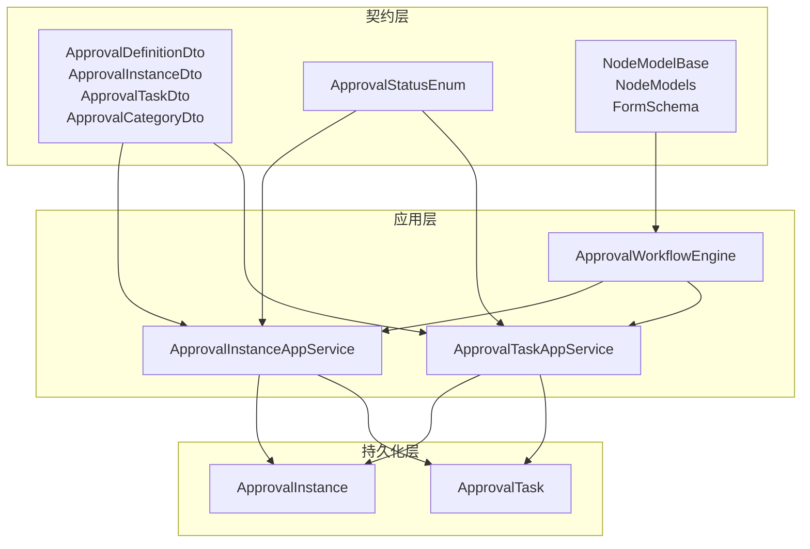
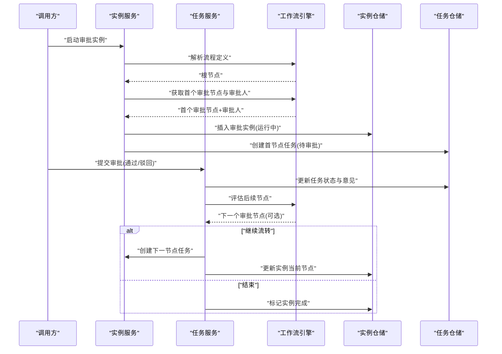
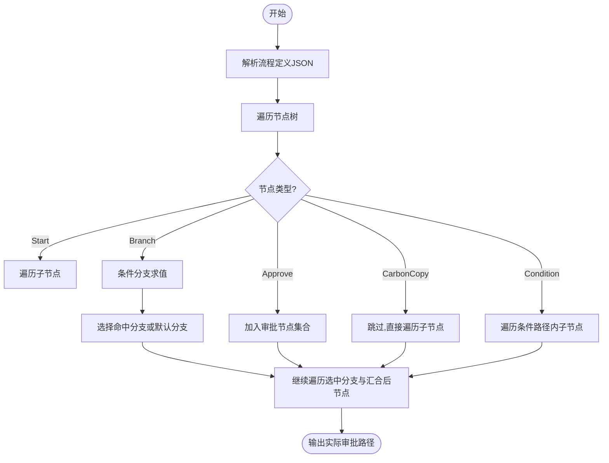
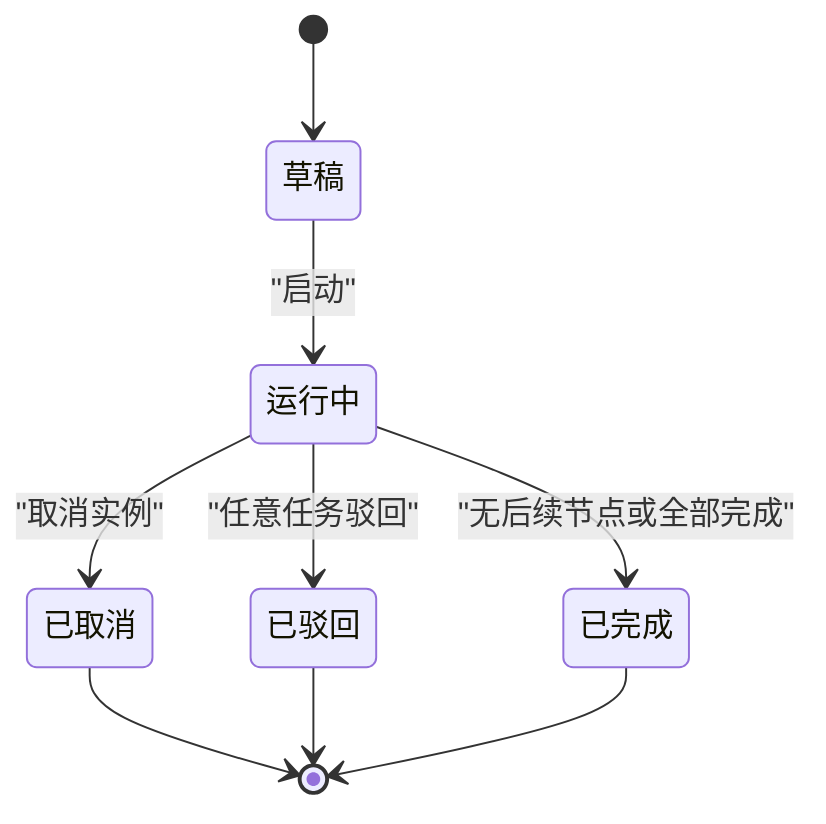
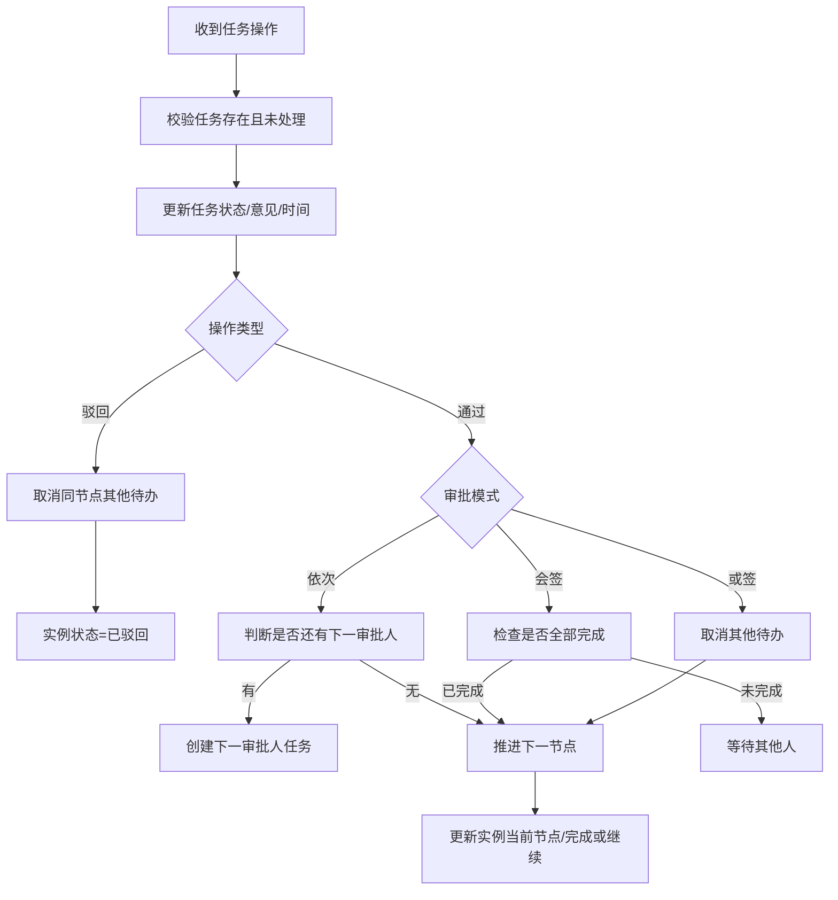
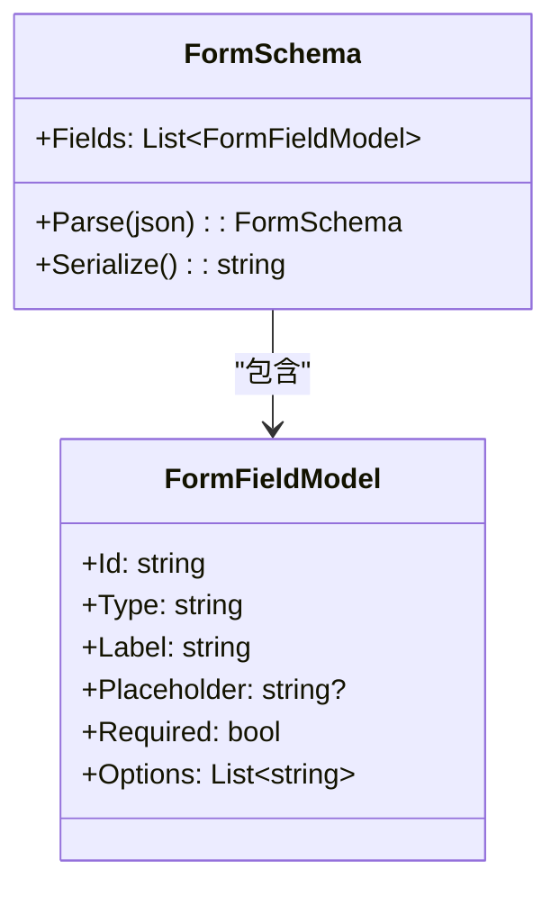
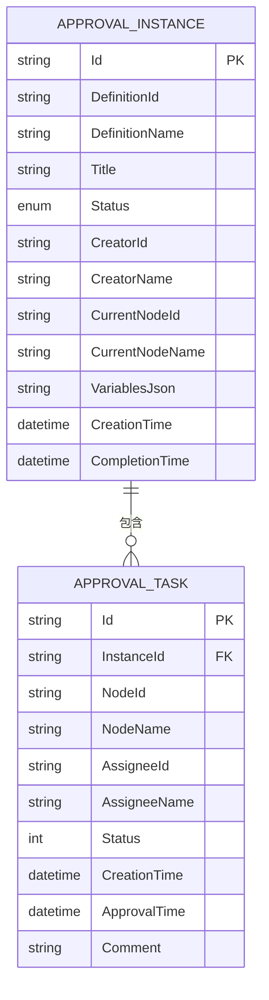
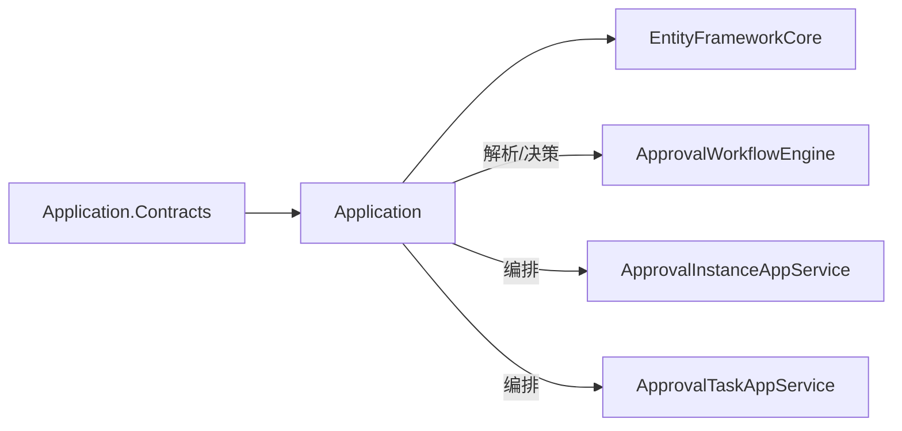

# 审批服务

<cite>
**本文引用的文件**   
- [README.md](file://README.md)
- [ApprovalStatusEnum.cs](file://src/Services/Approval/H.Approval.Application.Contracts/Enums/ApprovalStatusEnum.cs)
- [NodeModelBase.cs](file://src/Services/Approval/H.Approval.Application.Contracts/Workflow/NodeModelBase.cs)
- [NodeModels.cs](file://src/Services/Approval/H.Approval.Application.Contracts/Workflow/NodeModels.cs)
- [FormSchema.cs](file://src/Services/Approval/H.Approval.Application.Contracts/Workflow/FormSchema.cs)
- [ApprovalDefinitionDto.cs](file://src/Services/Approval/H.Approval.Application.Contracts/Dtos/ApprovalDefinitionDto.cs)
- [ApprovalInstanceDto.cs](file://src/Services/Approval/H.Approval.Application.Contracts/Dtos/ApprovalInstanceDto.cs)
- [ApprovalTaskDto.cs](file://src/Services/Approval/H.Approval.Application.Contracts/Dtos/ApprovalTaskDto.cs)
- [ApprovalCategoryDto.cs](file://src/Services/Approval/H.Approval.Application.Contracts/Dtos/ApprovalCategoryDto.cs)
- [ApprovalWorkflowEngine.cs](file://src/Services/Approval/H.Approval.Application/Services/ApprovalWorkflowEngine.cs)
- [ApprovalInstanceAppService.cs](file://src/Services/Approval/H.Approval.Application/Services/ApprovalInstanceAppService.cs)
- [ApprovalTaskAppService.cs](file://src/Services/Approval/H.Approval.Application/Services/ApprovalTaskAppService.cs)
- [ApprovalInstance.cs](file://src/Services/Approval/H.Approval.EntityFrameworkCore/Entities/ApprovalInstance.cs)
- [ApprovalTask.cs](file://src/Services/Approval/H.Approval.EntityFrameworkCore/Entities/ApprovalTask.cs)
</cite>

## 目录
1. [引言](#引言)
2. [项目结构](#项目结构)
3. [核心组件](#核心组件)
4. [架构总览](#架构总览)
5. [详细组件分析](#详细组件分析)
6. [依赖关系分析](#依赖关系分析)
7. [性能与可扩展性](#性能与可扩展性)
8. [故障排查指南](#故障排查指南)
9. [结论](#结论)
10. [附录：典型业务流程示例](#附录典型业务流程示例)

## 引言
本文件面向 H.AppLab 的“审批服务”模块，聚焦工作流引擎、审批流程定义、任务管理与状态机机制。该模块以 JSON 驱动的可视化流程设计为核心，结合领域实体与应用服务，实现从流程建模、实例启动、任务审批到流转结束的全链路能力；同时提供表单 Schema 与变量求值机制，支撑条件分支、动态渲染等高级特性。

根据仓库说明，该项目采用模块化架构，支持单体与按服务独立部署，各业务服务遵循 Application.Contracts / Application / EntityFrameworkCore / Web 分层；审批服务即属于 Services 层中的 Approval 限界上下文。

**章节来源**
- [README.md:1-73](file://README.md#L1-L73)

## 项目结构
审批服务位于 Services/Approval 下，整体采用 ABP 风格分层：
- Application.Contracts：对外契约，包含 DTO、枚举、工作流节点模型与表单 Schema。
- Application：应用服务与工作流引擎，封装用例编排与流程解释执行逻辑。
- EntityFrameworkCore：领域实体、仓储接口与 EF Core 配置。
- Web：Web 层（当前未展开）。

**图表来源**
- [ApprovalDefinitionDto.cs:1-214](file://src/Services/Approval/H.Approval.Application.Contracts/Dtos/ApprovalDefinitionDto.cs#L1-L214)
- [ApprovalInstanceDto.cs:1-93](file://src/Services/Approval/H.Approval.Application.Contracts/Dtos/ApprovalInstanceDto.cs#L1-L93)
- [ApprovalTaskDto.cs:1-88](file://src/Services/Approval/H.Approval.Application.Contracts/Dtos/ApprovalTaskDto.cs#L1-L88)
- [ApprovalCategoryDto.cs:1-54](file://src/Services/Approval/H.Approval.Application.Contracts/Dtos/ApprovalCategoryDto.cs#L1-L54)
- [ApprovalStatusEnum.cs:1-32](file://src/Services/Approval/H.Approval.Application.Contracts/Enums/ApprovalStatusEnum.cs#L1-L32)
- [NodeModelBase.cs:1-98](file://src/Services/Approval/H.Approval.Application.Contracts/Workflow/NodeModelBase.cs#L1-L98)
- [NodeModels.cs:1-205](file://src/Services/Approval/H.Approval.Application.Contracts/Workflow/NodeModels.cs#L1-L205)
- [FormSchema.cs:1-77](file://src/Services/Approval/H.Approval.Application.Contracts/Workflow/FormSchema.cs#L1-L77)
- [ApprovalWorkflowEngine.cs:1-256](file://src/Services/Approval/H.Approval.Application/Services/ApprovalWorkflowEngine.cs#L1-L256)
- [ApprovalInstanceAppService.cs:1-251](file://src/Services/Approval/H.Approval.Application/Services/ApprovalInstanceAppService.cs#L1-L251)
- [ApprovalTaskAppService.cs:1-283](file://src/Services/Approval/H.Approval.Application/Services/ApprovalTaskAppService.cs#L1-L283)
- [ApprovalInstance.cs:1-59](file://src/Services/Approval/H.Approval.EntityFrameworkCore/Entities/ApprovalInstance.cs#L1-L59)
- [ApprovalTask.cs:1-55](file://src/Services/Approval/H.Approval.EntityFrameworkCore/Entities/ApprovalTask.cs#L1-L55)

**章节来源**
- [README.md:1-73](file://README.md#L1-L73)

## 核心组件
- 工作流引擎：负责解析流程定义 JSON、计算可执行路径、求值条件分支、解析审批人列表。
- 应用服务：
  - 实例服务：创建审批实例、定位首个审批节点、按模式生成任务、查询发起记录。
  - 任务服务：待办/已办查询、任务审批、会签/或签处理、推进下一节点、取消兄弟任务。
- 数据模型：
  - 审批定义：流程 JSON、表单 Schema、元信息（名称、版本、分组、权限等）。
  - 审批实例：运行态对象，含状态、发起人、当前节点、变量 JSON。
  - 审批任务：具体待办，含审批人、意见、时间戳与状态。

**章节来源**
- [ApprovalWorkflowEngine.cs:1-256](file://src/Services/Approval/H.Approval.Application/Services/ApprovalWorkflowEngine.cs#L1-L256)
- [ApprovalInstanceAppService.cs:1-251](file://src/Services/Approval/H.Approval.Application/Services/ApprovalInstanceAppService.cs#L1-L251)
- [ApprovalTaskAppService.cs:1-283](file://src/Services/Approval/H.Approval.Application/Services/ApprovalTaskAppService.cs#L1-L283)
- [ApprovalDefinitionDto.cs:1-214](file://src/Services/Approval/H.Approval.Application.Contracts/Dtos/ApprovalDefinitionDto.cs#L1-L214)
- [ApprovalInstance.cs:1-59](file://src/Services/Approval/H.Approval.EntityFrameworkCore/Entities/ApprovalInstance.cs#L1-L59)
- [ApprovalTask.cs:1-55](file://src/Services/Approval/H.Approval.EntityFrameworkCore/Entities/ApprovalTask.cs#L1-L55)

## 架构总览
审批服务由“契约层 + 应用层 + 持久化层”构成。应用层通过工作流引擎对流程定义进行解释执行；实例服务负责启动与基础管理；任务服务负责任务操作与流程推进。

**图表来源**
- [ApprovalInstanceAppService.cs:1-251](file://src/Services/Approval/H.Approval.Application/Services/ApprovalInstanceAppService.cs#L1-L251)
- [ApprovalTaskAppService.cs:1-283](file://src/Services/Approval/H.Approval.Application/Services/ApprovalTaskAppService.cs#L1-L283)
- [ApprovalWorkflowEngine.cs:1-256](file://src/Services/Approval/H.Approval.Application/Services/ApprovalWorkflowEngine.cs#L1-L256)

## 详细组件分析

### 工作流引擎与节点模型
- 节点基类与多态序列化：使用自定义 JSON 转换器根据 nodeType 反序列化为 Start/Approve/CarbonCopy/Condition/Branch/End 等具体节点类型，支持嵌套子节点与条件分支。
- 条件规则：以字段名、操作符与比较值组成的规则列表表达分支条件，多规则为 AND 关系，支持相等、不等、大小写无关比较、包含等。
- 变量求值：将实例变量 JSON 解析为字典，供条件求值使用；数值型自动转为字符串参与比较。
- 路径求解：遍历节点树，在 Branch 处选择一条满足条件的路径，收集 Approve 节点形成“实际执行路径”。
- 审批人解析：根据 ApproverType 从指定成员/角色/发起人自选/部门主管等策略解析审批人列表；为空时回退至发起人。

**图表来源**
- [NodeModelBase.cs:1-98](file://src/Services/Approval/H.Approval.Application.Contracts/Workflow/NodeModelBase.cs#L1-L98)
- [NodeModels.cs:1-205](file://src/Services/Approval/H.Approval.Application.Contracts/Workflow/NodeModels.cs#L1-L205)
- [ApprovalWorkflowEngine.cs:1-256](file://src/Services/Approval/H.Approval.Application/Services/ApprovalWorkflowEngine.cs#L1-L256)

**章节来源**
- [NodeModelBase.cs:1-98](file://src/Services/Approval/H.Approval.Application.Contracts/Workflow/NodeModelBase.cs#L1-L98)
- [NodeModels.cs:1-205](file://src/Services/Approval/H.Approval.Application.Contracts/Workflow/NodeModels.cs#L1-L205)
- [ApprovalWorkflowEngine.cs:1-256](file://src/Services/Approval/H.Approval.Application/Services/ApprovalWorkflowEngine.cs#L1-L256)

### 审批状态机
- 实例状态：草稿、运行中、已完成、已取消、已驳回。
- 任务状态：待审批、已通过、已驳回、已取消。
- 关键转换：
  - 启动：实例进入运行中，设置当前节点与首任务。
  - 通过：根据审批模式决定是否继续当前节点或流转下一节点；若无后续节点则完成实例。
  - 驳回：同节点其他待办任务被取消，实例状态变为已驳回并记录完成时间。
  - 取消：实例取消，所有待审批任务置为已取消。

**图表来源**
- [ApprovalStatusEnum.cs:1-32](file://src/Services/Approval/H.Approval.Application.Contracts/Enums/ApprovalStatusEnum.cs#L1-L32)
- [ApprovalInstanceAppService.cs:1-251](file://src/Services/Approval/H.Approval.Application/Services/ApprovalInstanceAppService.cs#L1-L251)
- [ApprovalTaskAppService.cs:1-283](file://src/Services/Approval/H.Approval.Application/Services/ApprovalTaskAppService.cs#L1-L283)

**章节来源**
- [ApprovalStatusEnum.cs:1-32](file://src/Services/Approval/H.Approval.Application.Contracts/Enums/ApprovalStatusEnum.cs#L1-L32)
- [ApprovalInstanceAppService.cs:1-251](file://src/Services/Approval/H.Approval.Application/Services/ApprovalInstanceAppService.cs#L1-L251)
- [ApprovalTaskAppService.cs:1-283](file://src/Services/Approval/H.Approval.Application/Services/ApprovalTaskAppService.cs#L1-L283)

### 任务管理与审批模式
- 依次审批：仅创建当前顺序中的第一个审批人任务；通过后创建下一个审批人任务，直到最后一个。
- 会签：为所有审批人创建任务，需全部通过才流转。
- 或签：为所有审批人创建任务，一人通过即可，其余待办任务取消。
- 任务操作：
  - 通过：更新任务状态与意见；若处于会签且仍有待办则等待；否则推进下一节点。
  - 驳回：取消同节点其他待办任务，实例结束并标记已驳回。
  - 查询：支持待办、已办与按实例的历史任务查询。

**图表来源**
- [ApprovalTaskAppService.cs:1-283](file://src/Services/Approval/H.Approval.Application/Services/ApprovalTaskAppService.cs#L1-L283)
- [ApprovalInstanceAppService.cs:1-251](file://src/Services/Approval/H.Approval.Application/Services/ApprovalInstanceAppService.cs#L1-L251)

**章节来源**
- [ApprovalTaskAppService.cs:1-283](file://src/Services/Approval/H.Approval.Application/Services/ApprovalTaskAppService.cs#L1-L283)
- [ApprovalInstanceAppService.cs:1-251](file://src/Services/Approval/H.Approval.Application/Services/ApprovalInstanceAppService.cs#L1-L251)

### 表单设计与动态渲染
- 表单 Schema：定义字段类型（输入框、多行文本、数字、金额、日期、区间、单选、多选、说明文字等）、标签、占位符、必填与选项。
- 序列化：支持从 JSON 解析 Schema 与反向序列化，便于前端动态渲染与后端校验。
- 与流程解耦：表单 Schema 存储于审批定义中，流程引擎不直接依赖 UI 细节，便于复用与扩展。

**图表来源**
- [FormSchema.cs:1-77](file://src/Services/Approval/H.Approval.Application.Contracts/Workflow/FormSchema.cs#L1-L77)

**章节来源**
- [FormSchema.cs:1-77](file://src/Services/Approval/H.Approval.Application.Contracts/Workflow/FormSchema.cs#L1-L77)

### 数据模型与审计追踪
- 审批实例：包含租户标识、定义关联、标题、状态、发起人、当前节点、变量 JSON、创建与完成时间，以及与任务的导航属性。
- 审批任务：包含实例关联、节点 ID、节点名称、审批人、状态、创建与审批时间、审批意见。
- 审计要点：
  - 每个任务记录审批时间与意见，可作为审计轨迹。
  - 实例的创建与完成时间用于生命周期审计。
  - 取消/驳回等关键动作均会更新相关任务状态与备注，便于追溯。

**图表来源**
- [ApprovalInstance.cs:1-59](file://src/Services/Approval/H.Approval.EntityFrameworkCore/Entities/ApprovalInstance.cs#L1-L59)
- [ApprovalTask.cs:1-55](file://src/Services/Approval/H.Approval.EntityFrameworkCore/Entities/ApprovalTask.cs#L1-L55)

**章节来源**
- [ApprovalInstance.cs:1-59](file://src/Services/Approval/H.Approval.EntityFrameworkCore/Entities/ApprovalInstance.cs#L1-L59)
- [ApprovalTask.cs:1-55](file://src/Services/Approval/H.Approval.EntityFrameworkCore/Entities/ApprovalTask.cs#L1-L55)

## 依赖关系分析
- 契约层被应用层与 Web 层引用，定义稳定的 API 与数据结构。
- 应用层依赖工作流引擎完成流程解释与决策；实例服务与任务服务之间通过协作方法（如创建节点任务）共同维护实例与任务的一致性。
- 持久化层仅提供实体与仓储接口，应用层通过仓储完成增删改查。

**图表来源**
- [ApprovalWorkflowEngine.cs:1-256](file://src/Services/Approval/H.Approval.Application/Services/ApprovalWorkflowEngine.cs#L1-L256)
- [ApprovalInstanceAppService.cs:1-251](file://src/Services/Approval/H.Approval.Application/Services/ApprovalInstanceAppService.cs#L1-L251)
- [ApprovalTaskAppService.cs:1-283](file://src/Services/Approval/H.Approval.Application/Services/ApprovalTaskAppService.cs#L1-L283)

**章节来源**
- [ApprovalWorkflowEngine.cs:1-256](file://src/Services/Approval/H.Approval.Application/Services/ApprovalWorkflowEngine.cs#L1-L256)
- [ApprovalInstanceAppService.cs:1-251](file://src/Services/Approval/H.Approval.Application/Services/ApprovalInstanceAppService.cs#L1-L251)
- [ApprovalTaskAppService.cs:1-283](file://src/Services/Approval/H.Approval.Application/Services/ApprovalTaskAppService.cs#L1-L283)

## 性能与可扩展性
- 流程解析与路径求解：基于一次深度优先遍历构建实际审批路径，时间复杂度与节点数量线性相关；适合中小规模流程。
- 变量求值：对每条规则的字段取值与比较均为常数时间；多规则 AND 组合仍保持线性复杂度。
- 任务批量更新：或签/驳回场景可能批量更新任务，注意数据库事务与索引优化（建议对 InstanceId、NodeId、AssigneeId、Status 建立合适索引）。
- 可扩展点：
  - 审批人解析：当前部门主管未集成外部组织服务，可在 ResolveAssignees 中接入组织服务以实现动态解析。
  - 条件表达式：可引入表达式引擎提升条件表达能力。
  - 异步通知：可在任务创建/完成/驳回处对接通知服务，发送待办提醒与消息推送。

[本节为通用指导，不涉及具体代码文件]

## 故障排查指南
- 启动失败：
  - 现象：启动实例时报“流程定义为空”。
  - 原因：流程定义 JSON 缺失或无效。
  - 处理：检查审批定义的 DefinitionJson 是否为有效节点树。
  - 参考路径：[ApprovalInstanceAppService.cs:1-251](file://src/Services/Approval/H.Approval.Application/Services/ApprovalInstanceAppService.cs#L1-L251)
- 重复审批：
  - 现象：重复调用审批接口抛出“任务已处理”异常。
  - 原因：同一任务被多次操作。
  - 处理：确保前端幂等控制，避免重复提交。
  - 参考路径：[ApprovalTaskAppService.cs:1-283](file://src/Services/Approval/H.Approval.Application/Services/ApprovalTaskAppService.cs#L1-L283)
- 流程卡住：
  - 现象：会签模式下流程长时间等待。
  - 原因：仍有未处理的审批任务。
  - 处理：确认所有审批人均已完成任务；必要时由管理员介入。
  - 参考路径：[ApprovalTaskAppService.cs:1-283](file://src/Services/Approval/H.Approval.Application/Services/ApprovalTaskAppService.cs#L1-L283)
- 条件分支不生效：
  - 现象：未按预期走特定分支。
  - 原因：变量缺失或规则不匹配。
  - 处理：检查 VariablesJson 字段与 ConditionRule 的 Field、Operator、Value。
  - 参考路径：[ApprovalWorkflowEngine.cs:1-256](file://src/Services/Approval/H.Approval.Application/Services/ApprovalWorkflowEngine.cs#L1-L256)

**章节来源**
- [ApprovalInstanceAppService.cs:1-251](file://src/Services/Approval/H.Approval.Application/Services/ApprovalInstanceAppService.cs#L1-L251)
- [ApprovalTaskAppService.cs:1-283](file://src/Services/Approval/H.Approval.Application/Services/ApprovalTaskAppService.cs#L1-L283)
- [ApprovalWorkflowEngine.cs:1-256](file://src/Services/Approval/H.Approval.Application/Services/ApprovalWorkflowEngine.cs#L1-L256)

## 结论
审批服务以 JSON 驱动的流程定义为核心，结合工作流引擎与任务服务，实现了灵活的可视化流程建模、条件分支与多种审批模式。实例与任务实体清晰记录了生命周期与审计信息，便于追溯与分析。未来可通过接入组织服务、表达式引擎与通知服务进一步增强其业务能力与用户体验。

[本节为总结性内容，不涉及具体代码文件]

## 附录：典型业务流程示例

### 请假审批（依次审批）
- 流程设计：发起人 → 直接主管审批（依次） → 结束。
- 关键点：
  - 依次审批：仅当前审批人通过后，才创建下一审批人任务。
  - 变量：可用于记录请假天数、起始日期等，但本例无需条件分支。
- 结果：最终由最后一名审批人通过后，实例完成。

参考实现路径：
- [ApprovalInstanceAppService.cs:1-251](file://src/Services/Approval/H.Approval.Application/Services/ApprovalInstanceAppService.cs#L1-L251)
- [ApprovalTaskAppService.cs:1-283](file://src/Services/Approval/H.Approval.Application/Services/ApprovalTaskAppService.cs#L1-L283)
- [ApprovalWorkflowEngine.cs:1-256](file://src/Services/Approval/H.Approval.Application/Services/ApprovalWorkflowEngine.cs#L1-L256)

### 采购审批（会签）
- 流程设计：发起人 → 财务与法务会签 → 结束。
- 关键点：
  - 会签：所有审批人都必须通过，才会流转。
  - 任一任务驳回：实例立即结束并标记已驳回。
- 结果：全部通过后，实例完成；否则任一驳回即终止。

参考实现路径：
- [ApprovalTaskAppService.cs:1-283](file://src/Services/Approval/H.Approval.Application/Services/ApprovalTaskAppService.cs#L1-L283)

### 合同审批（条件分支）
- 流程设计：发起人 → 条件分支（金额≥阈值走法务审批，否则跳过） → 结束。
- 关键点：
  - 变量：金额字段用于条件求值。
  - 条件规则：金额大于等于阈值时进入法务审批分支。
- 结果：满足条件时增加法务节点；否则直接进入结束。

参考实现路径：
- [ApprovalWorkflowEngine.cs:1-256](file://src/Services/Approval/H.Approval.Application/Services/ApprovalWorkflowEngine.cs#L1-L256)
- [NodeModels.cs:1-205](file://src/Services/Approval/H.Approval.Application.Contracts/Workflow/NodeModels.cs#L1-L205)