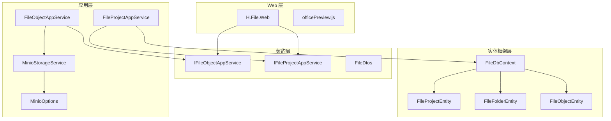
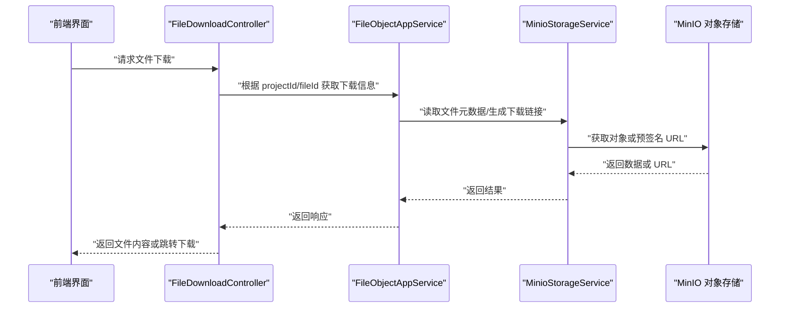
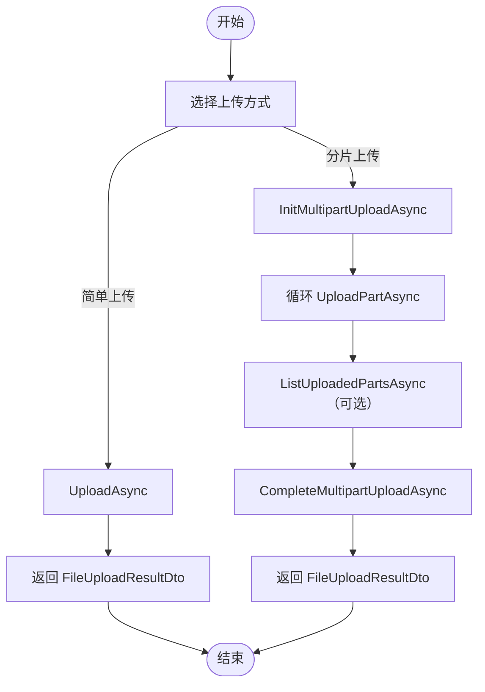
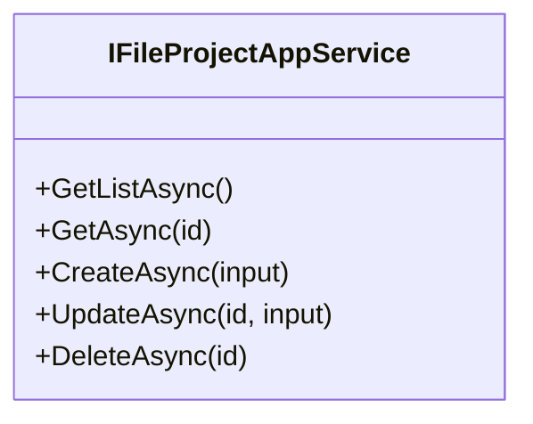
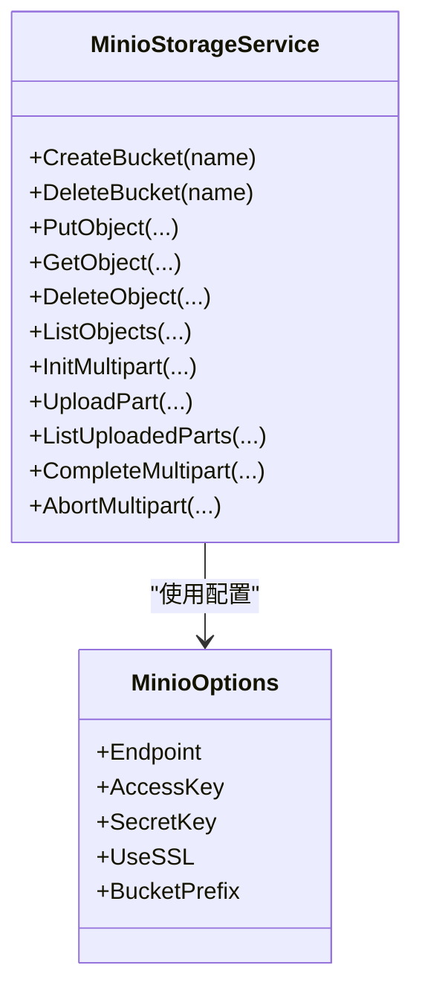
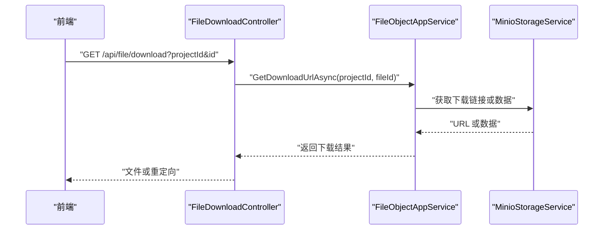
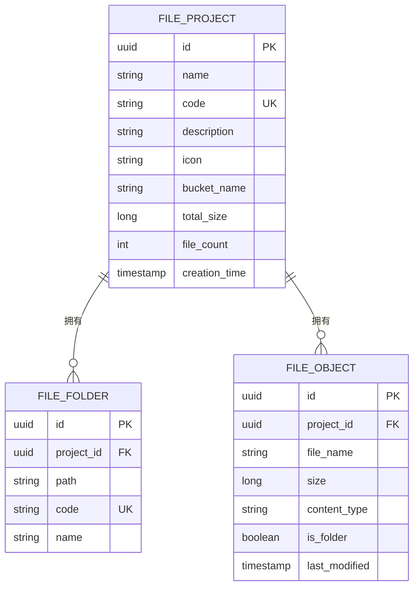
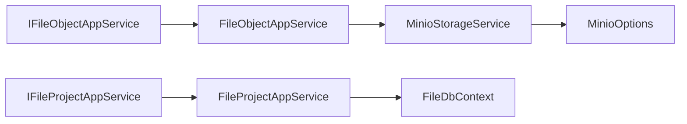

# 文件服务

<cite>
**本文引用的文件**   
- [IFileObjectAppService.cs](file://src/Services/File/H.File.Application.Contracts/Services/IFileObjectAppService.cs)
- [IFileProjectAppService.cs](file://src/Services/File/H.File.Application.Contracts/Services/IFileProjectAppService.cs)
- [FileDtos.cs](file://src/Services/File/H.File.Application.Contracts/Dtos/FileDtos.cs)
- [MinioOptions.cs](file://src/Services/File/H.File.Application/MinioOptions.cs)
- [MinioStorageService.cs](file://src/Services/File/H.File.Application/Services/MinioStorageService.cs)
- [FileObjectAppService.cs](file://src/Services/File/H.File.Application/Services/FileObjectAppService.cs)
- [FileProjectAppService.cs](file://src/Services/File/H.File.Application/Services/FileProjectAppService.cs)
- [FileDownloadController.cs](file://src/Services/File/H.File.Application/Controllers/FileDownloadController.cs)
- [FileFolderEntity.cs](file://src/Services/File/H.File.EntityFrameworkCore/Entities/FileFolderEntity.cs)
- [FileProjectEntity.cs](file://src/Services/File/H.File.EntityFrameworkCore/Entities/FileProjectEntity.cs)
- [FileObjectEntity.cs](file://src/Services/File/H.File.EntityFrameworkCore/Entities/FileObjectEntity.cs)
- [FileDbContext.cs](file://src/Services/File/H.File.EntityFrameworkCore/FileDbContext.cs)
- [FileApplicationModule.cs](file://src/Services/File/H.File.Application/FileApplicationModule.cs)
- [FileWebModule.cs](file://src/Services/File/H.File.Web/FileWebModule.cs)
- [officePreview.js](file://src/Services/File/H.File.Web/wwwroot/js/officePreview.js)
</cite>

## 目录
1. [引言](#引言)
2. [项目结构](#项目结构)
3. [核心组件](#核心组件)
4. [架构总览](#架构总览)
5. [详细组件分析](#详细组件分析)
6. [依赖关系分析](#依赖关系分析)
7. [性能与优化](#性能与优化)
8. [故障排查指南](#故障排查指南)
9. [结论](#结论)

## 引言
H.AppLab 文件服务模块提供统一的文件上传、下载、预览、分片上传、断点续传、文件夹管理以及基于 MinIO 的对象存储能力。该模块通过 ABP 应用服务暴露接口，将业务语义（项目、分类、文件对象）与底层对象存储解耦，便于在图片、文档、视频等常见场景中复用。

本模块的关键特性包括：
- 文件上传下载：支持普通上传与分片上传；提供可安全使用的下载 URL 与直接流式下载。
- 存储管理：以“项目”对应 MinIO Bucket，以“分类（文件夹）”组织目录前缀，以“文件对象”持久化元数据。
- 权限与安全：通过项目维度隔离 Bucket，结合后端鉴权与可选的签名 URL 控制访问。
- 高级特性：分片上传、断点续传、Office/PDF/图片/文本预览。
- 集成方式：通过 IFileObjectAppService 与 IFileProjectAppService 供其他业务模块调用。

## 项目结构
文件服务采用分层与按领域划分相结合的组织方式：
- 应用契约层 H.File.Application.Contracts：定义对外 API 接口与 DTO。
- 应用层 H.File.Application：实现业务逻辑、MinIO 集成、分片上传流程。
- 实体框架层 H.File.EntityFrameworkCore：定义实体、上下文与数据库映射。
- Web 层 H.File.Web：Blazor 页面、静态资源、前端 Office 预览脚本。
- 工具迁移层 H.File.DbMigrator：用于数据库初始化与迁移。

**图示来源**
- [FileObjectAppService.cs](file://src/Services/File/H.File.Application/Services/FileObjectAppService.cs)
- [FileProjectAppService.cs](file://src/Services/File/H.File.Application/Services/FileProjectAppService.cs)
- [MinioStorageService.cs](file://src/Services/File/H.File.Application/Services/MinioStorageService.cs)
- [MinioOptions.cs](file://src/Services/File/H.File.Application/MinioOptions.cs)
- [IFileObjectAppService.cs](file://src/Services/File/H.File.Application.Contracts/Services/IFileObjectAppService.cs)
- [IFileProjectAppService.cs](file://src/Services/File/H.File.Application.Contracts/Services/IFileProjectAppService.cs)
- [FileDtos.cs](file://src/Services/File/H.File.Application.Contracts/Dtos/FileDtos.cs)
- [FileDbContext.cs](file://src/Services/File/H.File.EntityFrameworkCore/FileDbContext.cs)
- [FileProjectEntity.cs](file://src/Services/File/H.File.EntityFrameworkCore/Entities/FileProjectEntity.cs)
- [FileFolderEntity.cs](file://src/Services/File/H.File.EntityFrameworkCore/Entities/FileFolderEntity.cs)
- [FileObjectEntity.cs](file://src/Services/File/H.File.EntityFrameworkCore/Entities/FileObjectEntity.cs)
- [officePreview.js](file://src/Services/File/H.File.Web/wwwroot/js/officePreview.js)

**章节来源**
- [IFileObjectAppService.cs:1-52](file://src/Services/File/H.File.Application.Contracts/Services/IFileObjectAppService.cs#L1-L52)
- [IFileProjectAppService.cs:1-25](file://src/Services/File/H.File.Application.Contracts/Services/IFileProjectAppService.cs#L1-L25)
- [FileDtos.cs:1-191](file://src/Services/File/H.File.Application.Contracts/Dtos/FileDtos.cs#L1-L191)

## 核心组件
- 文件对象应用服务 IFileObjectAppService：封装文件列表、文件夹树、上传、下载、预览、删除、分片上传等能力。
- 文件项目应用服务 IFileProjectAppService：封装项目（Bucket）CRUD，创建时同步创建 Bucket，删除时级联清理。
- MinIO 存储适配器 MinioStorageService：对接 MinIO SDK，完成桶与对象操作、分片上传与续传查询。
- 配置 MinioOptions：集中承载 MinIO 连接参数。
- 控制器 FileDownloadController：提供安全的文件下载端点。
- 实体模型：FileProjectEntity、FileFolderEntity、FileObjectEntity，配合 FileDbContext 进行持久化。
- Web 资源 officePreview.js：辅助前端解析并渲染 Office 文档。

**章节来源**
- [IFileObjectAppService.cs:1-52](file://src/Services/File/H.File.Application.Contracts/Services/IFileObjectAppService.cs#L1-L52)
- [IFileProjectAppService.cs:1-25](file://src/Services/File/H.File.Application.Contracts/Services/IFileProjectAppService.cs#L1-L25)
- [MinioStorageService.cs](file://src/Services/File/H.File.Application/Services/MinioStorageService.cs)
- [MinioOptions.cs](file://src/Services/File/H.File.Application/MinioOptions.cs)
- [FileDownloadController.cs](file://src/Services/File/H.File.Application/Controllers/FileDownloadController.cs)
- [FileProjectEntity.cs](file://src/Services/File/H.File.EntityFrameworkCore/Entities/FileProjectEntity.cs)
- [FileFolderEntity.cs](file://src/Services/File/H.File.EntityFrameworkCore/Entities/FileFolderEntity.cs)
- [FileObjectEntity.cs](file://src/Services/File/H.File.EntityFrameworkCore/Entities/FileObjectEntity.cs)
- [FileDbContext.cs](file://src/Services/File/H.File.EntityFrameworkCore/FileDbContext.cs)
- [officePreview.js](file://src/Services/File/H.File.Web/wwwroot/js/officePreview.js)

## 架构总览
文件服务遵循 ABP 典型分层：
- Web 层通过 Blazor 页面或 HTTP 客户端调用契约层接口。
- 应用层实现具体业务逻辑，协调实体框架与对象存储。
- 实体框架层负责持久化文件元数据与分类结构。
- MinIO 作为外部对象存储后端，承担二进制对象与分片数据的持久化。

**图示来源**
- [FileDownloadController.cs](file://src/Services/File/H.File.Application/Controllers/FileDownloadController.cs)
- [FileObjectAppService.cs](file://src/Services/File/H.File.Application/Services/FileObjectAppService.cs)
- [MinioStorageService.cs](file://src/Services/File/H.File.Application/Services/MinioStorageService.cs)

## 详细组件分析

### 文件对象应用服务 IFileObjectAppService
职责边界：
- 文件列表与分类树：按项目与路径枚举文件与文件夹。
- 上传：支持普通上传与分片上传（初始化、上传分片、查询已上传分片、完成合并、取消）。
- 下载与预览：返回安全下载 URL，或返回可直接预览的内容（图片、文本、PDF、Office 等）。
- 分类管理：创建、重命名、删除分类（仅修改显示名称，不改变分类编号）。

关键方法与数据结构：
- GetFilesAsync / GetFolderTreeAsync：列举文件与构建分类树。
- UploadAsync：简单上传，返回 FileUploadResultDto。
- GetDownloadUrlAsync：返回 FileDownloadResultDto，避免裸字符串导致的类型问题。
- GetPreviewAsync：返回 FilePreviewDto，包含预览类型与必要内容。
- InitMultipartUploadAsync / UploadPartAsync / ListUploadedPartsAsync / CompleteMultipartUploadAsync / AbortMultipartUploadAsync：完整分片生命周期。

**图示来源**
- [IFileObjectAppService.cs:1-52](file://src/Services/File/H.File.Application.Contracts/Services/IFileObjectAppService.cs#L1-L52)
- [FileDtos.cs:1-191](file://src/Services/File/H.File.Application.Contracts/Dtos/FileDtos.cs#L1-L191)

**章节来源**
- [IFileObjectAppService.cs:1-52](file://src/Services/File/H.File.Application.Contracts/Services/IFileObjectAppService.cs#L1-L52)
- [FileDtos.cs:1-191](file://src/Services/File/H.File.Application.Contracts/Dtos/FileDtos.cs#L1-L191)

### 文件项目应用服务 IFileProjectAppService
职责边界：
- 项目（Bucket）CRUD：创建项目时同时创建 MinIO Bucket；删除项目时级联删除 Bucket 及其全部文件。
- 项目信息维护：更新项目名称、描述、图标等元数据。

关键方法：
- GetListAsync / GetAsync：查询项目列表与单个项目。
- CreateAsync：创建项目并同步创建 Bucket。
- UpdateAsync：更新项目信息。
- DeleteAsync：删除项目并清理底层存储。

**图示来源**
- [IFileProjectAppService.cs:1-25](file://src/Services/File/H.File.Application.Contracts/Services/IFileProjectAppService.cs#L1-L25)

**章节来源**
- [IFileProjectAppService.cs:1-25](file://src/Services/File/H.File.Application.Contracts/Services/IFileProjectAppService.cs#L1-L25)

### MinIO 对象存储集成 MinioStorageService
职责边界：
- 封装 MinIO SDK 调用，屏蔽对象存储细节。
- 提供桶与对象的增删改查、分片上传与续传查询。
- 与 MinioOptions 协同，从配置加载连接参数。

典型能力：
- 桶管理：创建、删除、检查存在性。
- 对象操作：上传、下载、删除、列出对象。
- 分片上传：初始化分片、上传分片、查询已上传分片、完成合并、取消分片。

**图示来源**
- [MinioStorageService.cs](file://src/Services/File/H.File.Application/Services/MinioStorageService.cs)
- [MinioOptions.cs](file://src/Services/File/H.File.Application/MinioOptions.cs)

**章节来源**
- [MinioStorageService.cs](file://src/Services/File/H.File.Application/Services/MinioStorageService.cs)
- [MinioOptions.cs](file://src/Services/File/H.File.Application/MinioOptions.cs)

### 文件下载控制器 FileDownloadController
职责边界：
- 提供受控的文件下载入口，避免直接暴露对象存储地址。
- 结合应用服务获取下载 URL 或直接输出文件流。

建议用法：
- 前端通过后端控制器下载，或由控制器返回安全的下载链接。
- 对敏感文件启用签名 URL 或临时授权。

**图示来源**
- [FileDownloadController.cs](file://src/Services/File/H.File.Application/Controllers/FileDownloadController.cs)
- [FileObjectAppService.cs](file://src/Services/File/H.File.Application/Services/FileObjectAppService.cs)

**章节来源**
- [FileDownloadController.cs](file://src/Services/File/H.File.Application/Controllers/FileDownloadController.cs)

### 实体与数据库模型
- FileProjectEntity：项目主记录，关联 BucketName、统计信息等。
- FileFolderEntity：分类（文件夹），以 Path/Code/Name 表达层级结构。
- FileObjectEntity：文件对象，保存文件名、大小、内容类型、是否文件夹等元数据。
- FileDbContext：统一 DbContext，注册实体并配置关系。

**图示来源**
- [FileProjectEntity.cs](file://src/Services/File/H.File.EntityFrameworkCore/Entities/FileProjectEntity.cs)
- [FileFolderEntity.cs](file://src/Services/File/H.File.EntityFrameworkCore/Entities/FileFolderEntity.cs)
- [FileObjectEntity.cs](file://src/Services/File/H.File.EntityFrameworkCore/Entities/FileObjectEntity.cs)
- [FileDbContext.cs](file://src/Services/File/H.File.EntityFrameworkCore/FileDbContext.cs)

**章节来源**
- [FileProjectEntity.cs](file://src/Services/File/H.File.EntityFrameworkCore/Entities/FileProjectEntity.cs)
- [FileFolderEntity.cs](file://src/Services/File/H.File.EntityFrameworkCore/Entities/FileFolderEntity.cs)
- [FileObjectEntity.cs](file://src/Services/File/H.File.EntityFrameworkCore/Entities/FileObjectEntity.cs)
- [FileDbContext.cs](file://src/Services/File/H.File.EntityFrameworkCore/FileDbContext.cs)

### 前端 Office 预览 officePreview.js
职责边界：
- 在前端解析 Office 文档（如 docx/xlsx/pptx），结合 jszip 等库渲染内容。
- 与后端返回的 Base64 内容或预览 URL 协作，提升用户体验。

使用要点：
- 当后端返回 Base64Content 时，前端通过 officePreview.js 解析并展示。
- 对于大文件，建议优先使用预览 URL 直连方式，减少内存压力。

**章节来源**
- [officePreview.js](file://src/Services/File/H.File.Web/wwwroot/js/officePreview.js)

## 依赖关系分析
- 契约层与应用层：
  - FileObjectAppService 与 FileProjectAppService 分别实现 IFileObjectAppService 与 IFileProjectAppService。
- 应用层与基础设施：
  - FileObjectAppService 与 FileProjectAppService 依赖 MinioStorageService 与 FileDbContext。
  - MinioStorageService 依赖 MinioOptions 配置。
- Web 层：
  - Blazor 页面通过 IFileObjectAppService 与 IFileProjectAppService 调用服务。
  - FileDownloadController 暴露 HTTP 端点，方便非 Blazor 场景使用。

**图示来源**
- [FileObjectAppService.cs](file://src/Services/File/H.File.Application/Services/FileObjectAppService.cs)
- [FileProjectAppService.cs](file://src/Services/File/H.File.Application/Services/FileProjectAppService.cs)
- [MinioStorageService.cs](file://src/Services/File/H.File.Application/Services/MinioStorageService.cs)
- [MinioOptions.cs](file://src/Services/File/H.File.Application/MinioOptions.cs)
- [IFileObjectAppService.cs](file://src/Services/File/H.File.Application.Contracts/Services/IFileObjectAppService.cs)
- [IFileProjectAppService.cs](file://src/Services/File/H.File.Application.Contracts/Services/IFileProjectAppService.cs)
- [FileDbContext.cs](file://src/Services/File/H.File.EntityFrameworkCore/FileDbContext.cs)

**章节来源**
- [FileApplicationModule.cs](file://src/Services/File/H.File.Application/FileApplicationModule.cs)
- [FileWebModule.cs](file://src/Services/File/H.File.Web/FileWebModule.cs)

## 性能与优化
- 分片上传与断点续传：
  - 默认分片大小为固定常量，适合大文件稳定传输；通过 ListUploadedParts 可恢复未完成的分片。
  - 建议在客户端实现并发上传与重试机制，降低网络抖动影响。
- 下载优化：
  - 优先返回安全下载 URL，让浏览器或 CDN 直接拉取，减轻服务端带宽压力。
  - 对热点小文件可在网关或 CDN 层缓存，缩短首字节时间。
- 预览优化：
  - 图片、PDF 等可直接预览的资源使用预览 URL。
  - Office 文档使用 Base64 内容时，注意文件大小限制与前端内存占用；必要时改用服务器端转码或分块下载。
- 存储与索引：
  - 合理设计 Bucket 与分类前缀，避免单目录对象过多导致枚举缓慢。
  - 定期汇总项目统计信息（TotalSize、FileCount），减少重复计算。

[本节为通用性能指导，不涉及具体文件分析]

## 故障排查指南
- 下载失败或类型错误：
  - 确认返回的是结构化下载结果而非裸字符串，避免 ABP 约定导致 Content-Type 异常。
  - 检查 FileDownloadController 是否正确转发响应体。
- 分片上传中断：
  - 使用 ListUploadedParts 查询已上传分片，重新补传缺失分片后调用完成合并。
  - 校验 UploadId 与 ObjectKey 一致性，确保与初始化阶段一致。
- MinIO 连接问题：
  - 核对 MinioOptions 的 Endpoint、AccessKey、SecretKey、UseSSL 等配置。
  - 检查网络连通性与 Bucket 是否存在。
- 预览异常：
  - Office 文档需确保前端引入了必要的解析库；Base64 过大时建议改用 URL 预览。
  - 文本类文件注意编码问题，必要时在后端指定正确的 ContentType。

**章节来源**
- [FileDownloadController.cs](file://src/Services/File/H.File.Application/Controllers/FileDownloadController.cs)
- [MinioOptions.cs](file://src/Services/File/H.File.Application/MinioOptions.cs)
- [officePreview.js](file://src/Services/File/H.File.Web/wwwroot/js/officePreview.js)

## 结论
H.AppLab 文件服务模块以清晰的 ABP 分层与 MinIO 对象存储为核心，提供了完善的文件上传下载、分片与断点续传、分类管理与预览能力。通过项目维度的 Bucket 隔离、安全下载控制与前端 Office 预览，能够满足图片、文档、视频等常见业务场景。在实际使用中，建议结合 CDN 加速、合理的分类结构与缓存策略，以获得更好的性能与稳定性。