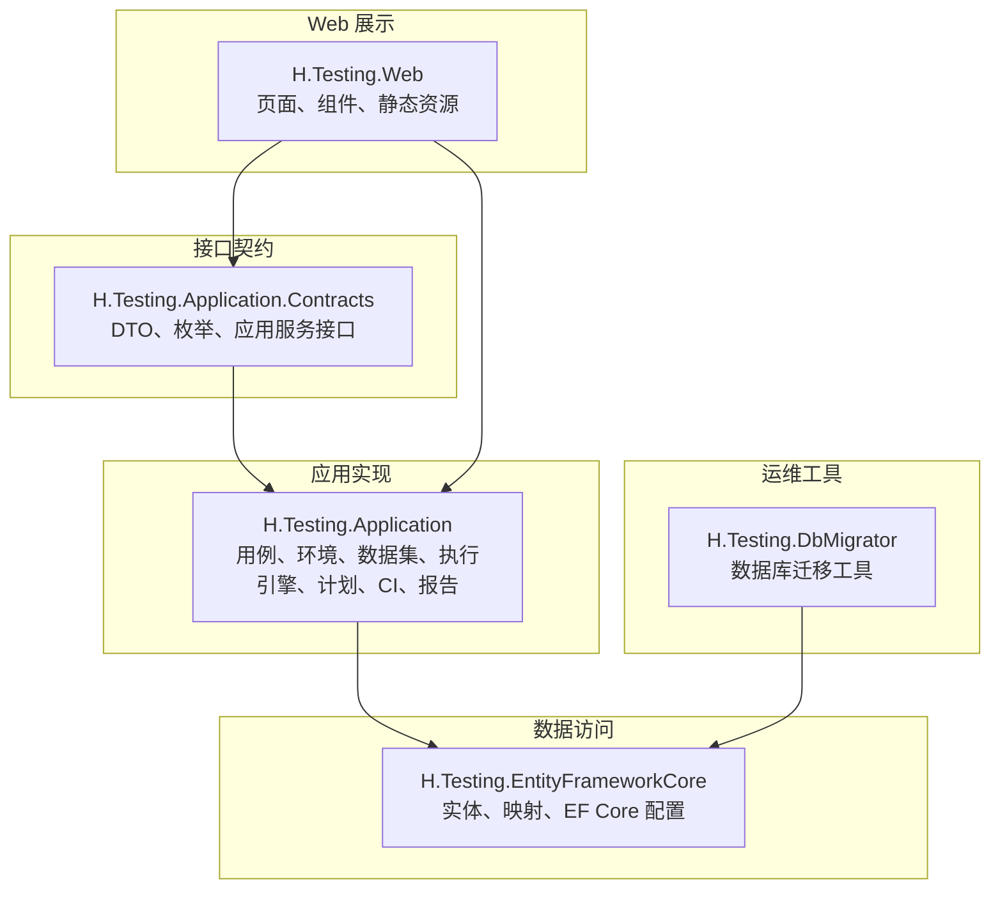
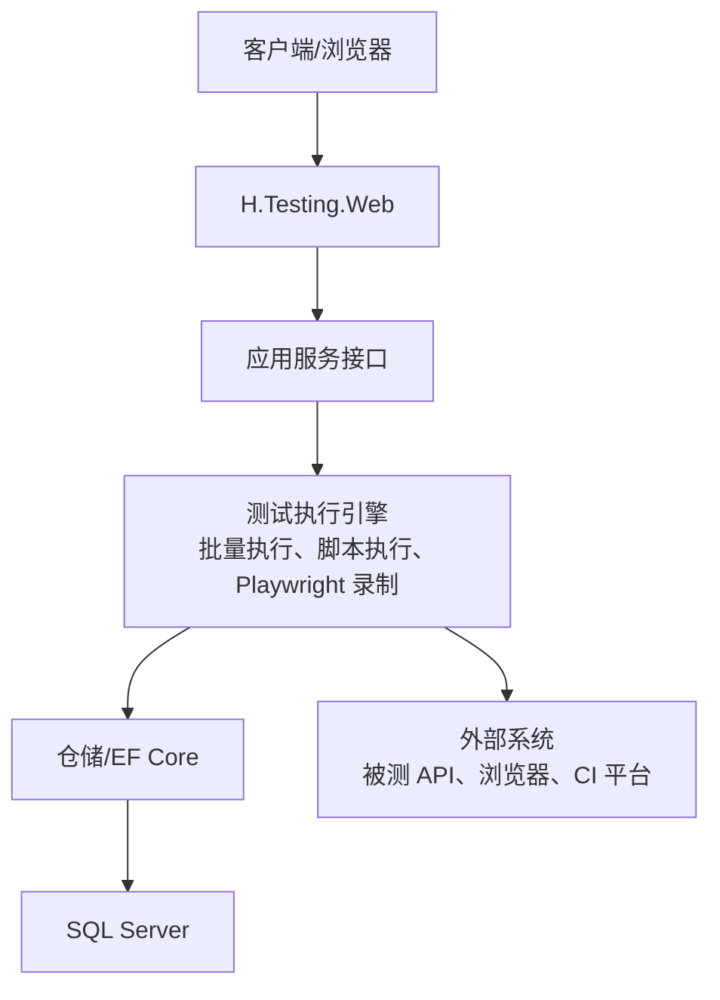
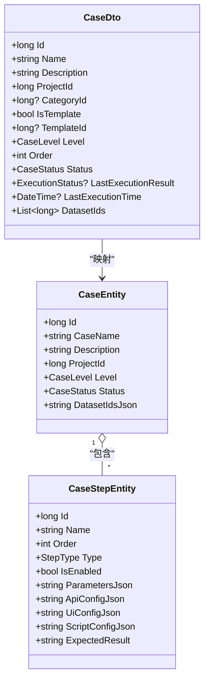
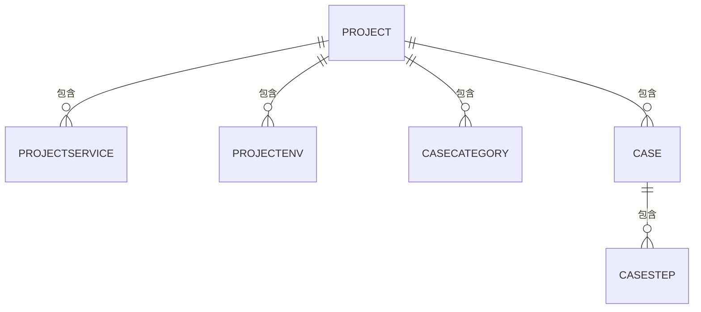
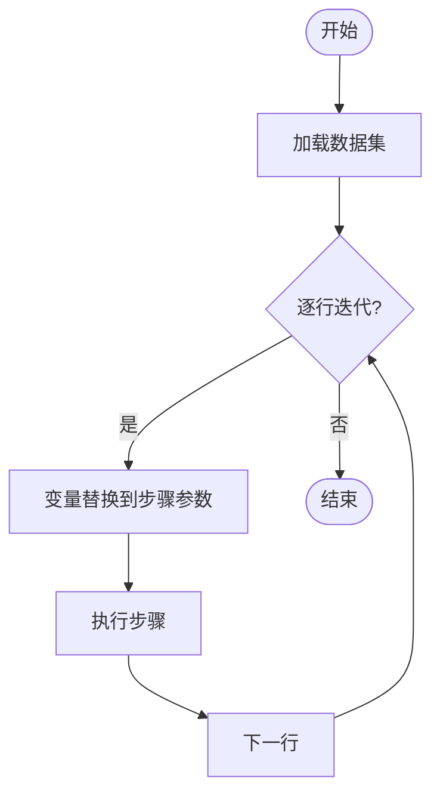
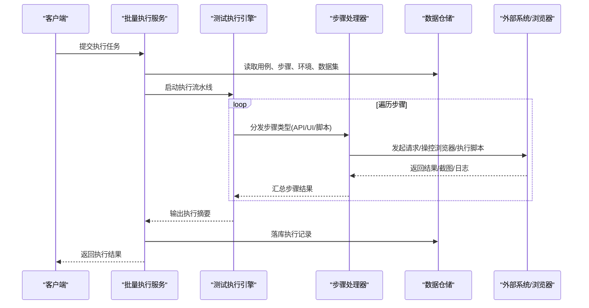
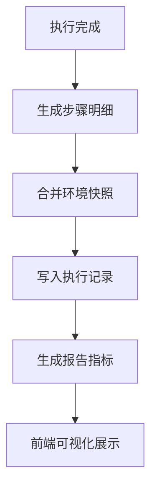
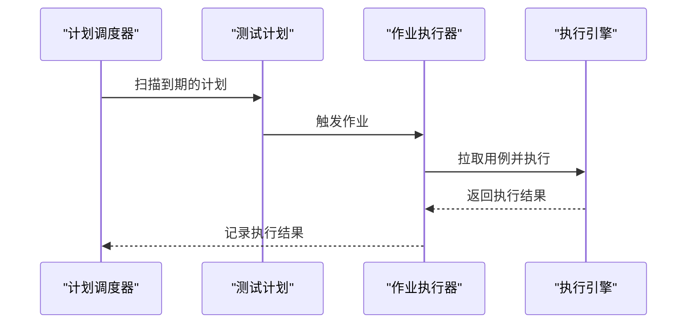
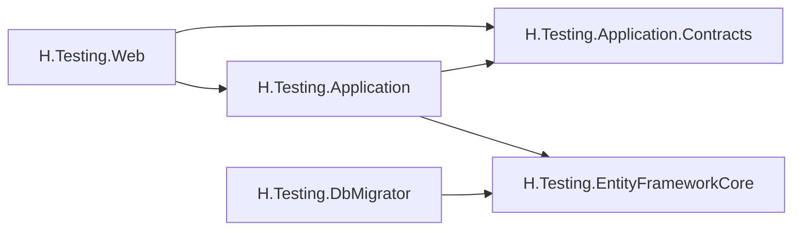

# 测试服务

<cite>
**本文引用的文件**   
- [TestingApplicationModule.cs](file://src/Services/Testing/H.Testing.Application/TestingApplicationModule.cs)
- [TestingEntityFrameworkCoreModule.cs](file://src/Services/Testing/H.Testing.EntityFrameworkCore/TestingEntityFrameworkCoreModule.cs)
- [TestingDbContext.cs](file://src/Services/Testing/H.Testing.EntityFrameworkCore/TestingDbContext.cs)
- [ProjectEntity.cs](file://src/Services/Testing/H.Testing.EntityFrameworkCore/Entities/ProjectEntity.cs)
- [ProjectServiceEntity.cs](file://src/Services/Testing/H.Testing.EntityFrameworkCore/Entities/ProjectServiceEntity.cs)
- [ProjectEnvEntity.cs](file://src/Services/Testing/H.Testing.EntityFrameworkCore/Entities/ProjectEnvEntity.cs)
- [CaseEntity.cs](file://src/Services/Testing/H.Testing.EntityFrameworkCore/Entities/CaseEntity.cs)
- [CaseStepEntity.cs](file://src/Services/Testing/H.Testing.EntityFrameworkCore/Entities/CaseStepEntity.cs)
- [CaseRecordEntity.cs](file://src/Services/Testing/H.Testing.EntityFrameworkCore/Entities/CaseRecordEntity.cs)
- [TestDatasetEntity.cs](file://src/Services/Testing/H.Testing.EntityFrameworkCore/Entities/TestDatasetEntity.cs)
- [SettingsEntity.cs](file://src/Services/Testing/H.Testing.EntityFrameworkCore/Entities/SettingsEntity.cs)
- [SettingProviders.cs](file://src/Services/Testing/H.Testing.EntityFrameworkCore/Entities/SettingProviders.cs)
- [ProjectAppService.cs](file://src/Services/Testing/H.Testing.Application/Services/ProjectAppService.cs)
- [CaseAppService.cs](file://src/Services/Testing/H.Testing.Application/Services/Cases/CaseAppService.cs)
- [CaseCategoryAppService.cs](file://src/Services/Testing/H.Testing.Application/Services/Cases/CaseCategoryAppService.cs)
- [CaseStepAppService.cs](file://src/Services/Testing/H.Testing.Application/Services/Cases/CaseStepAppService.cs)
- [EnvironmentAppService.cs](file://src/Services/Testing/H.Testing.Application/Services/EnvironmentAppService.cs)
- [ProjectEnvAppService.cs](file://src/Services/Testing/H.Testing.Application/Services/ProjectEnvAppService.cs)
- [ProjectServiceConfigAppService.cs](file://src/Services/Testing/H.Testing.Application/Services/ProjectServiceConfigAppService.cs)
- [TestDatasetAppService.cs](file://src/Services/Testing/H.Testing.Application/Services/Execution/TestDatasetAppService.cs)
- [BatchExecutionAppService.cs](file://src/Services/Testing/H.Testing.Application/Services/Execution/BatchExecutionAppService.cs)
- [TestExecutionEngineAppService.cs](file://src/Services/Testing/H.Testing.Application/Services/Execution/TestExecutionEngineAppService.cs)
- [ScriptHostObjects.cs](file://src/Services/Testing/H.Testing.Application/Services/Execution/ScriptHostObjects.cs)
- [PlaywrightRecorderAppService.cs](file://src/Services/Testing/H.Testing.Application/Services/Execution/PlaywrightRecorderAppService.cs)
- [CiAppService.cs](file://src/Services/Testing/H.Testing.Application/Services/Execution/CiAppService.cs)
- [CiJobExecutor.cs](file://src/Services/Testing/H.Testing.Application/Services/Execution/CiJobExecutor.cs)
- [ExecutionRecordAppService.cs](file://src/Services/Testing/H.Testing.Application/Services/Record/ExecutionRecordAppService.cs)
- [TestReportAppService.cs](file://src/Services/Testing/H.Testing.Application/Services/Record/TestReportAppService.cs)
- [TestPlanAppService.cs](file://src/Services/Testing/H.Testing.Application/Services/TestPlan/TestPlanAppService.cs)
- [TestPlanScheduleExecutor.cs](file://src/Services/Testing/H.Testing.Application/Services/TestPlan/TestPlanScheduleExecutor.cs)
- [DefectAppService.cs](file://src/Services/Testing/H.Testing.Application/Services/TestPlan/DefectAppService.cs)
- [TestingMappers.cs](file://src/Services/Testing/H.Testing.Application\Mapping/TestingMappers.cs)
- [TemplateJson.cs](file://src/Services/Testing/H.Testing.Application/Services/Templates/TemplateJson.cs)
- [AiGenerateAppService.cs](file://src/Services/Testing/H.Testing.Application/Services/AI/AiGenerateAppService.cs)
- [ProjectKnowledgeAppService.cs](file://src/Services/Testing/H.Testing.Application/Services/Knowledge/ProjectKnowledgeAppService.cs)
- [CurrentProjectSelection.cs](file://src/Services/Testing/H.Testing.Web/Services/CurrentProjectSelection.cs)
- [H.Testing.Web.csproj](file://src/Services/Testing/H.Testing.Web/H.Testing.Web.csproj)
- [H.Testing.Application.Contracts.csproj](file://src/Services/Testing/H.Testing.Application.Contracts/H.Testing.Application.Contracts.csproj)
- [H.Testing.EntityFrameworkCore.csproj](file://src/Services/Testing/H.Testing.EntityFrameworkCore/H.Testing.EntityFrameworkCore.csproj)
- [H.Testing.DbMigrator.csproj](file://src/Tools/H.Testing.DbMigrator/H.Testing.DbMigrator.csproj)
- [Program.cs](file://src/Tools/H.Testing.DbMigrator/Program.cs)
- [TestingDbContextFactory.cs](file://src/Tools/H.Testing.DbMigrator/TestingDbContextFactory.cs)
</cite>

## 目录
1. [引言](#引言)
2. [项目结构](#项目结构)
3. [核心组件](#核心组件)
4. [架构总览](#架构总览)
5. [详细组件分析](#详细组件分析)
6. [依赖关系分析](#依赖关系分析)
7. [性能与扩展性](#性能与扩展性)
8. [常见问题与故障排查](#常见问题与故障排查)
9. [结论](#结论)
10. [附录：使用示例](#附录使用示例)

## 引言
本文件面向 H.AppLab 的“测试服务”模块，系统性梳理其用例管理、自动化执行、测试报告、计划任务、CI 集成、测试数据管理、Mock 与脚本执行、端到端录制等能力。该模块基于 ABP vNext 分层架构，采用 Entity Framework Core 持久化，并通过 Web API 暴露业务能力；同时内置 Playwright 相关产物以支撑 UI 自动化与端到端测试场景。文档将帮助读者理解如何在本项目中组织测试资产、编排执行流程、沉淀测试结果并接入持续集成。

## 项目结构
测试服务由四个主要工程构成：应用契约层、应用层、数据访问层以及独立的数据库迁移工具。Web 前端工程承载测试用例、环境、数据集、执行记录与报告的界面能力。

图表来源
- [H.Testing.Application.Contracts.csproj](file://src/Services/Testing/H.Testing.Application.Contracts/H.Testing.Application.Contracts.csproj)
- [H.Testing.Application/TestingApplicationModule.cs:1-31](file://src/Services/Testing/H.Testing.Application/TestingApplicationModule.cs#L1-L31)
- [H.Testing.EntityFrameworkCore/TestingEntityFrameworkCoreModule.cs:1-31](file://src/Services/Testing/H.Testing.EntityFrameworkCore/TestingEntityFrameworkCoreModule.cs#L1-L31)
- [H.Testing.Web.csproj](file://src/Services/Testing/H.Testing.Web/H.Testing.Web.csproj)
- [H.Testing.DbMigrator.csproj](file://src/Tools/H.Testing.DbMigrator/H.Testing.DbMigrator.csproj)

章节来源
- [H.Testing.Application/TestingApplicationModule.cs:1-31](file://src/Services/Testing/H.Testing.Application/TestingApplicationModule.cs#L1-L31)
- [H.Testing.EntityFrameworkCore/TestingEntityFrameworkCoreModule.cs:1-31](file://src/Services/Testing/H.Testing.EntityFrameworkCore/TestingEntityFrameworkCoreModule.cs#L1-L31)
- [H.Testing.EntityFrameworkCore/TestingDbContext.cs:1-217](file://src/Services/Testing/H.Testing.EntityFrameworkCore/TestingDbContext.cs#L1-L217)

## 核心组件
- 应用模块与依赖注入
  - 通过 ABP 模块装配，注册执行事件通知器与 HttpClient 工厂，为后续自动化执行与外部调用提供基础能力。
- 数据访问模块
  - 统一连接字符串名 TestingDb，启用 SQL Server，自动注册仓储，集中维护领域实体与表映射。
- 领域模型与存储
  - 覆盖项目、服务、环境、用例、步骤、执行记录、数据集、设置、计划、缺陷等核心对象。
- 业务应用服务
  - 用例 CRUD、分类、步骤、环境、服务配置、数据集、批量执行、脚本执行、Playwright 录制、CI 集成、执行记录与报告、测试计划与调度、缺陷管理等。
- Web 前端
  - 提供当前项目选择上下文、UI 组件（如数据集 CSV 导入）及页面路由（例如用例列表页）。

章节来源
- [TestingApplicationModule.cs:1-31](file://src/Services/Testing/H.Testing.Application/TestingApplicationModule.cs#L1-L31)
- [TestingEntityFrameworkCoreModule.cs:1-31](file://src/Services/Testing/H.Testing.EntityFrameworkCore/TestingEntityFrameworkCoreModule.cs#L1-L31)
- [TestingDbContext.cs:1-217](file://src/Services/Testing/H.Testing.EntityFrameworkCore/TestingDbContext.cs#L1-L217)

## 架构总览
测试服务遵循 ABP 标准分层：Web 层通过 HTTP 调用应用层的服务接口，应用层协调领域逻辑、调用仓储或外部系统，数据访问层负责实体映射与持久化。执行引擎作为关键子系统，串联用例、步骤、环境与数据集，驱动 API/UI/脚本三类步骤的执行，产出结构化执行记录与报告。

图表来源
- [TestingApplicationModule.cs:1-31](file://src/Services/Testing/H.Testing.Application/TestingApplicationModule.cs#L1-L31)
- [TestingEntityFrameworkCoreModule.cs:1-31](file://src/Services/Testing/H.Testing.EntityFrameworkCore/TestingEntityFrameworkCoreModule.cs#L1-L31)
- [TestingDbContext.cs:1-217](file://src/Services/Testing/H.Testing.EntityFrameworkCore/TestingDbContext.cs#L1-L217)

## 详细组件分析

### 用例管理与生命周期
用例是测试资产的核心，包含名称、描述、优先级、状态、排序、模板关联、数据集绑定与最近执行结果等元信息。用例下挂载多个步骤，每个步骤支持 API、UI、脚本等多种类型，并携带参数、断言与期望结果。

图表来源
- [CaseDto.cs](file://src/Services/Testing/H.Testing.Application.Contracts/Dtos/Cases/CaseDto.cs)
- [CaseEntity.cs](file://src/Services/Testing/H.Testing.EntityFrameworkCore/Entities/CaseEntity.cs)
- [CaseStepEntity.cs](file://src/Services/Testing/H.Testing.EntityFrameworkCore/Entities/CaseStepEntity.cs)
- [TestingMappers.cs](file://src/Services/Testing/H.Testing.Application\Mapping/TestingMappers.cs)

关键要点
- 用例与步骤解耦，便于复用与组合。
- 步骤支持 JSON 化的参数与配置，利于动态加载与可视化编辑。
- 用例可绑定数据集，实现数据驱动执行。

章节来源
- [CaseDto.cs](file://src/Services/Testing/H.Testing.Application.Contracts/Dtos/Cases/CaseDto.cs)
- [CaseEntity.cs](file://src/Services/Testing/H.Testing.EntityFrameworkCore/Entities/CaseEntity.cs)
- [CaseStepEntity.cs](file://src/Services/Testing/H.Testing.EntityFrameworkCore/Entities/CaseStepEntity.cs)
- [CaseAppService.cs](file://src/Services/Testing/H.Testing.Application/Services/Cases/CaseAppService.cs)
- [CaseStepAppService.cs](file://src/Services/Testing/H.Testing.Application/Services/Cases/CaseStepAppService.cs)
- [CaseCategoryAppService.cs](file://src/Services/Testing/H.Testing.Application/Services/Cases/CaseCategoryAppService.cs)
- [TestingMappers.cs](file://src/Services/Testing/H.Testing.Application\Mapping/TestingMappers.cs)

### 项目、服务与环境
- 项目：测试资产的顶层容器，含基本信息与知识空间标识。
- 服务：用于 Mock 或代理目标后端服务，配合环境与服务配置完成隔离。
- 环境：保存环境变量、请求头、服务配置等运行期上下文，支持按环境切换执行行为。

图表来源
- [ProjectEntity.cs](file://src/Services/Testing/H.Testing.EntityFrameworkCore/Entities/ProjectEntity.cs)
- [ProjectServiceEntity.cs](file://src/Services/Testing/H.Testing.EntityFrameworkCore/Entities/ProjectServiceEntity.cs)
- [ProjectEnvEntity.cs](file://src/Services/Testing/H.Testing.EntityFrameworkCore/Entities/ProjectEnvEntity.cs)
- [CaseEntity.cs](file://src/Services/Testing/H.Testing.EntityFrameworkCore/Entities/CaseEntity.cs)
- [CaseStepEntity.cs](file://src/Services/Testing/H.Testing.EntityFrameworkCore/Entities/CaseStepEntity.cs)

章节来源
- [ProjectAppService.cs](file://src/Services/Testing/H.Testing.Application/Services/ProjectAppService.cs)
- [ProjectServiceConfigAppService.cs](file://src/Services/Testing/H.Testing.Application/Services/ProjectServiceConfigAppService.cs)
- [EnvironmentAppService.cs](file://src/Services/Testing/H.Testing.Application/Services/EnvironmentAppService.cs)
- [ProjectEnvAppService.cs](file://src/Services/Testing/H.Testing.Application/Services/ProjectEnvAppService.cs)

### 测试数据管理
- 数据集实体支持列定义与行数据 JSON 存储，结合用例的数据集绑定，实现数据驱动执行。
- 提供数据集应用服务，用于增删改查、导入导出与校验。

图表来源
- [TestDatasetEntity.cs](file://src/Services/Testing/H.Testing.EntityFrameworkCore/Entities/TestDatasetEntity.cs)
- [TestDatasetAppService.cs](file://src/Services/Testing/H.Testing.Application/Services/Execution/TestDatasetAppService.cs)
- [CaseAppService.cs](file://src/Services/Testing/H.Testing.Application/Services/Cases/CaseAppService.cs)

章节来源
- [TestDatasetEntity.cs](file://src/Services/Testing/H.Testing.EntityFrameworkCore/Entities/TestDatasetEntity.cs)
- [TestDatasetAppService.cs](file://src/Services/Testing/H.Testing.Application/Services/Execution/TestDatasetAppService.cs)

### 自动化测试与执行引擎
执行引擎聚合用例与步骤，根据步骤类型分别驱动：
- API 步骤：基于 HttpClient 发起 HTTP 请求，支持从环境与服务配置中解析目标地址、认证与拦截器。
- UI 步骤：借助 Playwright 进行浏览器自动化，支持录制回放与断言。
- 脚本步骤：在宿主环境中执行用户脚本，提供预置 Host 对象与断言能力。

图表来源
- [BatchExecutionAppService.cs](file://src/Services/Testing/H.Testing.Application/Services/Execution/BatchExecutionAppService.cs)
- [TestExecutionEngineAppService.cs](file://src/Services/Testing/H.Testing.Application/Services/Execution/TestExecutionEngineAppService.cs)
- [ScriptHostObjects.cs](file://src/Services/Testing/H.Testing.Application/Services/Execution/ScriptHostObjects.cs)
- [PlaywrightRecorderAppService.cs](file://src/Services/Testing/H.Testing.Application/Services/Execution/PlaywrightRecorderAppService.cs)

章节来源
- [BatchExecutionAppService.cs](file://src/Services/Testing/H.Testing.Application/Services/Execution/BatchExecutionAppService.cs)
- [TestExecutionEngineAppService.cs](file://src/Services/Testing/H.Testing.Application/Services/Execution/TestExecutionEngineAppService.cs)
- [ScriptHostObjects.cs](file://src/Services/Testing/H.Testing.Application/Services/Execution/ScriptHostObjects.cs)
- [PlaywrightRecorderAppService.cs](file://src/Services/Testing/H.Testing.Application/Services/Execution/PlaywrightRecorderAppService.cs)

### 测试报告与执行记录
- 执行记录实体承载用例级执行结果、步骤明细、环境快照与错误信息。
- 报告应用服务提供查询、统计与趋势分析能力，便于在 Web 端展示覆盖率、通过率与历史趋势。

图表来源
- [CaseRecordEntity.cs](file://src/Services/Testing/H.Testing.EntityFrameworkCore/Entities/CaseRecordEntity.cs)
- [ExecutionRecordAppService.cs](file://src/Services/Testing/H.Testing.Application/Services/Record/ExecutionRecordAppService.cs)
- [TestReportAppService.cs](file://src/Services/Testing/H.Testing.Application/Services/Record/TestReportAppService.cs)

章节来源
- [CaseRecordEntity.cs](file://src/Services/Testing/H.Testing.EntityFrameworkCore/Entities/CaseRecordEntity.cs)
- [ExecutionRecordAppService.cs](file://src/Services/Testing/H.Testing.Application/Services/Record/ExecutionRecordAppService.cs)
- [TestReportAppService.cs](file://src/Services/Testing/H.Testing.Application/Services/Record/TestReportAppService.cs)

### CI 集成与定时计划
- CI 应用服务暴露与持续集成平台对接的能力，触发远程构建与执行任务。
- 作业执行器封装具体 CI 任务的执行细节。
- 测试计划支持 Cron 表达式定时执行，调度器负责按计划拉取用例并执行。

图表来源
- [CiAppService.cs](file://src/Services/Testing/H.Testing.Application/Services/Execution/CiAppService.cs)
- [CiJobExecutor.cs](file://src/Services/Testing/H.Testing.Application/Services/Execution/CiJobExecutor.cs)
- [TestPlanAppService.cs](file://src/Services/Testing/H.Testing.Application/Services/TestPlan/TestPlanAppService.cs)
- [TestPlanScheduleExecutor.cs](file://src/Services/Testing/H.Testing.Application/Services/TestPlan/TestPlanScheduleExecutor.cs)

章节来源
- [CiAppService.cs](file://src/Services/Testing/H.Testing.Application/Services/Execution/CiAppService.cs)
- [CiJobExecutor.cs](file://src/Services/Testing/H.Testing.Application/Services/Execution/CiJobExecutor.cs)
- [TestPlanAppService.cs](file://src/Services/Testing/H.Testing.Application/Services/TestPlan/TestPlanAppService.cs)
- [TestPlanScheduleExecutor.cs](file://src/Services/Testing/H.Testing.Application/Services/TestPlan/TestPlanScheduleExecutor.cs)

### 测试模板与 AI 辅助
- 模板 JSON 定义用例骨架，便于快速复制与批量创建。
- AI 生成服务可用于自动生成用例或步骤，降低手工编写成本。
- 项目知识服务可结合知识库增强用例生成与检索。

章节来源
- [TemplateJson.cs](file://src/Services/Testing/H.Testing.Application/Services/Templates/TemplateJson.cs)
- [AiGenerateAppService.cs](file://src/Services/Testing/H.Testing.Application/Services/AI/AiGenerateAppService.cs)
- [ProjectKnowledgeAppService.cs](file://src/Services/Testing/H.Testing.Application/Services/Knowledge/ProjectKnowledgeAppService.cs)

### 测试环境隔离与资源管理
- 项目-环境-服务三层隔离：不同项目拥有独立的环境与服务配置，避免跨项目干扰。
- 环境变量与请求头集中管理，支持按环境切换。
- 设置实体与提供者机制用于全局或租户级别的开关控制。

章节来源
- [ProjectEnvEntity.cs](file://src/Services/Testing/H.Testing.EntityFrameworkCore/Entities/ProjectEnvEntity.cs)
- [ProjectServiceEntity.cs](file://src/Services/Testing/H.Testing.EntityFrameworkCore/Entities/ProjectServiceEntity.cs)
- [SettingsEntity.cs](file://src/Services/Testing/H.Testing.EntityFrameworkCore/Entities/SettingsEntity.cs)
- [SettingProviders.cs](file://src/Services/Testing/H.Testing.EntityFrameworkCore/Entities/SettingProviders.cs)
- [CurrentProjectSelection.cs](file://src/Services/Testing/H.Testing.Web/Services/CurrentProjectSelection.cs)

## 依赖关系分析
- 模块耦合
  - 应用层依赖契约层与数据访问层；Web 层依赖契约层与应用层；迁移工具仅依赖数据访问层。
- 运行时依赖
  - ABP 框架、EF Core、SQL Server、HttpClient 工厂、Playwright（UI 自动化）、Cron 调度（计划任务）。
- 外部集成
  - 被测系统 API、浏览器（Chromium/Firefox/WebKit）、CI 平台（GitHub Actions/Jenkins 等）。

图表来源
- [H.Testing.Web.csproj](file://src/Services/Testing/H.Testing.Web/H.Testing.Web.csproj)
- [H.Testing.Application.Contracts.csproj](file://src/Services/Testing/H.Testing.Application.Contracts/H.Testing.Application.Contracts.csproj)
- [H.Testing.Application/TestingApplicationModule.cs:1-31](file://src/Services/Testing/H.Testing.Application/TestingApplicationModule.cs#L1-L31)
- [H.Testing.EntityFrameworkCore/TestingEntityFrameworkCoreModule.cs:1-31](file://src/Services/Testing/H.Testing.EntityFrameworkCore/TestingEntityFrameworkCoreModule.cs#L1-L31)
- [H.Testing.DbMigrator.csproj](file://src/Tools/H.Testing.DbMigrator/H.Testing.DbMigrator.csproj)

章节来源
- [H.Testing.Application/TestingApplicationModule.cs:1-31](file://src/Services/Testing/H.Testing.Application/TestingApplicationModule.cs#L1-L31)
- [H.Testing.EntityFrameworkCore/TestingEntityFrameworkCoreModule.cs:1-31](file://src/Services/Testing/H.Testing.EntityFrameworkCore/TestingEntityFrameworkCoreModule.cs#L1-L31)

## 性能与扩展性
- 数据层
  - 对大字段（如步骤明细 JSON、数据集行数据）采用 nvarchar(max)，减少截断风险但需注意索引策略与查询优化。
- 执行引擎
  - 建议对并发执行、重试与超时控制进行优化；对 UI 自动化引入浏览器池与实例复用，减少启动开销。
- 报告与分析
  - 对高频查询的统计指标建立视图或物化结果，减轻实时计算压力。
- 可扩展点
  - 新增步骤类型：扩展步骤处理器与序列化配置。
  - 扩展报告维度：在报告服务中追加指标计算与导出能力。
  - 扩展 CI 适配器：在 CI 应用中增加新的平台适配器。

[本节为通用建议，不直接分析具体文件]

## 常见问题与故障排查
- 数据库连接失败
  - 检查连接字符串名是否为 TestingDb，且 SQL Server 可达。
- 用例执行失败
  - 查看执行记录的步骤明细与错误信息，确认步骤参数、环境配置与目标服务可用性。
- UI 自动化失败
  - 确认 Playwright 依赖与浏览器已正确安装；必要时清理缓存后重试。
- 计划任务未触发
  - 检查 Cron 表达式与调度器是否正常运行。
- CI 任务无响应
  - 检查 CI 平台回调、令牌权限与网络连通性。

章节来源
- [TestingEntityFrameworkCoreModule.cs:1-31](file://src/Services/Testing/H.Testing.EntityFrameworkCore/TestingEntityFrameworkCoreModule.cs#L1-L31)
- [CaseRecordEntity.cs](file://src/Services/Testing/H.Testing.EntityFrameworkCore/Entities/CaseRecordEntity.cs)
- [ExecutionRecordAppService.cs](file://src/Services/Testing/H.Testing.Application/Services/Record/ExecutionRecordAppService.cs)
- [PlaywrightRecorderAppService.cs](file://src/Services/Testing/H.Testing.Application/Services/Execution/PlaywrightRecorderAppService.cs)
- [TestPlanScheduleExecutor.cs](file://src/Services/Testing/H.Testing.Application/Services/TestPlan/TestPlanScheduleExecutor.cs)
- [CiAppService.cs](file://src/Services/Testing/H.Testing.Application/Services/Execution/CiAppService.cs)

## 结论
测试服务以 ABP 分层架构为基础，围绕“用例—步骤—环境—数据集—执行—记录—报告”的主线，构建了完整的自动化测试体系。通过 API/UI/脚本多类型步骤、数据驱动、计划任务与 CI 集成，覆盖了从单元测试到端到端测试的多层次需求。同时，项目、服务与环境的隔离设计保障了测试资产的可维护性与可扩展性。

[本节为总结性内容，不直接分析具体文件]

## 附录：使用示例

### API 测试
- 准备用例与 API 步骤，配置目标服务与请求头。
- 绑定必要的数据集，执行用例并查看执行记录与报告。

章节来源
- [CaseAppService.cs](file://src/Services/Testing/H.Testing.Application/Services/Cases/CaseAppService.cs)
- [CaseStepAppService.cs](file://src/Services/Testing/H.Testing.Application/Services/Cases/CaseStepAppService.cs)
- [ProjectServiceConfigAppService.cs](file://src/Services/Testing/H.Testing.Application/Services/ProjectServiceConfigAppService.cs)
- [ExecutionRecordAppService.cs](file://src/Services/Testing/H.Testing.Application/Services/Record/ExecutionRecordAppService.cs)

### UI 自动化测试
- 使用 Playwright 录制 UI 操作流程，生成 UI 步骤。
- 在指定环境中回放并断言页面行为，查看截图与视频。

章节来源
- [PlaywrightRecorderAppService.cs](file://src/Services/Testing/H.Testing.Application/Services/Execution/PlaywrightRecorderAppService.cs)
- [CaseStepEntity.cs](file://src/Services/Testing/H.Testing.EntityFrameworkCore/Entities/CaseStepEntity.cs)

### 脚本测试与 Mock
- 在脚本步骤中编写自定义逻辑，利用宿主对象访问公共能力。
- 通过服务配置与环境变量实现对外部依赖的 Mock 与隔离。

章节来源
- [ScriptHostObjects.cs](file://src/Services/Testing/H.Testing.Application/Services/Execution/ScriptHostObjects.cs)
- [ProjectServiceConfigAppService.cs](file://src/Services/Testing/H.Testing.Application/Services/ProjectServiceConfigAppService.cs)
- [EnvironmentAppService.cs](file://src/Services/Testing/H.Testing.Application/Services/EnvironmentAppService.cs)

### 数据驱动测试
- 创建数据集并定义列，绑定到用例后按行执行。
- 适用于多组输入数据的回归验证与边界值测试。

章节来源
- [TestDatasetAppService.cs](file://src/Services/Testing/H.Testing.Application/Services/Execution/TestDatasetAppService.cs)
- [CaseAppService.cs](file://src/Services/Testing/H.Testing.Application/Services/Cases/CaseAppService.cs)

### 压力测试
- 通过批量执行与并发参数提升吞吐，结合报告服务观察成功率与耗时分布。
- 可结合 CI 任务定期压测，形成趋势图。

章节来源
- [BatchExecutionAppService.cs](file://src/Services/Testing/H.Testing.Application/Services/Execution/BatchExecutionAppService.cs)
- [TestReportAppService.cs](file://src/Services/Testing/H.Testing.Application/Services/Record/TestReportAppService.cs)
- [CiAppService.cs](file://src/Services/Testing/H.Testing.Application/Services/Execution/CiAppService.cs)

### 端到端测试
- 将 API 与 UI 步骤组合，模拟真实用户路径。
- 通过环境隔离与数据集准备保证稳定性与可重复性。

章节来源
- [CaseAppService.cs](file://src/Services/Testing/H.Testing.Application/Services/Cases/CaseAppService.cs)
- [CaseStepAppService.cs](file://src/Services/Testing/H.Testing.Application/Services/Cases/CaseStepAppService.cs)
- [EnvironmentAppService.cs](file://src/Services/Testing/H.Testing.Application/Services/EnvironmentAppService.cs)

### 数据库初始化与迁移
- 使用 H.Testing.DbMigrator 工具完成测试服务的数据库初始化与迁移。

章节来源
- [H.Testing.DbMigrator.csproj](file://src/Tools/H.Testing.DbMigrator/H.Testing.DbMigrator.csproj)
- [Program.cs](file://src/Tools/H.Testing.DbMigrator/Program.cs)
- [TestingDbContextFactory.cs](file://src/Tools/H.Testing.DbMigrator/TestingDbContextFactory.cs)