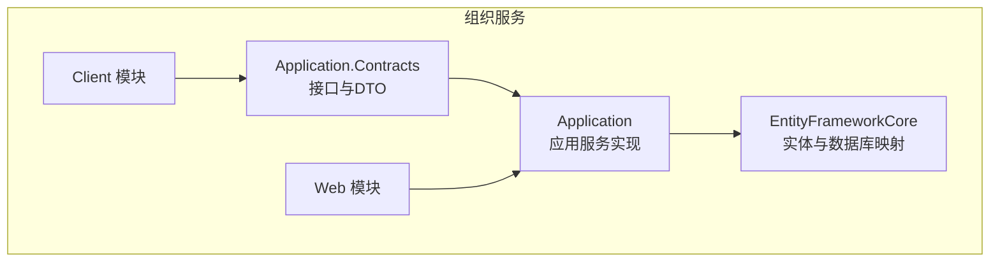
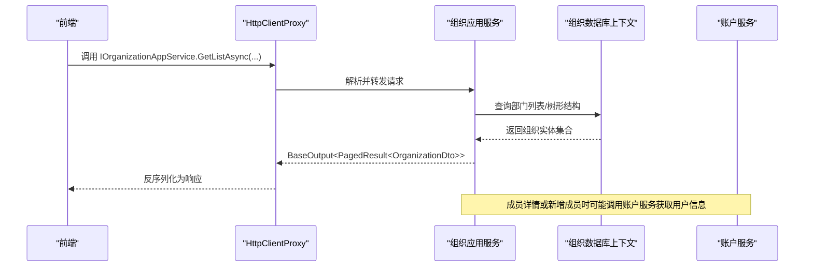
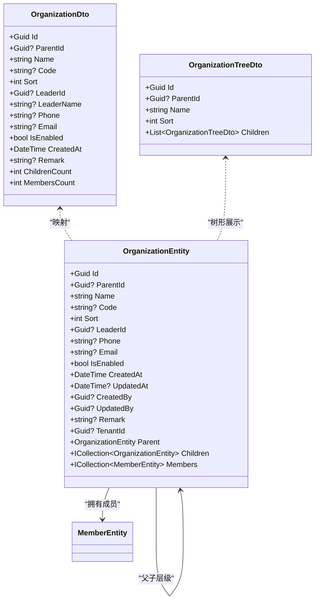
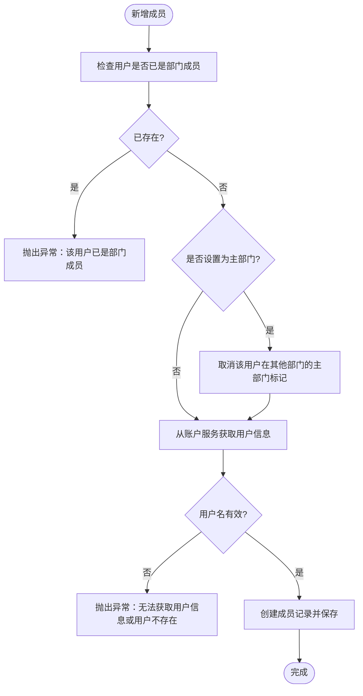
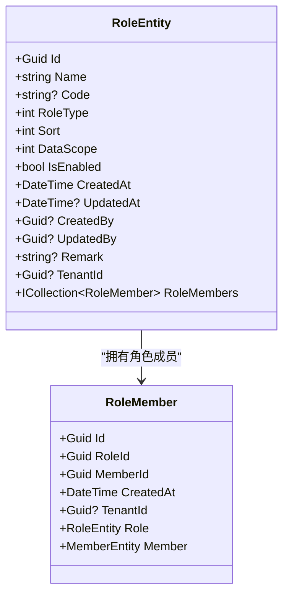
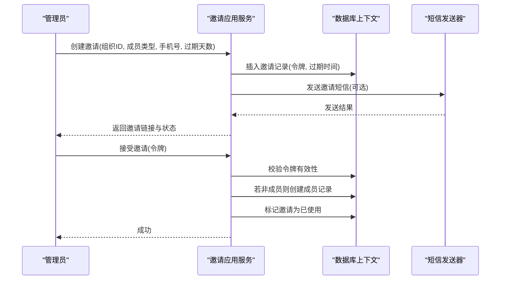
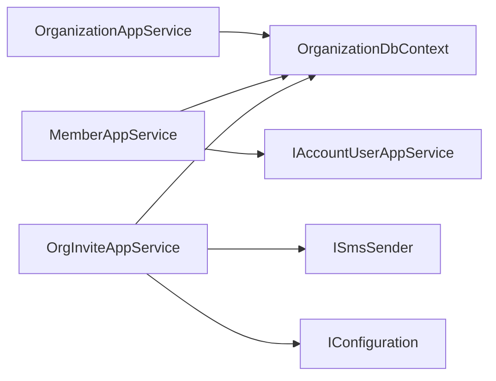

# 组织服务

<cite>
**本文引用的文件**   
- [README.md](file://README.md)
- [IOrganizationAppService.cs](file://src/Services/Organization/H.Organization.Application.Contracts/Interfaces/IOrganizationAppService.cs)
- [OrganizationDto.cs](file://src/Services/Organization/H.Organization.Application.Contracts/Dtos/OrganizationDto.cs)
- [OrganizationAppService.cs](file://src/Services/Organization/H.Organization.Application/Services/OrganizationAppService.cs)
- [OrganizationEntity.cs](file://src/Services/Organization/H.Organization.EntityFrameworkCore/Entities/OrganizationEntity.cs)
- [OrganizationDbContext.cs](file://src/Services/Organization/H.Organization.EntityFrameworkCore/OrganizationDbContext.cs)
- [IMemberAppService.cs](file://src/Services/Organization/H.Organization.Application.Contracts/Interfaces/IMemberAppService.cs)
- [MemberDto.cs](file://src/Services/Organization/H.Organization.Application.Contracts/Dtos/MemberDto.cs)
- [MemberEntity.cs](file://src/Services/Organization/H.Organization.EntityFrameworkCore/Entities/MemberEntity.cs)
- [MemberAppService.cs](file://src/Services/Organization/H.Organization.Application/Services/MemberAppService.cs)
- [IRoleAppService.cs](file://src/Services/Organization/H.Organization.Application.Contracts/Interfaces/IRoleAppService.cs)
- [RoleDto.cs](file://src/Services/Organization/H.Organization.Application.Contracts/Dtos/RoleDto.cs)
- [RoleEntity.cs](file://src/Services/Organization/H.Organization.EntityFrameworkCore/Entities/RoleEntity.cs)
- [RoleAppService.cs](file://src/Services/Organization/H.Organization.Application/Services/RoleAppService.cs)
- [IOrgInviteAppService.cs](file://src/Services/Organization/H.Organization.Application.Contracts/Interfaces/IOrgInviteAppService.cs)
- [InviteDto.cs](file://src/Services/Organization/H.Organization.Application.Contracts/Dtos/InviteDto.cs)
- [OrgInviteEntity.cs](file://src/Services/Organization/H.Organization.EntityFrameworkCore/Entities/OrgInviteEntity.cs)
- [OrgInviteAppService.cs](file://src/Services/Organization/H.Organization.Application/Services/OrgInviteAppService.cs)
</cite>

## 目录
1. [引言](#引言)
2. [项目结构](#项目结构)
3. [核心组件](#核心组件)
4. [架构总览](#架构总览)
5. [详细组件分析](#详细组件分析)
6. [依赖分析](#依赖分析)
7. [性能与树形结构优化](#性能与树形结构优化)
8. [权限继承与数据范围](#权限继承与数据范围)
9. [业务场景示例](#业务场景示例)
10. [故障排查指南](#故障排查指南)
11. [结论](#结论)

## 引言
H.AppLab 的组织服务模块提供企业级组织架构管理能力，包括部门（组织）管理、成员管理、角色管理与邀请机制。该服务以 ABP 模块化架构实现，采用 Application.Contracts / Application / EntityFrameworkCore 的分层设计，并通过 EF Core 将组织实体持久化到 SQL Server。它与账户服务集成，将用户与组织关联起来，支撑基于组织和角色的权限控制与数据范围控制。

本文件面向开发者与架构师，深入解释组织实体的设计模式、CRUD 流程、树形结构存储与查询优化、批量操作注意事项、权限继承策略以及与账户服务的集成方式，并提供新员工入职、部门调整、人员调动等典型用例。

## 项目结构
组织服务按 ABP 标准分层组织：
- Application.Contracts：对外暴露的应用接口与数据传输对象，如部门、成员、角色、邀请的接口与 DTO。
- Application：应用服务实现，包含领域编排、事务边界、跨服务调用（如账户服务）。
- EntityFrameworkCore：领域实体、数据库上下文、EF 映射配置与关系约束。
- Web/Client：Web 端与客户端模块注册入口，用于装配服务与 HTTP 代理。

图表来源
- [OrganizationDbContext.cs:1-144](file://src/Services/Organization/H.Organization.EntityFrameworkCore/OrganizationDbContext.cs#L1-L144)
- [IOrganizationAppService.cs:1-53](file://src/Services/Organization/H.Organization.Application.Contracts/Interfaces/IOrganizationAppService.cs#L1-L53)

章节来源
- [README.md:1-73](file://README.md#L1-L73)

## 核心组件
组织服务由以下核心组件构成：
- 部门实体与树形结构：使用自引用父子关系表示层级，支持启用状态、排序、负责人等属性。
- 成员实体：将账户服务中的用户与组织进行多对一关联，支持成员类型、主部门标识、启用状态等。
- 角色与角色成员：定义组织内角色及其与成员的关联，支持角色编码唯一性、数据范围、启用状态等。
- 邀请令牌：一次性、限时令牌机制，支持短信通知、自动加入组织等。
- 应用服务：提供部门、成员、角色、邀请的 CRUD 与批量操作，封装查询条件、分页、校验与跨服务调用。

章节来源
- [OrganizationEntity.cs:1-104](file://src/Services/Organization/H.Organization.EntityFrameworkCore/Entities/OrganizationEntity.cs#L1-L104)
- [MemberEntity.cs:1-89](file://src/Services/Organization/H.Organization.EntityFrameworkCore/Entities/MemberEntity.cs#L1-L89)
- [RoleEntity.cs:1-129](file://src/Services/Organization/H.Organization.EntityFrameworkCore/Entities/RoleEntity.cs#L1-L129)
- [OrgInviteEntity.cs:1-79](file://src/Services/Organization/H.Organization.EntityFrameworkCore/Entities/OrgInviteEntity.cs#L1-L79)

## 架构总览
组织服务在 ABP 框架下通过应用服务暴露 REST API，前端通过 HttpClientProxy 动态代理调用 IAppService 接口。组织服务与账户服务解耦，通过 IAccountUserAppService 获取用户信息，保持领域边界清晰。

图表来源
- [OrganizationAppService.cs:1-200](file://src/Services/Organization/H.Organization.Application/Services/OrganizationAppService.cs#L1-L200)
- [MemberAppService.cs:1-200](file://src/Services/Organization/H.Organization.Application/Services/MemberAppService.cs#L1-L200)
- [README.md:1-73](file://README.md#L1-L73)

## 详细组件分析

### 部门（组织）实体与应用服务
部门实体采用自引用父子关系构建多层级组织树，字段包括父部门 ID、名称、编码、排序、负责人、联系方式、启用状态、创建时间、备注等。应用服务提供：
- 树形结构读取：加载所有启用部门并按排序构建递归树。
- 分页列表：支持按父部门、关键字、启用状态过滤，返回计数与页码信息。
- 详情读取：包含子部门与成员数量统计。
- 创建/更新/删除/批量删除：维护基础属性与更新时间戳。
- 获取部门用户：根据部门及是否包含子部门，返回用户 ID 集合，便于权限计算与数据范围控制。

图表来源
- [OrganizationEntity.cs:1-104](file://src/Services/Organization/H.Organization.EntityFrameworkCore/Entities/OrganizationEntity.cs#L1-L104)
- [OrganizationDto.cs:1-236](file://src/Services/Organization/H.Organization.Application.Contracts/Dtos/OrganizationDto.cs#L1-L236)

章节来源
- [IOrganizationAppService.cs:1-53](file://src/Services/Organization/H.Organization.Application.Contracts/Interfaces/IOrganizationAppService.cs#L1-L53)
- [OrganizationAppService.cs:1-200](file://src/Services/Organization/H.Organization.Application/Services/OrganizationAppService.cs#L1-L200)
- [OrganizationEntity.cs:1-104](file://src/Services/Organization/H.Organization.EntityFrameworkCore/Entities/OrganizationEntity.cs#L1-L104)
- [OrganizationDto.cs:1-236](file://src/Services/Organization/H.Organization.Application.Contracts/Dtos/OrganizationDto.cs#L1-L236)

### 成员实体与应用服务
成员实体将账户服务的用户与组织关联，支持成员类型（普通成员、部门负责人、部门经理）、主部门标记、启用状态、排序、备注等。应用服务提供：
- 成员列表：支持按组织、用户名关键字、成员类型、启用状态过滤，返回分页结果，并在结果中附带角色名称列表。
- 成员详情：包含组织名称、角色名称列表，并尝试从账户服务填充邮箱与手机号。
- 添加成员：校验是否已是成员，若设置为主部门则取消其他主部门；从账户服务获取用户名；创建成员记录。
- 批量添加成员：一个用户可关联多个部门。
- 搜索可分配用户：供前端成员选择器使用。
- 分配角色：为成员全量重建角色关联。
- 获取成员角色 ID 列表、更新成员、删除成员、批量删除成员。
- 获取部门下所有成员、检查用户是否已是部门成员。

图表来源
- [MemberAppService.cs:1-200](file://src/Services/Organization/H.Organization.Application/Services/MemberAppService.cs#L1-L200)
- [MemberEntity.cs:1-89](file://src/Services/Organization/H.Organization.EntityFrameworkCore/Entities/MemberEntity.cs#L1-L89)

章节来源
- [IMemberAppService.cs:1-70](file://src/Services/Organization/H.Organization.Application.Contracts/Interfaces/IMemberAppService.cs#L1-L70)
- [MemberDto.cs:1-258](file://src/Services/Organization/H.Organization.Application.Contracts/Dtos/MemberDto.cs#L1-L258)
- [MemberEntity.cs:1-89](file://src/Services/Organization/H.Organization.EntityFrameworkCore/Entities/MemberEntity.cs#L1-L89)
- [MemberAppService.cs:1-200](file://src/Services/Organization/H.Organization.Application/Services/MemberAppService.cs#L1-L200)

### 角色与角色成员
角色实体定义角色名称、编码、类型（系统角色/自定义角色）、排序、数据范围（全部数据/本部门数据/仅本人数据）、启用状态、备注等。角色成员作为中间表将角色与成员关联，具有唯一性约束。应用服务提供：
- 角色列表：支持关键字、角色类型、启用状态过滤，返回分页结果，包含成员数量。
- 角色详情：包含成员数量与角色名称列表。
- 创建/更新角色：校验编码唯一性，维护启用状态与数据范围。
- 删除/批量删除角色：先检查是否有成员，再删除。
- 获取启用角色列表：用于权限选择器等场景。

图表来源
- [RoleEntity.cs:1-129](file://src/Services/Organization/H.Organization.EntityFrameworkCore/Entities/RoleEntity.cs#L1-L129)

章节来源
- [IRoleAppService.cs](file://src/Services/Organization/H.Organization.Application.Contracts/Interfaces/IRoleAppService.cs)
- [RoleDto.cs](file://src/Services/Organization/H.Organization.Application.Contracts/Dtos/RoleDto.cs)
- [RoleEntity.cs:1-129](file://src/Services/Organization/H.Organization.EntityFrameworkCore/Entities/RoleEntity.cs#L1-L129)
- [RoleAppService.cs:1-200](file://src/Services/Organization/H.Organization.Application/Services/RoleAppService.cs#L1-L200)

### 邀请令牌机制
邀请实体支持一次性令牌与过期时间，绑定目标组织与成员类型，可选择发送短信通知。应用服务提供：
- 创建邀请：生成令牌、设置过期时间、构造邀请链接，可选发送短信。
- 获取邀请信息：校验令牌有效性、是否已使用、是否过期。
- 接受邀请：校验登录状态、令牌有效性，若非成员则自动加入组织并标记邀请为已使用。

图表来源
- [OrgInviteAppService.cs:1-158](file://src/Services/Organization/H.Organization.Application/Services/OrgInviteAppService.cs#L1-L158)
- [OrgInviteEntity.cs:1-79](file://src/Services/Organization/H.Organization.EntityFrameworkCore/Entities/OrgInviteEntity.cs#L1-L79)

章节来源
- [IOrgInviteAppService.cs](file://src/Services/Organization/H.Organization.Application.Contracts/Interfaces/IOrgInviteAppService.cs)
- [InviteDto.cs](file://src/Services/Organization/H.Organization.Application.Contracts/Dtos/InviteDto.cs)
- [OrgInviteAppService.cs:1-158](file://src/Services/Organization/H.Organization.Application/Services/OrgInviteAppService.cs#L1-L158)
- [OrgInviteEntity.cs:1-79](file://src/Services/Organization/H.Organization.EntityFrameworkCore/Entities/OrgInviteEntity.cs#L1-L79)

## 依赖分析
组织服务内部依赖关系如下：
- 应用服务依赖数据库上下文访问实体。
- 成员服务依赖账户服务获取用户信息。
- 邀请服务依赖短信发送器与配置。

图表来源
- [OrganizationAppService.cs:1-200](file://src/Services/Organization/H.Organization.Application/Services/OrganizationAppService.cs#L1-L200)
- [MemberAppService.cs:1-200](file://src/Services/Organization/H.Organization.Application/Services/MemberAppService.cs#L1-L200)
- [OrgInviteAppService.cs:1-158](file://src/Services/Organization/H.Organization.Application/Services/OrgInviteAppService.cs#L1-L158)

章节来源
- [OrganizationDbContext.cs:1-144](file://src/Services/Organization/H.Organization.EntityFrameworkCore/OrganizationDbContext.cs#L1-L144)

## 性能与树形结构优化
- 树形结构构建：服务层将所有启用部门加载后使用查找表（ToLookup）按父 ID 分组，再递归组装子节点。时间复杂度近似 O(n)，空间复杂度 O(n)。
- 分页查询：使用 Skip/Take 实现服务端分页，结合 Where 条件与 OrderBy 排序，避免全量加载。
- 自引用关系：EF 配置了父子关系的 OnDelete Restrict，防止误删导致的数据不一致。
- 索引优化：成员表对 (OrganizationId, UserId) 建立唯一索引，对 UserId 建立索引，提升查询与去重效率。
- 批量操作：批量删除角色与服务端循环删除一致，需注意多次事务开销；对于大规模组织数据，建议扩展批量删除逻辑以减少数据库往返。
- 跨服务调用：成员服务在获取详情或新增成员时调用账户服务，应关注网络延迟与异常处理；当前实现捕获异常并降级为本地数据。

章节来源
- [OrganizationAppService.cs:1-200](file://src/Services/Organization/H.Organization.Application/Services/OrganizationAppService.cs#L1-L200)
- [OrganizationDbContext.cs:1-144](file://src/Services/Organization/H.Organization.EntityFrameworkCore/OrganizationDbContext.cs#L1-L144)
- [MemberAppService.cs:1-200](file://src/Services/Organization/H.Organization.Application/Services/MemberAppService.cs#L1-L200)

## 权限继承与数据范围
组织服务提供“获取部门用户”能力，便于上层权限模块基于组织层级计算权限集。角色实体定义了数据范围字段，可用于区分“全部数据/本部门数据/仅本人数据”。实际权限继承通常由权限模块或网关拦截器实现：
- 当用户属于某部门时，其权限可继承自该部门的角色集合。
- 数据范围控制可在查询层附加过滤器，例如仅允许查看本部门或本人数据。
- 组织层级遍历可通过“包含子部门”参数实现权限聚合。

注意：当前代码未直接实现权限判定逻辑，但提供了必要的数据结构与接口能力。

章节来源
- [IOrganizationAppService.cs:1-53](file://src/Services/Organization/H.Organization.Application.Contracts/Interfaces/IOrganizationAppService.cs#L1-L53)
- [RoleEntity.cs:1-129](file://src/Services/Organization/H.Organization.EntityFrameworkCore/Entities/RoleEntity.cs#L1-L129)

## 业务场景示例

### 新员工入职流程
- 管理员创建邀请令牌并发送短信链接。
- 员工点击链接接受邀请，系统自动将其加入目标组织，并赋予邀请指定的成员类型。
- 如需分配角色，管理员随后通过成员角色分配功能为其授予相应权限。

章节来源
- [OrgInviteAppService.cs:1-158](file://src/Services/Organization/H.Organization.Application/Services/OrgInviteAppService.cs#L1-L158)
- [MemberAppService.cs:1-200](file://src/Services/Organization/H.Organization.Application/Services/MemberAppService.cs#L1-L200)

### 部门调整操作
- 修改部门的父部门、名称、编码、排序、负责人、启用状态等属性。
- 若涉及大量子部门移动，建议在应用层增加批量移动逻辑，减少多次数据库往返。
- 注意父子关系的删除限制，避免误删导致的数据不一致。

章节来源
- [OrganizationAppService.cs:1-200](file://src/Services/Organization/H.Organization.Application/Services/OrganizationAppService.cs#L1-L200)
- [OrganizationDbContext.cs:1-144](file://src/Services/Organization/H.Organization.EntityFrameworkCore/OrganizationDbContext.cs#L1-L144)

### 人员调动
- 将用户从一个部门移动到另一个部门时，需先移除原部门成员记录，再新增目标部门成员记录。
- 若用户有多个部门，应谨慎处理主部门标记，确保只有一个主部门。
- 调动后可重新分配角色，保证权限与新部门职责匹配。

章节来源
- [MemberAppService.cs:1-200](file://src/Services/Organization/H.Organization.Application/Services/MemberAppService.cs#L1-L200)
- [RoleAppService.cs:1-200](file://src/Services/Organization/H.Organization.Application/Services/RoleAppService.cs#L1-L200)

## 故障排查指南
- 新增成员失败：常见原因为用户已在部门中或账户服务不可用。检查重复成员校验与账户服务调用异常处理。
- 邀请链接无效：检查令牌是否存在、是否已使用、是否过期。确认邀请创建时间与过期时间。
- 部门树为空：检查组织是否启用、排序是否正确；确认查询条件是否过滤掉所有数据。
- 角色删除失败：若角色仍有成员，需先移除成员后再删除角色。
- 数据范围错误：检查角色数据范围字段与上层权限模块的过滤逻辑是否正确。

章节来源
- [MemberAppService.cs:1-200](file://src/Services/Organization/H.Organization.Application/Services/MemberAppService.cs#L1-L200)
- [OrgInviteAppService.cs:1-158](file://src/Services/Organization/H.Organization.Application/Services/OrgInviteAppService.cs#L1-L158)
- [RoleAppService.cs:1-200](file://src/Services/Organization/H.Organization.Application/Services/RoleAppService.cs#L1-L200)

## 结论
组织服务模块通过清晰的 ABP 分层与 EF Core 实体映射，实现了企业级组织架构的核心能力：部门树形管理、成员与角色管理、邀请机制以及与账户服务的集成。服务层封装了常用 CRUD 与批量操作，并为上层权限模块提供了组织层级与数据范围的基础数据。针对树形结构的查询优化与索引设计提升了性能表现。未来可扩展批量移动、异步任务处理与更细粒度的权限继承策略，以满足复杂企业场景的需求。