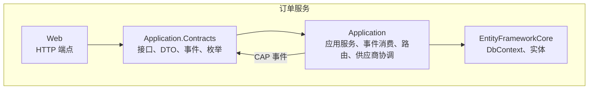
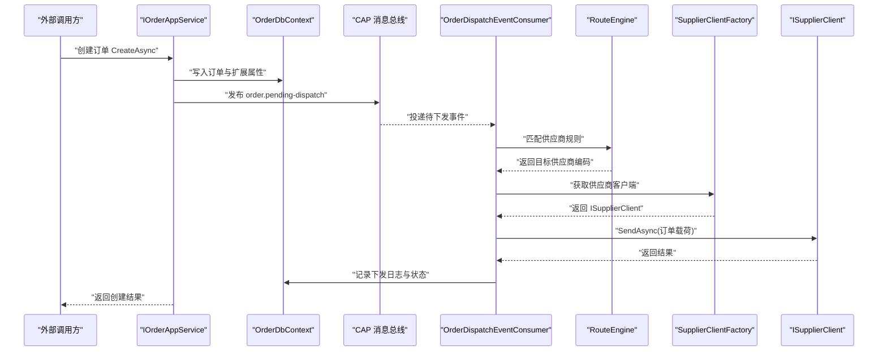
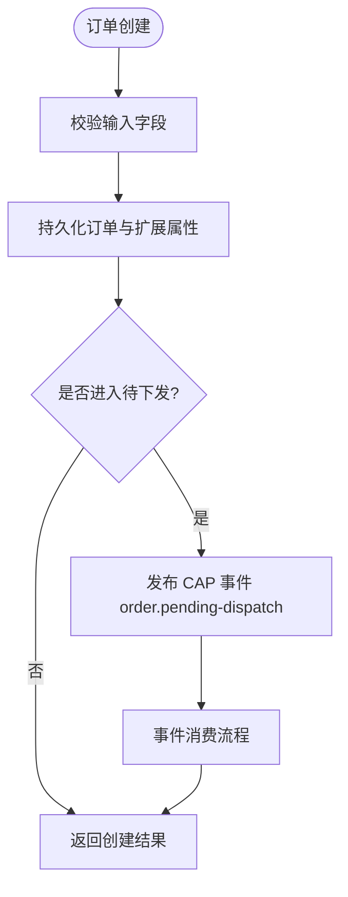
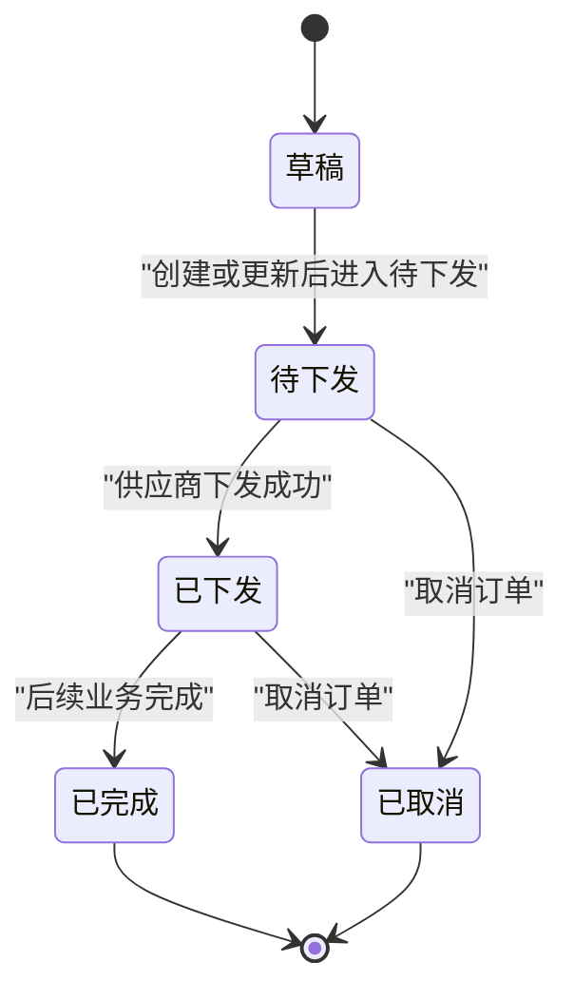
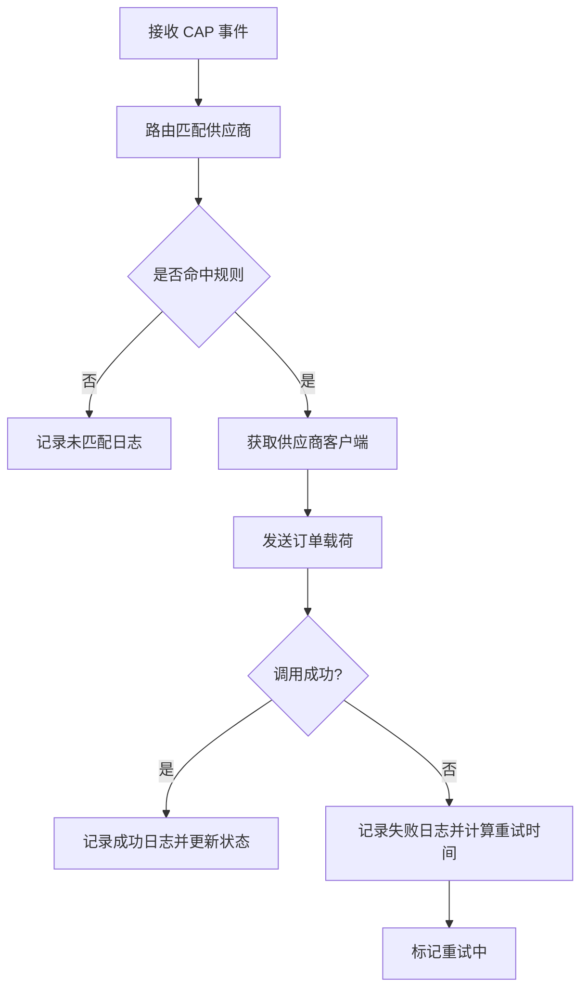
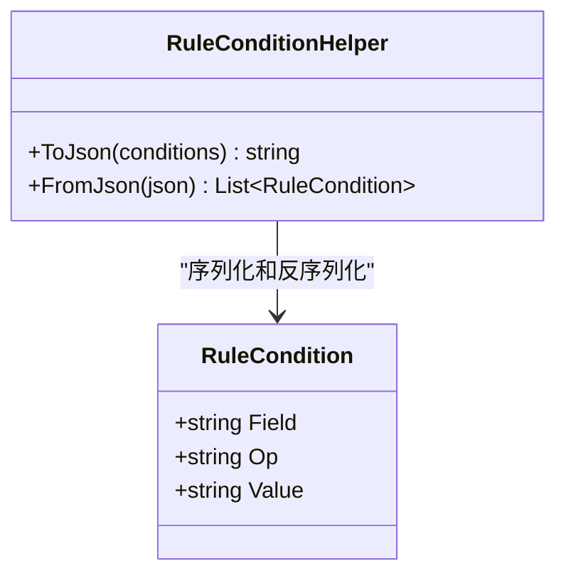
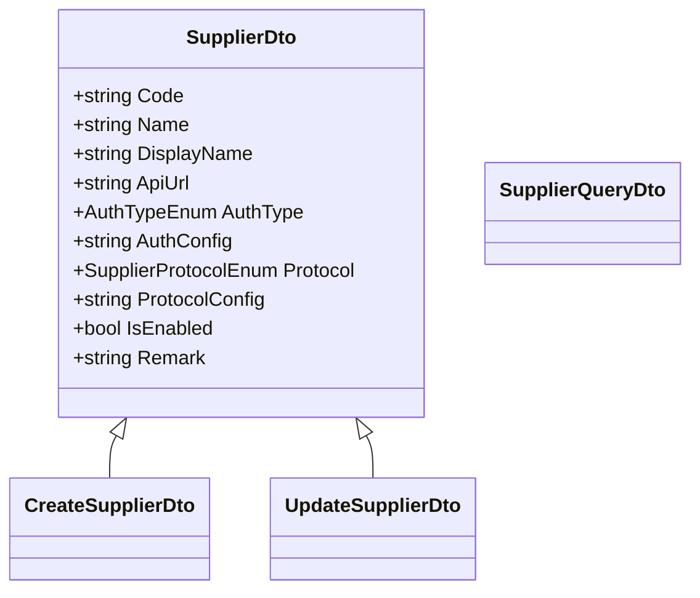
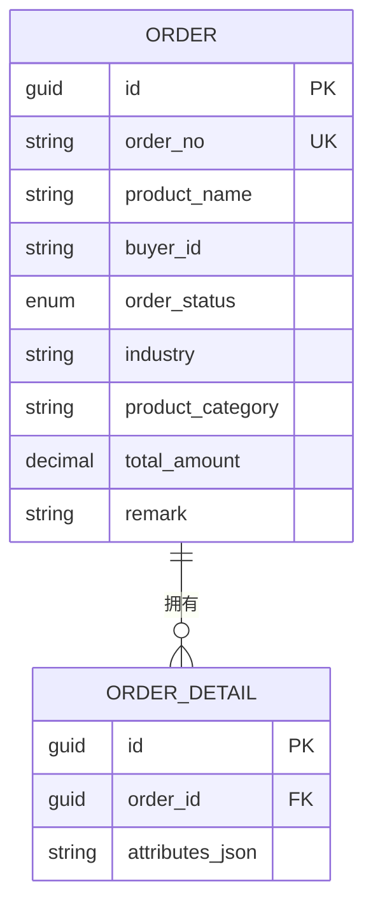
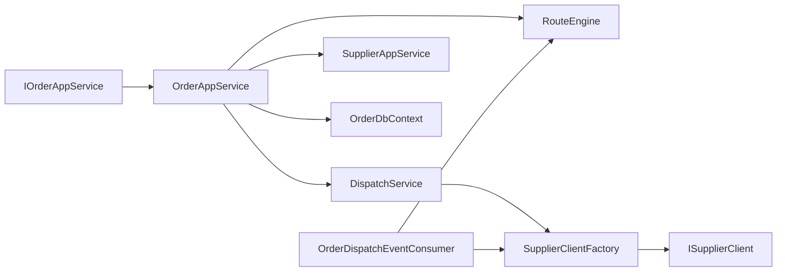

# 订单服务

<cite>
**本文引用的文件**   
- [README.md](file://README.md)
- [OrderEnums.cs](file://src/Services/Order/H.Order.Application.Contracts/Enums/OrderEnums.cs)
- [OrderDtos.cs](file://src/Services/Order/H.Order.Application.Contracts/Dtos/OrderDtos.cs)
- [SupplierDtos.cs](file://src/Services/Order/H.Order.Application.Contracts/Dtos/SupplierDtos.cs)
- [DispatchLogDtos.cs](file://src/Services/Order/H.Order.Application.Contracts/Dtos/DispatchLogDtos.cs)
- [RouteRuleDtos.cs](file://src/Services/Order/H.Order.Application.Contracts/Dtos/RouteRuleDtos.cs)
- [RuleCondition.cs](file://src/Services/Order/H.Order.Application.Contracts/Dtos/RuleCondition.cs)
- [IOrderAppService.cs](file://src/Services/Order/H.Order.Application.Contracts/Services/IOrderAppService.cs)
- [ISupplierClient.cs](file://src/Services/Order/H.Order.Application.Contracts/Abstractions/ISupplierClient.cs)
- [OrderEvents.cs](file://src/Services/Order/H.Order.Application.Contracts/Events/OrderEvents.cs)
- [OrderTopics.cs](file://src/Services/Order/H.Order.Application.Contracts/Abstractions/OrderTopics.cs)
- [OrderAppService.cs](file://src/Services/Order/H.Order.Application/Services/OrderAppService.cs)
- [DispatchService.cs](file://src/Services/Order/H.Order.Application/Services/DispatchService.cs)
- [RouteEngine.cs](file://src/Services/Order/H.Order.Application/Services/RouteEngine.cs)
- [SupplierAppService.cs](file://src/Services/Order/H.Order.Application/Services/SupplierAppService.cs)
- [SupplierClientFactory.cs](file://src/Services/Order/H.Order.Application/Services/SupplierClientFactory.cs)
- [SupplierClients.cs](file://src/Services/Order/H.Order.Application/Services/SupplierClients.cs)
- [OrderDispatchEventConsumer.cs](file://src/Services/Order/H.Order.Application/Services/OrderDispatchEventConsumer.cs)
- [OrderDbContext.cs](file://src/Services/Order/H.Order.EntityFrameworkCore/OrderDbContext.cs)
- [OrderEntities.cs](file://src/Services/Order/H.Order.EntityFrameworkCore/Entities/OrderEntities.cs)
- [H.Order.Application.Contracts.csproj](file://src/Services/Order/H.Order.Application.Contracts/H.Order.Application.Contracts.csproj)
- [H.Order.Application.csproj](file://src/Services/Order/H.Order.Application/H.Order.Application.csproj)
- [H.Order.EntityFrameworkCore.csproj](file://src/Services/Order/H.Order.EntityFrameworkCore/H.Order.EntityFrameworkCore.csproj)
- [H.Order.Web.csproj](file://src/Services/Order/H.Order.Web/H.Order.Web.csproj)
</cite>

## 目录
1. [引言](#引言)
2. [项目结构](#项目结构)
3. [核心组件](#核心组件)
4. [架构总览](#架构总览)
5. [详细组件分析](#详细组件分析)
6. [依赖关系分析](#依赖关系分析)
7. [性能与一致性考虑](#性能与一致性考虑)
8. [排障指南](#排障指南)
9. [结论](#结论)

## 引言
本文件为 H.AppLab 订单服务模块的技术文档，聚焦订单生命周期管理、供应商下发与路由、订单状态流转、事务一致性与并发控制、以及与供应链服务的协作边界。该模块遵循 ABP 模块化分层：Application.Contracts 暴露对外接口与 DTO；Application 实现应用服务、事件消费、路由引擎与供应商客户端协调；EntityFrameworkCore 负责实体与数据库映射；Web 提供 HTTP 端点接入。

从业务视角看，订单从创建进入“待下发”，由 CAP 事件驱动分发至上游供应商；下发过程通过规则引擎匹配供应商，记录下发日志并支持重试；订单详情可携带行业扩展属性，用于不同行业的差异化对接。虽然当前代码未直接集成支付网关，但订单模型中的金额、买家等字段已预留与支付、售后、物流等子系统集成的空间。

## 项目结构
订单服务位于 Services/Order 子域，采用典型分层：

- Application.Contracts：对外契约、枚举、DTO、领域事件、供应商抽象
- Application：应用服务、事件消费者、供应商客户端工厂、路由引擎、调度逻辑
- EntityFrameworkCore：EF Core DbContext、实体定义、模块注册
- Web：控制器与中间件（ABP 自动根据 IAppService 生成 REST 端点）

图表来源
- [IOrderAppService.cs:1-43](file://src/Services/Order/H.Order.Application.Contracts/Services/IOrderAppService.cs#L1-L43)
- [OrderEvents.cs:1-20](file://src/Services/Order/H.Order.Application.Contracts/Events/OrderEvents.cs#L1-L20)
- [OrderDbContext.cs](file://src/Services/Order/H.Order.EntityFrameworkCore/OrderDbContext.cs)

章节来源
- [README.md](file://README.md)
- [H.Order.Application.Contracts.csproj](file://src/Services/Order/H.Order.Application.Contracts/H.Order.Application.Contracts.csproj)
- [H.Order.Application.csproj](file://src/Services/Order/H.Order.Application/H.Order.Application.csproj)
- [H.Order.EntityFrameworkCore.csproj](file://src/Services/Order/H.Order.EntityFrameworkCore/H.Order.EntityFrameworkCore.csproj)
- [H.Order.Web.csproj](file://src/Services/Order/H.Order.Web/H.Order.Web.csproj)

## 核心组件
- 订单应用服务接口 IOrderAppService：定义分页查询、创建、更新、删除、手动触发下发、查询下发状态与详情等能力。
- 供应商抽象 ISupplierClient：统一封装不同协议（HTTP/Mock 等）的供应商调用，屏蔽底层差异。
- 路由引擎 RouteEngine：基于规则条件选择目标供应商，支持按行业、商品类别、金额区间与自定义组合。
- 事件消费者 OrderDispatchEventConsumer：订阅 CAP 主题，将待下发订单投递给供应商。
- 实体与上下文：OrderDbContext 与 OrderEntities 承载订单、供应商、下发日志与路由规则的持久化。
- DTO 体系：涵盖订单、供应商、下发日志、路由规则、规则条件与查询参数，支撑前后端交互。

章节来源
- [IOrderAppService.cs:1-43](file://src/Services/Order/H.Order.Application.Contracts/Services/IOrderAppService.cs#L1-L43)
- [ISupplierClient.cs:1-96](file://src/Services/Order/H.Order.Application.Contracts/Abstractions/ISupplierClient.cs#L1-L96)
- [RouteEngine.cs](file://src/Services/Order/H.Order.Application/Services/RouteEngine.cs)
- [OrderDispatchEventConsumer.cs](file://src/Services/Order/H.Order.Application/Services/OrderDispatchEventConsumer.cs)
- [OrderDbContext.cs](file://src/Services/Order/H.Order.EntityFrameworkCore/OrderDbContext.cs)
- [OrderEntities.cs](file://src/Services/Order/H.Order.EntityFrameworkCore/Entities/OrderEntities.cs)

## 架构总览
订单服务以 ABP 模块化为基础，结合 CAP 异步事件与规则引擎完成订单到供应商的下发。整体流程如下：

图表来源
- [IOrderAppService.cs:1-43](file://src/Services/Order/H.Order.Application.Contracts/Services/IOrderAppService.cs#L1-L43)
- [OrderEvents.cs:1-20](file://src/Services/Order/H.Order.Application.Contracts/Events/OrderEvents.cs#L1-L20)
- [OrderTopics.cs:1-10](file://src/Services/Order/H.Order.Application.Contracts/Abstractions/OrderTopics.cs#L1-L10)
- [OrderDispatchEventConsumer.cs](file://src/Services/Order/H.Order.Application/Services/OrderDispatchEventConsumer.cs)
- [RouteEngine.cs](file://src/Services/Order/H.Order.Application/Services/RouteEngine.cs)
- [SupplierClientFactory.cs](file://src/Services/Order/H.Order.Application/Services/SupplierClientFactory.cs)
- [ISupplierClient.cs:1-96](file://src/Services/Order/H.Order.Application.Contracts/Abstractions/ISupplierClient.cs#L1-L96)

## 详细组件分析

### 订单应用服务与生命周期
IOrderAppService 定义了订单的核心操作：
- 列表与详情：分页查询仅返回核心字段；详情接口附带行业扩展 JSON 与最近下发状态摘要。
- 创建与更新：创建时若订单进入“待下发”状态，会发布 CAP 事件；更新支持修改核心字段与扩展属性。
- 手动下发：TriggerDispatchAsync 允许在需要时主动触发供应商下发，并返回本次下发结果与日志 ID。
- 状态与查询：GetListAsync 支持按订单号、行业、买家、状态与金额区间筛选。

订单状态与下发状态由枚举定义：
- 订单状态：草稿、待下发、已下发、已完成、已取消。
- 下发状态：待下发、成功、失败、重试中。

图表来源
- [IOrderAppService.cs:1-43](file://src/Services/Order/H.Order.Application.Contracts/Services/IOrderAppService.cs#L1-L43)
- [OrderDtos.cs:1-161](file://src/Services/Order/H.Order.Application.Contracts/Dtos/OrderDtos.cs#L1-L161)
- [OrderEnums.cs:1-91](file://src/Services/Order/H.Order.Application.Contracts/Enums/OrderEnums.cs#L1-L91)
- [OrderEvents.cs:1-20](file://src/Services/Order/H.Order.Application.Contracts/Events/OrderEvents.cs#L1-L20)

章节来源
- [IOrderAppService.cs:1-43](file://src/Services/Order/H.Order.Application.Contracts/Services/IOrderAppService.cs#L1-L43)
- [OrderDtos.cs:1-161](file://src/Services/Order/H.Order.Application.Contracts/Dtos/OrderDtos.cs#L1-L161)
- [OrderEnums.cs:1-91](file://src/Services/Order/H.Order.Application.Contracts/Enums/OrderEnums.cs#L1-L91)

### 订单状态流转
订单状态机围绕“草稿 → 待下发 → 已下发 → 已完成/已取消”展开，同时下发状态独立跟踪每次供应商调用的结果。

图表来源
- [OrderEnums.cs:1-91](file://src/Services/Order/H.Order.Application.Contracts/Enums/OrderEnums.cs#L1-L91)

章节来源
- [OrderEnums.cs:1-91](file://src/Services/Order/H.Order.Application.Contracts/Enums/OrderEnums.cs#L1-L91)

### 供应商下发与重试机制
下发流程包括：
- 事件消费：OrderDispatchEventConsumer 订阅 CAP 主题，读取订单信息并进入下发流程。
- 路由匹配：RouteEngine 依据规则选择目标供应商。
- 客户端调用：SupplierClientFactory 根据协议返回 ISupplierClient 实现，执行 SendAsync。
- 日志记录：DispatchService 或消费侧记录下发日志，包含请求负载、响应、错误信息与重试时间。
- 重试策略：当失败时标记“重试中”并设置下次重试时间，由后台任务或消息重投机制再次尝试。

图表来源
- [OrderDispatchEventConsumer.cs](file://src/Services/Order/H.Order.Application/Services/OrderDispatchEventConsumer.cs)
- [RouteEngine.cs](file://src/Services/Order/H.Order.Application/Services/RouteEngine.cs)
- [SupplierClientFactory.cs](file://src/Services/Order/H.Order.Application/Services/SupplierClientFactory.cs)
- [ISupplierClient.cs:1-96](file://src/Services/Order/H.Order.Application.Contracts/Abstractions/ISupplierClient.cs#L1-L96)
- [DispatchLogDtos.cs:1-96](file://src/Services/Order/H.Order.Application.Contracts/Dtos/DispatchLogDtos.cs#L1-L96)

章节来源
- [OrderDispatchEventConsumer.cs](file://src/Services/Order/H.Order.Application/Services/OrderDispatchEventConsumer.cs)
- [DispatchLogDtos.cs:1-96](file://src/Services/Order/H.Order.Application.Contracts/Dtos/DispatchLogDtos.cs#L1-L96)

### 路由引擎与规则条件
RouteEngine 通过 RuleCondition 构建最小规则引擎，支持：
- 匹配字段：Industry、ProductCategory、TotalAmount、OrderStatus 等。
- 操作符：eq、ne、in、gt、lt、gte、lte、between、contains。
- 多条件 AND 语义：所有条件均命中才视为规则命中。
- 兜底规则：Fallback 为 true 时可作为最终默认供应商。

规则条件序列化使用 System.Text.Json，便于存储于 ConditionsJson 字段。

图表来源
- [RuleCondition.cs:1-47](file://src/Services/Order/H.Order.Application.Contracts/Dtos/RuleCondition.cs#L1-L47)
- [RouteRuleDtos.cs:1-108](file://src/Services/Order/H.Order.Application.Contracts/Dtos/RouteRuleDtos.cs#L1-L108)

章节来源
- [RouteEngine.cs](file://src/Services/Order/H.Order.Application/Services/RouteEngine.cs)
- [RuleCondition.cs:1-47](file://src/Services/Order/H.Order.Application.Contracts/Dtos/RuleCondition.cs#L1-L47)
- [RouteRuleDtos.cs:1-108](file://src/Services/Order/H.Order.Application.Contracts/Dtos/RouteRuleDtos.cs#L1-L108)

### 供应商管理与认证
供应商管理通过 SupplierAppService 暴露 CRUD 能力，DTO 覆盖供应商编码、名称、显示名、API 地址、认证方式、协议类型与配置、启用状态等。认证方式支持 None、ApiKey、Header、Basic、Bearer；协议支持 HTTP 与 Mock。

图表来源
- [SupplierDtos.cs:1-120](file://src/Services/Order/H.Order.Application.Contracts/Dtos/SupplierDtos.cs#L1-L120)
- [SupplierAppService.cs](file://src/Services/Order/H.Order.Application/Services/SupplierAppService.cs)

章节来源
- [SupplierDtos.cs:1-120](file://src/Services/Order/H.Order.Application.Contracts/Dtos/SupplierDtos.cs#L1-L120)
- [SupplierAppService.cs](file://src/Services/Order/H.Order.Application/Services/SupplierAppService.cs)

### 数据模型与持久化
OrderDbContext 与 OrderEntities 定义订单及其扩展属性的持久化结构。订单 DTO 与实体通过映射器转换，确保核心字段与扩展 JSON 的读写分离与一致性。

图表来源
- [OrderEntities.cs](file://src/Services/Order/H.Order.EntityFrameworkCore/Entities/OrderEntities.cs)
- [OrderDbContext.cs](file://src/Services/Order/H.Order.EntityFrameworkCore/OrderDbContext.cs)
- [OrderDtos.cs:1-161](file://src/Services/Order/H.Order.Application.Contracts/Dtos/OrderDtos.cs#L1-L161)

章节来源
- [OrderEntities.cs](file://src/Services/Order/H.Order.EntityFrameworkCore/Entities/OrderEntities.cs)
- [OrderDbContext.cs](file://src/Services/Order/H.Order.EntityFrameworkCore/OrderDbContext.cs)
- [OrderDtos.cs:1-161](file://src/Services/Order/H.Order.Application.Contracts/Dtos/OrderDtos.cs#L1-L161)

### 与供应链服务的协作边界
订单服务与供应链服务（SupplyChain）保持限界上下文隔离：
- 订单服务负责订单创建、状态与下发；供应链服务负责产品信息、SKU、供应商接口映射等。
- 订单服务通过 ISupplierClient 抽象与具体协议实现进行跨域通信，避免直接耦合供应链内部数据结构。
- 未来可扩展为通过供应链服务提供的远程接口进行库存扣减与发货通知，当前实现以订单下发为主。

章节来源
- [README.md](file://README.md)
- [ISupplierClient.cs:1-96](file://src/Services/Order/H.Order.Application.Contracts/Abstractions/ISupplierClient.cs#L1-L96)

## 依赖关系分析
订单服务内部组件之间的依赖如下：

图表来源
- [IOrderAppService.cs:1-43](file://src/Services/Order/H.Order.Application.Contracts/Services/IOrderAppService.cs#L1-L43)
- [OrderAppService.cs](file://src/Services/Order/H.Order.Application/Services/OrderAppService.cs)
- [DispatchService.cs](file://src/Services/Order/H.Order.Application/Services/DispatchService.cs)
- [RouteEngine.cs](file://src/Services/Order/H.Order.Application/Services/RouteEngine.cs)
- [SupplierAppService.cs](file://src/Services/Order/H.Order.Application/Services/SupplierAppService.cs)
- [SupplierClientFactory.cs](file://src/Services/Order/H.Order.Application/Services/SupplierClientFactory.cs)
- [ISupplierClient.cs:1-96](file://src/Services/Order/H.Order.Application.Contracts/Abstractions/ISupplierClient.cs#L1-L96)
- [OrderDispatchEventConsumer.cs](file://src/Services/Order/H.Order.Application/Services/OrderDispatchEventConsumer.cs)
- [OrderDbContext.cs](file://src/Services/Order/H.Order.EntityFrameworkCore/OrderDbContext.cs)

章节来源
- [H.Order.Application.Contracts.csproj](file://src/Services/Order/H.Order.Application.Contracts/H.Order.Application.Contracts.csproj)
- [H.Order.Application.csproj](file://src/Services/Order/H.Order.Application/H.Order.Application.csproj)
- [H.Order.EntityFrameworkCore.csproj](file://src/Services/Order/H.Order.EntityFrameworkCore/H.Order.EntityFrameworkCore.csproj)
- [H.Order.Web.csproj](file://src/Services/Order/H.Order.Web/H.Order.Web.csproj)

## 性能与一致性考虑
- 事务一致性：订单创建与扩展属性写入应在同一事务内完成；如需与下游系统强一致，应优先采用本地事务配合 CAP 可靠投递，避免分布式事务带来的性能问题。
- 并发控制：对同一订单的并发更新需引入乐观锁或版本号字段，防止覆盖写；下发重试应避免重复发送，可通过幂等键（如订单号+尝试次数）去重。
- 路由性能：规则数量较多时，建议对规则建立索引并按优先级排序缓存，减少每次下发的匹配开销。
- 扩展属性 JSON：大量扩展属性时应评估序列化成本，必要时拆分到独立表或使用更高效的序列化格式。
- 日志规模：下发日志量随订单量增长，应考虑归档与分区策略，避免影响主表查询性能。

[本节为通用性能建议，不直接分析具体文件]

## 排障指南
- 订单未进入待下发：检查创建接口是否正确设置状态并发布 CAP 事件；确认 OrderTopics.PendingDispatch 主题已正确订阅。
- 路由未匹配：检查 RuleCondition 字段、操作符与值是否配置正确；确认是否存在兜底规则且启用。
- 供应商调用失败：查看 DispatchLogDtos 中的错误信息与状态码；确认供应商认证配置与协议配置有效。
- 重试不生效：核对 NextRetryTime 与重试状态；确认后台任务或消息重投机制正常运行。
- 详情缺失扩展属性：检查 AttributesJson 是否保存成功；确认详情接口读取扩展表逻辑正常。

章节来源
- [OrderTopics.cs:1-10](file://src/Services/Order/H.Order.Application.Contracts/Abstractions/OrderTopics.cs#L1-L10)
- [DispatchLogDtos.cs:1-96](file://src/Services/Order/H.Order.Application.Contracts/Dtos/DispatchLogDtos.cs#L1-L96)
- [RuleCondition.cs:1-47](file://src/Services/Order/H.Order.Application.Contracts/Dtos/RuleCondition.cs#L1-L47)

## 结论
订单服务以清晰的领域建模与分层架构实现了订单创建、状态管理、供应商下发与规则路由。通过 CAP 事件解耦了订单状态变更与供应商调用的时序，提升了系统的可维护性与扩展性。尽管当前未直接集成支付与库存扣减，其数据模型与供应商抽象为后续扩展支付回调、库存同步与物流跟踪提供了良好基础。建议在后续迭代中完善幂等与补偿机制，增强路由与日志的可观测性，并逐步打通与供应链服务的跨域协作流程。