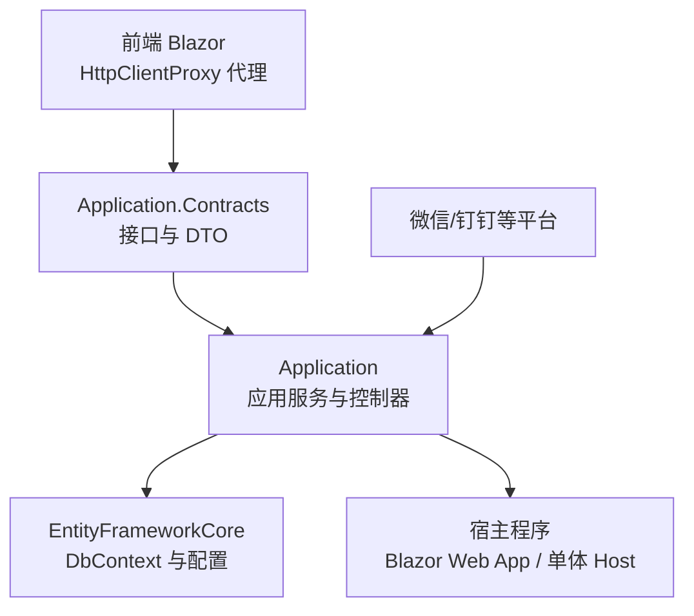
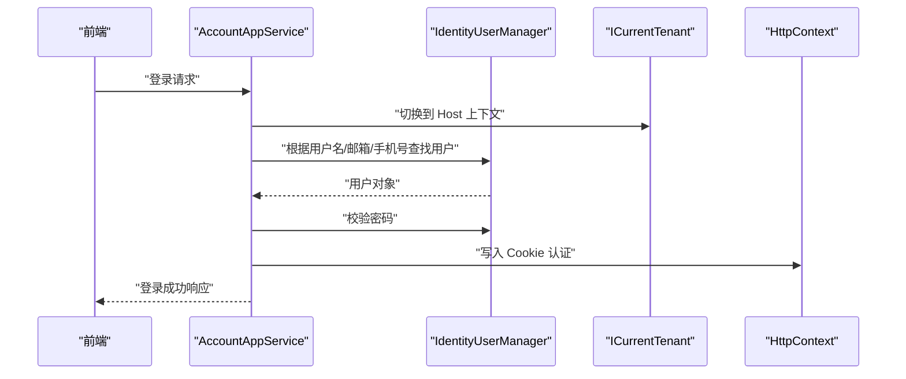
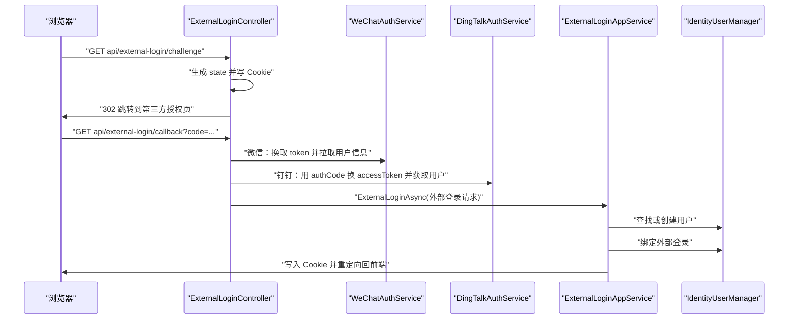
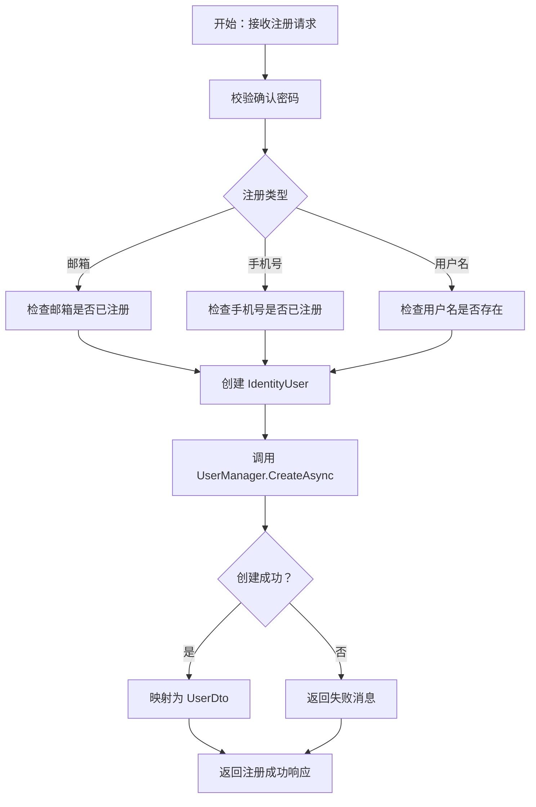
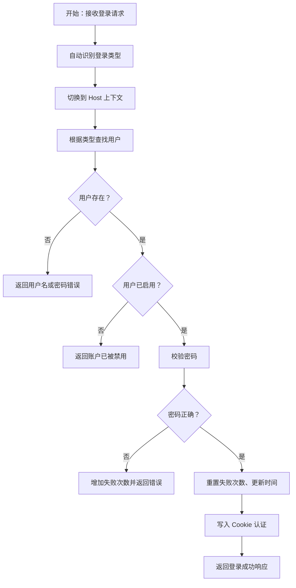
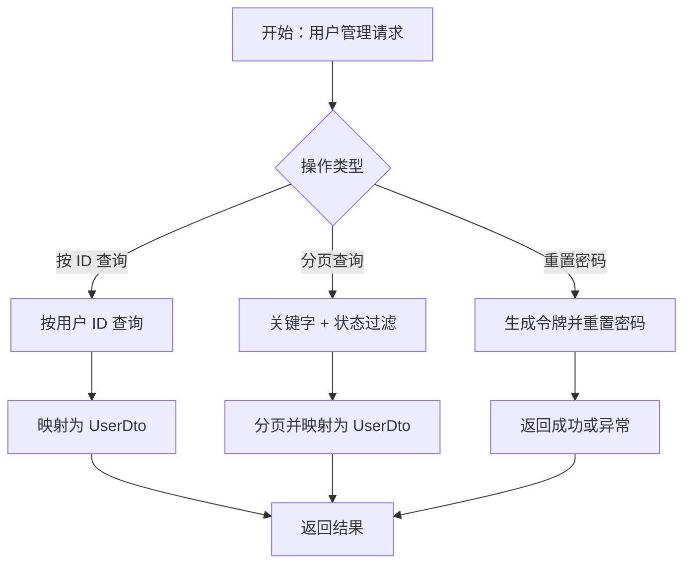
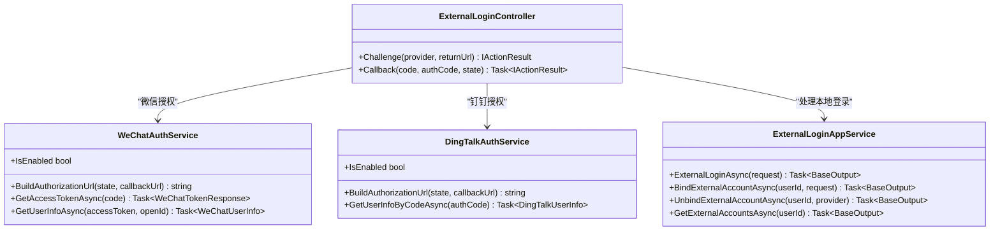
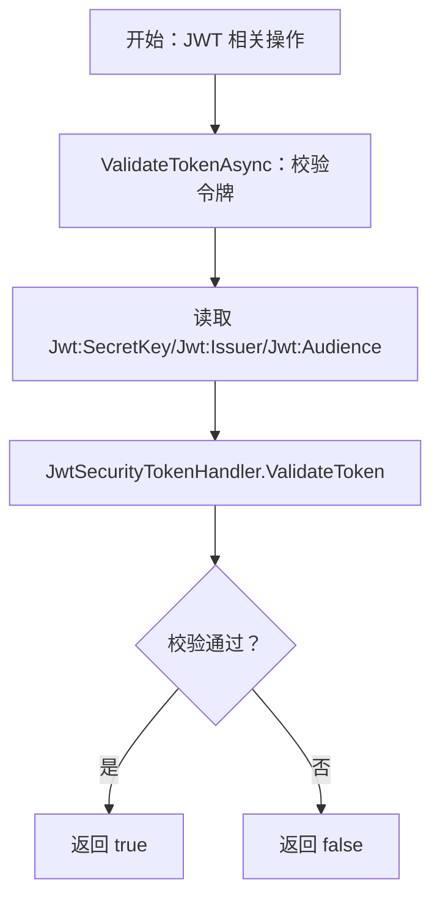
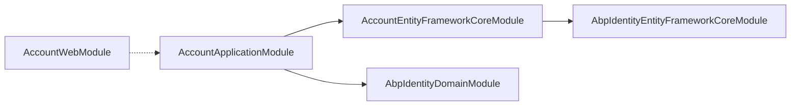

# 账户服务

<cite>
**本文引用的文件**   
- [AccountDtos.cs](file://src/Services/Account/H.Account.Application.Contracts/Dtos/AccountDtos.cs)
- [ExternalLoginDtos.cs](file://src/Services/Account/H.Account.Application.Contracts/Dtos/ExternalLoginDtos.cs)
- [IAccountAppService.cs](file://src/Services/Account/H.Account.Application.Contracts/Services/IAccountAppService.cs)
- [IAccountUserAppService.cs](file://src/Services/Account/H.Account.Application.Contracts/Services/IAccountUserAppService.cs)
- [IExternalLoginAppService.cs](file://src/Services/Account/H.Account.Application.Contracts/Services/IExternalLoginAppService.cs)
- [AccountApplicationContractsModule.cs](file://src/Services/Account/H.Account.Application.Contracts/AccountApplicationContractsModule.cs)
- [AccountAppService.cs](file://src/Services/Account/H.Account.Application/Services/AccountAppService.cs)
- [AccountUserAppService.cs](file://src/Services/Account/H.Account.Application/Services/AccountUserAppService.cs)
- [ExternalLoginAppService.cs](file://src/Services/Account/H.Account.Application/ExternalLogin/ExternalLoginAppService.cs)
- [ExternalLoginController.cs](file://src/Services/Account/H.Account.Application/ExternalLogin/ExternalLoginController.cs)
- [WeChatAuthService.cs](file://src/Services/Account/H.Account.Application/ExternalLogin/WeChatAuthService.cs)
- [DingTalkAuthService.cs](file://src/Services/Account/H.Account.Application/ExternalLogin/DingTalkAuthService.cs)
- [ExternalLoginOptions.cs](file://src/Services/Account/H.Account.Application/ExternalLogin/ExternalLoginOptions.cs)
- [AccountApplicationModule.cs](file://src/Services/Account/H.Account.Application/AccountApplicationModule.cs)
- [AccountEntityFrameworkCoreModule.cs](file://src/Services/Account/H.Account.EntityFrameworkCore/AccountEntityFrameworkCoreModule.cs)
- [AccountDbContext.cs](file://src/Services/Account/H.Account.EntityFrameworkCore/AccountDbContext.cs)
</cite>

## 目录

1. [简介](#简介)
2. [项目结构](#项目结构)
3. [核心组件](#核心组件)
4. [架构总览](#架构总览)
5. [详细组件分析](#详细组件分析)
6. [依赖关系分析](#依赖关系分析)
7. [性能与扩展性](#性能与扩展性)
8. [故障排查指南](#故障排查指南)
9. [结论](#结论)
10. [附录：API 参考](#附录api-参考)

## 简介

H.AppLab 账户服务模块基于 ABP Framework，围绕企业级用户管理、多租户认证授权、外部登录集成等能力构建。该模块在应用契约层暴露统一接口，在应用层实现注册登录、用户查询、密码重置、外部账号绑定等业务逻辑，并在 EntityFrameworkCore 层复用 ABP Identity 的领域实体进行数据持久化。

从系统视角看，账户服务是 H.AppLab 平台的基础身份中心：其他业务服务通过 Cookie 或 JWT 访问受保护资源；前端通过 `IAppService` 动态代理调用账户接口；外部登录流程由 Controller 协调微信、钉钉等第三方平台完成 OAuth 回调并落地到本地用户体系。

## 项目结构

账户服务按 ABP 典型分层组织，主要包含以下程序集：

| 层次 | 程序集 | 职责 |
| --- | --- | --- |
| Application.Contracts | `H.Account.Application.Contracts` | 定义 DTO、分页模型和应用服务接口 |
| Application | `H.Account.Application` | 应用服务实现、外部登录 Controller、第三方登录适配器 |
| EntityFrameworkCore | `H.Account.EntityFrameworkCore` | DbContext、数据库连接配置、ABP Identity 实体映射 |
| Web | `H.Account.Web` | Web 模块标记类，用于宿主装配 |
| Client | `H.Account.Client` | 客户端模块标记类（未展开） |

**图表来源**   
- [AccountApplicationContractsModule.cs:1-9](file://src/Services/Account/H.Account.Application.Contracts/AccountApplicationContractsModule.cs#L1-L9)
- [AccountApplicationModule.cs:1-22](file://src/Services/Account/H.Account.Application/AccountApplicationModule.cs#L1-L22)
- [AccountEntityFrameworkCoreModule.cs:1-37](file://src/Services/Account/H.Account.EntityFrameworkCore/AccountEntityFrameworkCoreModule.cs#L1-L37)

**章节来源**   
- [AccountApplicationContractsModule.cs:1-9](file://src/Services/Account/H.Account.Application.Contracts/AccountApplicationContractsModule.cs#L1-L9)
- [AccountApplicationModule.cs:1-22](file://src/Services/Account/H.Account.Application/AccountApplicationModule.cs#L1-L22)
- [AccountEntityFrameworkCoreModule.cs:1-37](file://src/Services/Account/H.Account.EntityFrameworkCore/AccountEntityFrameworkCoreModule.cs#L1-L37)

## 核心组件

### 应用契约层

应用契约层对外暴露三类接口：

| 接口 | 主要能力 | 关键方法 |
| --- | --- | --- |
| `IAccountAppService` | 认证主流程：注册、登录、登出、当前用户、令牌校验 | `RegisterAsync`、`LoginAsync`、`GetCurrentUserAsync`、`ValidateTokenAsync`、`LogoutAsync` |
| `IAccountUserAppService` | 企业管理员侧用户查询与管理 | `GetUserDtoByIdAsync`、`GetPagedUsersAsync`、`ResetPasswordAsync` |
| `IExternalLoginAppService` | 外部登录与第三方账号绑定 | `ExternalLoginAsync`、`BindExternalAccountAsync`、`UnbindExternalAccountAsync`、`GetExternalAccountsAsync` |

DTO 方面，用户模型使用 `UserDto`，外部登录请求和结果分别使用 `ExternalLoginRequestDto`、`ExternalLoginResultDto`，通用返回包装使用 `BaseOutput<T>`，分页使用 `PagedResult<T>`。

**章节来源**   
- [IAccountAppService.cs:1-18](file://src/Services/Account/H.Account.Application.Contracts/Services/IAccountAppService.cs#L1-L18)
- [IAccountUserAppService.cs:1-26](file://src/Services/Account/H.Account.Application.Contracts/Services/IAccountUserAppService.cs#L1-L26)
- [IExternalLoginAppService.cs:1-30](file://src/Services/Account/H.Account.Application.Contracts/Services/IExternalLoginAppService.cs#L1-L30)
- [AccountDtos.cs:1-123](file://src/Services/Account/H.Account.Application.Contracts/Dtos/AccountDtos.cs#L1-L123)
- [ExternalLoginDtos.cs:1-48](file://src/Services/Account/H.Account.Application.Contracts/Dtos/ExternalLoginDtos.cs#L1-L48)

### 应用层

应用层由三个重要部分组成：

1. **认证应用服务**：负责用户名/邮箱/手机号注册、自动识别登录类型、Cookie 认证、JWT 令牌生成与校验、当前用户读取。
2. **用户管理应用服务**：提供跨租户用户查询、关键字过滤、状态筛选、分页、密码重置。
3. **外部登录应用服务与控制器**：处理微信、钉钉扫码登录跳转与回调，完成第三方用户信息获取、本地用户创建或查找、Cookie 写入和外部账号绑定管理。

**章节来源**   
- [AccountAppService.cs:1-357](file://src/Services/Account/H.Account.Application/Services/AccountAppService.cs#L1-L357)
- [AccountUserAppService.cs:1-115](file://src/Services/Account/H.Account.Application/Services/AccountUserAppService.cs#L1-L115)
- [ExternalLoginAppService.cs:1-235](file://src/Services/Account/H.Account.Application/ExternalLogin/ExternalLoginAppService.cs#L1-L235)
- [ExternalLoginController.cs:1-202](file://src/Services/Account/H.Account.Application/ExternalLogin/ExternalLoginController.cs#L1-L202)

### 领域与数据持久化层

本模块没有自定义领域实体，而是直接复用 ABP Identity 的 `IdentityUser`、`IdentityUserLogin`。EF Core 层通过 `AccountDbContext` 暴露这两个实体集合，并使用 `modelBuilder.ConfigureIdentity()` 加载 ABP Identity 的模型配置。数据库连接名称为 `AccountDb`，同时共享 ABP Identity 的连接字符串。

**章节来源**   
- [AccountDbContext.cs:1-28](file://src/Services/Account/H.Account.EntityFrameworkCore/AccountDbContext.cs#L1-L28)
- [AccountEntityFrameworkCoreModule.cs:1-37](file://src/Services/Account/H.Account.EntityFrameworkCore/AccountEntityFrameworkCoreModule.cs#L1-L37)

## 架构总览

账户服务的整体数据流可以划分为三条主线：

1. **传统用户名/邮箱/手机号认证流程**：前端调用 `IAccountAppService.LoginAsync`，服务端验证密码后写入 Cookie，并提供 JWT 校验能力。
2. **外部登录流程**：前端触发 `ExternalLoginController.Challenge`，跳转到微信或钉钉授权页；回调时 Controller 换取用户信息，再交给 `ExternalLoginAppService` 完成用户匹配、自动注册、绑定与登录。
3. **用户管理流程**：管理员通过 `IAccountUserAppService` 查询用户列表、重置密码，底层访问 ABP Identity 的用户仓储。

**图表来源**   
- [AccountAppService.cs:1-200](file://src/Services/Account/H.Account.Application/Services/AccountAppService.cs#L1-L200)

**图表来源**   
- [ExternalLoginController.cs:1-202](file://src/Services/Account/H.Account.Application/ExternalLogin/ExternalLoginController.cs#L1-L202)
- [WeChatAuthService.cs:1-118](file://src/Services/Account/H.Account.Application/ExternalLogin/WeChatAuthService.cs#L1-L118)
- [DingTalkAuthService.cs:1-139](file://src/Services/Account/H.Account.Application/ExternalLogin/DingTalkAuthService.cs#L1-L139)
- [ExternalLoginAppService.cs:1-235](file://src/Services/Account/H.Account.Application/ExternalLogin/ExternalLoginAppService.cs#L1-L235)

## 详细组件分析

### 用户注册与登录

#### 注册流程

`IAccountAppService.RegisterAsync` 支持三种注册方式：用户名、邮箱、手机号。其核心逻辑如下：

1. 校验确认密码是否一致。
2. 根据 `RegisterType` 选择唯一性检查策略：
   - 邮箱：通过 `IdentityUserManager.FindByEmailAsync` 判断是否已存在。
   - 手机号：枚举所有用户并比较 `PhoneNumber`。
   - 用户名：通过 `FindByNameAsync` 判断重复。
3. 构造 `IdentityUser`，设置 ID、用户名、邮箱，必要时设置手机号。
4. 调用 `CreateAsync` 创建用户。
5. 返回封装后的 `AuthResponseDto`，其中包含用户 DTO。

需要注意：手机号注册时默认将手机号作为用户名，邮箱设置为临时值；注册成功后会映射为 `UserDto`。

**图表来源**   
- [AccountAppService.cs:1-120](file://src/Services/Account/H.Account.Application/Services/AccountAppService.cs#L1-L120)

#### 登录流程

`IAccountAppService.LoginAsync` 支持自动识别登录输入：

| 输入特征 | 判定规则 | 查找方式 |
| --- | --- | --- |
| 邮箱 | 包含 `@` 和 `.`，并匹配简单邮箱正则 | `FindByEmailAsync` |
| 手机号 | 以 `1` 开头、长度为 11 的数字 | 枚举用户并比较 `PhoneNumber` |
| 用户名 | 其他情况 | `FindByNameAsync` |

登录后流程包括：

1. 切换至 Host 上下文，避免租户隔离导致找不到用户。
2. 查找用户并校验启用状态。
3. 校验密码，失败则增加失败次数。
4. 成功后重置失败次数、更新最后修改时间。
5. 写入 Cookie 认证信息，过期时间由 `RememberMe` 决定。
6. 返回登录成功响应。

此外，`DetectLoginType` 使用正则表达式区分邮箱和手机号，使前端无需显式传递登录类型。

**图表来源**   
- [AccountAppService.cs:120-200](file://src/Services/Account/H.Account.Application/Services/AccountAppService.cs#L120-L200)

**章节来源**   
- [IAccountAppService.cs:1-18](file://src/Services/Account/H.Account.Application.Contracts/Services/IAccountAppService.cs#L1-L18)
- [AccountAppService.cs:1-200](file://src/Services/Account/H.Account.Application/Services/AccountAppService.cs#L1-L200)
- [AccountDtos.cs:1-123](file://src/Services/Account/H.Account.Application.Contracts/Dtos/AccountDtos.cs#L1-L123)

### 用户管理与密码重置

`IAccountUserAppService` 面向企业管理场景，提供：

- 按 ID 获取用户。
- 分页查询用户，支持关键字搜索和启用状态筛选。
- 管理员重置用户密码。

分页查询会在内存中对 `IQueryable` 先执行 `ToList()`，再进行关键字和状态过滤，然后计算总数并按页切片。这种方式适合小规模用户表；如果用户规模增长，应改为数据库端分页和过滤。

密码重置流程：

1. 校验两次密码是否一致。
2. 通过 ID 查找用户。
3. 调用 `GeneratePasswordResetTokenAsync` 生成重置令牌。
4. 调用 `ResetPasswordAsync` 更新密码。
5. 失败时抛出异常，由上层统一处理。

**图表来源**   
- [AccountUserAppService.cs:1-115](file://src/Services/Account/H.Account.Application/Services/AccountUserAppService.cs#L1-L115)

**章节来源**   
- [IAccountUserAppService.cs:1-26](file://src/Services/Account/H.Account.Application.Contracts/Services/IAccountUserAppService.cs#L1-L26)
- [AccountUserAppService.cs:1-115](file://src/Services/Account/H.Account.Application/Services/AccountUserAppService.cs#L1-L115)
- [AccountDtos.cs:1-123](file://src/Services/Account/H.Account.Application.Contracts/Dtos/AccountDtos.cs#L1-L123)

### 外部登录集成

外部登录由三层协作完成：

1. **控制器层**：`ExternalLoginController` 负责发起挑战、校验 state、处理回调。
2. **第三方适配层**：`WeChatAuthService`、`DingTalkAuthService` 封装微信开放平台和钉钉新版 OAuth2 API。
3. **应用服务层**：`ExternalLoginAppService` 负责本地用户查找、自动注册、外部账号绑定和 Cookie 登录。

#### 外部登录控制器

`ExternalLoginController` 暴露两个关键路由：

| 路由 | 方法 | 行为 |
| --- | --- | --- |
| `/api/external-login/challenge` | GET | 校验 provider 是否启用，生成 state Cookie，跳转第三方授权页 |
| `/api/external-login/callback` | GET | 校验 state，换取用户信息，调用应用服务完成登录 |

回调中，微信使用 `code`，钉钉新版使用 `authCode`；两者最终都转换为统一的 `ExternalLoginRequestDto`。

#### 第三方登录适配器

| 适配器 | 主要职责 | 关键接口 |
| --- | --- | --- |
| `WeChatAuthService` | 微信开放平台扫码登录 | `BuildAuthorizationUrl`、`GetAccessTokenAsync`、`GetUserInfoAsync` |
| `DingTalkAuthService` | 钉钉新版 OAuth2 登录 | `BuildAuthorizationUrl`、`GetUserInfoByCodeAsync` |

钉钉流程分两步：先用 `authCode` 换取 `accessToken`，再用 `accessToken` 获取用户信息；微信流程则是先用 `code` 换取 `access_token` 和 `openid`，再拉取用户信息。

#### 外部登录应用服务

`ExternalLoginAppService.ExternalLoginAsync` 的核心逻辑：

1. 校验 provider 和 providerKey。
2. 通过 `IdentityUserManager.FindByLoginAsync` 查找已绑定用户。
3. 若未绑定，自动生成用户名、邮箱和随机密码，创建用户并绑定外部登录。
4. 若已绑定，检查用户是否启用。
5. 更新最后登录时间。
6. 写入 Cookie 认证。
7. 返回是否新用户、用户信息和消息。

绑定和解绑外部账号时，服务会防止同一 provider 重复绑定，并防止解绑唯一登录方式导致用户无法登录。

**图表来源**   
- [ExternalLoginController.cs:1-202](file://src/Services/Account/H.Account.Application/ExternalLogin/ExternalLoginController.cs#L1-L202)
- [WeChatAuthService.cs:1-118](file://src/Services/Account/H.Account.Application/ExternalLogin/WeChatAuthService.cs#L1-L118)
- [DingTalkAuthService.cs:1-139](file://src/Services/Account/H.Account.Application/ExternalLogin/DingTalkAuthService.cs#L1-L139)
- [ExternalLoginAppService.cs:1-235](file://src/Services/Account/H.Account.Application/ExternalLogin/ExternalLoginAppService.cs#L1-L235)

**章节来源**   
- [IExternalLoginAppService.cs:1-30](file://src/Services/Account/H.Account.Application.Contracts/Services/IExternalLoginAppService.cs#L1-L30)
- [ExternalLoginController.cs:1-202](file://src/Services/Account/H.Account.Application/ExternalLogin/ExternalLoginController.cs#L1-L202)
- [ExternalLoginAppService.cs:1-235](file://src/Services/Account/H.Account.Application/ExternalLogin/ExternalLoginAppService.cs#L1-L235)
- [WeChatAuthService.cs:1-118](file://src/Services/Account/H.Account.Application/ExternalLogin/WeChatAuthService.cs#L1-L118)
- [DingTalkAuthService.cs:1-139](file://src/Services/Account/H.Account.Application/ExternalLogin/DingTalkAuthService.cs#L1-L139)
- [ExternalLoginOptions.cs:1-21](file://src/Services/Account/H.Account.Application/ExternalLogin/ExternalLoginOptions.cs#L1-L21)

### JWT 令牌与 Cookie 认证

账户服务同时支持 Cookie 和 JWT：

- **Cookie 认证**：登录成功后通过 `ClaimsPrincipal` 写入 Cookie，适用于 Blazor Web App 和服务端渲染场景。
- **JWT 令牌**：提供 `ValidateTokenAsync` 校验 JWT，内部使用 `JwtSecurityTokenHandler` 校验签发者、受众、签名密钥和有效期；同时包含 `GenerateJwtToken` 私有方法用于生成令牌。

JWT 配置来自 `Jwt:SecretKey`、`Jwt:Issuer`、`Jwt:Audience`、`Jwt:ExpirationMinutes`。当前实现中，登录流程主要写入 Cookie，JWT 更适合作为跨服务调用的附加认证机制。

**图表来源**   
- [AccountAppService.cs:201-357](file://src/Services/Account/H.Account.Application/Services/AccountAppService.cs#L201-L357)

**章节来源**   
- [IAccountAppService.cs:1-18](file://src/Services/Account/H.Account.Application.Contracts/Services/IAccountAppService.cs#L1-L18)
- [AccountAppService.cs:201-357](file://src/Services/Account/H.Account.Application/Services/AccountAppService.cs#L201-L357)

### 多租户设计

账户服务中的用户属于全局跨租户数据。多个关键方法显式使用 `ICurrentTenant.Change(null)` 切换到 Host 上下文，以避免 ABP 的多租户过滤导致查不到用户：

- `LoginAsync`
- `GetUserByIdAsync`
- `GetCurrentUserAsync`
- `AccountUserAppService` 的所有公共方法

这意味着：虽然其他业务可能运行在特定租户下，但用户表和外部登录表始终在 Host 上下文中访问。

**章节来源**   
- [AccountAppService.cs:120-300](file://src/Services/Account/H.Account.Application/Services/AccountAppService.cs#L120-L300)
- [AccountUserAppService.cs:1-115](file://src/Services/Account/H.Account.Application/Services/AccountUserAppService.cs#L1-L115)

## 依赖关系分析

账户服务依赖 ABP Framework 的 Identity 模块，并通过模块声明建立依赖关系：

**图表来源**   
- [AccountApplicationModule.cs:1-22](file://src/Services/Account/H.Account.Application/AccountApplicationModule.cs#L1-L22)
- [AccountEntityFrameworkCoreModule.cs:1-37](file://src/Services/Account/H.Account.EntityFrameworkCore/AccountEntityFrameworkCoreModule.cs#L1-L37)

依赖链说明：

| 依赖 | 说明 |
| --- | --- |
| `Volo.Abp.Identity` | 提供 `IdentityUserManager`、`IdentityUser` 等身份核心能力 |
| `Volo.Abp.MultiTenancy` | 提供 `ICurrentTenant`，用于 Host 与租户上下文切换 |
| `Microsoft.AspNetCore.Authentication` | 提供 Cookie 认证和 ClaimsPrincipal |
| `System.IdentityModel.Tokens.Jwt` | 提供 JWT 令牌处理 |
| `Microsoft.EntityFrameworkCore` | 提供 EF Core 查询和上下文能力 |
| `Microsoft.Extensions.Configuration` | 读取 appsettings 中的 JWT 和连接串配置 |

**章节来源**   
- [AccountApplicationModule.cs:1-22](file://src/Services/Account/H.Account.Application/AccountApplicationModule.cs#L1-L22)
- [AccountEntityFrameworkCoreModule.cs:1-37](file://src/Services/Account/H.Account.EntityFrameworkCore/AccountEntityFrameworkCoreModule.cs#L1-L37)

## 性能与扩展性

### 性能特点

1. **用户查询分页**：当前 `GetPagedUsersAsync` 先将全部用户加载到内存，再执行过滤和分页。对于少量用户可接受，但对大规模用户会产生全表扫描和内存压力。
2. **手机号查找**：登录和注册时对手机号采用枚举用户的方式，时间复杂度接近 O(n)，不适合大量用户场景。
3. **Cookie 认证**：适合 Blazor Server 和单站点部署；若需要无状态微服务调用，应优先使用 JWT。
4. **外部登录 HTTP 调用**：微信和钉钉回调涉及外部网络请求，应关注超时、重试和日志记录。

### 优化建议

| 场景 | 当前实现 | 建议优化 |
| --- | --- | --- |
| 用户分页查询 | 内存过滤 + 分页 | 改为数据库端分页和条件过滤 |
| 手机号登录 | 枚举所有用户 | 引入手机号索引或使用专用查询方法 |
| JWT 生成 | 私有方法未公开 | 如需跨服务调用，可公开令牌生成接口并加入刷新机制 |
| 外部登录状态 | 使用短生命周期 Cookie | 可增加 CSRF 防护、state 缓存和审计日志 |
| 外部登录配置 | 通过 `ExternalLoginOptions` | 可扩展更多第三方平台，如企业微信、GitHub 等 |

[本节为通用性能建议，不直接分析具体代码片段]

## 故障排查指南

### 登录失败

| 现象 | 可能原因 | 排查方向 |
| --- | --- | --- |
| 用户名或密码错误 | 用户不存在或密码不正确 | 检查 `LoginAsync` 中用户查找和密码校验逻辑 |
| 账户已被禁用 | 用户 `IsActive` 为假 | 检查用户状态字段 |
| 失败次数过多被锁定 | 多次密码错误导致锁out | 检查 `AccessFailedCount` 和 `LockoutEnd` |
| 外部登录失败 | state 过期、第三方回调异常 | 检查 `ExternalLoginController` 的 state Cookie 和回调参数 |

### 外部登录异常

| 现象 | 可能原因 | 排查方向 |
| --- | --- | --- |
| 微信授权失败 | access_token 获取失败 | 检查 `WeChatAuthService.GetAccessTokenAsync` |
| 钉钉授权失败 | authCode 无效或 accessToken 为空 | 检查 `DingTalkAuthService.GetUserInfoByCodeAsync` |
| 外部账号已被其他用户绑定 | providerKey 已存在 | 检查 `ExternalLoginAppService.BindExternalAccountAsync` |
| 无法解绑外部账号 | 这是用户唯一登录方式 | 检查解绑前对登录方式数量的判断 |

### JWT 校验失败

| 现象 | 可能原因 | 排查方向 |
| --- | --- | --- |
| `ValidateTokenAsync` 返回 false | 密钥、签发者、受众或过期时间不匹配 | 检查 `Jwt:SecretKey`、`Jwt:Issuer`、`Jwt:Audience` |
| 令牌无效 | 客户端传入的令牌损坏或过期 | 检查前端存储和传输逻辑 |

**章节来源**   
- [AccountAppService.cs:120-357](file://src/Services/Account/H.Account.Application/Services/AccountAppService.cs#L120-L357)
- [ExternalLoginController.cs:1-202](file://src/Services/Account/H.Account.Application/ExternalLogin/ExternalLoginController.cs#L1-L202)
- [ExternalLoginAppService.cs:1-235](file://src/Services/Account/H.Account.Application/ExternalLogin/ExternalLoginAppService.cs#L1-L235)

## 结论

H.AppLab 账户服务模块以 ABP Identity 为基础，实现了企业级用户注册登录、用户查询管理、Cookie 认证、JWT 校验和微信/钉钉外部登录集成。其分层清晰：契约层定义接口和 DTO，应用层实现业务编排，EF Core 层复用 ABP Identity 实体。

当前实现更适合中小规模用户场景；随着用户规模增长，建议在分页查询、手机号查找、JWT 生命周期管理和外部登录容错方面进一步优化。权限控制方面，该模块侧重身份认证；角色、权限、授权策略可结合 ABP 的 Role、Permission、Authorization 能力在更高层扩展。

[本节为总结性内容，不直接分析具体代码片段]

## 附录：API 参考

### 认证接口

| 接口 | 方法 | 请求体 | 响应 | 说明 |
| --- | --- | --- | --- | --- |
| `IAccountAppService.RegisterAsync` | POST | `RegisterRequestDto` | `BaseOutput<AuthResponseDto>` | 用户名、邮箱或手机号注册 |
| `IAccountAppService.LoginAsync` | POST | `LoginRequestDto` | `BaseOutput<AuthResponseDto>` | 用户名、邮箱或手机号登录 |
| `IAccountAppService.GetCurrentUserAsync` | GET | 无 | `BaseOutput<UserDto?>` | 获取当前登录用户 |
| `IAccountAppService.ValidateTokenAsync` | GET/POST | token 参数 | `BaseOutput<bool>` | 校验 JWT 令牌 |
| `IAccountAppService.LogoutAsync` | POST | 无 | `BaseOutput` | 退出登录 |

**章节来源**   
- [IAccountAppService.cs:1-18](file://src/Services/Account/H.Account.Application.Contracts/Services/IAccountAppService.cs#L1-L18)
- [AccountDtos.cs:1-123](file://src/Services/Account/H.Account.Application.Contracts/Dtos/AccountDtos.cs#L1-L123)

### 用户管理接口

| 接口 | 方法 | 请求体 | 响应 | 说明 |
| --- | --- | --- | --- | --- |
| `IAccountUserAppService.GetUserDtoByIdAsync` | GET | userId | `BaseOutput<UserDto?>` | 按 ID 获取用户 |
| `IAccountUserAppService.GetPagedUsersAsync` | GET/POST | `UserQueryParams` | `BaseOutput<PagedResult<UserDto>>` | 分页查询用户 |
| `IAccountUserAppService.ResetPasswordAsync` | POST | userId + `ResetPasswordDto` | `BaseOutput` | 管理员重置密码 |

**章节来源**   
- [IAccountUserAppService.cs:1-26](file://src/Services/Account/H.Account.Application.Contracts/Services/IAccountUserAppService.cs#L1-L26)
- [AccountDtos.cs:1-123](file://src/Services/Account/H.Account.Application.Contracts/Dtos/AccountDtos.cs#L1-L123)

### 外部登录接口

| 接口 | 方法 | 请求体 | 响应 | 说明 |
| --- | --- | --- | --- | --- |
| `ExternalLoginController.Challenge` | GET | provider、returnUrl | 302 重定向 | 发起第三方登录跳转 |
| `ExternalLoginController.Callback` | GET | code/authCode、state | 302 重定向 | 处理第三方回调 |
| `IExternalLoginAppService.ExternalLoginAsync` | POST | `ExternalLoginRequestDto` | `BaseOutput<ExternalLoginResultDto>` | 外部登录或自动注册 |
| `IExternalLoginAppService.BindExternalAccountAsync` | POST | userId + `ExternalLoginRequestDto` | `BaseOutput<ExternalLoginResultDto>` | 绑定外部账号 |
| `IExternalLoginAppService.UnbindExternalAccountAsync` | POST | userId、provider | `BaseOutput<bool>` | 解绑外部账号 |
| `IExternalLoginAppService.GetExternalAccountsAsync` | GET | userId | `BaseOutput<List<ExternalAccountDto>>` | 获取已绑定外部账号列表 |

**章节来源**   
- [IExternalLoginAppService.cs:1-30](file://src/Services/Account/H.Account.Application.Contracts/Services/IExternalLoginAppService.cs#L1-L30)
- [ExternalLoginController.cs:1-202](file://src/Services/Account/H.Account.Application/ExternalLogin/ExternalLoginController.cs#L1-L202)
- [ExternalLoginDtos.cs:1-48](file://src/Services/Account/H.Account.Application.Contracts/Dtos/ExternalLoginDtos.cs#L1-L48)