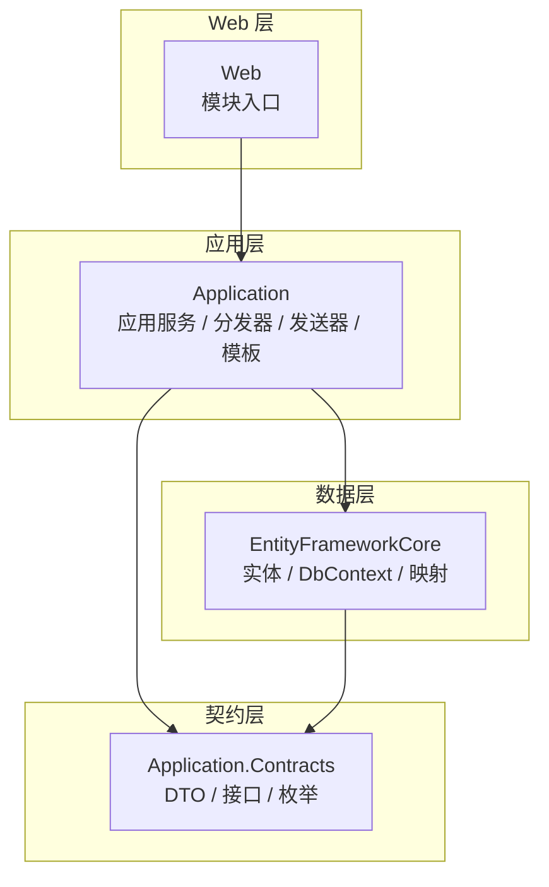
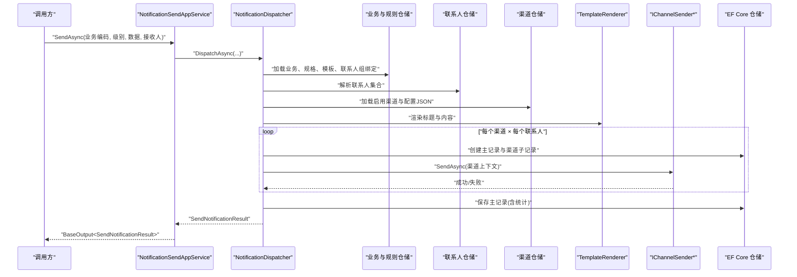
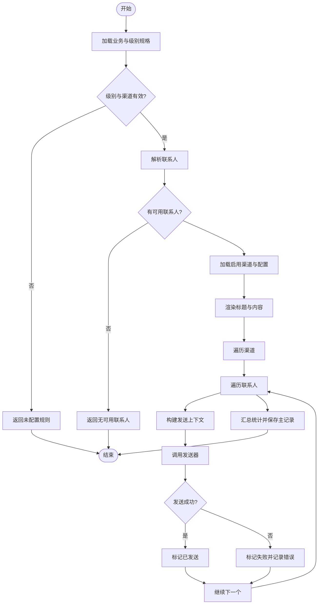
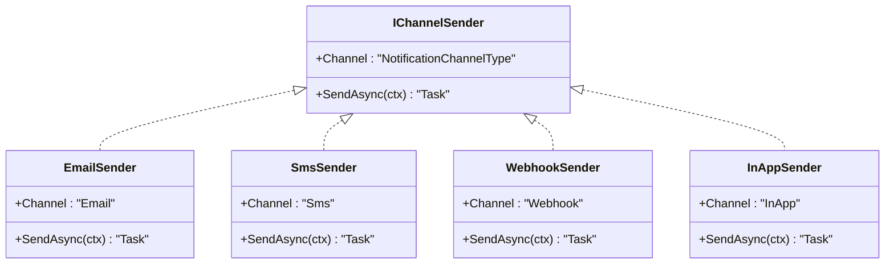
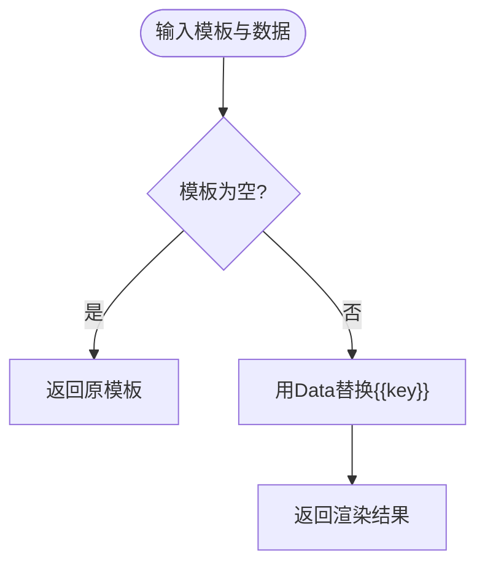
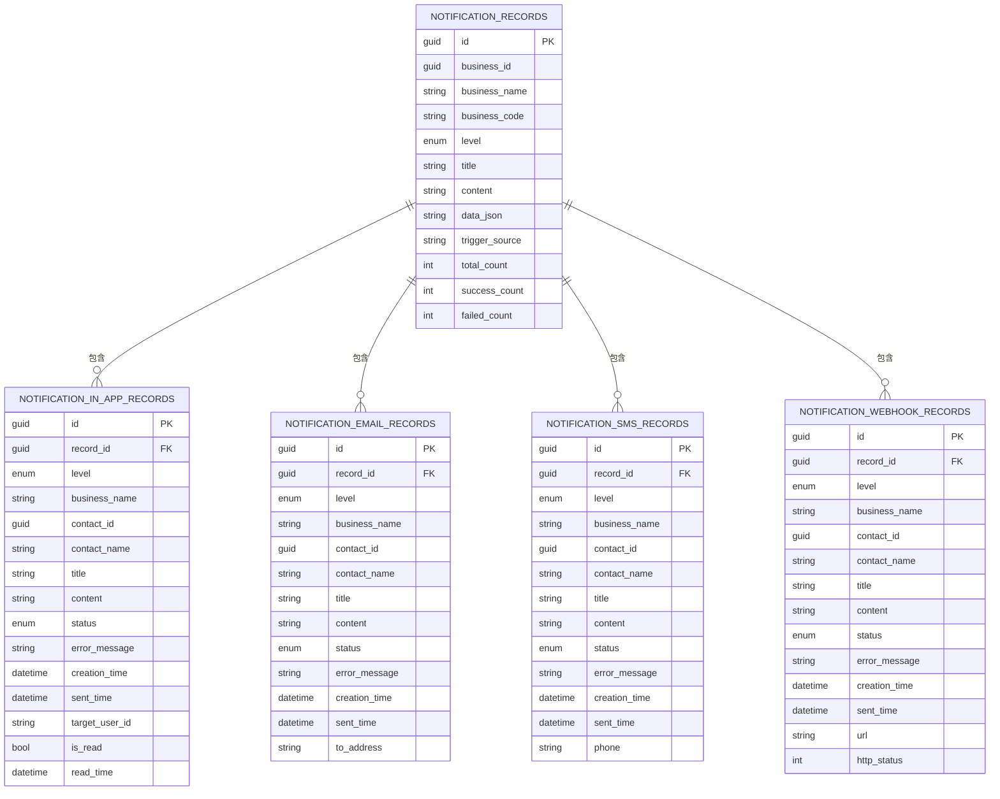
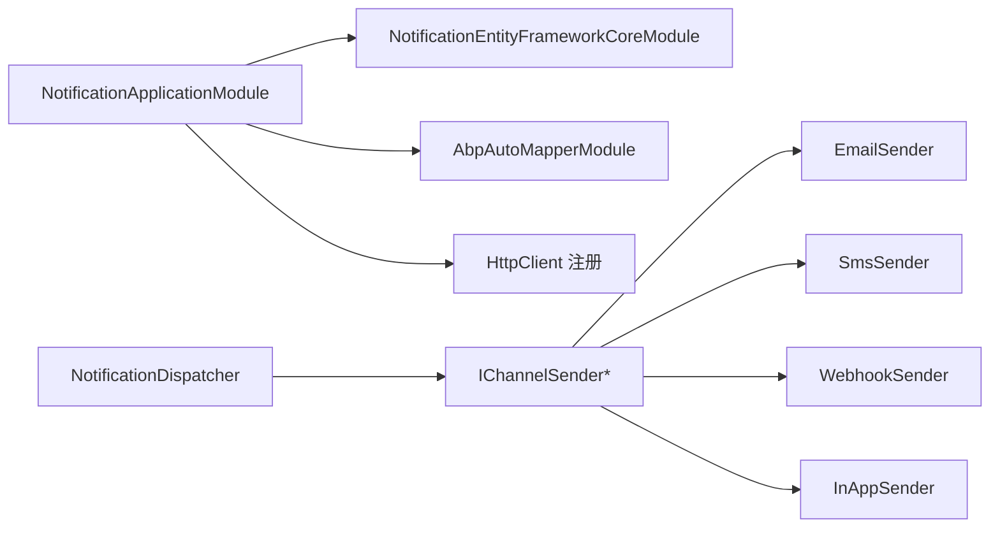

# 通知服务

<cite>
**本文引用的文件**   
- [README.md](file://README.md)
- [NotificationDispatcher.cs](file://src/Services/Notification/H.Notification.Application/Sending/NotificationDispatcher.cs)
- [IChannelSender.cs](file://src/Services/Notification/H.Notification.Application/Sending/IChannelSender.cs)
- [EmailSender.cs](file://src/Services/Notification/H.Notification.Application/Sending/EmailSender.cs)
- [SmsSender.cs](file://src/Services/Notification/H.Notification.Application/Sending/SmsSender.cs)
- [WebhookSender.cs](file://src/Services/Notification/H.Notification.Application/Sending/WebhookSender.cs)
- [InAppSender.cs](file://src/Services/Notification/H.Notification.Application/Sending/InAppSender.cs)
- [TemplateRenderer.cs](file://src/Services/Notification/H.Notification.Application/Templates/TemplateRenderer.cs)
- [INotificationAppService.cs](file://src/Services/Notification/H.Notification.Application.Contracts/Services/INotificationAppService.cs)
- [SendDtos.cs](file://src/Services/Notification/H.Notification.Application.Contracts/Dtos/SendDtos.cs)
- [BusinessDtos.cs](file://src/Services/Notification/H.Notification.Application.Contracts/Dtos/BusinessDtos.cs)
- [ChannelDtos.cs](file://src/Services/Notification/H.Notification.Application.Contracts/Dtos/ChannelDtos.cs)
- [ContactDtos.cs](file://src/Services/Notification/H.Notification.Application.Contracts/Dtos/ContactDtos.cs)
- [CategoryDtos.cs](file://src/Services/Notification/H.Notification.Application.Contracts/Dtos/CategoryDtos.cs)
- [SpecDtos.cs](file://src/Services/Notification/H.Notification.Application.Contracts/Dtos/SpecDtos.cs)
- [NotificationChannelType.cs](file://src/Services/Notification/H.Notification.Application.Contracts/Enums/NotificationChannelType.cs)
- [NotificationLevel.cs](file://src/Services/Notification/H.Notification.Application.Contracts/Enums/NotificationLevel.cs)
- [DeliveryStatus.cs](file://src/Services/Notification/H.Notification.Application.Contracts/Enums/DeliveryStatus.cs)
- [NotificationRecordEntity.cs](file://src/Services/Notification/H.Notification.EntityFrameworkCore/Entities/NotificationRecordEntity.cs)
- [NotificationDbContext.cs](file://src/Services/Notification/H.Notification.EntityFrameworkCore/NotificationDbContext.cs)
- [NotificationApplicationModule.cs](file://src/Services/Notification/H.Notification.Application/NotificationApplicationModule.cs)
- [NotificationSendAppService.cs](file://src/Services/Notification/H.Notification.Application/Services/NotificationSendAppService.cs)
</cite>

## 目录
1. [简介](#简介)
2. [项目结构](#项目结构)
3. [核心组件](#核心组件)
4. [架构总览](#架构总览)
5. [详细组件分析](#详细组件分析)
6. [依赖关系分析](#依赖关系分析)
7. [性能与扩展性](#性能与扩展性)
8. [常见问题排查](#常见问题排查)
9. [结论](#结论)

## 简介
H.AppLab 通知服务模块是一个面向企业级应用的多渠道通知基础设施。它通过“业务编码 + 级别规格 + 联系人组”的配置方式，将系统公告、业务提醒、审批通知等场景统一抽象为可配置的通知事件；在运行时由分发器解析规则、渲染模板、投递到站内信、邮件、短信、Webhook 等多个渠道，并持久化发送结果，便于审计与排障。

该模块采用 ABP 模块化架构，包含 Application.Contracts（契约与 DTO）、Application（应用服务与发送编排）、EntityFrameworkCore（实体与数据库映射）以及 Web 模块入口。同时，通知服务基于 .NET 的依赖注入和 HttpClient 工厂进行外部系统集成，支持以 JSON 配置驱动各渠道行为。

本模块当前未内置 SignalR 实时通信实现，但已为站内信预留了用户标识字段，便于上层 Blazor 前端结合 SignalR 或轮询机制完成实时展示。

**章节来源**
- [README.md:1-73](file://README.md#L1-L73)

## 项目结构
通知服务按 ABP 标准分层组织：
- H.Notification.Application.Contracts：定义通知渠道、级别、状态枚举，以及分类、渠道、联系人、分组、业务、模板、记录等 DTO 与应用接口。
- H.Notification.Application：实现通知发送入口、分发编排、多渠道发送器、模板渲染、应用服务等。
- H.Notification.EntityFrameworkCore：定义通知领域实体、多租户标记、主从记录模型及 EF Core 映射。
- H.Notification.Web：Web 模块标记类，承载 API 路由与服务注册。

**图表来源**
- [INotificationAppService.cs:1-108](file://src/Services/Notification/H.Notification.Application.Contracts/Services/INotificationAppService.cs#L1-L108)
- [NotificationApplicationModule.cs:1-26](file://src/Services/Notification/H.Notification.Application/NotificationApplicationModule.cs#L1-L26)
- [NotificationDbContext.cs:1-212](file://src/Services/Notification/H.Notification.EntityFrameworkCore/NotificationDbContext.cs#L1-L212)
- [NotificationWebModule.cs:1-8](file://src/Services/Notification/H.Notification.Web/NotificationWebModule.cs#L1-L8)

**章节来源**
- [INotificationAppService.cs:1-108](file://src/Services/Notification/H.Notification.Application.Contracts/Services/INotificationAppService.cs#L1-L108)
- [NotificationApplicationModule.cs:1-26](file://src/Services/Notification/H.Notification.Application/NotificationApplicationModule.cs#L1-L26)
- [NotificationDbContext.cs:1-212](file://src/Services/Notification/H.Notification.EntityFrameworkCore/NotificationDbContext.cs#L1-L212)

## 核心组件
- 通知分发器 NotificationDispatcher：负责从业务编码解析规则、选择级别与渠道、解析联系人、渲染模板、创建主记录与各渠道子记录，并调用具体发送器投递。
- 多渠道发送器 IChannelSender 及其实现：
  - EmailSender：SMTP 邮件发送，使用 SmtpClient，凭据与主机参数来自渠道配置的 JSON。
  - SmsSender：短信桩实现，仅记录日志并返回成功，用于后续接入真实短信网关。
  - WebhookSender：HTTP POST 回调，支持自定义请求头，失败时返回状态码信息。
  - InAppSender：站内信直接落库即视为送达，实际推送可由前端消费。
- 模板渲染 TemplateRenderer：支持 {{key}} 占位符替换，用于标题与内容个性化。
- 应用接口 INotificationAppService：提供分类、联系人、联系人分组、通知渠道、通知业务、发送与记录的查询与管理 API。
- 数据模型 NotificationRecordEntity 与各渠道子记录：一次通知事件产生一条主记录，再按渠道拆分子记录，便于统计与审计。

**章节来源**
- [NotificationDispatcher.cs:1-338](file://src/Services/Notification/H.Notification.Application/Sending/NotificationDispatcher.cs#L1-L338)
- [IChannelSender.cs:1-50](file://src/Services/Notification/H.Notification.Application/Sending/IChannelSender.cs#L1-L50)
- [EmailSender.cs:1-97](file://src/Services/Notification/H.Notification.Application/Sending/EmailSender.cs#L1-L97)
- [SmsSender.cs:1-32](file://src/Services/Notification/H.Notification.Application/Sending/SmsSender.cs#L1-L32)
- [WebhookSender.cs:1-101](file://src/Services/Notification/H.Notification.Application/Sending/WebhookSender.cs#L1-L101)
- [InAppSender.cs:1-23](file://src/Services/Notification/H.Notification.Application/Sending/InAppSender.cs#L1-L23)
- [TemplateRenderer.cs:1-25](file://src/Services/Notification/H.Notification.Application/Templates/TemplateRenderer.cs#L1-L25)
- [INotificationAppService.cs:1-108](file://src/Services/Notification/H.Notification.Application.Contracts/Services/INotificationAppService.cs#L1-L108)
- [NotificationRecordEntity.cs:1-149](file://src/Services/Notification/H.Notification.EntityFrameworkCore/Entities/NotificationRecordEntity.cs#L1-L149)

## 架构总览
通知服务的整体流程是：调用方通过应用接口提交业务编码、可选级别、模板变量与接收人；分发器查找业务配置与级别规格，确定目标渠道与联系人；对每个渠道-联系人组合渲染标题与内容，创建主记录与各渠道子记录，并调用对应发送器；最终汇总成功与失败数量并返回消息 ID。

**图表来源**
- [NotificationSendAppService.cs:1-28](file://src/Services/Notification/H.Notification.Application/Services/NotificationSendAppService.cs#L1-L28)
- [NotificationDispatcher.cs:1-338](file://src/Services/Notification/H.Notification.Application/Sending/NotificationDispatcher.cs#L1-L338)
- [TemplateRenderer.cs:1-25](file://src/Services/Notification/H.Notification.Application/Templates/TemplateRenderer.cs#L1-L25)
- [NotificationRecordEntity.cs:1-149](file://src/Services/Notification/H.Notification.EntityFrameworkCore/Entities/NotificationRecordEntity.cs#L1-L149)

## 详细组件分析

### 通知分发器 NotificationDispatcher
NotificationDispatcher 是通知系统的编排中心。其职责包括：
- 根据业务编码加载业务实体、级别规格与模板。
- 若未指定级别，则使用业务默认级别。
- 解析级别对应的渠道列表，校验是否启用。
- 解析联系人：优先使用传入的接收人 ID；否则通过业务绑定的联系人组展开成员。
- 加载启用的渠道配置，构建渠道类型到配置 JSON 的映射。
- 渲染代表模板与渠道模板，生成标题与内容。
- 遍历渠道与联系人，构造发送上下文并调用发送器。
- 根据发送结果更新每条渠道子记录的状态、错误信息与发送时间。
- 汇总总数、成功数、失败数后写入主记录。

关键特性：
- 安全发送 SafeSendAsync：捕获发送异常并转换为失败结果，避免单次失败影响整批投递。
- 地址解析 ResolveAddress：按渠道类型从联系人实体中提取邮箱、手机号、Webhook 地址或站内信用户标识。
- 渠道解析 ParseChannels：将 CSV 字符串转为去重后的渠道枚举集合。
- 联系人解析 ResolveContactsAsync：支持显式 ID 与联系人组两种模式，且只返回启用联系人。

复杂度分析：
- 假设业务有 C 个渠道、N 个联系人，则内层循环执行 C×N 次，每次可能涉及一次数据库读取（仓储）与一次外部网络调用（邮件或 Webhook）。整体时间复杂度近似 O(C×N)，空间复杂度取决于缓存的渠道配置与联系人集合。

**图表来源**
- [NotificationDispatcher.cs:1-338](file://src/Services/Notification/H.Notification.Application/Sending/NotificationDispatcher.cs#L1-L338)

**章节来源**
- [NotificationDispatcher.cs:1-338](file://src/Services/Notification/H.Notification.Application/Sending/NotificationDispatcher.cs#L1-L338)

### 多渠道发送器 IChannelSender 体系
IChannelSender 定义了统一的发送接口与上下文 NotificationDeliveryContext，使不同渠道可以以相同方式被调度。

- EmailSender：
  - 使用 SmtpClient 发送邮件，支持 SSL、端口、用户名、密码、发件人与发件人名称。
  - 配置来源于 ChannelConfigJson，反序列化为 EmailChannelConfig。
  - 缺少邮箱地址或 SMTP 配置会直接失败。

- SmsSender：
  - 当前为桩实现，仅记录日志并返回成功，便于后续接入第三方短信网关。
  - 缺失手机号时返回失败。

- WebhookSender：
  - 使用 HttpClientFactory 创建 HTTP 客户端，POST JSON 到目标 URL。
  - 支持从 ChannelConfigJson 中注入自定义请求头。
  - 非成功状态码视为失败，异常会被捕获并记录错误。

- InAppSender：
  - 站内信不真正外发，因为投递记录本身即为站内信，落库即成功。
  - 需要目标用户标识，缺失则失败。

**图表来源**
- [IChannelSender.cs:1-50](file://src/Services/Notification/H.Notification.Application/Sending/IChannelSender.cs#L1-L50)
- [EmailSender.cs:1-97](file://src/Services/Notification/H.Notification.Application/Sending/EmailSender.cs#L1-L97)
- [SmsSender.cs:1-32](file://src/Services/Notification/H.Notification.Application/Sending/SmsSender.cs#L1-L32)
- [WebhookSender.cs:1-101](file://src/Services/Notification/H.Notification.Application/Sending/WebhookSender.cs#L1-L101)
- [InAppSender.cs:1-23](file://src/Services/Notification/H.Notification.Application/Sending/InAppSender.cs#L1-L23)

**章节来源**
- [IChannelSender.cs:1-50](file://src/Services/Notification/H.Notification.Application/Sending/IChannelSender.cs#L1-L50)
- [EmailSender.cs:1-97](file://src/Services/Notification/H.Notification.Application/Sending/EmailSender.cs#L1-L97)
- [SmsSender.cs:1-32](file://src/Services/Notification/H.Notification.Application/Sending/SmsSender.cs#L1-L32)
- [WebhookSender.cs:1-101](file://src/Services/Notification/H.Notification.Application/Sending/WebhookSender.cs#L1-L101)
- [InAppSender.cs:1-23](file://src/Services/Notification/H.Notification.Application/Sending/InAppSender.cs#L1-L23)

### 模板渲染 TemplateRenderer
TemplateRenderer 使用正则表达式匹配 {{key}} 占位符，并将 Data 字典中的值替换进去。如果某个键不存在，则保留原占位符文本。该工具适用于标题与内容的简单个性化，如姓名、订单号、审批链接等。

特点：
- 编译型正则，适合多次调用。
- 忽略大小写的属性名反序列化在渠道配置中使用，但模板渲染只处理字符串键值。
- 不支持嵌套对象或复杂模板语言，保持轻量。

**图表来源**
- [TemplateRenderer.cs:1-25](file://src/Services/Notification/H.Notification.Application/Templates/TemplateRenderer.cs#L1-L25)

**章节来源**
- [TemplateRenderer.cs:1-25](file://src/Services/Notification/H.Notification.Application/Templates/TemplateRenderer.cs#L1-L25)

### 应用接口与 DTO
通知服务对外暴露的应用接口集中在 INotificationAppService：
- INotificationCategoryAppService：分类 CRUD。
- IContactAppService：联系人分页查询、全部启用列表、CRUD。
- IContactGroupAppService：联系人分组分页查询、全部启用列表、CRUD。
- INotificationChannelAppService：通知渠道分页查询、全部启用列表、CRUD。
- INotificationBusinessAppService：通知业务分页查询、详情、CRUD、规格设置、联系人组绑定。
- INotificationSendAppService：发送与测试发送。
- INotificationRecordAppService：主记录与各类渠道记录的分页查询。

DTO 方面：
- 渠道 DTO：包含渠道类型、名称、代码、描述、启用标志与 JSON 配置。
- 联系人 DTO：包含名称、描述、启用标志、站内信用户标识、邮箱、手机号、Webhook 地址、分组 ID 集合。
- 业务 DTO：包含分类、业务名、完整业务编码、默认级别、启用标志、模板集合、已配置渠道与联系人组数量。
- 规格 DTO：包含级别、启用标志、渠道集合、阈值告警相关字段（周期数、周期时长、聚合方式、比较运算符、阈值）。

这些 DTO 构成了前后端交互的数据契约，配合 AutoMapper 在应用层进行映射。

**章节来源**
- [INotificationAppService.cs:1-108](file://src/Services/Notification/H.Notification.Application.Contracts/Services/INotificationAppService.cs#L1-L108)
- [ChannelDtos.cs:1-52](file://src/Services/Notification/H.Notification.Application.Contracts/Dtos/ChannelDtos.cs#L1-L52)
- [ContactDtos.cs:1-122](file://src/Services/Notification/H.Notification.Application.Contracts/Dtos/ContactDtos.cs#L1-L122)
- [BusinessDtos.cs:1-95](file://src/Services/Notification/H.Notification.Application.Contracts/Dtos/BusinessDtos.cs#L1-L95)
- [SpecDtos.cs:1-49](file://src/Services/Notification/H.Notification.Application.Contracts/Dtos/SpecDtos.cs#L1-L49)

### 数据模型与存储
通知域的主要实体围绕“一次通知事件”的主记录与“每个渠道的投递记录”展开：
- NotificationRecordEntity：主记录，包含业务 ID、业务名、业务编码、级别、标题、内容、原始数据 JSON、触发来源、统计计数。
- InAppRecordEntity：站内信记录，包含目标用户标识、是否已读、阅读时间。
- EmailRecordEntity：邮件记录，包含收件人地址。
- SmsRecordEntity：短信记录，包含手机号。
- WebhookRecordEntity：Webhook 记录，包含 URL 与 HTTP 状态码。

DbContext 配置了表名、主键、索引、唯一约束、一对多关系与删除策略，确保数据一致性与查询性能。

**图表来源**
- [NotificationRecordEntity.cs:1-149](file://src/Services/Notification/H.Notification.EntityFrameworkCore/Entities/NotificationRecordEntity.cs#L1-L149)
- [NotificationDbContext.cs:1-212](file://src/Services/Notification/H.Notification.EntityFrameworkCore/NotificationDbContext.cs#L1-L212)

**章节来源**
- [NotificationRecordEntity.cs:1-149](file://src/Services/Notification/H.Notification.EntityFrameworkCore/Entities/NotificationRecordEntity.cs#L1-L149)
- [NotificationDbContext.cs:1-212](file://src/Services/Notification/H.Notification.EntityFrameworkCore/NotificationDbContext.cs#L1-L212)

### 发送入口与结果
NotificationSendAppService 提供两个方法：
- SendAsync：用于正式发送。
- TestSendAsync：用于测试发送，两者均委托给 NotificationDispatcher.DispatchAsync，并包装为 BaseOutput。

SendNotificationInput 与 TestSendInput 支持业务编码、可选级别、模板变量与接收人 ID；SendNotificationResult 包含消息 ID、总数、成功数、失败数与提示信息。

**章节来源**
- [NotificationSendAppService.cs:1-28](file://src/Services/Notification/H.Notification.Application/Services/NotificationSendAppService.cs#L1-L28)
- [SendDtos.cs:1-73](file://src/Services/Notification/H.Notification.Application.Contracts/Dtos/SendDtos.cs#L1-L73)

## 依赖关系分析
- 应用模块 NotificationApplicationModule 依赖 EntityFrameworkCore 模块与 AutoMapper 模块，并注册 HttpContextAccessor 与 HttpClient。
- 所有发送器均为瞬态依赖，便于 DI 容器自动发现 IChannelSender 的实现。
- WebhookSender 使用 HttpClientFactory 创建的命名客户端，需在上层宿主配置 “NotificationWebhook” 客户端。
- 通知服务通过 EF Core 仓储访问数据库，与业务实体解耦，便于独立部署。

**图表来源**
- [NotificationApplicationModule.cs:1-26](file://src/Services/Notification/H.Notification.Application/NotificationApplicationModule.cs#L1-L26)
- [NotificationDispatcher.cs:1-338](file://src/Services/Notification/H.Notification.Application/Sending/NotificationDispatcher.cs#L1-L338)

**章节来源**
- [NotificationApplicationModule.cs:1-26](file://src/Services/Notification/H.Notification.Application/NotificationApplicationModule.cs#L1-L26)

## 性能与扩展性
- 批量投递：NotificationDispatcher 按渠道与联系人双层循环，适合中等规模通知；若高频场景建议引入后台任务队列或消息总线进行异步化。
- 外部调用：邮件与 Webhook 属于 IO 操作，应配置合理的超时与重试策略，并在宿主中优化 HttpClient 连接池。
- 模板渲染：TemplateRenderer 为轻量字符串替换，开销较低；如需富文本或 HTML 主题，可在上层 UI 层定制样式。
- 扩展点：新增渠道只需实现 IChannelSender 并在 DI 容器中注册，无需修改分发器逻辑。
- 统计与审计：主记录与渠道子记录分别存储，便于按业务、级别、渠道、状态等多维度统计。

[本节为通用指导，不涉及具体源码分析]

## 常见问题排查
- 未找到业务编码：检查业务编码是否正确，业务是否启用。
- 级别未配置规则：确认业务在该级别下启用了至少一个渠道。
- 未解析到可用联系人：检查是否传入了有效的接收人 ID，或业务是否绑定了联系人组且组成员启用。
- 联系人未配置目标地址：根据渠道类型检查联系人的邮箱、手机号、Webhook 地址或站内信用户标识。
- 未找到渠道发送器：确认渠道类型与发送器 Channel 枚举一致，且发送器已注册。
- 邮件发送失败：检查 SMTP Host、From、SSL、用户名、密码等配置。
- Webhook 返回失败：检查目标 URL 可达性与响应状态码，必要时添加自定义请求头。
- 短信发送：当前为桩实现，不会真正发送到运营商；如需真实发送，请替换 SmsSender。

**章节来源**
- [NotificationDispatcher.cs:1-338](file://src/Services/Notification/H.Notification.Application/Sending/NotificationDispatcher.cs#L1-L338)
- [EmailSender.cs:1-97](file://src/Services/Notification/H.Notification.Application/Sending/EmailSender.cs#L1-L97)
- [WebhookSender.cs:1-101](file://src/Services/Notification/H.Notification.Application/Sending/WebhookSender.cs#L1-L101)
- [SmsSender.cs:1-32](file://src/Services/Notification/H.Notification.Application/Sending/SmsSender.cs#L1-L32)

## 结论
H.AppLab 通知服务模块通过清晰的 ABP 分层、可扩展的渠道发送器与可配置的规则引擎，实现了多渠道通知的统一抽象与稳定投递。它以业务编码为核心锚点，将通知的分类、渠道、联系人、模板与记录有机串联，既满足系统公告、业务提醒、审批通知等常见场景，也为未来接入 SignalR 实时推送、更丰富的模板渲染与更强的去重能力留出扩展空间。

对于实时性要求较高的站内信场景，建议在 Blazor 前端结合 SignalR 订阅通知事件，并通过 TargetUserId 精准推送；对于高吞吐场景，可将分发与发送过程迁移至后台作业或消息队列，以实现更好的伸缩性与容错能力。

[本节为总结性内容，不涉及具体源码分析]